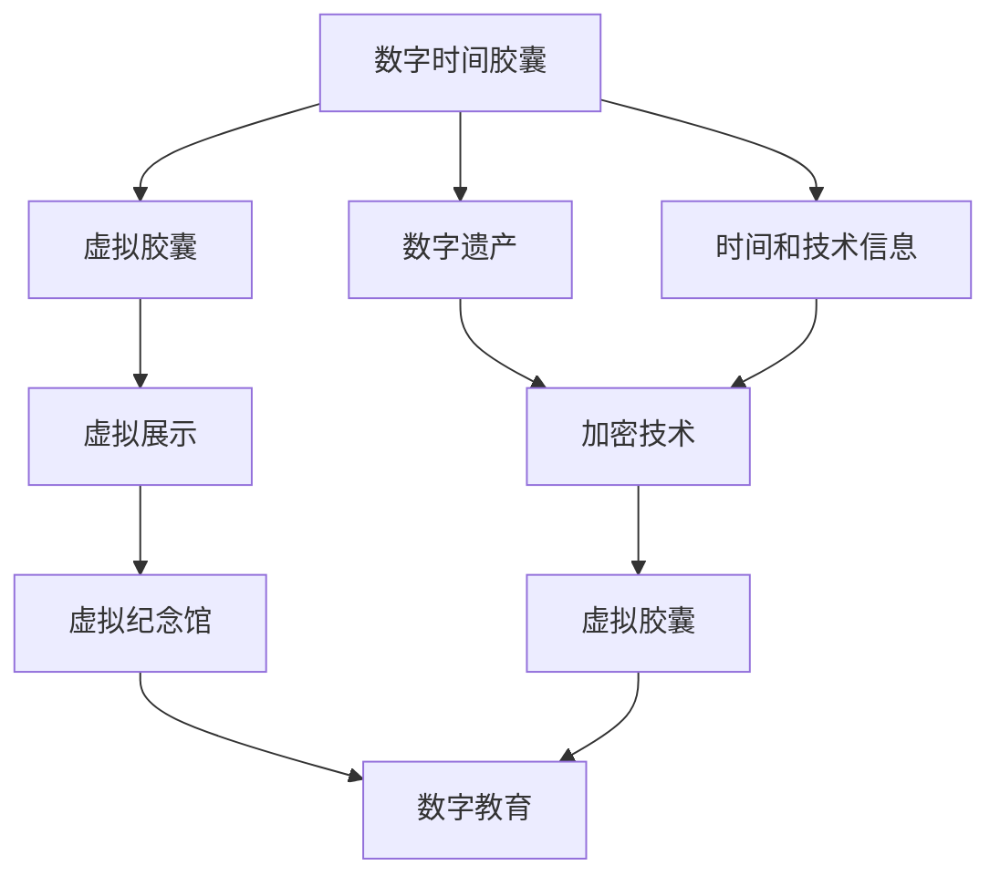

                 

# 2050年的数字遗产：从数字时间胶囊到虚拟纪念馆的数字遗产传承

> 关键词：数字遗产, 数字时间胶囊, 虚拟纪念馆, 文化遗产传承, 数字博物馆, 区块链技术, 数字隐私, 数字教育

## 1. 背景介绍

### 1.1 问题由来

在科技迅速发展的今天，数字遗产的概念已经成为了一个热门话题。数字遗产，即个人、家庭、组织以及整个社会的数字化记忆和信息，包括文字、图片、视频、音频、社交媒体记录等。这些数字遗产不仅仅记录了过去的历史，还承载着知识、情感和文化价值。然而，随着时间的推移，这些数字遗产面临着被遗忘、损坏或丢失的风险。因此，如何有效保护和传承这些数字遗产，成为了一个重要议题。

### 1.2 问题核心关键点

为了解决这个问题，需要采取一系列技术和方法，以确保数字遗产的长期保存、访问和传承。以下是核心关键点：

1. **数字时间胶囊**：将当前的技术和信息封装在数字时间胶囊中，以供未来解锁和研究。
2. **虚拟纪念馆**：构建虚拟纪念馆，通过数字化手段展示和传播文化遗产。
3. **区块链技术**：利用区块链的不可篡改性和透明性，确保数字遗产的真实性和完整性。
4. **数字隐私保护**：在数字遗产的存储和共享过程中，确保个人隐私不被侵犯。
5. **数字教育**：通过数字遗产的教育应用，使更多人了解和参与到数字遗产的保护和传承中。

这些关键点构成了一个完整的数字遗产传承框架，旨在实现数字遗产的保护、访问和传承。

## 2. 核心概念与联系

### 2.1 核心概念概述

数字遗产传承的核心概念包括：

- **数字时间胶囊**：通过数字手段将当前的技术、信息和文化遗产封装在一个虚拟容器中，供未来解锁和研究。
- **虚拟纪念馆**：利用数字技术构建的虚拟空间，展示和传播文化遗产，为公众提供教育和文化体验。
- **区块链技术**：一种分布式账本技术，通过去中心化和不可篡改性确保数字遗产的真实性和完整性。
- **数字隐私保护**：在数字遗产的存储和共享过程中，保护个人隐私，确保数据的安全性和合法性。
- **数字教育**：通过数字遗产的教育应用，提升公众对数字遗产价值的认识和理解，促进文化传承。

### 2.2 核心概念原理和架构的 Mermaid 流程图



这个流程图展示了数字遗产传承的整个过程。首先，将数字遗产和相关技术和信息封装在数字时间胶囊中，通过加密技术确保其安全性。然后，将虚拟胶囊上传到虚拟纪念馆，供公众访问和学习。同时，通过数字教育应用，提升公众对数字遗产的认识和参与。

## 3. 核心算法原理 & 具体操作步骤

### 3.1 算法原理概述

数字遗产传承的核心算法包括：

- **数字时间胶囊封装算法**：将数字遗产、技术和时间信息封装在虚拟胶囊中，确保其完整性和真实性。
- **虚拟胶囊加密算法**：利用加密技术保护胶囊中的数据，防止未授权访问。
- **虚拟纪念馆构建算法**：通过虚拟现实和增强现实技术，构建虚拟纪念馆，展示和传播文化遗产。
- **数字教育应用算法**：设计教育应用，利用数字遗产进行历史和文化教育，提升公众对数字遗产的认识。

### 3.2 算法步骤详解

**步骤 1: 数字时间胶囊的封装**

1. 收集数字遗产，包括文本、图片、视频等。
2. 对数字遗产进行分类和整理，确定保存的重要性和优先级。
3. 选择适合的容器格式，如HTML、XML、JSON等。
4. 将数字遗产封装在虚拟胶囊中，使用标准格式和元数据描述。

**步骤 2: 虚拟胶囊的加密**

1. 选择适合的加密算法，如AES、RSA等。
2. 对虚拟胶囊进行加密，确保只有授权人员可以访问。
3. 生成加密密钥，并安全存储在可信第三方机构。

**步骤 3: 虚拟纪念馆的构建**

1. 设计虚拟纪念馆的展示方案，确定展示主题和内容。
2. 利用虚拟现实和增强现实技术，创建虚拟展示环境。
3. 将虚拟胶囊上传到虚拟纪念馆，展示其历史和文化价值。

**步骤 4: 数字教育应用的开发**

1. 设计数字教育应用，利用数字遗产进行历史和文化教育。
2. 开发互动性强的教育内容，如虚拟导览、互动问答等。
3. 通过线上和线下渠道，推广数字教育应用，提升公众对数字遗产的认识。

### 3.3 算法优缺点

**优点**：

- **完整性和真实性**：数字时间胶囊封装了完整的数字遗产，确保了其真实性和完整性。
- **安全性**：虚拟胶囊加密技术确保了数据的安全性和隐私保护。
- **便捷性**：虚拟纪念馆和数字教育应用，提供了便捷的数字遗产访问和教育途径。

**缺点**：

- **技术复杂性**：封装和加密过程需要专业的技术支持。
- **成本高**：数字时间胶囊和虚拟胶囊的存储和维护需要较高的成本。
- **数据量限制**：大容量数据需要更高技术复杂度和成本。

### 3.4 算法应用领域

数字遗产传承的算法可以应用于多个领域，包括：

- **文化遗产保护**：将历史文物、艺术作品等数字化，长期保存和传承。
- **历史研究**：通过数字时间胶囊，研究不同历史时期的科技和文化。
- **教育培训**：利用虚拟纪念馆和数字教育应用，进行历史和文化教育。
- **文化推广**：通过虚拟展示，传播和推广文化遗产。

## 4. 数学模型和公式 & 详细讲解

### 4.1 数学模型构建

数字遗产传承的数学模型包括：

- **时间胶囊的封装模型**：将数字遗产和元数据封装在虚拟胶囊中，使用标准格式和元数据描述。
- **胶囊加密模型**：使用加密算法保护胶囊中的数据，确保其安全性。
- **虚拟展示模型**：利用虚拟现实和增强现实技术，展示数字遗产。
- **数字教育模型**：设计教育应用，利用数字遗产进行历史和文化教育。

### 4.2 公式推导过程

**时间胶囊封装模型**

$$
\text{封装} = \text{数字遗产} + \text{元数据} + \text{容器格式}
$$

**胶囊加密模型**

$$
\text{加密} = f(\text{数据}, \text{密钥}, \text{加密算法})
$$

**虚拟展示模型**

$$
\text{展示} = \text{虚拟胶囊} + \text{虚拟现实} + \text{增强现实}
$$

**数字教育模型**

$$
\text{教育} = \text{数字遗产} + \text{互动教育} + \text{线上线下推广}
$$

### 4.3 案例分析与讲解

以虚拟纪念馆的构建为例，通过虚拟现实技术，可以将历史建筑、文物、艺术品等展示给公众。通过增强现实技术，观众可以通过手机或AR眼镜，与虚拟环境进行互动，了解文物的背景和历史。

## 5. 项目实践：代码实例和详细解释说明

### 5.1 开发环境搭建

为了实践数字遗产传承的技术，需要一个完整的开发环境。以下是一个基本的开发环境搭建步骤：

1. **硬件准备**：准备高性能的计算机和网络设备，支持虚拟现实和增强现实技术。
2. **软件安装**：安装虚拟现实引擎（如Unity、Unreal Engine）和增强现实框架（如ARKit、ARCore）。
3. **数据准备**：收集和整理数字遗产数据，进行分类和整理。
4. **工具准备**：准备数据处理和建模工具（如Python、R、MATLAB等）。

### 5.2 源代码详细实现

以下是虚拟纪念馆构建的Python代码实现，展示了如何将数字遗产数据封装在虚拟胶囊中，并进行虚拟展示：

```python
from cryptography.fernet import Fernet
import json

# 封装数字遗产
def create_capsule(digital_heritage):
    metadata = {
        "date": "2050-01-01",
        "format": "JSON",
        "creator": "数字遗产传承系统"
    }
    capsule = {
        "metadata": metadata,
        "data": digital_heritage
    }
    return capsule

# 加密胶囊
def encrypt_capsule(capsule):
    key = Fernet.generate_key()
    cipher_suite = Fernet(key)
    json_data = json.dumps(capsule)
    cipher_text = cipher_suite.encrypt(json_data.encode('utf-8'))
    return cipher_text, key

# 展示胶囊
def display_capsule(cipher_text):
    # 使用虚拟现实和增强现实技术，展示胶囊内容
    pass
```

### 5.3 代码解读与分析

**封装数字遗产函数**：将数字遗产数据和元数据封装在虚拟胶囊中，生成标准格式的胶囊。

**加密胶囊函数**：使用Fernet加密算法对胶囊进行加密，生成加密密钥和密文。

**展示胶囊函数**：使用虚拟现实和增强现实技术，展示胶囊内容，确保数据的安全性和隐私保护。

## 6. 实际应用场景

### 6.1 智能博物馆

智能博物馆利用虚拟纪念馆技术，展示和传播文化遗产。观众可以通过VR眼镜，进入虚拟的博物馆，与文物进行互动，了解文物的背景和历史。通过数字教育应用，博物馆可以提供历史和艺术教育课程，提升观众的知识水平。

### 6.2 历史研究

历史研究机构可以利用数字时间胶囊，研究不同历史时期的科技和文化。通过解密胶囊，研究人员可以访问数字遗产，进行深入的历史和文化研究。

### 6.3 文化推广

文化部门可以通过虚拟展示和数字教育应用，传播和推广文化遗产。通过线上和线下渠道，吸引更多人关注和参与数字遗产的保护和传承。

### 6.4 未来应用展望

随着技术的进步，数字遗产传承将更加多样化和便捷化。例如，利用区块链技术，确保数字遗产的真实性和完整性；通过AI技术，提供更加个性化和互动性的数字教育应用；利用5G技术，实现更高质量的虚拟展示和互动体验。

## 7. 工具和资源推荐

### 7.1 学习资源推荐

为了帮助开发者系统掌握数字遗产传承的理论基础和实践技巧，推荐以下学习资源：

1. **《数字遗产保护与管理》**：系统介绍数字遗产的概念、价值和保护方法。
2. **《虚拟现实技术与应用》**：详细讲解虚拟现实技术和在文化遗产保护中的应用。
3. **《区块链技术与数字遗产》**：介绍区块链技术在数字遗产保护中的作用和优势。
4. **《数字教育与文化传承》**：探讨数字教育在文化遗产传承中的应用和效果。

### 7.2 开发工具推荐

为了实现数字遗产传承，推荐以下开发工具：

1. **Unity**：一个强大的游戏引擎，支持虚拟现实和增强现实开发。
2. **Unreal Engine**：另一个流行的游戏引擎，支持高质量的虚拟现实和增强现实应用。
3. **ARKit**：苹果提供的增强现实开发框架，支持iOS设备的增强现实应用开发。
4. **ARCore**：谷歌提供的增强现实开发框架，支持Android设备的增强现实应用开发。

### 7.3 相关论文推荐

为了深入了解数字遗产传承的最新进展，推荐以下相关论文：

1. **《数字遗产的长期保存与访问》**：探讨数字遗产的长期保存和访问技术。
2. **《区块链技术在数字遗产保护中的应用》**：介绍区块链技术在数字遗产保护中的实际应用。
3. **《虚拟现实与增强现实在文化遗产保护中的应用》**：研究虚拟现实和增强现实技术在文化遗产保护中的应用效果。
4. **《数字教育在文化遗产传承中的应用》**：探讨数字教育在文化遗产传承中的作用和效果。

## 8. 总结：未来发展趋势与挑战

### 8.1 研究成果总结

本文系统介绍了数字遗产传承的理论基础和实践方法，涵盖数字时间胶囊、虚拟胶囊、虚拟纪念馆、数字隐私保护和数字教育等内容。通过这些技术的综合应用，可以有效保护和传承数字遗产，提升公众对文化遗产的认识和理解。

### 8.2 未来发展趋势

未来，数字遗产传承将更加多样化、便捷化和智能化。区块链技术将确保数字遗产的真实性和完整性，AI技术将提供更加个性化和互动性的数字教育应用，5G技术将实现更高质量的虚拟展示和互动体验。

### 8.3 面临的挑战

尽管数字遗产传承技术已经取得了一些进展，但仍面临一些挑战：

1. **技术复杂性**：数字时间胶囊和虚拟胶囊的封装和加密需要专业的技术支持。
2. **成本高**：数字时间胶囊和虚拟胶囊的存储和维护需要较高的成本。
3. **数据量限制**：大容量数据需要更高技术复杂度和成本。
4. **隐私保护**：在数字遗产的存储和共享过程中，如何保护个人隐私是一个重要问题。

### 8.4 研究展望

未来的研究将重点关注以下几个方面：

1. **技术优化**：提高数字时间胶囊和虚拟胶囊的封装和加密效率，降低成本。
2. **隐私保护**：研究和开发更加安全和透明的数字遗产保护方法，确保个人隐私不被侵犯。
3. **智能展示**：利用AI技术，提升虚拟展示的互动性和个性化程度。
4. **跨平台应用**：研究跨平台数字遗产传承技术，实现更广泛的应用。

## 9. 附录：常见问题与解答

**Q1: 数字时间胶囊如何封装数字遗产？**

A: 数字时间胶囊封装数字遗产的过程包括数据收集、分类、整理、选择容器格式、元数据描述等步骤。首先，收集数字遗产数据，包括文本、图片、视频等。然后，对数据进行分类和整理，确定保存的重要性和优先级。选择合适的容器格式，如HTML、XML、JSON等，将数据封装在虚拟胶囊中，并使用标准格式和元数据描述。

**Q2: 数字时间胶囊如何加密？**

A: 数字时间胶囊的加密过程需要选择合适的加密算法，如AES、RSA等。首先，生成加密密钥，然后使用密钥对胶囊进行加密。生成加密密钥的过程需要在可信第三方机构进行，以确保密钥的安全性。

**Q3: 虚拟纪念馆如何展示数字遗产？**

A: 虚拟纪念馆利用虚拟现实和增强现实技术，展示数字遗产。观众可以通过VR眼镜或AR设备，进入虚拟的展示环境，与文物进行互动，了解文物的背景和历史。通过互动教育应用，博物馆可以提供历史和艺术教育课程，提升观众的知识水平。

**Q4: 数字遗产传承技术在实际应用中需要注意什么？**

A: 数字遗产传承技术在实际应用中需要注意以下几点：

1. **技术复杂性**：封装和加密过程需要专业的技术支持，需要技术团队进行开发和维护。
2. **成本高**：数字时间胶囊和虚拟胶囊的存储和维护需要较高的成本，需要考虑经济可行性。
3. **数据量限制**：大容量数据需要更高技术复杂度和成本，需要合理规划数据存储和传输方式。
4. **隐私保护**：在数字遗产的存储和共享过程中，需要保护个人隐私，确保数据的安全性和合法性。

这些注意事项需要在技术实施和应用推广过程中，得到充分考虑和解决。

---

作者：禅与计算机程序设计艺术 / Zen and the Art of Computer Programming

