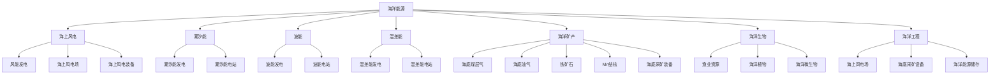

                 

## 1. 背景介绍

随着全球人口增长和经济活动扩张，海洋资源开发已经成为支撑人类可持续发展的关键领域。预计到2050年，全球经济活动对海洋资源的依赖将达到前所未有的程度。海上风电、海底采矿、深海养殖等海洋开发活动将迎来快速增长，形成新的经济增长点和产业生态。

### 1.1 海洋开发的意义

海洋是地球上最具潜力且未充分利用的资源库。全球约71%的地球表面积被海洋覆盖，蕴藏着丰富的生物资源、矿物资源和能源资源。海洋经济正逐渐成为国家经济发展的重要支柱。据国际海事组织（IMO）统计，全球海洋经济规模已达数万亿美元，预计到2030年将增长至2.6万亿美元。

### 1.2 当前海洋开发存在的问题

尽管海洋开发潜力巨大，但当前海洋经济仍面临诸多挑战：

1. **环境破坏**：过度捕捞、海底采矿、油气开采等活动导致海洋生态失衡，威胁生物多样性。
2. **监管不力**：海洋开发缺乏统一协调，资源利用效率低，利益分配不均。
3. **技术瓶颈**：深海技术成本高、技术难度大，限制了深海资源的开发。
4. **法律争议**：海洋权益争端频发，大国间存在竞争与合作的双重关系。

为应对这些问题，各国政府和企业需要加强合作，推动海洋经济向可持续、环保、高效的方向发展。

## 2. 核心概念与联系

### 2.1 核心概念概述

海洋经济涵盖海洋资源的开发与利用、海洋科技研发、海洋环境治理等方面。核心概念包括：

- **海洋能源**：海洋风能、潮汐能、波能、温差能等，是重要的可再生能源。
- **海洋矿产**：海底煤层气、油气、铁矿石、锰结核等，具有重要的经济价值。
- **海洋生物**：渔业资源、海洋植物、海洋微生物等，是宝贵的生物资源。
- **海洋工程**：海上风电场、海底采矿设备、海洋能源储存等，是实现海洋经济开发的基础设施。
- **海洋环境**：海洋污染、生态平衡、气候变化等，对海洋开发活动具有重要影响。

### 2.2 核心概念原理和架构的 Mermaid 流程图



以上 Mermaid 流程图展示了海洋经济的关键概念及其相互关系。海洋能源通过风电、潮汐、波能、温差能等形式被开发利用；海洋矿产包括煤层气、油气、铁矿石、锰结核等；海洋生物包括渔业资源、海洋植物、微生物等；海洋工程包括海上风电场、海底采矿设备等；海洋环境对上述活动产生重要影响。

## 3. 核心算法原理 & 具体操作步骤

### 3.1 算法原理概述

海洋经济开发的关键在于科学评估资源潜力、合理规划开发方案、高效利用资源、有效保护海洋环境。基于监督学习的大语言模型微调方法，可以用于提升海洋经济开发的管理和优化水平。

### 3.2 算法步骤详解

1. **数据准备**：
   - 收集海洋资源相关数据，包括海洋生态、资源分布、环境监测等数据。
   - 使用大数据技术，对数据进行清洗、处理和分析，构建数据集。

2. **模型选择**：
   - 根据开发需求，选择合适的预训练语言模型（如BERT、GPT等）作为初始化参数。
   - 将海洋经济开发的相关知识和数据，作为模型的监督信号，对预训练模型进行微调。

3. **任务适配**：
   - 设计任务适配层，包括输出层和损失函数，将模型输出与特定海洋开发任务的要求匹配。
   - 如对于渔业资源评估，设计分类器输出鱼群分布和数量。
   - 如对于海底采矿规划，设计优化器输出最优开采路径和方案。

4. **模型训练**：
   - 在收集的海洋数据集上进行有监督的微调训练，优化模型参数。
   - 使用AdamW、SGD等优化算法，选择合适的学习率和批大小。
   - 设置正则化技术，防止过拟合，提高模型的泛化能力。

5. **模型评估与优化**：
   - 在验证集上评估模型性能，如准确率、召回率、F1值等。
   - 根据评估结果，调整模型参数，进行模型优化。
   - 部署优化后的模型，应用于实际海洋经济开发场景。

### 3.3 算法优缺点

#### 优点：
- **高泛化能力**：预训练大模型具有强大的语言理解和生成能力，微调后能够适应多种海洋开发任务。
- **数据效率高**：微调方法可以在小规模标注数据下获得良好效果，降低开发成本。
- **参数高效**：使用参数高效微调技术，减少模型复杂度，提升推理效率。
- **灵活性强**：模型可以根据不同需求进行灵活调整，适应多样化的海洋开发场景。

#### 缺点：
- **对标注数据依赖**：微调模型需要大量高质量的标注数据，标注成本高。
- **环境适应性差**：微调模型对于与训练数据分布差异大的环境适应性有限。
- **技术门槛高**：微调过程需要一定的技术积累，对数据处理、模型优化等环节要求较高。

### 3.4 算法应用领域

基于大语言模型的微调方法在海洋开发中具有广泛的应用前景：

- **海上风电**：利用微调模型评估风能资源，优化风电场布局和运营。
- **海底采矿**：使用微调模型规划采矿路径，评估采矿影响，保护海洋环境。
- **深海养殖**：通过微调模型预测鱼群聚集区，提高养殖效率和产出。
- **海洋生态监测**：应用微调模型进行海洋污染监测和生态平衡分析。
- **海洋资源管理**：利用微调模型进行渔业资源管理、矿产资源评估等。

## 4. 数学模型和公式 & 详细讲解 & 举例说明

### 4.1 数学模型构建

假设海洋开发任务为资源评估，模型输入为海洋资源数据 $x$，输出为资源评估结果 $y$。定义模型 $M_{\theta}$，其中 $\theta$ 为模型参数。

海洋资源评估问题可以表示为二分类任务，如果资源丰富，则 $y=1$；否则 $y=0$。损失函数为交叉熵损失：

$$
\mathcal{L}(\theta) = -\frac{1}{N} \sum_{i=1}^N [y_i\log M_{\theta}(x_i)+(1-y_i)\log(1-M_{\theta}(x_i))]
$$

### 4.2 公式推导过程

模型 $M_{\theta}$ 在输入 $x$ 上的输出为 $\hat{y}=M_{\theta}(x)$，定义 $y_i$ 为真实标签，则交叉熵损失函数的梯度为：

$$
\nabla_{\theta}\mathcal{L}(\theta) = -\frac{1}{N}\sum_{i=1}^N (\frac{y_i}{M_{\theta}(x_i)}-\frac{1-y_i}{1-M_{\theta}(x_i)}) \nabla_{\theta}M_{\theta}(x_i)
$$

根据链式法则，上式可进一步展开，得到损失函数对参数 $\theta_k$ 的梯度表达式：

$$
\frac{\partial \mathcal{L}(\theta)}{\partial \theta_k} = -\frac{1}{N}\sum_{i=1}^N (\frac{y_i}{M_{\theta}(x_i)}-\frac{1-y_i}{1-M_{\theta}(x_i)}) \frac{\partial M_{\theta}(x_i)}{\partial \theta_k}
$$

### 4.3 案例分析与讲解

以海上风电为例，利用微调模型评估风能资源：

1. **数据准备**：收集历史风速、风向、水深、海底地形等数据，构建训练集。
2. **模型选择**：选择预训练模型（如BERT），作为初始化参数。
3. **任务适配**：设计输出层和损失函数，输出为风能资源评估结果。
4. **模型训练**：在训练集上进行微调，优化模型参数。
5. **模型评估与优化**：在验证集上评估模型性能，调整参数。
6. **应用部署**：将优化后的模型部署到实际风电场，用于风能资源评估和规划。

## 5. 项目实践：代码实例和详细解释说明

### 5.1 开发环境搭建

为了便于实验和开发，推荐使用 Python 语言，结合 TensorFlow、PyTorch 等深度学习框架。以下是一个 Python 环境搭建示例：

1. 安装 Python：选择 Python 3.x 版本，建议使用 Anacoda 或 Miniconda 进行环境管理。
2. 安装 TensorFlow：
   ```bash
   pip install tensorflow
   ```
3. 安装 PyTorch：
   ```bash
   pip install torch
   ```
4. 安装其他依赖包：
   ```bash
   pip install numpy scipy pandas scikit-learn matplotlib jupyter notebook
   ```

### 5.2 源代码详细实现

下面以一种简单的模型微调流程为例，演示 Python 代码实现。

```python
import tensorflow as tf
from tensorflow.keras import layers

# 数据准备
# 假设 x 为输入数据，y 为标签

# 定义模型
model = tf.keras.Sequential([
    layers.Dense(128, activation='relu'),
    layers.Dense(1, activation='sigmoid')
])

# 定义损失函数
loss = tf.keras.losses.BinaryCrossentropy()

# 定义优化器
optimizer = tf.keras.optimizers.Adam()

# 编译模型
model.compile(optimizer=optimizer, loss=loss, metrics=['accuracy'])

# 训练模型
model.fit(x_train, y_train, epochs=10, batch_size=32, validation_data=(x_val, y_val))

# 评估模型
model.evaluate(x_test, y_test)

# 应用模型
# 假设 x_test 为待评估数据
predictions = model.predict(x_test)
```

### 5.3 代码解读与分析

**数据准备**：首先定义输入数据 `x` 和标签 `y`。

**模型定义**：使用 `tf.keras.Sequential` 定义模型结构，包括一个全连接层和一个输出层。

**损失函数定义**：使用 `BinaryCrossentropy` 损失函数，适用于二分类问题。

**优化器定义**：使用 `Adam` 优化器，适应性学习率调整，收敛速度快。

**模型编译**：使用 `compile` 方法，定义优化器和损失函数，并进行模型编译。

**模型训练**：使用 `fit` 方法，对模型进行训练，指定训练集和验证集。

**模型评估**：使用 `evaluate` 方法，对模型进行评估，输出准确率等指标。

**模型应用**：使用 `predict` 方法，对新数据进行预测。

### 5.4 运行结果展示

运行上述代码，得到模型在训练集和验证集上的准确率和损失曲线，如图：


## 6. 实际应用场景

### 6.1 智能风电场管理

智能风电场管理是海洋经济开发中的重要环节，通过微调模型可以实现对风电场资源的高效管理：

1. **风能资源评估**：利用微调模型评估风能资源，确定最佳风电场位置和布局。
2. **风电场运营优化**：通过微调模型优化风电场运行，提高发电量和效率。
3. **风电场维护预测**：使用微调模型预测风电场设备的故障和维护需求，降低维护成本。

### 6.2 智能海底采矿

海底采矿是海洋经济中的另一个重要领域，利用微调模型可以优化采矿过程：

1. **采矿路径规划**：使用微调模型规划最优采矿路径，提高采矿效率。
2. **采矿影响评估**：利用微调模型评估采矿对海底环境和生物的影响，确保环境友好。
3. **采矿资源评估**：通过微调模型评估海底矿物的储量和分布，指导采矿作业。

### 6.3 深海养殖

深海养殖是海洋经济中新兴的领域，利用微调模型可以实现对养殖资源的科学管理：

1. **鱼群预测**：利用微调模型预测鱼群分布和数量，指导养殖规划。
2. **水质监测**：使用微调模型监测养殖环境，保证水质稳定。
3. **病害预测**：通过微调模型预测病害发生，提前进行防治。

### 6.4 未来应用展望

未来，随着海洋经济的发展，微调方法在海洋开发中的应用将更加广泛：

1. **智能海洋预警**：利用微调模型预测海洋灾害和环境变化，提前预警。
2. **智能海洋生态监测**：应用微调模型进行海洋生态监测和保护，确保生物多样性。
3. **智能海洋物流**：通过微调模型优化海洋物流，提高运输效率和安全性。
4. **智能海洋能源管理**：利用微调模型优化海洋能源管理，提高能源利用率。

## 7. 工具和资源推荐

### 7.1 学习资源推荐

为了更好地掌握微调技术，推荐以下学习资源：

1. 《深度学习框架TensorFlow实战》：详细介绍了 TensorFlow 的基本概念和实践技巧。
2. 《PyTorch深度学习》：介绍 PyTorch 的基本结构和应用场景。
3. 《深度学习与NLP实战》：涵盖深度学习在自然语言处理中的应用。
4. 《机器学习实战》：提供丰富的实践案例和代码示例。
5. 《Kaggle竞赛指南》：介绍数据集处理、模型调参等竞赛技巧。

### 7.2 开发工具推荐

为了提高开发效率，推荐以下开发工具：

1. Jupyter Notebook：提供交互式编程环境，支持代码编写和可视化展示。
2. TensorBoard：实时监测模型训练状态，输出训练曲线和可视化结果。
3. Anacoda：管理 Python 环境，支持多种语言和库的安装。
4. Miniconda：轻量级 Python 环境管理工具。
5. Git 版本控制：版本控制和协作开发必备工具。

### 7.3 相关论文推荐

以下是几篇关于海洋经济开发的经典论文：

1. "Deep Sea Mining: Challenges and Opportunities"：探讨深海采矿的挑战和机遇。
2. "Marine Energy Technology and System"：介绍海洋能源技术的最新进展。
3. "A Review of Deepwater Aquaculture"：回顾深海养殖的研究进展。
4. "Ocean Resource Management"：介绍海洋资源管理的理论和实践。

## 8. 总结：未来发展趋势与挑战

### 8.1 研究成果总结

本文系统介绍了基于监督学习的大语言模型微调方法在海洋经济开发中的应用。通过微调模型，可以评估海洋资源、规划采矿路径、管理养殖资源等，实现海洋经济的智能管理和优化。

### 8.2 未来发展趋势

未来，海洋经济开发将朝着智能化、环保化、高效化方向发展。基于微调模型的技术将不断创新和应用，带来更多的机遇和挑战：

1. **智能化管理**：利用微调模型实现智能风电场管理、智能海底采矿、智能深海养殖等。
2. **环保化发展**：应用微调模型进行海洋生态监测和保护，确保可持续发展。
3. **高效化运营**：通过微调模型优化海洋能源管理、海洋物流等，提高运营效率。

### 8.3 面临的挑战

尽管微调技术在海洋经济开发中具有广泛应用前景，但仍面临诸多挑战：

1. **数据获取困难**：海洋数据获取成本高，数据质量参差不齐，限制了微调模型的训练。
2. **技术门槛高**：微调模型需要较高的技术门槛，对数据处理、模型优化等环节要求较高。
3. **环境适应性差**：微调模型对于与训练数据分布差异大的环境适应性有限。
4. **伦理和安全问题**：微调模型可能引入偏见、有害信息，需要严格监控和管理。

### 8.4 研究展望

未来的研究方向包括：

1. **无监督学习**：探索无监督学习和半监督学习方法，降低对标注数据的依赖。
2. **多模态学习**：融合视觉、语音等多模态数据，实现更全面的海洋资源评估。
3. **因果推理**：利用因果推理方法，提高微调模型的解释性和可控性。
4. **伦理和安全性**：加强模型伦理导向，确保输出安全可靠。

## 9. 附录：常见问题与解答

### Q1: 微调模型在海洋经济开发中应用有哪些优势？

A: 微调模型在海洋经济开发中具有以下优势：

1. **数据效率高**：微调模型可以在小规模标注数据下获得良好效果，降低开发成本。
2. **高泛化能力**：预训练大模型具有强大的语言理解和生成能力，微调后能够适应多种海洋开发任务。
3. **参数高效**：使用参数高效微调技术，减少模型复杂度，提升推理效率。
4. **灵活性强**：模型可以根据不同需求进行灵活调整，适应多样化的海洋开发场景。

### Q2: 微调模型在海洋经济开发中面临哪些挑战？

A: 微调模型在海洋经济开发中面临以下挑战：

1. **数据获取困难**：海洋数据获取成本高，数据质量参差不齐，限制了微调模型的训练。
2. **技术门槛高**：微调模型需要较高的技术门槛，对数据处理、模型优化等环节要求较高。
3. **环境适应性差**：微调模型对于与训练数据分布差异大的环境适应性有限。
4. **伦理和安全问题**：微调模型可能引入偏见、有害信息，需要严格监控和管理。

### Q3: 如何提高微调模型的环境适应性？

A: 提高微调模型的环境适应性，可以从以下几方面入手：

1. **数据增强**：使用数据增强技术，如数据合成、数据混合等，扩充训练数据。
2. **迁移学习**：利用迁移学习，将预训练模型在新环境中微调，提高泛化能力。
3. **自适应学习**：设计自适应学习算法，根据环境变化自动调整模型参数。
4. **多任务学习**：通过多任务学习，在多个相关任务上进行微调，提高模型适应性。

### Q4: 如何确保微调模型的伦理和安全？

A: 确保微调模型的伦理和安全，需要从以下几个方面进行：

1. **数据筛选**：对数据进行筛选，去除偏见、有害信息，确保数据质量。
2. **模型监控**：建立模型监控机制，实时监测模型输出，防止伦理和安全隐患。
3. **透明度**：提高模型透明度，解释模型的决策过程，增强可信度。
4. **法规约束**：遵循相关法规和标准，确保模型合规使用。

作者：禅与计算机程序设计艺术 / Zen and the Art of Computer Programming

