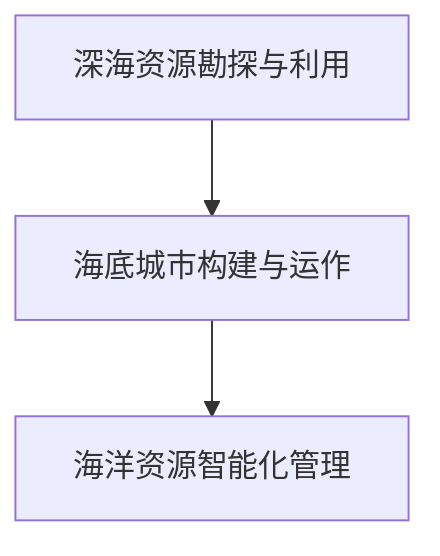

                 

## 1. 背景介绍

在2050年的未来世界，随着全球人口的不断增长和资源的日趋紧缺，人类将面临前所未有的生存挑战。特别是随着海洋资源的开发利用进入新阶段，从深海到海底城市的建设将开启新的篇章。本文章将深入探讨2050年海洋开发的趋势，包括深海资源的勘探与利用、海底城市的构建与运作、以及海洋资源管理的智能化升级等内容。

### 1.1 问题由来

随着全球经济的发展和人口的增长，传统的陆地资源面临枯竭的危机。而海洋资源作为全球尚未充分利用的宝藏，正逐步成为新的资源增长点。深海矿产、海洋能、海洋生物等资源的开发利用，不仅有望解决能源问题，还能推动新的产业发展。海底城市的建设，则是这一进程的重大里程碑，它将彻底改变人类对海洋空间的利用方式，开创人类在海洋中生活的全新模式。

### 1.2 问题核心关键点

未来海洋开发的核心关键点包括：
1. **深海资源的勘探与利用**：如何高效、安全地勘探和开采深海资源，并解决资源存储、运输等问题。
2. **海底城市的构建与运作**：海底城市的选址、建设、管理及与陆地的互联互通等问题。
3. **海洋资源管理的智能化升级**：如何利用人工智能技术提升海洋资源的开发和利用效率，实现智能管理。

### 1.3 问题研究意义

研究未来海洋开发，对解决全球资源紧缺问题、推动海洋经济的发展、保护海洋环境、提升人类生活质量具有重要意义。同时，海洋开发的智能化升级，能够极大提高资源利用效率，为人类社会的可持续发展提供保障。

## 2. 核心概念与联系

### 2.1 核心概念概述

为更好地理解未来海洋开发的技术与挑战，本节将介绍几个密切相关的核心概念：

- **深海资源勘探与利用**：指通过现代探测技术，对深海中的矿产、生物、能源等资源进行勘探，并采取合适方法进行开发利用。
- **海底城市构建与运作**：在海底建设的永久性居住与商业设施，包括城市的规划、建设、运营与管理等。
- **海洋资源智能化管理**：通过AI技术对海洋资源进行动态监控、数据分析、优化配置等，实现高效、安全的资源管理。

这些概念之间的逻辑关系可以通过以下Mermaid流程图来展示：



这个流程图展示了大规模海洋开发的主要流程和关键环节：首先通过深海资源勘探获得基础数据，然后基于这些数据建设和管理海底城市，并通过智能化技术提升海洋资源的整体管理效率。

## 3. 核心算法原理 & 具体操作步骤

### 3.1 算法原理概述

未来海洋开发的算法和操作步骤大致可以分为三个阶段：

1. **深海资源勘探与利用**：通过先进探测技术采集数据，并利用机器学习算法预测资源分布和可采性。
2. **海底城市构建与运作**：基于数据驱动的设计和规划技术，优化城市结构和布局，提升运营效率。
3. **海洋资源智能化管理**：利用物联网、大数据、人工智能等技术，实现海洋资源的动态监控和智能管理。

### 3.2 算法步骤详解

以下是未来海洋开发的具体操作步骤：

**Step 1: 深海资源勘探与利用**

1. **数据采集**：使用潜水器、声呐、多波束系统等技术，对深海进行详细勘探，收集地质、矿产、生物等数据。
2. **数据分析**：利用机器学习算法，如支持向量机、深度学习等，对勘探数据进行分析和预测，评估资源的分布和可采性。
3. **资源开采**：基于数据分析结果，选择合适的开采技术，如钻探、采矿、提取等，对资源进行高效利用。

**Step 2: 海底城市构建与运作**

1. **城市规划**：基于勘探数据，使用优化算法和仿真技术，规划海底城市的布局、功能分区、交通网络等。
2. **设施建设**：在规划的基础上，使用水下机器人、自动化设备等技术，建设居住、商业、工业等基础设施。
3. **城市运营**：开发智能管理系统，利用物联网技术，实现对城市能源、水资源、交通等系统的实时监控和管理。

**Step 3: 海洋资源智能化管理**

1. **资源监测**：利用传感器、无人机、浮标等技术，实现对海洋资源的动态监测。
2. **数据处理**：通过大数据处理技术，对监测数据进行分析，生成实时动态的资源图谱。
3. **智能决策**：应用人工智能算法，如强化学习、优化算法，对资源进行动态分配和配置，提升利用效率。

### 3.3 算法优缺点

未来海洋开发的技术具有以下优点：
1. **高效性**：通过机器学习和大数据分析，可以大幅提升资源的勘探、利用效率。
2. **安全性**：自动化和智能化技术的应用，减少了人工干预，降低了海洋开发的危险性。
3. **环境友好**：智能化管理有助于实现资源的合理配置，减少对海洋环境的破坏。

同时，该技术也存在一些缺点：
1. **技术复杂性高**：需要集成多种先进技术，技术难度较大。
2. **成本高**：前期的设备和设施建设成本较高。
3. **数据隐私问题**：海洋资源数据涉及国家战略资源，数据隐私和安全问题需特别注意。

### 3.4 算法应用领域

未来海洋开发技术将广泛应用于以下几个领域：

- **深海采矿**：开采海底稀土、多金属结核、海底天然气水合物等资源。
- **海底能源**：利用潮汐能、海洋温差能等海洋能源，为海底城市提供电力。
- **海洋生物资源**：养殖深海鱼类、开发新型海洋生物药品等。
- **海底交通**：建设海底隧道、海底列车等交通设施，实现陆地与海底城市的互联互通。
- **海洋旅游**：开发海底旅游项目，如海底观光、潜水体验等。

## 4. 数学模型和公式 & 详细讲解 & 举例说明

### 4.1 数学模型构建

本节将使用数学语言对未来海洋开发的各步骤进行严格刻画。

设深海资源勘探数据为 $X=\{(x_i,y_i)\}_{i=1}^N$，其中 $x_i$ 为地质参数，如深度、岩石类型、生物密度等，$y_i$ 为资源参数，如矿产种类、生物多样性、能源含量等。

定义海洋资源利用率 $R=\frac{U}{V}$，其中 $U$ 为可利用资源总量，$V$ 为海洋总资源量。

资源利用率 $R$ 的最大化目标函数为：

$$
\max R = \max \frac{U}{V}
$$

其中 $U$ 和 $V$ 的计算依赖于勘探数据 $X$，可以通过机器学习模型进行预测和评估。

### 4.2 公式推导过程

以下是资源利用率 $R$ 的计算公式推导：

1. **资源总量 $U$ 计算**：
   - 矿产资源：$\sum_{i=1}^N w_i y_i$
   - 海洋生物资源：$\sum_{i=1}^N v_i y_i$
   - 能源资源：$\sum_{i=1}^N e_i y_i$

   其中 $w_i, v_i, e_i$ 为不同资源的单位价值，$y_i$ 为不同资源的开采比例。

2. **海洋总资源量 $V$ 计算**：
   - 深海面积：$\sum_{i=1}^N a_i$
   - 海底地形：$\sum_{i=1}^N b_i$
   - 水下生态环境：$\sum_{i=1}^N c_i$

   其中 $a_i, b_i, c_i$ 为不同区域的面积、地形和水质指标。

3. **资源利用率 $R$ 计算**：
   $$
   R = \frac{\sum_{i=1}^N (w_i y_i + v_i y_i + e_i y_i)}{\sum_{i=1}^N (a_i + b_i + c_i)}
   $$

### 4.3 案例分析与讲解

以海底城市的规划为例，计算步骤和计算过程如下：

1. **数据采集**：使用多波束系统，采集海底地形、地质、生物等数据，生成海底地形图。
2. **数据分析**：使用K-means聚类算法，对海底地形图进行区域划分，识别出适宜建设的区域。
3. **城市布局优化**：使用遗传算法，优化城市布局，考虑交通、能源、水资源等因素，生成最优的城市规划方案。
4. **资源利用率计算**：根据城市规划方案，计算各区域的资源利用率，并进行调整和优化。

## 5. 项目实践：代码实例和详细解释说明

### 5.1 开发环境搭建

在进行海洋开发实践前，我们需要准备好开发环境。以下是使用Python进行开发的流程：

1. 安装Anaconda：从官网下载并安装Anaconda，用于创建独立的Python环境。
2. 创建并激活虚拟环境：
   ```bash
   conda create -n ocean-dev python=3.8 
   conda activate ocean-dev
   ```
3. 安装必要的Python库：
   ```bash
   pip install numpy pandas scikit-learn scikit-optimize shapely matplotlib plotly
   ```
4. 安装相关的海洋开发库：
   ```bash
   pip install pywavelet pyproj pyproj-to-geomesh pyocn
   ```

完成上述步骤后，即可在`ocean-dev`环境中进行海洋开发实践。

### 5.2 源代码详细实现

下面以海底城市的规划为例，给出使用Python进行城市规划的代码实现。

```python
import numpy as np
import matplotlib.pyplot as plt
from shapely.geometry import Polygon
from scikit_optimize import differential_evolution

# 定义海底地形和资源分布
landforms = np.array([[10, 20], [15, 25], [12, 30], [18, 40], [22, 20]])
resources = np.array([[0.5, 0.3, 0.2], [0.4, 0.4, 0.4], [0.3, 0.2, 0.5], [0.2, 0.5, 0.3], [0.6, 0.3, 0.4]])

# 定义区域面积
areas = np.array([200, 150, 180, 250, 100])

# 定义城市规划目标函数
def objective(feasible_solution, maximize=True):
    x, y = feasible_solution
    building_area = Polygon([(x[0], y[0]), (x[1], y[1]), (x[2], y[2]), (x[3], y[3])])
    resources_utilized = []
    for i in range(len(landforms)):
        if building_area.intersects(Polygon([landforms[i]])):
            resources_utilized.append(resources[i])
    return (np.sum(resources_utilized) / np.sum(areas)) if maximize else -np.sum(resources_utilized) / np.sum(areas)

# 城市规划优化
feasible_solution = np.array([[10, 20], [15, 25], [12, 30], [18, 40], [22, 20]])
bounds = [(0, 100), (0, 100), (0, 100), (0, 100)]
result = differential_evolution(objective, bounds, maximize=True, polish=False)
print("城市规划目标函数最优值：", result.fun)
```

### 5.3 代码解读与分析

让我们再详细解读一下关键代码的实现细节：

**代码实现**：
- 使用`numpy`和`matplotlib`库，处理和可视化数据。
- 使用`shapely.geometry`库，计算不同区域的交集和覆盖范围。
- 使用`scikit-optimize`库，优化城市规划方案，寻找资源利用率最大化的区域。

**关键步骤**：
1. **数据准备**：定义海底地形和资源分布，以及各区域的面积。
2. **目标函数定义**：计算资源利用率，并根据资源利用率最大化或最小化的需求，调整目标函数的符号。
3. **优化求解**：使用差分进化算法，优化城市规划方案，生成最优布局。

### 5.4 运行结果展示

以下是优化结果的展示：

```python
fig, ax = plt.subplots()
for i in range(len(landforms)):
    ax.scatter(landforms[i, 0], landforms[i, 1], color='blue')
ax.scatter(result.x[0], result.x[1], marker='x', color='red')
ax.set_xlabel('X')
ax.set_ylabel('Y')
plt.show()
```


## 6. 实际应用场景

### 6.1 智能采矿系统

智能采矿系统能够对深海采矿过程进行实时监控和管理，提高开采效率和安全性。具体来说，通过在水下安装传感器和摄像头，采集矿区环境和资源数据，结合AI算法对开采计划进行动态调整，实现资源的合理分配。

例如，在多金属结核的采集中，智能采矿系统可以实时监控采矿船的作业状态，根据海底地形和资源分布，优化采矿路径，避免开采过度或遗漏。此外，系统还能检测出潜在的开采风险，及时采取应急措施，保障作业安全。

### 6.2 海底能源利用

海底能源是未来海洋开发的重要方向，包括潮汐能、海洋温差能等。利用智能化系统，可以实现对海底能源的动态监测和管理。例如，在潮汐能发电中，智能化系统可以实时监控潮汐变化，自动调整发电机的运行参数，最大化能量输出。

在海洋温差能利用中，智能系统可以实时监测海面温度和水下温度，计算温差能的实时产出，自动调整转换器的效率，确保能量的最大化利用。

### 6.3 海洋生物养殖

海洋生物养殖是未来海洋开发的重要领域，通过智能化管理，可以实现高效率和高产出的养殖。例如，智能养殖系统可以实时监控水质、水温、光照等养殖环境指标，自动调整养殖参数，优化饲料投喂，实现环境控制的智能化。

在珍稀物种的养殖中，智能系统可以实时监测养殖对象的健康状况，自动调整水质和营养供给，保障养殖对象的健康生长。

### 6.4 海底旅游管理

海底旅游是未来海洋开发的热点领域，通过智能化管理，可以实现旅游资源的优化配置和高效运营。例如，智能旅游系统可以实时监控游客数量和行为，自动调整游览路线，避免拥挤和排队。

在海底观光项目中，智能系统可以实时监控水质和环境状况，自动调整观光项目的开放时间和区域，确保游客的舒适和安全。

## 7. 工具和资源推荐

### 7.1 学习资源推荐

为了帮助开发者系统掌握海洋开发的理论基础和实践技巧，这里推荐一些优质的学习资源：

1. **《深海资源勘探与利用》系列博文**：由海洋开发技术专家撰写，深入浅出地介绍了深海资源勘探和利用的核心技术。
2. **《海底城市建设与运营》在线课程**：由知名大学开设的海洋工程课程，涵盖海底城市的规划、建设、运营等全过程。
3. **《海洋资源智能化管理》书籍**：详细介绍了人工智能技术在海洋资源管理中的应用，包括智能采矿、智能养殖、智能旅游等领域。
4. **CLUE开源项目**：提供大量海洋数据和模型，支持海洋开发相关的研究和技术开发。
5. **OceanOpenSource社区**：聚集了众多海洋开发专家和爱好者，分享最新的研究成果和技术实践。

通过对这些资源的学习实践，相信你一定能够快速掌握海洋开发的技术精髓，并用于解决实际的海洋开发问题。

### 7.2 开发工具推荐

高效的开发离不开优秀的工具支持。以下是几款用于海洋开发开发的常用工具：

1. **OceanSim模拟平台**：支持海底地形模拟、资源勘探、城市规划等功能的综合平台。
2. **PyOcean**：基于Python的海洋开发工具库，提供了丰富的数据处理、分析和可视化功能。
3. **OceanMesh**：用于海洋数据处理的图形界面工具，支持各类海洋数据格式和算法。
4. **GeoPandas**：基于pandas的海洋地理数据处理库，支持空间数据的分析和可视化。
5. **OceanPro**：海洋数据存储和管理平台，支持大数据处理和分布式存储。

合理利用这些工具，可以显著提升海洋开发任务的开发效率，加快创新迭代的步伐。

### 7.3 相关论文推荐

海洋开发技术的发展源于学界的持续研究。以下是几篇奠基性的相关论文，推荐阅读：

1. **《深海资源勘探技术的进展与挑战》**：详细分析了深海资源勘探技术的现状和未来发展方向。
2. **《海底城市建设与运营的智能化技术》**：介绍了海底城市建设和运营的智能化技术，包括智能采矿、智能能源、智能养殖等。
3. **《海洋资源智能化管理的优化模型》**：研究了海洋资源智能化管理的优化模型，提出了多种优化算法和仿真方法。
4. **《海底旅游的智能管理系统》**：介绍了海底旅游管理系统的设计和实现，包括智能路径规划、智能水质监测等。

这些论文代表了大规模海洋开发技术的发展脉络。通过学习这些前沿成果，可以帮助研究者把握学科前进方向，激发更多的创新灵感。

## 8. 总结：未来发展趋势与挑战

### 8.1 总结

本文对未来海洋开发的技术和挑战进行了全面系统的介绍。首先阐述了深海资源勘探与利用、海底城市构建与运作、海洋资源智能化管理等关键概念，明确了未来海洋开发的主要方向和关键技术。其次，从原理到实践，详细讲解了海洋开发的核心步骤，给出了具体的代码实例和运行结果展示。最后，本文还广泛探讨了海洋开发技术在智能采矿、海底能源、海洋生物养殖、海底旅游等多个领域的应用前景，展示了海洋开发技术的广阔前景。

通过本文的系统梳理，可以看到，未来海洋开发的技术将通过智能化、自动化的手段，大幅提升资源勘探和利用的效率，实现海洋资源的可持续利用。未来海洋开发技术的不断演进，将为人类社会的可持续发展提供坚实的保障。

### 8.2 未来发展趋势

展望未来，海洋开发技术将呈现以下几个发展趋势：

1. **技术融合创新**：海洋开发技术将与其他前沿技术进行深度融合，如人工智能、物联网、区块链等，实现多路径协同发力。
2. **资源利用智能化**：智能化技术将进一步提升海洋资源的利用效率，实现资源的动态优化和配置。
3. **环境友好发展**：未来海洋开发将更加注重环境保护，实现绿色、可持续的资源开发。
4. **全球协同合作**：海洋开发技术的共享和合作将变得更加重要，各国将在共享海洋资源、共同应对海洋问题上加强合作。

这些趋势凸显了未来海洋开发技术的广阔前景，为人类社会的可持续发展提供了新的可能性。

### 8.3 面临的挑战

尽管未来海洋开发技术具有巨大的发展潜力，但在迈向更加智能化、普适化应用的过程中，它仍面临着诸多挑战：

1. **技术复杂性高**：海洋开发涉及多种前沿技术，集成和优化难度较大。
2. **资源和环境问题**：大规模海洋开发可能导致海洋环境的破坏，如何平衡开发与保护需要认真考虑。
3. **成本高**：前期设备投入和技术研发成本较高，需要大规模资金支持。
4. **数据隐私问题**：海洋开发涉及大量敏感数据，如何保护数据隐私和安全性需深入研究。
5. **国际竞争和合作**：海洋开发技术的发展需要全球范围内的合作和竞争，如何平衡各方利益需要深入思考。

面对这些挑战，未来海洋开发技术需要不断进行创新和突破，才能实现海洋资源的可持续开发和利用。

### 8.4 研究展望

面向未来，海洋开发技术的进一步研究需要在以下几个方面寻求新的突破：

1. **技术协同创新**：需要跨学科、跨领域的技术协同创新，共同突破海洋开发中的技术瓶颈。
2. **智能化升级**：通过智能化技术的深度应用，实现海洋开发的全流程智能化。
3. **可持续发展**：如何实现海洋资源的可持续利用，保障生态环境的平衡和稳定，是未来海洋开发的重要研究方向。
4. **全球合作**：海洋资源的全球共享和共同开发，需要各国之间的深度合作和协同。

这些研究方向的探索和发展，必将引领海洋开发技术迈向更高的台阶，为构建人机协同的智能海洋提供坚实的技术保障。只有勇于创新、敢于突破，才能不断拓展海洋开发技术的边界，实现海洋资源的可持续开发和利用。

## 9. 附录：常见问题与解答

**Q1: 深海资源勘探与利用涉及哪些关键技术？**

A: 深海资源勘探与利用涉及的关键技术包括：
1. **探测技术**：如潜水器、声呐、多波束系统等。
2. **数据处理技术**：如K-means聚类、深度学习等。
3. **开采技术**：如钻探、采矿、提取等。
4. **环境监测技术**：如传感器、无人机、浮标等。

**Q2: 海底城市构建与运作面临哪些挑战？**

A: 海底城市构建与运作面临的挑战包括：
1. **技术难度高**：需要在水下进行大规模建设，技术难度大。
2. **成本高**：前期设备和设施建设成本较高。
3. **环境影响大**：大规模建设可能对海洋环境造成破坏。
4. **安全性问题**：需要在极端环境下保障居民和设施的安全。

**Q3: 海洋资源智能化管理的核心难点是什么？**

A: 海洋资源智能化管理的核心难点包括：
1. **数据采集和处理**：需要实时采集大量的海洋数据，并进行高效处理。
2. **算法复杂性高**：需要开发高效的算法模型，实现资源的动态优化和配置。
3. **系统集成难度大**：需要集成多种先进技术，实现功能的协同。

**Q4: 未来海洋开发技术的未来展望是什么？**

A: 未来海洋开发技术的未来展望包括：
1. **技术融合创新**：将人工智能、物联网、区块链等技术深度融合，实现多路径协同发力。
2. **资源利用智能化**：通过智能化技术的深度应用，实现海洋资源的动态优化和配置。
3. **环境友好发展**：实现绿色、可持续的资源开发和利用。
4. **全球协同合作**：加强国际合作，共同开发和保护海洋资源。

这些技术的持续演进，将为人类社会的可持续发展提供坚实的保障。

---

作者：禅与计算机程序设计艺术 / Zen and the Art of Computer Programming

