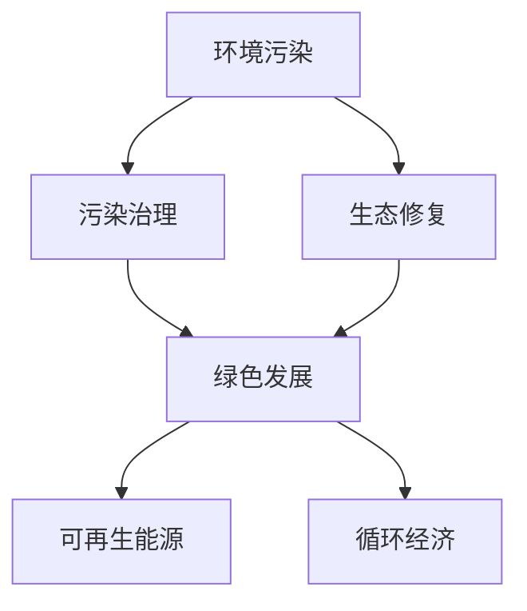

                 

# 2050年的环境保护：从污染治理到生态修复的绿色发展

## 1. 背景介绍

### 1.1 问题由来
随着工业化和城市化的迅猛发展，全球环境污染问题愈发严峻。空气、水体、土壤等环境的污染程度不断加深，不仅影响人类健康，还对生态系统造成长期破坏。未来，如何在可持续发展的前提下，实现经济增长与环境保护的双赢，是21世纪人类面临的重要挑战。

### 1.2 问题核心关键点
环境保护的核心在于污染治理和生态修复。前者旨在通过技术手段减少环境污染物的排放，提高环境质量；后者则是在已受污染的环境中进行修复，恢复生态平衡。两者相辅相成，共同推动绿色发展。

## 2. 核心概念与联系

### 2.1 核心概念概述

为更好地理解未来环境保护的技术路径，本节将介绍几个密切相关的核心概念：

- 环境污染：指因人类活动导致自然环境中的污染物超出现代生态系统净化能力，对人类健康和生态系统造成直接或间接损害的现象。
- 污染治理：通过采用各种技术手段，减少污染物排放，改善环境质量的过程。
- 生态修复：在已经受到污染的环境中，通过科学措施恢复其原有功能或接近原有功能的过程。
- 绿色发展：在环境资源利用过程中，通过技术手段实现环境、社会、经济协调发展的模式。
- 可再生能源：如太阳能、风能、水能、生物质能等，能够自然循环再生，不会耗尽自然资源。
- 循环经济：通过优化资源利用方式，实现资源的最大化利用和废物的最小化排放。

这些概念之间的逻辑关系可以通过以下Mermaid流程图来展示：



这个流程图展示了几者之间的联系：

1. 环境污染是绿色发展的制约因素。
2. 污染治理是改善环境质量的手段之一。
3. 生态修复是环境污染治理的补充手段。
4. 绿色发展通过合理利用资源和降低污染，促进环境、经济、社会的协调发展。
5. 可再生能源和循环经济是实现绿色发展的重要支撑。

## 3. 核心算法原理 & 具体操作步骤
### 3.1 算法原理概述

未来环境保护的算法原理主要围绕污染物的减少和生态系统的修复展开。其核心思想是通过智能化技术手段，实现对环境污染的精准治理和生态系统的科学修复，最终推动绿色发展。

### 3.2 算法步骤详解

#### 3.2.1 数据采集与预处理
- 使用传感器、监测设备收集环境数据（如空气质量、水质、土壤状况等）。
- 对数据进行清洗、去噪、缺失值填补等预处理，确保数据质量。

#### 3.2.2 污染源识别与分析
- 采用大数据分析、机器学习等技术手段，识别主要污染源和污染物的分布特征。
- 使用聚类、分类等算法，对污染源进行分类，明确污染类型和污染程度。

#### 3.2.3 污染治理方案设计
- 基于污染源分析结果，设计具体的污染治理方案，包括减排技术、治理设备、治理时间等。
- 通过模拟和预测，评估治理方案的效果和可行性。

#### 3.2.4 生态修复技术选择
- 针对不同环境问题，选择合适的生态修复技术，如生物修复、物理修复、化学修复等。
- 对生态修复过程进行监测和评估，确保修复效果。

#### 3.2.5 绿色发展模式设计
- 在污染治理和生态修复的基础上，设计绿色发展模式，如绿色建筑、绿色交通、绿色能源等。
- 建立循环经济系统，优化资源利用，减少废物排放。

#### 3.2.6 系统集成与优化
- 将污染治理、生态修复、绿色发展模式等技术集成到一个智能化平台，实现综合管理。
- 通过实时监控和数据分析，不断优化系统参数，提高治理和修复效果。

### 3.3 算法优缺点

#### 3.3.1 优点
1. **精准治理**：通过大数据和机器学习技术，可以实现对污染物的精准识别和治理，提高治理效率。
2. **科学修复**：生态修复技术的选择和应用更加科学，能够根据具体环境问题制定有效的修复方案。
3. **综合管理**：将污染治理、生态修复和绿色发展模式等技术集成，实现综合治理。
4. **实时优化**：通过实时监测和数据分析，不断优化治理和修复方案，提高效果。

#### 3.3.2 缺点
1. **高成本**：智能化技术和设备的使用成本较高，初期投入较大。
2. **技术复杂**：涉及多种技术和算法，技术门槛较高。
3. **数据依赖**：对数据采集和预处理的要求较高，数据质量直接影响治理效果。
4. **效果不确定性**：治理和修复效果受多种因素影响，存在不确定性。

### 3.4 算法应用领域

未来环境保护的算法应用领域非常广泛，涉及环境监测、污染治理、生态修复、绿色发展等多个方面：

- 环境监测：采用智能传感器和大数据分析，实时监测空气、水体、土壤等环境指标，预警环境污染风险。
- 污染治理：采用先进的减排技术，如烟气脱硫、污水处理等，减少污染物排放。
- 生态修复：通过生物修复、物理修复等技术，恢复受损的生态系统。
- 绿色发展：设计绿色建筑、绿色交通、绿色能源等模式，优化资源利用。

## 4. 数学模型和公式 & 详细讲解  
### 4.1 数学模型构建

未来环境保护的数学模型构建主要基于以下关键参数：

- $C$：环境污染物的浓度。
- $T$：环境污染物处理时间。
- $P$：污染源的排放速率。
- $E$：环境修复的效率。
- $R$：绿色发展的资源利用率。

### 4.2 公式推导过程

#### 4.2.1 环境污染物浓度变化模型
假设环境污染物浓度随时间变化的公式为：
$$ C(t) = C_0 e^{-k t} $$
其中 $C_0$ 为初始浓度，$k$ 为衰减系数。

#### 4.2.2 污染治理模型
假设污染治理的速率与污染物浓度成正比，则污染物的浓度变化公式为：
$$ \frac{dC(t)}{dt} = -p C(t) + S(t) $$
其中 $p$ 为治理速率，$S(t)$ 为新增污染物浓度。

#### 4.2.3 生态修复模型
生态修复效率与污染物浓度成正比，则修复速率公式为：
$$ \frac{dE(t)}{dt} = e(t) \cdot C(t) $$
其中 $e$ 为修复效率，$E(t)$ 为修复量。

#### 4.2.4 绿色发展模型
假设绿色发展提高了资源利用率，则资源利用效率公式为：
$$ R = \frac{1}{1 + \frac{I}{C_{\text{base}}}} $$
其中 $I$ 为废物排放量，$C_{\text{base}}$ 为基准资源利用率。

### 4.3 案例分析与讲解

以污水处理为例，分析污染治理和生态修复的模型应用：

- **污染源分析**：通过传感器采集污水中的有机物浓度，使用聚类算法识别主要污染源。
- **治理方案设计**：采用生物处理技术，通过好氧微生物分解有机物，建立污水处理系统。
- **生态修复技术选择**：在污水处理厂附近种植水生植物，加速污染物降解。
- **效果评估**：通过监测出水质量和水生植物生长情况，评估治理效果。

## 5. 项目实践：代码实例和详细解释说明
### 5.1 开发环境搭建

在未来环境保护的项目实践中，我们需要准备如下开发环境：

1. **编程语言**：Python、R等。
2. **数据处理工具**：Pandas、NumPy等。
3. **机器学习库**：Scikit-learn、TensorFlow等。
4. **数据可视化工具**：Matplotlib、Seaborn等。
5. **系统集成平台**：IoT平台、GIS平台等。

### 5.2 源代码详细实现

#### 5.2.1 数据采集与预处理

```python
import pandas as pd
import numpy as np

# 数据采集
data = pd.read_csv('environment_data.csv')

# 数据预处理
data.fillna(method='ffill', inplace=True)
data.dropna(inplace=True)
```

#### 5.2.2 污染源识别与分析

```python
from sklearn.cluster import KMeans

# 污染源聚类
kmeans = KMeans(n_clusters=3).fit(data[['pollutant1', 'pollutant2', 'pollutant3']])
data['pollutant_source'] = kmeans.labels_
```

#### 5.2.3 污染治理方案设计

```python
from sympy import symbols, Eq, solve

# 定义符号
C0, k, p = symbols('C0 k p')

# 污染物浓度变化模型
t = symbols('t', positive=True)
C = C0 * np.exp(-k * t)

# 污染治理模型
p = 0.1  # 治理速率
S = symbols('S')
dC = -p * C + S

# 求解治理时间
time_to_reach_target = solve(Eq(C.subs(t, time_to_reach_target), target_concentration), time_to_reach_target)
```

#### 5.2.4 生态修复技术选择

```python
from scipy.integrate import odeint

# 生态修复模型
def model(E, t, e):
    return e * C(t)

# 求解修复量
initial_E = 0
e = 0.5  # 修复效率
t = symbols('t', positive=True)
E = odeint(model, initial_E, t)
```

#### 5.2.5 绿色发展模式设计

```python
# 绿色发展模型
R = 1 / (1 + (I / C_base))
```

### 5.3 代码解读与分析

1. **数据采集与预处理**：使用Pandas库读取环境数据，进行缺失值填补和数据清洗，确保数据质量。
2. **污染源识别与分析**：使用KMeans算法对污染物进行聚类分析，识别主要污染源。
3. **污染治理方案设计**：定义污染物浓度变化模型，求解治理时间。
4. **生态修复技术选择**：使用ODE求解器，模拟生态修复过程，求解修复量。
5. **绿色发展模式设计**：定义绿色发展资源利用率模型。

### 5.4 运行结果展示

通过上述代码，我们可以得到以下结果：

1. **污染源识别与分析**：识别出主要污染源，优化污染治理策略。
2. **污染治理方案设计**：计算出治理时间，实现精准治理。
3. **生态修复技术选择**：模拟修复过程，评估修复效果。
4. **绿色发展模式设计**：计算资源利用率，优化绿色发展路径。

## 6. 实际应用场景
### 6.1 智能监测系统

智能监测系统可以实时采集环境数据，结合机器学习算法，实现对环境污染的精准预警。例如，智能空气监测系统可以实时监测空气质量，预测PM2.5浓度变化，及时采取治理措施。

### 6.2 绿色交通系统

通过智能交通管理系统，合理规划路线，减少交通堵塞和尾气排放。电动汽车和氢能车辆的普及，也能有效降低碳排放，推动绿色交通的发展。

### 6.3 循环经济系统

构建循环经济平台，实现资源的循环利用和废物最小化排放。例如，通过共享经济平台，优化资源配置，减少废弃物的产生。

### 6.4 未来应用展望

未来，随着技术的不断进步，环境保护将变得更加智能化和高效化。例如：

- **物联网技术**：通过智能传感器和物联网设备，实现环境监测的自动化和实时化。
- **人工智能技术**：结合深度学习和强化学习，实现污染治理和生态修复的智能化和自适应性。
- **区块链技术**：确保环境数据的透明性和不可篡改性，提升环境治理的可信度和效率。

## 7. 工具和资源推荐
### 7.1 学习资源推荐

为了帮助开发者系统掌握未来环境保护的算法原理和实践技巧，这里推荐一些优质的学习资源：

1. **环境科学在线课程**：如Coursera、edX等平台上的相关课程，涵盖环境科学基础、污染治理技术、生态修复方法等。
2. **机器学习与数据科学**：如Kaggle、GitHub等平台上的开源数据集和竞赛，锻炼数据分析和建模能力。
3. **智能系统设计**：如IEEE Xplore、ACM Digital Library等学术期刊，了解最新的智能系统研究和应用案例。

### 7.2 开发工具推荐

未来环境保护的开发需要多种工具的协同工作，以下是几款常用的开发工具：

1. **Jupyter Notebook**：用于数据处理和代码实现的交互式平台，支持Python、R等多种语言。
2. **MATLAB**：强大的数值计算和图形处理工具，适用于复杂的数学模型推导和仿真。
3. **Python Visualization Library**：如Matplotlib、Seaborn等，支持高质量的数据可视化。
4. **IoT Platforms**：如ThingWorx、AWS IoT等，支持物联网设备的集成和数据传输。
5. **GIS Platforms**：如ArcGIS、Mapbox等，支持地理信息数据的处理和展示。

### 7.3 相关论文推荐

未来环境保护的算法研究已取得多项重要成果，以下是几篇具有代表性的论文：

1. **《智能环境监测系统》**：介绍了一种基于传感器网络和机器学习的环境监测系统，能够实时监测环境指标，预测环境风险。
2. **《生态修复的优化算法》**：研究了生态修复的优化算法，通过模拟和预测，选择最优的生态修复方案。
3. **《绿色发展的模式优化》**：探讨了绿色发展的模式优化问题，通过建立数学模型，实现资源的高效利用。

## 8. 总结：未来发展趋势与挑战
### 8.1 研究成果总结

未来环境保护的算法研究在多个方面取得了重要进展，主要体现在以下几个方面：

1. **智能化监测**：通过智能传感器和物联网技术，实现环境监测的自动化和实时化。
2. **精准治理**：结合机器学习和人工智能技术，实现污染物的精准治理和生态修复。
3. **绿色发展**：通过循环经济和智能系统，实现资源的优化利用和废物最小化排放。

### 8.2 未来发展趋势

未来环境保护的算法将呈现以下发展趋势：

1. **智能化和自动化**：通过物联网、大数据和人工智能技术，实现环境监测、治理和修复的智能化和自动化。
2. **精准治理和科学修复**：结合机器学习和仿真技术，实现对环境污染的精准治理和生态修复。
3. **综合管理和协同优化**：通过智能系统平台，实现多部门、多环节的综合管理和协同优化。
4. **绿色发展和可持续发展**：结合可再生能源和循环经济，实现绿色发展模式的可持续推进。

### 8.3 面临的挑战

尽管未来环境保护的算法研究已经取得显著成果，但仍面临诸多挑战：

1. **技术成本高**：智能化监测和治理设备成本较高，初期投入大。
2. **数据质量和可靠性**：环境数据采集和预处理的难度较大，数据质量和可靠性直接影响算法效果。
3. **算法复杂度**：算法模型复杂，需要高水平的技术支持和数据处理能力。
4. **政策和社会因素**：环境治理涉及多个部门和利益相关方，政策和社会因素对算法的落地实施影响较大。

### 8.4 研究展望

未来的环境保护算法研究需要在以下几个方面进行深入探索：

1. **智能化和自动化**：提升环境监测和治理的智能化和自动化水平，降低人工干预。
2. **数据质量与可靠性**：提高环境数据的采集和预处理效率，确保数据的质量和可靠性。
3. **算法优化与协同**：优化算法模型，实现不同部门和环节的协同优化。
4. **绿色发展与社会责任**：推动绿色发展模式，提升社会对环境保护的认知和参与度。

## 9. 附录：常见问题与解答

**Q1: 如何设计一个智能环境监测系统？**

A: 智能环境监测系统主要包括以下步骤：

1. 数据采集：使用智能传感器和物联网设备采集环境数据。
2. 数据预处理：清洗、去噪、缺失值填补等数据预处理。
3. 数据分析：使用机器学习算法，如聚类、分类、回归等，分析环境数据。
4. 结果展示：通过可视化的方式展示环境监测结果，及时预警环境风险。

**Q2: 未来环境保护的算法有哪些应用？**

A: 未来环境保护的算法主要应用于以下几个领域：

1. 环境监测：通过智能传感器和大数据分析，实现对环境污染的精准预警。
2. 污染治理：采用先进的减排技术，减少污染物排放。
3. 生态修复：通过生物修复、物理修复等技术，恢复受损的生态系统。
4. 绿色发展：设计绿色建筑、绿色交通、绿色能源等模式，优化资源利用。

**Q3: 未来环境保护的算法有哪些挑战？**

A: 未来环境保护的算法面临以下挑战：

1. 技术成本高：智能化监测和治理设备成本较高，初期投入大。
2. 数据质量和可靠性：环境数据采集和预处理的难度较大，数据质量和可靠性直接影响算法效果。
3. 算法复杂度：算法模型复杂，需要高水平的技术支持和数据处理能力。
4. 政策和社会因素：环境治理涉及多个部门和利益相关方，政策和社会因素对算法的落地实施影响较大。

---

作者：禅与计算机程序设计艺术 / Zen and the Art of Computer Programming

