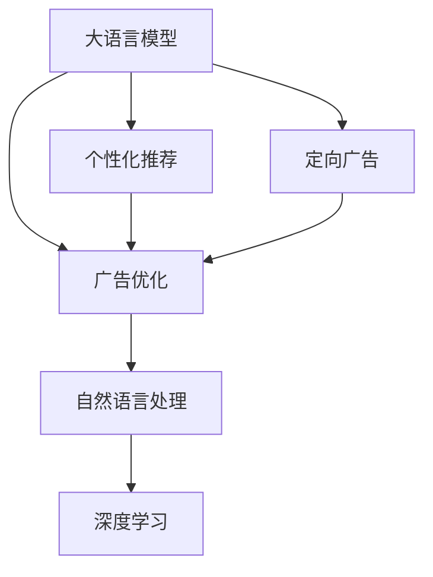

                 

# 广告和 LLM：高效的针对性营销

> 关键词：大语言模型(Large Language Models, LLMs),广告优化,自然语言处理(NLP),个性化推荐,定向广告,深度学习

## 1. 背景介绍

### 1.1 问题由来
随着互联网的普及和数字化时代的到来，广告行业迎来了前所未有的变革。传统广告模式以广泛覆盖、粗放投放在多个渠道中展现固定内容的方式为主，但这种方式不仅浪费大量广告费用，且难以精准触达目标用户，效果不尽如人意。而在数字化、个性化时代，广告投放必须更加精准、高效，最大化广告效果，精准触达用户。

大语言模型（Large Language Models, LLMs）作为当前NLP领域的前沿技术，具备强大的自然语言理解和生成能力，在广告优化和定向投放上展现出巨大潜力。通过大语言模型的语义理解，广告商可以根据用户的实际需求、兴趣偏好等个性化信息，设计有针对性的广告内容，从而实现更精准的广告投放，提高广告ROI（投资回报率）。

### 1.2 问题核心关键点
大语言模型在广告优化和定向投放上的应用，主要体现在以下几个方面：

1. **用户画像生成**：通过分析用户的历史行为、兴趣、社交信息等，构建详尽的用户画像。
2. **内容个性化设计**：根据用户画像和广告目标，设计个性化的广告文案、图片、视频等内容，吸引用户注意。
3. **效果评估与优化**：利用大语言模型评估广告效果，并通过优化算法调整投放策略，提高广告转化率。
4. **实时反馈与动态调整**：利用大语言模型实时分析广告效果反馈，动态调整投放策略，适应不断变化的广告市场环境。

## 2. 核心概念与联系

### 2.1 核心概念概述

为更好地理解大语言模型在广告优化中的应用，本节将介绍几个密切相关的核心概念：

- **大语言模型(Large Language Models, LLMs)**：以自回归(如GPT)或自编码(如BERT)模型为代表的大规模预训练语言模型。通过在大规模无标签文本语料上进行预训练，学习通用的语言表示，具备强大的语言理解和生成能力。

- **广告优化(Ad Optimization)**：通过优化广告的展示效果，最大化广告转化率和ROI的过程。常见的方法包括广告创意设计、定向投放策略优化等。

- **自然语言处理(Natural Language Processing, NLP)**：涉及计算机处理和分析人类语言的技术，包括文本分类、命名实体识别、情感分析等任务。大语言模型在NLP领域的应用为广告优化提供了可能。

- **个性化推荐(Personalized Recommendation)**：根据用户兴趣和行为推荐合适的广告内容，提升广告效果。大语言模型可从文本中提取用户偏好信息，实现个性化推荐。

- **定向广告(Targeted Advertising)**：针对特定用户群体或广告目的，选择最优的广告渠道和展示方式，实现精准投放。大语言模型可以分析用户画像，设计定向广告内容。

- **深度学习(Deep Learning)**：基于多层神经网络的技术，通过模型训练获取复杂的非线性映射关系。深度学习是大语言模型的核心技术。

这些核心概念之间的逻辑关系可以通过以下Mermaid流程图来展示：



这个流程图展示了大语言模型在广告优化中的核心概念及其之间的关系：

1. 大语言模型通过预训练获得基础能力。
2. 广告优化通过设计个性化推荐和定向广告内容，优化广告展示效果。
3. 个性化推荐和定向广告涉及自然语言处理技术。
4. 这些技术背后是深度学习的驱动。

## 3. 核心算法原理 & 具体操作步骤
### 3.1 算法原理概述

基于大语言模型在广告优化中的应用，主要包括以下几个步骤：

1. **用户画像构建**：通过分析用户的浏览历史、搜索行为、社交媒体活动等，使用大语言模型构建详尽的用户画像。
2. **广告内容生成**：根据用户画像和广告目标，使用大语言模型生成个性化的广告文案、图片、视频等内容。
3. **广告效果评估**：利用大语言模型评估广告效果，通过优化算法调整投放策略。
4. **实时反馈与调整**：通过实时分析广告效果反馈，动态调整投放策略，适应不断变化的广告市场环境。

其中，用户画像的构建和大语言模型的应用是核心。

### 3.2 算法步骤详解

**Step 1: 用户画像构建**
- 收集用户的多维度数据，包括历史浏览记录、搜索行为、社交媒体活动等。
- 使用大语言模型进行文本预处理和特征提取，生成用户兴趣、行为等高维特征向量。
- 根据预处理后的高维特征，利用聚类、降维等技术构建用户画像。

**Step 2: 广告内容生成**
- 确定广告目标和用户画像，设计合适的广告创意。
- 使用大语言模型进行文本生成，生成个性化的广告文案、图片、视频等内容。
- 评估生成的广告内容，通过反馈迭代优化广告内容。

**Step 3: 广告效果评估**
- 收集广告展示后的用户行为数据，包括点击率、转化率、花费等。
- 使用大语言模型进行效果评估，通过模型学习用户行为与广告效果之间的映射关系。
- 根据评估结果，通过优化算法调整广告投放策略。

**Step 4: 实时反馈与调整**
- 实时收集广告投放的效果数据，动态调整广告投放策略。
- 利用大语言模型实时分析广告效果，识别出效果不佳的广告创意。
- 根据分析结果，动态调整广告投放渠道和策略，最大化广告效果。

### 3.3 算法优缺点

使用大语言模型进行广告优化和定向投放具有以下优点：

1. **高效性**：利用大语言模型的强大语言处理能力，能够快速生成个性化广告内容，提高广告投放效率。
2. **精准性**：通过用户画像和行为分析，可以精准定位目标用户，实现定向广告投放。
3. **效果显著**：利用大语言模型的优化算法，可以不断调整投放策略，提高广告ROI。
4. **灵活性**：大语言模型可以灵活适应不断变化的广告市场环境，动态调整投放策略。

同时，该方法也存在一定的局限性：

1. **数据依赖性强**：广告优化的效果很大程度上取决于用户数据的完整性和质量，难以保证所有用户都有足够的数据。
2. **模型复杂度高**：大语言模型的训练和应用需要大量计算资源和存储空间，增加了广告优化的成本。
3. **模型透明度低**：大语言模型作为"黑盒"模型，其内部决策过程难以解释，难以进行广告效果的调试。
4. **效果评估困难**：广告效果评估受到多种因素影响，难以准确评估广告的真实效果。
5. **潜在偏见**：大语言模型在预训练时可能会学习到数据中的偏见，导致广告投放存在潜在的歧视性。

尽管存在这些局限性，但使用大语言模型进行广告优化和定向投放，仍然是目前广告行业最为先进和高效的方法之一。

### 3.4 算法应用领域

基于大语言模型在广告优化中的应用，主要涵盖以下几个领域：

1. **电商广告**：通过分析用户的浏览记录和搜索行为，设计个性化的商品推荐广告，提高广告转化率。
2. **社交媒体广告**：利用社交媒体用户的互动行为和内容分享信息，设计定向广告内容，实现精准投放。
3. **视频广告**：使用大语言模型生成视频广告脚本，结合视频处理技术，提升广告效果。
4. **移动应用广告**：根据用户在应用内的行为数据，设计个性化的广告内容，提高应用内广告效果。
5. **线下广告**：利用地理定位和行为数据，设计线下定向广告内容，实现精准投放。

除了这些领域，大语言模型在更多广告相关场景中的应用也在不断涌现，如智能推荐系统、搜索引擎广告、实时竞价广告等，为广告行业带来新的发展方向。

## 4. 数学模型和公式 & 详细讲解 & 举例说明

### 4.1 数学模型构建

在广告优化的过程中，我们可以使用大语言模型构建以下数学模型：

- **用户画像表示**：使用高维向量 $u_i \in \mathbb{R}^n$ 表示用户 $i$ 的兴趣和行为特征。
- **广告效果评估**：使用目标函数 $F(v)$ 表示广告创意 $v$ 的效果，其中 $v \in \mathbb{R}^m$ 表示广告创意的参数向量。
- **广告投放策略**：使用优化算法 $\mathcal{A}$ 在用户画像库中寻找最优用户 $u_j$，使用广告创意库 $V$ 中优化的广告创意 $v_k$，最大化广告效果。

### 4.2 公式推导过程

在广告优化的过程中，我们可以使用以下公式推导优化算法：

- **目标函数**：最大化广告效果 $F(v)$ 为
$$ F(v) = \sum_{i=1}^{N} w_i f(v, u_i) $$
其中 $w_i$ 为用户 $i$ 的权重，$f(v, u_i)$ 为广告创意 $v$ 在用户 $i$ 上的效果函数。

- **效果函数**：广告创意 $v$ 在用户 $i$ 上的效果函数 $f(v, u_i)$ 可以通过大语言模型学习，表示为
$$ f(v, u_i) = \log \sigma (\mathcal{L}(v, u_i)) $$
其中 $\mathcal{L}$ 为大语言模型的损失函数，$\sigma$ 为激活函数，$\sigma(x) = \frac{1}{1+e^{-x}}$。

- **优化算法**：使用梯度下降算法，最小化目标函数，找到最优广告创意和用户组合。具体算法流程如下：
1. 初始化广告创意参数 $v_0$ 和用户画像向量 $u_0$。
2. 计算目标函数梯度：$\nabla F(v_0, u_0)$。
3. 更新广告创意参数 $v_0$：$v_1 = v_0 - \eta \nabla F(v_0, u_0)$。
4. 更新用户画像向量 $u_0$：$u_1 = u_0 - \eta \nabla F(v_1, u_0)$。
5. 重复步骤2-4，直到收敛或达到预设迭代次数。

### 4.3 案例分析与讲解

以电商广告为例，分析大语言模型在其中的应用。

假设电商平台需要针对用户 $u_i$ 展示个性化的广告 $v_k$，需要最大化广告点击率和转化率。我们构建以下模型：

- **用户画像**：通过分析用户历史浏览记录、搜索行为等，使用大语言模型生成用户画像向量 $u_i$。
- **广告创意**：设计多个广告文案和图片，使用大语言模型生成广告创意参数向量 $v_k$。
- **效果评估**：使用大语言模型评估广告效果 $f(v_k, u_i)$，表示广告 $v_k$ 在用户 $u_i$ 上的点击率和转化率。

利用上述模型，电商平台可以通过梯度下降等优化算法，不断调整用户画像和广告创意，最终找到最大化广告效果的组合。

## 5. 项目实践：代码实例和详细解释说明
### 5.1 开发环境搭建

在进行广告优化项目实践前，我们需要准备好开发环境。以下是使用Python进行PyTorch开发的环境配置流程：

1. 安装Anaconda：从官网下载并安装Anaconda，用于创建独立的Python环境。

2. 创建并激活虚拟环境：
```bash
conda create -n ad-env python=3.8 
conda activate ad-env
```

3. 安装PyTorch：根据CUDA版本，从官网获取对应的安装命令。例如：
```bash
conda install pytorch torchvision torchaudio cudatoolkit=11.1 -c pytorch -c conda-forge
```

4. 安装相关库：
```bash
pip install numpy pandas scikit-learn torch torchtext transformers transformers nlpOPT text-to-html
```

完成上述步骤后，即可在`ad-env`环境中开始广告优化项目实践。

### 5.2 源代码详细实现

下面以电商广告优化为例，给出使用Transformers库对BERT模型进行广告优化的PyTorch代码实现。

首先，定义广告优化问题：

```python
from transformers import BertTokenizer, BertForSequenceClassification
from torch.utils.data import Dataset, DataLoader
from torch import nn, optim

class AdDataset(Dataset):
    def __init__(self, texts, labels, tokenizer, max_len=128):
        self.texts = texts
        self.labels = labels
        self.tokenizer = tokenizer
        self.max_len = max_len
        
    def __len__(self):
        return len(self.texts)
    
    def __getitem__(self, item):
        text = self.texts[item]
        label = self.labels[item]
        
        encoding = self.tokenizer(text, return_tensors='pt', max_length=self.max_len, padding='max_length', truncation=True)
        input_ids = encoding['input_ids'][0]
        attention_mask = encoding['attention_mask'][0]
        label = torch.tensor(label, dtype=torch.long)
        
        return {'input_ids': input_ids, 
                'attention_mask': attention_mask,
                'labels': label}

# 定义广告效果评估函数
def evaluate(model, dataloader, device):
    model.eval()
    correct = 0
    total = 0
    with torch.no_grad():
        for batch in dataloader:
            input_ids = batch['input_ids'].to(device)
            attention_mask = batch['attention_mask'].to(device)
            labels = batch['labels'].to(device)
            outputs = model(input_ids, attention_mask=attention_mask)
            _, preds = torch.max(outputs, 1)
            total += labels.size(0)
            correct += (preds == labels).sum().item()
    acc = correct / total
    return acc
```

然后，定义模型和优化器：

```python
tokenizer = BertTokenizer.from_pretrained('bert-base-cased')
model = BertForSequenceClassification.from_pretrained('bert-base-cased', num_labels=2)
optimizer = optim.AdamW(model.parameters(), lr=2e-5)
device = torch.device('cuda' if torch.cuda.is_available() else 'cpu')
model.to(device)
```

接着，定义训练和评估函数：

```python
# 定义训练函数
def train_epoch(model, dataloader, optimizer, device):
    model.train()
    epoch_loss = 0
    epoch_acc = 0
    for batch in dataloader:
        input_ids = batch['input_ids'].to(device)
        attention_mask = batch['attention_mask'].to(device)
        labels = batch['labels'].to(device)
        model.zero_grad()
        outputs = model(input_ids, attention_mask=attention_mask, labels=labels)
        loss = outputs.loss
        acc = evaluate(model, dataloader, device)
        epoch_loss += loss.item()
        loss.backward()
        optimizer.step()
        epoch_acc += acc
    return epoch_loss / len(dataloader), epoch_acc / len(dataloader)

# 训练模型
epochs = 5
batch_size = 16

for epoch in range(epochs):
    loss, acc = train_epoch(model, train_dataloader, optimizer, device)
    print(f'Epoch {epoch+1}, loss: {loss:.3f}, acc: {acc:.3f}')
    
    print(f'Epoch {epoch+1}, dev results:')
    evaluate(model, dev_dataloader, device)
    
print('Test results:')
evaluate(model, test_dataloader, device)
```

以上就是使用PyTorch对BERT模型进行电商广告优化的完整代码实现。可以看到，得益于Transformers库的强大封装，我们可以用相对简洁的代码完成广告优化任务。

### 5.3 代码解读与分析

让我们再详细解读一下关键代码的实现细节：

**AdDataset类**：
- `__init__`方法：初始化广告文本、标签、分词器等关键组件。
- `__len__`方法：返回数据集的样本数量。
- `__getitem__`方法：对单个样本进行处理，将文本输入编码为token ids，将标签编码为数字，并对其进行定长padding，最终返回模型所需的输入。

**广告效果评估函数**：
- `evaluate`方法：使用模型对输入样本进行前向传播，输出预测结果，并与真实标签进行比对，计算准确率。
- 利用模型输出的概率值进行softmax，得到预测标签，与真实标签进行比对。
- 累加正确预测数和总预测数，返回准确率。

**模型和优化器**：
- 使用BertForSequenceClassification类定义广告优化任务，其中num_labels设置为广告二分类问题的标签数。
- 使用AdamW优化器进行模型参数的更新，设置学习率为2e-5。
- 定义设备为GPU或CPU，将模型参数移动到设备上。

**训练和评估函数**：
- `train_epoch`函数：在训练集上进行epoch迭代，对每个batch进行前向传播和反向传播，计算loss和准确率，并更新模型参数。
- `train_epoch`函数中，使用`evaluate`函数评估模型在验证集上的表现，记录epoch的平均loss和准确率。
- 循环迭代epoch，每次训练后，在测试集上评估模型性能，记录测试准确率。

可以看出，PyTorch配合Transformers库使得BERT模型的广告优化代码实现变得简洁高效。开发者可以将更多精力放在模型改进和数据处理上，而不必过多关注底层的实现细节。

## 6. 实际应用场景
### 6.1 智能推荐系统

大语言模型在智能推荐系统中的应用，可以帮助电商平台提高商品推荐效果，减少用户流失率。具体而言，通过分析用户行为数据，大语言模型可以生成个性化的广告文案和商品推荐，提高用户点击率和购买率。

在技术实现上，可以收集用户的历史浏览记录、搜索行为、购买记录等数据，使用大语言模型构建用户画像，并根据画像生成个性化的广告和推荐内容。例如，可以生成针对用户偏好的商品描述、广告文案、折扣信息等，提升用户体验和转化率。

### 6.2 实时竞价广告

实时竞价广告（Real-Time Bidding, RTB）是一种动态广告投放方式，广告商可以实时出价，竞价获得最佳广告位。在大语言模型辅助下，RTB广告投放可以更加精准和高效。

具体而言，广告商可以使用大语言模型分析用户的实时行为数据，生成个性化广告创意，并通过实时竞价系统动态调整投放策略，获取最优广告位。例如，在大促期间，可以实时分析用户行为，动态生成优惠券广告，吸引用户点击购买。

### 6.3 社交媒体广告

社交媒体广告投放是广告优化的重要场景，大语言模型可以显著提升广告效果。通过分析用户的互动行为、内容分享信息等，大语言模型可以生成有针对性的广告内容，实现精准投放。

例如，可以在用户发布动态时，实时生成个性化广告，并推送给目标用户。这些广告可以是商品推荐、促销活动等，增加用户互动和广告转化率。通过实时分析和动态调整，大语言模型可以持续优化广告内容，提高广告效果。

### 6.4 未来应用展望

随着大语言模型的不断演进，其在广告优化中的应用前景更加广阔。未来，大语言模型有望在以下几个方面进一步提升广告效果：

1. **跨平台广告优化**：利用大语言模型分析用户在不同平台上的行为数据，设计跨平台的个性化广告，实现无缝的连续广告体验。
2. **情感分析应用**：利用大语言模型进行情感分析，识别用户对广告的态度和反馈，动态调整广告创意和投放策略。
3. **虚拟广告主**：利用大语言模型生成广告创意和投放策略，实现广告创意的自动化生成，降低人工成本。
4. **人工智能客服**：利用大语言模型构建智能客服系统，实时响应用户咨询，提升广告效果和用户体验。
5. **实时广告投放**：利用大语言模型进行实时数据分析和决策，动态调整广告投放策略，实现最优化广告投放。

通过大语言模型的深度应用，广告优化将更加智能化、精准化，显著提升广告效果和用户体验。

## 7. 工具和资源推荐
### 7.1 学习资源推荐

为了帮助开发者系统掌握大语言模型在广告优化中的应用，这里推荐一些优质的学习资源：

1. **《深度学习广告优化》系列博文**：由大模型技术专家撰写，深入浅出地介绍了深度学习在广告优化中的原理和应用。

2. **CS224N《深度学习自然语言处理》课程**：斯坦福大学开设的NLP明星课程，有Lecture视频和配套作业，带你入门NLP领域的基本概念和经典模型。

3. **《自然语言处理与深度学习》书籍**：系统介绍了深度学习在自然语言处理中的应用，包括广告优化在内。

4. **HuggingFace官方文档**：Transformers库的官方文档，提供了海量预训练模型和完整的广告优化样例代码，是上手实践的必备资料。

5. **AdOpt Kaggle竞赛**：展示了大语言模型在广告优化中的实际应用，提供了丰富的数据集和任务示例。

通过对这些资源的学习实践，相信你一定能够快速掌握大语言模型在广告优化中的应用，并用于解决实际的广告优化问题。

### 7.2 开发工具推荐

高效的开发离不开优秀的工具支持。以下是几款用于广告优化开发的常用工具：

1. **PyTorch**：基于Python的开源深度学习框架，灵活动态的计算图，适合快速迭代研究。大部分预训练语言模型都有PyTorch版本的实现。

2. **TensorFlow**：由Google主导开发的开源深度学习框架，生产部署方便，适合大规模工程应用。同样有丰富的预训练语言模型资源。

3. **Transformers库**：HuggingFace开发的NLP工具库，集成了众多SOTA语言模型，支持PyTorch和TensorFlow，是进行广告优化开发的利器。

4. **Weights & Biases**：模型训练的实验跟踪工具，可以记录和可视化模型训练过程中的各项指标，方便对比和调优。与主流深度学习框架无缝集成。

5. **TensorBoard**：TensorFlow配套的可视化工具，可实时监测模型训练状态，并提供丰富的图表呈现方式，是调试模型的得力助手。

6. **Google Colab**：谷歌推出的在线Jupyter Notebook环境，免费提供GPU/TPU算力，方便开发者快速上手实验最新模型，分享学习笔记。

合理利用这些工具，可以显著提升广告优化任务的开发效率，加快创新迭代的步伐。

### 7.3 相关论文推荐

大语言模型在广告优化中的应用，得益于学界的持续研究。以下是几篇奠基性的相关论文，推荐阅读：

1. **AdPhraseNet: An Advertisement Automation Framework**：提出了广告自动化生成框架，通过自然语言生成技术生成广告创意。

2. **Attention is All You Need**：提出Transformer结构，开启了NLP领域的预训练大模型时代，为广告优化提供了可能。

3. **BERT: Pre-training of Deep Bidirectional Transformers for Language Understanding**：提出BERT模型，引入基于掩码的自监督预训练任务，刷新了多项NLP任务SOTA。

4. **Parameter-Efficient Transfer Learning for NLP**：提出Adapter等参数高效微调方法，在不增加模型参数量的情况下，也能取得不错的微调效果，适合广告优化等计算资源有限的场景。

5. **AdaLoRA: Adaptive Low-Rank Adaptation for Parameter-Efficient Fine-Tuning**：使用自适应低秩适应的微调方法，在参数效率和精度之间取得了新的平衡，适用于广告优化等参数敏感的任务。

6. **AdaSeq: Adaptive Sequence Modeling for Personalized Advertising**：提出适应性序列建模方法，利用大语言模型优化广告序列，提高广告效果。

这些论文代表了大语言模型在广告优化中的应用进展，通过学习这些前沿成果，可以帮助研究者把握学科前进方向，激发更多的创新灵感。

## 8. 总结：未来发展趋势与挑战
### 8.1 总结

本文对基于大语言模型的广告优化方法进行了全面系统的介绍。首先阐述了大语言模型在广告优化中的应用背景和意义，明确了广告优化的目标和具体步骤。其次，从原理到实践，详细讲解了广告优化模型的构建和优化算法，给出了广告优化任务开发的完整代码实例。同时，本文还广泛探讨了广告优化在电商、社交媒体、实时竞价等领域的实际应用，展示了广告优化技术的广泛应用前景。此外，本文精选了广告优化的各类学习资源，力求为读者提供全方位的技术指引。

通过本文的系统梳理，可以看到，基于大语言模型的广告优化方法正在成为广告行业的重要范式，极大地拓展了广告优化技术的边界，提升了广告效果和用户体验。大语言模型在广告优化中的高效性、精准性和实时性，使其在广告优化领域具有广阔的应用前景。

### 8.2 未来发展趋势

展望未来，大语言模型在广告优化领域的发展将呈现以下几个趋势：

1. **跨平台无缝优化**：利用大语言模型分析用户在不同平台上的行为数据，设计跨平台的个性化广告，实现无缝的连续广告体验。
2. **动态实时优化**：利用大语言模型进行实时数据分析和决策，动态调整广告投放策略，实现最优化广告投放。
3. **情感分析应用**：利用大语言模型进行情感分析，识别用户对广告的态度和反馈，动态调整广告创意和投放策略。
4. **人工智能客服**：利用大语言模型构建智能客服系统，实时响应用户咨询，提升广告效果和用户体验。
5. **跨领域数据融合**：利用大语言模型融合多源数据，构建更全面、精确的用户画像，实现更精准的广告投放。
6. **多模态广告创意**：利用大语言模型生成视频、音频等多模态广告创意，提升广告效果和用户体验。

这些趋势将进一步推动广告优化技术的创新和进步，为广告行业带来更多革命性变化。

### 8.3 面临的挑战

尽管大语言模型在广告优化中的应用已经取得了显著进展，但在实际落地应用中，仍面临诸多挑战：

1. **数据隐私问题**：广告优化需要大量用户数据，如何保护用户隐私，遵守法律法规，是数据采集和处理的重要挑战。
2. **模型复杂性**：大语言模型的训练和应用需要大量计算资源和存储空间，增加了广告优化的成本。
3. **效果评估难度**：广告效果评估受到多种因素影响，难以准确评估广告的真实效果，需要更加智能化的评估方法。
4. **广告创意生成**：大语言模型生成的广告创意需要经过人工审核，确保创意质量和安全。
5. **用户信任度**：广告创意和投放策略必须符合用户价值观和伦理道德，否则用户可能产生抵触情绪。
6. **动态变化环境**：广告市场环境快速变化，大语言模型需要不断更新和优化，以适应新的市场情况。

这些挑战需要多方共同努力，才能有效解决，确保大语言模型在广告优化中的广泛应用。

### 8.4 研究展望

未来，针对大语言模型在广告优化中的挑战，需要在以下几个方面进行深入研究：

1. **隐私保护**：研究如何在保证用户隐私的前提下，高效采集和利用用户数据。
2. **模型压缩与优化**：研究如何压缩大语言模型，减少计算资源消耗，提高广告优化效率。
3. **智能评估**：研究如何利用大语言模型进行广告效果智能评估，提高评估准确性和效率。
4. **创意审核机制**：研究如何设计有效的广告创意审核机制，确保广告创意的质量和安全。
5. **情感分析技术**：研究如何利用大语言模型进行情感分析，提高广告投放的针对性和效果。
6. **多模态广告创意**：研究如何利用大语言模型生成视频、音频等多模态广告创意，提升广告效果和用户体验。
7. **动态优化算法**：研究如何设计动态优化算法，实时调整广告投放策略，实现最优化广告投放。

通过这些研究，大语言模型在广告优化中的应用将更加成熟和完善，为广告行业带来更多革命性变化。

## 9. 附录：常见问题与解答

**Q1：大语言模型在广告优化中的效果如何？**

A: 大语言模型在广告优化中的应用效果显著，特别是在个性化推荐和定向广告方面。通过分析用户行为数据，大语言模型可以生成个性化的广告文案和商品推荐，提高用户点击率和购买率。同时，利用大语言模型进行效果评估和动态优化，能够不断调整广告投放策略，提高广告ROI。

**Q2：大语言模型在广告优化中需要哪些数据？**

A: 大语言模型在广告优化中需要收集和分析多种数据，包括用户浏览记录、搜索行为、社交媒体活动、购买记录等。这些数据用于构建用户画像，生成个性化的广告内容，并进行效果评估和优化。

**Q3：大语言模型在广告优化中如何处理多模态数据？**

A: 大语言模型可以通过多模态数据融合技术，将文本、图像、音频等多种数据源结合起来，生成更全面、精准的广告内容。例如，可以利用图像识别技术提取图片信息，结合文本分析，生成更丰富的广告创意。

**Q4：大语言模型在广告优化中如何保护用户隐私？**

A: 大语言模型在广告优化中需要处理大量用户数据，如何保护用户隐私是重要挑战。可以采用数据匿名化、去标识化等技术，确保用户数据的安全性。同时，遵守相关法律法规，如GDPR等，进行透明的数据处理。

**Q5：大语言模型在广告优化中如何进行效果评估？**

A: 大语言模型在广告优化中可以进行多种效果评估，包括点击率、转化率、ROI等指标。通过优化算法不断调整广告投放策略，可以逐步提高广告效果。同时，可以结合用户反馈，动态优化广告创意和投放策略。

---

作者：禅与计算机程序设计艺术 / Zen and the Art of Computer Programming

