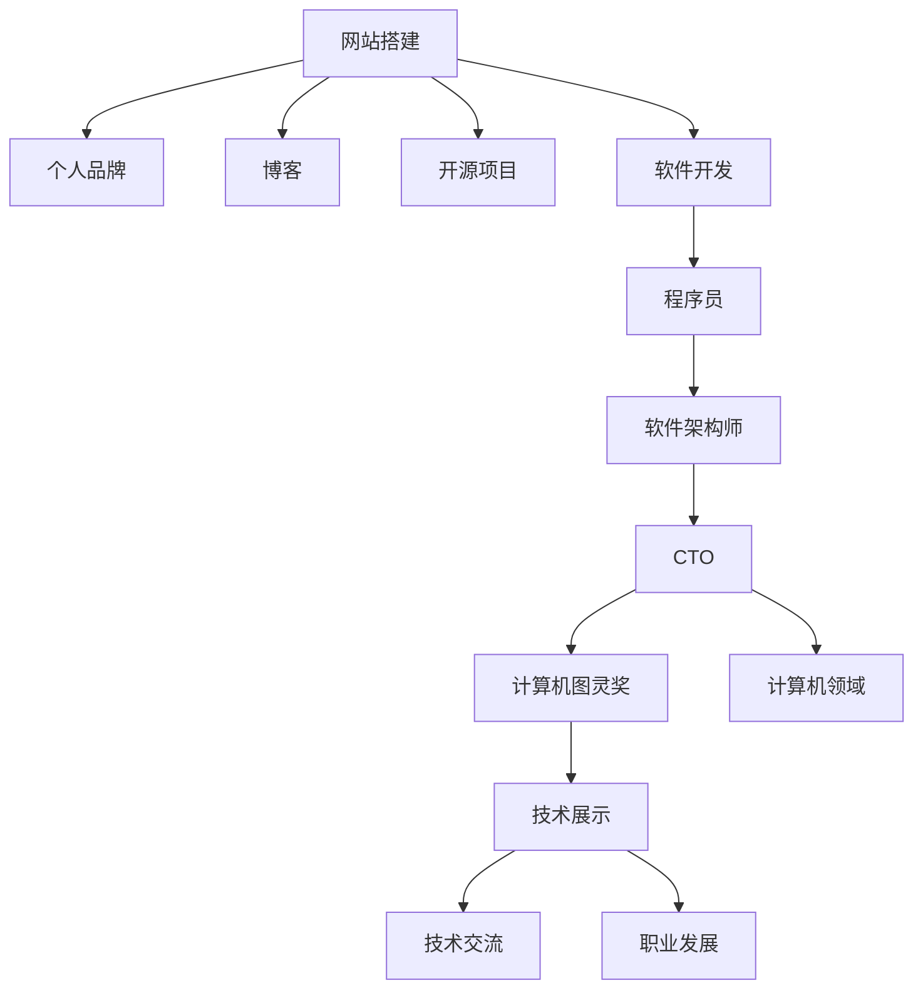

                 

# 建立个人网站：展示你的专业知识和成果

> 关键词：网站搭建, 个人品牌, 博客, 技术分享, 开源项目, 软件开发, 程序员, 软件架构师, CTO, 计算机图灵奖, 计算机领域

## 1. 背景介绍

### 1.1 问题由来
在当今信息化时代，拥有一个个人网站是展示专业知识和成果的重要途径。无论是技术博客、开源项目、还是个人品牌，一个精美的网站都能有效提升你的专业形象，吸引更多关注。本文将系统介绍如何从零开始搭建个人网站，展示你的专业知识和成果。

### 1.2 问题核心关键点
一个优秀的个人网站，不仅是技术能力的展示，更是个人品牌形象的塑造。搭建网站需要考虑的问题包括：
- 选择合适的平台和框架。
- 设计美观、易用的界面。
- 选择合适的托管方案。
- 如何推广和维护网站。

### 1.3 问题研究意义
通过搭建个人网站，可以有效展示你的专业知识和成果，提升个人品牌价值，吸引更多同行和业界人士关注。这对于技术交流、资源共享、职业发展等都有重要作用。

## 2. 核心概念与联系

### 2.1 核心概念概述

本节将介绍建立个人网站所需的核心概念及其相互关系：

- **网站搭建(Website Development)**：包括前端设计、后端开发、数据库配置等过程，是个人网站建设的基础。
- **个人品牌(Personal Branding)**：通过网站展示个人技术、经验、成就，形成独特形象，吸引目标用户。
- **博客(Blogging)**：在网站上开设博客专栏，定期分享技术心得、项目经验等，持续输出高质量内容。
- **开源项目(Open Source Projects)**：通过在GitHub等平台上发布开源项目，展示技术实力，促进技术交流。
- **软件开发(Software Development)**：涵盖代码编写、软件架构设计、项目管理等，是个人技术能力的体现。
- **程序员(Programmers)**：包括前端开发、后端开发、全栈开发等，是网站搭建和维护的实施者。
- **软件架构师(Software Architects)**：负责软件系统的整体设计和架构，确保系统的可扩展性和稳定性。
- **CTO(Chief Technology Officer)**：负责公司的技术方向和战略，指导技术团队，推动技术创新。
- **计算机图灵奖(Turing Award)**：计算机科学界的最高荣誉，授予对计算机领域做出突出贡献的科学家。
- **计算机领域(Computer Science Field)**：包括算法、数据结构、人工智能、软件工程等多个方向，是技术展示的领域。

这些核心概念通过一个完整的网站搭建过程紧密联系在一起，共同构成了一个技术的展示平台，用于展示你的专业知识和成果。

### 2.2 核心概念原理和架构的 Mermaid 流程图(Mermaid 流程节点中不要有括号、逗号等特殊字符)



这个流程图展示了核心概念之间的逻辑关系：通过网站搭建展示个人品牌，开设博客分享技术，发布开源项目体现技术实力，进行软件开发和编程，最终形成技术展示，促进技术交流和职业发展。

## 3. 核心算法原理 & 具体操作步骤

### 3.1 算法原理概述

搭建个人网站的过程，本质上是一个基于Web技术和网站框架的技术实现过程。其核心算法原理包括前端页面设计、后端开发、数据库配置、域名托管等。

- **前端页面设计**：使用HTML、CSS、JavaScript等技术设计网站的前端界面，确保美观和易用性。
- **后端开发**：使用Node.js、Python、Ruby等后端技术，实现网站的数据处理、逻辑控制等功能。
- **数据库配置**：使用MySQL、PostgreSQL等数据库，存储和查询网站数据。
- **域名托管**：通过阿里云、腾讯云等平台，配置域名解析和网站托管，确保网站的稳定访问。

### 3.2 算法步骤详解

1. **需求分析**：明确网站的目标用户和功能需求，如博客、开源项目展示、技术分享等。
2. **平台选择**：选择合适的网站搭建平台，如WordPress、GitHub Pages、Jekyll等。
3. **设计界面**：使用Sketch、Figma等工具设计网站界面，确保美观和易用性。
4. **后端开发**：编写后端代码，实现网站的基本功能和业务逻辑。
5. **数据库配置**：配置数据库，存储用户数据、博客内容等。
6. **域名托管**：购买域名，配置域名解析和网站托管。
7. **测试上线**：进行网站测试，确保功能正常后，发布上线。

### 3.3 算法优缺点

**优点**：
- 灵活性高，可根据需求自定义功能。
- 技术成熟，有丰富的第三方组件和工具支持。

**缺点**：
- 需要一定的技术基础，搭建和维护复杂。
- 初期投入较大，需购买域名、服务器等资源。

### 3.4 算法应用领域

个人网站的应用领域非常广泛，包括技术博客、开源项目、个人简历、技术分享等。通过展示专业知识和成果，不仅能提升个人品牌价值，还能促进技术交流和职业发展。

## 4. 数学模型和公式 & 详细讲解 & 举例说明

### 4.1 数学模型构建

搭建个人网站的过程，主要涉及前端页面设计、后端开发和数据库配置。这些过程虽然不涉及复杂的数学模型，但可以通过数学公式来描述和优化。

### 4.2 公式推导过程

以一个简单的博客系统为例，假设有 $N$ 篇博客，每篇博客有 $M$ 个标签。用 $x_{ij}$ 表示第 $i$ 篇博客与第 $j$ 个标签之间的关系，则博客与标签的关系可以用矩阵表示：

$$
X = [x_{11}, x_{12}, \cdots, x_{1M}, x_{21}, x_{22}, \cdots, x_{2M}, \cdots, x_{N1}, x_{N2}, \cdots, x_{NM}]
$$

其中 $x_{ij}$ 的取值为 $0$ 或 $1$，表示博客 $i$ 与标签 $j$ 的关系。

通过计算 $X$ 与某个权重向量 $W$ 的加权和，可以得到每篇博客的标签概率：

$$
P_i = W \cdot X_i
$$

其中 $X_i$ 是第 $i$ 篇博客与所有标签之间的关系向量，$W$ 是标签的权重向量。

### 4.3 案例分析与讲解

假设我们要推荐一篇博客，用户只提供了几个关键词，如 "机器学习"、"深度学习"。根据公式 $P_i = W \cdot X_i$，我们计算每篇博客的标签概率，并选取与用户关键词最匹配的博客进行推荐。

## 5. 项目实践：代码实例和详细解释说明

### 5.1 开发环境搭建

1. **选择开发环境**：
   - 前端：使用Visual Studio Code、Sublime Text等编辑器。
   - 后端：使用Node.js、Python、Ruby等开发语言。
   - 数据库：使用MySQL、PostgreSQL等关系型数据库。
   - 托管：使用阿里云、腾讯云等云服务。

2. **安装必要的软件**：
   - 安装Node.js和npm，使用npm管理依赖。
   - 安装MySQL或PostgreSQL，使用SQLite若无必要。
   - 安装Visual Studio Code或Sublime Text等编辑器。

### 5.2 源代码详细实现

以一个简单的博客系统为例，展示如何通过Node.js和Express框架搭建后端代码：

```javascript
const express = require('express');
const mysql = require('mysql');

const app = express();

// 连接数据库
const connection = mysql.createConnection({
  host: 'localhost',
  user: 'root',
  password: 'password',
  database: 'blog'
});

// 连接数据库
connection.connect();

// 查询博客
app.get('/blog', (req, res) => {
  const sql = 'SELECT * FROM blogs';
  connection.query(sql, (err, results) => {
    if (err) throw err;
    res.send(results);
  });
});

// 发布博客
app.post('/blog', (req, res) => {
  const { title, content } = req.body;
  const sql = `INSERT INTO blogs (title, content) VALUES ('${title}', '${content}')`;
  connection.query(sql, (err, result) => {
    if (err) throw err;
    res.send('博客发布成功');
  });
});

// 启动服务器
app.listen(3000, () => {
  console.log('服务器已启动，端口号：3000');
});
```

### 5.3 代码解读与分析

这段代码展示了如何使用Node.js和Express框架搭建一个简单的博客系统。其中：
- 使用 `mysql` 模块连接MySQL数据库，并执行SQL查询和插入操作。
- 使用 `express` 框架创建HTTP服务器，处理博客的获取和发布请求。
- 使用 `res.send()` 方法返回服务器响应。

### 5.4 运行结果展示

在运行上述代码后，可以通过浏览器访问 `http://localhost:3000/blog` 获取所有博客列表，或通过 `http://localhost:3000/blog/new` 进入博客发布页面，发布新的博客文章。

## 6. 实际应用场景

### 6.1 技术博客

技术博客是展示个人专业知识和成果的重要途径。通过定期分享技术心得、项目经验，可以积累粉丝，提升个人品牌价值。

### 6.2 开源项目

在GitHub等平台上发布开源项目，可以展示技术实力，促进技术交流和合作。通过参与开源项目，可以积累经验和影响力，提升职业发展机会。

### 6.3 个人简历

个人简历网站可以展示你的教育背景、工作经历、技术项目等信息，吸引潜在雇主或合作伙伴的注意。

### 6.4 技术分享

通过网站分享技术教程、课程资源、工具推荐等，可以建立技术社区，与同行分享知识，促进技术进步。

## 7. 工具和资源推荐

### 7.1 学习资源推荐

1. **在线课程**：
   - Coursera、Udemy、edX等平台提供丰富的计算机科学课程，涵盖前端开发、后端开发、数据库等。

2. **书籍**：
   - 《JavaScript高级程序设计》、《深入理解Node.js》、《MySQL必知必会》等经典书籍。

3. **技术博客**：
   - 阮一峰的博客、阮行止的博客等，提供丰富的技术心得和实战经验。

### 7.2 开发工具推荐

1. **代码编辑器**：
   - Visual Studio Code：功能强大、扩展丰富，适用于Web开发。
   - Sublime Text：轻量级、速度快，适用于文本编辑器。

2. **后端开发框架**：
   - Node.js + Express：简单易用，适用于Web开发。
   - Django：Python的Web框架，功能全面，适用于全栈开发。

3. **数据库**：
   - MySQL：开源的关系型数据库，功能强大。
   - MongoDB：适用于非结构化数据的存储和查询。

### 7.3 相关论文推荐

1. **Web开发技术**：
   - "Web Development for the Web Developer" by Eric T. A. Lee。
   - "Web Programming: An Introduction" by Robert Lafore。

2. **数据库技术**：
   - "MySQL Performance Explained" by Michael Muntashir Khan。
   - "MongoDB: The Definitive Guide" by Eliot Simpson、Steven Harknett、Ron Knapp。

## 8. 总结：未来发展趋势与挑战

### 8.1 研究成果总结

本文介绍了如何从零开始搭建个人网站，展示专业知识和成果。通过网站展示技术能力、分享知识经验、建立个人品牌，可以提升职业价值，促进技术交流。

### 8.2 未来发展趋势

- **全栈开发**：未来开发人员需要具备全栈能力，熟悉前端、后端、数据库等技术。
- **云计算和微服务**：云计算和大数据技术的发展，为网站开发提供了更灵活的解决方案。
- **人工智能和机器学习**：结合人工智能和机器学习技术，提升网站的功能和用户体验。

### 8.3 面临的挑战

- **技术更新快**：新技术层出不穷，需要不断学习和跟进。
- **开发成本高**：技术栈复杂，初期投入大。
- **用户体验差**：网站设计需要不断优化，提升用户体验。

### 8.4 研究展望

未来，大语言模型、人工智能等技术将更深入地融入网站开发中，提升网站的功能和交互性。同时，云计算、微服务等技术的发展，将为网站开发提供更灵活、更高效的解决方案。

## 9. 附录：常见问题与解答

**Q1: 个人网站需要具备哪些基本功能？**

A: 个人网站应具备以下基本功能：
- 博客系统：展示个人技术心得、项目经验。
- 开源项目展示：展示技术实力，促进合作。
- 简历和联系信息：展示个人背景，方便求职和交流。
- 技术分享：分享教程、课程资源、工具推荐。

**Q2: 如何提升个人网站的用户体验？**

A: 提升用户体验的关键在于设计美观、易用的界面，以及流畅的交互体验：
- 优化页面加载速度：使用CDN、图片压缩等技术。
- 提高响应速度：优化后端代码，使用缓存技术。
- 设计易用界面：简化操作流程，使用友好交互设计。

**Q3: 如何选择托管平台？**

A: 选择托管平台时，应考虑以下因素：
- 稳定性：选择服务稳定、用户评价高的平台。
- 安全性：确保数据安全，避免网站被攻击。
- 价格：根据自身需求选择性价比高的平台。

通过不断优化和提升个人网站，可以有效展示专业知识和成果，提升个人品牌价值，促进技术交流和职业发展。希望本文能为读者提供有价值的参考，助力你在技术之路上不断进步。

---

作者：禅与计算机程序设计艺术 / Zen and the Art of Computer Programming

