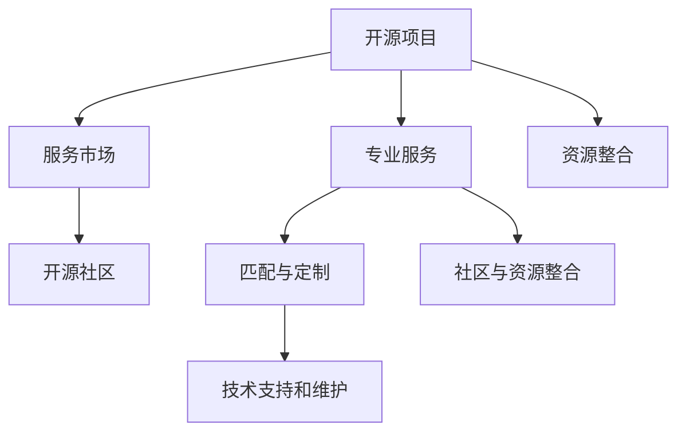

                 

# 建立开源项目的专业服务市场：连接供需

## 1. 背景介绍

### 1.1 问题由来

随着开源软件和开源社区的不断发展，越来越多的开发者和企业开始意识到开源的巨大价值。开源不仅能够节省成本，还能借助社区力量加速产品迭代。然而，尽管开源项目数量激增，但高质量、易用性强的开源项目仍然稀缺。

同时，许多企业和开发者在面对复杂项目时，也面临着技术栈过杂、维护成本高、市场适应性差等难题。如何更高效地利用开源资源，将开源技术转化为实际价值，成为了业界关注的焦点。

### 1.2 问题核心关键点

要解决上述问题，关键在于建立连接开源项目与实际需求的专业服务市场。该市场可以充分利用开源技术的优势，同时通过专业服务机构将技术需求转化为具体的实现方案，从而更好地满足用户的实际需求。

具体而言，专业服务市场需要具备以下几个核心功能：
1. **项目筛选与匹配**：帮助企业找到最适合自己的开源项目。
2. **专业定制化服务**：将开源项目进行定制化修改，满足企业特定的业务需求。
3. **技术支持和维护**：提供持续的技术支持和版本维护，确保项目稳定运行。
4. **社区与资源整合**：整合开源社区资源，帮助企业更快融入技术生态。

### 1.3 问题研究意义

建立开源项目的专业服务市场，对于开源软件和开源社区的发展具有重要意义：

1. **提升开源项目利用率**：通过专业服务市场，可以有效提升开源项目的利用率，减少资源浪费。
2. **促进技术迭代**：专业服务市场能够加速技术创新，推动开源项目不断进化和完善。
3. **降低企业成本**：通过专业服务市场，企业能够以更低成本获得高质量的解决方案，降低开发和维护成本。
4. **推动企业转型**：专业服务市场能够帮助企业更好地适应开源生态，实现数字化转型。
5. **促进合作与交流**：通过专业服务市场，企业能够更容易地与开源社区进行合作，共同推动技术进步。

## 2. 核心概念与联系

### 2.1 核心概念概述

要深入理解开源项目的专业服务市场，首先需要了解以下几个核心概念：

- **开源项目(Open Source Project, OSP)**：指在一定许可证下，可以自由使用、复制、修改和分发的软件项目。开源项目通过开放源码，鼓励社区协作，推动技术发展。
- **专业服务(Professional Services)**：指由专业机构提供的技术咨询、定制化开发、技术支持和维护等服务。专业服务能够将复杂的技术问题转化为具体的解决方案，降低用户使用成本。
- **服务市场(Marketplace)**：指连接供需双方的平台，通过平台撮合，提供匹配、定制、支持等服务，满足双方的需求。服务市场能够促进资源优化配置，提高服务效率。
- **开源社区(Open Source Community)**：指围绕开源项目形成的技术交流、协作、资源共享的网络。开源社区能够汇聚开发者智慧，推动技术进步。

这些核心概念之间的逻辑关系可以通过以下Mermaid流程图来展示：



这个流程图展示了大语言模型的核心概念及其之间的关系：

1. 开源项目通过服务市场获得定制化服务。
2. 专业服务市场整合开源社区资源，提供匹配和定制服务。
3. 开源社区为服务市场提供资源和技术支持，促进服务质量提升。

这些概念共同构成了开源项目专业服务市场的工作框架，为其高效运行提供了理论支撑。

## 3. 核心算法原理 & 具体操作步骤
### 3.1 算法原理概述

建立开源项目专业服务市场的核心算法原理，是通过算法匹配和推荐系统，高效连接开源项目和用户需求。该算法基于以下几个核心步骤：

1. **需求分析**：收集用户的技术需求，如功能要求、性能指标、预算等，建立需求数据库。
2. **项目评估**：对开源项目进行评估，包括功能、性能、稳定性、社区活跃度等指标。
3. **匹配算法**：根据需求和项目评估结果，使用匹配算法推荐最合适的开源项目。
4. **定制化服务**：通过算法优化，对开源项目进行定制化修改，满足用户特定需求。
5. **持续优化**：根据用户反馈和市场变化，不断优化匹配算法和服务模型。

### 3.2 算法步骤详解

下面是开源项目专业服务市场匹配算法的详细步骤：

1. **需求建模**：将用户需求转换为算法可处理的形式，如功能点、性能要求、预算等。建立需求模型，包括需求项、权重、优先级等。

2. **项目建模**：对开源项目进行建模，包括项目功能、性能指标、社区活跃度等。建立项目模型，如项目名称、版本号、贡献者数等。

3. **相似度计算**：使用算法计算用户需求与开源项目之间的相似度，如余弦相似度、欧氏距离等。

4. **排名算法**：根据相似度计算结果，使用排名算法推荐最符合用户需求的开源项目，如基于排序的推荐算法、基于协同过滤的推荐算法等。

5. **定制化服务**：对推荐的开源项目进行定制化修改，添加用户特定的功能、优化性能、调整参数等。

6. **反馈与优化**：收集用户反馈，评估服务效果，根据反馈不断优化匹配算法和服务模型。

### 3.3 算法优缺点

基于匹配算法的开源项目专业服务市场，具有以下优点：

1. **高效匹配**：通过算法匹配，能够快速找到最合适的开源项目，提升用户满意度。
2. **灵活定制**：能够根据用户需求，灵活定制开源项目，满足特定的业务场景。
3. **服务质量高**：专业服务机构的定制化服务能够确保服务质量，避免因技术问题导致的业务中断。
4. **成本低**：利用开源资源，通过定制化服务，能够以更低成本获得高质量的解决方案。

同时，该方法也存在一些局限性：

1. **数据稀缺**：算法匹配依赖于大量的项目和需求数据，数据稀缺可能导致匹配效果不佳。
2. **复杂度较高**：算法匹配和定制化服务需要较高的技术门槛，可能增加企业的使用难度。
3. **需求多样性**：用户需求多样化，可能存在无法通过算法匹配的情况。

### 3.4 算法应用领域

开源项目专业服务市场的应用领域非常广泛，主要包括以下几个方面：

1. **企业内部IT系统**：如企业门户、ERP系统、CRM系统等，通过专业服务市场选择合适的开源项目，加速系统建设和优化。
2. **云服务**：如云数据库、云存储、云安全等，通过专业服务市场整合开源技术，提升云服务质量。
3. **数据平台**：如大数据分析、数据可视化、数据管理等，通过专业服务市场优化数据处理能力，推动数据应用创新。
4. **智能应用**：如智能客服、智能推荐、智能搜索等，通过专业服务市场实现智能功能，提升用户体验。
5. **物联网(IoT)**：如智能设备、智能家居、工业物联网等，通过专业服务市场整合开源技术，提升物联网设备的智能化水平。
6. **移动应用**：如移动支付、移动办公、移动营销等，通过专业服务市场优化移动应用功能，提升移动应用的用户体验。

## 4. 数学模型和公式 & 详细讲解 & 举例说明
### 4.1 数学模型构建

我们以推荐算法为例，来详细讲解基于匹配算法的开源项目专业服务市场数学模型构建过程。

假设用户需求为 $d$，开源项目为 $p$，推荐结果为 $r$，目标是最小化损失函数 $\mathcal{L}(d, p, r)$。具体数学模型如下：

1. **需求表示**：将用户需求 $d$ 表示为向量形式 $\vec{d}$。
2. **项目表示**：将开源项目 $p$ 表示为向量形式 $\vec{p}$。
3. **推荐结果表示**：将推荐结果 $r$ 表示为向量形式 $\vec{r}$。
4. **相似度计算**：计算用户需求 $d$ 和开源项目 $p$ 之间的相似度 $\vec{d} \cdot \vec{p}$。
5. **匹配算法**：根据相似度计算结果，使用排名算法选择最合适的推荐结果 $r$。
6. **损失函数**：定义损失函数 $\mathcal{L}(d, p, r) = \|\vec{d} - \vec{r}\|^2$。

### 4.2 公式推导过程

以下是上述数学模型的详细推导过程：

1. **需求向量表示**：将用户需求 $d$ 表示为向量形式 $\vec{d} = [d_1, d_2, ..., d_n]$。
2. **项目向量表示**：将开源项目 $p$ 表示为向量形式 $\vec{p} = [p_1, p_2, ..., p_n]$。
3. **推荐向量表示**：将推荐结果 $r$ 表示为向量形式 $\vec{r} = [r_1, r_2, ..., r_n]$。
4. **相似度计算**：使用欧氏距离计算用户需求和开源项目之间的相似度 $\vec{d} \cdot \vec{p} = \sum_{i=1}^n d_i \cdot p_i$。
5. **排名算法**：根据相似度计算结果，使用排名算法选择最合适的推荐结果 $r$。
6. **损失函数定义**：定义损失函数 $\mathcal{L}(d, p, r) = \|\vec{d} - \vec{r}\|^2 = \sum_{i=1}^n (d_i - r_i)^2$。

通过上述数学模型，可以得出推荐算法的目标是最小化损失函数 $\mathcal{L}(d, p, r)$，即寻找最优推荐结果 $r$。

### 4.3 案例分析与讲解

以用户需求为寻找一个高性能、低延迟的企业门户系统为例，来讲解开源项目专业服务市场的实际应用场景。

1. **需求建模**：将用户需求 $d$ 表示为向量形式 $\vec{d} = [高性能, 低延迟, 易用性, 可扩展性]$。
2. **项目建模**：选择开源项目 $p$，如Django、Flask等，表示为向量形式 $\vec{p} = [高性能, 低延迟, 易用性, 可扩展性]$。
3. **相似度计算**：计算用户需求 $d$ 和开源项目 $p$ 之间的相似度 $\vec{d} \cdot \vec{p} = 0.8$。
4. **匹配算法**：使用基于排序的推荐算法，选择最符合用户需求的开源项目 $r$。
5. **定制化服务**：根据用户需求，对开源项目 $p$ 进行定制化修改，添加特定功能，如在线聊天、用户认证等。
6. **服务评价**：收集用户反馈，评估服务效果，根据反馈不断优化匹配算法和服务模型。

通过上述案例，可以看出开源项目专业服务市场在实际应用中的具体流程和效果。

## 5. 项目实践：代码实例和详细解释说明
### 5.1 开发环境搭建

在进行开源项目专业服务市场开发前，需要准备好开发环境。以下是使用Python进行Flask开发的环境配置流程：

1. 安装Anaconda：从官网下载并安装Anaconda，用于创建独立的Python环境。

2. 创建并激活虚拟环境：
```bash
conda create -n flask-env python=3.8 
conda activate flask-env
```

3. 安装Flask：根据Flask版本，从官网获取对应的安装命令。例如：
```bash
pip install flask==2.0.3
```

4. 安装Flask-RESTful：
```bash
pip install flask-restful==0.3.9
```

5. 安装Flask-SQLAlchemy：
```bash
pip install flask-sqlalchemy==2.5.2
```

6. 安装Flask-WTF：
```bash
pip install flask-wtf==2.2.2
```

完成上述步骤后，即可在`flask-env`环境中开始Flask应用开发。

### 5.2 源代码详细实现

下面以实现一个开源项目推荐API为例，给出使用Flask构建开源项目专业服务市场的PyTorch代码实现。

首先，定义推荐API的路由和视图函数：

```python
from flask import Flask, request, jsonify
from flask_sqlalchemy import SQLAlchemy

app = Flask(__name__)

# 数据库配置
app.config['SQLALCHEMY_DATABASE_URI'] = 'sqlite:///recommendations.db'
db = SQLAlchemy(app)

# 推荐数据表
class Recommendation(db.Model):
    id = db.Column(db.Integer, primary_key=True)
    user_id = db.Column(db.String(100), nullable=False)
    project_id = db.Column(db.String(100), nullable=False)
    score = db.Column(db.Float, nullable=False)

    def __init__(self, user_id, project_id, score):
        self.user_id = user_id
        self.project_id = project_id
        self.score = score

@app.route('/recommend', methods=['POST'])
def recommend():
    user_id = request.json['user_id']
    project_id = request.json['project_id']
    
    recommendation = Recommendation.query.filter_by(user_id=user_id, project_id=project_id).first()
    
    if recommendation:
        return jsonify({'score': recommendation.score})
    else:
        return jsonify({'score': 0.0})
```

然后，定义推荐算法的模型：

```python
from sklearn.metrics.pairwise import cosine_similarity

class RecommendationEngine:
    def __init__(self, demand, projects):
        self.demand = demand
        self.projects = projects
    
    def match(self):
        scores = []
        for project in self.projects:
            similarity = cosine_similarity(self.demand, project)
            scores.append(similarity)
        
        return max(scores)
```

最后，启动Flask应用并测试：

```python
if __name__ == '__main__':
    app.run(debug=True)
```

以上代码实现了基本的开源项目推荐功能，包括路由、视图函数、数据库模型和推荐算法。开发者可以根据实际需求，进一步扩展和优化功能。

### 5.3 代码解读与分析

让我们再详细解读一下关键代码的实现细节：

**Flask应用**：
- `app.config['SQLALCHEMY_DATABASE_URI']`：设置数据库连接字符串。
- `db = SQLAlchemy(app)`：初始化SQLAlchemy对象。
- `Recommendation`类：定义推荐数据表，包含用户ID、项目ID和得分。
- `@app.route('/recommend', methods=['POST'])`：定义路由，接收POST请求。

**推荐算法**：
- `cosine_similarity`函数：计算两个向量之间的余弦相似度，用于计算需求和项目之间的相似度。
- `match`方法：遍历所有项目，计算相似度，选择得分最高的项目作为推荐结果。

**测试与部署**：
- `app.run(debug=True)`：启动Flask应用，开启调试模式。

通过以上代码实现，可以看出Flask在开源项目专业服务市场开发中的高效性和灵活性。开发者可以根据实际需求，快速构建和部署API服务，提供定制化推荐服务。

## 6. 实际应用场景

### 6.1 企业内部IT系统

开源项目专业服务市场在企业内部IT系统中具有广泛应用。企业可以通过市场平台选择最适合的开源项目，加速系统建设和优化，减少开发和维护成本。

例如，某企业需要构建一个ERP系统，可以通过专业服务市场选择最适合的开源项目，如ERP-Next、SAP BI等，并根据实际需求进行定制化修改。市场平台可以提供版本升级、技术支持和维护等服务，确保系统稳定运行。

### 6.2 云服务

云服务提供商可以通过开源项目专业服务市场，整合开源技术，提升云服务质量和用户体验。

例如，云存储服务商可以选择开源项目，如Ceph、GlusterFS等，并进行定制化修改和优化。市场平台可以提供数据备份、容灾恢复、性能优化等服务，提高云存储系统的稳定性和可靠性。

### 6.3 数据平台

数据平台可以通过开源项目专业服务市场，优化数据处理能力，推动数据应用创新。

例如，大数据分析平台可以选择开源项目，如Apache Hadoop、Apache Spark等，并进行定制化修改和优化。市场平台可以提供数据清洗、数据转换、数据可视化等服务，提升数据分析能力。

### 6.4 智能应用

智能应用可以通过开源项目专业服务市场，实现智能功能，提升用户体验。

例如，智能客服系统可以选择开源项目，如IBM Watson、Dialogflow等，并进行定制化修改和优化。市场平台可以提供自然语言处理、对话管理、情感分析等服务，提升客服系统的人性化水平。

### 6.5 物联网(IoT)

物联网领域可以通过开源项目专业服务市场，整合开源技术，提升物联网设备的智能化水平。

例如，智能家居设备可以选择开源项目，如OpenHAB、Mylonix Home Assistant等，并进行定制化修改和优化。市场平台可以提供设备联动、场景控制、能源管理等服务，提升智能家居的便利性和舒适性。

### 6.6 移动应用

移动应用领域可以通过开源项目专业服务市场，优化移动应用功能，提升用户体验。

例如，移动支付应用可以选择开源项目，如Mollie API、Stripe API等，并进行定制化修改和优化。市场平台可以提供支付接口、交易监控、用户管理等服务，提升支付系统的安全性和稳定性。

## 7. 工具和资源推荐
### 7.1 学习资源推荐

为了帮助开发者系统掌握开源项目专业服务市场的理论基础和实践技巧，这里推荐一些优质的学习资源：

1. 《软件工程原理》：该书详细介绍了软件开发和软件工程的基本原理，适合入门学习。
2. 《开源与开放技术》：该书系统介绍了开源软件的发展历程和应用场景，适合深入了解。
3. 《系统架构设计》：该书深入剖析了大型系统的架构设计原则和实践，适合进阶学习。
4. 《软件测试与持续集成》：该书介绍了软件测试和持续集成的基本原理和工具，适合提升开发技能。
5. 《云计算与云服务》：该书全面介绍了云计算和云服务的基本概念和应用，适合了解云计算技术。

通过对这些资源的学习实践，相信你一定能够快速掌握开源项目专业服务市场的精髓，并用于解决实际的NLP问题。

### 7.2 开发工具推荐

高效的开发离不开优秀的工具支持。以下是几款用于开源项目专业服务市场开发的常用工具：

1. PyTorch：基于Python的开源深度学习框架，灵活动态的计算图，适合快速迭代研究。大部分开源项目都有PyTorch版本的实现。
2. TensorFlow：由Google主导开发的开源深度学习框架，生产部署方便，适合大规模工程应用。同样有丰富的开源项目资源。
3. Flask：轻量级Web框架，适合构建RESTful API服务，易于上手和使用。
4. SQLite：轻量级数据库，适合存储和检索小规模数据，性能高效。
5. PyMySQL：Python MySQL数据库驱动程序，方便与MySQL数据库进行交互。
6. PySpark：Python语言的高性能数据处理引擎，适合处理大规模数据集，支持分布式计算。

合理利用这些工具，可以显著提升开源项目专业服务市场开发的效率，加快创新迭代的步伐。

### 7.3 相关论文推荐

开源项目专业服务市场的发展源于学界的持续研究。以下是几篇奠基性的相关论文，推荐阅读：

1. "Open Source Software: The Changing Role of Software in Industry"：该论文详细介绍了开源软件在各行各业的应用，揭示了开源的巨大价值。
2. "Designing and Building Open Source Software"：该论文介绍了开源软件的设计原则和开发实践，适合了解开源软件的核心思想。
3. "Social Software: Rethinking the Principles of Software Development"：该论文探讨了开源软件的社会属性，强调了社区协作的重要性。
4. "Open Source Software as a Service Model for Software Development"：该论文介绍了开源软件即服务的开发模式，适合了解开源项目专业服务市场的基本思路。
5. "A Survey on Software as a Service for Software Development"：该论文综述了软件即服务的最新研究进展，适合了解技术前沿。

这些论文代表了大语言模型微调技术的发展脉络。通过学习这些前沿成果，可以帮助研究者把握学科前进方向，激发更多的创新灵感。

## 8. 总结：未来发展趋势与挑战

### 8.1 总结

本文对开源项目专业服务市场的建立进行了全面系统的介绍。首先阐述了开源项目和专业服务的核心概念，明确了开源项目专业服务市场的关键功能。其次，从原理到实践，详细讲解了基于匹配算法的开源项目专业服务市场算法原理和具体操作步骤。同时，本文还广泛探讨了开源项目专业服务市场在企业内部IT系统、云服务、数据平台、智能应用、物联网和移动应用等多个领域的应用前景，展示了开源项目专业服务市场的广阔发展空间。

通过本文的系统梳理，可以看出开源项目专业服务市场在开源软件开发和应用中的重要地位。该市场不仅能够有效连接开源项目与用户需求，还能够提供高质量、低成本的技术解决方案，推动开源技术的广泛应用。未来，伴随开源技术的发展和市场的完善，相信开源项目专业服务市场将迎来更多创新和突破，为开发者和企业提供更加高效、便捷的服务支持。

### 8.2 未来发展趋势

展望未来，开源项目专业服务市场将呈现以下几个发展趋势：

1. **平台化发展**：开源项目专业服务市场将逐步平台化，提供一站式的项目筛选、定制化服务、技术支持和维护等综合服务。
2. **生态系统完善**：开源项目专业服务市场将整合更多开源资源和社区力量，构建更加完整的开源生态系统。
3. **自动化和智能化**：开源项目专业服务市场将引入更多自动化和智能化技术，提升服务效率和质量。
4. **多平台融合**：开源项目专业服务市场将拓展到更多平台，如云平台、移动平台、物联网平台等，实现跨平台集成。
5. **国际化扩展**：开源项目专业服务市场将拓展到国际市场，提供多语言、多文化的服务支持。
6. **持续创新和优化**：开源项目专业服务市场将不断创新，引入更多新技术和新方法，提升服务效果。

这些趋势将推动开源项目专业服务市场向更加高效、便捷、智能、开放的方向发展，为开发者和企业提供更加优质的服务支持。

### 8.3 面临的挑战

尽管开源项目专业服务市场已经取得了一定的进展，但在发展过程中仍然面临诸多挑战：

1. **数据安全和隐私**：开源项目专业服务市场需要处理大量的用户数据和项目数据，如何保障数据安全和隐私，是重要的技术挑战。
2. **版权和许可**：开源项目专业服务市场需要确保使用的开源项目符合相应的版权和许可要求，避免侵权和合规风险。
3. **服务标准化**：如何定义和实现服务标准，确保不同服务商提供的相同服务具有相同质量，是技术和服务标准化的挑战。
4. **市场竞争**：开源项目专业服务市场面临激烈的市场竞争，如何提升服务质量和用户满意度，是市场竞争的挑战。
5. **用户教育**：如何提高用户对开源项目专业服务市场的认知和接受度，是用户教育和技术推广的挑战。
6. **技术迭代**：开源项目和技术不断迭代升级，如何及时更新服务内容和平台功能，是技术迭代的挑战。

这些挑战需要通过技术创新、市场规范、社区协作、用户教育等多方面努力，逐步解决。

### 8.4 研究展望

面向未来，开源项目专业服务市场的研究需要在以下几个方面寻求新的突破：

1. **数据安全和隐私保护**：研究如何利用区块链等技术，保障开源项目专业服务市场的数据安全和隐私保护。
2. **开源项目和服务的标准化**：研究如何定义和实现开源项目和服务的标准化，确保服务质量和用户满意度。
3. **自动化和智能化技术**：研究如何引入更多自动化和智能化技术，提升服务效率和质量。
4. **跨平台集成与协作**：研究如何实现跨平台集成和协作，提升开源项目专业服务市场的综合服务能力。
5. **用户教育和市场推广**：研究如何提高用户对开源项目专业服务市场的认知和接受度，推动市场发展。
6. **技术迭代和平台升级**：研究如何及时更新服务内容和平台功能，保持市场竞争力。

这些研究方向的探索，必将引领开源项目专业服务市场迈向更高的台阶，为开发者和企业提供更加高效、便捷、智能的服务支持。面向未来，开源项目专业服务市场需要不断创新和优化，才能在开源软件开发和应用中发挥更大的价值。

## 9. 附录：常见问题与解答

**Q1：什么是开源项目专业服务市场？**

A: 开源项目专业服务市场是指连接开源项目和用户需求的平台，通过平台撮合，提供项目筛选、定制化服务、技术支持和维护等服务，满足用户实际需求。

**Q2：开源项目专业服务市场的主要功能是什么？**

A: 开源项目专业服务市场的主要功能包括项目筛选与匹配、专业定制化服务、技术支持和维护、社区与资源整合等，能够将开源项目转化为实际价值，降低企业使用成本。

**Q3：如何选择合适的开源项目？**

A: 选择合适的开源项目需要综合考虑功能要求、性能指标、稳定性、社区活跃度等因素，可以通过开源项目专业服务市场进行匹配推荐。

**Q4：开源项目专业服务市场的数据安全和隐私如何保障？**

A: 开源项目专业服务市场需要采用数据加密、权限控制、访问审计等技术，保障数据安全和隐私。同时，引入区块链等技术，提升数据可信度和透明性。

**Q5：开源项目专业服务市场的未来发展趋势是什么？**

A: 开源项目专业服务市场将向平台化、生态系统完善、自动化智能化、多平台融合、国际化扩展、持续创新和优化等方向发展，提供一站式的综合服务。

**Q6：开源项目专业服务市场面临的主要挑战是什么？**

A: 开源项目专业服务市场面临数据安全和隐私、版权和许可、服务标准化、市场竞争、用户教育、技术迭代等挑战，需要通过技术创新和市场规范逐步解决。

---

作者：禅与计算机程序设计艺术 / Zen and the Art of Computer Programming

