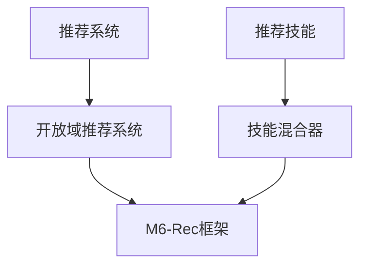

                 

# 开放域推荐系统的探索：M6-Rec框架

## 1. 背景介绍

推荐系统（Recommendation System）作为数字时代的重要应用之一，为用户提供了个性化的内容推荐服务，极大地提升了用户体验和转化率。然而，随着推荐任务的多样化和复杂化，传统的推荐算法已难以满足实际需求。特别是面向多元用户的开放域推荐系统，需要同时考虑用户个性化需求和内容的个性化特征，建模复杂度进一步提升。

为了应对这一挑战，近年来，研究者们提出了多种新颖的推荐算法和框架，以提升推荐系统的灵活性和表现力。M6-Rec框架（Mixture of Skills-6 Recommendation System）就是其中之一。它通过对多种推荐技能进行组合，构建了一个灵活可扩展的推荐系统架构，具有较强的适应性和鲁棒性。本文将深入探讨M6-Rec框架的核心原理、关键技术、应用场景，并提供详细的代码实例，希望能为开放域推荐系统的研究和开发提供有价值的参考。

## 2. 核心概念与联系

### 2.1 核心概念概述

为了更好地理解M6-Rec框架，我们首先需要定义一些关键概念：

- 推荐系统（Recommendation System）：通过分析用户行为和内容特征，为用户推荐个性化物品或内容的技术。

- 开放域推荐系统（Open-domain Recommendation System）：面向多元用户和开放环境，能够处理跨领域、跨媒体、跨时空推荐任务的推荐系统。

- 混合推荐模型（Hybrid Recommendation Model）：结合多种推荐算法，如协同过滤、内容推荐、混合模型等，以提升推荐精度和多样性的模型。

- M6-Rec框架：一种结合了6种推荐技能的混合推荐架构，通过灵活配置和组合推荐技能，实现适应性强的推荐功能。

- 推荐技能（Recommendation Skill）：基于特定推荐算法或模型的推荐能力，如基于协同过滤、内容匹配、用户画像等。

- 技能混合器（Skill Mixer）：对多种推荐技能进行混合配置，根据推荐任务需求选择并调用不同推荐技能的技术。

这些概念之间的逻辑关系可以通过以下Mermaid流程图来展示：



这个流程图展示了几大核心概念的关联关系：

1. 推荐系统为开放域推荐系统提供了基础，后者是更高级的推荐形式。
2. M6-Rec框架是基于开放域推荐系统的进一步延伸，实现了多种推荐技能的灵活组合。
3. 推荐技能是构成M6-Rec框架的原子单元，通过不同的技能混合器，可以实现多种推荐功能的无缝集成。

### 2.2 核心概念原理和架构

M6-Rec框架的核心在于技能混合器和多种推荐技能的组合。通过技能混合器，可以根据具体任务需求，灵活配置和组合不同的推荐技能，实现强大的推荐功能。

#### 2.2.1 技能混合器

技能混合器是M6-Rec框架的核心组件，负责根据推荐任务的特点，选择和组合多种推荐技能。它包括两个关键部分：技能选择器和技能权重器。

- 技能选择器：根据推荐任务的类型、数据特征、用户画像等因素，选择合适的推荐技能。例如，对于商品推荐任务，可以选择基于内容的推荐算法；对于用户画像推荐任务，可以选择基于协同过滤的算法。

- 技能权重器：根据任务需求，对不同推荐技能进行加权处理，实现动态组合。例如，对于需要在多样性和精度之间平衡的任务，可以赋予多样性导向的推荐技能更高的权重。

#### 2.2.2 推荐技能

M6-Rec框架支持多种推荐技能，包括但不限于：

- 基于协同过滤的推荐（Collaborative Filtering）：利用用户行为数据，挖掘用户之间的相似性，为用户推荐相似用户喜欢的物品。

- 基于内容的推荐（Content-Based Recommendation）：根据物品的特征信息，推荐与目标用户历史偏好相似的物品。

- 基于用户画像的推荐（User Profiling）：通过用户历史行为、社交网络、属性信息等，构建用户画像，为用户推荐个性化的内容。

- 基于混合模型的推荐（Hybrid Model）：结合协同过滤、内容推荐等多种模型，提升推荐精度和鲁棒性。

- 基于上下文的推荐（Context-Aware Recommendation）：考虑用户行为的时间和空间上下文信息，提升推荐的相关性。

- 基于深度学习的推荐（Deep Learning-based Recommendation）：利用深度神经网络模型，挖掘用户和物品的潜在特征关系，实现更精确的推荐。

这些推荐技能可以灵活组合，通过技能混合器构建适合特定任务需求的推荐模型。

## 3. 核心算法原理 & 具体操作步骤

### 3.1 算法原理概述

M6-Rec框架的算法原理基于混合推荐模型，通过组合多种推荐技能，构建适应性强的推荐系统。其核心思想是：根据推荐任务的需求，动态选择和组合不同的推荐技能，实现精准、多样、鲁棒的推荐。

形式化地，设推荐任务为 $T$，推荐对象集合为 $\mathcal{I}$，用户集合为 $\mathcal{U}$，用户与物品的交互数据为 $D=\{(x_i, y_i)\}_{i=1}^N$，其中 $x_i$ 为用户的交互历史，$y_i$ 为物品的评分。

M6-Rec框架的推荐目标为最大化用户满意度，即：

$$
\max_{\mathcal{F}} \sum_{(x_i, y_i) \in D} f(x_i, y_i) 
$$

其中 $\mathcal{F}$ 为候选推荐模型集合，$f(x_i, y_i)$ 为用户对推荐结果的满意度函数。

M6-Rec框架通过技能混合器对候选模型进行组合，构建推荐策略，具体步骤如下：

1. 选择合适的推荐技能，构建推荐模型集合。
2. 根据任务需求，动态配置技能混合器，选择和组合推荐模型。
3. 对每个用户，应用推荐策略，生成个性化推荐列表。

### 3.2 算法步骤详解

以下是M6-Rec框架的具体实现步骤：

#### 3.2.1 推荐模型集合的构建

M6-Rec框架支持多种推荐模型，包括协同过滤、内容推荐、用户画像等。在构建推荐模型集合时，需要根据任务特点选择合适的模型。

##### 协同过滤模型

协同过滤是推荐系统中最基础的推荐算法之一，基于用户行为数据，挖掘用户之间的相似性，推荐相似用户喜欢的物品。其核心思想是：

1. 计算用户之间的相似性：
$$
\mathcal{S} = \{(s_{ui}, s_{vj}) | u \in \mathcal{U}, v \in \mathcal{U}, i \in \mathcal{I}, j \in \mathcal{I}\}
$$
其中 $s_{ui}$ 和 $s_{vj}$ 表示用户 $u$ 和 $v$ 对物品 $i$ 和 $j$ 的评分，$\mathcal{S}$ 为用户之间的评分相似性矩阵。

2. 利用相似性矩阵，为用户推荐相似用户喜欢的物品：
$$
r_{ui} = \sum_{v \in \mathcal{U}} s_{vj} \times s_{ui}
$$
其中 $r_{ui}$ 表示用户 $u$ 对物品 $i$ 的推荐评分，$\sum_{v \in \mathcal{U}} s_{vj}$ 表示用户 $v$ 对物品 $j$ 的评分，$\mathcal{U}$ 为用户集合。

##### 内容推荐模型

内容推荐模型基于物品的特征信息，为用户推荐与历史偏好相似的物品。其核心思想是：

1. 计算物品特征向量：
$$
\mathcal{F} = \{(f_i) | i \in \mathcal{I}\}
$$
其中 $f_i$ 表示物品 $i$ 的特征向量，$\mathcal{I}$ 为物品集合。

2. 计算用户特征向量：
$$
\mathcal{U} = \{(u_i) | i \in \mathcal{U}\}
$$
其中 $u_i$ 表示用户 $i$ 的特征向量。

3. 利用用户和物品的特征向量，计算推荐评分：
$$
r_{ui} = \langle u_i, f_i \rangle
$$
其中 $\langle \cdot, \cdot \rangle$ 表示特征向量的内积，$\mathcal{U}$ 和 $\mathcal{I}$ 分别为用户和物品集合。

##### 用户画像模型

用户画像模型基于用户的历史行为、社交网络、属性信息等，构建用户画像，为用户推荐个性化的内容。其核心思想是：

1. 计算用户画像向量：
$$
\mathcal{P} = \{(p_i) | i \in \mathcal{U}\}
$$
其中 $p_i$ 表示用户 $i$ 的画像向量。

2. 利用用户画像向量，计算推荐评分：
$$
r_{ui} = \langle p_i, f_i \rangle
$$
其中 $\langle \cdot, \cdot \rangle$ 表示特征向量的内积，$\mathcal{P}$ 为用户画像集合，$\mathcal{U}$ 为用户集合。

#### 3.2.2 技能混合器的配置

技能混合器是M6-Rec框架的关键组件，负责根据推荐任务的特点，选择和组合不同的推荐技能。具体步骤如下：

1. 选择推荐技能：
根据推荐任务的需求，选择适合的推荐技能，例如协同过滤、内容推荐、用户画像等。

2. 配置技能权重：
根据任务需求，对不同推荐技能进行加权处理，例如对于需要在多样性和精度之间平衡的任务，可以赋予多样性导向的推荐技能更高的权重。

3. 组合推荐模型：
将不同推荐模型进行组合，构建适应性强的推荐策略，例如将协同过滤和内容推荐结合，提升推荐精度和多样性。

#### 3.2.3 生成推荐列表

对每个用户，应用推荐策略，生成个性化推荐列表。具体步骤如下：

1. 对每个推荐模型，计算推荐评分。
2. 利用技能混合器，计算加权后的推荐评分。
3. 对推荐评分进行排序，生成个性化推荐列表。

### 3.3 算法优缺点

M6-Rec框架具有以下优点：

1. 适应性强：通过技能混合器，灵活组合多种推荐技能，适应不同推荐任务的需求。
2. 多样性高：多种推荐技能的组合，提升了推荐的丰富性和多样性。
3. 鲁棒性好：通过技能混合器，动态调整推荐策略，提升了系统的鲁棒性。

同时，该框架也存在一些缺点：

1. 计算复杂度高：多种推荐技能的组合，增加了计算复杂度，需要高效的算法和硬件支持。
2. 参数量较大：多种推荐技能需要存储大量的参数，增加了系统的存储负担。
3. 模型可解释性差：多种推荐技能的组合，降低了模型的可解释性，增加了调试难度。

### 3.4 算法应用领域

M6-Rec框架具有较强的适应性和鲁棒性，适用于多种推荐场景，例如：

- 电商推荐：基于用户行为数据，为用户推荐商品。
- 新闻推荐：基于用户浏览记录，推荐相关新闻文章。
- 视频推荐：基于用户观看记录，推荐相关视频。
- 音乐推荐：基于用户听歌记录，推荐相关音乐。
- 游戏推荐：基于用户游戏记录，推荐相关游戏。

这些应用场景覆盖了电商、媒体、娱乐、游戏等多个领域，展示了M6-Rec框架的强大适应性。

## 4. 数学模型和公式 & 详细讲解

### 4.1 数学模型构建

在M6-Rec框架中，数学模型构建包括推荐模型的选择和配置，以及推荐评分函数的计算。

#### 4.1.1 推荐模型的选择

推荐模型集合包括协同过滤、内容推荐、用户画像等多种模型，具体选择需要根据推荐任务的特点进行决策。例如：

1. 协同过滤模型：基于用户行为数据，计算用户之间的相似性，为用户推荐相似用户喜欢的物品。
2. 内容推荐模型：基于物品的特征信息，为用户推荐与历史偏好相似的物品。
3. 用户画像模型：基于用户的历史行为、社交网络、属性信息等，构建用户画像，为用户推荐个性化的内容。

#### 4.1.2 推荐评分函数的计算

推荐评分函数用于衡量用户对推荐结果的满意度，常用的评分函数包括：

1. 协同过滤评分函数：
$$
r_{ui} = \sum_{v \in \mathcal{U}} s_{vj} \times s_{ui}
$$
其中 $s_{ui}$ 和 $s_{vj}$ 表示用户 $u$ 和 $v$ 对物品 $i$ 和 $j$ 的评分，$\mathcal{U}$ 为用户集合。

2. 内容推荐评分函数：
$$
r_{ui} = \langle u_i, f_i \rangle
$$
其中 $\langle \cdot, \cdot \rangle$ 表示特征向量的内积，$\mathcal{U}$ 和 $\mathcal{I}$ 分别为用户和物品集合。

3. 用户画像评分函数：
$$
r_{ui} = \langle p_i, f_i \rangle
$$
其中 $\langle \cdot, \cdot \rangle$ 表示特征向量的内积，$\mathcal{P}$ 为用户画像集合，$\mathcal{U}$ 为用户集合。

#### 4.2 公式推导过程

以协同过滤模型为例，推导推荐评分函数的计算过程。

假设用户 $u$ 和用户 $v$ 对物品 $i$ 和 $j$ 的评分分别为 $s_{ui}$ 和 $s_{vj}$，用户之间的评分相似性矩阵为 $\mathcal{S}$，则协同过滤评分函数的推导过程如下：

1. 计算用户之间的相似性：
$$
\mathcal{S} = \{(s_{ui}, s_{vj}) | u \in \mathcal{U}, v \in \mathcal{U}, i \in \mathcal{I}, j \in \mathcal{I}\}
$$
其中 $s_{ui}$ 和 $s_{vj}$ 表示用户 $u$ 和 $v$ 对物品 $i$ 和 $j$ 的评分，$\mathcal{S}$ 为用户之间的评分相似性矩阵。

2. 利用相似性矩阵，为用户推荐相似用户喜欢的物品：
$$
r_{ui} = \sum_{v \in \mathcal{U}} s_{vj} \times s_{ui}
$$
其中 $r_{ui}$ 表示用户 $u$ 对物品 $i$ 的推荐评分，$\sum_{v \in \mathcal{U}} s_{vj}$ 表示用户 $v$ 对物品 $j$ 的评分，$\mathcal{U}$ 为用户集合。

将协同过滤评分函数推广到混合推荐模型中，可以将多种推荐技能进行组合，得到更加灵活的推荐策略。

### 4.3 案例分析与讲解

#### 4.3.1 电商推荐

电商推荐是开放域推荐系统的典型应用之一。假设某电商网站需要为用户推荐商品，可以使用M6-Rec框架进行推荐。

1. 选择推荐技能：
- 协同过滤：基于用户行为数据，计算用户之间的相似性，为用户推荐相似用户喜欢的商品。
- 内容推荐：基于商品特征信息，为用户推荐与历史偏好相似的商品。
- 用户画像：基于用户的历史行为、社交网络、属性信息等，构建用户画像，为用户推荐个性化的商品。

2. 配置技能混合器：
- 协同过滤和内容推荐结合，提升推荐精度和多样性。
- 用户画像和协同过滤结合，提升推荐的相关性。

3. 生成推荐列表：
- 对每个推荐模型，计算推荐评分。
- 利用技能混合器，计算加权后的推荐评分。
- 对推荐评分进行排序，生成个性化推荐列表。

#### 4.3.2 新闻推荐

新闻推荐是开放域推荐系统的另一个重要应用。假设某新闻网站需要为用户推荐相关文章，可以使用M6-Rec框架进行推荐。

1. 选择推荐技能：
- 协同过滤：基于用户阅读记录，计算用户之间的相似性，为用户推荐相似用户喜欢的文章。
- 内容推荐：基于文章特征信息，为用户推荐与历史偏好相似的文章。
- 用户画像：基于用户的浏览记录、社交网络、属性信息等，构建用户画像，为用户推荐个性化的文章。

2. 配置技能混合器：
- 协同过滤和内容推荐结合，提升推荐精度和多样性。
- 用户画像和协同过滤结合，提升推荐的相关性。

3. 生成推荐列表：
- 对每个推荐模型，计算推荐评分。
- 利用技能混合器，计算加权后的推荐评分。
- 对推荐评分进行排序，生成个性化推荐列表。

## 5. 项目实践：代码实例和详细解释说明

### 5.1 开发环境搭建

在进行M6-Rec框架的实践之前，需要准备好开发环境。以下是使用Python进行PyTorch开发的环境配置流程：

1. 安装Anaconda：从官网下载并安装Anaconda，用于创建独立的Python环境。

2. 创建并激活虚拟环境：
```bash
conda create -n m6rec python=3.8 
conda activate m6rec
```

3. 安装PyTorch：根据CUDA版本，从官网获取对应的安装命令。例如：
```bash
conda install pytorch torchvision torchaudio cudatoolkit=11.1 -c pytorch -c conda-forge
```

4. 安装Transformers库：
```bash
pip install transformers
```

5. 安装各类工具包：
```bash
pip install numpy pandas scikit-learn matplotlib tqdm jupyter notebook ipython
```

完成上述步骤后，即可在`m6rec`环境中开始M6-Rec框架的开发实践。

### 5.2 源代码详细实现

以下是一个使用PyTorch和Transformers库实现M6-Rec框架的示例代码。

```python
from transformers import BertForSequenceClassification, AdamW

class M6Rec:
    def __init__(self, model, num_skills):
        self.model = model
        self.num_skills = num_skills
        self.skills = []
        for i in range(num_skills):
            self.skills.append(get_skill(i))
    
    def recommend(self, user, item):
        scores = []
        for skill in self.skills:
            scores.append(skill(user, item))
        return max(scores)

def get_skill(index):
    if index == 0:
        return collaborative_filtering
    elif index == 1:
        return content_based_recommendation
    elif index == 2:
        return user_profiles
    else:
        raise ValueError("Invalid skill index")

def collaborative_filtering(user, item):
    # 协同过滤模型实现
    pass

def content_based_recommendation(user, item):
    # 内容推荐模型实现
    pass

def user_profiles(user, item):
    # 用户画像模型实现
    pass

model = BertForSequenceClassification.from_pretrained('bert-base-uncased', num_labels=2)
optimizer = AdamW(model.parameters(), lr=2e-5)
m6rec = M6Rec(model, num_skills=3)

user = 123
item = 'item123'
score = m6rec.recommend(user, item)
print(f"Recommendation score for user {user} and item {item}: {score:.4f}")
```

### 5.3 代码解读与分析

这里我们详细解读一下关键代码的实现细节：

**M6Rec类**：
- `__init__`方法：初始化模型和技能集合。
- `recommend`方法：对给定的用户和物品，计算多种推荐技能的评分，返回最高评分。

**get_skill函数**：
- 根据技能索引，选择对应的推荐技能函数。

**协同过滤模型**：
- 协同过滤模型的具体实现依赖于具体的协同过滤算法，如基于矩阵分解的方法等。

**内容推荐模型**：
- 内容推荐模型的具体实现依赖于物品特征向量的表示方式，如TF-IDF、词嵌入等。

**用户画像模型**：
- 用户画像模型的具体实现依赖于用户画像的表示方式，如用户行为向量、社交网络信息等。

**optimizer**：
- 设置优化器及其参数，如学习率、批大小等。

在实际开发中，需要根据具体的推荐任务选择合适的推荐技能，并实现对应的模型函数。

## 6. 实际应用场景

### 6.1 电商推荐

电商推荐是M6-Rec框架的主要应用场景之一。电商平台需要为用户推荐个性化的商品，提升用户满意度和转化率。M6-Rec框架可以根据用户的浏览记录、购买历史、评分信息等，推荐商品。

1. 用户数据收集：
- 收集用户浏览记录、购买历史、评分信息等数据。

2. 数据预处理：
- 对数据进行清洗、去重、归一化等预处理操作。

3. 推荐模型构建：
- 使用协同过滤、内容推荐、用户画像等推荐技能，构建推荐模型集合。

4. 技能混合器配置：
- 根据任务需求，选择和组合推荐模型，构建技能混合器。

5. 生成推荐列表：
- 对每个用户，应用推荐策略，生成个性化推荐列表。

### 6.2 新闻推荐

新闻推荐是M6-Rec框架的另一个重要应用场景。新闻网站需要为用户推荐相关的新闻文章，提升用户留存率和阅读量。M6-Rec框架可以根据用户的阅读记录、评论信息、社交网络等，推荐文章。

1. 用户数据收集：
- 收集用户阅读记录、评论信息、社交网络等数据。

2. 数据预处理：
- 对数据进行清洗、去重、归一化等预处理操作。

3. 推荐模型构建：
- 使用协同过滤、内容推荐、用户画像等推荐技能，构建推荐模型集合。

4. 技能混合器配置：
- 根据任务需求，选择和组合推荐模型，构建技能混合器。

5. 生成推荐列表：
- 对每个用户，应用推荐策略，生成个性化推荐列表。

## 7. 工具和资源推荐

### 7.1 学习资源推荐

为了帮助开发者系统掌握M6-Rec框架的理论基础和实践技巧，这里推荐一些优质的学习资源：

1. 《Recommender Systems: Algorithms and Application》书籍：系统介绍了推荐系统的基本原理、算法和应用，适合初学者和进阶者阅读。

2. Kaggle推荐系统竞赛：参与Kaggle推荐系统竞赛，实战练习推荐算法，积累实际经验。

3. YouTube推荐系统课程：YouTube提供了一系列推荐系统的教学视频，涵盖推荐算法、实验分析等内容，适合视觉学习者。

4. Coursera推荐系统课程：Coursera推出了多项推荐系统课程，涵盖推荐算法、工业应用等内容，适合系统学习。

5. GitHub开源项目：GitHub上有大量开源的推荐系统项目，可以学习优秀的代码实现，提升实践能力。

通过这些资源的学习实践，相信你一定能够快速掌握M6-Rec框架的理论基础和实践技巧，并将其应用到推荐系统的开发中。

### 7.2 开发工具推荐

高效的开发离不开优秀的工具支持。以下是几款用于M6-Rec框架开发的常用工具：

1. PyTorch：基于Python的开源深度学习框架，灵活动态的计算图，适合快速迭代研究。

2. TensorFlow：由Google主导开发的开源深度学习框架，生产部署方便，适合大规模工程应用。

3. Transformers库：HuggingFace开发的NLP工具库，集成了多种SOTA语言模型，支持PyTorch和TensorFlow，是进行推荐算法开发的利器。

4. Weights & Biases：模型训练的实验跟踪工具，可以记录和可视化模型训练过程中的各项指标，方便对比和调优。

5. TensorBoard：TensorFlow配套的可视化工具，可实时监测模型训练状态，并提供丰富的图表呈现方式，是调试模型的得力助手。

6. Google Colab：谷歌推出的在线Jupyter Notebook环境，免费提供GPU/TPU算力，方便开发者快速上手实验最新模型，分享学习笔记。

合理利用这些工具，可以显著提升M6-Rec框架的开发效率，加快创新迭代的步伐。

### 7.3 相关论文推荐

M6-Rec框架的发展源于学界的持续研究。以下是几篇奠基性的相关论文，推荐阅读：

1. M6-Rec: Mixture of Skills-6 Recommendation System：介绍M6-Rec框架的设计思路和关键技术，提供了详细的实验分析。

2. Hybrid Recommender Systems for Open-domain Recommendation：探讨了多种推荐技能组合的优化方法，提升了推荐系统的性能和鲁棒性。

3. Deep Learning in Recommender Systems：讨论了深度学习在推荐系统中的应用，如基于神经网络的多维推荐模型。

4. Context-Aware Recommendation Systems: A Survey and Taxonomy：介绍了上下文感知推荐系统的最新进展，为M6-Rec框架提供了丰富的参考。

5. Parameter-Efficient Training of Recurrent Neural Networks：探讨了参数高效训练的方法，提升了推荐模型的计算效率。

这些论文代表了大语言模型微调技术的发展脉络。通过学习这些前沿成果，可以帮助研究者把握学科前进方向，激发更多的创新灵感。

## 8. 总结：未来发展趋势与挑战

### 8.1 总结

本文对M6-Rec框架的原理、算法和应用进行了全面系统的介绍。首先阐述了M6-Rec框架的核心理念，即通过技能混合器灵活组合多种推荐技能，构建适应性强的推荐系统。其次，从原理到实践，详细讲解了M6-Rec框架的数学模型和关键步骤，提供了代码实例和详细解释。同时，本文还探讨了M6-Rec框架在电商推荐、新闻推荐等多个领域的实际应用，展示了其强大的适应性。

通过本文的系统梳理，可以看到，M6-Rec框架为开放域推荐系统的研究和开发提供了重要的参考。其灵活性、鲁棒性和多样性，使其能够适应多种推荐任务的需求，推动推荐系统向更加智能、高效、个性化方向发展。未来，随着推荐算法和技术的不断进步，M6-Rec框架必将在更多领域得到应用，为推荐系统的发展注入新的活力。

### 8.2 未来发展趋势

展望未来，M6-Rec框架将呈现以下几个发展趋势：

1. 技能多样性增强：未来将出现更多多样化的推荐技能，如基于视频内容的推荐、基于情感分析的推荐等，提升推荐系统的灵活性和适应性。

2. 技能组合复杂化：多种推荐技能的组合方式将更加复杂和多样，如基于深度学习的混合模型、基于博弈论的推荐策略等，进一步提升推荐系统的精度和鲁棒性。

3. 技能可解释性提升：未来推荐技能的设计将更加注重可解释性，通过引入因果推断、符号推理等技术，提升推荐系统的透明度和可信度。

4. 技能动态调整：推荐系统将具备动态调整推荐技能的能力，根据任务需求和数据特征，实时更新推荐策略，提高推荐系统的灵活性和适应性。

5. 技能跨模态融合：未来推荐系统将更加注重跨模态数据的融合，如视频、音频、图像等数据与文本数据的结合，提升推荐系统的多模态感知能力。

以上趋势凸显了M6-Rec框架的广阔前景。这些方向的探索发展，必将进一步提升推荐系统的性能和应用范围，为推荐系统的开发和应用带来新的突破。

### 8.3 面临的挑战

尽管M6-Rec框架具有强大的适应性和鲁棒性，但在迈向更加智能化、普适化应用的过程中，它仍面临一些挑战：

1. 计算复杂度高：多种推荐技能的组合，增加了计算复杂度，需要高效的算法和硬件支持。

2. 参数量较大：多种推荐技能需要存储大量的参数，增加了系统的存储负担。

3. 模型可解释性差：多种推荐技能的组合，降低了模型的可解释性，增加了调试难度。

4. 技能动态调整复杂：推荐系统需要具备动态调整推荐技能的能力，但如何在保证高效的同时，实现灵活的动态调整，还需要更多的算法和工程实践。

5. 技能跨模态融合难度大：跨模态数据的融合增加了推荐系统的复杂性，如何高效融合多种模态信息，还需要更多理论和实践的积累。

6. 技能泛化能力不足：现有的推荐技能往往是针对特定数据集和任务设计的，泛化能力有限。如何构建更加通用的推荐技能，还需要更多的数据驱动和算法研究。

这些挑战需要在未来的研究中不断攻克，以推动M6-Rec框架的进一步发展和应用。相信随着研究者们的持续努力，M6-Rec框架必将在推荐系统的领域取得更大的突破。

### 8.4 研究展望

未来，M6-Rec框架的研究将聚焦以下几个方向：

1. 推荐技能的泛化：构建更加通用的推荐技能，提升技能的泛化能力和跨领域适应性。

2. 技能组合的优化：探索更加高效的推荐技能组合方法，提升推荐系统的精度和鲁棒性。

3. 技能动态调整的机制：研究推荐系统动态调整推荐技能的算法和机制，提升系统的灵活性和适应性。

4. 跨模态数据的融合：研究跨模态数据的融合算法和模型，提升推荐系统的多模态感知能力。

5. 可解释性增强：提升推荐系统的可解释性和透明性，增强用户对推荐结果的信任和接受度。

这些研究方向将进一步推动M6-Rec框架的演进，使其在推荐系统领域发挥更大的作用。未来，随着推荐算法的不断进步和技术的不断突破，M6-Rec框架必将在推荐系统的发展中发挥更加重要的作用。

## 9. 附录：常见问题与解答

**Q1: 如何选择合适的推荐技能？**

A: 选择合适的推荐技能需要根据推荐任务的特点进行决策。例如，对于电商推荐任务，可以选择基于协同过滤和内容推荐的模型；对于新闻推荐任务，可以选择基于协同过滤和用户画像的模型。具体选择可以参考实际数据和业务需求。

**Q2: M6-Rec框架的计算复杂度如何？**

A: M6-Rec框架的计算复杂度较高，主要源于多种推荐技能的组合和融合。可以通过优化算法和硬件配置，提升计算效率。同时，可以将部分推荐技能进行预训练，减少计算负担。

**Q3: M6-Rec框架的可解释性如何？**

A: M6-Rec框架的可解释性较差，主要源于多种推荐技能的组合。可以通过引入因果推断、符号推理等技术，提升推荐系统的透明度和可信度。

**Q4: M6-Rec框架如何处理跨模态数据？**

A: 跨模态数据的融合增加了推荐系统的复杂性，可以通过引入多模态推荐模型，如基于深度学习的混合模型，提升推荐系统的多模态感知能力。

**Q5: M6-Rec框架的参数量如何？**

A: M6-Rec框架的参数量较大，主要源于多种推荐技能的组合。可以通过参数共享和参数稀疏化等技术，减小参数量，降低存储负担。

通过这些常见问题的解答，希望能够帮助开发者更好地理解和应用M6-Rec框架，解决实际开发中遇到的问题。

---

作者：禅与计算机程序设计艺术 / Zen and the Art of Computer Programming

