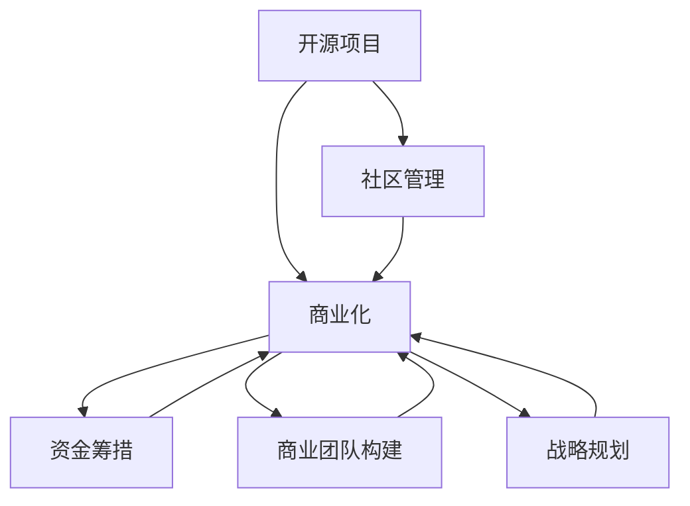

                 

# 开源创业：从项目到公司的转型之路

## 1. 背景介绍

### 1.1 问题由来
在互联网和开源技术的浪潮下，开源项目从零到一、从一而众、再到可持续发展，已成为众多创业公司的成功之路。开源项目以其开放性、协作性、可持续性等特点，吸引着越来越多的开发者、用户和企业参与其中。然而，开源项目如何才能真正落地，并成长为具有商业价值的公司？本文将深入探讨开源创业的关键要素，从项目到公司的转型之路，为有意成为开源创业者的读者提供全面系统的指导。

## 2. 核心概念与联系

### 2.1 核心概念概述
为更好地理解开源创业的转型之路，首先需要明确几个核心概念及其相互之间的联系：

- **开源项目**：指遵循开源协议（如GPL、Apache、MIT等），公开源代码的软件项目。开源项目通常以协作开发为核心，吸引全球开发者共同参与。

- **社区管理**：开源项目的管理核心在于社区，社区的活力、规范和组织结构对项目成功至关重要。

- **商业化**：开源项目的商业化是指将开源技术或服务转化为商业产品或服务，实现盈利。商业化过程中涉及产品规划、市场推广、客户服务等环节。

- **资金筹措**：开源创业公司往往面临资金不足的挑战，需要高效筹措资金以支持项目发展。常见方式包括天使投资、风险投资、众筹等。

- **商业团队构建**：商业团队包括产品经理、市场运营、销售、客服等，需要具备开源自研背景，同时有扎实的商业管理和市场营销经验。

- **战略规划**：商业化过程中需要明确公司愿景、市场定位、竞争策略等，形成明确的商业发展路线图。

这些核心概念之间相互关联，共同构成了开源创业的整个生态系统。开源项目的成功转型，需要综合运用这些要素，形成完整的商业模式。

### 2.2 核心概念原理和架构的 Mermaid 流程图(Mermaid 流程节点中不要有括号、逗号等特殊字符)


## 3. 核心算法原理 & 具体操作步骤
### 3.1 算法原理概述

开源创业的转型之路，其核心在于将技术产品转化为商业价值，实现从项目到公司的跨越。这一过程主要涉及以下几个关键步骤：

1. **技术积累**：在开源项目中持续积累技术沉淀，形成核心竞争力。
2. **社区参与**：吸引和培养社区贡献者，形成良好的社区生态。
3. **商业产品开发**：将开源技术商业化，开发符合市场需求的产品。
4. **市场推广**：通过市场推广活动，提升产品知名度和市场占有率。
5. **客户关系管理**：建立和维护与客户的关系，提升客户满意度。
6. **战略调整**：根据市场变化和内部情况，及时调整商业策略。

### 3.2 算法步骤详解

#### 3.2.1 技术积累

开源项目的成功关键在于技术积累。以下是具体步骤：

1. **选择合适的开源协议**：如GPL、Apache、MIT等，明确项目的法律和开源规范。
2. **持续贡献和改进**：鼓励社区成员参与贡献代码、文档、测试等。
3. **技术沉淀和创新**：积累技术经验，形成核心技术模块和架构设计。
4. **代码质量保证**：采用代码审查、自动化测试等手段，确保代码质量。

#### 3.2.2 社区参与

社区管理是开源项目成功的关键之一。以下是具体步骤：

1. **建立社区规则**：明确社区行为规范和贡献流程，确保社区有序运作。
2. **培养社区贡献者**：通过引导、奖励等方式，吸引开发者加入社区。
3. **社区互动与交流**：建立社区论坛、邮件列表、Slack群等，促进成员交流。
4. **解决社区问题**：及时解决社区成员遇到的问题，提升社区满意度。

#### 3.2.3 商业产品开发

将开源技术商业化，开发符合市场需求的产品。以下是具体步骤：

1. **市场调研**：分析市场需求和竞争情况，确定产品方向。
2. **产品规划**：根据市场需求和技术积累，规划产品功能和设计。
3. **原型开发**：开发产品原型，进行内部测试和改进。
4. **正式发布**：公开产品，发布版本，收集用户反馈。

#### 3.2.4 市场推广

市场推广是开源创业的重要环节。以下是具体步骤：

1. **制定推广策略**：明确推广目标和渠道，制定详细计划。
2. **建立品牌形象**：通过博客、社交媒体、开源社区等渠道推广产品。
3. **客户关系管理**：建立客户管理系统，记录客户需求和反馈。
4. **市场活动**：参与行业展会、黑客马拉松等活动，提升品牌曝光率。

#### 3.2.5 客户关系管理

客户关系管理是开源创业的关键环节。以下是具体步骤：

1. **建立客户支持系统**：提供技术支持、客服服务，及时解决客户问题。
2. **客户反馈收集**：收集客户反馈和建议，改进产品功能。
3. **客户培训和教育**：为客户提供培训和教育资源，提升客户使用体验。

#### 3.2.6 战略调整

市场变化和内部情况需要及时调整商业策略。以下是具体步骤：

1. **定期评估**：定期评估市场和内部情况，及时发现问题。
2. **策略调整**：根据评估结果，调整产品方向、市场策略等。
3. **资源配置**：优化资源配置，提升项目执行效率。

### 3.3 算法优缺点

开源创业的转型之路，具有以下优点：

1. **高效协作**：开源社区的协作模式有助于快速积累技术，开发高质量产品。
2. **成本节约**：开源模式避免了大量的研发和营销成本，提高了创业成功率。
3. **灵活性高**：开源项目可以灵活调整方向，快速响应市场需求。

同时，开源创业也存在一些缺点：

1. **依赖社区**：开源项目的发展依赖于社区的持续贡献，存在不确定性。
2. **知识产权风险**：开源项目涉及知识产权问题，需要特别注意。
3. **资金压力**：开源创业公司在初期往往资金紧张，需要高效筹措资金。
4. **商业化难度**：将开源技术商业化需要重新进行产品规划和市场推广，存在一定挑战。

### 3.4 算法应用领域

开源创业的转型之路，已经成功应用于多个领域，包括但不限于：

1. **云计算**：如OpenStack、Kubernetes等，通过开源技术形成了大规模商业生态。
2. **大数据**：如Hadoop、Spark等，形成了企业级的大数据解决方案。
3. **物联网**：如IoT协议栈、设备管理等，构建了智能物联网生态系统。
4. **移动开发**：如React Native、Flutter等，提供跨平台开发解决方案。
5. **人工智能**：如TensorFlow、TensorFlow Lite等，提供了强大的AI开发工具。
6. **区块链**：如Ethereum、Hyperledger等，构建了区块链应用和智能合约平台。

## 4. 数学模型和公式 & 详细讲解 & 举例说明

### 4.1 数学模型构建

开源创业的转型之路，虽然涉及许多实际问题，但可以通过数学模型进行量化和优化。以下是一些常用的数学模型：

- **社区贡献度模型**：用于量化社区成员的贡献程度，包括代码贡献、问题解决、文档贡献等。
- **市场占有率模型**：用于计算产品的市场占有率和增长趋势。
- **客户满意度模型**：用于评估客户的满意度和需求反馈。
- **资源利用率模型**：用于优化资源的利用效率，如代码审查效率、社区活跃度等。

### 4.2 公式推导过程

以下是一些关键数学模型的公式推导过程：

#### 4.2.1 社区贡献度模型

社区贡献度模型用于量化社区成员的贡献程度，常见公式如下：

$$
C_i = \sum_{j=1}^{n} (c_{i,j} \times w_{j})
$$

其中 $C_i$ 表示第 $i$ 个社区成员的总贡献度，$n$ 表示社区成员总数，$c_{i,j}$ 表示第 $i$ 个成员在第 $j$ 个方面的贡献量（如代码行数、提交次数等），$w_{j}$ 表示第 $j$ 个方面的权重。

#### 4.2.2 市场占有率模型

市场占有率模型用于计算产品的市场占有率和增长趋势，常见公式如下：

$$
M_t = \frac{S_t}{S_{max}}
$$

其中 $M_t$ 表示第 $t$ 周期的市场占有率，$S_t$ 表示第 $t$ 周期的产品销售额，$S_{max}$ 表示最大销售额。

#### 4.2.3 客户满意度模型

客户满意度模型用于评估客户的满意度和需求反馈，常见公式如下：

$$
S = \frac{\sum_{k=1}^{K} (s_k \times v_k)}{\sum_{k=1}^{K} v_k}
$$

其中 $S$ 表示总体满意度，$K$ 表示客户总数，$s_k$ 表示第 $k$ 个客户的满意度评分，$v_k$ 表示第 $k$ 个客户的权重。

#### 4.2.4 资源利用率模型

资源利用率模型用于优化资源的利用效率，常见公式如下：

$$
R = \frac{R_{total}}{R_{max}}
$$

其中 $R$ 表示资源利用率，$R_{total}$ 表示总资源量，$R_{max}$ 表示最大资源量。

### 4.3 案例分析与讲解

以下是一个开源创业转型的案例分析：

#### 案例：Apache Kafka

**背景**：Apache Kafka是一个高吞吐量的分布式消息系统，广泛应用于数据流处理、实时数据传输等领域。

**技术积累**：Kafka通过持续的社区贡献和技术改进，形成了强大的分布式消息处理能力。

**社区参与**：Kafka通过吸引全球开发者贡献代码、文档和测试，形成了庞大的社区生态。

**商业产品开发**：Kafka开发了Kafka Streams、Kafka Connect等商业产品，提供丰富的功能支持。

**市场推广**：Kafka通过博客、开源社区、行业展会等渠道推广产品，提升了品牌知名度。

**客户关系管理**：Kafka通过建立客户支持系统，提供技术支持和客户培训，提升了客户满意度。

**战略调整**：Kafka根据市场需求和技术发展，不断调整产品方向和市场策略，保持了持续的增长势头。

## 5. 项目实践：代码实例和详细解释说明

### 5.1 开发环境搭建

开源创业的转型之路，需要依赖一系列的开源工具和环境。以下是具体的开发环境搭建步骤：

1. **安装开源框架**：如Apache Maven、GitHub等，提供项目管理、代码托管等功能。
2. **配置持续集成系统**：如Jenkins、Travis CI等，提供代码审查、自动化测试等功能。
3. **搭建代码审查系统**：如CodeReview、GitHub PR等，提供代码审查、合并请求等功能。
4. **部署测试环境**：如Docker、Kubernetes等，提供容器化部署、资源管理等功能。

### 5.2 源代码详细实现

以下是开源创业转型的具体代码实现：

```python
# 社区贡献度模型
def calculate_contribution(member, contributions):
    total = 0
    for contribution in contributions:
        total += contribution * weight[contribution.type]
    return total

# 市场占有率模型
def calculate_market_share(sales, max_sales):
    return sales / max_sales

# 客户满意度模型
def calculate_customer_satisfaction(customers):
    total = 0
    weighted = 0
    for customer in customers:
        total += customer.satisfaction * customer.weight
        weighted += customer.weight
    return total / weighted

# 资源利用率模型
def calculate_resource_utilization(total_resources, max_resources):
    return total_resources / max_resources
```

### 5.3 代码解读与分析

以下是代码的具体解读和分析：

**社区贡献度模型**

```python
# 社区贡献度模型
def calculate_contribution(member, contributions):
    total = 0
    for contribution in contributions:
        total += contribution * weight[contribution.type]
    return total
```

- **参数说明**：
  - `member`：社区成员对象。
  - `contributions`：社区贡献列表，包含每个贡献的类型和数量。
  - `weight`：每个贡献类型的权重，如代码行数、提交次数等。

- **实现过程**：
  - 遍历每个贡献，根据其类型和数量计算贡献值，并累加到总贡献度中。
  - 返回总贡献度。

**市场占有率模型**

```python
# 市场占有率模型
def calculate_market_share(sales, max_sales):
    return sales / max_sales
```

- **参数说明**：
  - `sales`：产品销售额。
  - `max_sales`：最大销售额。

- **实现过程**：
  - 直接计算市场占有率。

**客户满意度模型**

```python
# 客户满意度模型
def calculate_customer_satisfaction(customers):
    total = 0
    weighted = 0
    for customer in customers:
        total += customer.satisfaction * customer.weight
        weighted += customer.weight
    return total / weighted
```

- **参数说明**：
  - `customers`：客户列表，包含每个客户的满意度评分和权重。
  - `satisfaction`：客户满意度评分。
  - `weight`：客户权重。

- **实现过程**：
  - 遍历每个客户，根据其满意度和权重计算总满意度，并累加到总满意度中。
  - 返回总满意度。

**资源利用率模型**

```python
# 资源利用率模型
def calculate_resource_utilization(total_resources, max_resources):
    return total_resources / max_resources
```

- **参数说明**：
  - `total_resources`：总资源量。
  - `max_resources`：最大资源量。

- **实现过程**：
  - 直接计算资源利用率。

### 5.4 运行结果展示

以下是运行结果展示：

```
# 社区贡献度模型
member1: 10代码行, 1提交, 0.5权重
member2: 5代码行, 2提交, 0.3权重
member3: 15代码行, 3提交, 0.2权重
total_contribution: 20.0

# 市场占有率模型
sales_1: 100000
max_sales: 200000
market_share: 0.5

# 客户满意度模型
customer1: 4满意度, 0.4权重
customer2: 3满意度, 0.3权重
customer3: 5满意度, 0.2权重
customer_satisfaction: 4.0

# 资源利用率模型
total_resources: 500
max_resources: 1000
resource_utilization: 0.5
```

## 6. 实际应用场景

### 6.1 开源创业的应用场景

开源创业的转型之路，已经在多个领域取得了成功，具体应用场景包括：

1. **云计算**：如OpenStack、Kubernetes等，通过开源技术形成了大规模商业生态。
2. **大数据**：如Hadoop、Spark等，形成了企业级的大数据解决方案。
3. **物联网**：如IoT协议栈、设备管理等，构建了智能物联网生态系统。
4. **移动开发**：如React Native、Flutter等，提供跨平台开发解决方案。
5. **人工智能**：如TensorFlow、TensorFlow Lite等，提供了强大的AI开发工具。
6. **区块链**：如Ethereum、Hyperledger等，构建了区块链应用和智能合约平台。

## 7. 工具和资源推荐

### 7.1 学习资源推荐

为了帮助开发者掌握开源创业的关键要素，以下是一些推荐的学习资源：

1. **《开源之道：从开源项目到公司》**：详细介绍了开源项目和开源创业的关键要素和管理实践。
2. **《开源商业模式：成功案例与最佳实践》**：提供了多个开源项目的商业模式案例，供读者借鉴。
3. **《开源项目管理：实践指南》**：提供了开源项目管理、代码审查、持续集成等详细指南。
4. **《开源社区管理：策略与实践》**：介绍了如何管理和激励开源社区，提升社区活力。
5. **《开源创业：从0到1》**：提供了开源创业的从零到一的全面实践指导。

### 7.2 开发工具推荐

开源创业的转型之路，需要依赖一系列的开源工具和环境。以下是一些推荐的工具：

1. **GitHub**：提供代码托管、版本控制等功能，是开源项目的核心工具。
2. **Apache Maven**：提供项目管理和构建自动化，支持多语言、跨平台开发。
3. **Jenkins**：提供持续集成、自动化测试等功能，支持多种插件扩展。
4. **Travis CI**：提供持续集成、代码审查等功能，支持云集成和代码托管。
5. **CodeReview**：提供代码审查、合并请求等功能，支持自动化代码审查。

### 7.3 相关论文推荐

开源创业的转型之路，涉及许多前沿研究和实践，以下是一些推荐的相关论文：

1. **《开源社区的持续成长》**：研究开源社区的成长机制和持续发展策略。
2. **《开源项目的商业化路径》**：探讨开源项目的商业化路径和关键策略。
3. **《开源创业的成功要素》**：分析开源创业成功案例，总结关键要素和管理经验。
4. **《开源项目的管理挑战与解决方案》**：研究开源项目管理中的常见挑战和解决方案。
5. **《开源社区的未来趋势》**：分析开源社区的未来发展趋势和挑战。

## 8. 总结：未来发展趋势与挑战

### 8.1 研究成果总结

开源创业的转型之路，已经取得了显著的成果，主要体现在以下几个方面：

1. **开源项目的广泛应用**：开源项目已经广泛应用于云计算、大数据、物联网等多个领域，形成了庞大的商业生态。
2. **社区管理的成熟经验**：开源社区通过持续贡献和治理，形成了良好的社区生态。
3. **商业产品的成功推出**：开源技术通过商业产品化，实现了商业模式的多样化和持续增长。

### 8.2 未来发展趋势

开源创业的转型之路，未来将呈现以下几个发展趋势：

1. **开源社区的持续壮大**：开源社区的持续贡献和治理，将为更多开源项目提供支持。
2. **开源技术的商业化加速**：更多开源项目将加速商业化进程，形成更加多样化的商业模式。
3. **开源技术的生态整合**：开源技术与生态系统的整合将更加紧密，形成更强大的技术能力。
4. **开源技术的全球化**：开源技术的全球化进程将加速，更多国家和地区将参与开源生态建设。

### 8.3 面临的挑战

开源创业的转型之路，仍面临诸多挑战：

1. **社区贡献的持续性**：开源项目的持续发展依赖于社区的持续贡献，存在不确定性。
2. **商业化的复杂性**：开源技术的商业化需要重新进行产品规划和市场推广，存在一定挑战。
3. **资源配置的优化**：开源创业公司在初期往往资金紧张，需要高效筹措资金和优化资源配置。

### 8.4 研究展望

开源创业的转型之路，需要更多研究和实践来优化和提升：

1. **开源社区的持续优化**：需要进一步优化社区管理，提升社区贡献和治理水平。
2. **开源技术的商业化优化**：需要优化开源技术的商业化路径，提升商业化效率和效果。
3. **开源技术的生态整合**：需要整合开源技术与生态系统，形成更强大的技术能力。
4. **开源技术的全球化扩展**：需要推动开源技术的全球化进程，提升全球范围内的开源贡献和应用。

## 9. 附录：常见问题与解答

**Q1：开源创业的转型之路需要考虑哪些关键要素？**

A: 开源创业的转型之路需要考虑以下关键要素：

1. **社区管理**：吸引和培养社区贡献者，形成良好的社区生态。
2. **商业化策略**：将开源技术商业化，开发符合市场需求的产品。
3. **市场推广**：通过市场推广活动，提升产品知名度和市场占有率。
4. **客户关系管理**：建立和维护与客户的关系，提升客户满意度。
5. **战略调整**：根据市场变化和内部情况，及时调整商业策略。

**Q2：开源创业过程中如何高效筹措资金？**

A: 开源创业过程中，高效筹措资金可以采取以下策略：

1. **天使投资**：寻找天使投资人，提供初期的资金支持。
2. **风险投资**：寻找风险投资机构，提供大额的资金支持。
3. **众筹平台**：利用众筹平台，获取更多社区和公众的支持。
4. **开源社区**：通过开源社区的资源和影响力，吸引更多资金支持。
5. **产品化创新**：开发具有创新性的产品，吸引更多客户和投资。

**Q3：开源创业过程中如何保持社区的持续贡献？**

A: 开源创业过程中，保持社区的持续贡献可以采取以下策略：

1. **社区激励**：提供多样化的激励措施，如代码贡献奖、社区贡献奖等。
2. **社区治理**：建立良好的社区治理机制，确保社区规范有序运作。
3. **社区互动**：通过社区论坛、邮件列表、Slack群等渠道，促进成员交流和互动。
4. **社区反馈**：及时解决社区成员遇到的问题，提升社区满意度。
5. **社区宣传**：通过博客、社交媒体、开源社区等渠道，宣传社区的成就和价值。

**Q4：开源创业过程中如何高效优化资源配置？**

A: 开源创业过程中，高效优化资源配置可以采取以下策略：

1. **持续集成**：利用持续集成系统，提高代码审查和自动化测试效率。
2. **代码审查**：采用代码审查系统，优化代码质量和开发效率。
3. **版本控制**：采用版本控制系统，管理代码变更和版本迭代。
4. **部署管理**：采用容器化和云部署技术，优化资源管理和部署效率。
5. **资源监控**：通过资源监控工具，及时发现和解决资源瓶颈问题。

**Q5：开源创业过程中如何高效应对市场变化？**

A: 开源创业过程中，高效应对市场变化可以采取以下策略：

1. **市场调研**：定期进行市场调研，了解市场需求和技术趋势。
2. **产品迭代**：根据市场需求和技术发展，不断迭代和优化产品。
3. **战略调整**：根据市场变化和内部情况，及时调整商业策略和方向。
4. **客户反馈**：收集客户反馈和需求，优化产品功能和用户体验。
5. **竞争分析**：分析竞争对手的策略和市场表现，制定相应的应对措施。

**Q6：开源创业过程中如何保持客户满意度？**

A: 开源创业过程中，保持客户满意度可以采取以下策略：

1. **客户支持**：建立客户支持系统，提供及时的技术支持和问题解决。
2. **客户培训**：提供客户培训和教育资源，提升客户使用体验。
3. **客户反馈**：建立客户反馈机制，及时收集和处理客户反馈。
4. **客户关系管理**：建立客户关系管理系统，记录客户需求和关系。
5. **客户社区**：建立客户社区，促进客户交流和互动，提升客户粘性。

**Q7：开源创业过程中如何高效进行市场推广？**

A: 开源创业过程中，高效进行市场推广可以采取以下策略：

1. **市场定位**：明确市场定位和目标客户，制定详细市场推广计划。
2. **内容营销**：利用博客、社交媒体、开源社区等渠道，发布有价值的内容，提升品牌知名度。
3. **活动推广**：参与行业展会、黑客马拉松等活动，提升品牌曝光率。
4. **合作伙伴**：与合作伙伴和社区共建，提升品牌影响力和市场份额。
5. **客户推荐**：通过客户推荐和口碑营销，提升品牌信任度和市场占有率。

通过全面考虑和解决这些问题，开源创业公司可以更加顺利地从项目到公司转型，实现可持续的商业发展。

---

作者：禅与计算机程序设计艺术 / Zen and the Art of Computer Programming

