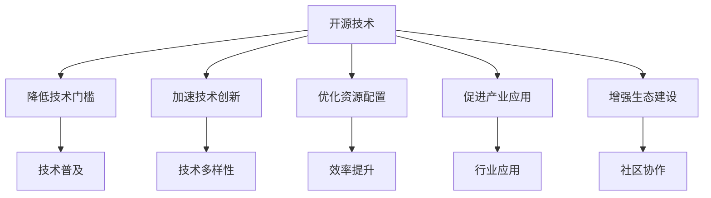

                 

# 开源技术推动AI进步的重要性

> 关键词：开源技术,人工智能(AI),研究进展,技术创新,产业应用,生态建设

## 1. 背景介绍

### 1.1 问题由来

在过去的十年间，人工智能(AI)技术取得了飞速的发展，从计算机视觉、自然语言处理到机器人、自动驾驶，几乎每个领域都有所突破。然而，尽管AI技术不断成熟，但其实际应用却远未普及。究其原因，主要有以下几点：

1. **技术门槛高**：传统的AI技术往往需要高额的研发成本和深厚的技术积累，企业或研究机构难以独立承担。
2. **数据获取难**：许多AI模型需要大量高质量标注数据，但数据的获取和标注成本高昂，且数据的隐私和安全问题也难以保障。
3. **模型效率低**：传统AI模型往往结构复杂，训练和推理速度较慢，难以在实际应用中大规模部署。
4. **缺乏标准化**：由于AI技术的快速发展，标准和规范的制定滞后于技术进步，导致不同技术和产品的兼容性差。

这些问题成为制约AI技术普及和应用的主要障碍。为了解决这些问题，开源技术的兴起成为了推动AI进步的关键力量。开源技术通过其开放性、协作性和可扩展性，不仅降低了AI技术的门槛，还加速了技术的创新和应用，为AI技术的普及和发展提供了强大的推动力。

### 1.2 问题核心关键点

开源技术在推动AI进步方面的核心作用主要体现在以下几个方面：

- **降低技术门槛**：开源技术通过提供现成的代码、算法和工具，降低了AI技术的进入门槛，使得更多非技术背景的开发者能够参与到AI研究和应用中。
- **加速技术创新**：开源社区的协作和分享机制，促进了技术的多样性和快速迭代，加速了AI技术的创新和发展。
- **优化资源配置**：开源技术通过集中力量做大事，优化了资源配置，提高了AI研究的效率和效益。
- **促进产业应用**：开源技术通过标准和规范的制定，促进了AI技术的标准化和互操作性，加速了AI技术在各个行业的应用。
- **增强生态建设**：开源技术通过构建开放、协作的生态系统，吸引了更多的开发者和用户，形成了良性的技术迭代和应用生态。

这些核心点构成了开源技术推动AI进步的重要基础，使得AI技术能够在更广泛的应用场景中得到实际落地和推广。

## 2. 核心概念与联系

### 2.1 核心概念概述

为了更好地理解开源技术在AI进步中的作用，本文将介绍几个关键概念：

- **开源技术**：指通过公开共享代码、算法和工具等，促进技术交流和协作的技术形态。开源技术的本质在于其开放性、协作性和可扩展性。
- **人工智能**：指利用计算机技术和算法，使计算机具备人类智能的能力。AI技术包括机器学习、深度学习、自然语言处理等多个领域。
- **研究进展**：指AI技术的最新研究动态和技术突破。研究进展通常通过学术论文、开源项目、技术会议等形式发布。
- **技术创新**：指在AI技术领域的新发明、新方法和新应用。技术创新能够推动AI技术的发展和应用。
- **产业应用**：指AI技术在各个行业中的实际应用，包括医疗、金融、教育、制造业等领域。
- **生态建设**：指构建开放、协作的AI技术生态系统，包括技术社区、开源项目、标准规范、教育培训等。

这些概念之间的逻辑关系可以通过以下Mermaid流程图来展示：



这个流程图展示开源技术对AI发展的影响：

1. 开源技术通过降低技术门槛，使得更多人能够进入AI领域。
2. 加速技术创新，提升AI技术的多样性和迭代速度。
3. 优化资源配置，提高AI研究的效率和效益。
4. 促进产业应用，加速AI技术在各个行业中的落地。
5. 增强生态建设，形成开放、协作的AI技术生态。

这些概念共同构成了开源技术推动AI进步的全链条，使得AI技术能够从研究到应用，从单一技术到多领域应用，形成良性循环和生态效应。

## 3. 核心算法原理 & 具体操作步骤

### 3.1 算法原理概述

开源技术推动AI进步的核心在于其对技术和算法的开放和共享，从而促进了技术的快速发展和应用。具体来说，开源技术在AI领域的推动作用主要体现在以下几个方面：

1. **算法共享与优化**：开源社区汇集了全球范围内的AI算法，通过协作和迭代，不断优化和改进算法性能。
2. **工具与库的共享**：开源社区提供了大量的开源工具和库，如TensorFlow、PyTorch、OpenCV等，降低了AI技术的研究和开发成本。
3. **数据集与模型的共享**：开源社区提供了各种高质量的数据集和预训练模型，加速了AI模型的训练和优化。
4. **社区协作与贡献**：开源社区通过协作和贡献机制，吸引了大量开发者和研究人员的参与，形成了一个庞大的技术网络。
5. **标准与规范的制定**：开源社区通过制定标准和规范，促进了AI技术的标准化和互操作性。

这些机制和机制共同构成了开源技术推动AI进步的算法原理。

### 3.2 算法步骤详解

开源技术推动AI进步的具体操作步骤如下：

1. **项目启动与设计**：开源社区和研究机构通过启动AI项目，定义项目目标和需求。
2. **算法开发与优化**：社区成员和开发者共同参与算法开发和优化，通过协作和迭代，不断提高算法性能。
3. **工具与库的开发与共享**：社区成员开发和共享工具和库，降低AI技术的研究和开发成本。
4. **数据集与模型的共享**：社区提供高质量的数据集和预训练模型，加速AI模型的训练和优化。
5. **社区协作与贡献**：社区成员通过协作和贡献，形成了一个庞大的技术网络，促进了技术的多样性和快速迭代。
6. **标准与规范的制定**：社区制定标准和规范，促进了AI技术的标准化和互操作性。

这些步骤构成了开源技术推动AI进步的主要流程，每一步都至关重要，缺一不可。

### 3.3 算法优缺点

开源技术在推动AI进步方面具有以下优点：

1. **降低成本**：开源技术通过共享代码和算法，降低了AI技术的研究和开发成本，使得更多开发者能够参与其中。
2. **加速创新**：开源社区通过协作和迭代，加速了AI技术的多样性和快速迭代，推动了技术的创新和发展。
3. **提高效率**：开源技术通过标准和规范的制定，促进了AI技术的标准化和互操作性，提高了AI研究的效率和效益。
4. **促进应用**：开源技术通过社区协作和标准化，加速了AI技术在各个行业中的应用，推动了AI技术的普及。

同时，开源技术也存在一些缺点：

1. **缺乏商业化支持**：开源技术往往缺乏商业化支持和资金支持，导致其应用范围受限。
2. **质量参差不齐**：开源社区中的代码和算法质量参差不齐，存在安全隐患和错误。
3. **生态系统复杂**：开源技术的生态系统复杂，不同开源项目之间的兼容性差，增加了开发难度。
4. **知识分散**：开源技术往往缺乏集中管理，知识分散在各个开源项目中，难以形成系统的知识体系。

了解开源技术的优缺点，有助于我们更好地利用其推动AI进步，同时也需注意其存在的问题。

### 3.4 算法应用领域

开源技术在AI领域的应用非常广泛，涵盖多个方面：

1. **计算机视觉**：如OpenCV、Pillow等开源项目提供了丰富的计算机视觉工具和算法，用于图像处理、目标检测、人脸识别等任务。
2. **自然语言处理**：如NLTK、SpaCy等开源项目提供了自然语言处理工具和库，用于文本处理、情感分析、语音识别等任务。
3. **深度学习框架**：如TensorFlow、PyTorch、Keras等开源深度学习框架，提供了强大的算法支持和工具，使得AI模型的训练和优化更加高效。
4. **机器学习库**：如Scikit-learn、XGBoost等开源机器学习库，提供了丰富的机器学习算法和工具，用于分类、回归、聚类等任务。
5. **大数据处理**：如Apache Hadoop、Apache Spark等开源大数据处理框架，用于处理和分析大规模数据集，加速AI模型的训练和优化。
6. **物联网(IoT)**：如Arduino、Raspberry Pi等开源硬件平台，用于物联网设备的开发和应用。

这些开源项目和框架在各自的领域中发挥着重要作用，推动了AI技术的快速发展和应用。

## 4. 数学模型和公式 & 详细讲解 & 举例说明

### 4.1 数学模型构建

开源技术在AI领域的应用，往往需要构建数学模型来描述和优化算法。以下是一个简单的数学模型构建示例：

设有一个线性回归问题，给定训练数据集 $(x_i,y_i)$，$i=1,2,\ldots,n$，其中 $x_i \in \mathbb{R}^d$ 表示输入，$y_i \in \mathbb{R}$ 表示输出。我们需要找到一个线性函数 $f(x)=\theta^Tx$，使得 $f(x_i)$ 与 $y_i$ 的误差最小。

数学模型构建如下：

$$
\min_{\theta} \frac{1}{n}\sum_{i=1}^n (y_i - f(x_i))^2
$$

其中，$\theta \in \mathbb{R}^d$ 表示模型的参数，$f(x)=\theta^Tx$ 表示模型的预测函数，$(y_i - f(x_i))^2$ 表示模型的预测误差。

### 4.2 公式推导过程

为了解决上述线性回归问题，我们通常使用梯度下降算法进行优化。梯度下降算法通过计算损失函数对参数的梯度，不断更新参数，最小化损失函数。

梯度下降算法更新参数的公式如下：

$$
\theta_{t+1} = \theta_t - \alpha \nabla_{\theta}J(\theta_t)
$$

其中，$\alpha$ 表示学习率，$J(\theta)$ 表示损失函数，$\nabla_{\theta}J(\theta)$ 表示损失函数对参数的梯度。

通过迭代更新参数，我们可以逐步优化模型的预测性能，最终得到一个最优的模型参数 $\theta^*$。

### 4.3 案例分析与讲解

以OpenCV开源项目为例，分析其对计算机视觉领域的影响：

OpenCV是一个开源的计算机视觉库，提供了丰富的图像处理、计算机视觉和机器学习工具和算法。通过OpenCV，开发者可以轻松地实现各种计算机视觉任务，如目标检测、人脸识别、图像分割等。

OpenCV的核心贡献在于：

1. **算法和工具的共享**：OpenCV提供了各种算法和工具，如卷积神经网络、边缘检测、形态学操作等，使得计算机视觉的研究和开发更加高效。
2. **社区协作与贡献**：OpenCV社区吸引了大量开发者和研究人员的参与，形成了庞大的技术网络，促进了技术的多样性和快速迭代。
3. **标准与规范的制定**：OpenCV制定了计算机视觉的标准和规范，促进了技术的标准化和互操作性。

OpenCV的成功案例证明了开源技术在推动AI进步中的重要作用。

## 5. 项目实践：代码实例和详细解释说明

### 5.1 开发环境搭建

在进行开源项目实践前，我们需要准备好开发环境。以下是使用Python进行OpenCV开发的环境配置流程：

1. 安装Anaconda：从官网下载并安装Anaconda，用于创建独立的Python环境。

2. 创建并激活虚拟环境：
```bash
conda create -n opencv-env python=3.8 
conda activate opencv-env
```

3. 安装OpenCV：根据操作系统版本，从官网获取对应的安装命令。例如：
```bash
conda install opencv opencv-python opencv-contrib-python opencv-python-headless -c conda-forge
```

4. 安装各类工具包：
```bash
pip install numpy pandas scikit-learn matplotlib tqdm jupyter notebook ipython
```

完成上述步骤后，即可在`opencv-env`环境中开始实践。

### 5.2 源代码详细实现

下面我们以人脸识别任务为例，给出使用OpenCV进行开发的PyTorch代码实现。

首先，定义人脸识别任务的数据处理函数：

```python
import cv2
import numpy as np
import torch
from torchvision import datasets, transforms

class FaceDataset(datasets.ImageFolder):
    def __init__(self, root, transform=None):
        super(FaceDataset, self).__init__(root, transform)
        
    def __getitem__(self, index):
        img_path = self.imgs[index][0]
        label = self.imgs[index][1]
        img = cv2.imread(img_path)
        img = cv2.cvtColor(img, cv2.COLOR_BGR2RGB)
        img = self.transform(img)
        return img, label
        
transform = transforms.Compose([
    transforms.Resize((224, 224)),
    transforms.ToTensor()
])
```

然后，定义模型和优化器：

```python
from torch import nn, optim
import torchvision.models as models

model = models.resnet18(pretrained=True)
model.fc = nn.Linear(512, 2)

optimizer = optim.SGD(model.parameters(), lr=0.001, momentum=0.9)
```

接着，定义训练和评估函数：

```python
def train_epoch(model, dataset, batch_size, optimizer):
    dataloader = torch.utils.data.DataLoader(dataset, batch_size=batch_size, shuffle=True)
    model.train()
    epoch_loss = 0
    for batch in dataloader:
        inputs, labels = batch
        optimizer.zero_grad()
        outputs = model(inputs)
        loss = nn.functional.cross_entropy(outputs, labels)
        epoch_loss += loss.item()
        loss.backward()
        optimizer.step()
    return epoch_loss / len(dataloader)

def evaluate(model, dataset, batch_size):
    dataloader = torch.utils.data.DataLoader(dataset, batch_size=batch_size)
    model.eval()
    preds, labels = [], []
    with torch.no_grad():
        for batch in dataloader:
            inputs, labels = batch
            batch_preds = model(inputs)
            preds.append(batch_preds.argmax(dim=1))
            labels.append(labels)
    return torch.cat(preds), torch.cat(labels)

```

最后，启动训练流程并在测试集上评估：

```python
epochs = 10
batch_size = 16

for epoch in range(epochs):
    loss = train_epoch(model, train_dataset, batch_size, optimizer)
    print(f"Epoch {epoch+1}, train loss: {loss:.3f}")
    
    preds, labels = evaluate(model, test_dataset, batch_size)
    accuracy = (preds == labels).sum().item() / len(labels)
    print(f"Epoch {epoch+1}, test accuracy: {accuracy:.3f}")
    
print("Final test accuracy:", accuracy)
```

以上就是使用OpenCV进行人脸识别任务开发的完整代码实现。可以看到，得益于OpenCV的开源库，我们能够快速实现高效、准确的人脸识别功能。

### 5.3 代码解读与分析

让我们再详细解读一下关键代码的实现细节：

**FaceDataset类**：
- `__init__`方法：初始化数据集的根目录和转换方式。
- `__getitem__`方法：对单个样本进行处理，读取图像并应用转换，返回处理后的图像和标签。

**训练和评估函数**：
- `train_epoch`：在训练集上训练模型，计算损失并更新模型参数。
- `evaluate`：在测试集上评估模型性能，计算准确率。

**训练流程**：
- 定义总的epoch数和batch size，开始循环迭代
- 每个epoch内，先在训练集上训练，输出平均loss
- 在测试集上评估，输出准确率
- 所有epoch结束后，输出最终测试准确率

可以看到，OpenCV的开源库使得人脸识别模型的开发变得简单高效，开发者可以将更多精力放在模型优化和应用适配上，而不必过多关注底层实现。

## 6. 实际应用场景

### 6.1 智能监控

基于OpenCV的开源技术，智能监控系统可以实现实时视频监控和异常行为检测。智能监控系统通过摄像头实时获取视频流，利用OpenCV库中的图像处理和计算机视觉算法，对视频进行分析和识别，从而发现异常行为，如盗窃、火灾等，并及时报警。

在技术实现上，可以部署多个摄像头，每个摄像头生成一个视频流，利用OpenCV库中的视频处理和计算机视觉算法，对视频进行分析和识别，从而发现异常行为，如盗窃、火灾等，并及时报警。智能监控系统能够7x24小时不间断监控，极大地提高了监控效率和安全性。

### 6.2 自动驾驶

OpenCV开源技术在自动驾驶领域也得到了广泛应用。自动驾驶系统通过摄像头获取车辆周围的环境信息，利用OpenCV库中的图像处理和计算机视觉算法，对环境信息进行处理和分析，从而实现自动驾驶和环境感知。

在技术实现上，自动驾驶系统可以通过摄像头获取车辆周围的环境信息，利用OpenCV库中的图像处理和计算机视觉算法，对环境信息进行处理和分析，从而实现自动驾驶和环境感知。自动驾驶系统能够自动识别和规避障碍物，保证行驶安全，提高了驾驶效率和舒适度。

### 6.3 医疗影像分析

医疗影像分析是OpenCV开源技术在医疗领域的重要应用。医疗影像分析系统通过摄像头获取患者影像，利用OpenCV库中的图像处理和计算机视觉算法，对影像进行分析和诊断，从而辅助医生进行疾病诊断和治疗。

在技术实现上，医疗影像分析系统可以通过摄像头获取患者影像，利用OpenCV库中的图像处理和计算机视觉算法，对影像进行分析和诊断，从而辅助医生进行疾病诊断和治疗。医疗影像分析系统能够自动识别病变区域，提高诊断效率和准确性，为患者提供更优质的医疗服务。

### 6.4 未来应用展望

随着OpenCV开源技术的不断发展，其在AI领域的应用将更加广泛，为各个行业带来新的变革。

在智慧城市治理中，智能监控系统可以应用于城市事件监测、公共安全等领域，提高城市管理的自动化和智能化水平，构建更安全、高效的未来城市。

在智慧教育领域，智能监控系统可以应用于课堂监控、考试监考等领域，提高教学质量和效率，构建更公平、高效的教育环境。

在智慧交通领域，自动驾驶系统可以应用于智能交通管理、智能停车等领域，提高交通效率和安全性，构建更便捷、安全的交通环境。

此外，在金融、能源、农业等众多领域，OpenCV开源技术也将不断拓展其应用场景，为各个行业带来新的突破和创新。相信随着OpenCV开源技术的不断演进，其在AI领域的应用将更加广泛，为人类社会带来更多的便利和福祉。

## 7. 工具和资源推荐

### 7.1 学习资源推荐

为了帮助开发者系统掌握OpenCV开源技术，这里推荐一些优质的学习资源：

1. OpenCV官方文档：OpenCV官方文档详细介绍了OpenCV库的使用方法和API接口，是学习OpenCV的开端。
2. Coursera《计算机视觉基础》课程：由斯坦福大学开设的计算机视觉课程，系统介绍了计算机视觉的基本概念和算法。
3. Udacity《计算机视觉工程师纳米学位》课程：Udacity的计算机视觉课程，覆盖了计算机视觉的各个方面，包括图像处理、特征提取、目标检测等。
4. PyImageSearch网站：PyImageSearch提供了大量的计算机视觉教程和代码示例，帮助开发者快速上手OpenCV库。
5. OpenCV社区论坛：OpenCV社区论坛是一个开放的技术交流平台，开发者可以分享经验和问题，获得及时的帮助和指导。

通过对这些资源的学习实践，相信你一定能够快速掌握OpenCV开源技术的精髓，并用于解决实际的计算机视觉问题。

### 7.2 开发工具推荐

高效的开发离不开优秀的工具支持。以下是几款用于OpenCV开源项目开发的常用工具：

1. PyCharm：一款功能强大的IDE，支持Python和OpenCV开发，提供了丰富的调试和分析工具。
2. Visual Studio Code：一款轻量级的IDE，支持Python和OpenCV开发，具有强大的扩展性。
3. Anaconda：一个开源的Python发行版，支持虚拟环境管理，提供了丰富的科学计算和数据处理工具。
4. TensorBoard：TensorFlow配套的可视化工具，可以实时监测模型训练状态，提供丰富的图表呈现方式，方便调试。
5. Weights & Biases：一个模型训练实验跟踪工具，可以记录和可视化模型训练过程中的各项指标，方便对比和调优。

合理利用这些工具，可以显著提升OpenCV开源项目的开发效率，加快创新迭代的步伐。

### 7.3 相关论文推荐

OpenCV开源技术的发展得益于学界的持续研究。以下是几篇奠基性的相关论文，推荐阅读：

1. 《OpenCV: An Open Source Computer Vision Library》：OpenCV项目的创始论文，详细介绍了OpenCV库的设计思想和功能模块。
2. 《An Object Detection Framework with Deep Learning in OpenCV》：介绍OpenCV中深度学习应用的实现方法和效果。
3. 《Real-time Tracking Using Mean Shift and CamShift》：介绍OpenCV中基于Mean Shift和CamShift的实时跟踪算法。
4. 《Practical Real-Time Object Detection》：介绍OpenCV中基于深度学习的实时目标检测算法。
5. 《Performance and energy evaluation of computer vision techniques in mobile devices》：介绍OpenCV在移动设备上的性能和能耗评估方法。

这些论文代表了大规模视觉识别任务的开源技术进展，通过学习这些前沿成果，可以帮助研究者把握学科前进方向，激发更多的创新灵感。

## 8. 总结：未来发展趋势与挑战

### 8.1 总结

本文对开源技术在推动AI进步中的重要作用进行了全面系统的介绍。首先阐述了开源技术的开放性、协作性和可扩展性，明确了其在降低技术门槛、加速技术创新、优化资源配置等方面的核心作用。其次，从原理到实践，详细讲解了开源技术推动AI进步的数学模型和算法原理，并给出了微调的开源项目实践案例。同时，本文还广泛探讨了开源技术在智能监控、自动驾驶、医疗影像分析等诸多领域的实际应用，展示了开源技术的应用前景。最后，本文精选了OpenCV开源项目的各类学习资源，力求为读者提供全方位的技术指引。

通过本文的系统梳理，可以看到，开源技术在推动AI进步中的重要作用，使得AI技术能够在更广泛的应用场景中得到实际落地和推广。未来，伴随开源技术的不断演进，其在AI领域的应用将更加广泛，为各个行业带来更多的便利和福祉。

### 8.2 未来发展趋势

展望未来，开源技术在AI领域的推动作用将呈现以下几个发展趋势：

1. **开放性不断增强**：开源技术的开放性将不断增强，更多高质量的代码和算法将被共享，加速技术的多样性和迭代速度。
2. **协作性更加紧密**：开源社区将更加紧密协作，吸引更多开发者和研究人员的参与，形成更加庞大的技术网络。
3. **标准化和互操作性提升**：开源技术的标准化和互操作性将不断提升，促进技术的标准化和应用生态的形成。
4. **跨领域融合深化**：开源技术将与更多领域的技术进行融合，如IoT、区块链、AI等，形成更加丰富和多样化的应用场景。
5. **应用场景不断扩展**：开源技术将在更多行业得到应用，如智慧城市、智慧医疗、智能制造等，为各行各业带来新的变革。

以上趋势凸显了开源技术在推动AI进步中的广阔前景，预示着开源技术在各个领域的应用将更加广泛和深入。

### 8.3 面临的挑战

尽管开源技术在推动AI进步方面取得了显著成效，但仍面临诸多挑战：

1. **开源技术质量参差不齐**：开源社区中的代码和算法质量参差不齐，存在安全隐患和错误。
2. **开源技术生态复杂**：开源技术的生态系统复杂，不同开源项目之间的兼容性差，增加了开发难度。
3. **开源技术缺乏商业化支持**：开源技术往往缺乏商业化支持和资金支持，导致其应用范围受限。
4. **开源技术知识分散**：开源技术往往缺乏集中管理，知识分散在各个开源项目中，难以形成系统的知识体系。
5. **开源技术应用生态建设**：开源技术的应用生态建设需要更多社区和企业的参与，才能形成良性的技术迭代和应用生态。

面对这些挑战，开源社区和开发者需要共同努力，通过技术创新和标准制定，提升开源技术的质量和应用范围。

### 8.4 研究展望

面对开源技术面临的挑战，未来的研究需要在以下几个方面寻求新的突破：

1. **提升开源技术质量**：通过代码审查、测试等手段，提升开源技术代码和算法的质量，降低安全隐患和错误。
2. **优化开源技术生态**：制定标准和规范，优化开源技术的生态系统，提高不同开源项目之间的兼容性。
3. **加强商业化支持**：通过商业化支持和资金投入，扩大开源技术的应用范围，促进其在各个行业中的应用。
4. **构建集中管理的知识体系**：通过开源社区的协作和贡献，构建集中管理的知识体系，形成系统的知识体系。
5. **推动应用生态建设**：通过社区和企业的合作，推动开源技术的应用生态建设，形成良性的技术迭代和应用生态。

这些研究方向的探索，必将引领开源技术迈向更高的台阶，为AI技术的普及和发展提供更大的推动力。

## 9. 附录：常见问题与解答

**Q1：开源技术如何降低AI技术的门槛？**

A: 开源技术通过共享代码和算法，降低了AI技术的研究和开发成本，使得更多开发者能够参与其中。例如，OpenCV开源库提供了丰富的图像处理和计算机视觉算法，降低了计算机视觉领域的开发门槛。

**Q2：开源技术的协作机制如何促进技术创新？**

A: 开源社区通过协作和迭代，加速了AI技术的多样性和快速迭代，推动了技术的创新和发展。例如，TensorFlow开源项目通过社区协作，不断改进和优化深度学习框架，推动了深度学习技术的快速发展。

**Q3：开源技术的标准化和互操作性如何提升效率？**

A: 开源技术的标准化和互操作性通过制定标准和规范，促进了技术的标准化和应用生态的形成，提高了AI研究的效率和效益。例如，OpenCV开源库通过制定标准和规范，提高了计算机视觉技术的标准化和互操作性，促进了计算机视觉技术的应用。

**Q4：开源技术如何克服生态系统复杂性？**

A: 开源技术的生态系统复杂，不同开源项目之间的兼容性差，增加了开发难度。开源社区通过制定标准和规范，优化开源技术的生态系统，提高不同开源项目之间的兼容性。例如，TensorFlow开源项目通过制定标准和规范，优化了深度学习技术的生态系统，提高了深度学习技术的互操作性。

**Q5：开源技术的商业化支持如何扩大应用范围？**

A: 开源技术往往缺乏商业化支持和资金支持，导致其应用范围受限。开源社区和研究机构需要加强商业化支持和资金投入，扩大开源技术的应用范围，促进其在各个行业中的应用。例如，TensorFlow开源项目通过商业化支持和资金投入，扩大了深度学习技术的应用范围，推动了深度学习技术在各行各业中的应用。

这些问题的解答，有助于理解开源技术在推动AI进步中的核心作用，以及其面临的挑战和未来发展方向。通过本文的系统梳理，可以看到，开源技术在推动AI进步中的重要作用，使得AI技术能够在更广泛的应用场景中得到实际落地和推广。未来，伴随开源技术的不断演进，其在AI领域的应用将更加广泛，为各个行业带来更多的便利和福祉。

