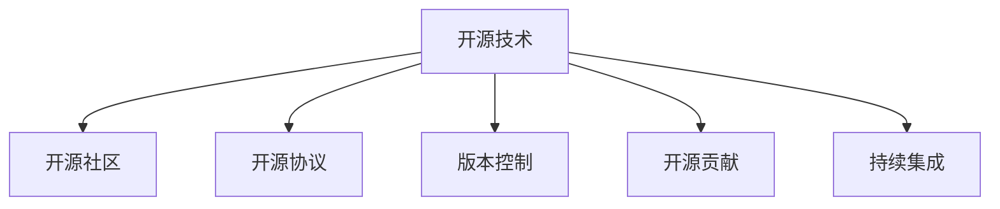

                 

# 开源技术：共享创新，加速进步

> 关键词：开源技术, 共享创新, 加速进步, 编程语言, 软件工程, 社区驱动, 开发工具, 开源项目, 版本控制, 持续集成

## 1. 背景介绍

### 1.1 问题由来
随着互联网的迅猛发展，开源软件在全球软件开发领域的影响力越来越大。Open Source Initiative(简称OSI)定义的开源软件是指其源代码公开且可以自由使用的软件，包括操作系统、编程语言、应用软件等多个方面。开源技术的广泛应用，极大地推动了软件产业的发展，加速了技术进步。

开源社区汇聚了全球各地的软件开发者，通过协同合作，实现了许多复杂技术的突破。例如，Linux操作系统、Apache Web服务器、MySQL数据库等重要的开源项目，改变了全球互联网的生态系统。开源技术使得软件技术更加普及、灵活、高效，成为现代软件工程的核心驱动力。

### 1.2 问题核心关键点
开源技术的关键点在于其开放、协作、共享的特性。通过公开源代码，开源技术促进了信息共享，使得全球开发者可以相互学习、共同进步。其核心原理如下：

1. **开放性(Openness)**：源代码公开，任何人都可以自由使用、复制、修改和分发。
2. **协作性(Collaboration)**：开发者通过网络协作，共同解决技术难题，推动项目发展。
3. **共享性(Sharing)**：成果可以免费共享，促进技术普及和应用。

开源技术的这些特点，使得它在软件开发、生产管理、科学研究等多个领域发挥着重要作用。未来，开源技术的普及和深化，将继续推动技术进步和创新。

### 1.3 问题研究意义
开源技术的研究具有重要意义：

1. **降低成本**：开源软件通常免费使用，降低了软件开发和维护的成本。
2. **促进创新**：开放的环境鼓励创新，全球开发者可以自由地交流和借鉴，加速技术突破。
3. **提升质量**：源代码公开后，无数开发者共同审核和改进，提高了软件的可靠性和安全性。
4. **加速应用**：开源软件易于集成和部署，能够快速应用于实际项目中。
5. **推动产业**：开源技术成为主流标准，推动了全球软件产业的发展。
6. **助力教育**：开源项目提供了丰富的学习资源，促进了技术人才的培养。

开源技术的应用已经深入到软件开发的各个层面，成为现代软件开发的重要方向。通过学习和掌握开源技术，开发者可以更高效地进行软件开发，推动技术进步。

## 2. 核心概念与联系

### 2.1 核心概念概述

为更好地理解开源技术，本节将介绍几个密切相关的核心概念：

- **开源技术**：指公开源代码并允许自由使用、修改和分发的软件技术。包括操作系统、编程语言、应用软件等。
- **开源社区**：围绕特定开源项目，聚集开发者、贡献者、用户等社区成员，共同开发和维护软件。
- **开源协议**：规范开源软件的使用和分发，如GPL、Apache、MIT等，确保源代码的自由共享。
- **开源贡献**：开发者通过编写代码、修复漏洞、改进功能等方式，为开源项目做出贡献。
- **版本控制**：管理代码变更，记录历史，如Git、SVN等。
- **持续集成**：自动化构建、测试和部署过程，提高软件交付的效率和质量。

这些核心概念之间的逻辑关系可以通过以下Mermaid流程图来展示：



这个流程图展示了开源技术的关键要素及其相互关系：开源技术在开源社区中得以实施，开源协议保障了源代码的自由共享，版本控制提供了代码变更的管理手段，开源贡献保证了社区的持续发展，持续集成提升了软件的交付效率。

## 3. 核心算法原理 & 具体操作步骤
### 3.1 算法原理概述

开源技术的核心原理包括：

- **协同开发**：通过开放源代码，任何人都可以参与开发和改进，形成协作网络。
- **代码共享**：源代码公开后，开发者可以自由复制和分发，加速技术传播。
- **版本管理**：通过版本控制系统，记录代码变更，确保历史可追溯，促进协作。
- **持续集成**：通过自动化工具，持续构建、测试和部署，提高软件交付速度。

这些原理使得开源技术能够高效、灵活地推进软件开发和创新。

### 3.2 算法步骤详解

开源技术的应用一般包括以下几个关键步骤：

**Step 1: 选择一个合适的开源项目**
- 根据实际需求，选择适合的开源项目。例如，构建Web应用可以选择Apache Tomcat，数据库可以选择MySQL。
- 访问项目官网，了解项目功能、使用指南、社区参与方式等。

**Step 2: 克隆项目代码**
- 使用版本控制系统（如Git）克隆项目代码到本地。
```bash
git clone https://github.com/apache/tomcat.git
```
- 进入项目目录，了解项目结构。

**Step 3: 安装依赖**
- 根据项目文档，安装所需依赖软件。
```bash
sudo apt-get install openssh-client libssl-dev
```
- 安装编译工具，如GCC。
```bash
sudo apt-get install g++
```

**Step 4: 修改代码**
- 根据项目文档或实际需求，修改代码。
```bash
nano server.xml
```

**Step 5: 提交修改**
- 使用版本控制系统提交代码变更，记录变更日志。
```bash
git commit -m "Add configuration for my application"
```

**Step 6: 推送修改**
- 推送代码变更到远程仓库。
```bash
git push origin master
```

**Step 7: 合并变更**
- 开发者通过Pull Request（PR）向社区提交变更，等待其他开发者审核和合并。

**Step 8: 部署应用**
- 将修改后的代码部署到服务器上，并进行测试。
- 使用持续集成工具，如Jenkins，自动化部署过程。

以上是开源技术应用的一般流程。在实际开发中，还需要根据具体项目的需求，进行一些定制化的操作和优化。

### 3.3 算法优缺点

开源技术具有以下优点：

1. **高效协作**：全球开发者共同参与，推动项目快速迭代和改进。
2. **成本低廉**：源代码公开，避免了购买商业软件的高昂成本。
3. **质量可靠**：源代码公开后，社区成员共同审核和改进，提高了软件的可靠性和安全性。
4. **易于学习**：公开源代码和社区资源，使得开发者可以方便地学习新技术。
5. **灵活创新**：任何人都可以自由地修改和改进代码，促进技术创新。

同时，开源技术也存在一些缺点：

1. **版本混乱**：开源项目分支众多，版本管理复杂，易出现混乱。
2. **性能问题**：开源项目一般缺乏商业支持，性能优化不足。
3. **安全风险**：开源项目缺乏统一的审核机制，存在安全隐患。
4. **定制困难**：开源项目一般缺乏个性化配置选项，难以满足特殊需求。

尽管如此，开源技术的优点远远大于缺点，在全球软件开发领域占据了重要地位。

### 3.4 算法应用领域

开源技术广泛应用于软件开发、生产管理、科学研究等多个领域，例如：

- **软件开发**：操作系统（如Linux）、编程语言（如Python）、Web框架（如Django）、数据库（如MySQL）、中间件（如Apache Kafka）等。
- **生产管理**：持续集成（如Jenkins）、持续部署（如GitLab CI）、配置管理（如Ansible）等。
- **科学研究**：开源科学数据管理平台（如Galaxy）、开源数据分析工具（如RapidMiner）等。

除了以上领域，开源技术还被应用于人工智能、区块链、物联网、边缘计算等多个前沿技术领域，成为推动技术发展的关键力量。

## 4. 数学模型和公式 & 详细讲解  
### 4.1 数学模型构建

在开源技术中，版本控制是最核心的概念之一。版本控制系统（如Git）通过记录代码变更，确保历史可追溯，推动协作开发。以下是Git版本控制系统的数学模型构建。

版本控制系统记录了每次代码变更的提交信息（Commit Message）和变更内容（Diff）。每次提交的变更称为一个版本（Version），可以通过版本号（如v1.0.0）来表示。Git通过分支（Branch）管理多个版本的代码变更。

### 4.2 公式推导过程

版本控制系统的主要数学模型包括版本（Version）、提交（Commit）、分支（Branch）、标签（Tag）等。以下以提交为例进行推导。

假设某次提交包含的代码文件为 $\{f_1, f_2, ..., f_n\}$，对应的代码变更内容为 $\Delta f_i$。则提交的数学模型可以表示为：

$$
C = \{ (f_1, \Delta f_1), (f_2, \Delta f_2), ..., (f_n, \Delta f_n) \}
$$

其中，$f_i$ 表示文件，$\Delta f_i$ 表示文件的变更内容。

提交的提交信息为 $\text{Commit Message}$，包括作者、日期、提交信息等。数学模型可以表示为：

$$
CM = \{ \text{Author}, \text{Date}, \text{Commit Message} \}
$$

通过提交信息，我们可以记录代码变更的时间、作者、内容等信息，方便管理和审计。

### 4.3 案例分析与讲解

以Linux操作系统为例，分析其版本控制和协作开发的原理。

Linux操作系统由全球开发者共同维护，其源代码托管在GitHub上。开发人员通过克隆代码，进行修改和提交变更，最终通过Pull Request的形式将代码合并到主分支。

- **版本控制**：使用Git版本控制系统，记录每次代码变更的提交信息。
- **分支管理**：通过分支管理不同的开发版本，如master、develop、feature等。
- **协作开发**：开发者通过Pull Request的方式提交代码变更，其他开发者审核和合并。
- **持续集成**：使用Jenkins等持续集成工具，自动化构建、测试和部署过程。

通过上述步骤，Linux操作系统得以高效、可靠地更新和迭代，成为全球最受欢迎的操作系统之一。

## 5. 项目实践：代码实例和详细解释说明
### 5.1 开发环境搭建

在进行开源技术实践前，我们需要准备好开发环境。以下是使用Linux系统的环境配置流程：

1. 安装Ubuntu操作系统。
2. 安装Git版本控制系统。
```bash
sudo apt-get install git
```
3. 安装Jenkins持续集成工具。
```bash
sudo apt-get install jenkins
```

完成上述步骤后，即可在Linux系统中开始开源技术实践。

### 5.2 源代码详细实现

以下是使用Linux操作系统开源项目LAMP（Linux-Apache-Mysql-PHP）进行项目实践的代码实现。

首先，准备项目环境：

```bash
sudo apt-get update
sudo apt-get install apache2 libapache2-mod-php libmysqlclient-dev libssl-dev nginx
```

然后，克隆MySQL数据库代码到本地：

```bash
git clone https://github.com/mysql/mysql-server.git
```

接着，安装MySQL数据库：

```bash
cd mysql-server
make install
```

最后，启动MySQL数据库服务：

```bash
sudo systemctl start mysql
```

以上步骤完成了MySQL数据库的安装和启动。

### 5.3 代码解读与分析

下面是MySQL数据库安装和启动的主要代码解读：

- `sudo apt-get update`：更新软件包列表。
- `sudo apt-get install apache2 libapache2-mod-php libmysqlclient-dev libssl-dev nginx`：安装MySQL数据库依赖软件包，包括Apache、PHP、MySQL客户端库、SSL库等。
- `cd mysql-server`：进入MySQL数据库项目目录。
- `make install`：编译并安装MySQL数据库。
- `sudo systemctl start mysql`：启动MySQL数据库服务。

通过上述步骤，MySQL数据库安装和启动过程非常简单，主要依赖包管理器和make命令完成。

### 5.4 运行结果展示

成功启动MySQL数据库服务后，可以通过以下命令访问MySQL数据库：

```bash
mysql -u root -p
```

输入MySQL登录密码后，即可连接到MySQL数据库，执行SQL命令：

```sql
CREATE DATABASE mydatabase;
```

以上步骤展示了MySQL数据库的简单安装和启动过程。通过开源技术和版本控制，开发者可以轻松管理和维护MySQL数据库，推动其持续改进和发展。

## 6. 实际应用场景
### 6.1 软件开发

开源技术在软件开发领域的应用广泛，如Linux操作系统、Apache Web服务器、MySQL数据库、Python编程语言等。这些开源项目不仅提供了高效的软件解决方案，还为开发者提供了丰富的学习资源和协作平台。

以Apache Web服务器为例，分析其开源开发和应用的过程。

- **开源开发**：Apache Web服务器由全球开发者共同维护，源代码托管在GitHub上。开发者通过Pull Request的方式提交代码变更，其他开发者审核和合并。
- **应用部署**：部署Apache Web服务器到生产环境，使用持续集成工具自动化构建和部署过程。
- **性能优化**：开源社区不断优化Apache Web服务器性能，发布新版本和补丁。

通过开源开发和部署，Apache Web服务器成为全球最受欢迎和稳定的Web服务器之一，广泛应用于企业、政府和教育等各个领域。

### 6.2 生产管理

开源技术在生产管理领域的应用也非常广泛，如Jenkins持续集成、Ansible配置管理等。这些工具通过自动化和灵活配置，显著提升了生产管理效率和质量。

以Jenkins为例，分析其开源开发和应用的过程。

- **开源开发**：Jenkins由全球开发者共同维护，源代码托管在GitHub上。开发者通过Pull Request的方式提交代码变更，其他开发者审核和合并。
- **应用部署**：部署Jenkins持续集成工具到生产环境，使用持续集成工具自动化构建和部署过程。
- **功能增强**：开源社区不断增强Jenkins功能，发布新版本和补丁。

通过开源开发和部署，Jenkins成为全球最受欢迎和强大的持续集成工具之一，广泛应用于软件开发、生产部署、测试管理等领域。

### 6.3 科学研究

开源技术在科学研究领域的应用也不少，如Galaxy科学数据管理平台、RapidMiner数据分析工具等。这些开源项目通过开放数据和工具，促进了科学研究的共享和合作。

以Galaxy为例，分析其开源开发和应用的过程。

- **开源开发**：Galaxy由全球科学家共同维护，源代码托管在GitHub上。开发者通过Pull Request的方式提交代码变更，其他开发者审核和合并。
- **应用部署**：部署Galaxy科学数据管理平台到科研环境，使用科学数据分析工具进行数据管理和分析。
- **数据共享**：开源社区通过Galaxy平台共享科学数据和分析结果，促进科学研究的合作和交流。

通过开源开发和部署，Galaxy成为全球最受欢迎和强大的科学数据管理平台之一，广泛应用于生命科学、天文学、地球科学等领域。

### 6.4 未来应用展望

随着开源技术的不断发展，未来在多个领域的应用前景广阔。以下是一些可能的未来应用场景：

- **人工智能**：开源深度学习框架（如TensorFlow、PyTorch）和机器学习工具（如Scikit-learn），推动了人工智能技术的普及和应用。未来，开源AI技术将进一步深化和普及。
- **区块链**：开源区块链平台（如Ethereum、Hyperledger）和智能合约工具（如Solidity、Truffle），推动了区块链技术的落地应用。未来，开源区块链技术将进一步发展，应用于更多行业。
- **物联网**：开源物联网平台（如M2M Watson、ThingWorx）和设备管理工具（如OpenMQTT、MQTT），推动了物联网技术的普及和应用。未来，开源物联网技术将进一步深入到各个行业，实现设备智能化和互联互通。
- **边缘计算**：开源边缘计算平台（如EdgeX、IoT Edge）和设备管理工具（如Docker、Kubernetes），推动了边缘计算技术的普及和应用。未来，开源边缘计算技术将进一步发展，实现边缘设备和云服务的协同工作。
- **网络安全**：开源网络安全工具（如Metasploit、Nmap）和渗透测试工具（如Burp Suite、OWASP），推动了网络安全技术的普及和应用。未来，开源网络安全技术将进一步发展，提高网络安全防护能力。

开源技术在各个领域的未来应用前景广阔，将继续推动技术进步和创新。

## 7. 工具和资源推荐
### 7.1 学习资源推荐

为了帮助开发者系统掌握开源技术，这里推荐一些优质的学习资源：

1. **《开源软件的实现与设计》系列书籍**：详细介绍了开源软件开发的全流程，包括设计、实现、测试、部署等环节。
2. **《UNIX网络编程》系列书籍**：深入浅出地讲解了Unix/Linux系统的内核、网络编程、系统编程等核心技术。
3. **《Golang编程语言》系列书籍**：介绍了Golang语言的核心特性和编程实践，推动了Golang在开源社区的应用。
4. **GitHub官方文档**：GitHub提供了丰富的开源项目和开发工具，是学习和实践开源技术的最佳平台。
5. **Apache基金会网站**：Apache基金会是全球知名的开源软件社区，提供大量的开源项目和资源。

通过对这些资源的学习实践，相信你一定能够快速掌握开源技术的精髓，并用于解决实际的开发问题。

### 7.2 开发工具推荐

高效的开发离不开优秀的工具支持。以下是几款用于开源技术开发常用的工具：

1. **Git**：开源版本控制系统，广泛应用在代码管理中。
2. **Jenkins**：开源持续集成工具，自动构建、测试和部署过程。
3. **Ansible**：开源配置管理工具，通过自动化部署和配置。
4. **Kubernetes**：开源容器编排工具，自动管理容器集群。
5. **Docker**：开源容器化工具，快速部署和运行应用。

合理利用这些工具，可以显著提升开源技术开发和部署的效率，加快创新迭代的步伐。

### 7.3 相关论文推荐

开源技术的发展源于学界的持续研究。以下是几篇奠基性的相关论文，推荐阅读：

1. **《Open Source Software: A Guide to Open Source Development and Governance》**：详细介绍了开源软件开发的流程和治理机制。
2. **《Agile Software Development, Principles, Patterns, and Practices》**：介绍了敏捷软件开发的原则和实践，推动了开源项目的持续改进。
3. **《Programming Pearls》**：介绍了软件开发中的经典算法和实践，推动了开源技术的持续进步。
4. **《The Myth of the Rational Software Engineer》**：揭示了软件开发中的复杂性和不确定性，推动了开源社区的协作和共治。
5. **《The Unfolding Story of Unix》**：详细介绍了Unix/Linux系统的发展历程，推动了开源技术的普及和应用。

这些论文代表了大规模软件开发的理论基础和实践指南，帮助研究者把握开源技术的前进方向，激发更多的创新灵感。

## 8. 总结：未来发展趋势与挑战
### 8.1 总结

本文对开源技术进行了全面系统的介绍。首先阐述了开源技术的发展背景和意义，明确了其开放、协作、共享的特性。其次，从原理到实践，详细讲解了开源技术的数学模型和实际应用步骤，给出了开源技术项目开发的完整代码实例。同时，本文还广泛探讨了开源技术在软件开发、生产管理、科学研究等多个领域的应用前景，展示了开源技术的巨大潜力。

通过本文的系统梳理，可以看到，开源技术已经成为软件开发的重要方向，极大地推动了技术进步和创新。未来，伴随开源技术的持续演进，必将进一步拓展软件开发和创新的边界，推动技术进步和产业发展。

### 8.2 未来发展趋势

展望未来，开源技术将呈现以下几个发展趋势：

1. **开源项目多样性**：开源项目将覆盖更多领域，如人工智能、区块链、物联网、边缘计算等。
2. **开源工具集成**：开源工具将进一步集成和整合，提高开发效率和用户体验。
3. **开源社区协同**：开源社区将进一步协同发展，推动全球开发者共同进步。
4. **开源标准普及**：开源标准将成为主流标准，推动全球软件生态的协同发展。
5. **开源资源丰富**：开源资源将更加丰富，包括数据、工具、文档等，促进技术普及和应用。

这些趋势凸显了开源技术的广阔前景。这些方向的探索发展，必将进一步推动技术进步和创新。

### 8.3 面临的挑战

尽管开源技术已经取得了瞩目成就，但在迈向更加智能化、普适化应用的过程中，它仍面临着诸多挑战：

1. **版本混乱**：开源项目分支众多，版本管理复杂，易出现混乱。
2. **性能问题**：开源项目一般缺乏商业支持，性能优化不足。
3. **安全风险**：开源项目缺乏统一的审核机制，存在安全隐患。
4. **定制困难**：开源项目一般缺乏个性化配置选项，难以满足特殊需求。
5. **协作不足**：开源社区的协作仍需改进，避免资源浪费和重复劳动。
6. **法律风险**：开源协议和授权问题，需要进一步规范和明确。

尽管如此，开源技术的优点远远大于缺点，在全球软件开发领域占据了重要地位。

### 8.4 研究展望

面对开源技术面临的种种挑战，未来的研究需要在以下几个方面寻求新的突破：

1. **版本管理优化**：开发更高效、灵活的版本管理系统，减少版本混乱。
2. **性能优化**：提升开源项目性能，使其具备更好的竞争力。
3. **安全增强**：加强开源项目的安全性，避免安全隐患。
4. **个性化定制**：开发更灵活、易定制的开源工具和项目。
5. **协作改进**：优化开源社区的协作机制，提高开发效率。
6. **法律规范**：进一步规范开源协议和授权问题，保障开发者权益。

这些研究方向的探索，必将引领开源技术走向更高的台阶，为软件开发和创新提供更多助力。

## 9. 附录：常见问题与解答

**Q1：开源技术是否适用于所有软件开发场景？**

A: 开源技术适用于大多数软件开发场景，尤其是对灵活性、开放性和社区协作有需求的项目。然而，对于一些高度定制化、商业化的项目，可能并不完全适合。

**Q2：如何选择适合自己的开源项目？**

A: 选择适合自己的开源项目需要考虑多个因素，如项目的功能需求、技术栈、社区活跃度、稳定性等。可以通过GitHub等平台查找相关项目，评估其质量、维护情况和社区支持。

**Q3：如何参与开源社区？**

A: 参与开源社区可以通过以下几个步骤：
1. 访问开源项目官网，了解项目功能和文档。
2. 克隆项目代码到本地，进行本地测试和调试。
3. 在GitHub上提交Pull Request，请求社区审核和合并。
4. 参与社区讨论和会议，与其他开发者交流和学习。

**Q4：如何保持开源项目的质量？**

A: 保持开源项目质量需要多方面努力：
1. 定期发布版本和更新，修复漏洞和改进功能。
2. 使用版本控制工具，记录代码变更和历史。
3. 设置社区标准和规范，确保代码质量。
4. 邀请社区成员参与审核和改进，提升项目质量。

**Q5：开源技术的未来发展趋势是什么？**

A: 开源技术的未来发展趋势包括：
1. 开源项目的多样化和集成化。
2. 开源社区的协同和标准化。
3. 开源工具的灵活化和易用性。
4. 开源标准的普及和应用。
5. 开源生态的协同和共治。

这些趋势凸显了开源技术的广阔前景，将继续推动技术进步和创新。

---

作者：禅与计算机程序设计艺术 / Zen and the Art of Computer Programming

