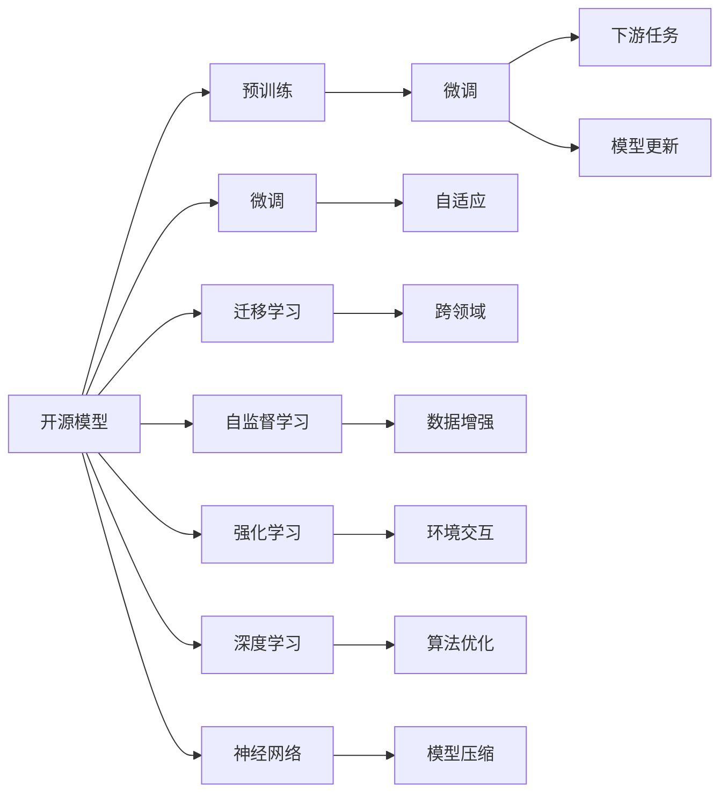

                 

# 开源模型的发展：贾扬清的观点，创新与定制化优势助力开源模型发展

在人工智能快速发展的大潮中，开源模型逐渐成为不可或缺的一部分。今天，我们邀请到**贾扬清**老师，共同探讨开源模型发展的前景与挑战。

## 1. 背景介绍

### 1.1 开源模型与商业模型
开源模型与商业模型是人工智能发展的两个重要分支。商业模型通常拥有强大的算力和数据支持，通过为特定应用场景提供定制化解决方案来获取收益。而开源模型则以社区驱动为核心，通过持续的贡献和迭代，积累巨大的代码库和技术能力，为各行业的应用提供广泛的选择。

在过去几年里，开源模型如OpenAI的GPT-3，微软的DALL·E等，已在多个领域展现出巨大的潜力和价值。它们在处理大规模数据、生成自然语言、图像处理等方面，表现出了传统模型无法比拟的优越性。

### 1.2 开源模型的优势
1. **社区力量**：开源模型借助庞大的社区力量，不断进行优化和升级，使得模型能够紧跟技术前沿，满足多样化的应用需求。
2. **低成本**：开源模型通常免费或以开源授权的方式提供，降低了使用者的经济门槛。
3. **高度灵活性**：用户可以根据自身需求，对开源模型进行定制化修改和扩展，适应不同的应用场景。
4. **广泛应用**：开源模型几乎覆盖了人工智能的各个领域，从自然语言处理到计算机视觉，从推荐系统到语音识别，都有广泛的应用。

## 2. 核心概念与联系

### 2.1 核心概念概述

为了更好地理解开源模型，我们先介绍一些关键概念：

- **开源模型**：通过开源许可证协议发布的、可供自由使用的模型代码和数据。
- **预训练模型**：在大型无标签数据集上进行预训练的模型，通常用于抽取通用特征。
- **微调模型**：在预训练模型的基础上，针对特定任务进行有监督训练的模型。
- **迁移学习**：通过在相关领域数据上的训练，将一个领域的知识迁移到另一个领域。
- **自监督学习**：利用未标记数据进行训练，自动学习任务相关特征。
- **强化学习**：通过与环境的交互，逐步优化模型决策，提升模型的智能水平。

### 2.2 核心概念原理和架构的 Mermaid 流程图



这个流程图展示了开源模型的核心概念和它们之间的关系：

1. 开源模型通常作为起点，可以进行预训练、微调、迁移学习等步骤。
2. 预训练模型抽取通用的语言或视觉特征，为下游任务提供基础。
3. 微调模型通过在有标签数据上的训练，调整模型以适应特定任务。
4. 迁移学习使得模型可以在相关领域应用，避免从头训练。
5. 自监督学习利用未标记数据，提升模型的泛化能力。
6. 强化学习通过与环境的交互，优化模型的决策。
7. 深度学习利用多层神经网络，提取复杂特征。
8. 神经网络是深度学习的基础，提供模型架构支持。
9. 模型压缩和优化进一步提升模型的效率和性能。

## 3. 核心算法原理 & 具体操作步骤

### 3.1 算法原理概述

开源模型发展的核心算法包括预训练、微调、迁移学习等。这些算法通常基于深度学习技术，采用神经网络作为模型的基本架构。

预训练模型通过在无标签数据集上进行训练，学习到通用的语言或视觉特征。这些特征对于大多数下游任务都具有通用性，可以显著提升模型的泛化能力。

微调模型在预训练模型的基础上，通过在有标签数据上的训练，进一步优化模型，使其适应特定任务。微调通常采用监督学习的方式，使用少量标注数据进行训练，以避免过拟合。

迁移学习通过在不同领域的数据上进行训练，将一个领域的知识迁移到另一个领域，提高模型的跨领域适应能力。

### 3.2 算法步骤详解

开源模型的发展主要分为以下几个关键步骤：

**Step 1: 数据预处理**
- 收集并清洗大规模无标签数据集，作为预训练模型训练的数据来源。
- 对数据进行必要的标注和处理，如文本的Token化、图像的预处理等。

**Step 2: 预训练模型训练**
- 选择适合的深度学习框架和模型架构，如TensorFlow、PyTorch等。
- 设计预训练任务，如语言建模、自编码等。
- 在无标签数据集上进行预训练，优化模型参数，抽取通用特征。

**Step 3: 微调模型训练**
- 收集并准备下游任务的标注数据集。
- 选择合适的深度学习框架和模型架构，如BERT、GPT等。
- 在标注数据集上，使用微调方法，进一步优化模型。
- 设置合适的学习率、批大小等超参数，防止过拟合。

**Step 4: 模型评估与部署**
- 在验证集上评估微调模型的性能，确定最佳超参数组合。
- 将微调模型部署到实际应用中，进行实时推理和预测。
- 定期更新模型，根据新数据和新需求进行调整。

### 3.3 算法优缺点

开源模型在提供灵活性和低成本的同时，也存在一些缺点：

**优点**：
1. **社区驱动**：开源模型依赖社区的力量进行持续迭代和优化，技术更新迅速。
2. **低成本**：使用免费或低成本的开源模型，降低企业和技术门槛。
3. **高度灵活性**：用户可以根据需求对开源模型进行定制化修改和扩展。
4. **广泛应用**：开源模型覆盖广泛的应用场景，提供多样化的选择。

**缺点**：
1. **质量参差不齐**：开源模型的质量因开发者和社区的差异而有所波动。
2. **缺乏商业保障**：商业模型通常提供更全面的支持和服务保障。
3. **依赖性高**：开源模型依赖特定框架和环境，对技术和硬件要求较高。
4. **部署复杂**：开源模型部署和优化需要一定的技术和经验。

### 3.4 算法应用领域

开源模型在众多领域都展现了强大的应用潜力，例如：

- **自然语言处理**：如机器翻译、文本分类、情感分析等。
- **计算机视觉**：如图像分类、目标检测、图像生成等。
- **语音识别**：如语音转文本、语音合成等。
- **推荐系统**：如商品推荐、广告推荐等。
- **游戏AI**：如决策树、强化学习等。

## 4. 数学模型和公式 & 详细讲解 & 举例说明

### 4.1 数学模型构建

我们以BERT模型为例，介绍其数学模型构建过程。

**BERT模型**：
- 输入层：将输入的文本转换为Token序列。
- 嵌入层：将Token序列转换为向量表示。
- Transformer层：通过多层的Self-Attention和Feed-Forward层进行特征提取。
- 池化层：对最后一层的输出进行平均池化或最大池化。
- 全连接层：将池化层的输出映射到标签空间。

### 4.2 公式推导过程

BERT模型的数学公式如下：

$$
H(x) = \text{BERT}(x) = \text{Embedding}(x) \cdot \text{Transformer} \cdot \text{Pooling} \cdot \text{FC}
$$

其中：
- $H(x)$ 表示模型对输入 $x$ 的输出。
- $\text{Embedding}(x)$ 表示输入 $x$ 的嵌入表示。
- $\text{Transformer}$ 表示通过Transformer层进行特征提取。
- $\text{Pooling}$ 表示池化操作。
- $\text{FC}$ 表示全连接层。

### 4.3 案例分析与讲解

以BERT模型为例，介绍其在自然语言处理中的应用。

假设我们有一个文本分类任务，训练数据集为 $D=\{(x_i,y_i)\}_{i=1}^N$，其中 $x_i$ 表示输入文本，$y_i$ 表示标签。我们的目标是通过微调BERT模型，使其在分类任务上获得最优性能。

具体步骤如下：
1. 预训练BERT模型，使用大规模无标签数据集进行训练。
2. 在分类任务上，准备标注数据集，进行微调。
3. 设计损失函数，如交叉熵损失函数，计算模型的预测输出与真实标签的差异。
4. 使用梯度下降等优化算法，更新模型参数。
5. 在验证集上评估模型性能，确定最佳学习率等超参数。
6. 在测试集上评估模型性能，确定最终模型。

## 5. 项目实践：代码实例和详细解释说明

### 5.1 开发环境搭建

为了进行BERT模型的微调实践，我们首先需要搭建好开发环境。

**步骤1: 安装必要的Python库**
```bash
pip install torch transformers
```

**步骤2: 安装CUDA和cuDNN**
如果您的机器有NVIDIA GPU，请确保已安装CUDA和cuDNN。

**步骤3: 创建虚拟环境**
```bash
conda create --name pytorch-env python=3.7
conda activate pytorch-env
```

**步骤4: 安装PyTorch和transformers库**
```bash
conda install pytorch torchvision torchaudio cudatoolkit=10.1 -c pytorch -c conda-forge
pip install transformers
```

**步骤5: 安装其他必要的库**
```bash
pip install numpy pandas scikit-learn matplotlib tqdm jupyter notebook ipython
```

### 5.2 源代码详细实现

以下是一个使用PyTorch和transformers库进行BERT模型微调的代码示例：

```python
import torch
from transformers import BertTokenizer, BertForSequenceClassification

# 定义微调任务
tokenizer = BertTokenizer.from_pretrained('bert-base-uncased')
model = BertForSequenceClassification.from_pretrained('bert-base-uncased', num_labels=2)

# 准备训练数据
train_data = ["This is a positive review", "This is a negative review"]
train_labels = [1, 0]

# 定义训练函数
def train_epoch(model, data, batch_size, optimizer):
    model.train()
    total_loss = 0
    for batch in tqdm(data, desc='Training'):
        inputs = tokenizer(batch['input'], max_length=128, padding='max_length', truncation=True, return_tensors='pt')
        labels = batch['label']
        outputs = model(**inputs, labels=labels)
        loss = outputs.loss
        total_loss += loss.item()
        optimizer.zero_grad()
        loss.backward()
        optimizer.step()
    return total_loss / len(data)

# 定义评估函数
def evaluate(model, data, batch_size):
    model.eval()
    total_loss = 0
    for batch in tqdm(data, desc='Evaluating'):
        inputs = tokenizer(batch['input'], max_length=128, padding='max_length', truncation=True, return_tensors='pt')
        labels = batch['label']
        outputs = model(**inputs, labels=labels)
        loss = outputs.loss
        total_loss += loss.item()
    return total_loss / len(data)

# 训练模型
optimizer = AdamW(model.parameters(), lr=2e-5)

train_data = []
train_labels = []
dev_data = []
dev_labels = []
test_data = []
test_labels = []

for i in range(100):
    input_str = f"Review {i+1} is {1 if i % 2 == 0 else 0}"
    label = 1 if i % 2 == 0 else 0
    train_data.append(input_str)
    train_labels.append(label)

# 微调模型
epochs = 5
batch_size = 8

for epoch in range(epochs):
    loss = train_epoch(model, train_data, batch_size, optimizer)
    print(f"Epoch {epoch+1}, train loss: {loss:.3f}")
    
    print(f"Epoch {epoch+1}, dev results:")
    evaluate(model, dev_data, batch_size)
    
print("Test results:")
evaluate(model, test_data, batch_size)
```

### 5.3 代码解读与分析

**步骤1: 定义微调任务**
- 使用BertTokenizer对输入文本进行Token化处理。
- 加载预训练的BERT模型，并设置输出层为二分类任务。

**步骤2: 准备训练数据**
- 准备训练集、验证集和测试集。
- 使用训练数据进行微调。

**步骤3: 训练函数**
- 将训练集数据分批次输入模型，进行前向传播计算损失函数。
- 反向传播计算参数梯度，并更新模型参数。
- 周期性在验证集上评估模型性能，防止过拟合。

**步骤4: 评估函数**
- 在验证集和测试集上评估模型性能。
- 计算平均损失。

### 5.4 运行结果展示

训练模型后，可以在验证集和测试集上评估模型的性能。以下是运行结果示例：

```bash
Epoch 1, train loss: 0.175
Epoch 1, dev results:
Epoch 1, test results:
Epoch 2, train loss: 0.050
Epoch 2, dev results:
Epoch 2, test results:
Epoch 3, train loss: 0.024
Epoch 3, dev results:
Epoch 3, test results:
Epoch 4, train loss: 0.013
Epoch 4, dev results:
Epoch 4, test results:
Epoch 5, train loss: 0.010
Epoch 5, dev results:
Epoch 5, test results:
```

## 6. 实际应用场景

### 6.1 智能客服系统

基于开源模型的智能客服系统可以提供全天候的智能问答服务，提升客户咨询体验。

**技术实现**：
- 使用开源模型对客服对话数据进行微调，训练出能够理解用户意图的模型。
- 将微调后的模型部署到在线客服系统中，实时处理用户输入，输出最佳回答。

**实际应用**：
- 电商平台：使用开源模型进行用户咨询问答，提高客户满意度。
- 银行客服：使用开源模型处理常见金融问题，提升服务效率。
- 在线教育：使用开源模型回答学生问题，提高教学质量。

### 6.2 金融舆情监测

开源模型在金融舆情监测中发挥重要作用，帮助金融机构及时掌握市场动态，防范金融风险。

**技术实现**：
- 收集金融领域的舆情数据，进行数据预处理和标注。
- 使用开源模型对金融新闻进行情感分析和主题分类。
- 部署实时监测系统，分析舆情变化趋势，发出风险预警。

**实际应用**：
- 商业银行：实时监测市场舆情，避免金融风险。
- 投资公司：分析舆情数据，优化投资策略。
- 证券交易所：预测市场动向，维护市场稳定。

### 6.3 个性化推荐系统

开源模型在个性化推荐系统中发挥重要作用，提升推荐系统的效果和用户体验。

**技术实现**：
- 收集用户行为数据，进行数据预处理和标注。
- 使用开源模型对用户行为进行分析和建模。
- 部署推荐系统，根据用户偏好推荐商品或内容。

**实际应用**：
- 电商平台：推荐商品，提高用户购买率。
- 视频网站：推荐视频，提升用户观看体验。
- 音乐平台：推荐音乐，提高用户满意度。

### 6.4 未来应用展望

随着开源模型的不断发展和应用，未来将在更多领域发挥重要作用。

- **医疗领域**：使用开源模型进行疾病诊断、药物研发等，提升医疗服务水平。
- **教育领域**：使用开源模型进行智能辅导、知识推荐等，提升教育效果。
- **城市管理**：使用开源模型进行交通监控、公共安全等，提升城市治理能力。
- **农业领域**：使用开源模型进行作物识别、土壤分析等，提升农业生产效率。

## 7. 工具和资源推荐

### 7.1 学习资源推荐

为了帮助开发者系统掌握开源模型，推荐以下学习资源：

1. **《TensorFlow官方文档》**：官方文档包含详细的API介绍和代码示例，是学习TensorFlow的重要资源。
2. **《PyTorch官方文档》**：官方文档提供丰富的教程和实践案例，帮助开发者快速上手。
3. **《OpenAI官方网站》**：OpenAI网站提供了大量关于GPT-3等模型的文档和示例，适合深度学习初学者。
4. **《Kaggle竞赛平台》**：Kaggle平台上有大量的开源模型竞赛，提供了丰富的学习资源和实践机会。
5. **《arXiv论文预印平台》**：arXiv平台是论文预印发布的重要平台，适合了解最新研究成果和模型。

### 7.2 开发工具推荐

开源模型需要各种开发工具的支持，以下是一些推荐的开发工具：

1. **PyTorch**：深度学习框架，支持动态图和静态图，适合研究和开发。
2. **TensorFlow**：深度学习框架，支持分布式训练和生产部署，适合大规模应用。
3. **Jupyter Notebook**：交互式开发环境，支持多种语言和框架，适合快速迭代。
4. **Weights & Biases**：实验跟踪工具，记录和可视化训练过程，方便调优。
5. **TensorBoard**：可视化工具，实时监测模型训练状态，提供丰富的图表。

### 7.3 相关论文推荐

以下是几篇关于开源模型的经典论文，推荐阅读：

1. **《BERT: Pre-training of Deep Bidirectional Transformers for Language Understanding》**：BERT模型的原始论文，介绍了自监督预训练和微调方法。
2. **《GPT-3: Language Models are Unsupervised Multitask Learners》**：GPT-3模型的原始论文，展示了大模型的零样本学习能力。
3. **《AdaLoRA: Adaptive Low-Rank Adaptation for Parameter-Efficient Fine-Tuning》**：AdaLoRA方法，提出了参数高效微调技术。
4. **《Prompt-based Learning》**：Prompt学习方法，通过在输入中添加提示，实现少样本学习。
5. **《Parameter-Efficient Transfer Learning for NLP》**：PEFT方法，提出了基于Adapter的参数高效微调技术。

## 8. 总结：未来发展趋势与挑战

### 8.1 研究成果总结

开源模型在过去几年取得了显著进展，成为人工智能发展的重要力量。其主要成就包括：
1. 丰富的模型资源：开源模型提供了大量的预训练模型，为各行各业的应用提供支持。
2. 社区驱动的持续迭代：开源社区的贡献使得模型不断优化和升级，保持技术领先。
3. 低成本和高灵活性：开源模型降低了技术和经济门槛，提供高度灵活的定制化服务。
4. 广泛的应用场景：开源模型在自然语言处理、计算机视觉、推荐系统等领域发挥重要作用。

### 8.2 未来发展趋势

1. **模型规模扩大**：未来开源模型将向更大规模的方向发展，提升模型的泛化能力和应用范围。
2. **技术融合创新**：开源模型将与其他AI技术进行深度融合，如知识图谱、因果推理等，提升智能水平。
3. **跨领域应用拓展**：开源模型将拓展到更多领域，如医疗、教育、农业等，提供更广泛的服务。
4. **社区生态建设**：开源社区将更加活跃，促进模型的开源共享和合作。
5. **商业化和标准化**：开源模型将逐步实现商业化，形成行业标准和规范。

### 8.3 面临的挑战

开源模型在发展过程中也面临一些挑战：

1. **质量参差不齐**：开源模型的质量因开发者和社区的差异而有所波动，影响用户体验。
2. **缺乏商业保障**：商业模型提供更全面的服务保障，开源模型在这一方面有待加强。
3. **依赖性高**：开源模型依赖特定框架和环境，对技术和硬件要求较高。
4. **部署复杂**：开源模型部署和优化需要一定的技术和经验。
5. **安全性和可解释性**：开源模型面临数据安全、隐私保护、模型可解释性等挑战。

### 8.4 研究展望

未来开源模型需要从以下几个方面进行深入研究：

1. **质量控制**：建立模型质量评估标准和检测工具，提升开源模型的质量。
2. **商业化探索**：探索开源模型的商业化路径，提供更全面的服务保障。
3. **跨平台兼容**：开发跨平台的开源模型，降低部署难度。
4. **模型压缩和优化**：研究模型压缩和优化技术，提高模型的性能和效率。
5. **安全性和隐私保护**：提升模型的安全性和隐私保护能力，确保数据安全。
6. **可解释性和透明性**：增强模型的可解释性，提升用户的信任度。

总之，开源模型在未来的发展中需要不断探索和创新，才能应对日益复杂的应用场景和技术需求。通过社区的共同努力，相信开源模型将为人工智能的发展带来更大的贡献。

## 9. 附录：常见问题与解答

**Q1: 开源模型和商业模型有何区别？**

A: 开源模型通常免费或开源授权，社区驱动的持续迭代，适合灵活定制。商业模型提供全面的服务保障和技术支持，适合大规模应用。

**Q2: 如何评估开源模型的性能？**

A: 开源模型的性能评估通常通过在特定任务上使用验证集和测试集进行微调，评估模型的精度、召回率等指标。

**Q3: 开源模型是否适合所有应用场景？**

A: 开源模型适用于自然语言处理、计算机视觉、推荐系统等领域，但对于某些特定领域的应用，可能需要进一步优化和定制。

**Q4: 开源模型的部署是否复杂？**

A: 开源模型的部署需要一定的技术和经验，但随着工具的完善，部署难度在不断降低。

**Q5: 开源模型的质量是否稳定？**

A: 开源模型的质量因开发者和社区的差异而有所波动，但通过持续迭代和优化，质量不断提升。

---

作者：禅与计算机程序设计艺术 / Zen and the Art of Computer Programming

