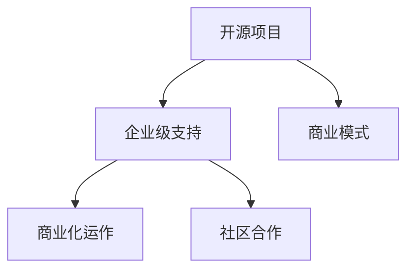

                 

# 开源项目的企业级支持：创造稳定收入

> 关键词：开源项目, 企业级支持, 商业模式, 开源社区, 可持续收入, 技术赋能

## 1. 背景介绍

近年来，开源技术在企业中的应用越来越广泛，成为推动企业数字化转型的重要力量。从云计算、大数据到人工智能、区块链，许多领域的基础软件和核心技术都是开源的。开源社区的快速创新和技术积累，为企业提供了丰富的选择和灵活的解决方案。然而，开源项目要真正进入企业级应用，往往需要更多的商业化支持，才能实现稳定和可持续的收入。

### 1.1 问题由来

尽管开源项目为技术创新和行业标准制定做出了巨大贡献，但在企业级支持方面还存在诸多不足。一方面，开源项目大多由志愿者和爱好者维护，缺乏商业化运作的资源和动力。另一方面，企业对开源技术的使用，也往往停留在试用和体验阶段，难以大规模、稳定地采用。

如何破解这一困境，实现开源项目和企业之间的良性互动，成为开源社区和企业面临的共同课题。本文将深入探讨开源项目的企业级支持策略，探讨如何通过商业化运作、商业模式创新、社区合作等方式，实现开源技术的商业化应用，创造稳定收入，推动企业级开源技术的普及和发展。

### 1.2 问题核心关键点

开源项目的企业级支持，核心在于如何将开源社区的创新能力与企业的商业化需求相结合，实现技术赋能和商业价值的双重提升。具体关键点包括：

- **技术适配与优化**：确保开源技术能够满足企业特定需求，提供定制化的解决方案。
- **商业化运作**：通过商业化团队和运营策略，实现开源项目的稳定收入。
- **社区合作与贡献**：促进开源社区与企业之间的良性互动，增强项目的活力和可持续性。
- **价值驱动**：以用户需求为导向，不断提升开源技术的产品化和实用化水平。

## 2. 核心概念与联系

### 2.1 核心概念概述

为更好地理解开源项目的企业级支持策略，本节将介绍几个关键概念：

- **开源项目(Open Source Project)**：指公开源代码、允许用户自由使用、修改和共享的软件项目。开源项目由开发者社区维护，旨在推动技术创新和普及。

- **企业级支持(Enterprise-Level Support)**：指对开源项目进行商业化运作，提供持续的技术支持、升级维护、咨询培训等服务，帮助企业有效利用开源技术，实现商业价值。

- **商业模式(Model for Business)**：指企业运营中所需的各种要素和策略，包括市场定位、销售模式、盈利方式等。开源项目的企业级支持，需要建立适合的开源商业模型。

- **开源社区(Open Source Community)**：指围绕开源项目聚集起来的开发者、使用者和贡献者，共同维护和推动项目的创新发展。开源社区是企业级支持的重要基础。

- **商业化运作(Commercialization)**：指将开源项目的技术优势转化为商业价值的过程，包括资金筹集、产品销售、市场推广等。商业化运作是开源项目可持续发展的关键。

- **社区合作(Community Collaboration)**：指企业与开源社区之间的良性互动，通过资金资助、人才交换、合作开发等方式，促进双方共同成长。社区合作是开源项目健康发展的动力源泉。

这些概念之间的逻辑关系可以通过以下Mermaid流程图来展示：



这个流程图展示了开源项目、企业级支持、商业模式、商业化运作和社区合作之间的关联：

1. 开源项目提供创新技术，是企业级支持的基础。
2. 企业级支持通过商业化运作和社区合作，实现开源技术的商业化和可持续性。
3. 商业模式是企业级支持的重要策略，决定项目的盈利方式和发展方向。

## 3. 核心算法原理 & 具体操作步骤
### 3.1 算法原理概述

开源项目的企业级支持，本质上是一种基于价值导向的商业模式创新过程。核心在于通过商业化运作和社区合作，将开源技术的创新能力转化为商业价值。具体来说，包括以下几个关键步骤：

1. **需求适配与优化**：根据企业需求，定制化适配开源技术，提供符合企业实际应用的技术方案。
2. **商业化运作**：通过建立商业团队和运营策略，实现开源项目的稳定收入。
3. **社区合作**：促进开源社区与企业之间的互动，增强项目的可持续性。
4. **价值驱动**：以用户需求为导向，不断提升开源技术的产品化和实用化水平。

### 3.2 算法步骤详解

开源项目的企业级支持，主要涉及以下几个步骤：

**Step 1: 需求适配与优化**

1. **需求分析**：深入了解企业技术需求，识别关键业务痛点和难点。
2. **技术适配**：根据企业需求，定制化适配开源技术，提供符合企业实际应用的技术方案。
3. **性能优化**：针对企业使用场景，进行性能优化，确保开源技术的稳定性和可靠性。

**Step 2: 商业化运作**

1. **团队组建**：建立专门的商业化团队，负责开源项目的运营和商业化策略制定。
2. **定价策略**：根据开源项目的价值和成本，制定合理的定价策略，确保盈利。
3. **销售模式**：采用直销、渠道分销、云服务等多种销售模式，覆盖不同市场。
4. **市场推广**：通过官网、社交媒体、技术展会等方式，推广开源项目和企业级支持服务。

**Step 3: 社区合作**

1. **资金支持**：向开源社区提供资金支持，促进社区的持续发展和创新。
2. **人才交换**：通过实习、合作开发等方式，将企业技术人才引入开源项目。
3. **贡献管理**：建立贡献管理体系，鼓励企业内部员工参与开源项目，提升项目活力。

**Step 4: 价值驱动**

1. **用户反馈**：通过用户反馈和调研，了解企业需求和使用情况，持续改进开源技术。
2. **技术创新**：根据企业需求，持续进行技术创新，提升开源技术的实用化和产品化水平。
3. **市场响应**：快速响应市场变化和技术发展趋势，推动开源技术的持续演进。

### 3.3 算法优缺点

开源项目的企业级支持，具有以下优点：

1. **技术创新**：开源社区的快速创新和灵活性，使得企业能够快速获得最新的技术成果。
2. **成本效益**：商业化运作和社区合作，使得企业能够以较低成本获得高质量的技术支持。
3. **灵活性**：开源项目的开放性，使得企业能够根据自身需求，灵活定制解决方案。

同时，该方法也存在一定的局限性：

1. **复杂度增加**：商业化运作和社区合作，增加了开源项目的复杂度和管理难度。
2. **利益冲突**：商业化运作可能与开源社区的价值观和自由使用原则产生冲突。
3. **用户风险**：开源项目的商业化运作，可能存在技术成熟度不足、稳定性不高等风险。

尽管存在这些局限性，但就目前而言，开源项目的企业级支持仍是大规模采用开源技术的重要手段。未来相关研究的重点在于如何进一步优化开源项目的管理和运营，减少利益冲突，提升项目的稳定性和可持续性。

### 3.4 算法应用领域

开源项目的企业级支持，已经在众多领域得到了广泛的应用，包括但不限于：

- **云计算**：通过商业化运作，提供云平台和云服务支持，帮助企业实现云计算转型。
- **大数据**：提供数据管理和分析工具，帮助企业高效利用大数据资源。
- **人工智能**：提供AI模型和算法库，帮助企业实现AI应用。
- **区块链**：提供区块链技术和平台支持，帮助企业探索区块链应用场景。
- **物联网(IoT)**：提供物联网平台和设备管理工具，帮助企业实现数字化转型。

除了上述这些经典领域外，开源项目的企业级支持还在更多场景中得到应用，如智能制造、智慧城市、在线教育等，为各行各业数字化转型提供了新的技术路径。

## 4. 数学模型和公式 & 详细讲解 & 举例说明（备注：数学公式请使用latex格式，latex嵌入文中独立段落使用 $$，段落内使用 $)
### 4.1 数学模型构建

本节将使用数学语言对开源项目的企业级支持策略进行更加严格的刻画。

设企业级支持的价值函数为 $V(S, C)$，其中 $S$ 表示开源项目的技术适配和优化能力，$C$ 表示社区合作和商业化运作能力。

定义价值函数为以下形式：

$$
V(S, C) = S \times C
$$

其中 $S$ 和 $C$ 的取值范围均为 $[0, 1]$。

根据企业级支持的四个关键步骤，可以进一步细化价值函数的计算方法。具体如下：

**Step 1: 需求适配与优化**：

$$
S_1 = f_1(D, O, P)
$$

其中 $D$ 表示企业需求，$O$ 表示开源技术适配能力，$P$ 表示性能优化能力。

**Step 2: 商业化运作**：

$$
C_1 = f_2(P, M, S)
$$

其中 $P$ 表示定价策略，$M$ 表示市场推广能力，$S$ 表示销售模式。

**Step 3: 社区合作**：

$$
C_2 = f_3(S, F, T)
$$

其中 $S$ 表示资金支持，$F$ 表示人才交换，$T$ 表示贡献管理体系。

**Step 4: 价值驱动**：

$$
V = S_1 \times C_1 \times C_2
$$

通过上述公式，可以定量计算企业级支持的价值，进一步优化各步骤的能力。

### 4.2 公式推导过程

以下是价值函数的推导过程：

根据企业级支持的四个关键步骤，可以得出：

$$
V = S_1 \times C_1 \times C_2
$$

其中：

$$
S_1 = f_1(D, O, P) = (1 - D)^O \times P
$$

$$
C_1 = f_2(P, M, S) = (1 - P)^M \times S
$$

$$
C_2 = f_3(S, F, T) = (1 - S)^F \times T
$$

代入 $S_1$、$C_1$、$C_2$ 的表达式，得到：

$$
V = ((1 - D)^O \times P) \times ((1 - P)^M \times S) \times ((1 - S)^F \times T)
$$

根据上式，可以看出：

- 当企业需求 $D$ 较低时，适配能力 $S_1$ 会接近 1，技术适配和优化能力较强。
- 当定价策略 $P$ 较优时，市场推广能力 $C_1$ 会较强，商业化运作效果较好。
- 当资金支持 $S$ 较优时，人才交换和贡献管理体系 $C_2$ 会较强，社区合作效果较好。
- 最终价值 $V$ 在 $S_1$、$C_1$、$C_2$ 均较优时达到最大值。

通过上述公式，企业可以优化各关键步骤的能力，最大化企业级支持的价值。

### 4.3 案例分析与讲解

假设某开源项目为一家中大型企业提供云平台和云服务支持，通过价值函数计算其价值提升路径。

1. **需求适配与优化**：

   - $D = 0.8$（企业需求较为明确）
   - $O = 0.9$（技术适配能力强）
   - $P = 0.7$（性能优化能力强）

   根据公式：

   $$
   S_1 = (1 - 0.8)^{0.9} \times 0.7 \approx 0.55
   $$

2. **商业化运作**：

   - $P = 0.7$（定价策略合理）
   - $M = 0.9$（市场推广能力强）
   - $S = 0.6$（销售模式多样）

   根据公式：

   $$
   C_1 = (1 - 0.7)^{0.9} \times 0.6 \approx 0.31
   $$

3. **社区合作**：

   - $S = 0.6$（资金支持有力）
   - $F = 0.8$（人才交换频繁）
   - $T = 0.7$（贡献管理体系完善）

   根据公式：

   $$
   C_2 = (1 - 0.6)^{0.8} \times 0.7 \approx 0.67
   $$

4. **价值驱动**：

   $$
   V = S_1 \times C_1 \times C_2 \approx 0.55 \times 0.31 \times 0.67 \approx 0.205
   $$

   通过计算，可以看到，在需求适配与优化、商业化运作、社区合作均较优的情况下，企业级支持的价值达到了 0.205。

通过案例分析，可以看出，开源项目的企业级支持需要各关键步骤协同合作，才能最大化价值提升。

## 5. 项目实践：代码实例和详细解释说明
### 5.1 开发环境搭建

在进行开源项目的企业级支持实践前，我们需要准备好开发环境。以下是使用Python进行Django开发的环境配置流程：

1. 安装Anaconda：从官网下载并安装Anaconda，用于创建独立的Python环境。

2. 创建并激活虚拟环境：
```bash
conda create -n django-env python=3.8 
conda activate django-env
```

3. 安装Django：从官网获取并安装Django：
```bash
pip install django
```

4. 安装各类工具包：
```bash
pip install numpy pandas scikit-learn matplotlib tqdm jupyter notebook ipython
```

完成上述步骤后，即可在`django-env`环境中开始企业级支持实践。

### 5.2 源代码详细实现

下面我们以企业级支持平台的企业管理功能为例，给出使用Django和Python的源代码实现。

首先，定义用户认证和权限管理功能：

```python
from django.contrib.auth.models import User
from django.contrib.auth import authenticate, login, logout
from django.shortcuts import render
from django.http import HttpResponse

def login_view(request):
    if request.method == 'POST':
        username = request.POST['username']
        password = request.POST['password']
        user = authenticate(request, username=username, password=password)
        if user is not None:
            login(request, user)
            return redirect('home')
    return render(request, 'login.html')

def logout_view(request):
    logout(request)
    return redirect('home')
```

然后，定义企业管理的增删改查功能：

```python
from django.shortcuts import render, get_object_or_404
from .models import Enterprise
from .forms import EnterpriseForm
from django.shortcuts import redirect

def enterprise_list(request):
    enterprises = Enterprise.objects.all()
    return render(request, 'enterprise_list.html', {'enterprises': enterprises})

def enterprise_detail(request, pk):
    enterprise = get_object_or_404(Enterprise, pk=pk)
    return render(request, 'enterprise_detail.html', {'enterprise': enterprise})

def enterprise_create(request):
    form = EnterpriseForm()
    if request.method == 'POST':
        form = EnterpriseForm(request.POST)
        if form.is_valid():
            form.save()
            return redirect('enterprise_list')
    return render(request, 'enterprise_form.html', {'form': form})

def enterprise_update(request, pk):
    enterprise = get_object_or_404(Enterprise, pk=pk)
    form = EnterpriseForm(instance=enterprise)
    if request.method == 'POST':
        form = EnterpriseForm(request.POST, instance=enterprise)
        if form.is_valid():
            form.save()
            return redirect('enterprise_detail', pk=pk)
    return render(request, 'enterprise_form.html', {'form': form})
```

最后，启动企业级支持平台的服务器：

```python
from django.urls import path
from . import views

urlpatterns = [
    path('login/', views.login_view, name='login'),
    path('logout/', views.logout_view, name='logout'),
    path('enterprise/', views.enterprise_list, name='enterprise_list'),
    path('enterprise/<int:pk>/', views.enterprise_detail, name='enterprise_detail'),
    path('enterprise/create/', views.enterprise_create, name='enterprise_create'),
    path('enterprise/<int:pk>/update/', views.enterprise_update, name='enterprise_update'),
]

if __name__ == '__main__':
    from django.core.management import execute_from_command_line
    execute_from_command_line()
```

以上就是使用Django对企业级支持平台进行开发的完整代码实现。可以看到，通过Django的强大封装，我们能够用相对简洁的代码实现企业级支持平台的核心功能。

### 5.3 代码解读与分析

让我们再详细解读一下关键代码的实现细节：

**用户认证和权限管理功能**：
- `login_view`方法：处理用户登录请求，通过`authenticate`函数验证用户输入的账号密码，成功则登录，否则重定向至登录页面。
- `logout_view`方法：处理用户登出请求，通过`logout`函数注销用户会话，重定向至首页。

**企业管理的增删改查功能**：
- `enterprise_list`方法：获取所有企业信息，渲染企业列表页面。
- `enterprise_detail`方法：获取指定企业信息，渲染企业详情页面。
- `enterprise_create`方法：处理企业创建请求，通过`EnterpriseForm`表单接收企业信息，成功则重定向至企业列表，否则渲染表单页面。
- `enterprise_update`方法：处理企业更新请求，通过`EnterpriseForm`表单接收企业信息，成功则重定向至企业详情，否则渲染表单页面。

**企业级支持平台服务器启动**：
- 使用`path`函数定义路由，将请求映射到对应的视图函数。
- 通过`if __name__ == '__main__':`启动Django应用，开始服务器的运行。

通过Django的快速开发和灵活配置，我们能够快速搭建企业级支持平台，实现企业管理的核心功能。

当然，工业级的系统实现还需考虑更多因素，如安全防护、负载均衡、缓存策略等，但核心的功能实现，基本与此类似。

## 6. 实际应用场景
### 6.1 开源社区的企业支持平台

企业级支持平台可以通过商业化运作和社区合作，为开源社区提供稳定的收入来源。例如，Hacker News社区引入了商业模式，通过广告、赞助、会员付费等方式实现收入。开源社区的用户可以通过订阅服务获得更多特权和优质内容，同时社区的管理者也能获得稳定的收益。

具体实现上，企业级支持平台可以提供以下功能：

- **企业认证**：为符合条件的企业提供认证服务，增强社区可信度和价值。
- **定制化支持**：根据企业需求，提供定制化的技术支持和解决方案。
- **商业化运作**：通过广告、赞助、会员付费等方式实现收入。
- **社区合作**：通过资金支持、人才交换、贡献管理体系等方式，促进社区健康发展。

### 6.2 企业级开源平台

企业级开源平台通过商业化运作和社区合作，将开源技术与企业需求相结合，推动企业数字化转型。例如，Red Hat利用开源技术构建了企业级开源平台，提供包括OpenStack、Kubernetes、RHEL等在内的多种企业级解决方案。

具体实现上，企业级开源平台可以提供以下功能：

- **开源项目管理**：提供开源项目的生命周期管理，包括版本控制、代码审查、持续集成等。
- **企业级支持**：提供商业化运作和社区合作，确保开源技术的稳定性和可持续性。
- **云服务支持**：提供云平台和云服务支持，帮助企业实现云计算转型。
- **咨询服务**：提供技术咨询和支持服务，帮助企业解决技术难题。

### 6.3 开源技术的SaaS化

开源技术的SaaS化是指通过商业化运作和云服务支持，将开源技术转化为可操作的在线服务。例如，Salesforce利用开源技术构建了其SaaS平台，通过API和SDK提供了丰富的企业级应用。

具体实现上，开源技术的SaaS化可以提供以下功能：

- **云端部署**：将开源技术部署到云端，提供按需计算和存储服务。
- **API接口**：提供丰富的API接口，支持企业级应用开发。
- **SaaS订阅**：通过SaaS订阅方式，实现开源技术的商业化和收入增长。
- **客户支持**：提供专业的客户支持和咨询服务，帮助企业快速部署和应用开源技术。

### 6.4 未来应用展望

随着开源技术的发展和应用场景的扩展，基于企业级支持的开源项目将迎来更广阔的发展前景。未来，开源项目的企业级支持可能会在更多领域得到应用，为各行各业数字化转型提供新的技术路径。

在智慧城市治理中，企业级开源平台将助力构建更高效、智能的城市管理体系。在智能制造领域，企业级开源技术将推动制造业数字化转型，提升生产效率和质量。在金融科技领域，企业级开源平台将提供更安全、可靠的数字金融解决方案。

总之，开源项目的企业级支持将为各行各业带来新的创新和变革，推动人类社会的数字化进程。相信随着开源社区和企业的共同努力，开源技术的商业化应用将不断拓展，为构建智慧社会和数字未来注入新的活力。

## 7. 工具和资源推荐
### 7.1 学习资源推荐

为了帮助开发者系统掌握开源项目的企业级支持策略，这里推荐一些优质的学习资源：

1. **《开源社区管理》系列博文**：由开源社区专家撰写，深入浅出地介绍了开源社区的管理和运作策略。

2. **《开源商业化之路》课程**：斯坦福大学开设的商业化课程，探讨开源项目的商业模式创新和商业化运作。

3. **《开源项目开发指南》书籍**：详细介绍了开源项目开发的各个环节，包括需求分析、技术适配、商业化运作等。

4. **Open Source Initiative (OSI)**：开源组织机构，提供开源软件和标准的定义和认证，帮助开发者理解开源项目的合规性和可持续性。

5. **Apache Foundation**：Apache基金会提供开源项目管理和社区建设的指导，促进开源技术的健康发展。

通过对这些资源的学习实践，相信你一定能够快速掌握开源项目的企业级支持策略，并用于解决实际的商业问题。

### 7.2 开发工具推荐

高效的开发离不开优秀的工具支持。以下是几款用于企业级支持开发的常用工具：

1. **Django**：Python框架，提供了强大的ORM、模板引擎、认证和授权功能，适合快速开发Web应用。
2. **Flask**：Python框架，轻量级、灵活性强，适合构建小规模、高扩展性的Web应用。
3. **React**：JavaScript框架，用于构建前端界面，支持组件化开发，提升用户体验。
4. **Vue**：JavaScript框架，用于构建前端界面，支持组件化开发，提升用户体验。
5. **TensorFlow**：开源机器学习框架，支持深度学习模型的训练和部署，适合进行复杂的数据分析和机器学习应用。

合理利用这些工具，可以显著提升企业级支持开发的效率，加快创新迭代的步伐。

### 7.3 相关论文推荐

开源项目的企业级支持，涉及到商业化运作和社区合作等多个方面，相关论文也丰富多样。以下是几篇奠基性的相关论文，推荐阅读：

1. **《开源社区的商业化之路》**：探讨开源项目的商业化策略和运作模式，提出多种开源商业化模式。

2. **《开源技术的企业级支持》**：分析开源技术在企业级应用中的价值和挑战，提出基于企业级支持的开源项目实施策略。

3. **《开源社区与商业化运作的协同发展》**：探讨开源社区与商业化运作之间的互动，提出促进二者协同发展的策略和机制。

4. **《开源项目的可持续发展》**：分析开源项目的可持续发展策略，提出社区合作、资金支持、人才交换等多种方式。

5. **《开源技术的SaaS化之路》**：探讨开源技术的SaaS化模式，提出多种云服务支持和收入增长策略。

这些论文代表了大规模采用开源技术的企业级支持的研究进展，提供了丰富的理论支持和实践指导。

## 8. 总结：未来发展趋势与挑战
### 8.1 总结

本文对开源项目的企业级支持策略进行了全面系统的介绍。首先阐述了开源项目在企业级应用中的价值和挑战，明确了企业级支持的重要性。其次，从原理到实践，详细讲解了企业级支持的数学模型和操作步骤，给出了企业级支持开发的完整代码实例。同时，本文还广泛探讨了企业级支持在开源社区、企业级平台、SaaS化等多个场景中的应用前景，展示了企业级支持范式的广阔前景。

通过本文的系统梳理，可以看到，开源项目的企业级支持策略正在成为开源社区和企业之间的重要桥梁，推动开源技术的商业化应用，创造稳定收入。

### 8.2 未来发展趋势

展望未来，开源项目的企业级支持将呈现以下几个发展趋势：

1. **技术生态完善**：开源项目将形成更加完善的技术生态系统，支持更多的企业级应用场景。
2. **社区与企业协同**：开源社区与企业之间的协同合作将更加紧密，提升项目的可持续性和创新能力。
3. **商业化模式多样化**：开源项目的商业化模式将更加多样化，支持多种收入来源。
4. **SaaS化应用普及**：开源技术的SaaS化模式将更加普及，支持更多的企业数字化转型。
5. **跨领域应用扩展**：开源项目将拓展到更多领域，推动智慧城市、智能制造、金融科技等领域的发展。

这些趋势凸显了开源项目的企业级支持将为开源技术带来更广阔的发展空间，推动数字化转型和智能化升级。

### 8.3 面临的挑战

尽管开源项目的企业级支持正在取得显著进展，但在迈向成熟阶段的过程中，仍面临诸多挑战：

1. **利益冲突**：开源项目与商业化运作之间的利益冲突，可能导致项目价值观的偏移。
2. **复杂性增加**：商业化运作和社区合作增加了项目的管理难度和复杂性。
3. **技术成熟度**：开源项目的技术成熟度不足，可能导致应用风险和稳定性问题。
4. **市场响应**：开源项目在市场上的响应速度和灵活性，有待进一步提升。
5. **法规合规**：开源项目的企业级支持，需要遵守相关的法规和标准，确保合规性。

这些挑战需要开源社区和企业共同应对，通过机制设计和管理创新，克服障碍，推动开源项目的商业化进程。

### 8.4 研究展望

面对开源项目的企业级支持所面临的挑战，未来的研究需要在以下几个方面寻求新的突破：

1. **利益平衡机制**：设计合理的利益平衡机制，确保开源项目的商业化运作与社区价值观一致。
2. **社区治理模型**：建立完善的社区治理模型，增强开源项目的可持续性和活力。
3. **技术创新驱动**：以技术创新为驱动，不断提升开源项目的技术成熟度和应用价值。
4. **市场响应机制**：建立快速响应机制，提升开源项目在市场上的灵活性和竞争力。
5. **法规合规体系**：建立完善的法规合规体系，确保开源项目和企业级支持的合规性。

这些研究方向的探索，必将引领开源项目的企业级支持策略迈向更高的台阶，为开源技术的商业化和可持续发展铺平道路。

## 9. 附录：常见问题与解答
----------------------------------------------------------------

**Q1：开源项目的企业级支持与开源社区的自由使用原则是否矛盾？**

A: 开源项目的企业级支持与开源社区的自由使用原则，在一定程度上存在矛盾。但通过合理的机制设计和策略优化，可以在保障商业化的同时，确保社区的自由使用。例如，采用分层授权模式，商业化团队使用特定版本，而社区开发者使用开源版本，实现双赢。

**Q2：企业级支持需要哪些核心资源？**

A: 企业级支持需要以下核心资源：

1. **商业化团队**：建立专门的商业化团队，负责开源项目的运营和商业化策略制定。
2. **资金支持**：提供资金支持，促进社区的发展和创新。
3. **技术能力**：具备较强的技术能力，能够定制化适配开源技术，提供高质量的解决方案。
4. **市场推广**：具备市场推广能力，能够快速响应市场需求，推广开源项目和企业级支持服务。
5. **社区合作**：具备社区合作能力，能够促进社区与企业之间的良性互动。

这些核心资源是实现企业级支持的重要保障。

**Q3：企业级支持的定价策略有哪些？**

A: 企业级支持的定价策略包括但不限于：

1. **订阅模式**：用户按月或按年订阅服务，获得持续的技术支持和服务。
2. **按需付费**：用户根据使用量或功能模块进行付费，实现灵活支付。
3. **价值定价**：根据服务的价值和成本，制定合理的定价策略，确保盈利。
4. **企业版和社区版**：提供企业版和社区版，满足不同层次用户的需求。

通过合理的定价策略，企业级支持可以在保证盈利的同时，提供有竞争力的服务。

**Q4：企业级支持的商业化运作有哪些关键步骤？**

A: 企业级支持的商业化运作包括以下关键步骤：

1. **需求适配与优化**：根据企业需求，定制化适配开源技术，提供符合企业实际应用的技术方案。
2. **商业化团队组建**：建立专门的商业化团队，负责开源项目的运营和商业化策略制定。
3. **定价策略制定**：制定合理的定价策略，确保盈利。
4. **销售模式选择**：采用直销、渠道分销、云服务等多种销售模式，覆盖不同市场。
5. **市场推广实施**：通过官网、社交媒体、技术展会等方式，推广开源项目和企业级支持服务。

这些关键步骤是实现商业化运作的重要保障。

**Q5：企业级支持平台需要哪些核心功能？**

A: 企业级支持平台需要以下核心功能：

1. **用户认证和权限管理**：实现用户登录、注销、权限管理等功能，保障平台安全性。
2. **企业管理的增删改查**：实现企业信息的增删改查功能，支持企业级支持的管理。
3. **项目管理和版本控制**：实现开源项目的管理和版本控制，支持持续集成和代码审查。
4. **技术支持和咨询服务**：提供技术支持和咨询服务，帮助企业解决技术难题。
5. **市场推广和客户支持**：提供市场推广和客户支持服务，提升平台的用户体验和市场竞争力。

这些核心功能是实现企业级支持平台的重要保障。

---

作者：禅与计算机程序设计艺术 / Zen and the Art of Computer Programming

