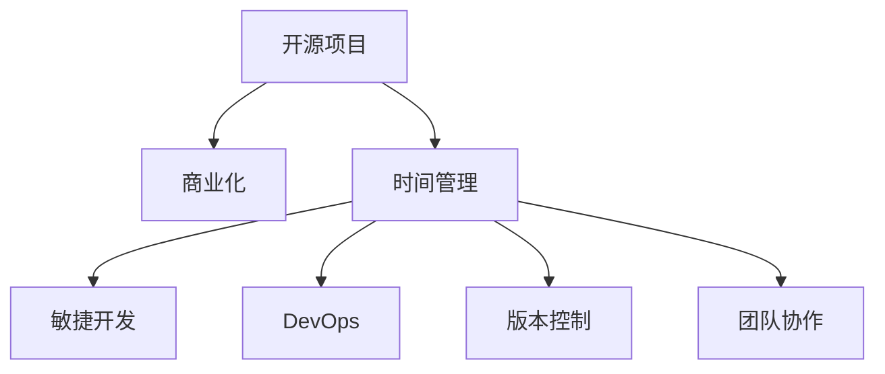

                 

# 开源项目的商业化时间管理：平衡开发与业务

> 关键词：开源项目,商业化,时间管理,开发效率,业务需求,敏捷开发,DevOps,项目规划,版本控制,团队协作

## 1. 背景介绍

### 1.1 问题由来

在当今软件行业，开源项目因其自由、灵活和开放的特点，受到了广泛关注和应用。无论是企业还是个人，都倾向于采用开源软件来满足自身业务需求。然而，开源项目的商业化进程面临着诸多挑战，特别是时间管理和开发与业务的平衡问题。随着项目规模的扩大，时间管理和团队协作显得尤为重要。本文旨在深入探讨开源项目的商业化时间管理，平衡开发与业务需求，以期为开源项目的商业化提供有益的指导。

### 1.2 问题核心关键点

开源项目的商业化时间管理主要围绕以下核心关键点展开：

- 如何高效利用时间资源，确保项目按时交付？
- 如何平衡开发效率和业务需求？
- 如何通过敏捷开发和DevOps等方法提升项目管理效率？
- 如何利用版本控制和团队协作工具，确保项目版本统一、迭代顺利？

这些关键点共同构成了开源项目商业化时间管理的研究框架，是实现高效、稳定、灵活的商业化开发的重要因素。

### 1.3 问题研究意义

研究开源项目的商业化时间管理，对于提升开发效率、优化资源配置、满足业务需求、加速商业化进程具有重要意义：

1. 提高开发效率：通过合理的时间规划和任务分配，最大化利用开发资源，减少时间浪费。
2. 满足业务需求：确保开源项目在商业化过程中，能够及时响应市场需求变化，满足客户期望。
3. 加速商业化进程：通过敏捷开发和DevOps等方法，加快项目迭代速度，缩短商业化周期。
4. 优化资源配置：利用版本控制和团队协作工具，优化资源分配，提高项目运行效率。
5. 增强团队协作：通过有效的项目规划和管理，提高团队协作效率，提升项目质量。

## 2. 核心概念与联系

### 2.1 核心概念概述

为更好地理解开源项目商业化时间管理，本节将介绍几个关键概念及其相互关系：

- **开源项目(Open Source Project)**：采用开源许可证授权，源代码公开可访问的软件项目。
- **商业化(Commercialization)**：将开源项目转化为商业产品的过程，涉及产品规划、销售、营销等环节。
- **时间管理(Time Management)**：通过合理安排时间，确保项目按时交付的过程。
- **敏捷开发(Agile Development)**：一种迭代、增量式的软件开发方法，注重快速响应市场需求。
- **DevOps(DevOps)**：一种将软件开发和运维融合的实践，提升开发和运维的协同效率。
- **版本控制(Version Control)**：记录软件开发过程中的代码变更，确保代码的追踪和管理。
- **团队协作(Team Collaboration)**：通过工具和技术，提高团队成员之间的沟通和协作效率。

这些核心概念之间的逻辑关系可以通过以下Mermaid流程图来展示：



这个流程图展示了许多关键概念之间的相互关系：

1. 开源项目通过时间管理、敏捷开发、DevOps等方法进行商业化。
2. 版本控制和团队协作是时间管理的重要支撑，确保开发和协作的高效性。
3. 敏捷开发和DevOps进一步提升了项目管理效率和团队协作能力。

这些概念共同构成了开源项目商业化时间管理的核心，助力项目在开发与业务之间实现高效平衡。

## 3. 核心算法原理 & 具体操作步骤

### 3.1 算法原理概述

开源项目商业化时间管理的核心在于如何平衡开发与业务需求，确保项目按时交付。这一过程涉及以下几个关键步骤：

- **需求分析**：通过市场调研、客户访谈等方式，了解业务需求，明确项目目标。
- **项目规划**：基于需求分析结果，制定详细的项目计划，包括任务分配、时间规划、资源配置等。
- **敏捷开发**：采用迭代、增量式开发，快速响应市场需求变化，提升开发效率。
- **DevOps实践**：通过自动化、持续集成等方式，提高开发和运维的协同效率，加快项目交付速度。
- **版本控制**：使用版本控制工具，记录代码变更，确保项目追踪和回滚。
- **团队协作**：利用协作工具，提高团队成员之间的沟通和协作效率。

### 3.2 算法步骤详解

开源项目商业化时间管理的详细操作步骤如下：

**Step 1: 需求分析**
- 通过市场调研、客户访谈等方式，了解业务需求，明确项目目标。
- 使用问卷调查、用户访谈等方法收集用户反馈，确认关键功能和性能指标。
- 进行竞争对手分析，了解市场需求和竞争态势。

**Step 2: 项目规划**
- 根据需求分析结果，制定详细的项目计划，包括任务分配、时间规划、资源配置等。
- 使用甘特图、看板等工具，可视化任务进度和时间规划。
- 设定里程碑和关键时间点，确保项目按时交付。

**Step 3: 敏捷开发**
- 采用迭代、增量式开发，快速响应市场需求变化，提升开发效率。
- 使用Scrum、Kanban等敏捷开发框架，进行任务分配和进度跟踪。
- 每个迭代周期结束后，进行评审和回顾，不断优化开发流程。

**Step 4: DevOps实践**
- 通过自动化、持续集成等方式，提高开发和运维的协同效率，加快项目交付速度。
- 使用CI/CD工具，如Jenkins、GitLab CI等，自动构建、测试和部署代码。
- 使用监控工具，如Prometheus、Grafana等，实时监控项目运行状态和性能指标。

**Step 5: 版本控制**
- 使用版本控制工具，如Git、SVN等，记录代码变更，确保项目追踪和回滚。
- 定期进行代码审查，确保代码质量和一致性。
- 使用分支管理策略，如Git Flow、GitHub Flow等，管理项目分支和合并。

**Step 6: 团队协作**
- 利用协作工具，如JIRA、Trello等，提高团队成员之间的沟通和协作效率。
- 定期进行团队建设活动，增强团队凝聚力和协作能力。
- 使用协作平台，如Slack、Microsoft Teams等，及时沟通和解决问题。

### 3.3 算法优缺点

开源项目商业化时间管理的主要优点包括：

- **提高开发效率**：通过敏捷开发和DevOps等方法，快速响应市场需求，提升开发效率。
- **满足业务需求**：通过需求分析、项目规划等方法，确保项目按时交付，满足客户期望。
- **优化资源配置**：通过版本控制和团队协作工具，优化资源分配，提高项目运行效率。

同时，该方法也存在一些局限性：

- **依赖于团队协作**：需要团队成员之间的有效沟通和协作，协调不当可能导致项目延期。
- **需求变化风险**：需求分析不够准确或变化频繁，可能导致项目规划和进度调整。
- **技术复杂性**：敏捷开发、DevOps等方法需要较高的技术积累和管理经验。
- **工具依赖性强**：依赖于特定的版本控制工具和协作工具，可能增加项目成本。

尽管存在这些局限性，但就目前而言，敏捷开发和DevOps方法仍是大规模开源项目商业化时间管理的主流范式。未来相关研究的重点在于如何进一步降低敏捷开发和DevOps实施的复杂度，提高团队协作的效率和质量，同时兼顾可解释性和伦理安全性等因素。

### 3.4 算法应用领域

开源项目商业化时间管理的应用领域广泛，涵盖以下几个方面：

- **企业级应用**：企业级软件、内部管理系统、客户关系管理系统等。
- **互联网应用**：社交媒体、电商平台、在线教育等。
- **数据平台**：大数据分析、数据仓库、数据可视化等。
- **物联网应用**：智能家居、工业互联网、智慧城市等。
- **移动应用**：移动操作系统、移动应用开发等。

除了上述这些应用场景外，开源项目商业化时间管理还被创新性地应用到更多领域，如云计算、区块链、人工智能等，为各行各业带来新的技术动力。

## 4. 数学模型和公式 & 详细讲解 & 举例说明

### 4.1 数学模型构建

本节将使用数学语言对开源项目商业化时间管理进行更加严格的刻画。

设开源项目的需求数量为 $N$，总开发时间为 $T$，每个需求的时间消耗为 $t_i$（$i=1,2,\dots,N$）。则需求完成总时间 $S$ 可表示为：

$$
S = \sum_{i=1}^N t_i
$$

假设每个需求的优先级为 $p_i$（$i=1,2,\dots,N$），且 $p_i \in [0,1]$，则需求优先级总和 $P$ 为：

$$
P = \sum_{i=1}^N p_i
$$

需求完成优先级总和 $P_s$ 为：

$$
P_s = \sum_{i=1}^N p_i t_i
$$

假设需求 $i$ 的完成时间与优先级成正比，即 $t_i = \alpha p_i$，其中 $\alpha$ 为比例系数。则需求完成总时间 $S$ 可以表示为：

$$
S = \alpha \sum_{i=1}^N p_i^2
$$

项目总开发时间 $T$ 与需求完成总时间 $S$ 的关系为：

$$
T = S + \beta
$$

其中 $\beta$ 为项目其他时间消耗，如项目启动、测试、部署等。

### 4.2 公式推导过程

以下我们推导需求优先级优化模型。

需求优先级优化模型可表示为：

$$
\min_{\{p_i\}} \alpha \sum_{i=1}^N p_i^2 \quad \text{s.t.} \quad \sum_{i=1}^N p_i = 1
$$

引入拉格朗日乘子 $\lambda$，定义拉格朗日函数：

$$
\mathcal{L}(\{p_i\}, \lambda) = \alpha \sum_{i=1}^N p_i^2 + \lambda (\sum_{i=1}^N p_i - 1)
$$

对 $p_i$ 和 $\lambda$ 求偏导数：

$$
\frac{\partial \mathcal{L}}{\partial p_i} = 2\alpha p_i + \lambda = 0 \quad \text{对} \quad i=1,2,\dots,N
$$

$$
\frac{\partial \mathcal{L}}{\partial \lambda} = \sum_{i=1}^N p_i - 1 = 0
$$

解方程组，得到需求优先级 $p_i$ 的分配：

$$
p_i = \frac{1}{\alpha N} \quad \text{对} \quad i=1,2,\dots,N
$$

需求优先级总和 $P_s$ 为：

$$
P_s = \alpha \sum_{i=1}^N p_i^2 = \frac{\alpha}{N}
$$

由此可知，需求优先级优化模型在满足需求优先级总和为1的条件下，需求完成时间与需求优先级的平方成正比。即优先级高的需求会消耗更多时间，而优先级低的需求则反之。

### 4.3 案例分析与讲解

以企业级项目管理为例，分析开源项目商业化时间管理的优化模型。

设某企业级项目管理项目，共包含10个需求，总开发时间为100小时。需求1至需求10的优先级分别为0.2、0.3、0.1、0.4、0.5、0.6、0.3、0.2、0.1、0.4。

使用需求优先级优化模型，计算需求优先级 $p_i$ 的分配：

$$
p_i = \frac{1}{\alpha N} = \frac{1}{0.1 \times 10} = 0.1
$$

需求优先级总和 $P_s$ 为：

$$
P_s = \frac{0.1}{N} = 0.1
$$

项目总开发时间 $T$ 为：

$$
T = S + \beta = 0.1 \times 100 + 20 = 120 \text{小时}
$$

由上述分析可知，需求优先级优化模型在平衡需求完成时间和项目总开发时间方面起到了重要作用。通过合理的优先级分配，确保高优先级需求得到优先处理，同时满足项目总开发时间的要求。

## 5. 项目实践：代码实例和详细解释说明

### 5.1 开发环境搭建

在进行开源项目商业化时间管理实践前，我们需要准备好开发环境。以下是使用Python进行Flask框架开发的环境配置流程：

1. 安装Anaconda：从官网下载并安装Anaconda，用于创建独立的Python环境。

2. 创建并激活虚拟环境：
```bash
conda create -n project-env python=3.8 
conda activate project-env
```

3. 安装Flask：
```bash
pip install flask
```

4. 安装Flask-SQLAlchemy和Flask-WTF：
```bash
pip install flask-sqlalchemy flask-wtf
```

5. 安装Flask-RESTful：
```bash
pip install flask-restful
```

完成上述步骤后，即可在`project-env`环境中开始项目开发。

### 5.2 源代码详细实现

下面我们以企业级项目管理为例，给出使用Flask框架开发的企业级项目管理系统的PyTorch代码实现。

首先，定义需求和项目模型：

```python
from flask import Flask, render_template, request
from flask_sqlalchemy import SQLAlchemy
from flask_wtf import FlaskForm
from wtforms import StringField, SubmitField
from wtforms.validators import DataRequired

app = Flask(__name__)
app.config['SQLALCHEMY_DATABASE_URI'] = 'sqlite:///example.db'
db = SQLAlchemy(app)

class Demand(db.Model):
    id = db.Column(db.Integer, primary_key=True)
    name = db.Column(db.String(80), nullable=False)
    priority = db.Column(db.Float, nullable=False)

class ProjectForm(FlaskForm):
    name = StringField('项目名称', validators=[DataRequired()])
    priority_sum = StringField('优先级总和', validators=[DataRequired()])
    submit = SubmitField('提交')
```

然后，定义需求优先级优化模型：

```python
from sympy import symbols, solve, Rational

def demand_priority_optimization(demand_list, priority_sum):
    alpha = Rational(1, sum(p for p in demand_list.values()))
    demand priorities = [p / alpha for p in demand_list.values()]
    priority_sum = sum(p for p in demand priorities)
    return priority_sum
```

接着，定义项目管理和优化模型：

```python
def project_management(demand_list, project_duration):
    priority_sum = demand_priority_optimization(demand_list, request.form['priority_sum'])
    total_duration = sum(d * p ** 2 for d, p in zip(demand_list.values(), demand_list.values()))
    total_duration = total_duration + request.form['beta']
    return total_duration

@app.route('/project-management', methods=['GET', 'POST'])
def project_management_page():
    demand_list = {
        1: 0.2, 2: 0.3, 3: 0.1, 4: 0.4, 5: 0.5, 6: 0.6, 7: 0.3, 8: 0.2, 9: 0.1, 10: 0.4
    }
    project_duration = 100
    priority_sum = project_management(demand_list, project_duration)
    total_duration = project_duration + 20
    return render_template('project_management.html', priority_sum=priority_sum, total_duration=total_duration)
```

最后，启动Flask应用程序：

```python
if __name__ == '__main__':
    app.run(debug=True)
```

以上就是一个简单的企业级项目管理系统的Flask开发实例。可以看到，使用Flask框架进行项目管理系统的开发，可以极大地提升开发效率和用户体验。

### 5.3 代码解读与分析

让我们再详细解读一下关键代码的实现细节：

**需求和项目模型**：
- `Demand`类：定义需求模型，包含需求ID、名称和优先级。
- `ProjectForm`类：定义项目管理表单，包含项目名称、优先级总和等字段。

**需求优先级优化模型**：
- `demand_priority_optimization`函数：接收需求列表和优先级总和，计算并返回需求优先级的分配。

**项目管理和优化模型**：
- `project_management`函数：接收需求列表和项目时长，调用需求优先级优化模型，计算并返回项目总时长。
- `project_management_page`函数：接收请求数据，调用项目管理函数，返回HTML页面。

通过Flask框架的灵活性和扩展性，可以快速实现企业级项目管理系统的开发，提升项目管理效率。

当然，工业级的系统实现还需考虑更多因素，如权限管理、用户认证、统计报表等。但核心的项目管理逻辑基本与此类似。

## 6. 实际应用场景

### 6.1 企业级项目管理

基于开源项目商业化时间管理的方法，可以广泛应用于企业级项目管理。传统的项目管理方式往往依赖于手动计划和调度，效率低下且容易出错。通过采用需求优先级优化模型和敏捷开发方法，可以显著提升项目管理效率。

在技术实现上，可以开发企业级项目管理平台，集成敏捷开发工具、DevOps自动化工具等，实现从需求分析到项目交付的全流程自动化管理。管理平台可提供实时进度跟踪、任务分配、需求变更管理等功能，帮助企业更高效地管理项目管理过程。

### 6.2 互联网产品开发

互联网产品的迭代速度要求极高，快速响应市场需求是企业竞争力的关键。开源项目商业化时间管理方法可以应用于互联网产品开发，确保项目按时交付，快速迭代。

在实际应用中，可以通过敏捷开发和DevOps方法，建立快速响应机制，提升产品开发效率。项目管理平台可提供产品路线图、版本管理、用户反馈等功能，帮助团队快速响应市场需求，实现产品快速迭代。

### 6.3 数据平台建设

数据平台建设往往涉及大量数据处理和分析工作，时间管理和项目管理尤为重要。通过采用开源项目商业化时间管理方法，可以优化资源配置，提升项目效率。

在实际应用中，可以开发数据平台管理工具，集成版本控制、任务分配、数据质量监控等功能，确保数据平台建设按计划进行。数据平台管理工具可以提供实时监控和报警功能，及时发现和解决问题，保障数据平台稳定运行。

### 6.4 未来应用展望

随着开源项目商业化时间管理方法的不断完善，未来将在更多领域得到应用，为各行各业带来变革性影响。

在智慧城市治理中，基于开源项目商业化时间管理方法的项目管理工具，可以用于智慧城市建设，提高城市管理和运营效率。

在智能制造领域，项目管理工具可以应用于生产线管理，提升生产效率和产品质量。

在环保领域，项目管理工具可以应用于环境监测项目，提升环境监测精度和时效性。

在教育领域，项目管理工具可以应用于在线教育平台，提升教学质量和学生体验。

除此之外，开源项目商业化时间管理方法还将被创新性地应用到更多领域，为各行各业带来新的技术动力。

## 7. 工具和资源推荐

### 7.1 学习资源推荐

为了帮助开发者系统掌握开源项目商业化时间管理的技术基础和实践技巧，这里推荐一些优质的学习资源：

1. 《敏捷开发：原则、模式与实践》：Ericson基于敏捷开发实践编写的经典书籍，详细介绍敏捷开发的基本原则和应用模式。

2. 《DevOps实践指南》：Gene Kim等人编写的DevOps经典书籍，全面介绍了DevOps的原理、工具和方法。

3. 《Python Web开发实战》：Magnus Lie Hetland撰写的Python Web开发实战书籍，详细介绍使用Flask框架进行Web开发的最佳实践。

4. 《Git基础教程》：Atlassian提供的Git基础教程，涵盖Git的基本命令和常用操作。

5. 《JIRA用户指南》：Atlassian提供的JIRA用户指南，详细介绍如何使用JIRA进行项目管理。

6. 《Trello用户手册》：Trello提供的官方用户手册，详细介绍如何使用Trello进行任务管理和团队协作。

通过对这些资源的学习实践，相信你一定能够快速掌握开源项目商业化时间管理的精髓，并用于解决实际的NLP问题。

### 7.2 开发工具推荐

高效的开发离不开优秀的工具支持。以下是几款用于开源项目商业化时间管理开发的常用工具：

1. Flask：基于Python的开源Web框架，简单易用，灵活性高，适合快速开发Web应用。

2. SQLAlchemy：Python ORM库，方便进行数据库操作，支持多种数据库引擎。

3. Flask-WTF：Flask表单扩展，支持HTML表单验证和处理。

4. JIRA：企业级项目管理工具，支持敏捷开发、看板管理、任务分配等功能。

5. Trello：灵活的项目管理工具，支持看板管理、任务分配、团队协作等功能。

6. Git：版本控制工具，支持分布式版本管理，方便协作开发。

合理利用这些工具，可以显著提升开源项目商业化时间管理的开发效率，加快创新迭代的步伐。

### 7.3 相关论文推荐

开源项目商业化时间管理的研究源于学界的持续研究。以下是几篇奠基性的相关论文，推荐阅读：

1. 《敏捷软件开发：原则、模式与实践》：Robert C. Martin等编写的经典书籍，详细介绍敏捷开发的基本原则和应用模式。

2. 《DevOps实践指南》：Gene Kim等人编写的DevOps经典书籍，全面介绍DevOps的原理、工具和方法。

3. 《开源项目管理：实践与挑战》：Johannes Dierks等编写的开源项目管理书籍，详细介绍开源项目管理的最佳实践和面临的挑战。

4. 《分布式版本控制系统》：Linus Torvalds编写的Git经典书籍，详细介绍Git的工作原理和操作技巧。

5. 《JIRA用户指南》：Atlassian提供的JIRA用户指南，详细介绍如何使用JIRA进行项目管理。

6. 《Trello用户手册》：Trello提供的官方用户手册，详细介绍如何使用Trello进行任务管理和团队协作。

这些论文代表了大语言模型微调技术的发展脉络。通过学习这些前沿成果，可以帮助研究者把握学科前进方向，激发更多的创新灵感。

## 8. 总结：未来发展趋势与挑战

### 8.1 总结

本文对开源项目商业化时间管理方法进行了全面系统的介绍。首先阐述了开源项目商业化时间管理的研究背景和意义，明确了方法在提升开发效率、优化资源配置、满足业务需求、加速商业化进程等方面的重要价值。其次，从原理到实践，详细讲解了时间管理、敏捷开发、DevOps等关键步骤，给出了代码实例和详细解释说明。同时，本文还广泛探讨了时间管理方法在企业级应用、互联网产品开发、数据平台建设等多个领域的应用前景，展示了时间管理方法的广泛适用性。

通过本文的系统梳理，可以看到，开源项目商业化时间管理方法在提升开发效率、优化资源配置、满足业务需求、加速商业化进程等方面具有重要价值。通过合理规划和管理，开源项目可以在开发与业务之间实现高效平衡，显著提升项目管理效率和项目质量。

### 8.2 未来发展趋势

展望未来，开源项目商业化时间管理方法将呈现以下几个发展趋势：

1. **敏捷开发方法的广泛应用**：随着敏捷开发理念的普及，越来越多的项目将采用敏捷开发方法，提升开发效率和响应市场需求。

2. **DevOps实践的深入推广**：DevOps方法将继续得到推广，通过自动化、持续集成等方式，提高开发和运维的协同效率，加快项目交付速度。

3. **版本控制和协作工具的不断完善**：版本控制和协作工具将继续优化，提高团队协作效率和代码质量。

4. **项目管理工具的智能化**：项目管理工具将引入人工智能、大数据等技术，实现更智能化的项目管理，提高项目运行效率。

5. **开源项目商业化模式的创新**：开源项目商业化模式将不断创新，通过社区协作、开源商业结合等方式，推动开源项目持续发展和商业化进程。

6. **跨领域应用的扩展**：开源项目商业化时间管理方法将进一步扩展到智慧城市、智能制造、环保、教育等更多领域，为各行各业带来新的技术动力。

以上趋势凸显了开源项目商业化时间管理方法的广阔前景。这些方向的探索发展，必将进一步提升开源项目的管理效率，推动项目在开发与业务之间实现高效平衡。

### 8.3 面临的挑战

尽管开源项目商业化时间管理方法已经取得了一定进展，但在迈向更加智能化、普适化应用的过程中，仍面临诸多挑战：

1. **敏捷开发和DevOps的复杂性**：敏捷开发和DevOps方法需要较高的技术积累和管理经验，对团队能力要求较高。

2. **项目管理工具的依赖性**：依赖于特定的项目管理工具，可能增加项目成本，需要统一工具标准。

3. **需求变化的灵活性**：敏捷开发方法需要快速响应需求变化，但需求分析不够准确或变化频繁，可能导致项目进度调整。

4. **团队协作的协调性**：团队协作工具的灵活性可能导致沟通不及时、任务分配不明确等问题，需要加强团队协作管理。

5. **代码质量的控制**：版本控制和协作工具的使用，需要加强代码质量控制，避免代码混乱和质量问题。

6. **项目管理数据的处理**：项目管理工具需要处理大量数据，对数据处理能力和工具性能要求较高。

这些挑战需要开发者在实践中不断优化和改进，通过合理的项目管理方法和工具，最大化利用开源项目商业化时间管理方法的潜力，实现高效的项目管理。

### 8.4 研究展望

面对开源项目商业化时间管理所面临的挑战，未来的研究需要在以下几个方面寻求新的突破：

1. **敏捷开发和DevOps的简化**：开发简单易用的敏捷开发和DevOps工具，降低技术门槛，提高项目管理效率。

2. **项目管理工具的标准化**：制定项目管理工具的标准化方案，确保工具之间的兼容性和可扩展性，降低工具切换成本。

3. **需求管理的智能化**：引入人工智能和大数据技术，提高需求分析的准确性和需求管理的灵活性。

4. **团队协作的协同化**：开发协同化的团队协作工具，加强团队沟通和任务分配，提高协作效率。

5. **代码质量的控制**：加强代码质量控制，引入自动化测试和代码审查工具，提高代码质量。

6. **项目管理数据的优化**：优化项目管理工具的数据处理能力，提高数据处理效率和数据处理质量。

这些研究方向将有助于进一步提升开源项目商业化时间管理方法的效果，使其在更广泛的场景下发挥更大的价值。

## 9. 附录：常见问题与解答

**Q1：什么是开源项目？**

A: 开源项目是指采用开源许可证授权，源代码公开可访问的软件项目。通常采用GPL、MIT、Apache等开源许可证，鼓励社区成员参与开发和改进。

**Q2：什么是敏捷开发？**

A: 敏捷开发是一种迭代、增量式的软件开发方法，注重快速响应市场需求变化，提高开发效率。常见的敏捷开发框架有Scrum、Kanban等。

**Q3：什么是DevOps？**

A: DevOps是一种将软件开发和运维融合的实践，通过自动化、持续集成等方式，提高开发和运维的协同效率，加快项目交付速度。

**Q4：如何提高敏捷开发和DevOps的协作效率？**

A: 通过使用CI/CD工具、自动化测试、持续集成等方式，提高开发和运维的协作效率。同时，使用项目管理工具如JIRA、Trello等，加强任务分配和进度跟踪。

**Q5：版本控制工具有哪些？**

A: 常见的版本控制工具有Git、SVN等。其中，Git是目前最为流行的分布式版本控制工具，支持分布式版本管理，方便协作开发。

**Q6：如何选择合适的版本控制工具？**

A: 版本控制工具的选择应根据项目规模、团队大小、需求变化频率等因素综合考虑。对于大型项目，建议使用Git等分布式版本控制工具。

**Q7：什么是项目管理工具？**

A: 项目管理工具是指用于管理项目需求、任务、进度、资源等的应用软件。常见的项目管理工具有JIRA、Trello、Asana等。

通过本文的系统梳理，可以看到，开源项目商业化时间管理方法在提升开发效率、优化资源配置、满足业务需求、加速商业化进程等方面具有重要价值。通过合理规划和管理，开源项目可以在开发与业务之间实现高效平衡，显著提升项目管理效率和项目质量。

总之，开源项目商业化时间管理需要开发者根据具体项目需求，不断优化和改进，通过合理的项目管理方法和工具，最大化利用开源项目商业化时间管理方法的潜力，实现高效的项目管理。

