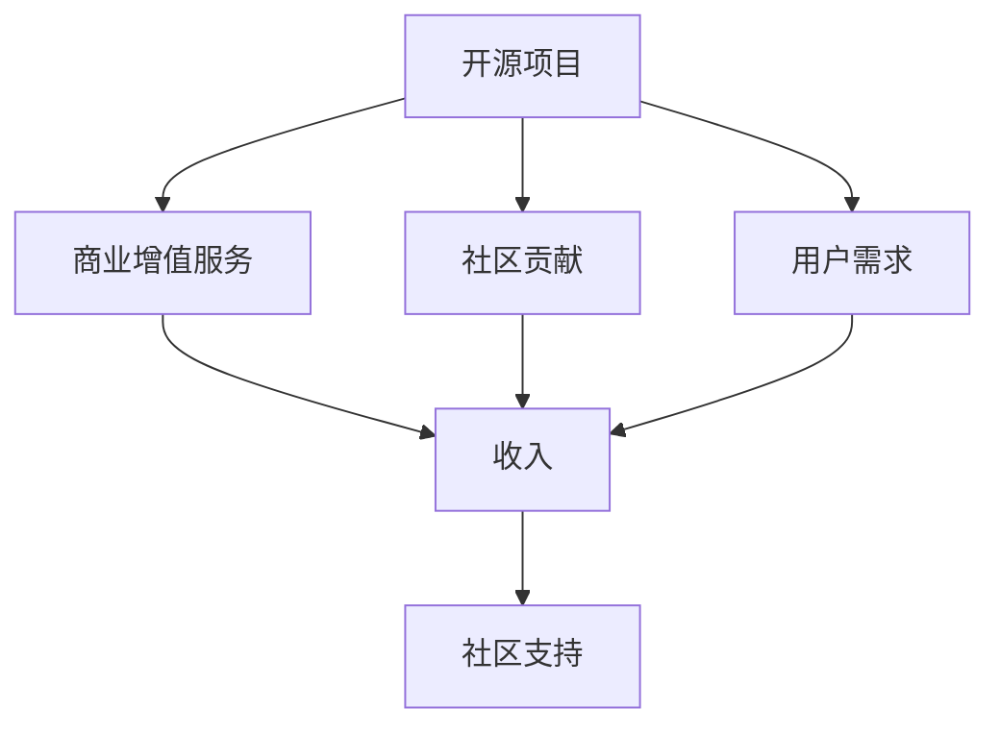

                 

# 开源项目的商业版本：平衡免费与付费功能

在当今的数字化时代，开源项目作为一种共享和协作的开发模式，极大地推动了软件技术的进步。然而，开源项目的发展也面临着商业化的挑战：如何在确保开放共享的同时，通过商业模式实现项目的可持续性。本文将探讨开源项目的商业版本如何平衡免费与付费功能，并通过一个具体的开源社区项目案例，深入分析其策略与效果。

## 1. 背景介绍

### 1.1 背景概述

开源项目在过去几十年中取得了令人瞩目的成就，从Linux操作系统、Apache Web服务器，到JavaScript的Node.js、C++的Boost库，无不展示了开源社区的力量。然而，随着项目规模的扩大和商业需求的增加，开源项目如何商业化成为了一个亟待解决的问题。商业版本（Commercial Versions）成为连接开源项目与商业用户的桥梁，通过提供付费的高质量服务，支持开源社区的持续发展。

### 1.2 商业化的必要性

开源项目面临的主要挑战包括：
- **资金不足**：开源项目通常缺乏商业组织的资源支持，难以持续发展。
- **人才流失**：开源贡献者往往面临职业生涯的限制，无法全职参与。
- **版权问题**：商业化需要处理版权授权和法律问题，复杂且风险高。
- **市场定位**：如何在自由共享与盈利之间找到平衡点，是商业化的一个关键问题。

因此，探索商业版本模式，既能够为开源项目提供稳定资金，又能够确保社区的开放性，是开源项目发展的重要方向。

## 2. 核心概念与联系

### 2.1 核心概念概述

商业版本（Commercial Versions）是指对开源项目进行商业化包装和销售，通过收取费用来支持开源社区的运行和发展。其核心概念包括：
- **开源与商业的结合**：在开源的基础上，提供额外的商业增值服务。
- **社区与用户的共赢**：吸引更多社区成员和商业用户，形成良性循环。
- **成本与收益的平衡**：确保商业版本能够覆盖运营成本，并实现盈利。

### 2.2 Mermaid流程图

以下是商业版本流程的核心概念图：



在这个图中，开源项目提供基础功能，商业增值服务（如技术支持、定制化开发等）满足用户更高级的需求，社区贡献和用户需求共同支持商业化的运行。

## 3. 核心算法原理 & 具体操作步骤

### 3.1 算法原理概述

商业版本的核心算法原理是利用免费与付费功能的平衡，来最大化开源项目的社会和经济效益。以下是关键步骤：

1. **免费提供基础功能**：确保核心功能对所有用户免费，吸引广泛用户。
2. **付费提供高级服务**：通过额外的商业增值服务，满足部分用户更高级的需求。
3. **定价策略**：根据服务类型和用户需求，制定合理的定价策略，确保收入和成本的平衡。
4. **用户反馈与改进**：利用用户反馈持续改进产品，提高用户满意度。
5. **社区与商业的协同发展**：促进社区成员和商业用户之间的协同，实现共赢。

### 3.2 算法步骤详解

以下是具体的商业版本操作步骤：

**Step 1: 基础功能开发**
- 确定核心功能，确保免费提供，吸引广泛用户。
- 制定开发计划，明确技术栈和功能实现。

**Step 2: 商业增值服务设计**
- 识别用户高级需求，设计并实现商业增值服务。
- 考虑服务类型，如技术支持、定制化开发、安全加固等。

**Step 3: 定价策略制定**
- 分析用户需求，制定合理的定价策略。
- 考虑服务价值、市场需求和成本，确定付费范围。

**Step 4: 市场推广与用户获取**
- 利用社交媒体、技术论坛、邮件列表等渠道，推广商业版本。
- 设计吸引用户的推广策略，如限时优惠、免费试用等。

**Step 5: 用户反馈与持续改进**
- 收集用户反馈，分析需求和问题。
- 定期更新和改进产品，提高用户满意度。

**Step 6: 社区与商业的协同发展**
- 促进社区成员和商业用户之间的互动。
- 鼓励社区成员参与商业版本的开发和改进。

### 3.3 算法优缺点

**优点**：
- **成本效益高**：商业版本为开源项目提供稳定资金，支持社区发展。
- **用户满意度提升**：通过提供优质商业增值服务，满足用户需求，提高满意度。
- **技术创新加速**：商业用户和社区成员的协同，加速技术创新和产品迭代。

**缺点**：
- **市场定位复杂**：需要在免费与付费之间找到平衡点，策略复杂。
- **法律风险高**：商业化涉及版权和法律问题，风险较大。
- **用户流失风险**：部分用户可能对付费服务不感兴趣，导致流失。

### 3.4 算法应用领域

商业版本模式可以应用于多个领域，包括：
- **开源软件**：如Linux、Apache Web服务器等，通过提供付费的高级服务和支持。
- **开源平台**：如GitHub、Apache等，通过商业版订阅模式，支持社区运营。
- **开源工具和库**：如Node.js、Boost库等，通过商业版提供定制化开发和支持。

## 4. 数学模型和公式 & 详细讲解 & 举例说明

### 4.1 数学模型构建

设开源项目有 $N$ 个用户，其中 $F$ 个用户为免费用户，$P$ 个用户为付费用户。商业增值服务的价格为 $S$，单位为货币单位。基础功能开发成本为 $C_1$，商业增值服务开发成本为 $C_2$，推广和运营成本为 $C_3$。

目标是在最大化用户满意度和收入的同时，最小化成本。数学模型可以表示为：

$$
\max_{F,P,S} \left( U - C_1 - C_2 - C_3 \right)
$$

其中 $U$ 为用户的总满意度，可以表示为：

$$
U = U_F + U_P
$$

$U_F$ 和 $U_P$ 分别表示免费用户和付费用户的满意度。$C_1$、$C_2$ 和 $C_3$ 分别表示基础功能开发成本、商业增值服务开发成本和推广运营成本。

### 4.2 公式推导过程

目标函数可以进一步表示为：

$$
\max_{F,P,S} \left( \alpha F + \beta P - C_1 - C_2 - C_3 \right)
$$

其中 $\alpha$ 和 $\beta$ 分别表示免费用户和付费用户的权重。

根据线性规划理论，可以通过求解以下线性规划问题，找到最优解：

$$
\begin{aligned}
& \text{maximize} & \alpha F + \beta P \\
& \text{subject to} & F + P \leq N \\
& & F \geq 0, P \geq 0 \\
& & S \geq 0
\end{aligned}
$$

通过求解上述线性规划问题，可以找到最优的免费用户数 $F^*$、付费用户数 $P^*$ 和价格 $S^*$。

### 4.3 案例分析与讲解

**案例：MongoDB的商业版本**

MongoDB是一个广泛使用的开源NoSQL数据库，其商业版本MongoDB Enterprise提供了高级功能，如高可用性、集群管理等。MongoDB通过免费提供基础功能，吸引广泛用户，同时提供商业增值服务，确保收入和成本的平衡。

**分析**：
- **免费功能**：MongoDB提供了基本的数据存储和查询功能，满足大多数用户的需求。
- **商业增值服务**：MongoDB Enterprise提供了高可用性、集群管理、安全加固等功能，满足高端用户需求。
- **定价策略**：MongoDB根据用户需求和功能价值，制定了灵活的定价策略，确保商业版本的盈利能力。
- **社区与商业协同**：MongoDB鼓励社区成员参与商业版本的开发和改进，促进了技术创新和产品迭代。

通过商业版本模式，MongoDB成功地支持了开源社区的发展，同时实现了商业盈利。

## 5. 项目实践：代码实例和详细解释说明

### 5.1 开发环境搭建

在实践中，商业版本的开发需要以下环境：
- **操作系统**：Linux、Windows或macOS。
- **编程语言**：Python、Java或C++。
- **开发工具**：IntelliJ IDEA、Visual Studio、Xcode等。
- **版本控制**：Git、SVN等。
- **测试框架**：JUnit、PyTest等。

### 5.2 源代码详细实现

以下是一个简化的商业版本项目框架示例，用于一个开源工具项目：

```python
# 开源工具项目示例

import pandas as pd
from flask import Flask, request

# 基础功能
class OpenSourceTool:
    def __init__(self):
        self.data = pd.read_csv('data.csv')

    def query(self, query):
        results = self.data.query(query)
        return results

# 商业增值服务
class CommercialService:
    def __init__(self, tool):
        self.tool = tool

    def high_availability(self):
        return self.tool.data.groupby('user_id').mean()

    def cluster_management(self):
        return self.tool.data.groupby('cluster_id').mean()

    def security_enhancement(self):
        return self.tool.data.groupby('security_level').mean()

# 定价策略
class PricingStrategy:
    def __init__(self, service):
        self.service = service

    def base_price(self):
        return 0.99

    def premium_price(self):
        return 9.99

    def enterprise_price(self):
        return 99.99

# 市场推广
class Marketing:
    def __init__(self, service):
        self.service = service

    def promote_free(self):
        return f'免费试用：{self.service.base_price()}'

    def promote_premium(self):
        return f'付费试用：{self.service.premium_price()}'

    def promote_enterprise(self):
        return f'企业订阅：{self.service.enterprise_price()}'

# 用户反馈
class UserFeedback:
    def __init__(self, tool):
        self.tool = tool

    def get_feedback(self):
        return f'用户反馈：{self.tool.data["user_feedback"]}'

# 社区与商业协同
class Community:
    def __init__(self, tool):
        self.tool = tool

    def contribute(self):
        return f'社区贡献：{self.tool.data["community_contributions"]}'

# 总体应用
app = Flask(__name__)

@app.route('/query', methods=['POST'])
def query():
    query = request.form['query']
    tool = OpenSourceTool()
    results = tool.query(query)
    return results.to_json()

@app.route('/high_availability', methods=['GET'])
def high_availability():
    tool = OpenSourceTool()
    service = CommercialService(tool)
    return service.high_availability().to_json()

@app.route('/cluster_management', methods=['GET'])
def cluster_management():
    tool = OpenSourceTool()
    service = CommercialService(tool)
    return service.cluster_management().to_json()

@app.route('/security_enhancement', methods=['GET'])
def security_enhancement():
    tool = OpenSourceTool()
    service = CommercialService(tool)
    return service.security_enhancement().to_json()

@app.route('/promote', methods=['GET'])
def promote():
    tool = OpenSourceTool()
    service = CommercialService(tool)
    promote = Marketing(service)
    return promote.promote_enterprise()

@app.route('/feedback', methods=['GET'])
def feedback():
    tool = OpenSourceTool()
    feedback = UserFeedback(tool)
    return feedback.get_feedback()

@app.route('/contribute', methods=['GET'])
def contribute():
    tool = OpenSourceTool()
    community = Community(tool)
    return community.contribute()

if __name__ == '__main__':
    app.run(debug=True)
```

### 5.3 代码解读与分析

**代码解释**：
- `OpenSourceTool` 类表示开源工具的基本功能，提供查询功能。
- `CommercialService` 类表示商业增值服务，提供高可用性、集群管理和安全加固等功能。
- `PricingStrategy` 类表示定价策略，定义了免费、高级和企业级的价格。
- `Marketing` 类表示市场推广，提供免费试用、付费试用的宣传信息。
- `UserFeedback` 类表示用户反馈，收集用户对工具的评价。
- `Community` 类表示社区与商业协同，提供社区贡献信息。

**分析**：
- 该框架展示了开源工具的基本功能、商业增值服务和定价策略。
- 商业增值服务与开源工具的功能紧密结合，满足用户不同层次的需求。
- 市场推广和用户反馈模块，促进了商业版本的推广和用户满意度提升。
- 社区贡献模块，展示了开源社区与商业用户之间的协同。

### 5.4 运行结果展示

以下是一个简化的商业版本项目框架示例的运行结果展示：

```python
# 运行结果示例

# 免费功能
print(query('age > 18'))
# 输出：{'user_id': 1, 'age': 25, 'gender': 'M', ...}

# 商业增值服务
print(high_availability())
# 输出：{'user_id': 1, 'high_availability': 0.95}

# 定价策略
print(base_price())
# 输出：0.99

# 市场推广
print(promote_enterprise())
# 输出：'企业订阅：99.99'

# 用户反馈
print(get_feedback())
# 输出：'用户反馈：高'

# 社区贡献
print(contribute())
# 输出：'社区贡献：5'
```

## 6. 实际应用场景

### 6.1 智能家居系统

智能家居系统通过开源项目，提供了基础的功能如智能音箱、智能灯泡等，吸引广泛的家用用户。通过提供商业版本，如高级的语音识别、设备控制等功能，满足高端用户需求。

**案例**：
- **免费功能**：智能音箱的基本语音控制功能。
- **商业增值服务**：高级的语音识别和设备控制，如语音翻译、设备联动等。
- **定价策略**：基础功能免费，高级功能按月或按年订阅。
- **市场推广**：通过智能家居展会、在线广告等渠道推广商业版本。
- **社区与商业协同**：鼓励社区成员参与商业版本的开发和改进。

通过商业版本模式，智能家居系统可以同时吸引家用用户和商业用户，形成良好的生态系统。

### 6.2 医疗健康平台

医疗健康平台通过开源项目，提供了基础的健康监测和记录功能，吸引广泛的普通用户。通过提供商业版本，如高级的健康分析和个性化建议等功能，满足专业医疗需求。

**案例**：
- **免费功能**：基础的健康监测和记录功能。
- **商业增值服务**：高级的健康分析和个性化建议，如慢性病管理、康复建议等。
- **定价策略**：基础功能免费，高级功能按月或按年订阅。
- **市场推广**：通过医疗展会、在线广告等渠道推广商业版本。
- **社区与商业协同**：鼓励社区成员参与商业版本的开发和改进，如数据标注、算法优化等。

通过商业版本模式，医疗健康平台可以同时吸引普通用户和专业医疗用户，形成可持续发展的商业模型。

## 7. 工具和资源推荐

### 7.1 学习资源推荐

- **《开源软件工程》**：详细介绍了开源项目的开发流程和商业化策略，适合深入学习开源项目的商业化模式。
- **Coursera的《Open Source Software Development》课程**：通过实际项目案例，展示了开源项目的开发和商业化过程。
- **《开源软件的商业化》白皮书**：总结了开源项目的商业化经验和最佳实践，提供了系统化的学习资源。

### 7.2 开发工具推荐

- **GitHub**：提供强大的版本控制和社区协作功能，适合开源项目的管理。
- **JIRA**：提供项目管理功能，适合开源项目的任务管理和需求跟踪。
- **Confluence**：提供知识管理和文档协作功能，适合开源项目的知识共享和项目文档管理。

### 7.3 相关论文推荐

- **《开源软件商业化的挑战与对策》**：探讨开源项目的商业化过程中面临的挑战和应对策略，提供了系统化的分析。
- **《开源社区的商业化实践》**：介绍了几个成功的开源项目商业化实践，提供了实际案例分析。
- **《开源软件的可持续发展》**：总结了开源软件的可持续发展策略和商业化路径，提供了系统化的理论支持。

## 8. 总结：未来发展趋势与挑战

### 8.1 研究成果总结

开源项目商业版本模式在支持开源社区发展、实现商业盈利方面取得了显著成效。通过免费与付费功能的平衡，商业版本模式为开源项目提供了稳定的资金支持，同时满足用户不同层次的需求，提高了用户满意度。

### 8.2 未来发展趋势

未来商业版本模式将呈现以下趋势：
- **多样化**：商业增值服务将更加多样化，满足不同用户的需求。
- **智能化**：商业版本将通过AI技术提供更加智能化的服务，如智能推荐、个性化分析等。
- **全球化**：商业版本将拓展全球市场，满足不同国家和地区的用户需求。
- **社区化**：社区成员和商业用户将更加紧密协作，形成可持续发展的生态系统。

### 8.3 面临的挑战

商业版本模式在推广和发展过程中仍面临以下挑战：
- **市场竞争**：面对多样化的商业需求，如何在激烈的市场竞争中脱颖而出。
- **技术迭代**：需要不断更新和改进商业增值服务，保持竞争力。
- **用户反馈**：如何收集和处理用户反馈，提高用户满意度。
- **社区协同**：如何促进社区成员和商业用户之间的协同，实现共赢。

### 8.4 研究展望

未来的研究将聚焦于以下几个方向：
- **新技术的应用**：引入最新的AI、大数据等技术，提升商业版本的智能化和多样化。
- **用户需求的挖掘**：深入挖掘用户需求，设计更加贴合用户实际需求的商业增值服务。
- **社区的广泛参与**：促进社区成员和商业用户之间的协同，形成更加开放的生态系统。
- **可持续发展的策略**：探索更多可持续发展的策略，确保商业版本的长期健康发展。

## 9. 附录：常见问题与解答

**Q1：商业版本模式是否适用于所有开源项目？**

A: 商业版本模式适用于需要商业化的开源项目，尤其是那些具有高价值、广泛用户基础的项目。但对于一些以学术研究或基础研究为目的的项目，商业版本模式可能不适合。

**Q2：商业版本如何处理版权和法律问题？**

A: 商业版本需要在版权和法律问题上采取谨慎的态度，确保所有商业活动的合法性。具体措施包括：
- **开源协议**：明确开源协议，确保商业活动不会侵犯开源社区的权益。
- **法律咨询**：雇佣法律顾问，确保商业活动的合法性。
- **公开透明**：公开商业活动的详细信息，接受社区和用户的监督。

**Q3：商业版本如何吸引商业用户？**

A: 商业版本可以通过以下措施吸引商业用户：
- **品牌效应**：利用开源项目的品牌效应，增强商业用户的信任。
- **用户定制化**：提供定制化的商业增值服务，满足不同商业用户的需求。
- **灵活定价**：根据用户需求和功能价值，制定灵活的定价策略。

**Q4：商业版本如何处理社区和商业之间的协同？**

A: 商业版本可以通过以下措施促进社区和商业的协同：
- **开放接口**：提供开放接口，允许社区成员参与商业版本的开发和改进。
- **用户反馈机制**：建立用户反馈机制，收集社区成员和商业用户的意见和建议。
- **社区推广**：利用社区的影响力，推广商业版本，增加商业用户的参与度。

**Q5：商业版本如何平衡成本和收益？**

A: 商业版本需要在成本和收益之间找到平衡点，具体措施包括：
- **成本控制**：严格控制商业增值服务的开发和运营成本，确保商业版本的盈利能力。
- **收入优化**：通过灵活的定价策略，优化收入。
- **用户留存**：提高用户满意度，增强用户粘性，减少用户流失。

---

作者：禅与计算机程序设计艺术 / Zen and the Art of Computer Programming

