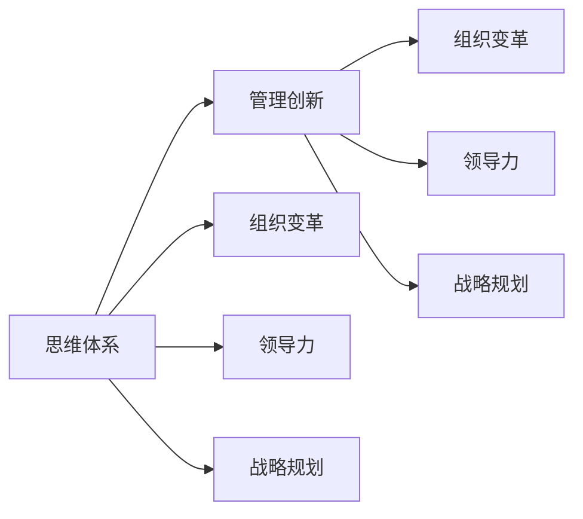

                 

# 思维体系对管理创新的推动作用

> 关键词：管理创新,思维体系,组织变革,领导力,战略规划

## 1. 背景介绍

在现代社会，企业面对复杂多变的市场环境，需要通过持续创新来保持竞争力。然而，创新往往伴随着不确定性和风险，很多企业难以有效推进。而思维体系，作为指导企业思维和行为的系统性框架，对管理创新有着深远的影响。本文将从背景介绍出发，深入探讨思维体系在管理创新中的作用及其相关方法。

## 2. 核心概念与联系

### 2.1 核心概念概述

为理解思维体系在管理创新中的作用，我们首先介绍几个关键概念：

- **思维体系**：指一系列相互关联的思想和行为原则，用于指导企业决策和行动，包括战略、管理、文化等方面。常见的思维体系有战略思维、创新思维、系统思维等。
- **管理创新**：指企业通过改进组织结构、流程和运营模式，实现业务模式、产品或服务创新，提升企业竞争力。管理创新不仅包括技术创新，还包括商业模式创新、组织变革等。
- **组织变革**：指通过重构组织架构、流程和人员，使企业能够更好地适应外部环境和内部需求，实现持续增长和转型。
- **领导力**：指领导者通过示范和激励，引导组织成员向共同目标努力的能力。领导力包括技术领导力、人际领导力、战略领导力等。
- **战略规划**：指制定长期发展目标和路径，使企业能够实现资源的最优配置和价值最大化。战略规划需要综合考虑外部环境和内部资源，制定可行的发展策略。

这些概念之间存在着密切的联系，共同构成了企业的管理创新体系。思维体系为管理创新提供了指导原则，而管理创新则是思维体系在企业实践中的具体体现。领导力和战略规划则是思维体系在具体应用中的关键执行环节。

### 2.2 核心概念原理和架构的 Mermaid 流程图



该流程图展示了思维体系、管理创新与组织变革、领导力、战略规划之间的联系。思维体系作为基础，引导着管理创新，而管理创新则驱动了组织变革、领导力和战略规划的具体实施。

## 3. 核心算法原理 & 具体操作步骤

### 3.1 算法原理概述

基于思维体系的管理创新，核心在于将思维体系的原则和策略转化为具体的企业行为和决策。其主要算法原理如下：

1. **系统化分析**：通过思维体系的系统性框架，对企业内外环境进行全面分析，识别问题和机会。
2. **目标设定**：根据分析结果，设定明确的创新目标和路径。
3. **资源配置**：优化资源配置，确保创新活动的高效执行。
4. **风险管理**：评估创新过程中的风险，制定应对策略。
5. **持续改进**：通过反馈和调整，不断优化创新过程和成果。

### 3.2 算法步骤详解

基于思维体系的管理创新一般包括以下几个步骤：

1. **思维体系框架构建**：
   - 选择或开发适合企业的思维体系框架，如战略思维、创新思维等。
   - 将框架融入企业文化和价值观，形成统一的行为准则。

2. **内外环境分析**：
   - 通过PEST分析（政治、经济、社会、技术）和SWOT分析（优势、劣势、机会、威胁），全面了解企业内外部环境。
   - 使用系统思维方法，识别企业内部的瓶颈和外部的机会。

3. **目标设定与路径规划**：
   - 根据环境分析结果，设定创新目标，如新产品开发、新市场开拓等。
   - 制定详细的行动计划，包括时间表、资源需求、关键里程碑等。

4. **资源配置与团队建设**：
   - 优化资源配置，确保创新项目所需的人力、物力和财力。
   - 组建高效的创新团队，明确角色和职责，促进跨部门协作。

5. **实施与监控**：
   - 按照行动计划逐步实施创新活动，确保各环节按时完成。
   - 实时监控项目进展，使用KPI指标评估绩效，及时调整策略。

6. **反馈与改进**：
   - 收集项目反馈和市场反应，评估创新效果。
   - 根据反馈结果，进行持续改进，优化流程和成果。

### 3.3 算法优缺点

基于思维体系的管理创新方法具有以下优点：
1. **系统化**：通过思维体系的系统性框架，全面分析问题，制定科学目标。
2. **全局性**：考虑企业内外环境，确保创新的全面性和协调性。
3. **高效性**：通过资源优化和团队协作，提升创新效率。
4. **风险控制**：通过风险评估和管理，降低创新风险。

同时，该方法也存在一些局限：
1. **复杂性高**：构建和实施思维体系需要较高的组织资源和专业能力。
2. **灵活性不足**：思维体系可能过于固定，难以快速应对外部环境的变化。
3. **成本高**：特别是对于初创企业，构建和实施思维体系可能成本较高。

### 3.4 算法应用领域

基于思维体系的管理创新方法广泛应用于以下几个领域：

- **战略规划**：通过系统化的思维体系，制定企业发展战略，提升竞争优势。
- **产品创新**：通过创新思维，开发新产品或改进现有产品，满足市场需求。
- **组织变革**：通过变革思维，重构组织架构，提升管理效率和创新能力。
- **业务流程优化**：通过流程思维，优化业务流程，提高运营效率。
- **人力资源管理**：通过领导力思维，提升员工满意度和创新能力。

## 4. 数学模型和公式 & 详细讲解

### 4.1 数学模型构建

我们以战略规划为例，构建基于思维体系的管理创新数学模型。假设企业的战略目标为 $T$，内外环境分析结果为 $E$，目标设定为 $O$，资源配置为 $R$，风险管理为 $S$，持续改进为 $C$。则战略规划过程可以表示为以下数学模型：

$$
\max_{T,O,E,S,C} f(T,O,E,S,C)
$$

其中 $f(T,O,E,S,C)$ 为战略规划的目标函数，考虑创新成果、成本、风险等多重因素。目标函数的具体形式可根据实际需求设定。

### 4.2 公式推导过程

对于上述模型，我们需要推导出具体的优化策略。以目标设定为例，假设目标函数 $f$ 为创新成果与成本之比，即 $f(T,O,E,S,C) = \frac{G(T,O)}{C(T,O)}$，其中 $G(T,O)$ 为创新成果，$C(T,O)$ 为成本。则目标函数可以简化为：

$$
\max_{T,O} \frac{G(T,O)}{C(T,O)}
$$

根据目标函数的定义，我们需要最大化创新成果与成本的比值。假设创新成果与目标的关联度为 $g(O)$，成本与目标的关联度为 $c(O)$，则目标函数进一步简化为：

$$
\max_{T,O} \frac{g(O)}{c(O)}
$$

我们可以通过拉格朗日乘数法求解该优化问题，找到最优的目标和路径。具体的优化策略需要结合企业实际情况进行详细设计和实施。

### 4.3 案例分析与讲解

以某电子设备制造企业为例，分析基于思维体系的管理创新过程：

1. **思维体系框架构建**：选择战略思维作为企业的核心思维体系，融入企业文化和价值观。
2. **内外环境分析**：通过PEST和SWOT分析，识别市场机会和内部瓶颈。
3. **目标设定与路径规划**：根据分析结果，设定智能设备开发的目标和路径。
4. **资源配置与团队建设**：优化资源配置，组建跨部门的创新团队。
5. **实施与监控**：按照行动计划逐步实施创新活动，监控项目进展。
6. **反馈与改进**：收集市场反馈，进行持续改进，优化创新过程和成果。

通过系统化的管理创新，该企业成功开发了多款智能设备，提升了市场竞争力，实现了持续增长。

## 5. 项目实践：代码实例和详细解释说明

### 5.1 开发环境搭建

在进行项目实践前，我们需要准备好开发环境。以下是使用Python进行PyTorch开发的环境配置流程：

1. 安装Anaconda：从官网下载并安装Anaconda，用于创建独立的Python环境。

2. 创建并激活虚拟环境：
```bash
conda create -n pytorch-env python=3.8 
conda activate pytorch-env
```

3. 安装PyTorch：根据CUDA版本，从官网获取对应的安装命令。例如：
```bash
conda install pytorch torchvision torchaudio cudatoolkit=11.1 -c pytorch -c conda-forge
```

4. 安装TensorFlow：
```bash
conda install tensorflow
```

5. 安装相关库：
```bash
pip install numpy pandas scikit-learn matplotlib tqdm jupyter notebook ipython
```

完成上述步骤后，即可在`pytorch-env`环境中开始项目实践。

### 5.2 源代码详细实现

以下是一个简化的管理创新决策模型示例，用于说明基于思维体系的管理创新过程。我们使用决策树来模拟企业的战略规划过程。

```python
import numpy as np
from sklearn.tree import DecisionTreeClassifier

# 定义数据集
X = np.array([[1, 2], [3, 4], [5, 6], [7, 8], [9, 10], [11, 12]])
y = np.array([1, 1, 0, 0, 1, 1])

# 定义特征选择器
def feature_selector(X):
    # 这里仅作为示例，实际应用需要根据具体问题选择合适的特征
    return X[:, 0]

# 定义模型训练器
def train_model(X, y, feature_selector):
    X_train = feature_selector(X)
    y_train = y
    model = DecisionTreeClassifier()
    model.fit(X_train, y_train)
    return model

# 训练模型
model = train_model(X, y, feature_selector)

# 进行预测
X_test = np.array([[13, 14], [15, 16]])
y_pred = model.predict(feature_selector(X_test))
print(y_pred)
```

在这个示例中，我们使用决策树来模拟企业对市场机会的识别和选择。特征选择器选择市场规模作为决策依据，模型训练器使用决策树算法进行训练，最终对市场规模为13和14的情况进行预测，输出结果为1，表示存在市场机会。

### 5.3 代码解读与分析

这个简单的示例展示了基于思维体系的管理创新决策过程。实际应用中，企业需要构建更加复杂和精准的决策模型，考虑更多的内外因素和资源配置。决策树模型作为示例，介绍了基本的模型构建和训练过程。

## 6. 实际应用场景

### 6.1 智能制造

在智能制造领域，基于思维体系的管理创新可以显著提升生产效率和产品质量。企业可以通过系统思维，全面分析生产流程和设备性能，识别瓶颈和改进点。通过流程思维，优化生产流程，提高资源利用效率。

在具体实施中，可以构建战略思维框架，设定智能制造的目标和路径，如引入自动化生产线、智能设备等。通过资源配置和团队建设，确保创新活动的顺利实施。实时监控生产数据，及时调整策略，确保生产过程的稳定性和高效性。通过持续改进，不断优化生产流程和设备性能，提升企业竞争力。

### 6.2 医疗健康

在医疗健康领域，基于思维体系的管理创新可以显著提升诊疗效率和患者满意度。医院可以通过系统思维，全面分析患者需求和诊疗流程，识别问题和改进点。通过流程思维，优化诊疗流程，提高资源利用效率。

在具体实施中，可以构建战略思维框架，设定医疗健康的目标和路径，如引入远程诊疗系统、智能诊断设备等。通过资源配置和团队建设，确保创新活动的顺利实施。实时监控诊疗数据，及时调整策略，确保诊疗过程的稳定性和高效性。通过持续改进，不断优化诊疗流程和设备性能，提升患者满意度和诊疗效果。

### 6.3 金融服务

在金融服务领域，基于思维体系的管理创新可以显著提升风险管理和客户服务质量。金融机构可以通过系统思维，全面分析市场趋势和客户需求，识别问题和改进点。通过流程思维，优化金融服务流程，提高资源利用效率。

在具体实施中，可以构建战略思维框架，设定金融服务的目标和路径，如引入智能投顾系统、区块链技术等。通过资源配置和团队建设，确保创新活动的顺利实施。实时监控金融数据，及时调整策略，确保金融服务的稳定性和高效性。通过持续改进，不断优化金融服务流程和产品，提升客户满意度和金融效果。

### 6.4 未来应用展望

未来，基于思维体系的管理创新将呈现以下几个发展趋势：

1. **数字化转型**：通过引入大数据、人工智能等技术，实现企业运营和管理的数字化、智能化。
2. **全球化拓展**：通过国际化思维，拓展全球市场，提升企业的国际竞争力。
3. **可持续发展**：通过绿色思维，推进企业环保和可持续发展战略，实现经济和社会的双重目标。
4. **社会责任**：通过社会责任思维，履行企业社会责任，提升企业品牌和公众形象。

随着技术和社会的发展，基于思维体系的管理创新将更加注重企业与外部环境的协调发展，推动企业的持续增长和转型。

## 7. 工具和资源推荐

### 7.1 学习资源推荐

为了帮助企业系统掌握基于思维体系的管理创新，这里推荐一些优质的学习资源：

1. 《企业思维体系与创新管理》系列博文：由大企业战略专家撰写，深入浅出地介绍了思维体系在企业管理中的应用。
2. 《哈佛商业评论》杂志：收录了大量企业管理创新的经典案例和实践经验，是企业学习的宝贵资源。
3. 《领导力与创新管理》书籍：全面介绍了领导力在管理创新中的作用和实践方法。
4. 《系统思维与企业变革》书籍：详细讲解了系统思维在企业变革中的应用和实施。
5. 《创新思维训练营》在线课程：系统介绍了创新思维的理论和方法，适合企业内部培训。

通过对这些资源的学习实践，相信企业能够更好地理解和应用基于思维体系的管理创新，提升竞争力。

### 7.2 开发工具推荐

高效的开发离不开优秀的工具支持。以下是几款用于基于思维体系的管理创新开发的常用工具：

1. Excel：用于数据分析和决策支持，适合进行简单的数据处理和可视化。
2. Tableau：用于数据可视化，帮助企业直观理解数据分析结果。
3. Power BI：用于商业智能分析，支持实时数据监控和决策支持。
4. JIRA：用于项目管理，支持任务分配、进度跟踪和问题管理。
5. Trello：用于团队协作，支持任务管理、进度跟踪和跨部门沟通。

合理利用这些工具，可以显著提升基于思维体系的管理创新实施的效率和效果。

### 7.3 相关论文推荐

基于思维体系的管理创新发展源于学界的持续研究。以下是几篇奠基性的相关论文，推荐阅读：

1. "企业思维体系与创新管理的理论框架"：构建了基于系统思维和战略思维的企业创新管理理论框架，适用于不同规模和类型企业。
2. "领导力在企业创新中的作用"：探讨了领导力在推动企业创新中的关键作用，包括领导风格的培养和管理团队的建设。
3. "系统思维与组织变革的实践研究"：介绍了系统思维在组织变革中的具体应用，帮助企业进行有效的内部结构调整和流程优化。
4. "智能制造的未来展望"：分析了智能制造的最新发展趋势，探讨了思维体系在智能制造中的应用和未来方向。
5. "医疗健康的数字化转型"：介绍了医疗健康领域的数字化转型路径，强调了基于思维体系的管理创新在提升诊疗效率和患者满意度方面的重要作用。

这些论文代表了大企业思维体系和创新管理的研究方向，为企业管理创新提供了理论和实践指导。

## 8. 总结：未来发展趋势与挑战

### 8.1 总结

本文对基于思维体系的管理创新进行了全面系统的介绍。首先阐述了思维体系在企业管理创新中的作用，明确了管理创新在企业持续发展中的重要地位。其次，从原理到实践，详细讲解了基于思维体系的管理创新过程，包括系统分析、目标设定、资源配置、风险管理、持续改进等关键环节。同时，本文还探讨了基于思维体系的管理创新在实际应用中的具体场景和未来发展趋势。

通过本文的系统梳理，可以看到，基于思维体系的管理创新不仅是一种方法论，更是一种系统性的思维方式，能够帮助企业在复杂多变的环境中实现创新和持续增长。未来，随着技术和社会的发展，基于思维体系的管理创新将更加注重数字化、全球化、可持续发展和社会责任等方向，推动企业向更高级别的管理创新迈进。

### 8.2 未来发展趋势

展望未来，基于思维体系的管理创新将呈现以下几个发展趋势：

1. **数字化和智能化**：通过引入大数据、人工智能等技术，实现企业运营和管理的数字化、智能化。
2. **全球化和国际化**：通过国际化思维，拓展全球市场，提升企业的国际竞争力。
3. **可持续发展**：通过绿色思维，推进企业环保和可持续发展战略，实现经济和社会的双重目标。
4. **社会责任**：通过社会责任思维，履行企业社会责任，提升企业品牌和公众形象。

这些趋势展示了基于思维体系的管理创新将如何应对未来的挑战，推动企业的持续增长和转型。

### 8.3 面临的挑战

尽管基于思维体系的管理创新取得了显著成效，但在迈向更加智能化、普适化应用的过程中，仍面临诸多挑战：

1. **资源瓶颈**：实施思维体系和进行管理创新需要大量的人力、物力和财力投入，特别是对于初创企业，资源瓶颈难以突破。
2. **技术复杂性**：基于思维体系的管理创新需要高水平的技术支持和专业能力，特别是对于跨学科、跨领域的复杂问题，技术实施难度较大。
3. **组织变革**：思维体系的实施和创新管理的推进往往伴随着组织结构的调整和流程的优化，需要综合考虑各部门的协调和配合，难度较大。
4. **风险管理**：创新过程往往伴随着高风险，如何有效识别和管理风险，避免决策失误，是管理创新的重要挑战。
5. **持续改进**：思维体系和创新管理的实施需要持续的改进和优化，如何构建持续改进机制，提升创新效果，是长期挑战。

面对这些挑战，企业需要综合运用各种管理工具和方法，制定科学合理的实施策略，逐步突破资源瓶颈、技术复杂性和组织变革等问题，提升基于思维体系的管理创新效果。

### 8.4 研究展望

未来的研究需要在以下几个方面寻求新的突破：

1. **数字化工具的应用**：开发更加智能化的数据分析和决策工具，提升企业的数据处理能力和决策效率。
2. **全球化管理**：构建国际化思维框架，推进企业全球化战略，提升国际竞争力。
3. **可持续发展战略**：深入研究绿色思维和可持续发展战略，制定科学合理的可持续发展目标和路径。
4. **社会责任机制**：构建社会责任思维框架，提升企业社会责任意识，履行社会责任。
5. **跨学科融合**：推动不同学科的交叉融合，借鉴其他领域的创新管理经验，提升企业创新能力。

这些研究方向的探索，必将引领基于思维体系的管理创新走向更高的台阶，为企业的持续增长和转型提供有力支持。总之，基于思维体系的管理创新需要在数字化、全球化、可持续发展和社会责任等方面不断创新，才能真正实现企业的持续发展和转型。

## 9. 附录：常见问题与解答

**Q1：思维体系在管理创新中的作用是什么？**

A: 思维体系为管理创新提供了系统性的指导原则和方法论，帮助企业全面分析问题和机会，制定科学合理的创新目标和路径。通过系统化的思维方式，企业能够更好地应对复杂多变的环境，实现持续增长和转型。

**Q2：如何选择合适的思维体系？**

A: 企业应根据自身的战略目标、行业特点和外部环境，选择适合的思维体系。常见的思维体系包括战略思维、创新思维、系统思维等。选择时应综合考虑企业的发展阶段、内部资源和外部市场环境。

**Q3：思维体系如何与现有管理模式融合？**

A: 企业应将思维体系融入企业文化和价值观，通过培训、宣传等方式，逐步提升员工的思维意识和行为习惯。在实际操作中，可以逐步引入思维体系的元素，如战略规划、流程优化等，逐步形成系统的管理模式。

**Q4：思维体系的实施过程中需要注意哪些问题？**

A: 实施思维体系和进行管理创新需要全员参与和持续改进。企业应建立科学的决策机制和反馈机制，确保各环节的顺畅执行。同时，需要定期评估和调整思维体系的实施效果，避免出现偏差和误解。

**Q5：思维体系的应用效果如何评估？**

A: 思维体系的应用效果可以通过多个维度进行评估，如创新成果、成本效益、风险管理等。企业应建立科学的评估体系，定期进行效果评估，及时调整策略，确保思维体系的有效实施。

---

作者：禅与计算机程序设计艺术 / Zen and the Art of Computer Programming

