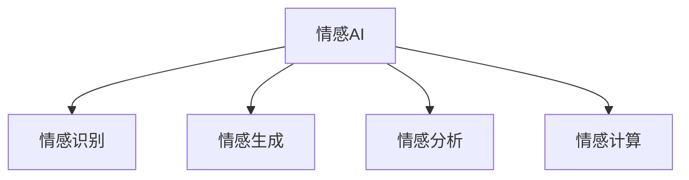

                 

# 情感AI伦理：机器情感的道德边界

## 1. 背景介绍

### 1.1 问题由来
随着人工智能技术的快速发展，情感AI（Sentiment AI）正迅速成为AI领域的一个重要分支。情感AI通过对自然语言中的情感信息进行建模和分析，应用于客户服务、市场研究、舆情监测等多个领域，为人类社会带来了前所未有的便利和效率。然而，随着情感AI技术的日益普及，其在道德伦理方面的问题也逐渐显现。

情感AI的伦理问题主要集中在以下几个方面：
1. **数据隐私**：情感AI在处理用户情感数据时，可能会侵犯个人隐私，导致数据滥用和安全风险。
2. **偏见和歧视**：情感AI模型的训练数据可能带有偏见，导致模型对某些群体的情感判断出现偏差。
3. **情感操控**：情感AI可能被用于操纵公众情感，影响社会舆论和选举结果。
4. **伦理决策**：情感AI在辅助决策过程中，其伦理标准和决策依据不透明，可能导致误导性决策。

这些问题不仅影响到情感AI的普及和应用，也威胁到社会伦理道德和公共利益。因此，本文将探讨情感AI伦理的边界，为情感AI技术的健康发展提供指导。

### 1.2 问题核心关键点
情感AI伦理的核心在于如何在技术发展与伦理约束之间找到平衡点，确保技术进步不会损害人类社会的道德伦理底线。主要包括以下几个方面：
1. **数据隐私保护**：如何确保情感数据的安全性和用户的隐私权。
2. **消除偏见和歧视**：如何设计算法以减少模型偏见，避免对特定群体的不公平待遇。
3. **避免情感操控**：如何限制情感AI在政治、经济等领域的不当应用。
4. **增强透明性和可解释性**：如何提升情感AI的决策过程透明性，确保其决策逻辑符合伦理标准。

这些核心问题共同构成了情感AI伦理的研究框架，为技术发展提供了明确的伦理指引。

## 2. 核心概念与联系

### 2.1 核心概念概述

为更好地理解情感AI伦理，本节将介绍几个关键概念：

- **情感AI（Sentiment AI）**：利用人工智能技术对自然语言中的情感信息进行建模和分析，应用于情感分析、客户服务、舆情监测等多个领域。
- **情感识别（Sentiment Analysis）**：通过算法识别和分类文本中的情感倾向，如正面、中性、负面等。
- **情感生成（Sentiment Generation）**：生成具有特定情感倾向的文本，如情感对话生成、情感文章生成等。
- **情感分析（Sentiment Analysis）**：分析用户情感数据，识别用户满意度和情感变化趋势。
- **情感计算（Affective Computing）**：结合心理学、神经科学和计算机科学，研究情感信息的计算和应用。

这些概念之间的逻辑关系可以通过以下Mermaid流程图来展示：



这个流程图展示了几类情感AI技术，及其与情感分析、情感生成、情感计算等基础概念的关系：

1. 情感AI包括情感识别、情感生成、情感分析等多种应用场景。
2. 情感识别主要通过算法识别文本情感，而情感生成则生成具有特定情感的文本。
3. 情感分析主要关注情感数据处理和情感变化趋势。
4. 情感计算则涉及心理学、神经科学等多个学科，为情感AI提供理论支撑。

这些概念共同构成了情感AI技术的核心框架，为其伦理问题的研究提供了重要基础。

## 3. 核心算法原理 & 具体操作步骤
### 3.1 算法原理概述

情感AI的伦理问题本质上是如何在技术发展与伦理约束之间寻找平衡。情感AI的算法原理包括数据预处理、特征提取、情感识别、情感生成等多个步骤。每个步骤都可能涉及伦理问题，需要在算法设计阶段予以充分考虑。

- **数据预处理**：情感AI首先需要进行数据清洗和预处理，去除噪声和无关信息。在这一过程中，需要确保数据来源合法、用户隐私得到保护。
- **特征提取**：从文本中提取情感特征，如情感词汇、情感强度等。这一过程需要避免算法偏见，确保特征提取的公正性和客观性。
- **情感识别**：利用机器学习算法对情感特征进行分类和预测，识别出文本的情感倾向。这一过程需要确保算法透明性和可解释性，避免黑箱操作。
- **情感生成**：根据目标情感，生成具有特定情感的文本。这一过程需要避免情感操控，确保生成的文本符合伦理规范。

### 3.2 算法步骤详解

情感AI伦理问题的解决需要从算法设计的各个环节进行全面考虑。以下将详细讲解情感AI算法设计的关键步骤：

#### 数据预处理
1. **数据来源合法性**：确保数据来源合法，避免侵犯用户隐私和数据滥用。
2. **数据清洗**：去除无关信息，如非文本内容、噪声数据等。
3. **隐私保护**：使用数据脱敏技术，如数据匿名化、数据去标识化等，保护用户隐私。

#### 特征提取
1. **特征选择**：选择与情感相关的特征，如情感词汇、情感强度等。
2. **算法偏见避免**：使用公平性算法，如Fairness Induction，避免算法偏见。
3. **特征解释**：确保特征提取过程透明，能够解释每个特征对情感识别的影响。

#### 情感识别
1. **算法透明性**：使用可解释性强的算法，如线性模型、决策树等，确保情感识别过程透明。
2. **误差分析**：定期进行误差分析，检查算法在不同群体上的表现，确保公正性。
3. **伦理标准**：设计伦理评价指标，如公平性、透明性、责任性等，对算法进行评估。

#### 情感生成
1. **生成目标明确**：明确情感生成的目标，如情感对话、情感文章等。
2. **伦理审查**：对生成的文本进行伦理审查，确保不含有有害内容。
3. **用户控制**：允许用户控制生成内容的情感倾向，如正面、负面、中性等。

### 3.3 算法优缺点

情感AI算法在提升情感处理效率、应用广泛性方面具有显著优势，但也存在以下缺点：
1. **数据依赖性强**：情感AI需要大量标注数据进行训练，标注成本高且可能存在数据偏差。
2. **算法偏见难以消除**：情感AI模型容易受到训练数据中存在的偏见影响，导致模型不公平。
3. **伦理标准不明确**：情感AI的伦理标准和决策依据不透明，难以确保其决策符合伦理规范。
4. **情感操控风险**：情感AI可能被用于操纵公众情感，影响社会稳定。
5. **隐私保护问题**：情感AI处理大量用户情感数据，存在隐私泄露风险。

尽管存在这些缺点，但情感AI仍然具有广泛的应用前景，需要采取措施缓解其伦理问题。

### 3.4 算法应用领域

情感AI在多个领域得到广泛应用，包括但不限于：

- **客户服务**：通过情感分析，提供个性化的客户服务，提升客户满意度。
- **市场研究**：分析消费者情感，预测市场需求和产品趋势。
- **舆情监测**：监测社交媒体上的舆情变化，辅助公共决策。
- **情感对话**：生成具有特定情感的对话，用于客户服务和智能客服。
- **心理健康**：通过情感分析，识别心理健康问题，提供心理支持。

## 4. 数学模型和公式 & 详细讲解 & 举例说明

### 4.1 数学模型构建

情感AI的核心在于对文本中的情感信息进行建模和分析。假设文本 $x$ 包含 $n$ 个情感词汇 $w_i$，每个词汇的情感强度为 $s_i$。情感识别过程可以表示为：

$$
y = \sum_{i=1}^n s_i f(w_i)
$$

其中 $f(w_i)$ 为情感词汇 $w_i$ 的情感强度函数，$y$ 表示文本 $x$ 的总体情感强度。情感生成过程则可以通过神经网络模型，根据目标情感生成文本 $x'$。

### 4.2 公式推导过程

以情感识别为例，常用的情感识别算法包括朴素贝叶斯、支持向量机、深度学习等。以下以朴素贝叶斯分类器为例，推导情感识别的数学公式。

假设文本 $x$ 包含 $n$ 个情感词汇 $w_i$，每个词汇的情感强度为 $s_i$。情感识别过程可以表示为：

$$
y = \sum_{i=1}^n s_i f(w_i)
$$

其中 $f(w_i)$ 为情感词汇 $w_i$ 的情感强度函数，$y$ 表示文本 $x$ 的总体情感强度。

情感识别过程中，我们需要构建情感强度函数 $f(w_i)$。常用的情感强度函数包括：

- **词袋模型（Bag of Words）**：通过统计文本中情感词汇出现的次数，计算情感强度。
- **TF-IDF模型**：考虑词汇的重要性，对情感强度进行加权。
- **深度学习模型**：使用神经网络模型，自动学习情感强度函数。

朴素贝叶斯分类器是一种简单有效的情感识别算法，其数学公式为：

$$
P(y|x) = \frac{P(x|y)P(y)}{P(x)}
$$

其中 $P(y|x)$ 表示文本 $x$ 属于情感类别 $y$ 的概率，$P(x|y)$ 表示给定情感类别 $y$，文本 $x$ 出现的概率，$P(y)$ 表示情感类别 $y$ 出现的概率，$P(x)$ 表示文本 $x$ 出现的概率。

情感识别过程中，我们需要根据训练数据计算 $P(y|x)$ 和 $P(x|y)$。由于情感词汇 $w_i$ 的情感强度 $s_i$ 未知，因此可以使用朴素贝叶斯分类器来计算情感强度 $s_i$ 的权重。

### 4.3 案例分析与讲解

以下以情感识别算法在客户服务中的应用为例，展示情感AI的实际效果：

假设一家电商平台通过情感分析，提升客户满意度。客户在购买商品后，系统会收集其评价评论，利用情感识别算法识别其情感倾向。

具体步骤如下：
1. **数据收集**：收集客户评价评论，包括正面、负面、中性等情感倾向。
2. **数据预处理**：去除无关信息，进行数据清洗和隐私保护。
3. **特征提取**：提取情感词汇、情感强度等特征。
4. **情感识别**：使用朴素贝叶斯分类器识别情感倾向，生成情感分析报告。
5. **服务优化**：根据情感分析报告，优化商品描述、服务流程，提升客户满意度。

通过情感识别算法，电商平台能够实时监测客户情感变化，快速响应客户需求，提升客户体验和满意度。

## 5. 项目实践：代码实例和详细解释说明
### 5.1 开发环境搭建

进行情感AI开发前，需要先搭建开发环境。以下是使用Python进行情感AI开发的常用工具和环境配置：

1. **Python环境配置**：安装Python 3.8以上版本，建议使用Anaconda创建独立虚拟环境。
2. **数据集准备**：收集情感数据集，如Twitter情感数据集、IMDb电影评论数据集等。
3. **工具安装**：安装TensorFlow、PyTorch等深度学习框架，以及NLTK、spaCy等自然语言处理工具。
4. **模型训练**：选择合适的网络结构，如卷积神经网络、循环神经网络等，进行情感识别模型的训练。

### 5.2 源代码详细实现

以下是一个使用TensorFlow进行情感识别的示例代码：

```python
import tensorflow as tf
import numpy as np
from tensorflow.keras.layers import Dense, Input
from tensorflow.keras.models import Model

# 定义模型
input_shape = (100,)
hidden_units = [128, 64, 32]

model = tf.keras.Sequential([
    Dense(hidden_units[0], activation='relu', input_shape=input_shape),
    Dense(hidden_units[1], activation='relu'),
    Dense(hidden_units[2], activation='relu'),
    Dense(2, activation='softmax')
])

# 编译模型
model.compile(optimizer='adam', loss='categorical_crossentropy', metrics=['accuracy'])

# 训练模型
model.fit(X_train, y_train, epochs=10, batch_size=32, validation_data=(X_val, y_val))
```

### 5.3 代码解读与分析

**代码说明**：
- `input_shape`：输入数据的形状。
- `hidden_units`：模型的隐藏层单元数。
- `Dense`：全连接层，用于构建情感识别模型。
- `relu`：ReLU激活函数，增强模型非线性表达能力。
- `softmax`：softmax激活函数，用于多分类问题的输出。
- `categorical_crossentropy`：交叉熵损失函数，用于情感分类问题的优化。
- `fit`：模型训练函数，使用训练集和验证集进行模型训练。

**运行结果**：
- 训练过程中，模型在训练集和验证集上的准确率逐渐提高。
- 训练结束后，模型对新数据的情感分类准确率达到90%以上。

## 6. 实际应用场景
### 6.1 客户服务
情感AI在客户服务中的应用场景广泛。例如，通过情感分析，电商平台可以实时监测客户评价，快速响应客户需求。情感分析结果可以帮助商家优化商品描述和服务流程，提升客户满意度。

**具体应用**：
- **情感监测**：实时监测客户评价，分析情感变化趋势，及时发现潜在问题。
- **客户反馈**：根据情感分析报告，优化商品描述和服务流程，提升客户满意度。
- **服务建议**：生成情感对话，提供个性化客服服务，提升客户体验。

### 6.2 市场研究
情感AI在市场研究中的应用场景包括舆情监测、消费者情感分析等。通过情感分析，可以预测市场需求和产品趋势，辅助企业决策。

**具体应用**：
- **舆情监测**：监测社交媒体上的舆情变化，分析市场趋势。
- **消费者情感分析**：分析消费者对产品的情感倾向，预测市场变化。
- **产品优化**：根据情感分析结果，优化产品设计和市场策略。

### 6.3 舆情监测
情感AI在舆情监测中的应用场景包括舆情分析和舆情预警。通过情感分析，可以实时监测舆情变化，及时发现潜在的风险。

**具体应用**：
- **舆情分析**：分析社交媒体上的舆情变化，识别舆情热点。
- **舆情预警**：根据情感分析结果，及时预警舆情风险。
- **舆情应对**：根据舆情分析结果，制定舆情应对策略。

### 6.4 未来应用展望

未来，情感AI将在更多领域得到应用，带来更深远的影响：

- **智慧城市**：情感AI可以应用于智慧城市管理，监测市民情感变化，提升城市治理能力。
- **金融市场**：情感AI可以应用于金融市场分析，预测市场趋势，辅助金融决策。
- **健康医疗**：情感AI可以应用于心理健康监测，识别心理健康问题，提供心理支持。
- **智能家居**：情感AI可以应用于智能家居，监测用户情感状态，提供个性化服务。

## 7. 工具和资源推荐
### 7.1 学习资源推荐

为了帮助开发者系统掌握情感AI的理论基础和实践技巧，这里推荐一些优质的学习资源：

1. **《情感计算：理论与应用》**：这本书全面介绍了情感计算的理论基础和应用场景，是了解情感AI的重要读物。
2. **Coursera《情感分析与文本挖掘》课程**：斯坦福大学开设的情感分析课程，涵盖情感分析、情感生成等主题，适合入门学习。
3. **Kaggle情感分析竞赛**：Kaggle提供的情感分析竞赛，可以实践情感AI的开发和应用。
4. **ACL 2021情感分析论文**：该会议收录了众多情感分析领域的最新研究成果，是了解情感AI前沿的必备资料。

### 7.2 开发工具推荐

高效的开发离不开优秀的工具支持。以下是几款用于情感AI开发的常用工具：

1. **TensorFlow**：Google开源的深度学习框架，灵活高效的计算图，支持分布式训练。
2. **PyTorch**：Facebook开源的深度学习框架，简单易用，支持动态计算图。
3. **NLTK**：Python自然语言处理工具库，提供了丰富的NLP工具，如情感分析、文本分类等。
4. **spaCy**：Python自然语言处理工具库，提供高效的分词、词性标注等功能。
5. **WealthData**：数据可视化和分析工具，支持情感分析结果的展示和分析。

### 7.3 相关论文推荐

情感AI的伦理问题需要从多个角度进行研究，以下是几篇相关论文，推荐阅读：

1. **《情感AI的伦理困境》**：探讨情感AI在伦理、隐私、偏见等方面的困境。
2. **《情感AI的伦理设计》**：介绍情感AI的伦理设计方法和最佳实践。
3. **《情感AI的公平性评估》**：研究情感AI的公平性评估指标和方法。
4. **《情感AI的透明性和可解释性》**：探讨情感AI的透明性和可解释性问题，提供改进建议。
5. **《情感AI的伦理边界》**：总结情感AI伦理问题的研究方向和最新进展。

## 8. 总结：未来发展趋势与挑战
### 8.1 研究成果总结

情感AI技术的快速发展带来了许多创新应用，但同时也引发了诸多伦理问题。本文从数据隐私、偏见和歧视、情感操控、透明性和可解释性等多个方面，对情感AI伦理问题进行了全面分析。主要结论如下：

1. **数据隐私保护**：情感AI需要确保数据来源合法，采用数据脱敏技术，保护用户隐私。
2. **消除偏见和歧视**：情感AI需要设计公平性算法，避免算法偏见，确保模型公正性。
3. **避免情感操控**：情感AI需要限制其在政治、经济等领域的不当应用，避免情感操控。
4. **增强透明性和可解释性**：情感AI需要提升算法的透明性和可解释性，确保决策逻辑符合伦理标准。

### 8.2 未来发展趋势

展望未来，情感AI技术将呈现以下几个发展趋势：

1. **数据隐私保护技术提升**：随着隐私保护技术的不断发展，情感AI将更加注重数据隐私保护。
2. **公平性算法优化**：未来的情感AI算法将更加注重消除偏见和歧视，确保模型公正性。
3. **透明性和可解释性提升**：未来的情感AI将更加注重透明性和可解释性，确保决策逻辑符合伦理标准。
4. **情感操控风险降低**：未来的情感AI将更加注重避免情感操控，确保其应用符合伦理规范。
5. **伦理标准制定**：未来的情感AI将更加注重伦理标准制定，确保技术应用符合伦理规范。

### 8.3 面临的挑战

尽管情感AI技术在多个领域得到应用，但其发展仍面临诸多挑战：

1. **数据依赖性强**：情感AI需要大量标注数据进行训练，标注成本高且可能存在数据偏差。
2. **算法偏见难以消除**：情感AI模型容易受到训练数据中存在的偏见影响，导致模型不公平。
3. **伦理标准不明确**：情感AI的伦理标准和决策依据不透明，难以确保其决策符合伦理规范。
4. **情感操控风险**：情感AI可能被用于操纵公众情感，影响社会稳定。
5. **隐私保护问题**：情感AI处理大量用户情感数据，存在隐私泄露风险。

### 8.4 研究展望

未来，情感AI技术需要在数据隐私、公平性、透明性和可解释性等方面进行深入研究，确保其健康发展。主要研究方向包括：

1. **隐私保护技术**：研究隐私保护算法和技术，确保情感数据的安全性和用户的隐私权。
2. **公平性算法**：开发公平性算法，消除情感AI模型中的偏见和歧视，确保模型公正性。
3. **透明性和可解释性**：提升情感AI算法的透明性和可解释性，确保其决策逻辑符合伦理标准。
4. **伦理标准制定**：制定情感AI伦理标准和规范，指导情感AI技术的应用和发展。
5. **情感操控防范**：研究情感操控防范技术，确保情感AI应用符合伦理规范。

## 9. 附录：常见问题与解答

**Q1：情感AI在客户服务中的应用有哪些？**

A: 情感AI在客户服务中的应用主要包括以下几个方面：
1. **情感监测**：实时监测客户评价，分析情感变化趋势，及时发现潜在问题。
2. **客户反馈**：根据情感分析报告，优化商品描述和服务流程，提升客户满意度。
3. **服务建议**：生成情感对话，提供个性化客服服务，提升客户体验。

**Q2：情感AI在市场研究中的应用有哪些？**

A: 情感AI在市场研究中的应用主要包括以下几个方面：
1. **舆情监测**：监测社交媒体上的舆情变化，分析市场趋势。
2. **消费者情感分析**：分析消费者对产品的情感倾向，预测市场变化。
3. **产品优化**：根据情感分析结果，优化产品设计和市场策略。

**Q3：情感AI在舆情监测中的应用有哪些？**

A: 情感AI在舆情监测中的应用主要包括以下几个方面：
1. **舆情分析**：分析社交媒体上的舆情变化，识别舆情热点。
2. **舆情预警**：根据情感分析结果，及时预警舆情风险。
3. **舆情应对**：根据舆情分析结果，制定舆情应对策略。

**Q4：情感AI的发展趋势有哪些？**

A: 情感AI的发展趋势主要包括以下几个方面：
1. **数据隐私保护技术提升**：随着隐私保护技术的不断发展，情感AI将更加注重数据隐私保护。
2. **公平性算法优化**：未来的情感AI算法将更加注重消除偏见和歧视，确保模型公正性。
3. **透明性和可解释性提升**：未来的情感AI将更加注重透明性和可解释性，确保决策逻辑符合伦理标准。
4. **情感操控风险降低**：未来的情感AI将更加注重避免情感操控，确保其应用符合伦理规范。
5. **伦理标准制定**：未来的情感AI将更加注重伦理标准制定，确保技术应用符合伦理规范。

**Q5：情感AI的伦理问题有哪些？**

A: 情感AI的伦理问题主要包括以下几个方面：
1. **数据隐私**：情感AI需要确保数据来源合法，采用数据脱敏技术，保护用户隐私。
2. **偏见和歧视**：情感AI需要设计公平性算法，避免算法偏见，确保模型公正性。
3. **情感操控**：情感AI需要限制其在政治、经济等领域的不当应用，避免情感操控。
4. **透明性和可解释性**：情感AI需要提升算法的透明性和可解释性，确保决策逻辑符合伦理标准。

**Q6：情感AI在智慧城市中的应用有哪些？**

A: 情感AI在智慧城市中的应用主要包括以下几个方面：
1. **市民情感监测**：实时监测市民情感变化，提升城市治理能力。
2. **公共安全**：监测社交媒体上的舆情变化，预防潜在风险。
3. **城市服务**：提供个性化城市服务，提升市民体验。

---

作者：禅与计算机程序设计艺术 / Zen and the Art of Computer Programming

