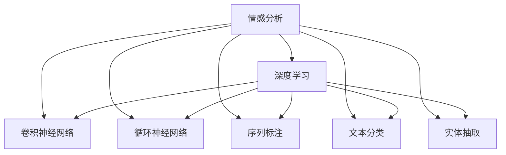

                 

# 情感分析与观点挖掘：深度学习方法

> 关键词：情感分析, 观点挖掘, 深度学习, 卷积神经网络, 循环神经网络, 序列标注, 模型融合, 文本分类, 实体抽取, 应用场景, 挑战与应对

## 1. 背景介绍

### 1.1 问题由来
随着互联网的普及和社交媒体的兴起，人们的交流方式发生了根本变化，文本数据呈指数级增长。在汹涌的文本流中，蕴含着海量的情感信息与观点态度，为社会经济活动提供了重要线索。

情感分析(Sentiment Analysis)和观点挖掘(Opinion Mining)正是在这一背景下兴起的热门领域。它们主要通过文本挖掘、自然语言处理和机器学习技术，自动识别、分类、抽取和量化文本中的情感和观点，为各类决策提供可靠依据。

本文聚焦于深度学习在情感分析与观点挖掘中的应用，从算法原理、操作步骤、数学模型到项目实践，系统介绍了深度学习方法的相关技术。旨在帮助读者深入理解情感分析与观点挖掘的原理与实现，并能够灵活应用到实际场景中。

### 1.2 问题核心关键点
1. **情感分析**：识别文本中的情感倾向(正面、负面、中性)。
2. **观点挖掘**：识别文本中对某事物或行为的观点与态度，包括情感极性、主观性、情感强度等。
3. **深度学习**：利用神经网络模型学习文本的复杂特征，提高情感和观点识别的准确性。
4. **卷积神经网络**：在处理短文本时表现出色，适用于局部特征提取。
5. **循环神经网络**：适合处理长文本，捕捉上下文语义关系。
6. **序列标注**：标注文本序列中每个位置的标签，如实体边界、情感标签等。
7. **模型融合**：将多个模型的输出进行融合，提高整体性能。
8. **文本分类**：将文本分为不同类别，如情感类别、主题类别等。
9. **实体抽取**：从文本中识别出具有实际意义的实体，如人名、地名、机构名等。

通过解决这些问题，可以构建高效、精确的情感和观点分析系统，满足不同应用场景的需求。

## 2. 核心概念与联系

### 2.1 核心概念概述

为更好地理解深度学习方法在情感分析与观点挖掘中的应用，本节将介绍几个关键概念及其相互联系：

- **情感分析**：识别文本的情感倾向，通常分为正面、负面和中性。
- **观点挖掘**：识别文本中对某事物或行为的观点与态度，包括情感极性、主观性、情感强度等。
- **深度学习**：利用多层神经网络模型学习复杂非线性特征，提升情感和观点识别的准确性。
- **卷积神经网络(CNN)**：在处理短文本时表现出色，适合局部特征提取。
- **循环神经网络(RNN)**：适合处理长文本，捕捉上下文语义关系。
- **序列标注(Sequence Labeling)**：标注文本序列中每个位置的标签，如实体边界、情感标签等。
- **文本分类(Text Classification)**：将文本分为不同类别，如情感类别、主题类别等。
- **实体抽取(Entity Extraction)**：从文本中识别出具有实际意义的实体，如人名、地名、机构名等。

这些概念之间的关系可以通过以下Mermaid流程图来展示：



这个流程图展示了情感分析与观点挖掘的不同方面，以及深度学习在其中所起的作用：

1. 情感分析：通过深度学习，识别文本的情感倾向。
2. 卷积神经网络：用于局部特征提取，适用于处理短文本。
3. 循环神经网络：用于捕捉上下文语义关系，适用于处理长文本。
4. 序列标注：标注文本序列中每个位置的标签，如情感标签等。
5. 文本分类：将文本分为不同类别，如情感类别、主题类别等。
6. 实体抽取：从文本中识别出具有实际意义的实体，如人名、地名、机构名等。

这些概念共同构成了情感分析与观点挖掘的技术框架，使得情感和观点分析可以应用到各类文本数据上。

## 3. 核心算法原理 & 具体操作步骤
### 3.1 算法原理概述

深度学习方法在情感分析与观点挖掘中的应用，通常包括以下几个关键步骤：

1. **数据预处理**：清洗、分词、向量化等。
2. **特征提取**：通过卷积神经网络或循环神经网络提取文本特征。
3. **序列标注**：标注文本序列中每个位置的标签，如情感标签等。
4. **文本分类**：将文本分为不同类别，如情感类别、主题类别等。
5. **模型融合**：将多个模型的输出进行融合，提高整体性能。

深度学习方法之所以能够应用于情感和观点分析，主要是因为它们能够自动学习文本中的复杂特征，通过多层神经网络模型捕捉文本的局部和全局特征，从而提高识别的准确性和泛化能力。

### 3.2 算法步骤详解

以情感分析为例，深度学习方法的实现步骤如下：

**Step 1: 数据预处理**
- 收集标注数据，如电影评论、社交媒体评论等。
- 对数据进行清洗，去除无关信息，统一格式。
- 对文本进行分词，如使用jieba、NLTK等工具。
- 将文本转换为向量表示，如使用word2vec、GloVe等词嵌入方法。

**Step 2: 特征提取**
- 使用卷积神经网络(CNN)或循环神经网络(RNN)提取文本特征。
- 定义卷积核的大小和步幅，进行特征提取。
- 使用池化层减少特征维度，降低计算复杂度。

**Step 3: 序列标注**
- 定义情感标签，如正面、负面、中性等。
- 使用序列标注模型，如CRF、Bi-LSTM-CRF等，标注每个位置的情感标签。
- 使用Viterbi算法或Beam Search算法，解码最优的标注序列。

**Step 4: 文本分类**
- 定义情感类别，如正面、负面、中性等。
- 使用文本分类模型，如卷积神经网络(CNN)、循环神经网络(RNN)等，对文本进行分类。
- 使用softmax层输出分类概率，选择概率最大的类别。

**Step 5: 模型融合**
- 使用Bag of Words、Boosting、Stacking等方法，将多个模型的输出进行融合。
- 根据任务需求，选择最优的融合策略，提升整体性能。

### 3.3 算法优缺点

深度学习方法在情感分析与观点挖掘中具有以下优点：

- **自动化特征提取**：能够自动学习文本中的复杂特征，无需手工设计特征。
- **泛化能力强**：通过多层神经网络模型，能够捕捉文本的局部和全局特征，提高识别的准确性和泛化能力。
- **适应性强**：适用于各种文本数据，如新闻、评论、社交媒体等。

同时，这些方法也存在以下局限性：

- **数据依赖**：深度学习方法需要大量的标注数据进行训练，标注成本较高。
- **计算资源消耗大**：神经网络模型参数量大，训练和推理资源消耗较大。
- **过拟合风险**：在大规模文本数据上训练时，容易发生过拟合。

### 3.4 算法应用领域

深度学习方法在情感分析与观点挖掘中的应用领域非常广泛，包括但不限于：

- **社交媒体分析**：分析社交媒体上的情感和观点，评估品牌声誉、用户满意度等。
- **产品评价分析**：分析用户对产品的评价，评估产品质量、用户体验等。
- **市场趋势分析**：分析市场新闻、评论等，预测市场趋势和舆情变化。
- **舆情监控**：监控新闻、评论等，识别负面情感和热点事件。
- **情感广告投放**：根据用户的情感倾向，推荐相应的广告内容。
- **品牌情感分析**：分析用户对品牌的情感倾向，评估品牌形象。
- **舆情风险管理**：识别和应对负面情感和热点事件，提升品牌声誉和市场响应。

以上领域只是深度学习方法在情感分析与观点挖掘中的一部分应用，随着技术的发展和数据的积累，其应用范围将不断扩展。

## 4. 数学模型和公式 & 详细讲解 & 举例说明
### 4.1 数学模型构建

情感分析与观点挖掘的数学模型通常包括以下几个部分：

- **卷积神经网络(CNN)**：用于局部特征提取。
- **循环神经网络(RNN)**：用于捕捉上下文语义关系。
- **序列标注**：标注文本序列中每个位置的标签。
- **文本分类**：将文本分为不同类别。

### 4.2 公式推导过程

以卷积神经网络(CNN)为例，假设输入文本序列为 $X=\{x_1, x_2, ..., x_n\}$，每个单词的嵌入表示为 $\overrightarrow{x_i}$，卷积核大小为 $k$，步幅为 $s$，则卷积层输出的特征图为：

$$
C = [c_1, c_2, ..., c_{n-k+1}]
$$

其中，第 $i$ 个特征图 $c_i$ 表示以 $x_i$ 为中心，大小为 $k$ 的卷积核在文本上的卷积结果。卷积操作的数学表达式如下：

$$
c_i = \sum_{j=1}^{k} w_j \cdot \overrightarrow{x_{i+j-1}}
$$

其中 $w_j$ 表示卷积核的第 $j$ 个权重，通过反向传播算法更新。

### 4.3 案例分析与讲解

以情感分析为例，假设有一篇影评文本："这部电影太垃圾了，演员演得不行，剧情乱，根本不好看。"，我们需要对其进行情感分类。

首先，使用卷积神经网络(CNN)提取文本特征，然后通过softmax层输出情感类别概率。具体实现步骤如下：

1. 对文本进行分词，转换为向量表示。
2. 使用卷积神经网络(CNN)提取文本特征，生成特征图 $C$。
3. 使用softmax层输出情感类别概率，选择概率最大的类别。

假设输出结果为：

$$
P_{\text{负面}} = 0.9, \quad P_{\text{正面}} = 0.1, \quad P_{\text{中性}} = 0.0
$$

则该影评的情感倾向为负面。

## 5. 项目实践：代码实例和详细解释说明
### 5.1 开发环境搭建

在进行情感分析与观点挖掘的深度学习实践前，我们需要准备好开发环境。以下是使用Python进行PyTorch开发的环境配置流程：

1. 安装Anaconda：从官网下载并安装Anaconda，用于创建独立的Python环境。

2. 创建并激活虚拟环境：
```bash
conda create -n pytorch-env python=3.8 
conda activate pytorch-env
```

3. 安装PyTorch：根据CUDA版本，从官网获取对应的安装命令。例如：
```bash
conda install pytorch torchvision torchaudio cudatoolkit=11.1 -c pytorch -c conda-forge
```

4. 安装各类工具包：
```bash
pip install numpy pandas scikit-learn matplotlib tqdm jupyter notebook ipython
```

完成上述步骤后，即可在`pytorch-env`环境中开始项目实践。

### 5.2 源代码详细实现

这里我们以情感分析为例，给出使用PyTorch进行情感分析的代码实现。

首先，定义模型类：

```python
import torch.nn as nn
import torch
import torch.nn.functional as F

class SentimentAnalysisModel(nn.Module):
    def __init__(self, embed_size, num_classes):
        super(SentimentAnalysisModel, self).__init__()
        self.conv1 = nn.Conv1d(embed_size, 64, 3, padding=1)
        self.pool = nn.MaxPool1d(2, 2)
        self.conv2 = nn.Conv1d(64, 128, 3, padding=1)
        self.pool2 = nn.MaxPool1d(2, 2)
        self.fc1 = nn.Linear(128 * (n-3) // 2, 256)
        self.fc2 = nn.Linear(256, num_classes)

    def forward(self, x):
        x = x.view(x.size(0), -1, x.size(1))
        x = self.conv1(x)
        x = F.relu(x)
        x = self.pool(x)
        x = self.conv2(x)
        x = F.relu(x)
        x = self.pool2(x)
        x = x.view(x.size(0), -1)
        x = self.fc1(x)
        x = F.relu(x)
        x = self.fc2(x)
        return F.log_softmax(x, dim=1)
```

然后，定义训练函数：

```python
from torch.utils.data import DataLoader
from tqdm import tqdm

def train_epoch(model, optimizer, train_loader):
    model.train()
    total_loss = 0
    for batch in tqdm(train_loader):
        data, target = batch
        optimizer.zero_grad()
        output = model(data)
        loss = F.nll_loss(output, target)
        loss.backward()
        optimizer.step()
        total_loss += loss.item()
    return total_loss / len(train_loader)

def train(model, train_loader, optimizer, num_epochs):
    model.train()
    total_loss = 0
    for epoch in range(num_epochs):
        loss = train_epoch(model, optimizer, train_loader)
        print(f"Epoch {epoch+1}, train loss: {loss:.3f}")
    return model
```

最后，定义数据处理和模型评估函数：

```python
from sklearn.model_selection import train_test_split
from transformers import BertTokenizer
from transformers import BertForSequenceClassification

def preprocess_data(data):
    texts, labels = data
    tokenizer = BertTokenizer.from_pretrained('bert-base-uncased')
    inputs = tokenizer(texts, return_tensors='pt', padding=True, truncation=True)
    inputs = {key: val.to(device) for key, val in inputs.items()}
    labels = labels.to(device)
    return inputs, labels

def evaluate(model, test_loader):
    model.eval()
    total_loss = 0
    correct = 0
    with torch.no_grad():
        for batch in tqdm(test_loader):
            data, target = batch
            output = model(data)
            loss = F.nll_loss(output, target)
            total_loss += loss.item()
            _, preds = torch.max(output, 1)
            correct += torch.sum(preds == target.data)
    accuracy = correct.item() / len(test_loader.dataset)
    print(f"Test loss: {total_loss / len(test_loader)}, Accuracy: {accuracy:.2f}")
    return model
```

### 5.3 代码解读与分析

让我们再详细解读一下关键代码的实现细节：

**SentimentAnalysisModel类**：
- `__init__`方法：初始化卷积层、池化层和全连接层等组件。
- `forward`方法：定义前向传播过程，先通过卷积层和池化层提取文本特征，再通过全连接层进行分类。

**train_epoch函数**：
- 对每个批次的训练数据进行前向传播和反向传播，更新模型参数。

**train函数**：
- 在多个epoch内重复调用train_epoch函数，计算平均训练损失。

**preprocess_data函数**：
- 将原始文本数据转换为模型所需的输入格式。

**evaluate函数**：
- 在测试集上评估模型性能，计算分类准确率。

**模型训练流程**：
- 首先定义模型和优化器，然后使用train函数进行训练，在每个epoch结束时打印训练损失。
- 在训练结束后，使用evaluate函数评估模型在测试集上的性能。

## 6. 实际应用场景
### 6.1 社交媒体情感分析

社交媒体上的用户评论往往具有情感倾向，分析这些评论可以评估品牌声誉、预测用户行为等。以微博为例，可以收集用户对品牌的评论数据，使用情感分析模型对评论进行分类，识别用户的情感倾向。

具体而言，可以通过爬虫抓取微博上的用户评论，将其转换为向量表示，使用情感分析模型进行分类。对于负面评论，及时进行公关处理，提升品牌声誉。对于正面评论，可以进一步挖掘，识别潜在的客户群体。

### 6.2 产品评价分析

产品评价是用户对产品性能、质量、体验的直接反馈，通过情感分析可以评估产品的优缺点。以电商平台为例，可以收集用户对产品的评论，使用情感分析模型对评论进行分类，识别用户的情感倾向。

具体而言，可以爬取电商平台的商品评论，使用情感分析模型对评论进行分类。对于负面评论，及时进行处理，改进产品性能。对于正面评论，可以进一步分析，挖掘用户的满意度来源。

### 6.3 市场趋势分析

市场新闻和评论是市场趋势的重要指标，通过情感分析可以预测市场趋势和舆情变化。以财经新闻为例，可以收集财经新闻的评论，使用情感分析模型对评论进行分类，识别用户的情感倾向。

具体而言，可以爬取财经新闻网站上的评论，使用情感分析模型对评论进行分类。对于负面评论，及时进行处理，调整市场策略。对于正面评论，可以进一步分析，挖掘市场热点。

## 7. 工具和资源推荐
### 7.1 学习资源推荐

为了帮助开发者系统掌握情感分析与观点挖掘的理论基础和实践技巧，这里推荐一些优质的学习资源：

1. 《深度学习》课程：斯坦福大学开设的深度学习课程，涵盖了深度学习的基本概念和前沿技术，适合初学者入门。
2. 《自然语言处理综述》课程：北京大学开设的自然语言处理课程，涵盖了NLP领域的各个方面，包括情感分析、观点挖掘等。
3. 《情感分析与观点挖掘》书籍：详细介绍了情感分析与观点挖掘的算法原理和实现方法，是相关领域的经典教材。
4. HuggingFace官方文档：提供了丰富的深度学习模型和库，适合开发者快速上手实践。
5. PyTorch官方文档：提供了PyTorch的详细使用说明，适合深度学习开发者进行学习。

通过对这些资源的学习实践，相信你一定能够快速掌握情感分析与观点挖掘的精髓，并能够灵活应用到实际场景中。

### 7.2 开发工具推荐

高效的开发离不开优秀的工具支持。以下是几款用于情感分析与观点挖掘开发的常用工具：

1. PyTorch：基于Python的开源深度学习框架，适合快速迭代研究。
2. TensorFlow：由Google主导开发的开源深度学习框架，生产部署方便，适合大规模工程应用。
3. Keras：基于TensorFlow的高级深度学习框架，易于使用，适合初学者入门。
4. HuggingFace Transformers库：提供了丰富的预训练模型和库，适合开发者进行模型微调。
5. spaCy：自然语言处理库，提供了词法分析、依存句法分析等功能，适合文本预处理。

合理利用这些工具，可以显著提升情感分析与观点挖掘任务的开发效率，加快创新迭代的步伐。

### 7.3 相关论文推荐

情感分析与观点挖掘的发展源于学界的持续研究。以下是几篇奠基性的相关论文，推荐阅读：

1. Attention is All You Need：提出了Transformer结构，开启了NLP领域的预训练大模型时代。
2. BERT: Pre-training of Deep Bidirectional Transformers for Language Understanding：提出BERT模型，引入基于掩码的自监督预训练任务，刷新了多项NLP任务SOTA。
3. A Survey on Sentiment Analysis：总结了情感分析领域的研究进展和应用场景，适合入门者阅读。
4. Opinion Mining and Sentiment Analysis：介绍了观点挖掘和情感分析的基本概念和技术，适合进阶者阅读。
5. Neural Attention with BERT: A Novel Mechanism for Sentence Labeling：提出了基于BERT的注意力机制，提高了情感分析的准确性。

这些论文代表了大语言模型微调技术的发展脉络。通过学习这些前沿成果，可以帮助研究者把握学科前进方向，激发更多的创新灵感。

## 8. 总结：未来发展趋势与挑战
### 8.1 总结

本文对深度学习在情感分析与观点挖掘中的应用进行了全面系统的介绍。首先阐述了情感分析与观点挖掘的研究背景和意义，明确了深度学习方法在其中的独特价值。其次，从算法原理到操作步骤，详细讲解了情感分析与观点挖掘的数学模型和实现方法，给出了代码实例和详细解释说明。同时，本文还广泛探讨了情感分析与观点挖掘在实际场景中的应用，展示了深度学习方法的巨大潜力。最后，本文精选了相关的学习资源、开发工具和研究论文，力求为读者提供全方位的技术指引。

通过本文的系统梳理，可以看到，深度学习在情感分析与观点挖掘中的应用正在不断成熟，为NLP技术落地应用提供了新的思路和方法。未来，伴随深度学习技术的持续发展，情感和观点分析将具备更强的适应性和泛化能力，推动NLP技术向更广泛的应用领域迈进。

### 8.2 未来发展趋势

展望未来，情感分析与观点挖掘技术将呈现以下几个发展趋势：

1. **数据需求降低**：利用预训练模型和迁移学习技术，可以逐步降低对标注数据的需求，提高模型的泛化能力。
2. **计算效率提升**：通过模型压缩、知识蒸馏等技术，提升模型的推理效率，满足实时性需求。
3. **多模态融合**：结合文本、图像、语音等多模态数据，提升情感和观点识别的准确性。
4. **个性化推荐**：结合情感和观点分析结果，进行个性化推荐，提升用户体验。
5. **情感计算**：将情感分析与机器学习、人工智能等技术结合，进行情感计算，推动智能人机交互的发展。
6. **多领域应用**：情感分析与观点挖掘技术将广泛应用于医疗、金融、教育等垂直领域，提升决策效率和质量。

以上趋势凸显了情感分析与观点挖掘技术的广阔前景。这些方向的探索发展，必将进一步提升情感和观点分析系统的性能和应用范围，为社会经济活动带来新的价值。

### 8.3 面临的挑战

尽管深度学习在情感分析与观点挖掘中取得了显著进展，但在迈向更加智能化、普适化应用的过程中，仍面临诸多挑战：

1. **数据质量**：情感和观点数据往往带有主观性和不确定性，数据质量难以保证。
2. **模型泛化**：深度学习模型容易过拟合训练数据，泛化能力不足。
3. **资源消耗**：深度学习模型计算量大，资源消耗大，部署成本高。
4. **伦理道德**：情感和观点分析结果可能涉及个人隐私，需确保数据隐私和安全。
5. **可解释性**：深度学习模型的决策过程难以解释，需提升模型透明性和可解释性。

正视情感分析与观点挖掘面临的这些挑战，积极应对并寻求突破，将是大语言模型微调走向成熟的必由之路。相信随着学界和产业界的共同努力，这些挑战终将一一被克服，情感分析与观点挖掘技术必将在构建智能社会中扮演越来越重要的角色。

### 8.4 未来突破

面对情感分析与观点挖掘所面临的种种挑战，未来的研究需要在以下几个方面寻求新的突破：

1. **数据增强**：结合文本、图像、语音等多模态数据，提升数据质量和多样性。
2. **模型融合**：结合不同的深度学习模型，提升情感和观点识别的准确性。
3. **模型蒸馏**：通过知识蒸馏等技术，提升模型的推理效率，满足实时性需求。
4. **可解释性**：引入可解释性技术，提升模型的透明性和可解释性。
5. **伦理规范**：制定情感和观点分析的伦理规范，保护用户隐私和数据安全。

这些研究方向的探索，必将引领情感分析与观点挖掘技术迈向更高的台阶，为智能社会的发展提供新的动力。面向未来，情感分析与观点挖掘技术还需要与其他人工智能技术进行更深入的融合，如知识表示、因果推理、强化学习等，多路径协同发力，共同推动自然语言理解和智能交互系统的进步。只有勇于创新、敢于突破，才能不断拓展语言模型的边界，让智能技术更好地造福人类社会。

## 9. 附录：常见问题与解答
**Q1：深度学习在情感分析与观点挖掘中的应用是什么？**

A: 深度学习在情感分析与观点挖掘中的应用主要包括以下几个方面：
1. 情感分析：识别文本的情感倾向，通常分为正面、负面和中性。
2. 观点挖掘：识别文本中对某事物或行为的观点与态度，包括情感极性、主观性、情感强度等。
3. 卷积神经网络：用于局部特征提取，适用于处理短文本。
4. 循环神经网络：用于捕捉上下文语义关系，适用于处理长文本。
5. 序列标注：标注文本序列中每个位置的标签，如情感标签等。
6. 文本分类：将文本分为不同类别，如情感类别、主题类别等。
7. 实体抽取：从文本中识别出具有实际意义的实体，如人名、地名、机构名等。

通过深度学习，可以自动化地提取文本中的复杂特征，提高情感和观点识别的准确性和泛化能力。

**Q2：如何选择合适的深度学习模型？**

A: 选择合适的深度学习模型需要考虑以下几个因素：
1. 数据类型：如果文本较短，可以使用卷积神经网络；如果文本较长，可以使用循环神经网络。
2. 任务需求：如果需要进行序列标注，可以使用序列标注模型，如CRF、Bi-LSTM-CRF等；如果需要进行文本分类，可以使用文本分类模型，如卷积神经网络、循环神经网络等。
3. 模型性能：需要根据具体任务需求选择合适的模型，并进行调参优化，以达到最优性能。
4. 计算资源：需要考虑计算资源消耗，选择合适的模型结构和参数。
5. 可解释性：需要考虑模型的可解释性，选择透明性和可解释性高的模型。

选择合适的深度学习模型需要综合考虑任务需求、数据类型、模型性能、计算资源和可解释性等因素，以达到最优的性能和效果。

**Q3：如何缓解深度学习模型的过拟合问题？**

A: 深度学习模型的过拟合问题可以通过以下几种方法缓解：
1. 数据增强：通过对训练数据进行增强，如回译、近义替换等方式，丰富训练集多样性。
2. 正则化：使用L2正则、Dropout、Early Stopping等方法，防止模型过度适应训练数据。
3. 模型蒸馏：通过知识蒸馏等技术，将复杂模型参数压缩为轻量级模型，提升模型的泛化能力。
4. 多模型融合：结合多个模型的输出，进行加权平均或投票，提升模型的鲁棒性和泛化能力。
5. 梯度裁剪：限制梯度的范数，防止模型参数过拟合。

通过以上方法，可以有效缓解深度学习模型的过拟合问题，提升模型的泛化能力和鲁棒性。

**Q4：情感分析与观点挖掘在实际应用中需要注意哪些问题？**

A: 情感分析与观点挖掘在实际应用中需要注意以下几个问题：
1. 数据质量：情感和观点数据往往带有主观性和不确定性，数据质量难以保证，需要进行数据清洗和预处理。
2. 模型泛化：深度学习模型容易过拟合训练数据，泛化能力不足，需要进行模型蒸馏和多模型融合。
3. 计算资源：深度学习模型计算量大，资源消耗大，部署成本高，需要进行模型压缩和优化。
4. 伦理道德：情感和观点分析结果可能涉及个人隐私，需确保数据隐私和安全。
5. 可解释性：深度学习模型的决策过程难以解释，需提升模型的透明性和可解释性。
6. 数据偏差：情感和观点分析结果可能存在数据偏差，需要进行数据校正和平衡。

通过合理处理这些问题，可以有效提升情感分析与观点挖掘的性能和应用效果，为社会经济活动带来新的价值。

通过本文的系统梳理，可以看到，深度学习在情感分析与观点挖掘中的应用正在不断成熟，为NLP技术落地应用提供了新的思路和方法。未来，伴随深度学习技术的持续发展，情感和观点分析将具备更强的适应性和泛化能力，推动NLP技术向更广泛的应用领域迈进。

