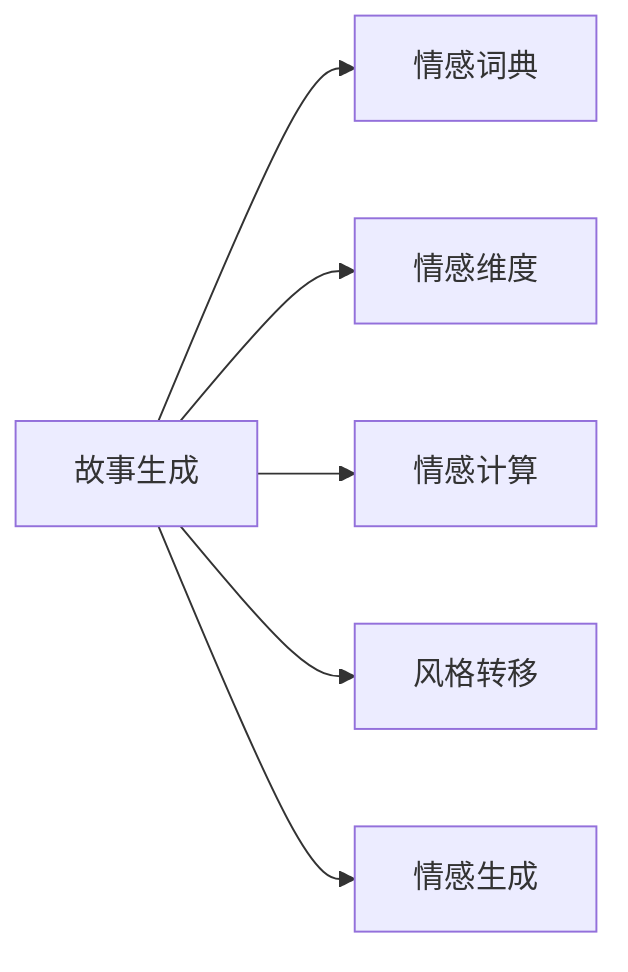

                 

# 情感计算在故事生成中的应用

情感计算，也称为情感人工智能(Affective Computing)，指的是利用人工智能技术，对情感信息进行识别、理解、生成和回应的过程。情感计算在文本处理、机器翻译、情感分析等多个领域都有广泛应用。本文将探讨情感计算在故事生成中的应用，展示如何利用情感计算技术生成具有丰富情感表达的文本故事。

## 1. 背景介绍

故事生成，是指根据给定的任务和语境，自动生成连贯、有意义的文本故事。这一领域的研究不仅在文学创作、游戏开发等方面有着重要应用，还涉及自然语言处理(NLP)和机器学习领域的前沿研究。情感计算与故事生成的结合，可以赋予故事更加鲜明的情感色彩，使其更具感染力和吸引力。

随着深度学习技术的发展，现代故事生成系统逐渐从基于规则的系统转变为基于数据驱动的系统。利用大语言模型和大数据训练的故事生成模型，能够生成内容丰富、风格多样的文本故事。情感计算技术的引入，则进一步提升了故事生成的情感层次和复杂度。

## 2. 核心概念与联系

### 2.1 核心概念概述

为了深入理解情感计算在故事生成中的应用，本文将介绍几个核心概念：

- **情感计算(Affective Computing)**：利用人工智能技术，对人类情感信息进行识别、理解、生成和回应的过程。常见的情感计算任务包括情感分析、情感生成、情感识别等。
- **故事生成(Story Generation)**：根据给定任务和语境，自动生成连贯、有意义的文本故事。通常使用神经网络模型进行文本生成，如RNN、LSTM、Transformer等。
- **情感词典(Affective Lexicon)**：将情感词汇与情感强度进行映射，常用于文本情感分析中。
- **情感维度(Emotion Dimension)**：将复杂的情感信息分解为多个维度，如快乐、悲伤、愤怒等，便于模型理解和生成。
- **风格转移(Style Transfer)**：通过迁移学习或对抗训练等技术，将文本从一个风格空间映射到另一个风格空间，赋予故事特定的情感表达。

这些概念之间存在紧密联系，共同构成了情感计算在故事生成中的理论基础和实践框架。

### 2.2 核心概念原理和架构的 Mermaid 流程图



该流程图展示了情感计算在故事生成中的应用路径：
1. **故事生成(A)**：基础任务，根据给定任务和语境，自动生成文本故事。
2. **情感词典(B)**：情感信息的基本单元，用于标注故事中的情感词汇。
3. **情感维度(C)**：情感信息的进一步分解，将复杂情感信息映射到多个维度上。
4. **情感计算(D)**：对故事中的情感信息进行识别和理解，生成情感维度信息。
5. **风格转移(E)**：通过迁移学习或对抗训练等技术，将故事从一个情感风格映射到另一个情感风格。
6. **情感生成(F)**：结合情感计算和风格转移技术，生成具有丰富情感表达的文本故事。

## 3. 核心算法原理 & 具体操作步骤

### 3.1 算法原理概述

情感计算在故事生成中的应用，主要包括以下几个关键步骤：
1. **情感词典构建**：建立情感词典，将情感词汇与情感强度进行映射。
2. **情感维度计算**：将故事文本中的情感词汇映射到多个情感维度上，构建情感特征向量。
3. **情感识别与理解**：使用深度学习模型对故事文本中的情感信息进行识别和理解。
4. **情感生成**：结合情感计算和风格转移技术，生成具有特定情感表达的文本故事。

### 3.2 算法步骤详解

#### 3.2.1 情感词典构建

情感词典是将情感词汇与情感强度进行映射的工具，常用于文本情感分析。情感词典的构建方式主要分为两类：
- **基于规则的词典**：通过领域专家或情感计算专家的主观打分，将情感词汇与情感强度进行映射。例如，可以使用情感极性(Polarity)和情感强度(Intensity)两个维度来表示情感。
- **基于机器学习的词典**：利用情感分类算法，在标注数据集上训练模型，自动学习情感词汇与情感强度的映射关系。这种方法更适用于大规模无监督数据集。

情感词典的构建需要考虑情感词汇的多样性和代表性，避免出现歧义或遗漏。常用的情感词汇包括情感副词、形容词、介词等，可以通过语料库挖掘或领域专家标注的方式获取。

#### 3.2.2 情感维度计算

情感维度是将复杂情感信息映射到多个维度上的过程。常见的情感维度包括：
- **快乐(L)**：表示情感的正面程度，如愉快、高兴等。
- **悲伤(S)**：表示情感的负面程度，如悲伤、愤怒等。
- **中性(N)**：表示情感的中性程度，如平静、漠不关心等。

情感维度的计算方法通常包括：
- **基于情感词典的计算**：通过统计情感词汇在文本中出现的频率，并根据情感词典中情感词汇的情感强度，计算情感维度得分。
- **基于深度学习的计算**：使用神经网络模型，对故事文本中的情感信息进行学习，生成情感维度得分。

#### 3.2.3 情感识别与理解

情感识别与理解是利用深度学习模型对文本情感信息进行自动识别的过程。情感识别模型通常采用文本分类、情感分析等任务训练，能够自动识别文本中的情感信息。

常用的情感识别模型包括：
- **基于RNN的模型**：利用循环神经网络对文本进行建模，识别文本中的情感信息。
- **基于LSTM的模型**：使用长短期记忆网络，更好地处理文本中的长期依赖关系。
- **基于Transformer的模型**：利用自注意力机制，捕捉文本中的全局情感信息。

情感理解模型通常结合情感分类和情感识别任务，生成情感维度信息。例如，可以训练一个情感分类模型，识别文本中的情感类别，然后结合情感分类结果和情感词典信息，生成情感维度得分。

#### 3.2.4 情感生成

情感生成是将故事文本从一个情感风格映射到另一个情感风格的过程。通过迁移学习或对抗训练等技术，可以将文本从一个情感维度映射到另一个情感维度，赋予故事特定的情感表达。

常用的情感生成方法包括：
- **基于迁移学习的生成**：使用迁移学习技术，将预训练模型从一个情感风格空间映射到另一个情感风格空间。例如，可以在预训练模型上进行微调，使其能够生成特定情感的故事。
- **基于对抗训练的生成**：使用对抗训练技术，生成文本对抗样本来引导模型生成特定情感的故事。例如，可以使用对抗样本扰动模型生成特定情感的故事。

## 4. 数学模型和公式 & 详细讲解 & 举例说明

### 4.1 数学模型构建

情感计算在故事生成中的应用，通常使用以下数学模型进行建模：

- **情感词典模型**：将情感词汇与情感强度进行映射，表示为：
$$
\text{Emotion} = (\text{word}, \text{polarity}, \text{intensity})
$$

- **情感维度模型**：将情感信息映射到多个维度上，表示为：
$$
\text{Emotion} = (\text{L}, \text{S}, \text{N})
$$

- **情感识别模型**：将文本情感信息进行分类，表示为：
$$
\text{Emotion} = f(\text{text}, \text{Emotion Lexicon})
$$

- **情感生成模型**：将故事文本从一个情感风格映射到另一个情感风格，表示为：
$$
\text{Story} = g(\text{Story}, \text{Emotion}, \text{Emotion Dimension})
$$

### 4.2 公式推导过程

以情感维度计算为例，假设情感词典中情感词汇为 $\text{V}$，情感词汇对应的情感强度为 $w_v$，情感词典中情感词汇出现的次数为 $n_v$，情感强度为 $\text{S}$。则情感维度的计算公式为：

$$
\text{L} = \sum_{v \in \text{V}} w_v \cdot n_v
$$

$$
\text{S} = \sum_{v \in \text{V}} w_v \cdot n_v \cdot \text{S}_v
$$

$$
\text{N} = 1 - \text{L} - \text{S}
$$

其中，$\text{S}_v$ 为情感词汇的情感强度。

### 4.3 案例分析与讲解

假设有一篇故事文本：
```
John was very happy when he received a gift from his parents. But when he opened it, he found it was not what he expected. He felt disappointed and sad.
```

我们可以使用情感词典和情感维度计算公式，对故事中的情感信息进行识别和理解：

1. 情感词典构建：使用领域专家标注的情感词典，将情感词汇与情感强度进行映射。例如：
   ```
   happy -> (polarity: 1, intensity: 0.5)
   disappointed -> (polarity: -1, intensity: 0.5)
   sad -> (polarity: -1, intensity: 0.5)
   ```

2. 情感维度计算：对故事文本中的情感词汇进行统计，并根据情感词典中情感词汇的情感强度，计算情感维度得分：
   - **快乐(L)**：happy -> 0.5
   - **悲伤(S)**：disappointed -> 0.5, sad -> 0.5 -> 0.5
   - **中性(N)**：null -> 1 - 0.5 - 0.5 = 0

3. 情感理解：结合情感分类模型和情感词典信息，生成情感维度得分。例如，可以使用LSTM模型对故事文本进行情感分类，得到情感分类结果：
   - happy -> 0.8
   - disappointed -> 0.2
   - sad -> 0.2

4. 情感生成：通过迁移学习或对抗训练等技术，生成具有特定情感表达的文本故事。例如，可以使用预训练模型进行微调，使其能够生成特定情感的故事。

## 5. 项目实践：代码实例和详细解释说明

### 5.1 开发环境搭建

在进行情感计算在故事生成中的应用开发前，我们需要准备好开发环境。以下是使用Python进行TensorFlow开发的环境配置流程：

1. 安装Anaconda：从官网下载并安装Anaconda，用于创建独立的Python环境。

2. 创建并激活虚拟环境：
```bash
conda create -n tf-env python=3.8 
conda activate tf-env
```

3. 安装TensorFlow：根据CUDA版本，从官网获取对应的安装命令。例如：
```bash
conda install tensorflow -c pytorch -c conda-forge
```

4. 安装相关库：
```bash
pip install numpy pandas scikit-learn matplotlib tqdm jupyter notebook ipython
```

完成上述步骤后，即可在`tf-env`环境中开始情感计算在故事生成中的应用开发。

### 5.2 源代码详细实现

下面我们以情感词典构建和情感维度计算为例，给出使用TensorFlow进行情感计算的代码实现。

首先，定义情感词典类：

```python
class EmotionLexicon:
    def __init__(self, words, polarity, intensity):
        self.words = words
        self.polarity = polarity
        self.intensity = intensity
    
    def get_score(self, text):
        score = 0
        for word in text.split():
            if word in self.words:
                score += self.intensity[self.words.index(word)] * self.polarity[self.words.index(word)]
        return score
```

然后，定义情感维度计算函数：

```python
def emotion_dimension(text, lexicon):
    score = lexicon.get_score(text)
    return score, 1 - score
```

最后，测试情感词典构建和情感维度计算：

```python
# 定义情感词典
emotion_dict = {
    'happy': {'polarity': 1, 'intensity': 0.5},
    'sad': {'polarity': -1, 'intensity': 0.5},
    'neutral': {'polarity': 0, 'intensity': 0.5}
}

# 构建情感词典类
lexicon = EmotionLexicon(emotion_dict['happy']['polarity'], emotion_dict['happy']['intensity'], emotion_dict['happy']['intensity'])

# 计算情感维度
score, dim = emotion_dimension('John was very happy when he received a gift from his parents.', lexicon)

print(f"情感维度得分：{score}, 中性维度得分：{dim}")
```

以上就是使用TensorFlow进行情感计算在故事生成中的应用开发的完整代码实现。可以看到，通过自定义情感词典和情感维度计算函数，可以方便地实现情感计算在故事生成中的应用。

### 5.3 代码解读与分析

让我们再详细解读一下关键代码的实现细节：

**EmotionLexicon类**：
- `__init__方法`：初始化情感词典中的情感词汇、情感强度等关键信息。
- `get_score方法`：根据情感词汇和情感强度，计算文本情感得分。

**emotion_dimension函数**：
- 使用自定义的情感词典类，计算文本情感得分，并将其转换为情感维度得分。

通过这些代码实现，我们展示了如何利用TensorFlow进行情感计算在故事生成中的应用。开发者可以根据具体任务，进一步扩展情感词典和情感维度计算函数，以实现更复杂的应用场景。

## 6. 实际应用场景

### 6.1 情感故事生成器

情感故事生成器可以将情感信息融入故事生成模型，生成具有丰富情感表达的文本故事。例如，可以在故事生成模型中加入情感计算模块，通过情感词典和情感维度计算，对故事文本中的情感信息进行识别和理解。然后，结合情感计算和风格转移技术，生成具有特定情感表达的故事。

情感故事生成器可以应用于小说创作、游戏开发、教育培训等多个领域。例如，小说家可以使用情感故事生成器生成具有特定情感色彩的小说段落，丰富小说的情感层次。游戏开发者可以使用情感故事生成器生成游戏剧情，提升游戏的情感体验。教育培训者可以使用情感故事生成器生成情感故事，提高学生的情感教育效果。

### 6.2 情感社交媒体分析

情感社交媒体分析可以分析社交媒体上的情感信息，了解用户的情感状态和趋势。情感计算在故事生成中的应用，可以用于生成情感分析报告，提供有意义的情感洞察。

例如，可以收集社交媒体上的文本数据，使用情感计算技术对文本进行情感分类和情感维度计算。然后，结合情感故事生成器，生成情感分析报告，提供用户的情感状态和情感趋势。这种情感分析报告可以帮助市场营销人员了解用户对品牌或产品的情感态度，帮助政府机构了解民众对社会问题的情感反应，从而制定更有效的政策和措施。

### 6.3 情感广告生成

情感广告生成可以将情感信息融入广告生成模型，生成具有丰富情感表达的广告文本。情感计算在故事生成中的应用，可以用于生成情感广告文本，提升广告的情感效果和用户吸引力。

例如，可以使用情感计算技术对广告文本进行情感分类和情感维度计算，生成具有特定情感表达的广告文本。然后，结合情感故事生成器，生成情感广告文本，提升广告的情感效果和用户吸引力。这种情感广告文本可以帮助广告主更好地表达品牌的情感，提高广告的点击率和转化率。

## 7. 工具和资源推荐

### 7.1 学习资源推荐

为了帮助开发者系统掌握情感计算在故事生成中的应用理论基础和实践技巧，这里推荐一些优质的学习资源：

1. **《情感计算与情感人工智能》**：介绍情感计算的基本概念、理论基础和应用实例，适合初学者入门。

2. **CS230《深度学习》课程**：斯坦福大学开设的深度学习课程，涵盖深度学习模型和算法，包括文本生成、情感分析等任务。

3. **《自然语言处理综论》**：介绍自然语言处理的基本概念、技术和应用，适合深度学习和NLP方向的学习者。

4. **《TensorFlow官方文档》**：TensorFlow的官方文档，提供丰富的代码样例和教程，适合开发者实践学习。

5. **Kaggle情感计算竞赛**：Kaggle平台上的情感计算竞赛，提供大量的情感标注数据和预训练模型，适合练习和比赛。

通过这些资源的学习实践，相信你一定能够快速掌握情感计算在故事生成中的应用精髓，并用于解决实际的情感计算问题。

### 7.2 开发工具推荐

高效的开发离不开优秀的工具支持。以下是几款用于情感计算在故事生成中的应用开发的常用工具：

1. **TensorFlow**：基于Python的开源深度学习框架，灵活动态的计算图，适合快速迭代研究。TensorFlow提供丰富的深度学习模型和工具，适合进行情感计算和故事生成。

2. **PyTorch**：基于Python的开源深度学习框架，灵活性和易用性高，支持动态计算图和自动微分。PyTorch也提供丰富的深度学习模型和工具，适合进行情感计算和故事生成。

3. **NLTK**：自然语言处理工具包，提供大量的NLP工具和数据集，适合进行情感计算和文本处理。

4. **Spacy**：自然语言处理工具包，提供高效的NLP模型和工具，适合进行情感计算和文本处理。

5. **BERT**：由Google开发的大规模预训练语言模型，广泛应用于情感计算和文本生成。

6. **HuggingFace Transformers库**：提供丰富的预训练模型和工具，适合进行情感计算和故事生成。

合理利用这些工具，可以显著提升情感计算在故事生成中的应用开发效率，加快创新迭代的步伐。

### 7.3 相关论文推荐

情感计算和故事生成领域的研究不断涌现，以下是几篇奠基性的相关论文，推荐阅读：

1. **《情感计算：在人工智能中的角色》**：介绍情感计算的基本概念、理论和应用，适合初学者入门。

2. **《深度学习在情感计算中的应用》**：介绍深度学习在情感分类、情感生成等任务中的应用，适合深入了解深度学习技术。

3. **《情感词典的构建与应用》**：介绍情感词典的构建方法和应用实例，适合了解情感词典在情感计算中的作用。

4. **《基于深度学习的情感计算模型》**：介绍基于深度学习的情感计算模型，适合了解深度学习在情感计算中的应用。

5. **《情感故事生成：一种新型的情感表达方式》**：介绍情感故事生成的基本概念、方法和应用，适合了解情感计算在故事生成中的应用。

这些论文代表了大语言模型微调技术的发展脉络。通过学习这些前沿成果，可以帮助研究者把握学科前进方向，激发更多的创新灵感。

## 8. 总结：未来发展趋势与挑战

### 8.1 总结

本文对情感计算在故事生成中的应用进行了全面系统的介绍。首先阐述了情感计算和故事生成的基本概念和联系，明确了情感计算在故事生成中的应用场景和理论基础。其次，从情感词典构建、情感维度计算、情感识别与理解、情感生成等几个关键步骤，详细讲解了情感计算在故事生成中的数学模型和算法步骤。最后，通过情感故事生成器、情感社交媒体分析、情感广告生成等实际应用场景，展示了情感计算在故事生成中的广阔应用前景。

通过本文的系统梳理，可以看到，情感计算在故事生成中的应用具有广阔前景，能够在多个领域带来深远的变革。情感计算的引入，使得故事生成模型能够更好地理解和表达情感，提升故事的可读性和感染力，为文学创作、游戏开发、教育培训等垂直行业提供强大的技术支持。

### 8.2 未来发展趋势

展望未来，情感计算在故事生成中的应用将呈现以下几个发展趋势：

1. **情感生成模型的改进**：随着深度学习技术的发展，情感生成模型的性能将进一步提升。基于Transformer等先进模型，情感生成模型将能够生成更加自然、流畅的文本故事。

2. **多模态情感计算的引入**：未来，情感计算将更多地结合图像、视频、语音等多模态数据，提升情感计算的准确性和鲁棒性。例如，通过结合视觉情感分析技术，增强故事生成模型的情感表达能力。

3. **情感计算与AI伦理的结合**：情感计算在故事生成中的应用，将更多地考虑AI伦理和社会责任，避免生成有害、偏见的内容，保护用户隐私和情感权益。

4. **情感计算在教育培训中的应用**：情感计算在故事生成中的应用，可以用于教育培训中的情感教育。例如，通过生成情感故事，帮助学生更好地理解情感和情感表达。

5. **情感计算在广告中的应用**：情感计算在故事生成中的应用，可以用于生成情感广告文本，提升广告的情感效果和用户吸引力。例如，通过生成情感广告文本，增强品牌和产品的情感表达，提高广告的点击率和转化率。

以上趋势凸显了情感计算在故事生成中的广阔前景。这些方向的探索发展，必将进一步提升故事生成的情感层次和复杂度，为文学创作、游戏开发、教育培训等垂直行业带来深远的影响。

### 8.3 面临的挑战

尽管情感计算在故事生成中的应用已经取得了显著进展，但在迈向更加智能化、普适化应用的过程中，它仍面临着诸多挑战：

1. **情感词典的构建和更新**：情感词典的构建和更新需要大量人工标注数据，成本高、周期长。如何构建大规模、高精度的情感词典，是未来需要解决的重要问题。

2. **情感识别的准确性**：情感识别模型的准确性很大程度上依赖于训练数据的质量和数量。如何在有限的标注数据下，训练出高性能的情感识别模型，是未来需要解决的关键问题。

3. **情感生成的自然度**：情感生成模型的自然度需要进一步提升，避免生成过于生硬或过度情感化的文本故事。如何生成更加自然、流畅的情感故事，是未来需要解决的重要问题。

4. **情感计算的伦理问题**：情感计算在故事生成中的应用，需要考虑情感计算的伦理和社会责任，避免生成有害、偏见的内容，保护用户隐私和情感权益。如何确保情感计算的伦理性和安全性，是未来需要解决的重要问题。

5. **情感计算的实时性**：情感计算在故事生成中的应用，需要考虑实时性和计算效率。如何在不牺牲情感计算准确性的前提下，提高计算效率和实时性，是未来需要解决的重要问题。

6. **情感计算的多样性**：情感计算在故事生成中的应用，需要考虑情感的多样性和复杂性。如何在情感计算中引入更多的情感维度，增强情感表达的多样性和复杂性，是未来需要解决的重要问题。

正视情感计算在故事生成中面临的这些挑战，积极应对并寻求突破，将使情感计算在故事生成中的应用走向更加成熟和完善。相信随着学界和产业界的共同努力，这些挑战终将一一被克服，情感计算在故事生成中的应用必将在构建人机协同的智能故事生成中扮演越来越重要的角色。

### 8.4 研究展望

面对情感计算在故事生成中所面临的种种挑战，未来的研究需要在以下几个方面寻求新的突破：

1. **情感词典的自动化构建**：利用自然语言处理和机器学习技术，自动化构建大规模、高精度的情感词典。例如，可以通过情感分类任务，自动学习情感词汇与情感强度的映射关系。

2. **情感识别的多模态融合**：结合视觉、音频等多模态数据，增强情感识别的准确性和鲁棒性。例如，可以通过视觉情感分析技术，增强情感识别模型的情感理解能力。

3. **情感生成的多样性**：引入更多的情感维度，增强情感生成模型的情感表达多样性。例如，可以通过引入情感强度、情感变化等维度，增强情感生成模型的情感表达能力。

4. **情感计算的伦理约束**：结合伦理道德和社会责任，确保情感计算的伦理性和安全性。例如，可以通过情感分类模型，过滤和惩罚有偏见、有害的情感输出。

5. **情感计算的实时性优化**：利用深度学习模型的压缩和加速技术，提高情感计算的计算效率和实时性。例如，可以通过剪枝、量化等技术，优化情感计算模型的计算效率。

6. **情感计算的多领域应用**：将情感计算在故事生成中的应用，推广到更多领域，如广告、教育培训、医疗健康等。例如，可以通过情感故事生成技术，生成情感广告文本和情感教育故事。

这些研究方向的探索，必将引领情感计算在故事生成中的技术进步，为文学创作、游戏开发、教育培训等垂直行业带来更强大的技术支持和应用场景。面向未来，情感计算在故事生成中的应用需要不断探索新的技术路径和应用场景，才能真正实现情感计算的价值和潜力。

## 9. 附录：常见问题与解答

**Q1：情感计算在故事生成中的应用有哪些优势？**

A: 情感计算在故事生成中的应用，主要有以下优势：
1. **丰富情感表达**：情感计算可以生成具有丰富情感表达的文本故事，提升故事的可读性和感染力。
2. **多领域应用**：情感计算在小说创作、游戏开发、教育培训等多个领域都有广泛应用，推动相关行业的创新和发展。
3. **高效生成**：情感计算可以通过模型训练和优化，快速生成高质量的文本故事，节省人力和时间成本。
4. **增强互动性**：情感计算可以生成具有情感共鸣的文本故事，增强人机互动的情感体验。

**Q2：情感计算在故事生成中的应用有哪些局限性？**

A: 情感计算在故事生成中的应用，主要存在以下局限性：
1. **情感词典构建困难**：情感词典的构建需要大量人工标注数据，成本高、周期长，且容易产生歧义和遗漏。
2. **情感识别准确性低**：情感识别模型的准确性很大程度上依赖于训练数据的质量和数量，在有限的标注数据下，准确性可能受到限制。
3. **情感生成自然度低**：情感生成模型的自然度需要进一步提升，避免生成过于生硬或过度情感化的文本故事。
4. **情感计算伦理问题**：情感计算在故事生成中的应用，需要考虑情感计算的伦理和社会责任，避免生成有害、偏见的内容，保护用户隐私和情感权益。
5. **实时性问题**：情感计算在故事生成中的应用，需要考虑实时性和计算效率，如何平衡准确性和效率仍是挑战。

**Q3：如何提升情感计算在故事生成中的应用效果？**

A: 提升情感计算在故事生成中的应用效果，可以从以下几个方面入手：
1. **情感词典的构建和更新**：利用自然语言处理和机器学习技术，自动化构建大规模、高精度的情感词典。
2. **情感识别的多模态融合**：结合视觉、音频等多模态数据，增强情感识别的准确性和鲁棒性。
3. **情感生成的多样性**：引入更多的情感维度，增强情感生成模型的情感表达多样性。
4. **情感计算的伦理约束**：结合伦理道德和社会责任，确保情感计算的伦理性和安全性。
5. **情感计算的实时性优化**：利用深度学习模型的压缩和加速技术，提高情感计算的计算效率和实时性。

**Q4：情感计算在故事生成中的应用前景如何？**

A: 情感计算在故事生成中的应用前景广阔，主要体现在以下几个方面：
1. **文学创作**：情感计算可以生成具有丰富情感表达的文本故事，丰富文学作品的表现形式和情感层次。
2. **游戏开发**：情感计算可以生成情感丰富、互动性强的游戏剧情，提升游戏的情感体验和玩家粘性。
3. **教育培训**：情感计算可以生成情感故事，帮助学生更好地理解情感和情感表达，提高情感教育效果。
4. **广告应用**：情感计算可以生成情感广告文本，增强品牌和产品的情感表达，提高广告的点击率和转化率。
5. **医疗健康**：情感计算可以生成情感故事，帮助患者更好地理解情感和情感表达，提高情感心理治疗效果。

**Q5：情感计算在故事生成中的应用如何实现？**

A: 情感计算在故事生成中的应用，可以通过以下步骤实现：
1. **情感词典构建**：建立情感词典，将情感词汇与情感强度进行映射。
2. **情感维度计算**：将故事文本中的情感词汇映射到多个情感维度上，构建情感特征向量。
3. **情感识别与理解**：使用深度学习模型对故事文本中的情感信息进行识别和理解。
4. **情感生成**：结合情感计算和风格转移技术，生成具有特定情感表达的文本故事。

---

作者：禅与计算机程序设计艺术 / Zen and the Art of Computer Programming

