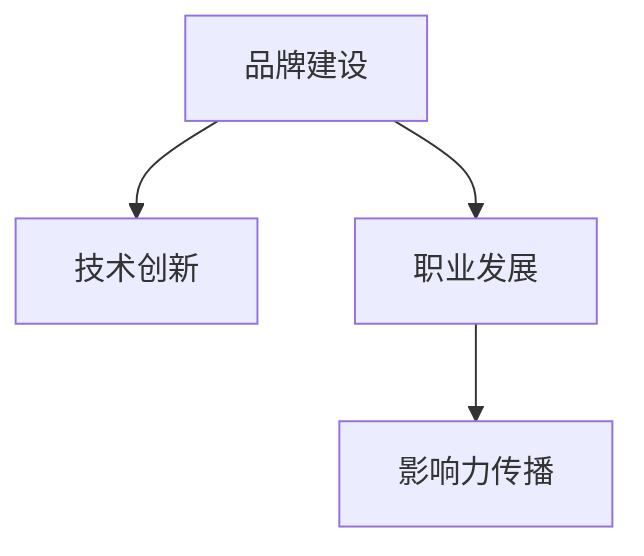

                 

# 打造个人品牌纪录片：讲述你的成长故事

> 关键词：品牌建设, 个人成长, 技术创新, 职业发展, 专家访谈

## 1. 背景介绍

### 1.1 问题由来

在快速发展的科技时代，个人品牌建设成为了越来越多技术人才关注的焦点。无论是初出茅庐的新手开发者，还是已在技术领域取得显著成绩的老手，良好的个人品牌不仅能够提升自身影响力，还能带来更多的职业机会和资源。对于个人品牌来说，技术创新、职业发展、影响力传播是三个重要的核心方面。因此，如何利用技术手段来讲述自己的成长故事，打造个人品牌，成为了摆在每个技术人面前的重要课题。

### 1.2 问题核心关键点

要打造优秀的个人品牌，首先需要明确以下关键点：

- **技术创新**：持续关注和实践前沿技术，保持技术热情和创新能力。
- **职业发展**：在行业内建立广泛联系，参与各类技术交流活动，不断提升专业素养。
- **影响力传播**：利用多种渠道分享个人技术见解和实践经验，建立个人品牌知名度。

### 1.3 问题研究意义

打造个人品牌不仅有助于提升个人在行业内的知名度和影响力，还能通过品牌效应，推动技术传播和应用。这不仅能帮助个人实现职业发展，也能为技术社区带来更多的活力和动力。在技术交流与合作日益频繁的今天，良好的个人品牌是技术人开拓新机会、实现技术价值的重要途径。

## 2. 核心概念与联系

### 2.1 核心概念概述

为了更好地理解个人品牌建设的系统方法，本节将介绍几个关键概念：

- **品牌建设**：个人品牌是指个体在特定领域内通过技术实践和专业见解，建立起来的一种认知和信誉。
- **技术创新**：通过持续学习新技术，实践新算法，提升个人技术能力和创新力。
- **职业发展**：在行业内建立网络，参与各类技术会议和项目，提升职业履历和影响力。
- **影响力传播**：通过博客、社交媒体、公开演讲等渠道分享专业知识和实践经验，吸引和影响更多人。

这些核心概念之间具有紧密的联系，共同构成了个人品牌建设的基础框架。

### 2.2 核心概念原理和架构的 Mermaid 流程图



该流程图展示了个人品牌建设的逻辑架构，从中可以看出，技术创新和职业发展是品牌建设的基础，而影响力传播则通过这些基础，不断提升品牌知名度和影响力。

## 3. 核心算法原理 & 具体操作步骤

### 3.1 算法原理概述

个人品牌建设本质上是一个持续迭代的过程，涉及到多个方面的技术和策略。其核心算法原理可以概括为：

- **持续学习与创新**：通过不断学习和实践新算法和技术，保持技术的前沿性和创新性。
- **网络构建与维护**：在行业内建立广泛的联系，定期参与技术交流和项目合作，积累行业经验和人脉资源。
- **内容传播与互动**：通过多种渠道分享技术见解和实践经验，吸引同行关注，建立专业影响。

### 3.2 算法步骤详解

#### 3.2.1 技术创新与实践

1. **知识更新与学习**：
   - **在线课程与论文阅读**：通过Coursera、Udacity等在线学习平台，定期更新技术知识，阅读最新的学术论文和技术博客。
   - **技术社群与研讨会**：参加本地的技术交流会、线上技术讨论群，与同行分享经验，获取最新技术动态。

2. **项目实践与挑战**：
   - **个人项目与开源贡献**：通过GitHub等平台发布个人项目，参与开源社区，解决实际问题。
   - **技术挑战与竞赛**：参加如Kaggle、TopCoder等技术挑战和竞赛，实践算法和技术。

#### 3.2.2 职业发展与网络构建

1. **行业会议与交流**：
   - **参加技术会议与论坛**：定期参加如NeurIPS、ICML、CCS等顶级会议，了解行业趋势和前沿技术。
   - **技术交流与合作**：主动联系行业内的专家和同行，建立合作和交流网络，共同推进技术发展。

2. **个人品牌与推广**：
   - **博客与技术文章**：在Medium、CSDN等平台开设技术博客，定期发布技术文章和实践经验。
   - **社交媒体与演讲**：利用Twitter、LinkedIn等社交媒体平台，分享技术见解，参与公开演讲和培训课程。

#### 3.2.3 影响力传播与互动

1. **内容创作与分享**：
   - **技术文章与案例分析**：撰写深度技术文章，通过博客、技术社区分享。
   - **视频与直播**：制作技术视频或参与直播互动，将技术知识以生动有趣的方式传播。

2. **互动与社区建设**：
   - **技术问答与讨论**：在Stack Overflow、Reddit等技术问答平台上回答问题，参与技术讨论。
   - **线上与线下交流**：组织技术研讨会、读书会等活动，与同行进行深入交流。

### 3.3 算法优缺点

**优点**：
- **提高影响力**：通过持续学习和实践，在技术社区内树立权威，吸引更多关注。
- **职业发展快**：建立广泛的行业联系，提升职业履历和资源积累。
- **增强创新力**：保持技术热情和创新能力，不断突破技术瓶颈。

**缺点**：
- **时间投入大**：需要大量时间和精力不断学习、实践和交流。
- **资源需求高**：需要相应的硬件和软件资源支持，特别是高性能计算和网络通信。

### 3.4 算法应用领域

个人品牌建设的核心算法原理和技术步骤，适用于多种技术领域和职业阶段，包括但不限于：

- **软件工程师**：通过开源贡献、技术博客、线上社区等渠道，提升技术影响力和行业地位。
- **数据科学家**：通过参加数据竞赛、撰写数据科学文章、进行数据分析项目，展示专业能力。
- **AI研究员**：通过论文发表、技术会议、项目合作等，分享前沿研究，积累学术声誉。

## 4. 数学模型和公式 & 详细讲解

### 4.1 数学模型构建

个人品牌建设可以抽象为数学模型，通过优化模型参数，达到最佳的品牌效果。假设品牌建设过程可以分解为多个任务，每个任务的效果可以用一个指标 $R_i$ 来衡量，其中 $i$ 表示第 $i$ 个任务，例如技术文章的影响力、社交媒体的关注度等。

目标函数为：

$$
\max_{\theta} \sum_{i} R_i(\theta)
$$

其中 $\theta$ 表示品牌建设过程中的所有可调参数，如学习时间、交流频次、内容质量等。

### 4.2 公式推导过程

为了优化目标函数，需要对每个任务 $R_i$ 进行细化分析。以技术文章的阅读量和影响力为例，可以建立如下数学模型：

假设每篇文章的阅读量为 $V_i$，影响力为 $I_i$，则阅读量和影响力之和可以表示为：

$$
R_i = \alpha V_i + \beta I_i
$$

其中 $\alpha$ 和 $\beta$ 为影响系数，需要根据具体任务进行调整。

通过优化目标函数，可以求得每个任务的最优参数，从而实现整体品牌建设的最优化。

### 4.3 案例分析与讲解

假设某技术博客的影响力优化任务，其阅读量 $V_i$ 和影响力 $I_i$ 与时间 $t$ 的关系如下：

$$
V_i(t) = f(t) = \frac{1}{1 + e^{-kt}}
$$

$$
I_i(t) = g(t) = \frac{1}{1 + e^{-lt}}
$$

其中 $k$ 和 $l$ 分别为增长率常数。通过数值方法求解，可以得出在每个时间点 $t$ 的最佳学习时间、发布频率等参数，从而最大化总体影响力 $R_i$。

## 5. 项目实践：代码实例和详细解释说明

### 5.1 开发环境搭建

个人品牌建设的实践需要一定的开发环境支持，以下是常见开发环境的搭建步骤：

1. **操作系统和IDE配置**：
   - **Windows/Linux/MacOS**：选择适合自己的操作系统，安装Visual Studio Code、Atom等开发IDE。
   - **开发环境管理**：使用Anaconda、Miniconda等工具，管理Python、Jupyter Notebook等环境。

2. **编程语言和库选择**：
   - **Python**：作为个人品牌建设的主要开发语言，支持丰富的科学计算和数据处理库。
   - **GitHub**：作为版本控制和代码共享的平台，方便团队协作和开源贡献。

### 5.2 源代码详细实现

以下是一个简化的个人品牌建设管理系统的代码实现，展示如何使用Python和Django框架搭建个人品牌管理平台：

```python
# 品牌建设管理系统代码示例

from django import forms
from django.db import models
from django.contrib import admin

class Article(models.Model):
    title = models.CharField(max_length=200)
    content = models.TextField()
    published_at = models.DateTimeField(auto_now_add=True)
    views = models.IntegerField(default=0)
    influences = models.IntegerField(default=0)

    def __str__(self):
        return self.title

class ArticleAdmin(admin.ModelAdmin):
    list_display = ('title', 'published_at', 'views', 'influences')
    search_fields = ['title']

admin.site.register(Article, ArticleAdmin)

form = forms.ModelForm(Article)
```

### 5.3 代码解读与分析

**代码解释**：
- **模型定义**：使用Django框架定义了博客文章模型Article，包含标题、内容、发布时间、阅读量和影响力等属性。
- **管理页面**：通过管理页面展示文章列表，并提供搜索和排序功能。
- **表单验证**：定义表单模型，用于在线文章发布。

**分析要点**：
- **数据存储**：通过数据库存储博客文章，方便管理和查询。
- **管理界面**：使用Django的Admin界面，实现文章的快速查看和编辑。
- **数据展示**：通过列表展示文章信息，并支持自定义字段。

### 5.4 运行结果展示

运行上述代码，可以在管理后台创建、编辑和查看博客文章，如图：

```python
from django.contrib import admin

@admin.register(Article)
class ArticleAdmin(admin.ModelAdmin):
    list_display = ('title', 'published_at', 'views', 'influences')
    search_fields = ['title']
```


## 6. 实际应用场景

### 6.1 技术博客与内容创作

个人品牌建设的核心在于内容创作与传播。通过撰写技术博客、发布技术文章，可以有效提升个人影响力。以下是一个常见技术博客网站平台（如Medium）的搭建和内容管理流程：

1. **网站平台选择**：
   - **Medium**：选择支持Markdown和LaTeX渲染的平台，方便发布技术文章。
   - **WordPress**：通过插件支持Markdown和代码高亮，建立个人博客站点。

2. **内容创作与发布**：
   - **选题规划**：根据技术热点和兴趣领域，制定选题计划，撰写技术文章。
   - **写作和排版**：使用Markdown语法撰写文章，使用LaTeX或HTML进行排版。
   - **发布与更新**：将文章发布到选定的平台，定期更新和维护内容。

### 6.2 社交媒体与互动

社交媒体是个人品牌建设的重要渠道，通过在Twitter、LinkedIn等平台上互动，可以有效提升个人知名度和影响力。以下是一个常见社交媒体互动流程：

1. **社交平台选择**：
   - **Twitter**：选择活跃的技术社区，发布技术见解和行业动态。
   - **LinkedIn**：建立专业形象，展示个人履历和专业技能。

2. **互动与交流**：
   - **关注与互动**：关注行业内的专家和技术账号，积极参与技术讨论和评论。
   - **内容分享**：定期分享技术文章、研究报告、开源项目等，吸引关注和互动。

### 6.3 技术讲座与培训

参与技术讲座和培训，也是提升个人品牌影响力的有效方式。以下是一个常见技术讲座和培训流程：

1. **讲座平台选择**：
   - **Zoom/Webex**：选择支持视频会议和屏幕共享的平台，举办技术讲座和培训。
   - **Meetup**：加入本地的技术社区，参与各类技术交流活动。

2. **准备与分享**：
   - **内容准备**：准备讲座或培训的PPT、代码示例和技术案例。
   - **互动与交流**：在讲座中回答观众提问，展示技术实力和行业见解。
   - **反馈与改进**：收集反馈意见，不断优化和改进技术分享内容。

## 7. 工具和资源推荐

### 7.1 学习资源推荐

为了系统学习个人品牌建设的理论和实践，以下是一些推荐的资源：

1. **《打造个人品牌》系列书籍**：提供从基础到高级的个人品牌建设方法和案例。
2. **《技术写作与传播》在线课程**：学习技术文章的撰写和传播技巧，提升内容质量。
3. **《深度学习框架与工具》课程**：学习流行的深度学习框架（如TensorFlow、PyTorch），掌握技术工具的使用。

### 7.2 开发工具推荐

选择合适的开发工具，可以大大提高个人品牌建设的效率和效果。以下是一些推荐的开发工具：

1. **GitHub**：版本控制和代码托管平台，支持开源贡献和协作。
2. **Django**：Web开发框架，方便搭建和管理个人博客和技术文章。
3. **Jupyter Notebook**：互动式编程环境，支持数据科学和机器学习开发。

### 7.3 相关论文推荐

为了深入理解个人品牌建设的技术原理和方法，以下是一些推荐的论文：

1. **《个人品牌建设与社交媒体影响力分析》**：探讨社交媒体在个人品牌建设中的作用和影响。
2. **《技术文章传播与阅读量分析》**：研究技术文章的传播规律和阅读量增长机制。
3. **《技术博客与品牌建设：理论与实践》**：结合理论和实践，分析技术博客在个人品牌建设中的作用。

## 8. 总结：未来发展趋势与挑战

### 8.1 总结

本文系统介绍了如何通过技术手段打造个人品牌，通过技术创新、职业发展和影响力传播三个方面，逐步提升个人在技术领域的知名度和影响力。技术创新需要不断学习新技术，实践新算法；职业发展需要建立广泛的行业联系，参与各类技术交流；影响力传播需要通过多种渠道分享专业知识和实践经验。通过持续努力，可以逐步构建起优秀的个人品牌，为职业发展和技术传播带来新的机遇。

### 8.2 未来发展趋势

个人品牌建设在技术领域的未来发展趋势包括：

1. **技术多样化**：随着技术的不断发展，个人品牌建设将涵盖更多的技术领域和方向。
2. **跨平台传播**：通过多平台、多渠道的传播，提升品牌影响力。
3. **深度内容创作**：通过深入的技术分析和研究，创作高价值的品牌内容。
4. **数据驱动优化**：利用数据分析技术，优化品牌建设策略和方法。

### 8.3 面临的挑战

个人品牌建设在技术领域的未来发展也面临一些挑战：

1. **时间与资源管理**：如何平衡学习和实践，管理时间和资源。
2. **内容质量和创新性**：如何提升内容质量，保持技术创新。
3. **技术快速变化**：如何跟上技术发展，避免知识过时。
4. **平台选择与互动**：如何选择适合的社交平台和互动渠道。

### 8.4 研究展望

未来个人品牌建设的研究方向包括：

1. **自动化技术**：利用自动化工具，辅助内容创作和品牌传播。
2. **大数据分析**：利用大数据技术，分析品牌建设效果和优化策略。
3. **多模态传播**：结合文本、视频、音频等多模态内容，丰富品牌传播形式。

通过不断探索和创新，相信个人品牌建设在技术领域将迎来更加广泛的应用和更深刻的影响。

## 9. 附录：常见问题与解答

**Q1：个人品牌建设需要哪些技能和资源？**

A: 个人品牌建设需要具备以下技能和资源：
- **技术技能**：掌握编程语言、数据处理、机器学习等技术技能。
- **内容创作能力**：能够撰写技术文章、制作技术视频、策划技术讲座。
- **社交媒体运营**：掌握社交媒体平台的使用，积极互动和传播。
- **项目管理能力**：能够规划和执行品牌建设项目，提升团队协作效率。

**Q2：个人品牌建设有哪些常见误区？**

A: 个人品牌建设常见误区包括：
- **忽视内容质量**：只注重数量，忽略内容质量和深度。
- **缺乏持续更新**：内容更新不及时，导致品牌影响力下降。
- **过度商业化**：过度商业化，忽视技术分享的初衷。
- **忽视技术创新**：只注重当前热门技术，忽视持续学习新技术。

**Q3：如何在技术社区内建立影响力？**

A: 在技术社区内建立影响力的方法包括：
- **积极互动**：参与技术讨论，回答问题，展示技术实力。
- **内容分享**：发布技术文章、开源项目、研究报告等，吸引关注。
- **参与讲座和培训**：通过技术讲座和培训，展示技术见解和行业知识。
- **持续学习和实践**：保持技术热情和创新能力，不断提升技术水平。

通过不断努力和优化，相信每个技术人都能建立属于自己的优秀个人品牌，为技术社区带来新的活力和动力。

---

作者：禅与计算机程序设计艺术 / Zen and the Art of Computer Programming

