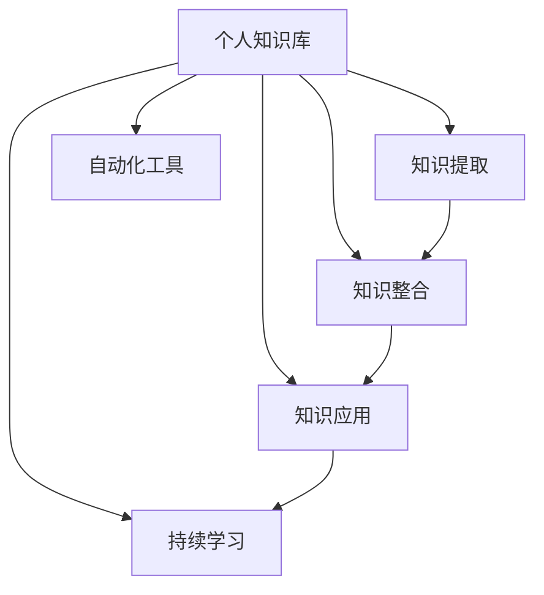

                 

# 打造个人知识库：程序员的财富基石

> 关键词：个人知识库, 程序员, 知识管理, 技能提升, 职业发展

## 1. 背景介绍

在信息爆炸的互联网时代，程序员作为科技创新的核心力量，需要不断学习新知识，掌握新技术，才能在快速变化的市场中保持竞争力。个人知识库作为程序员获取、整理、应用知识的重要工具，对于提升职业素养、优化工作流程、实现职业发展具有不可替代的作用。

### 1.1 问题由来
现代软件开发技术的复杂性和多样性，使得程序员需要管理的海量信息难以驾驭。传统的学习方式如阅读书籍、参加培训课程等，虽然对系统性学习有其价值，但在快速变化的技术环境中，这些方法往往无法满足程序员对即时信息、最新技术的需求。

### 1.2 问题核心关键点
- **信息过载**：程序员需要处理的信息量巨大，如何快速筛选并掌握重要内容是关键。
- **知识碎片化**：知识存储分散，缺乏结构化管理，容易导致信息过载和遗漏。
- **高效应用**：如何将知识库高效应用于日常开发、学习、研究中，是知识管理的重要目标。
- **持续更新**：知识库需要随技术发展不断更新，以保持其时效性和实用性。
- **个性化定制**：根据个人兴趣、职业规划和项目需求，定制化知识库，提升学习效率。

### 1.3 问题研究意义
构建个人知识库不仅有助于程序员高效管理和应用知识，还能加速技能提升和职业发展。它可以帮助程序员：

1. **优化学习路径**：根据个人职业目标，定制个性化学习计划。
2. **提升工作效率**：快速查找和使用所需资料，缩短开发周期。
3. **增强创新能力**：通过跨领域知识融合，激发新的技术灵感。
4. **促进职业发展**：系统化存储个人成果，便于回顾和总结，提升职业竞争力。
5. **提升自我管理**：通过结构化管理时间、任务和项目，实现更高效的工作和生活。

## 2. 核心概念与联系

### 2.1 核心概念概述

为更好地理解如何构建个人知识库，本节将介绍几个核心概念：

- **个人知识库(PKM)**：以个人为中心的知识管理模式，通过结构化存储、分类管理、智能检索等方式，帮助个人高效获取和应用知识。
- **知识提取**：将无结构化信息转化为结构化数据，如将非结构化文本转换成摘要、标签等，方便后续检索和分析。
- **知识整合**：通过逻辑关系、网络图谱等手段，将不同来源的知识进行整合，形成知识网络，便于理解与运用。
- **知识应用**：将知识转化为行动指南、解决方案，应用于实际开发、学习、研究中，解决具体问题。
- **持续学习**：个人知识库需要随时间、项目和技能的不断变化进行更新，保持知识的动态性和时效性。
- **自动化工具**：借助工具和算法，如自然语言处理、机器学习等，自动化管理知识库，提高效率。

这些核心概念之间的逻辑关系可以通过以下Mermaid流程图来展示：



这个流程图展示了个体知识库构建的核心流程和关键步骤：

1. 通过知识提取将信息结构化。
2. 利用知识整合建立知识网络。
3. 将知识应用于实际工作中。
4. 随时间变化不断学习更新知识库。
5. 借助自动化工具提高管理效率。

## 3. 核心算法原理 & 具体操作步骤
### 3.1 算法原理概述

构建个人知识库的核心在于将零散的知识结构化，并通过智能检索和应用工具，高效管理和应用知识。其基本原理可以总结如下：

1. **知识抽取与编码**：使用文本挖掘和自然语言处理技术，将非结构化信息转换为结构化数据。
2. **知识组织与网络化**：通过分类、标签、主题等方式，组织和管理知识库中的内容，形成逻辑关系。
3. **知识检索与导航**：利用搜索算法和知识图谱，快速找到所需信息。
4. **知识应用与执行**：将知识转化为解决问题的具体方案或操作流程。
5. **持续更新与维护**：根据新信息、新技能，定期更新知识库。

### 3.2 算法步骤详解

基于上述原理，构建个人知识库的基本步骤如下：

**Step 1: 知识采集与整理**
- 收集各类文档、代码、笔记、博客、视频等学习资源。
- 使用文本挖掘工具提取文档中的关键词、标签、摘要等信息。
- 按照项目、技术、主题等维度对内容进行分类整理。

**Step 2: 知识存储与管理**
- 选择合适的知识管理工具，如Notion、Evernote、Confluence等。
- 建立分类体系，如技术栈、开发工具、设计模式等。
- 使用标签、目录、页面等方式组织和管理内容。

**Step 3: 知识检索与导航**
- 实现基于关键词、主题、标签等的多维度搜索功能。
- 引入自然语言处理技术，实现语义搜索，提高搜索结果的准确性。
- 使用知识图谱技术，将知识节点化、关系化，便于理解和应用。

**Step 4: 知识应用与执行**
- 将知识转化为具体的开发、学习、研究指南。
- 利用模板、流程、工具等手段，将知识应用于实际工作。
- 定期回顾和总结，形成案例库，记录成功的经验和失败的教训。

**Step 5: 持续更新与维护**
- 定期更新知识库，删除过时内容，补充最新信息。
- 根据个人兴趣和职业规划，持续学习新的知识领域。
- 使用自动化工具，如自动化生成代码文档、自动同步笔记等，提升效率。

### 3.3 算法优缺点

构建个人知识库的方法具有以下优点：
1. **系统化管理**：帮助程序员系统化管理知识和信息，避免信息过载。
2. **高效应用**：快速查找所需信息，提升工作效率。
3. **持续学习**：随技术发展不断更新知识库，保持时效性。
4. **个性化定制**：根据个人兴趣和需求，定制化知识库，提高学习效率。

同时，该方法也存在一定的局限性：
1. **初始成本高**：初期知识整理和系统搭建需要投入大量时间和精力。
2. **工具依赖**：依赖于专业的知识管理工具，初期迁移成本较高。
3. **维护复杂**：知识库需要持续更新和维护，对个人自律性要求较高。
4. **知识获取渠道有限**：对外部高质量学习资源的获取和整合存在一定难度。

尽管存在这些局限性，但总体而言，构建个人知识库是大数据时代程序员提升技能和职业发展的重要手段。

### 3.4 算法应用领域

构建个人知识库不仅适用于软件开发领域，在教育、科研、项目管理等诸多领域也有广泛应用。例如：

- **教育**：构建个性化学习路径，帮助学生系统化掌握知识，提升学习效果。
- **科研**：存储和整合研究资料，便于回顾和分享，加速科研创新。
- **项目管理**：记录项目进展、问题解决、经验总结，提升项目管理效率。
- **市场营销**：整理市场调研、客户反馈、案例分析，支持营销决策。
- **财务管理**：存储财务报表、预算计划、税务政策，支持财务分析。

除了上述这些经典应用外，个人知识库还可拓展到更多场景中，如健康管理、旅游规划、家居设计等，为个人生活提供全方位的支持。

## 4. 数学模型和公式 & 详细讲解 & 举例说明
### 4.1 数学模型构建

本文将使用数学语言对个人知识库的构建过程进行更加严格的刻画。

设程序员的知识库包含 $N$ 个知识点，每个知识点可以用一个元组 $(x_i, y_i, z_i)$ 表示，其中 $x_i$ 为知识点的名称，$y_i$ 为相关标签，$z_i$ 为存储位置。

定义知识库的查询函数为 $q_k$，用于检索包含关键词 $k$ 的知识点。形式化地，知识库的查询函数为：

$$
q_k = \{ (x_i, y_i, z_i) \mid x_i \cap k \neq \emptyset \}
$$

其中 $\cap$ 表示交集操作，即检索包含关键词 $k$ 的知识点。

### 4.2 公式推导过程

假设知识库中共有 $M$ 个标签 $y_j$，知识库的总大小为 $N$，查询函数 $q_k$ 的复杂度为 $O(N \times M)$。如果标签数量 $M$ 较大，查询效率将显著降低。为了提高查询效率，可以引入标签向量 $v_j$ 和权重矩阵 $W$，将标签与查询结果进行向量表示，优化查询过程。

设标签向量 $v_j$ 为 $v_j = (v_{j1}, v_{j2}, ..., v_{jM})$，权重矩阵 $W$ 为 $W = (w_{ij})_{M \times N}$，则知识库的查询函数可以表示为：

$$
q_k = \max_{i} \sum_{j=1}^{M} v_{j} \times W_{ij}
$$

其中 $\max$ 表示取最大值，$\times$ 表示向量点积。通过引入标签向量和权重矩阵，可以将查询复杂度从 $O(N \times M)$ 优化到 $O(N)$。

### 4.3 案例分析与讲解

以技术栈知识库为例，我们假设知识库中共有 10 个标签，每个标签下有若干个知识点。下面通过一个简单的案例来说明如何使用数学模型进行知识库查询。

假设我们要查询关于 "Python" 的知识点，首先定义标签向量 $v_j$ 和权重矩阵 $W$。例如：

$$
v_j = (1, 0, 0, 0, 0, 0, 0, 0, 0, 0)
$$

$$
W_{ij} = 
\begin{bmatrix}
0.8 & 0.5 & 0.2 & 0 & 0 & 0 & 0 & 0 & 0 & 0 \\
0 & 0.2 & 0.5 & 0 & 0 & 0 & 0 & 0 & 0 & 0 \\
0 & 0 & 0 & 0.1 & 0.2 & 0 & 0 & 0 & 0 & 0 \\
0 & 0 & 0 & 0 & 0 & 0 & 0 & 0 & 0 & 0 \\
0 & 0 & 0 & 0 & 0 & 0 & 0 & 0 & 0 & 0 \\
0 & 0 & 0 & 0 & 0 & 0 & 0 & 0 & 0 & 0 \\
0 & 0 & 0 & 0 & 0 & 0 & 0 & 0 & 0 & 0 \\
0 & 0 & 0 & 0 & 0 & 0 & 0 & 0 & 0 & 0 \\
0 & 0 & 0 & 0 & 0 & 0 & 0 & 0 & 0 & 0 \\
0 & 0 & 0 & 0 & 0 & 0 & 0 & 0 & 0 & 0
\end{bmatrix}
$$

则查询函数可以表示为：

$$
q_{Python} = \max_{i} \sum_{j=1}^{M} v_{j} \times W_{ij}
$$

假设 $x_1, x_5, x_7, x_10$ 包含关键词 "Python"，则查询结果为：

$$
q_{Python} = (x_1, y_1, z_1) + (x_5, y_5, z_5) + (x_7, y_7, z_7) + (x_10, y_10, z_10)
$$

通过引入标签向量和权重矩阵，我们可以高效地进行知识库查询，提升知识获取的效率。

## 5. 项目实践：代码实例和详细解释说明
### 5.1 开发环境搭建

在进行知识库构建实践前，我们需要准备好开发环境。以下是使用Python进行开发的环境配置流程：

1. 安装Anaconda：从官网下载并安装Anaconda，用于创建独立的Python环境。

2. 创建并激活虚拟环境：
```bash
conda create -n pkm-env python=3.8 
conda activate pkm-env
```

3. 安装必要的Python库：
```bash
pip install pandas numpy sklearn matplotlib pyyaml beautifulsoup4
```

4. 安装相关工具：
```bash
pip install markdown pdfminer BeautifulSoup4
```

5. 安装数据处理工具：
```bash
pip install pytidy3g googlesearch
```

完成上述步骤后，即可在`pkm-env`环境中开始构建知识库。

### 5.2 源代码详细实现

下面我们以构建技术栈知识库为例，给出使用Python进行知识库构建的完整代码实现。

首先，定义知识库的存储结构：

```python
class KnowledgeBase:
    def __init__(self):
        self.items = []
        self.labels = set()

    def add_item(self, item, label):
        self.items.append((item, label))
        self.labels.add(label)

    def search(self, query):
        results = []
        for item, label in self.items:
            if query in item:
                results.append((item, label))
        return results
```

然后，定义知识库的标签处理函数：

```python
def get_labels(items):
    labels = set()
    for item in items:
        labels.add(item[1])
    return list(labels)
```

接下来，定义知识库的查询函数：

```python
def search_knowledge_base(kb, query):
    results = []
    for item in kb.items:
        if query in item[0]:
            results.append(item)
    return results
```

最后，启动构建知识库的流程：

```python
kb = KnowledgeBase()

# 添加知识库条目
kb.add_item('Python', 'Programming')
kb.add_item('Java', 'Programming')
kb.add_item('C#', 'Programming')
kb.add_item('JavaScript', 'Web Development')
kb.add_item('HTML', 'Web Development')

# 添加标签
labels = get_labels(kb.items)
print(labels)

# 查询知识库
results = search_knowledge_base(kb, 'Programming')
for result in results:
    print(result)
```

这就是使用Python构建技术栈知识库的基本代码实现。可以看到，利用Python的简单数据结构，我们可以轻松构建和管理知识库。

### 5.3 代码解读与分析

让我们再详细解读一下关键代码的实现细节：

**KnowledgeBase类**：
- `__init__`方法：初始化知识库，存储知识点和标签。
- `add_item`方法：添加知识点和标签。
- `search`方法：实现基于关键词的查询，返回包含关键词的知识点。

**get_labels函数**：
- 定义了获取标签的函数，通过遍历知识点获取所有标签。

**search_knowledge_base函数**：
- 实现基于关键词的查询，返回包含关键词的知识点。

**知识库构建流程**：
- 创建KnowledgeBase对象。
- 添加知识库条目，包括知识点和标签。
- 获取所有标签。
- 查询知识库，输出结果。

可以看到，Python提供了简单高效的数据结构和函数库，可以轻松实现知识库的构建和管理。这为程序员构建个人知识库提供了坚实的基础。

当然，实际的开发过程中，我们还需要考虑更多因素，如数据导入、导出、备份等，以及如何结合自动化工具提升效率。但核心的知识库构建逻辑与上述示例类似。

## 6. 实际应用场景
### 6.1 个人学习

个人知识库可以帮助程序员系统化管理学习资源，提升学习效率。例如：

- **课程学习**：将所有在线课程、学习笔记、作业等资料整理到一个知识库中，便于系统化学习。
- **阅读资料**：将各类技术书籍、论文、博客等资料分类存储，快速找到所需信息。
- **技能提升**：根据个人职业目标，定制学习计划，记录学习进展和成果。

### 6.2 项目开发

在项目开发中，个人知识库可以提升代码重用率，加快开发速度。例如：

- **代码文档**：将项目中的代码文档、API文档、测试用例等资料整理到一个知识库中，便于查找和使用。
- **技术栈**：记录项目所需的技术栈、开发工具、框架等资料，快速切换和应用。
- **问题解决**：记录项目开发中遇到的问题、解决方案和总结，提升开发效率。

### 6.3 项目管理

个人知识库可以帮助程序员高效管理项目任务，提升项目管理能力。例如：

- **任务管理**：将项目任务、里程碑、进度等资料分类存储，快速查找和更新任务状态。
- **需求管理**：记录项目需求、用户反馈、需求变更等资料，便于需求跟踪和管理。
- **成果分享**：记录项目成果、技术总结、经验分享等资料，便于团队协作和知识传承。

### 6.4 未来应用展望

随着技术的发展和需求的变化，个人知识库的应用场景将进一步拓展。

- **智能推荐**：利用机器学习算法，根据个人兴趣和行为数据，推荐相关学习资源和项目资料。
- **语音笔记**：通过语音识别技术，将会议记录、电话会议等实时信息快速转换为文本，存储到知识库中。
- **图像笔记**：利用图像识别技术，将项目原型、设计图纸等图片资料转换为结构化信息，存储到知识库中。
- **多模态融合**：结合文本、图像、语音等多种信息源，构建更为丰富的知识体系。

## 7. 工具和资源推荐
### 7.1 学习资源推荐

为了帮助程序员系统掌握个人知识库的构建和管理，这里推荐一些优质的学习资源：

1. **《深入理解知识管理》**：斯坦福大学关于知识管理的经典课程，涵盖知识库构建、信息检索、知识应用等多个方面。
2. **《知识管理与组织》**：Drexel大学开设的知识管理课程，系统讲解了知识库构建和管理的技术和方法。
3. **《知识管理实践指南》**：彼得·F·德鲁克关于知识管理的经典书籍，提供系统化的知识管理策略和实践指导。
4. **《知识管理与创新》**：国际知名的知识管理专家约翰·M·摩根的著作，探讨了知识管理与创新之间的关系。
5. **《知识管理技术与应用》**：李兵教授关于知识管理的系列文章，介绍了多种知识管理工具和应用案例。

通过对这些资源的学习实践，相信你一定能够快速掌握个人知识库构建的方法和技能，并在实际应用中发挥其最大价值。

### 7.2 开发工具推荐

高效的开发离不开优秀的工具支持。以下是几款用于个人知识库构建开发的常用工具：

1. **Notion**：功能强大的知识管理工具，支持文本、表格、卡片等多种内容形式，适合个人和团队使用。
2. **Evernote**：便捷的知识管理工具，支持笔记、标签、笔记本等多种功能，适合移动设备使用。
3. **Confluence**：企业级的知识管理系统，支持文档、标签、空间等多种功能，适合团队协作。
4. **MindMeister**：思维导图工具，适合记录项目规划、知识图谱构建等场景。
5. **Lucidchart**：流程图和图表工具，适合绘制项目流程图、知识图谱等。

这些工具都有强大的功能和丰富的应用场景，可以根据个人需求选择合适的工具。

### 7.3 相关论文推荐

个人知识库的构建和管理涉及多个领域的技术，以下是几篇奠基性的相关论文，推荐阅读：

1. **《个人知识库构建与维护的模型与框架》**：论文提出了基于内容的个人知识库模型，介绍了知识提取、存储、检索、应用等关键技术。
2. **《基于语义的个性化知识推荐》**：论文利用自然语言处理技术，实现基于语义的知识推荐，提升了知识获取的效率和精度。
3. **《知识图谱构建与应用的最新进展》**：论文系统介绍了知识图谱的构建方法和应用场景，为知识库构建提供了重要参考。
4. **《知识管理的未来发展趋势》**：论文探讨了知识管理技术的未来发展方向，为知识库构建提供了新的思路。

这些论文代表了大规模知识库构建技术的最新进展，可以帮助研究者把握学科前进方向，激发更多的创新灵感。

## 8. 总结：未来发展趋势与挑战
### 8.1 总结

本文对构建个人知识库的方法进行了全面系统的介绍。首先阐述了个人知识库的重要性及其在程序员技能提升和职业发展中的作用。其次，从原理到实践，详细讲解了知识库的构建和管理过程，提供了完整的代码实现。同时，本文还广泛探讨了知识库在个人学习、项目开发、项目管理等多个领域的应用前景，展示了知识库构建的巨大潜力。最后，本文精选了知识库构建的相关学习资源、开发工具和论文，力求为读者提供全方位的技术指引。

通过本文的系统梳理，可以看到，构建个人知识库不仅是程序员提升技能和职业发展的重要手段，更是打造智能系统的基石。未来的技术发展，将使得知识库更加智能、高效、灵活，为程序员提供更为强大的知识管理和应用能力。

### 8.2 未来发展趋势

展望未来，个人知识库构建技术将呈现以下几个发展趋势：

1. **智能化**：结合自然语言处理、机器学习等技术，实现智能化的知识推荐、检索和应用。
2. **多模态融合**：结合文本、图像、语音等多种信息源，构建更为丰富的知识体系。
3. **跨领域应用**：知识库的应用场景将进一步拓展到更多领域，如教育、医疗、金融等。
4. **持续更新**：通过自动化工具和算法，持续更新知识库，保持知识的动态性和时效性。
5. **个性化定制**：结合个人兴趣、职业目标和项目需求，定制化知识库，提升学习效率和工作效率。

### 8.3 面临的挑战

尽管个人知识库构建技术已经取得了显著进展，但在实践中仍面临诸多挑战：

1. **初期成本高**：初期知识整理和系统搭建需要投入大量时间和精力。
2. **工具依赖**：依赖于专业的知识管理工具，初期迁移成本较高。
3. **维护复杂**：知识库需要持续更新和维护，对个人自律性要求较高。
4. **知识获取渠道有限**：对外部高质量学习资源的获取和整合存在一定难度。
5. **知识共享和协作**：知识库的跨个人、跨团队共享和协作需要建立标准化的接口和协议。

尽管存在这些挑战，但总体而言，构建个人知识库是大数据时代程序员提升技能和职业发展的重要手段。未来随着技术的发展和应用场景的拓展，这些挑战终将逐步被克服，个人知识库将成为程序员不可或缺的“个人财富”。

### 8.4 研究展望

面向未来，个人知识库构建技术的研究方向如下：

1. **自动化知识管理**：结合自然语言处理、机器学习等技术，实现自动化知识管理，提升效率。
2. **多模态知识融合**：结合文本、图像、语音等多种信息源，构建更为丰富的知识体系。
3. **知识图谱应用**：利用知识图谱技术，提升知识库的检索和应用效率。
4. **跨领域知识应用**：探索知识库在教育、医疗、金融等领域的实际应用。
5. **知识共享与协作**：建立标准化的知识库接口和协议，实现跨个人、跨团队的共享和协作。

这些研究方向将进一步推动个人知识库技术的成熟和应用，为程序员提供更为强大的知识管理和应用能力。

## 9. 附录：常见问题与解答

**Q1：如何高效构建个人知识库？**

A: 高效构建个人知识库需要遵循以下几个步骤：
1. **系统规划**：明确知识库的目标和内容，规划好分类体系和标签体系。
2. **数据采集**：收集各类学习资源、项目资料、笔记等，进行系统化整理。
3. **工具选择**：选择合适的知识管理工具，如Notion、Evernote等，提高管理效率。
4. **知识应用**：将知识库中的内容应用于实际工作，如查找资料、撰写文档、解决问题等。
5. **持续更新**：定期更新知识库，删除过时内容，补充最新信息。

**Q2：如何提升知识库的检索效率？**

A: 提升知识库的检索效率可以通过以下方法：
1. **标签管理**：合理分类和标注知识库内容，建立标签体系。
2. **多维度查询**：引入关键词、标签、主题等多种查询维度，提高检索精度。
3. **知识图谱**：构建知识图谱，通过关系图谱进行检索。
4. **自然语言处理**：利用自然语言处理技术，实现语义搜索。

**Q3：如何实现知识库的跨个人、跨团队共享和协作？**

A: 实现知识库的跨个人、跨团队共享和协作，可以通过以下方法：
1. **标准化接口**：建立标准化的接口和协议，支持不同系统间的知识库交互。
2. **版本控制**：采用版本控制技术，如Git，实现知识库的更新和协作。
3. **权限管理**：建立严格的权限管理机制，保护知识库的安全性和隐私性。
4. **协作工具**：引入协作工具，如Confluence、Slack等，支持知识库的共享和讨论。

**Q4：如何保持知识库的时效性？**

A: 保持知识库的时效性需要定期更新和维护：
1. **定期清理**：删除过时内容，补充最新信息。
2. **持续学习**：结合新技术、新知识，持续更新知识库。
3. **自动化工具**：使用自动化工具，如RSS订阅、自动备份等，提升维护效率。

**Q5：如何结合知识库进行项目管理和开发？**

A: 结合知识库进行项目管理和开发，可以通过以下方法：
1. **任务管理**：将项目任务、里程碑、进度等资料分类存储，便于任务管理。
2. **需求管理**：记录项目需求、用户反馈、需求变更等资料，便于需求跟踪和管理。
3. **知识共享**：记录项目成果、技术总结、经验分享等资料，便于团队协作和知识传承。
4. **代码管理**：将项目代码文档、API文档、测试用例等资料整理到一个知识库中，便于查找和使用。

综上所述，个人知识库的构建和管理对于程序员提升技能和职业发展具有重要意义。通过系统的规划和高效的实践，相信每一位程序员都能打造出高效、智能、个性化的个人知识库，为职业发展助力。

---

作者：禅与计算机程序设计艺术 / Zen and the Art of Computer Programming

