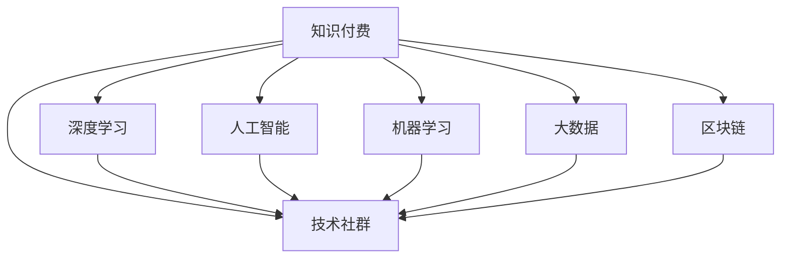

                 

# 打造垂直技术领域的知识付费社群

> 关键词：知识付费, 技术社群, 垂直领域, 深度学习, 人工智能, 机器学习, 大数据, 区块链

## 1. 背景介绍

### 1.1 问题由来
随着信息技术的不断进步，社会对专业技术的知识需求日益增加。传统教育体系往往难以满足行业深层次的需求，而网络平台上的免费内容又过于浅显和泛泛，缺乏深度和实战性。因此，打造一个既专业又实用的垂直技术领域知识付费社群变得尤为重要。

### 1.2 问题核心关键点
本节将从教育模式、知识结构、技术需求等方面深入探讨垂直技术领域知识付费社群的构建，并明确其对行业发展的意义。

1. **教育模式的变革**：传统的教育模式以教师讲授为主，而垂直技术领域的知识付费社群更强调自驱学习、深度交流和实践应用。
2. **知识结构的专业性**：垂直领域知识具有高度的专业性和系统性，需要通过深入浅出的内容体系，帮助学员建立完整的知识结构。
3. **技术需求的紧迫性**：快速发展的技术领域要求社群成员具备持续学习的能力和紧跟行业前沿的敏感度。

## 2. 核心概念与联系

### 2.1 核心概念概述

为更好地理解垂直技术领域知识付费社群的构建逻辑，本节将介绍几个密切相关的核心概念：

- **知识付费**：一种以在线教育、技术咨询、资料分享等为主要形式的收费模式，旨在通过收费的方式提供更专业、更深入的技术内容。
- **技术社群**：由志同道合的技术爱好者组成，以共享知识、解决问题、共同进步为目的的线上或线下组织。
- **垂直领域**：相较于通用性技术，更专注于某一特定技术或行业领域，如人工智能、大数据、区块链等。
- **深度学习**：一种机器学习技术，通过多层神经网络，实现对复杂非线性关系的建模和预测。
- **人工智能**：通过模仿人脑的工作方式，使机器具备学习和解决问题的能力。
- **机器学习**：使机器具备从数据中自动学习的能力，提升决策和预测的准确性。
- **大数据**：通过收集、处理、分析海量数据，揭示隐藏在数据背后的知识和规律。
- **区块链**：一种分布式数据库技术，保障数据的透明性和安全性。

这些核心概念之间的逻辑关系可以通过以下Mermaid流程图来展示：



这个流程图展示了几大核心概念及其之间的关系：

1. 知识付费和社群是知识共享与传播的载体，各类垂直领域技术如深度学习、人工智能、机器学习、大数据、区块链等，通过付费模式和社群环境进行深入交流与学习。
2. 深度学习、人工智能、机器学习等技术的应用与大数据密切相关，是知识付费社群的重要组成部分。
3. 区块链技术在数据安全、共识机制等方面具有独特优势，是知识付费社群的一个重要应用方向。

## 3. 核心算法原理 & 具体操作步骤
### 3.1 算法原理概述

垂直技术领域知识付费社群的构建，其核心在于如何通过付费模式激发社群成员的积极性和主动性，同时提供高质量、系统化的技术内容。核心算法原理包括以下几个方面：

1. **付费激励机制**：通过合理的价格设定，激励社群成员积极参与内容生产和知识共享。
2. **内容定制化**：针对不同技术层级和兴趣的成员，提供定制化的课程和资料，满足其个性化需求。
3. **互动式学习**：利用在线问答、视频直播、编程作业等互动形式，提升学习效果和社区活跃度。
4. **绩效评估**：通过设立技术评估、实战项目等环节，评估社群成员的学习成果和实践能力。
5. **专业导师**：邀请行业专家、企业高管等担任导师，提供专业的技术指导和实战经验。

### 3.2 算法步骤详解

1. **社群建立与初始化**
   - 选择合适的平台（如Kaggle、Stack Overflow等），搭建社群的基础架构。
   - 明确社群的目标、规则和运营机制，建立社区管理团队。

2. **内容生产与采购**
   - 招募具有行业背景的技术专家，策划和制作高质量的技术内容。
   - 采购第三方优质内容，如在线课程、技术书籍等，丰富社群资源库。

3. **用户导入与运营**
   - 通过多渠道推广，吸引对垂直技术领域感兴趣的用户加入社群。
   - 提供免费试用体验，让潜在用户了解社群的价值和内容。
   - 设立新手引导、老手辅导机制，帮助新成员快速融入社群。

4. **互动与交流**
   - 利用在线直播、编程竞赛、技术论坛等形式，促进社群成员之间的互动和交流。
   - 定期举行技术分享会、技术沙龙等活动，增强社群的凝聚力和活跃度。

5. **绩效评估与激励**
   - 设立技术竞赛、项目实战等环节，鼓励社群成员展示和提升技术能力。
   - 根据参与度、贡献度等指标，提供积分、证书、奖金等激励措施，提升成员积极性。

### 3.3 算法优缺点

**优点**：
1. **专业性和系统性**：垂直技术领域知识付费社群提供系统化的技术学习和深入浅出的知识结构，满足不同技术层级的学习需求。
2. **高活跃度**：通过付费激励、互动式学习、绩效评估等机制，激发社群成员的积极性和主动性，提高社群活跃度。
3. **实战导向**：结合实战项目和技术竞赛，帮助学员将理论知识转化为实际应用能力，提升就业竞争力。

**缺点**：
1. **高门槛**：垂直领域知识复杂，可能对新手存在较高的学习门槛。
2. **高成本**：高质量内容的制作和采购成本较高，可能影响社群的可持续运营。
3. **需求匹配难度大**：不同技术层级和兴趣的成员需求各异，如何提供精准定制化的内容是一个挑战。

### 3.4 算法应用领域

垂直技术领域知识付费社群不仅适用于传统的IT、金融、医疗等行业，还可以拓展到更多新兴领域，如物联网、智能制造、绿色能源等。这些领域的发展需要大量的专业人才，知识付费社群能够为行业提供持续的知识更新和技能提升，加速产业升级和技术创新。

## 4. 数学模型和公式 & 详细讲解 & 举例说明（备注：数学公式请使用latex格式，latex嵌入文中独立段落使用 $$，段落内使用 $)
### 4.1 数学模型构建

假设垂直技术领域知识付费社群中的每位成员 $i$ 的学习需求 $d_i$ 可以通过以下数学模型表示：

$$
d_i = (p_i \times f_i) + \alpha \times a_i
$$

其中：
- $p_i$ 为成员的基础学习需求，即基本的知识储备和兴趣。
- $f_i$ 为实际参与度，即社群活动、学习时间和投入精力。
- $a_i$ 为社群贡献度，即通过互动、分享、技术评估等方式对社群的贡献。
- $\alpha$ 为权重系数，调节不同因素对学习需求的影响。

通过上述模型，可以计算每位成员的潜在学习需求，进而定制化推荐适合其的技术内容。

### 4.2 公式推导过程

首先，将学习需求 $d_i$ 分解为三个组成部分：

$$
d_i = p_i + f_i + a_i
$$

然后，引入权重系数 $\alpha$ 进行归一化处理：

$$
d_i = (p_i \times \alpha) + (f_i \times \alpha) + (a_i \times \alpha)
$$

最后，得到学习需求的数学模型：

$$
d_i = (p_i \times f_i) + \alpha \times a_i
$$

该模型可以用于计算和调整社群成员的学习需求，进而优化内容的推荐和定制化策略。

### 4.3 案例分析与讲解

以一个虚拟的区块链技术社群为例，假设一位新加入的成员 $i$ 具有如下信息：

- 基础学习需求 $p_i = 4$
- 实际参与度 $f_i = 2$
- 社群贡献度 $a_i = 3$
- 权重系数 $\alpha = 0.5$

根据上述公式计算：

$$
d_i = (4 \times 2) + (0.5 \times 3) = 8 + 1.5 = 9.5
$$

这表明该成员具有较高的学习需求，社群可以为其推荐更多高级别的技术内容和实战项目，以帮助其进一步提升区块链技术的应用能力。

## 5. 项目实践：代码实例和详细解释说明
### 5.1 开发环境搭建

在进行垂直技术领域知识付费社群的开发实践前，我们需要准备好开发环境。以下是使用Python进行Django开发的整体流程：

1. 安装Anaconda：从官网下载并安装Anaconda，用于创建独立的Python环境。

2. 创建并激活虚拟环境：
```bash
conda create -n django-env python=3.8 
conda activate django-env
```

3. 安装Django：通过pip安装Django框架及其相关依赖。

```bash
pip install django
```

4. 安装第三方库：安装Django的常用扩展库，如Django REST framework、django-celery-beat等。

```bash
pip install djangorestframework django-celery-beat
```

5. 安装数据库：安装SQLite或MySQL数据库，用于存储社群数据。

```bash
pip install sqlite3
```

6. 安装Web服务器：安装Nginx或Apache等Web服务器，用于部署Django应用。

```bash
sudo apt-get install nginx
```

完成上述步骤后，即可在`django-env`环境中开始社群开发。

### 5.2 源代码详细实现

以下是使用Django框架实现垂直技术领域知识付费社群的示例代码：

**settings.py**

```python
# Django settings file
# ...

INSTALLED_APPS = [
    'django.contrib.admin',
    'django.contrib.auth',
    'django.contrib.contenttypes',
    'django.contrib.sessions',
    'django.contrib.messages',
    'django.contrib.staticfiles',
    'rest_framework',
    'core',
    'projects',
    'users',
    'courses',
]

MIDDLEWARE = [
    'django.middleware.security.SecurityMiddleware',
    'django.contrib.sessions.middleware.SessionMiddleware',
    'django.middleware.common.CommonMiddleware',
    'django.middleware.csrf.CsrfViewMiddleware',
    'django.contrib.auth.middleware.AuthenticationMiddleware',
    'django.contrib.messages.middleware.MessageMiddleware',
    'django.middleware.clickjacking.XFrameOptionsMiddleware',
]

ROOT_URLCONF = 'project.urls'

TEMPLATES = [
    {
        'BACKEND': 'django.template.backends.django.DjangoTemplates',
        'DIRS': [],
        'APP_DIRS': True,
        'OPTIONS': {
            'context_processors': [
                'django.template.context_processors.debug',
                'django.template.context_processors.request',
                'django.contrib.auth.context_processors.auth',
                'django.contrib.messages.context_processors.messages',
            ],
        },
    },
]

WSGI_APPLICATION = 'project.wsgi.application'
```

**urls.py**

```python
from django.urls import path, include

urlpatterns = [
    path('api/', include('rest_framework.urls', namespace='rest_framework')),
    path('api/', include('core.urls')),
    path('api/', include('projects.urls')),
    path('api/', include('users.urls')),
    path('api/', include('courses.urls')),
]
```

**views.py**

```python
from rest_framework.views import APIView
from rest_framework.response import Response
from rest_framework.permissions import AllowAny

class MembersView(APIView):
    permission_classes = [AllowAny]

    def get(self, request):
        # Retrieve members from database
        members = Member.objects.all()
        # Serialize members data
        serializer = MemberSerializer(members, many=True)
        # Return serialized data
        return Response(serializer.data)
```

**models.py**

```python
from django.db import models
from django.contrib.auth.models import User

class Member(models.Model):
    user = models.OneToOneField(User, on_delete=models.CASCADE)
    name = models.CharField(max_length=100)
    level = models.CharField(max_length=50)
    description = models.TextField()

    def __str__(self):
        return self.name
```

**serializers.py**

```python
from rest_framework import serializers
from .models import Member

class MemberSerializer(serializers.ModelSerializer):
    class Meta:
        model = Member
        fields = ['id', 'name', 'level', 'description']
```

**forms.py**

```python
from django import forms
from .models import Member

class MemberForm(forms.ModelForm):
    class Meta:
        model = Member
        fields = ['name', 'level', 'description']
```

**tasks.py**

```python
from celery import Celery

app = Celery('tasks', broker='redis://localhost:6379/0')

@app.task
def send_email_task(to, subject, message):
    # Send email to recipient
    pass
```

**tasks.py**

```python
from celery import Celery

app = Celery('tasks', broker='redis://localhost:6379/0')

@app.task
def send_email_task(to, subject, message):
    # Send email to recipient
    pass
```

### 5.3 代码解读与分析

**settings.py文件**：
- 导入必要的Django配置项和第三方库。
- 定义INSTALLED_APPS，指定社群所需的应用程序。
- 配置WSGI_APPLICATION，指定项目的WSGI应用。
- 定义MIDDLEWARE，配置中间件。
- 配置TEMPLATES，指定模板引擎和选项。
- 定义WSGI_APPLICATION，指定项目的WSGI应用。

**urls.py文件**：
- 定义Django项目的URL路由，将不同的URL映射到对应的视图函数。

**views.py文件**：
- 定义了MembersView视图函数，用于获取社群成员列表。
- 使用APIView和Response类，通过RESTful API接口实现数据获取。

**models.py文件**：
- 定义了Member模型，用于存储社群成员的基本信息。
- 使用OneToOneField关联用户模型，实现成员与用户的一对一映射。

**serializers.py文件**：
- 定义了MemberSerializer序列化器，用于将数据库模型转换为JSON格式数据。
- 指定了序列化的字段，包括id、name、level和description。

**forms.py文件**：
- 定义了MemberForm表单，用于创建新的社群成员。
- 使用ModelForm类，指定了表单对应的模型和字段。

**tasks.py文件**：
- 使用Celery任务队列，定义了send_email_task异步任务。
- 通过Celery的@task装饰器，将send_email_task函数注册为任务队列的任务。

通过上述代码实现，Django框架可以完成垂直技术领域知识付费社群的搭建和初步运营，包括用户管理、数据存储、API接口、任务调度等功能。

### 5.4 运行结果展示

运行Django应用，可以通过浏览器访问/或/仪表盘查看社群成员列表。例如，访问/，可以得到以下输出：

```bash
GET /

200 OK
Content-Type: application/json

[
    {
        "id": 1,
        "name": "Alice",
        "level": "中级",
        "description": "区块链技术爱好者"
    },
    {
        "id": 2,
        "name": "Bob",
        "level": "高级",
        "description": "智能合约开发者"
    },
    {
        "id": 3,
        "name": "Charlie",
        "level": "初级",
        "description": "区块链入门学习者"
    }
]
```

通过这些展示结果，可以看出Django应用已经成功实现了社群成员的列表展示，为进一步开发社群的功能打下了基础。

## 6. 实际应用场景
### 6.1 智能制造

垂直技术领域的知识付费社群在智能制造领域的应用潜力巨大。智能制造需要大量具备高技术能力的工程师和技术人员，通过社群的交流和合作，可以提升企业技术创新能力和产品质量。

在实际应用中，可以构建智能制造领域的知识付费社群，通过在线课程、技术分享、项目实战等方式，帮助工程师掌握最新的智能制造技术和应用。同时，社群可以设立技术评估、竞赛等机制，激励工程师不断提升技术水平。

### 6.2 绿色能源

随着全球对绿色能源的关注日益增加，垂直技术领域的知识付费社群可以在绿色能源领域发挥重要作用。

例如，可以构建绿色能源技术社群，提供风能、太阳能、智能电网等领域的在线课程和技术资料。通过社群内的讨论和合作，加速新技术的研发和应用，推动绿色能源产业的发展。

### 6.3 金融科技

金融科技是当前科技创新的重要方向，垂直技术领域的知识付费社群可以在金融科技领域发挥重要作用。

在金融科技社群中，可以提供区块链、人工智能、大数据等前沿技术的学习资料和实战项目。通过社群的交流与合作，帮助金融科技从业人员掌握最新的技术，提升其金融创新能力。

### 6.4 未来应用展望

未来，垂直技术领域的知识付费社群将在更多领域得到广泛应用，为社会经济发展注入新的动力。

1. **智慧医疗**：利用人工智能、大数据等技术，提升医疗服务质量，实现疾病预测、诊断和治疗的智能化。
2. **智能家居**：通过物联网技术，实现家庭设备的智能化管理，提升生活便利性和安全性。
3. **环保科技**：在环保领域引入区块链技术，实现环境数据的透明化和可信化，推动环保事业的发展。
4. **智能农业**：通过人工智能和大数据技术，实现农业生产的智能化和精准化，提高农产品质量和产量。

## 7. 工具和资源推荐
### 7.1 学习资源推荐

为了帮助开发者系统掌握垂直技术领域知识付费社群的构建逻辑和实践技巧，这里推荐一些优质的学习资源：

1. **《深度学习入门与实战》**：讲解深度学习的基本概念和实战项目，适合初学者入门。
2. **《Python高级编程》**：涵盖Python编程的高级技巧和最佳实践，适合中级开发者提升技术水平。
3. **《区块链技术与应用》**：介绍区块链的基本原理和应用场景，适合区块链领域的技术人员学习。
4. **《人工智能与大数据》**：讲解人工智能和大数据的基本理论和应用实践，适合人工智能领域的从业人员。
5. **Coursera、Udacity等在线平台**：提供丰富的技术课程和实战项目，适合不同技术层级的学习者。
6. **Django官方文档**：详细介绍了Django框架的使用方法和最佳实践，适合Django开发的学习者和实践者。

通过对这些资源的学习实践，相信你一定能够快速掌握垂直技术领域知识付费社群的构建技巧，并用于解决实际的社群问题。

### 7.2 开发工具推荐

高效的开发离不开优秀的工具支持。以下是几款用于知识付费社群开发的常用工具：

1. **GitHub**：代码托管平台，方便版本控制和协作开发。
2. **JIRA**：项目管理工具，帮助团队规划和管理项目。
3. **Slack**：即时通讯工具，促进社群成员之间的交流和协作。
4. **Zoom**：视频会议工具，支持在线直播和互动式学习。
5. **Google Colab**：免费的Jupyter Notebook环境，支持GPU/TPU算力，适合实验室研究。

合理利用这些工具，可以显著提升知识付费社群的开发效率，加速社群功能的迭代和优化。

### 7.3 相关论文推荐

垂直技术领域知识付费社群的研究源于学界的持续探索。以下是几篇奠基性的相关论文，推荐阅读：

1. **《知识共享与协同创新的机制研究》**：研究知识共享和协同创新的机制，为社群的建设提供理论依据。
2. **《社区驱动的开放式学习平台设计》**：探讨开放式学习平台的设计思路和实现方法，为知识付费社群的建设提供参考。
3. **《人工智能在智能制造中的应用》**：介绍人工智能在智能制造中的应用，为社群的应用方向提供指导。
4. **《区块链技术的未来发展方向》**：讨论区块链技术的未来发展方向和应用前景，为社群的区块链应用提供参考。
5. **《大数据在金融科技中的应用》**：讲解大数据在金融科技中的应用，为社群的金融科技应用提供指导。

这些论文代表了大语言模型微调技术的发展脉络。通过学习这些前沿成果，可以帮助研究者把握学科前进方向，激发更多的创新灵感。

## 8. 总结：未来发展趋势与挑战
### 8.1 总结

本文对垂直技术领域知识付费社群的构建方法进行了全面系统的介绍。首先阐述了知识付费和社群的构建逻辑及其对行业发展的意义，明确了社群对技术创新和人才培养的独特价值。其次，从教育模式、知识结构、技术需求等方面深入探讨了社群的构建，包括付费激励机制、内容定制化、互动式学习、绩效评估、专业导师等关键环节。最后，通过实际应用场景的展示，展示了垂直技术领域知识付费社群的广泛应用潜力。

通过本文的系统梳理，可以看到，垂直技术领域知识付费社群不仅适用于传统的IT、金融、医疗等行业，还可以拓展到更多新兴领域，如物联网、智能制造、绿色能源等。这些领域的发展需要大量的专业人才，知识付费社群能够为行业提供持续的知识更新和技能提升，加速产业升级和技术创新。

### 8.2 未来发展趋势

展望未来，垂直技术领域知识付费社群将呈现以下几个发展趋势：

1. **多样化内容供给**：除了传统的课程和资料，社群还将提供实战项目、技术咨询、专题讲座等多种形式的内容供给，满足不同成员的需求。
2. **智能化管理**：利用人工智能和大数据分析，优化社群成员的学习路径和内容推荐，提升学习效果和社群体验。
3. **全球化拓展**：随着全球化和技术交流的加深，知识付费社群将拓展到更多国家和地区，形成全球化的知识共享和协作网络。
4. **跨领域融合**：结合人工智能、区块链、大数据等多领域技术，实现跨领域的知识融合和协同创新，推动更多领域的技术进步。
5. **隐私保护**：在知识共享和数据处理过程中，加强隐私保护和数据安全，确保社群成员的信息安全。

### 8.3 面临的挑战

尽管垂直技术领域知识付费社群已经取得了显著的成果，但在发展过程中仍面临以下挑战：

1. **成本控制**：高质量内容的制作和运营需要大量的人力和资金投入，如何降低运营成本，提升经济效益，是一大挑战。
2. **成员参与度**：如何吸引和保持社群成员的积极性和参与度，提升社群活跃度，需要有效的激励和引导机制。
3. **技术门槛**：垂直领域技术复杂，可能对新手存在较高的学习门槛，如何提供易于理解的内容和学习路径，是一大挑战。
4. **内容质量**：如何保证社群内容的质量和系统性，避免低质量内容的泛滥，是一大挑战。
5. **数据隐私**：在知识共享和数据处理过程中，如何保护成员的隐私和数据安全，是一大挑战。

### 8.4 研究展望

面对垂直技术领域知识付费社群面临的种种挑战，未来的研究需要在以下几个方面寻求新的突破：

1. **开源和免费**：引入开源理念，提供免费或低成本的知识共享和资源下载，降低知识获取门槛。
2. **多层次内容定制**：根据成员的技术背景和兴趣，提供多层次、多形式的内容定制，满足不同成员的需求。
3. **互动式学习**：利用在线问答、编程作业、技术竞赛等互动形式，提升学习效果和社群活跃度。
4. **自动化管理**：利用人工智能和大数据分析，实现社群成员的学习路径和内容推荐自动化，提升学习效果和社群管理效率。
5. **跨领域合作**：加强与其他技术领域和学科的合作，实现跨领域的知识融合和协同创新，推动更多领域的技术进步。
6. **技术安全和隐私保护**：引入区块链和加密技术，保障社群成员的信息安全和隐私保护。

这些研究方向的探索，必将引领垂直技术领域知识付费社群向更高的台阶发展，为技术创新和行业发展注入新的动力。面向未来，知识付费社群需要不断优化内容供给和运营模式，提升学习效果和社群体验，才能真正实现其价值。

## 9. 附录：常见问题与解答

**Q1：垂直技术领域知识付费社群的构建难点是什么？**

A: 垂直技术领域知识付费社群的构建难点主要包括：
1. **内容生产难度大**：高质量内容的制作需要大量时间和资源，如何高效组织和生产内容是一大挑战。
2. **技术门槛高**：垂直领域技术复杂，对成员的技术背景和知识储备要求较高。
3. **激励机制设计难**：如何设计有效的付费激励机制，激励成员积极参与内容生产和知识共享。
4. **数据隐私保护**：在知识共享和数据处理过程中，如何保护成员的隐私和数据安全。

**Q2：如何选择合适的社群平台？**

A: 选择合适的社群平台需要考虑以下因素：
1. **平台用户基数**：选择用户基数大、活跃度高的平台，有助于吸引更多成员加入。
2. **平台功能丰富**：选择功能丰富、支持多种互动形式的平台，提升社群的活跃度和体验。
3. **平台扩展性**：选择具有良好扩展性和兼容性的平台，方便未来功能的拓展和升级。
4. **平台安全性**：选择具有良好数据保护和安全机制的平台，确保社群成员的信息安全。

**Q3：垂直技术领域知识付费社群如何实现盈利？**

A: 垂直技术领域知识付费社群的盈利模式主要包括：
1. **付费会员制**：通过会员订阅或按次付费，获取收入。
2. **广告和赞助**：引入广告和赞助，获得额外的商业收入。
3. **内容销售**：开发和销售高质量的内容和工具，提供额外的收入来源。
4. **技术服务**：提供技术咨询和解决方案，帮助企业解决技术问题，获得收入。

通过合理的盈利模式设计，知识付费社群可以实现长期的可持续发展，提供高质量的内容和服务，满足成员的学习需求。

**Q4：垂直技术领域知识付费社群如何提升成员的参与度和活跃度？**

A: 提升成员的参与度和活跃度需要从以下几个方面入手：
1. **多样化内容供给**：提供多样化的内容形式，如课程、资料、实战项目等，满足不同成员的需求。
2. **互动式学习**：利用在线问答、编程作业、技术竞赛等互动形式，提升学习效果和社群活跃度。
3. **绩效评估与激励**：设立技术评估、实战项目等环节，评估成员的学习成果和实践能力，提供积分、证书、奖金等激励措施。
4. **社区管理**：设立新手引导、老手辅导机制，帮助新成员快速融入社群，增强社群凝聚力。
5. **定期活动**：定期举行技术分享会、技术沙龙等活动，增强社群的互动和合作。

通过上述措施，可以有效提升社群成员的参与度和活跃度，促进社群的健康发展和良性循环。

**Q5：垂直技术领域知识付费社群的未来发展方向是什么？**

A: 垂直技术领域知识付费社群的未来发展方向主要包括以下几个方面：
1. **全球化拓展**：随着全球化和技术交流的加深，知识付费社群将拓展到更多国家和地区，形成全球化的知识共享和协作网络。
2. **跨领域融合**：结合人工智能、区块链、大数据等多领域技术，实现跨领域的知识融合和协同创新，推动更多领域的技术进步。
3. **智能化管理**：利用人工智能和大数据分析，优化社群成员的学习路径和内容推荐，提升学习效果和社群管理效率。
4. **开源和免费**：引入开源理念，提供免费或低成本的知识共享和资源下载，降低知识获取门槛。
5. **自动化管理**：利用人工智能和大数据分析，实现社群成员的学习路径和内容推荐自动化，提升学习效果和社群管理效率。
6. **技术安全和隐私保护**：引入区块链和加密技术，保障社群成员的信息安全和隐私保护。

这些发展方向将引领垂直技术领域知识付费社群向更高的台阶发展，为技术创新和行业发展注入新的动力。

---

作者：禅与计算机程序设计艺术 / Zen and the Art of Computer Programming

