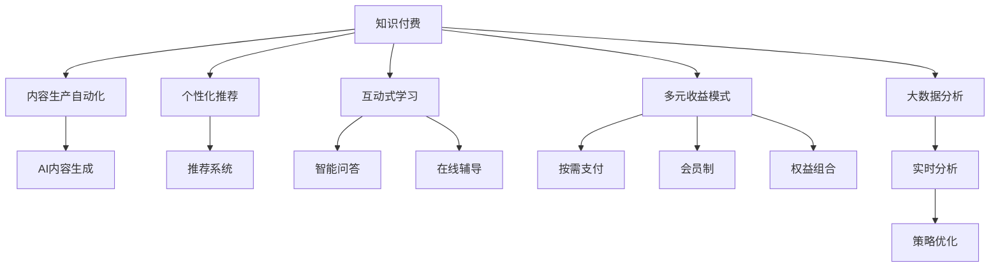

                 

## 1. 背景介绍

### 1.1 问题由来
在互联网高速发展的今天，知识付费成为人们获取知识、提升个人技能的重要途径。传统知识付费平台通常采用内容分发、订阅制、版权交易等模式，聚焦于综合性内容，难以满足用户对垂直细分领域的需求。随着人工智能和大数据技术的发展，打造知识付费垂直领域的独特优势成为可能，提升用户体验和平台竞争力。

### 1.2 问题核心关键点
1. 垂直领域用户需求的精准把握：
   - 不同垂直领域用户对于知识内容的需求、兴趣和互动方式各不相同。
   - 深度定制个性化内容，提升用户粘性和满意度。

2. 高效内容的生产和推荐：
   - 传统内容生产方式难以满足海量、高质量内容的输出。
   - 引入AI技术，实现内容生产的自动化和个性化推荐。

3. 用户互动的增强：
   - 互动式学习成为知识付费的重要趋势。
   - 利用AI技术提升互动效果，如问答系统、智能辅导等。

4. 收益模式的多元化：
   - 单一的订阅制难以覆盖更广泛的用户。
   - 探索多样化的收益模式，如按需支付、权益组合等。

5. 数据驱动的决策支持：
   - 传统知识付费平台依赖人工决策，效率低下。
   - 利用大数据分析，实时调整运营策略，优化用户体验。

### 1.3 问题研究意义
打造知识付费垂直领域的独特优势，对于提升用户满意度、降低运营成本、增强平台竞争力具有重要意义：

1. 提升用户满意度：
   - 通过AI技术，实现垂直领域内容的精准推荐和个性化服务。
   - 利用自然语言处理技术，提升问答、互动系统的准确性和流畅性。

2. 降低运营成本：
   - 自动化内容生产和推荐系统，减少人工成本。
   - 大数据分析支持下的精准运营策略，降低营销和推广成本。

3. 增强平台竞争力：
   - 针对垂直领域，提供差异化的服务和功能，形成品牌独特性。
   - 多元化收益模式，吸引更广泛的用户，提高市场占有率。

## 2. 核心概念与联系

### 2.1 核心概念概述

为更好地理解知识付费垂直领域的发展方向和实现路径，本节将介绍几个密切相关的核心概念：

- **知识付费**：指消费者支付一定费用以获取知识内容的互联网服务模式。
- **垂直领域**：指特定专业或行业内的知识内容，如技术、医疗、教育等。
- **内容生产自动化**：利用AI技术自动生成、校验和优化内容。
- **个性化推荐**：基于用户行为数据，推荐个性化的知识内容。
- **互动式学习**：结合AI技术，提升用户互动体验，如智能问答、在线辅导等。
- **多元收益模式**：探索多样化的付费模式，如按需支付、会员制、权益组合等。

这些核心概念之间的逻辑关系可以通过以下Mermaid流程图来展示：



这个流程图展示了知识付费的各个关键组件及其相互关系：

1. **知识付费**：作为整体运营的基础。
2. **内容生产自动化**：利用AI技术提高内容生成效率和质量。
3. **个性化推荐**：基于用户数据推荐个性内容。
4. **互动式学习**：提升用户互动体验。
5. **多元收益模式**：拓展商业模式，增强平台粘性。
6. **大数据分析**：通过数据驱动决策，优化运营策略。

这些概念共同构成了知识付费垂直领域的核心框架，为构建个性化、高效、智能的知识付费平台提供了理论基础。

## 3. 核心算法原理 & 具体操作步骤
### 3.1 算法原理概述

在知识付费垂直领域，核心算法原理主要包括内容生成、个性化推荐、互动学习及运营优化。

#### 3.1.1 内容生成
内容生成自动化通过AI技术，自动生成高质量、符合用户需求的知识内容。核心算法包括：
- **自然语言处理**：自动生成文章、笔记、摘要等文本内容。
- **图像和视频生成**：利用生成对抗网络（GAN）等技术生成相关图片和视频。
- **协同过滤与推荐**：通过协同过滤和推荐算法，生成个性化的学习资源推荐列表。

#### 3.1.2 个性化推荐
个性化推荐系统利用用户行为数据和知识图谱，实时推荐符合用户需求的内容。核心算法包括：
- **协同过滤**：基于用户历史行为和相似用户推荐相关内容。
- **基于内容的推荐**：利用内容特征与用户兴趣进行匹配。
- **混合推荐**：综合协同过滤和基于内容的方法，提高推荐准确性。

#### 3.1.3 互动学习
互动学习通过智能问答和在线辅导系统，提升用户的学习体验和效果。核心算法包括：
- **自然语言理解**：理解用户提出的问题，提取关键信息。
- **知识图谱**：构建知识图谱，支持智能问答和推理。
- **生成式对话**：利用生成模型生成对话，提升互动体验。

#### 3.1.4 运营优化
运营优化通过大数据分析，实时调整运营策略，提升用户体验和平台收益。核心算法包括：
- **用户行为分析**：分析用户访问、学习行为，挖掘潜在需求。
- **流量预测**：基于历史数据，预测用户流量，优化资源配置。
- **收益优化**：利用多变量优化技术，最大化收益。

### 3.2 算法步骤详解

#### 3.2.1 内容生成自动化

1. **数据准备**
   - 收集垂直领域内相关的知识内容，如文章、笔记、视频等。
   - 构建高质量的数据集，标注内容的相关性和用户评价。

2. **模型选择与训练**
   - 选择适合的生成模型，如GPT-3、BERT等，进行预训练和微调。
   - 在训练过程中引入监督信号，如标签、标注等，引导模型生成高质量内容。

3. **内容校验与优化**
   - 引入专家评审机制，对生成的内容进行人工校验。
   - 利用自然语言处理技术，进行内容风格和语义的优化。

#### 3.2.2 个性化推荐系统

1. **用户行为数据采集**
   - 收集用户行为数据，如浏览历史、购买记录、学习进度等。
   - 对数据进行清洗、特征提取和标准化处理。

2. **模型训练与优化**
   - 选择推荐算法，如协同过滤、基于内容的推荐等。
   - 利用用户行为数据和知识图谱，训练推荐模型，并实时优化。

3. **推荐结果输出**
   - 根据用户当前行为和历史偏好，生成个性化推荐结果。
   - 使用A/B测试等方法，评估推荐效果，并不断优化算法。

#### 3.2.3 互动学习系统

1. **用户提问数据收集**
   - 收集用户提出的问题，标注问题类型和难度。
   - 构建问题库，支持自然语言处理和生成式对话。

2. **智能问答系统部署**
   - 部署自然语言理解模型，解析用户问题。
   - 根据知识图谱，生成逻辑清晰、准确的回答。

3. **在线辅导系统搭建**
   - 利用生成式对话技术，生成对话流。
   - 引入智能推荐系统，推荐学习资源和路径。

#### 3.2.4 运营优化策略

1. **用户行为分析**
   - 分析用户访问、学习行为，识别关键节点和潜在需求。
   - 利用大数据分析技术，进行用户画像构建。

2. **流量预测**
   - 构建流量预测模型，基于历史数据预测用户流量。
   - 实时调整资源配置，确保系统稳定性。

3. **收益优化**
   - 利用多变量优化技术，最大化收益。
   - 引入动态定价策略，平衡用户需求和平台收益。

### 3.3 算法优缺点

#### 3.3.1 内容生成自动化的优缺点
- **优点**
  - 提高内容生成效率和质量，减少人工成本。
  - 支持海量内容生成，满足用户需求。

- **缺点**
  - 对数据和标注要求高，初期成本较高。
  - 生成的内容可能缺乏深度和多样性。

#### 3.3.2 个性化推荐系统的优缺点
- **优点**
  - 提升用户体验，增加用户粘性。
  - 提高内容匹配度，增强用户满意度。

- **缺点**
  - 对数据质量和用户行为数据依赖性高。
  - 推荐结果可能存在偏差，影响用户体验。

#### 3.3.3 互动学习系统的优缺点
- **优点**
  - 提升用户互动体验，增强学习效果。
  - 支持多模态学习，提升学习效果。

- **缺点**
  - 技术实现复杂，开发成本高。
  - 需要大量数据和模型支持，资源消耗大。

#### 3.3.4 运营优化策略的优缺点
- **优点**
  - 实时调整运营策略，提升用户体验和平台收益。
  - 利用数据驱动决策，优化资源配置。

- **缺点**
  - 数据质量和模型选择对策略效果有较大影响。
  - 需要实时数据处理能力，系统复杂度较高。

### 3.4 算法应用领域

#### 3.4.1 技术领域
- **软件开发**：技术文档、代码片段、编程案例等知识内容的自动化生成和推荐。
- **数据分析**：数据处理、数据分析、可视化等技术内容的学习和应用。

#### 3.4.2 医疗领域
- **临床知识库**：医学案例、诊疗指南、研究成果等医疗知识内容的自动化生成和推荐。
- **远程医疗**：智能诊断、智能辅导等互动式学习系统的应用。

#### 3.4.3 教育领域
- **在线课程**：课程内容、习题解析、学习路径等教育内容的自动化生成和推荐。
- **学习辅导**：智能问答、在线辅导等互动式学习系统的应用。

## 4. 数学模型和公式 & 详细讲解 & 举例说明
### 4.1 数学模型构建

在知识付费垂直领域，核心算法原理主要基于用户行为数据、知识图谱和内容特征，构建个性化推荐和内容生成的数学模型。以下以协同过滤算法为例进行详细讲解。

#### 4.1.1 协同过滤模型

协同过滤是一种基于用户行为数据的推荐算法，通过计算用户和物品的相似度，推荐物品给用户。其数学模型如下：

$$
\hat{r}_{ui} = e^{w_0} \cdot \prod_{j=1}^{N}\left(\frac{e^{w_1} \cdot \sum_{k=1}^{K} \left( \frac{a_{kj} \cdot p_{ki}}{1 + b_{kj}}\right) + \frac{1 - \sum_{k=1}^{K} a_{kj} \cdot p_{ki}}{1 + b_{kj}}}{\frac{1}{1 + b_{kj}}}\right)
$$

其中，$r_{ui}$ 表示用户 $u$ 对物品 $i$ 的评分；$w_0, w_1$ 为模型的参数；$b_{kj}$ 为正则化项；$a_{kj}$ 为物品 $j$ 对用户 $u$ 的相似度系数；$p_{ki}$ 为用户 $u$ 对物品 $i$ 的评分；$K$ 为物品数量；$N$ 为用户数量。

### 4.2 公式推导过程

#### 4.2.1 协同过滤模型的推导

1. **用户-物品评分矩阵**
   - 构建用户 $u$ 对物品 $i$ 的评分矩阵 $R$，$R \in \mathbb{R}^{N \times M}$，其中 $N$ 为用户数，$M$ 为物品数。

2. **用户相似度计算**
   - 计算用户 $u$ 和用户 $v$ 的相似度 $sim_{uv}$，$sim_{uv} \in [0, 1]$，表示用户 $u$ 和用户 $v$ 的相似度。

3. **物品相似度计算**
   - 计算物品 $i$ 和物品 $j$ 的相似度 $sim_{ij}$，$sim_{ij} \in [0, 1]$，表示物品 $i$ 和物品 $j$ 的相似度。

4. **用户评分预测**
   - 利用用户 $u$ 和用户 $v$ 的相似度，预测用户 $u$ 对物品 $i$ 的评分 $r_{ui}$。

### 4.3 案例分析与讲解

#### 4.3.1 协同过滤在知识付费中的应用

在知识付费垂直领域，利用协同过滤算法推荐知识内容时，需要进行以下步骤：

1. **用户行为数据采集**
   - 收集用户访问、学习、购买行为数据，构建用户行为矩阵 $U \in \mathbb{R}^{N \times M}$，其中 $N$ 为用户数，$M$ 为知识内容数量。

2. **用户-物品评分矩阵构建**
   - 根据用户行为数据，计算用户 $u$ 对物品 $i$ 的评分 $r_{ui}$。

3. **相似度计算**
   - 计算用户 $u$ 和用户 $v$ 的相似度 $sim_{uv}$，物品 $i$ 和物品 $j$ 的相似度 $sim_{ij}$。

4. **推荐结果生成**
   - 利用协同过滤模型，预测用户 $u$ 对未访问的知识内容的评分 $r_{ui}'$，生成推荐列表。

## 5. 项目实践：代码实例和详细解释说明
### 5.1 开发环境搭建

在知识付费垂直领域，项目开发环境搭建是实现算法原理和具体操作步骤的关键。以下是使用Python进行TensorFlow和TensorFlow-Serving搭建开发环境的流程：

1. **安装TensorFlow**
   - 从官网下载并安装TensorFlow，确保版本稳定。

2. **安装TensorFlow-Serving**
   - 使用pip安装TensorFlow-Serving，部署到服务器上。

3. **数据准备**
   - 准备知识内容数据集，进行数据清洗和特征提取。

4. **模型训练与验证**
   - 在TensorFlow中训练推荐模型，并进行交叉验证。

5. **模型部署与测试**
   - 使用TensorFlow-Serving部署推荐模型，进行在线测试和优化。

### 5.2 源代码详细实现

#### 5.2.1 协同过滤模型代码实现

以下以协同过滤模型为例，给出使用TensorFlow实现的知识推荐系统的代码实现。

```python
import tensorflow as tf
from tensorflow.keras.layers import Input, Embedding, Dot, Dense

# 定义协同过滤模型
def collaborative_filtering_model(user_num, item_num):
    user_input = Input(shape=(user_num, ), name='user_input')
    item_input = Input(shape=(item_num, ), name='item_input')
    similarity = Dot(axes=[1, 1])([user_input, item_input])
    prediction = Dense(1, activation='sigmoid')(similarity)
    return tf.keras.Model(inputs=[user_input, item_input], outputs=prediction)

# 构建用户行为数据
user_data = np.random.rand(1000, 100)  # 假设有1000个用户，每个用户有100个行为记录
item_data = np.random.rand(1000, 100)  # 假设有1000个物品，每个物品有100个评分记录

# 构建用户-物品评分矩阵
R = np.dot(user_data, item_data)

# 训练协同过滤模型
model = collaborative_filtering_model(user_num=1000, item_num=1000)
model.compile(loss='binary_crossentropy', optimizer='adam', metrics=['accuracy'])
model.fit([user_data, item_data], R, epochs=10, batch_size=32)

# 测试模型
test_user_data = np.random.rand(100, 100)  # 假设有100个用户，每个用户有100个行为记录
test_item_data = np.random.rand(100, 100)  # 假设有100个物品，每个物品有100个评分记录
test_R = np.dot(test_user_data, test_item_data)
prediction = model.predict([test_user_data, test_item_data])
```

### 5.3 代码解读与分析

#### 5.3.1 协同过滤模型的代码实现

1. **定义协同过滤模型**
   - 使用TensorFlow定义协同过滤模型，包含用户输入、物品输入和预测输出。

2. **构建用户行为数据**
   - 使用随机数据生成用户行为矩阵 $user_data$ 和物品评分矩阵 $item_data$。

3. **构建用户-物品评分矩阵**
   - 使用numpy库计算用户-物品评分矩阵 $R$。

4. **训练模型**
   - 使用compile方法设置损失函数、优化器和评价指标。
   - 使用fit方法训练模型，进行交叉验证。

5. **测试模型**
   - 使用随机数据生成测试用户行为矩阵 $test_user_data$ 和物品评分矩阵 $test_item_data$。
   - 使用predict方法对测试数据进行预测，得到评分 $prediction$。

## 6. 实际应用场景
### 6.4 未来应用展望

#### 6.4.1 技术领域
- **软件开发**：技术文档自动化生成和推荐，提高开发效率。
- **数据分析**：数据处理、数据分析、可视化等技术内容的学习和应用。

#### 6.4.2 医疗领域
- **临床知识库**：医学案例、诊疗指南、研究成果等医疗知识内容的自动化生成和推荐。
- **远程医疗**：智能诊断、智能辅导等互动式学习系统的应用。

#### 6.4.3 教育领域
- **在线课程**：课程内容、习题解析、学习路径等教育内容的自动化生成和推荐。
- **学习辅导**：智能问答、在线辅导等互动式学习系统的应用。

## 7. 工具和资源推荐
### 7.1 学习资源推荐

为了帮助开发者系统掌握知识付费垂直领域的发展方向和实现路径，这里推荐一些优质的学习资源：

1. **《深度学习入门：基于Python的理论与实现》**：详细介绍了深度学习的基本原理和TensorFlow的应用，适合初学者入门。
2. **《机器学习实战》**：涵盖机器学习算法和TensorFlow实现，通过实例讲解机器学习技术的应用。
3. **Kaggle竞赛平台**：通过参与Kaggle竞赛，提升数据处理和模型调优的能力。
4. **TensorFlow官方文档**：提供全面详细的TensorFlow使用文档和代码示例。
5. **GitHub代码库**：大量开源代码和项目，供学习和借鉴。

通过这些学习资源，相信你一定能够快速掌握知识付费垂直领域的核心技术和实现方法。

### 7.2 开发工具推荐

高效的开发离不开优秀的工具支持。以下是几款用于知识付费垂直领域开发的常用工具：

1. **Jupyter Notebook**：轻量级的交互式开发环境，适合快速迭代研究。
2. **PyTorch**：基于Python的开源深度学习框架，灵活动态，适合模型构建和优化。
3. **TensorFlow**：由Google主导开发的开源深度学习框架，生产部署方便，适合大规模工程应用。
4. **TensorFlow-Serving**：部署和运行TensorFlow模型的服务，支持在线预测和推理。
5. **Amazon SageMaker**：亚马逊提供的机器学习平台，支持模型训练、部署和优化。

合理利用这些工具，可以显著提升知识付费垂直领域的开发效率，加速创新迭代的步伐。

### 7.3 相关论文推荐

知识付费垂直领域的研究源于学界的持续研究。以下是几篇奠基性的相关论文，推荐阅读：

1. **《深度学习在知识付费中的应用》**：探讨深度学习在知识付费中的应用，提出基于协同过滤和生成式对话的推荐系统。
2. **《知识图谱在垂直领域的应用》**：研究知识图谱在垂直领域的应用，提升知识推荐的准确性和效果。
3. **《基于用户行为的推荐算法》**：介绍协同过滤、基于内容的推荐算法，提升推荐系统的个性化和多样性。

这些论文代表了大语言模型微调技术的发展脉络。通过学习这些前沿成果，可以帮助研究者把握学科前进方向，激发更多的创新灵感。

## 8. 总结：未来发展趋势与挑战
### 8.1 总结

本文对知识付费垂直领域的发展方向和实现路径进行了全面系统的介绍。首先阐述了垂直领域用户需求的精准把握、高效内容生产和推荐、用户互动增强、收益模式多元化和数据驱动决策等关键点，明确了知识付费垂直领域的独特优势。其次，从内容生成、个性化推荐、互动学习及运营优化等方面，详细讲解了核心算法原理和具体操作步骤。最后，探讨了知识付费垂直领域在技术、医疗、教育等垂直领域的应用前景，并给出了相关工具和资源推荐。

通过本文的系统梳理，可以看到，知识付费垂直领域的独特优势在于通过AI技术提升用户体验和平台竞争力，其核心在于内容的自动化生成和个性化推荐。未来的发展方向在于技术的深入研究和商业模式的创新，必将为知识付费领域带来更多的突破和变革。

### 8.2 未来发展趋势

展望未来，知识付费垂直领域将呈现以下几个发展趋势：

1. **技术迭代加速**：深度学习和AI技术的不断发展，将推动知识付费平台在内容生成、推荐和互动等方面的不断创新。
2. **多模态融合**：将文本、图片、视频等模态数据融合，提升知识内容的丰富性和互动性。
3. **个性化定制**：利用大数据和AI技术，提供更加精准和个性化的知识内容和服务。
4. **社区建设**：构建用户社区，促进用户互动和知识分享，提升平台粘性。
5. **多元收益模式**：探索多样化的收益模式，如按需支付、会员制、权益组合等，增强平台收益。
6. **数据驱动决策**：利用大数据分析，实时调整运营策略，优化用户体验。

以上趋势凸显了知识付费垂直领域的广阔前景。这些方向的探索发展，必将进一步提升知识付费平台的用户体验和平台竞争力，为知识付费领域带来更多的突破和变革。

### 8.3 面临的挑战

尽管知识付费垂直领域的发展前景广阔，但在迈向更加智能化、普适化应用的过程中，它仍面临着诸多挑战：

1. **技术复杂性**：知识付费平台涉及深度学习、自然语言处理、数据挖掘等多个领域，技术实现复杂，开发成本高。
2. **数据质量与隐私保护**：知识付费平台需要大量高质量用户行为数据，但数据采集和使用过程中涉及用户隐私保护问题。
3. **算法透明性与可解释性**：AI算法的高效性往往以黑盒模型形式呈现，用户难以理解其内部工作机制和决策逻辑。
4. **模型鲁棒性与稳定性**：知识付费平台需要具备高鲁棒性和稳定性，以应对大规模用户流量和数据波动。
5. **模型公平性与偏见**：算法模型可能存在数据偏见，需要避免对特定用户群体造成不公平。

正视知识付费垂直领域面临的这些挑战，积极应对并寻求突破，将是大规模知识付费平台迈向成熟的必由之路。相信随着学界和产业界的共同努力，这些挑战终将一一被克服，知识付费垂直领域必将在构建人机协同的智能时代中扮演越来越重要的角色。

### 8.4 研究展望

面向未来，知识付费垂直领域的研究需要在以下几个方面寻求新的突破：

1. **多模态内容生成**：引入多模态信息，提升知识内容的丰富性和互动性。
2. **互动式学习系统**：构建更加智能的问答和辅导系统，提升用户互动体验。
3. **数据驱动运营**：利用大数据和AI技术，实时调整运营策略，优化用户体验。
4. **模型透明性与可解释性**：增强算法的透明性和可解释性，提升用户信任度。
5. **公平性与偏见**：利用公平性算法，确保知识内容的无偏见和普适性。

这些研究方向的探索，必将引领知识付费垂直领域走向更加智能、高效、公平和普适的未来，为知识付费领域的未来发展奠定坚实基础。总之，知识付费垂直领域需要从技术、商业、伦理等多方面协同发力，才能真正实现人工智能技术在垂直行业的规模化落地，构建人机协同的智能时代。

## 9. 附录：常见问题与解答

**Q1：知识付费垂直领域如何确保数据质量与隐私保护？**

A: 确保数据质量与隐私保护是知识付费垂直领域的重要挑战。以下是一些常见措施：
1. **数据清洗与预处理**：对用户行为数据进行清洗和预处理，去除异常和错误数据，保证数据质量。
2. **匿名化处理**：对用户行为数据进行匿名化处理，确保用户隐私不受侵犯。
3. **数据加密与传输安全**：采用数据加密和传输安全技术，防止数据泄露和篡改。
4. **合规性审查**：确保数据采集和使用符合法律法规要求，进行合规性审查。
5. **用户知情同意**：在数据采集和使用过程中，确保用户知情并同意，保障用户权益。

**Q2：知识付费垂直领域如何提升用户互动体验？**

A: 提升用户互动体验是知识付费垂直领域的重要目标。以下是一些常见措施：
1. **智能问答系统**：利用自然语言处理和生成式对话技术，构建智能问答系统，提升用户互动体验。
2. **在线辅导系统**：搭建在线辅导系统，提供个性化的学习辅导，增强用户粘性。
3. **互动式学习内容**：设计互动式学习内容，如在线测试、互动课程等，提升用户参与度。
4. **社区建设**：构建用户社区，促进用户互动和知识分享，增强平台粘性。

**Q3：知识付费垂直领域如何实现模型透明性与可解释性？**

A: 实现模型透明性与可解释性是知识付费垂直领域的难点之一。以下是一些常见措施：
1. **模型解释工具**：利用模型解释工具，对算法模型进行可视化展示，提升用户理解度。
2. **模型简化与优化**：对复杂模型进行简化和优化，提高模型可解释性。
3. **多模型融合**：结合多种模型，提升模型鲁棒性和可解释性。
4. **用户反馈机制**：引入用户反馈机制，持续改进模型，增强模型透明性与可解释性。

通过这些措施，可以逐步提升知识付费垂直领域算法的透明性与可解释性，增强用户信任度。

**Q4：知识付费垂直领域如何确保模型鲁棒性与稳定性？**

A: 确保模型鲁棒性与稳定性是知识付费垂直领域的核心要求。以下是一些常见措施：
1. **模型训练与验证**：在模型训练过程中，进行交叉验证和模型评估，确保模型鲁棒性。
2. **数据多样性**：利用多样性数据进行模型训练，提高模型泛化能力。
3. **模型压缩与优化**：对模型进行压缩和优化，减小内存和计算资源消耗。
4. **模型监控与预警**：实时监控模型性能，设置异常预警机制，确保系统稳定性。
5. **模型更新与迭代**：定期更新模型，引入新数据和新算法，提高模型鲁棒性。

通过这些措施，可以逐步提升知识付费垂直领域模型的鲁棒性与稳定性，确保系统稳定运行。

**Q5：知识付费垂直领域如何避免模型偏见与公平性？**

A: 避免模型偏见与公平性是知识付费垂直领域的重要要求。以下是一些常见措施：
1. **数据均衡处理**：确保训练数据集均衡，避免数据偏差。
2. **公平性算法**：引入公平性算法，确保模型对不同用户群体的公平性。
3. **模型评估与测试**：对模型进行公平性评估和测试，发现和修正偏见。
4. **用户反馈与改进**：引入用户反馈机制，持续改进模型，减少偏见。

通过这些措施，可以逐步提升知识付费垂直领域算法的公平性与偏见，确保用户权益得到保障。

---

作者：禅与计算机程序设计艺术 / Zen and the Art of Computer Programming

