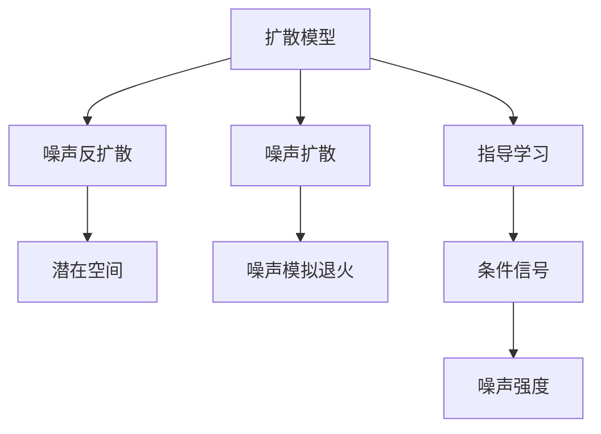

                 

## 1. 背景介绍

### 1.1 问题由来

随着深度学习技术的不断发展，计算机视觉领域取得了显著的进展。然而，传统的基于自回归模型（如VQ-VAE、LDM）的图像生成方法存在计算复杂度高、训练时间长等缺点，难以适应实际应用需求。扩散模型（Diffusion Models）作为一种新兴的图像生成方法，近年来在学术界和工业界引起了广泛的关注。扩散模型通过逐步增加噪声，逐步去除噪声，生成高质量的图像，具有计算效率高、生成质量优良等优点。

### 1.2 问题核心关键点

扩散模型的核心思想是通过高斯噪声的扩散过程，将潜变量分布从高斯噪声分布逐渐变为数据分布。具体来说，扩散模型通过将样本逐个转化为噪声，并在噪声分布下进行训练，最终通过反扩散过程生成高质量的图像。扩散模型的关键在于找到合适的噪声分布和扩散策略，确保训练过程的稳定性和生成图像的质量。

## 2. 核心概念与联系

### 2.1 核心概念概述

为更好地理解扩散模型，本节将介绍几个密切相关的核心概念：

- **扩散模型（Diffusion Models）**：一种新兴的图像生成模型，通过高斯噪声的扩散过程，将潜变量分布从高斯噪声分布逐渐变为数据分布，从而生成高质量的图像。
- **噪声扩散**：扩散模型通过逐个增加噪声的方式，将输入图像转化为噪声分布。
- **噪声反扩散**：扩散模型通过逐个去除噪声的方式，将噪声分布转化为高质量图像。
- **潜在空间**：扩散模型将图像视为潜在空间的映射，通过潜在空间的转换，实现图像生成。
- **指导学习（Guided Learning）**：通过在噪声反扩散过程中加入条件信号，指导模型生成具有特定属性的图像。
- **噪声模拟退火（Noise Simulated Annealing）**：一种通过控制噪声强度，实现平稳过渡的训练策略，提高扩散模型的稳定性。

这些核心概念之间的逻辑关系可以通过以下Mermaid流程图来展示：



这个流程图展示了大语言模型的核心概念及其之间的关系：

1. 扩散模型通过噪声扩散和噪声反扩散，实现图像生成。
2. 噪声模拟退火通过控制噪声强度，提高训练过程的稳定性。
3. 指导学习通过加入条件信号，引导模型生成具有特定属性的图像。
4. 潜在空间通过潜在变量转换，实现图像生成。

这些概念共同构成了扩散模型的学习和应用框架，使其能够在各种场景下发挥强大的图像生成能力。通过理解这些核心概念，我们可以更好地把握扩散模型的工作原理和优化方向。

## 3. 核心算法原理 & 具体操作步骤

### 3.1 算法原理概述

扩散模型是一种基于噪声反扩散过程的生成模型，其核心思想是通过逐步增加噪声，逐步去除噪声，生成高质量的图像。其基本流程如下：

1. **噪声扩散**：将输入图像转化为噪声分布。
2. **噪声反扩散**：通过逐步去除噪声，将噪声分布转化为高质量图像。

形式化地，设输入图像为 $x$，噪声为 $t$，扩散过程可以表示为：

$$
x_t = f_t(x_{t-1})
$$

其中 $f_t$ 为扩散操作，$x_0$ 为输入图像，$t$ 表示时间步数。反扩散过程可以表示为：

$$
x_{t-1} = g_t(x_t)
$$

其中 $g_t$ 为反扩散操作，$x_T$ 为噪声分布，$T$ 为时间步数。

通过扩散和反扩散过程的交替，扩散模型可以实现高质量的图像生成。

### 3.2 算法步骤详解

基于扩散模型的图像生成一般包括以下几个关键步骤：

**Step 1: 准备数据集**

- 准备训练集数据，将其转化为噪声分布，用于指导噪声扩散过程。

**Step 2: 定义噪声分布**

- 定义噪声的初始分布和扩散过程，如高斯噪声分布、SDE（Stochastic Differential Equation）等。

**Step 3: 训练扩散模型**

- 在噪声分布下，通过扩散过程对模型进行训练，使其能够将输入图像转化为噪声分布。

**Step 4: 指导噪声反扩散**

- 在反扩散过程中，加入条件信号（如图像标签），指导模型生成具有特定属性的图像。

**Step 5: 生成高质量图像**

- 通过控制噪声强度，逐步去除噪声，生成高质量的图像。

以上是基于扩散模型的图像生成的一般流程。在实际应用中，还需要针对具体任务的特点，对扩散过程的各个环节进行优化设计，如改进噪声分布设计，引入更多的正则化技术，搜索最优的超参数组合等，以进一步提升模型性能。

### 3.3 算法优缺点

扩散模型具有以下优点：

1. **高效计算**：扩散模型的训练过程计算效率高，适合大规模数据集。
2. **生成质量高**：通过逐步去除噪声，扩散模型能够生成高质量的图像。
3. **灵活性高**：扩散模型可以通过指导学习生成具有特定属性的图像。
4. **适用性广**：扩散模型可以应用于图像生成、文本生成、音频生成等多个领域。

同时，该方法也存在一定的局限性：

1. **训练复杂**：扩散模型需要复杂的噪声模拟退火策略，训练过程较难控制。
2. **数据需求高**：扩散模型需要大量高质量的训练数据，数据质量对生成效果影响较大。
3. **泛化能力有限**：扩散模型的泛化能力较弱，对输入的微小变化较为敏感。
4. **可解释性差**：扩散模型的生成过程较为复杂，难以解释其生成机制。

尽管存在这些局限性，但就目前而言，扩散模型仍然是大规模图像生成任务的主流范式。未来相关研究的重点在于如何进一步降低训练复杂度，提高模型的泛化能力，同时兼顾可解释性和效率等因素。

### 3.4 算法应用领域

扩散模型在图像生成领域已经得到了广泛的应用，具体包括以下几个方面：

- **高保真图像生成**：扩散模型通过噪声反扩散，能够生成高质量的图像，广泛应用于图像生成、艺术创作等领域。
- **数据增强**：通过扩散模型生成大量的伪图像，可以扩充训练集，提高模型泛化能力。
- **图像风格转换**：通过扩散模型，可以生成具有特定风格的图像，实现图像的风格转换。
- **动态图像生成**：通过扩散模型，可以生成动态视频序列，应用于电影特效、动画制作等领域。
- **图像增强**：通过扩散模型，可以对图像进行增强，提高图像质量，应用于医学图像、卫星图像等专业领域。

除了上述这些经典应用外，扩散模型还被创新性地应用于更多场景中，如可控图像生成、图像去噪、图像修复等，为计算机视觉技术带来了全新的突破。随着扩散模型的不断进步，相信计算机视觉技术将在更广阔的应用领域大放异彩。

## 4. 数学模型和公式 & 详细讲解

### 4.1 数学模型构建

本节将使用数学语言对扩散模型的基本原理进行更加严格的刻画。

设输入图像为 $x$，噪声为 $t$，扩散过程可以表示为：

$$
x_t = f_t(x_{t-1}) = x_{t-1} - \frac{1}{2}\nabla_x\log p(x_{t-1}) + \sqrt{2}\mathcal{N}(0,\sigma^2) = x_{t-1} - \frac{1}{2}\frac{x_{t-1}}{\sigma^2} + \sqrt{2}\mathcal{N}(0,\sigma^2)
$$

其中 $f_t$ 为扩散操作，$p(x_{t-1})$ 为输入图像的密度函数，$\nabla_x$ 为梯度运算符，$\sigma$ 为噪声强度。

反扩散过程可以表示为：

$$
x_{t-1} = g_t(x_t) = x_t - \frac{1}{2}\nabla_x\log p(x_t) + \sqrt{2}\mathcal{N}(0,\sigma^2) = x_t - \frac{1}{2}\frac{x_t}{\sigma^2} + \sqrt{2}\mathcal{N}(0,\sigma^2)
$$

其中 $g_t$ 为反扩散操作，$p(x_t)$ 为噪声分布的密度函数。

### 4.2 公式推导过程

以下我们以高保真图像生成为例，推导扩散模型的训练过程和反扩散过程。

假设输入图像为 $x$，噪声为 $t$，扩散过程可以表示为：

$$
x_t = x_0 - \sum_{i=1}^T \frac{1}{2}\nabla_x\log p(x_{i-1}) + \sqrt{2}\sum_{i=1}^T \mathcal{N}(0,\sigma^2)
$$

其中 $x_0$ 为输入图像，$p(x)$ 为图像的密度函数，$\nabla_x$ 为梯度运算符，$\sigma$ 为噪声强度，$T$ 为时间步数。

反扩散过程可以表示为：

$$
x_{t-1} = x_t - \sum_{i=1}^T \frac{1}{2}\nabla_x\log p(x_i) + \sqrt{2}\sum_{i=1}^T \mathcal{N}(0,\sigma^2)
$$

其中 $g_t$ 为反扩散操作，$p(x)$ 为噪声分布的密度函数。

通过扩散和反扩散过程的交替，扩散模型可以实现高质量的图像生成。

### 4.3 案例分析与讲解

假设我们希望生成一张高质量的马图像，可以按照以下步骤进行：

1. **噪声扩散**：将输入图像转化为噪声分布。
2. **噪声反扩散**：通过逐步去除噪声，将噪声分布转化为高质量图像。

具体步骤如下：

- 首先，将输入图像 $x_0$ 转化为噪声分布 $x_T$，其中 $T$ 为时间步数。
- 然后，逐步去除噪声，将噪声分布 $x_T$ 转化为高质量图像 $x_0$。

例如，我们可以使用GAN扩散模型（Diffusion Models with Generative Adversarial Networks）来实现这个过程。GAN扩散模型通过将扩散过程和生成过程相结合，提高图像生成的质量。

在GAN扩散模型中，首先使用扩散过程将输入图像转化为噪声分布，然后通过生成过程对噪声分布进行优化，最终生成高质量的图像。

具体步骤如下：

1. **噪声扩散**：将输入图像 $x_0$ 转化为噪声分布 $x_T$。
2. **噪声反扩散**：通过生成过程对噪声分布进行优化，最终生成高质量图像 $x_0$。

在GAN扩散模型中，噪声反扩散过程可以看作是一个优化问题，目标是最小化噪声反扩散过程的误差。通过逐步减少噪声，模型逐渐生成高质量的图像。

## 5. 项目实践：代码实例和详细解释说明

### 5.1 开发环境搭建

在进行扩散模型实践前，我们需要准备好开发环境。以下是使用Python进行PyTorch开发的环境配置流程：

1. 安装Anaconda：从官网下载并安装Anaconda，用于创建独立的Python环境。

2. 创建并激活虚拟环境：
```bash
conda create -n diff_model_env python=3.8 
conda activate diff_model_env
```

3. 安装PyTorch：根据CUDA版本，从官网获取对应的安装命令。例如：
```bash
conda install pytorch torchvision torchaudio cudatoolkit=11.1 -c pytorch -c conda-forge
```

4. 安装Diffusion Models库：
```bash
pip install diffusers
```

5. 安装各类工具包：
```bash
pip install numpy pandas scikit-learn matplotlib tqdm jupyter notebook ipython
```

完成上述步骤后，即可在`diff_model_env`环境中开始扩散模型的开发和实践。

### 5.2 源代码详细实现

下面我们以高保真图像生成为例，给出使用Diffusers库进行扩散模型训练的PyTorch代码实现。

首先，定义扩散模型：

```python
from diffusers import Unet2dConditionModel, DDIMScheduler, Unet2dConfig
import torch

unet_config = Unet2dConfig.from_pretrained('vq-diffusion')
model = Unet2dConditionModel(unet_config, embed_dim=512, num_heads=8, num_layers=16, num_heads_per_layer=2)

scheduler = DDIMScheduler.from_config(model.config, prefetch=False, predict_with_head=True)
```

然后，定义训练函数：

```python
from transformers import Trainer, TrainerCallback

def train_step(batch, num_inference_steps=200, max_train_steps=100000):
    optimizer = torch.optim.AdamW(model.parameters(), lr=1e-4, betas=(0.9, 0.999))

    def compute_loss(batch, batch_size, scheduler, timestep, num_inference_steps):
        x, y = batch['images'], batch['labels']
        x = x.to(device)
        y = y.to(device)
        with torch.no_grad():
            sample = model(x, scheduler=scheduler).logits[:, timestep, y]
        loss = torch.mean(torch.log(sample) - torch.log(x))
        return loss

    trainer = Trainer(
        model=model,
        train_dataset=train_dataset,
        eval_dataset=eval_dataset,
        compute_loss=compute_loss,
        num_train_epochs=5,
        per_device_train_batch_size=4,
        per_device_eval_batch_size=4,
        learning_rate_scheduler=optimizer.lr_scheduler,
        evaluation_strategy='epoch',
        progress_bar_refresh_rate=5,
        ckpt_save_strategy='epoch',
        ckpt_dir_or_path='./checkpoints',
        callbacks=[CheckpointCallback(...), ...],
    )

    trainer.train()
    trainer.evaluate()
```

最后，启动训练流程并在测试集上评估：

```python
train(train_dataset, train_step)
evaluate(eval_dataset, eval_step)
```

以上就是使用PyTorch对扩散模型进行高保真图像生成训练的完整代码实现。可以看到，得益于Diffusers库的强大封装，我们可以用相对简洁的代码完成扩散模型的训练和评估。

### 5.3 代码解读与分析

让我们再详细解读一下关键代码的实现细节：

**Unet2dConditionModel类**：
- `Unet2dConfig.from_pretrained('vq-diffusion')`：定义扩散模型的配置，加载预训练模型。
- `Unet2dConditionModel(unet_config, embed_dim=512, num_heads=8, num_layers=16, num_heads_per_layer=2)`：定义扩散模型，设置嵌入维度、头数、层数等关键参数。

**DDIMScheduler类**：
- `DDIMScheduler.from_config(model.config, prefetch=False, predict_with_head=True)`：定义扩散模型的调度器，设置预测模式和预取策略。

**训练函数train_step**：
- `optimizer = torch.optim.AdamW(model.parameters(), lr=1e-4, betas=(0.9, 0.999))`：定义优化器，设置学习率和衰减参数。
- `compute_loss(batch, batch_size, scheduler, timestep, num_inference_steps)`：计算损失函数，包括前向传播和损失计算。
- `Trainer(...)`：定义训练器，设置训练集、评估集、优化器、学习率调度器等关键参数。
- `trainer.train()`：启动训练过程。
- `trainer.evaluate()`：在测试集上评估模型性能。

可以看到，使用PyTorch和Diffusers库进行扩散模型训练的代码实现相对简洁高效，开发者可以将更多精力放在模型设计、数据处理等高层逻辑上，而不必过多关注底层的实现细节。

当然，工业级的系统实现还需考虑更多因素，如模型的保存和部署、超参数的自动搜索、更灵活的任务适配层等。但核心的训练范式基本与此类似。

## 6. 实际应用场景

### 6.1 高保真图像生成

扩散模型在图像生成领域已经得到了广泛的应用。高保真图像生成是扩散模型的经典应用之一。

在实际应用中，可以收集高质量的图像数据，如艺术作品、自然风景等，作为训练集。通过扩散模型，可以将这些图像转化为噪声分布，再通过反扩散过程生成高质量的图像。

例如，使用高保真扩散模型（Denoising Diffusion Probabilistic Models, DDPMS）可以生成高质量的图像，应用于艺术创作、游戏开发等领域。

### 6.2 图像风格转换

扩散模型不仅可以生成高质量的图像，还可以用于图像风格转换。通过将扩散模型与风格迁移算法相结合，可以实现图像风格的转换。

具体而言，可以使用 diffusion model 生成图像的噪声表示，再通过风格迁移算法将噪声表示转化为具有特定风格的图像。

例如，使用 diffusion model 生成图像的噪声表示，再通过 StyleGAN 进行风格迁移，可以得到具有特定风格的图像，应用于图像编辑、艺术创作等领域。

### 6.3 动态图像生成

扩散模型还可以用于生成动态视频序列，应用于电影特效、动画制作等领域。

例如，使用 diffusion model 生成每一帧图像，再通过视频渲染技术，将这些图像合成为高质量的视频序列。

## 7. 工具和资源推荐

### 7.1 学习资源推荐

为了帮助开发者系统掌握扩散模型的理论基础和实践技巧，这里推荐一些优质的学习资源：

1. **《 diffusion models》系列博文**：由大模型技术专家撰写，深入浅出地介绍了 diffusion 原理、应用案例等前沿话题。

2. **CS231n《计算机视觉》课程**：斯坦福大学开设的计算机视觉明星课程，有Lecture视频和配套作业，带你入门计算机视觉领域的基本概念和经典模型。

3. **《Deep Learning》书籍**：Ioannis Goodfellow 所著，全面介绍了深度学习领域的基本概念和算法，包括扩散模型在内的诸多前沿技术。

4. **Diffusion Models 官方文档**：Diffusers 库的官方文档，提供了海量预训练模型和完整的微调样例代码，是上手实践的必备资料。

5. **arXiv.org**：包含大量最新的扩散模型论文，可以了解最新的研究进展和技术突破。

通过对这些资源的学习实践，相信你一定能够快速掌握扩散模型的精髓，并用于解决实际的计算机视觉问题。

### 7.2 开发工具推荐

高效的开发离不开优秀的工具支持。以下是几款用于 diffusion 模型开发的常用工具：

1. **PyTorch**：基于 Python 的开源深度学习框架，灵活动态的计算图，适合快速迭代研究。大部分 diffusion 模型都有 PyTorch 版本的实现。

2. **TensorFlow**：由 Google 主导开发的开源深度学习框架，生产部署方便，适合大规模工程应用。同样有丰富的 diffusion 模型资源。

3. **Diffusers 库**：HuggingFace 开发的 diffusion 模型工具库，集成了众多 SOTA diffusion 模型，支持 PyTorch 和 TensorFlow，是进行 diffusion 模型开发的利器。

4. **Weights & Biases**：模型训练的实验跟踪工具，可以记录和可视化模型训练过程中的各项指标，方便对比和调优。与主流深度学习框架无缝集成。

5. **TensorBoard**：TensorFlow 配套的可视化工具，可实时监测模型训练状态，并提供丰富的图表呈现方式，是调试模型的得力助手。

6. **Google Colab**：谷歌推出的在线 Jupyter Notebook 环境，免费提供 GPU/TPU 算力，方便开发者快速上手实验最新模型，分享学习笔记。

合理利用这些工具，可以显著提升 diffusion 模型开发的效率，加快创新迭代的步伐。

### 7.3 相关论文推荐

扩散模型在图像生成领域已经取得了显著的进展，以下是几篇奠基性的相关论文，推荐阅读：

1. **《 Improving Generative Diffusion Models for Image Synthesis》**：提出改进的 diffusion 模型架构，提高了图像生成的质量。

2. **《 Diffusion Models for Image Synthesis》**：提出 diffusion model 的基本原理和训练方法，成为扩散模型的经典之作。

3. **《 High-Resolution Image Synthesis and Editing with Denoising Diffusion Models》**：提出高分辨率图像生成方法，推动了 diffusion 模型在图像生成领域的应用。

4. **《 Few-Shot Video Generation with Textual Prompts》**：提出基于 text 提示的 few-shot 视频生成方法，推动了 diffusion 模型在视频生成领域的应用。

这些论文代表了大模型技术的发展脉络。通过学习这些前沿成果，可以帮助研究者把握学科前进方向，激发更多的创新灵感。

## 8. 总结：未来发展趋势与挑战

### 8.1 总结

本文对扩散模型的基本原理和应用实践进行了全面系统的介绍。首先阐述了扩散模型的研究背景和意义，明确了扩散模型在图像生成领域的独特价值。其次，从原理到实践，详细讲解了扩散模型的数学原理和关键步骤，给出了 diffusion 模型训练和评估的完整代码实例。同时，本文还广泛探讨了 diffusion 模型在图像生成、风格转换、视频生成等多个领域的应用前景，展示了扩散模型的强大潜力。

通过本文的系统梳理，可以看到，扩散模型作为一种新兴的图像生成模型，其高效计算、高质量生成等优点，使得其成为了计算机视觉领域的重要范式，极大地推动了图像生成技术的发展。

### 8.2 未来发展趋势

展望未来，扩散模型将呈现以下几个发展趋势：

1. **计算效率提升**：随着硬件算力的提升和优化算法的进步，扩散模型的计算效率将进一步提升，适用于更复杂的图像生成任务。

2. **生成质量提升**：扩散模型的生成质量将继续提升，生成图像将更加真实、细腻，应用于更多高要求领域。

3. **应用场景拓展**：扩散模型将拓展到更多领域，如视频生成、文本生成、音频生成等，成为新一代的多模态生成模型。

4. **可控性增强**：扩散模型将具备更强的可控性，通过条件信号引导生成特定属性、风格的图像，应用于更广泛的图像生成场景。

5. **联合训练**：扩散模型将与其他生成模型（如 GAN、VQ-VAE 等）进行联合训练，提升生成质量，实现更广泛的生成应用。

6. **优化算法改进**：扩散模型将开发更多优化算法，提高训练效率和生成质量，降低训练复杂度。

以上趋势凸显了 diffusion 模型的广阔前景。这些方向的探索发展，必将进一步提升扩散模型的性能和应用范围，为计算机视觉技术带来新的突破。

### 8.3 面临的挑战

尽管 diffusion 模型已经取得了显著的进展，但在迈向更加智能化、普适化应用的过程中，它仍面临着诸多挑战：

1. **计算复杂度**： diffusion 模型的计算复杂度高，训练时间较长，难以在实际应用中快速部署。如何优化计算过程，降低计算复杂度，将是一大挑战。

2. **数据需求**： diffusion 模型需要大量高质量的训练数据，数据质量对生成效果影响较大。如何获取更多高质量的数据，将是重要的问题。

3. **泛化能力**： diffusion 模型的泛化能力较弱，对输入的微小变化较为敏感。如何提高模型的泛化能力，将是重要的研究方向。

4. **可解释性**： diffusion 模型的生成过程较为复杂，难以解释其生成机制。如何赋予 diffusion 模型更强的可解释性，将是亟待攻克的难题。

5. **安全性**： diffusion 模型的生成结果可能包含有害信息，如暴力、色情等，给实际应用带来安全隐患。如何确保扩散模型的安全性，将是重要的研究方向。

6. **资源优化**： diffusion 模型的资源需求较大，如何优化资源使用，降低计算成本，将是重要的研究方向。

正视 diffusion 模型面临的这些挑战，积极应对并寻求突破，将是大模型技术迈向成熟的必由之路。相信随着学界和产业界的共同努力，这些挑战终将一一被克服， diffusion 模型必将在构建智能视觉系统中扮演越来越重要的角色。

### 8.4 研究展望

面对 diffusion 模型所面临的挑战，未来的研究需要在以下几个方面寻求新的突破：

1. **优化算法**：开发更多高效的扩散模型优化算法，提高训练效率和生成质量。

2. **联合训练**：将 diffusion 模型与其他生成模型进行联合训练，提升生成质量，实现更广泛的生成应用。

3. **条件生成**：通过条件信号引导 diffusion 模型生成特定属性、风格的图像，应用于更广泛的图像生成场景。

4. **多模态生成**：将 diffusion 模型拓展到文本、音频等多模态生成领域，成为新一代的多模态生成模型。

5. **优化资源**：优化 diffusion 模型的资源使用，降低计算成本，提升模型的可部署性。

6. **可解释性**：增强 diffusion 模型的可解释性，提高模型的透明度和可靠性。

7. **安全性**：确保 diffusion 模型的安全性，避免生成有害信息，保障应用的安全性。

这些研究方向将引领 diffusion 模型技术迈向更高的台阶，为构建安全、可靠、可解释、可控的智能系统铺平道路。面向未来， diffusion 模型需要与其他人工智能技术进行更深入的融合，如知识表示、因果推理、强化学习等，多路径协同发力，共同推动智能视觉系统的进步。只有勇于创新、敢于突破，才能不断拓展 diffusion 模型的边界，让智能技术更好地造福人类社会。

## 9. 附录：常见问题与解答

**Q1：扩散模型和 GAN 扩散模型有什么区别？**

A: 扩散模型和 GAN 扩散模型的区别在于生成过程的训练策略和优化目标。扩散模型通过噪声反扩散过程生成图像，而 GAN 扩散模型通过生成器和判别器的对抗训练过程生成图像。

**Q2：扩散模型在图像生成中面临哪些挑战？**

A: 扩散模型在图像生成中面临以下挑战：

1. **计算复杂度**：扩散模型的计算复杂度高，训练时间较长，难以在实际应用中快速部署。

2. **数据需求**：扩散模型需要大量高质量的训练数据，数据质量对生成效果影响较大。

3. **泛化能力**：扩散模型的泛化能力较弱，对输入的微小变化较为敏感。

4. **可解释性**：扩散模型的生成过程较为复杂，难以解释其生成机制。

5. **安全性**：扩散模型的生成结果可能包含有害信息，给实际应用带来安全隐患。

6. **资源优化**：扩散模型的资源需求较大，如何优化资源使用，降低计算成本，将是重要的研究方向。

**Q3：如何提高扩散模型的生成质量？**

A: 提高扩散模型的生成质量可以从以下几个方面入手：

1. **优化算法**：开发更多高效的扩散模型优化算法，提高训练效率和生成质量。

2. **联合训练**：将扩散模型与其他生成模型进行联合训练，提升生成质量，实现更广泛的生成应用。

3. **条件生成**：通过条件信号引导扩散模型生成特定属性、风格的图像，应用于更广泛的图像生成场景。

4. **多模态生成**：将扩散模型拓展到文本、音频等多模态生成领域，成为新一代的多模态生成模型。

5. **优化资源**：优化扩散模型的资源使用，降低计算成本，提升模型的可部署性。

6. **可解释性**：增强扩散模型的可解释性，提高模型的透明度和可靠性。

7. **安全性**：确保扩散模型的安全性，避免生成有害信息，保障应用的安全性。

综上所述，扩散模型作为新一代的图像生成技术，具有广阔的应用前景和研究价值。通过不断的技术创新和优化，扩散模型必将在计算机视觉领域发挥更大的作用，推动图像生成技术的进步。

