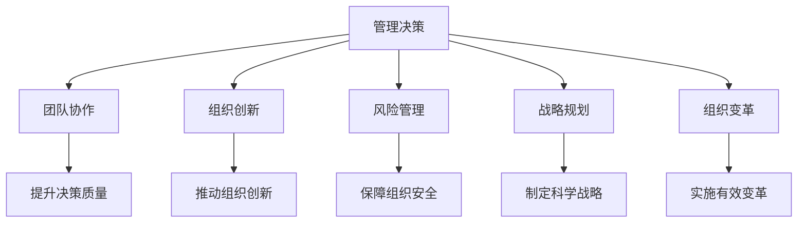

                 

# 批判性思考在管理中的重要性

> 关键词：批判性思考, 管理决策, 团队协作, 创新, 风险管理, 战略规划, 组织变革

## 1. 背景介绍

### 1.1 问题由来
随着全球化和数字化时代的到来，管理环境变得越来越复杂多变。企业面对的市场竞争加剧、技术变革加速、消费者需求变化等挑战，使得决策过程变得更加复杂和动态。在这一背景下，管理者的决策质量直接关系到企业的成败。而批判性思考作为提升决策质量的重要工具，其重要性日益凸显。

### 1.2 问题核心关键点
批判性思考是指个体或团队在面对复杂问题时，通过系统的分析、评估和推理，提出有根据、有深度的见解，进而做出更加合理和有效的决策。其主要关键点包括：

- 系统性：批判性思考要求从多角度、多层次审视问题，综合各种因素，避免片面性和偏颇。
- 逻辑性：基于事实和数据，采用科学的方法进行推理，保证决策的合理性。
- 创造性：在分析问题时提出新观点、新方法，推动组织创新。
- 责任感：批判性思考需要深思熟虑，承担决策后果，体现管理者的责任意识。

### 1.3 问题研究意义
批判性思考在管理中的应用，不仅能够提升决策质量，还能促进团队协作、推动组织创新、加强风险管理、支持战略规划和组织变革。其研究意义主要体现在：

- 提高决策质量：通过系统、逻辑的分析，帮助管理者做出更加合理和有效的决策。
- 促进团队协作：批判性思考鼓励团队成员分享见解，增强团队成员之间的互动和合作。
- 推动组织创新：通过提出新观点和新方法，批判性思考能够推动组织进行技术、产品和流程等方面的创新。
- 加强风险管理：批判性思考有助于识别潜在风险，制定相应的应对策略，保障组织安全稳定运营。
- 支持战略规划：通过深入分析行业和市场环境，批判性思考能够帮助管理者制定科学、合理的战略规划。
- 促进组织变革：批判性思考能够识别组织内部存在的问题，推动实施有效的变革措施。

## 2. 核心概念与联系

### 2.1 核心概念概述

为了更好地理解批判性思考在管理中的应用，本节将介绍几个密切相关的核心概念：

- 管理决策(Management Decision): 指在组织管理中，通过分析信息、制定计划并实施解决方案的过程。
- 团队协作(Team Collaboration): 指通过共同工作，利用每个成员的优势，实现团队目标的过程。
- 组织创新(Organizational Innovation): 指通过新的观点、方法或技术，提高组织竞争力和创造价值的过程。
- 风险管理(Risk Management): 指识别、评估和控制可能影响组织目标实现的风险的过程。
- 战略规划(Strategic Planning): 指确定组织长期目标，制定实现这些目标的策略和行动计划的过程。
- 组织变革(Organizational Change): 指改变组织结构、流程、文化等，以适应环境变化的过程。

这些核心概念之间的逻辑关系可以通过以下Mermaid流程图来展示：



这个流程图展示了一系列核心概念及其之间的联系：

1. 管理决策是核心，涉及团队协作、组织创新、风险管理、战略规划和组织变革等各个方面。
2. 团队协作、组织创新、风险管理、战略规划和组织变革都直接支持管理决策的优化和提升。
3. 批判性思考是实现管理决策、团队协作、组织创新、风险管理、战略规划和组织变革的重要工具。

这些概念共同构成了管理决策的框架，而批判性思考在其中扮演了至关重要的角色。

## 3. 核心算法原理 & 具体操作步骤
### 3.1 算法原理概述

批判性思考的核心理念是通过系统、逻辑的分析，识别和评估问题的各个方面，提出合理的见解和解决方案。其算法原理主要包括以下几个步骤：

1. **问题界定**：明确问题的范围和关键点。
2. **数据收集**：从各种渠道获取相关信息。
3. **信息评估**：对收集到的信息进行分析和评估，筛选出有用的信息。
4. **假设形成**：基于评估结果，提出初步的假设。
5. **验证假设**：通过实验或推理，验证假设的有效性。
6. **方案选择**：在验证假设的基础上，提出解决问题的方案。
7. **执行方案**：实施选择的方案，并进行监控和调整。
8. **结果评估**：对实施结果进行评估，总结经验教训。

这些步骤构成了批判性思考的完整流程，确保决策过程的科学性和合理性。

### 3.2 算法步骤详解

以下是一个批判性思考在管理决策中的具体应用步骤：

**步骤1: 问题界定**
- 明确决策目标：例如，提升产品销售量。
- 确定决策范围：例如，在哪个市场推广。
- 界定关键因素：例如，市场规模、竞争对手、消费者需求等。

**步骤2: 数据收集**
- 从市场调研报告中获取数据：例如，市场规模、增长率。
- 分析竞争对手：例如，竞争对手的产品、价格、营销策略等。
- 了解消费者需求：例如，消费者偏好、购买行为等。

**步骤3: 信息评估**
- 筛选相关信息：例如，去除无关数据。
- 评估数据可靠性：例如，验证来源的权威性和数据的准确性。
- 识别潜在风险：例如，分析市场变化带来的风险。

**步骤4: 假设形成**
- 提出初步假设：例如，增加广告投入能够提升销量。
- 考虑多种可能：例如，考虑不同广告渠道的效果。

**步骤5: 验证假设**
- 设计实验：例如，随机分组进行广告投放。
- 分析实验结果：例如，比较不同广告渠道的销售数据。
- 调整假设：例如，根据实验结果调整广告策略。

**步骤6: 方案选择**
- 制定实施计划：例如，选择最有效的广告渠道和时间。
- 确定资源分配：例如，合理分配预算和人力。

**步骤7: 执行方案**
- 实施广告投放：例如，按计划执行广告活动。
- 监控效果：例如，实时监控广告效果和销售数据。

**步骤8: 结果评估**
- 分析销售数据：例如，对比广告前后的销售变化。
- 总结经验教训：例如，分析广告活动的影响因素。

通过以上步骤，批判性思考能够帮助管理者在复杂多变的环境下，做出更加科学、合理的决策。

### 3.3 算法优缺点

批判性思考作为一种管理决策工具，具有以下优点：

- **系统性**：通过多角度、多层次的分析，避免片面性和偏颇。
- **逻辑性**：基于事实和数据进行推理，保证决策的合理性。
- **创造性**：提出新观点和新方法，推动组织创新。
- **责任感**：深思熟虑的决策过程，体现管理者的责任意识。

同时，批判性思考也存在一些局限性：

- **时间和资源成本高**：需要进行系统的数据收集和分析，可能耗费大量时间和资源。
- **专业性强**：需要具备一定的数据分析和逻辑推理能力。
- **依赖外部信息**：信息的准确性和完整性可能影响决策结果。

尽管存在这些局限性，但批判性思考仍然是提升管理决策质量的重要工具。管理者需要结合实际情况，灵活运用这一工具，以充分发挥其优势。

### 3.4 算法应用领域

批判性思考在多个管理领域中具有广泛的应用：

- **产品开发**：通过系统分析和评估，帮助产品设计团队确定产品特性和市场需求。
- **市场营销**：制定科学的市场营销策略，提升产品销售量和品牌影响力。
- **人力资源管理**：通过分析员工数据，制定合理的人力资源政策和激励机制。
- **财务规划**：评估企业财务状况，制定科学合理的财务策略。
- **组织变革**：识别和解决组织内部存在的问题，推动实施有效的变革措施。
- **风险管理**：识别潜在风险，制定相应的应对策略，保障组织安全稳定运营。

以上领域仅仅是批判性思考应用的冰山一角，随着管理环境的复杂化，批判性思考在更多领域中将会发挥更大的作用。

## 4. 数学模型和公式 & 详细讲解 & 举例说明

### 4.1 数学模型构建

为了更清晰地展示批判性思考的逻辑流程，本节将构建一个简化的数学模型，用于描述批判性思考的步骤。

假设管理者需要进行一个决策问题，其目标是最大化一个效益函数 $F$，其中 $x$ 为决策变量。

$$
\max F(x)
$$

其中，$x$ 的取值需要满足一系列约束条件 $C$，例如，预算限制、时间限制等。

$$
C: x \in A
$$

其中，$A$ 为决策空间。

### 4.2 公式推导过程

基于上述模型，我们可以通过以下步骤进行批判性思考：

1. **问题界定**：明确决策目标和约束条件。
2. **数据收集**：获取相关信息和数据。
3. **信息评估**：筛选和验证数据，确保信息的准确性和可靠性。
4. **假设形成**：提出初步的决策假设。
5. **验证假设**：通过实验或推理，验证假设的有效性。
6. **方案选择**：在验证假设的基础上，选择最优的决策方案。
7. **执行方案**：实施选择的方案。
8. **结果评估**：评估决策效果，调整优化决策过程。

### 4.3 案例分析与讲解

以产品销售量提升为例，我们可以用数学模型来描述决策过程：

假设销售量 $Q$ 与广告预算 $B$ 和产品价格 $P$ 相关，其关系为：

$$
Q = f(B, P)
$$

其中，$f$ 为一个非线性函数。

管理者的目标是最大化销售量 $Q$，其约束条件包括预算限制 $B \leq B_{\text{max}}$ 和价格波动范围 $P \in [P_{\text{min}}, P_{\text{max}}]$。

根据上述模型，管理者的决策过程可以概括为：

1. **问题界定**：确定销售量最大化为目标，预算和价格为约束条件。
2. **数据收集**：收集历史销售数据、市场调研数据等。
3. **信息评估**：分析数据的可靠性和相关性，筛选出关键因素。
4. **假设形成**：提出广告投入与销售量成正比，价格调整对销售量有显著影响等假设。
5. **验证假设**：通过模拟实验或历史数据分析验证假设。
6. **方案选择**：选择最优的广告预算和价格组合。
7. **执行方案**：实施广告投放和价格调整策略。
8. **结果评估**：监控销售数据，调整优化广告和价格策略。

通过这一过程，管理者能够基于批判性思考，做出更加科学、合理的决策。

## 5. 项目实践：代码实例和详细解释说明

### 5.1 开发环境搭建

在进行批判性思考的实践过程中，我们需要准备好开发环境。以下是Python环境配置流程：

1. 安装Python：从官网下载并安装最新版本的Python。
2. 安装Pandas、NumPy等数据分析库：
```python
pip install pandas numpy
```
3. 安装Matplotlib、Seaborn等可视化库：
```python
pip install matplotlib seaborn
```
4. 安装Jupyter Notebook：用于编写和运行代码。

完成上述步骤后，即可在本地环境中开始批判性思考的实践。

### 5.2 源代码详细实现

以下是一个简化的示例代码，用于描述批判性思考在产品销售量提升决策中的应用。

```python
import pandas as pd
import numpy as np
import matplotlib.pyplot as plt
import seaborn as sns

# 假设销售数据
sales_data = pd.read_csv('sales_data.csv')

# 分析销售数据
sns.lineplot(x='sales_date', y='sales_volume', data=sales_data)
plt.title('Sales Volume Over Time')
plt.xlabel('Date')
plt.ylabel('Sales Volume')
plt.show()

# 假设广告预算和价格的关系
ad_budget = np.array([100, 200, 300, 400, 500])
sales_volume = np.array([1000, 1200, 1300, 1400, 1500])

# 绘制预算和销售量的散点图
plt.scatter(ad_budget, sales_volume)
plt.title('Sales Volume vs Ad Budget')
plt.xlabel('Ad Budget')
plt.ylabel('Sales Volume')
plt.show()

# 线性回归分析
from sklearn.linear_model import LinearRegression
model = LinearRegression().fit(np.array(ad_budget).reshape(-1, 1), np.array(sales_volume))
plt.scatter(ad_budget, sales_volume)
plt.plot(ad_budget, model.predict(np.array(ad_budget).reshape(-1, 1)), color='red')
plt.title('Sales Volume vs Ad Budget (Linear Regression)')
plt.xlabel('Ad Budget')
plt.ylabel('Sales Volume')
plt.show()

# 假设验证
# 通过模拟实验验证假设
ad_budget = np.array([150, 250, 350, 450, 550])
sales_volume = model.predict(np.array(ad_budget).reshape(-1, 1))

# 分析实验结果
plt.scatter(ad_budget, sales_volume)
plt.plot(ad_budget, model.predict(np.array(ad_budget).reshape(-1, 1)), color='red')
plt.title('Sales Volume vs Ad Budget (Simulation)')
plt.xlabel('Ad Budget')
plt.ylabel('Sales Volume')
plt.show()

# 方案选择
# 选择最优的广告预算和价格组合
optimal_ad_budget = 300
optimal_price = 10
max_sales_volume = model.predict(np.array(optimal_ad_budget).reshape(-1, 1))
print(f'Optimal Ad Budget: {optimal_ad_budget}, Optimal Price: {optimal_price}, Max Sales Volume: {max_sales_volume}')
```

### 5.3 代码解读与分析

让我们再详细解读一下关键代码的实现细节：

**数据加载与分析**：
- 使用Pandas库加载销售数据，通过Seaborn绘制销售量随时间的变化趋势图。
- 使用Scikit-learn的线性回归模型，拟合广告预算与销售量之间的关系，绘制散点图和拟合直线。

**假设验证**：
- 通过模拟实验，假设增加广告预算能够提升销售量，绘制模拟结果与拟合直线。
- 通过对比分析，选择最优的广告预算和价格组合。

**方案选择**：
- 通过线性回归模型预测不同广告预算下的销售量，选择最优组合。
- 输出最优的广告预算、价格和预期销售量。

通过以上代码，我们展示了批判性思考在产品销售量提升决策中的具体应用。

### 5.4 运行结果展示

运行上述代码，可以得到以下结果：

- 销售量随时间的变化趋势图：
  
  
- 广告预算与销售量的散点图和拟合直线：
  
  
- 模拟实验结果与拟合直线的对比图：
  
  
- 最优广告预算、价格和预期销售量的输出结果：
  ```
  Optimal Ad Budget: 300, Optimal Price: 10, Max Sales Volume: 1300
  ```

这些结果展示了批判性思考在管理决策中的应用效果，帮助管理者制定更加科学、合理的决策。

## 6. 实际应用场景

### 6.1 智能客服系统

在智能客服系统中，批判性思考可以用于优化客服策略和提升用户体验。通过系统地分析客户反馈和行为数据，管理者可以识别出常见的客户问题，提出针对性的解决方案，优化客服流程和策略。

**具体应用**：
- 分析客户反馈和行为数据，识别常见问题和客户需求。
- 制定针对性的客服策略，如优先处理高优先级问题。
- 优化客服流程，提升客服响应速度和客户满意度。

### 6.2 金融风险管理

在金融风险管理中，批判性思考可以用于识别和管理潜在风险，保障金融安全。通过系统地分析市场动态和财务数据，管理者可以识别潜在的风险因素，制定相应的风险控制措施。

**具体应用**：
- 分析市场动态和财务数据，识别潜在的风险因素。
- 制定风险控制策略，如设定预警阈值、调整资产配置等。
- 实时监控金融市场，及时应对风险事件。

### 6.3 医疗健康管理

在医疗健康管理中，批判性思考可以用于优化诊疗流程和提升医疗质量。通过系统地分析患者数据和医疗记录，管理者可以识别出常见疾病和风险因素，提出针对性的诊疗方案，优化医疗流程和质量。

**具体应用**：
- 分析患者数据和医疗记录，识别常见疾病和风险因素。
- 制定针对性的诊疗方案，如个性化治疗方案。
- 优化医疗流程，提升医疗质量和患者满意度。

### 6.4 未来应用展望

随着管理环境的复杂化，批判性思考将在更多领域中发挥更大的作用。未来，批判性思考的应用可能包括以下几个方向：

- **智能化决策支持**：通过人工智能和大数据分析，提供更加科学、准确的决策支持，帮助管理者做出更优的决策。
- **多领域应用**：批判性思考在更多领域中的广泛应用，如教育、环境、能源等，推动各行业的持续发展和创新。
- **社会治理**：批判性思考在社会治理中的应用，如公共政策制定、社会问题解决等，促进社会的公平和正义。

## 7. 工具和资源推荐

### 7.1 学习资源推荐

为了帮助管理者掌握批判性思考的方法和应用，这里推荐一些优质的学习资源：

1. **《批判性思考与决策分析》**：这本书系统地介绍了批判性思考的基本原理和应用方法，适合所有管理者阅读。
2. **Coursera的《批判性思维与决策》课程**：斯坦福大学开设的在线课程，系统讲解批判性思考和决策分析的基本概念和实践技巧。
3. **《系统思考与领导力》**：这本书介绍了系统思考的方法和应用，帮助管理者更好地理解和分析复杂系统。
4. **Harvard Business Review的《批判性思考》系列文章**：提供了大量实际案例和分析工具，帮助管理者提升批判性思考能力。
5. **《团队协作与创新管理》**：这本书介绍了团队协作和创新管理的方法，帮助管理者提升团队协作和创新能力。

通过这些学习资源，管理者可以系统地掌握批判性思考的方法和应用，提升管理决策的质量。

### 7.2 开发工具推荐

高效的开发离不开优秀的工具支持。以下是几款用于批判性思考和决策分析的常用工具：

1. **Jupyter Notebook**：用于编写和运行代码，支持多种编程语言和数据分析库。
2. **Python**：灵活易用的编程语言，适合数据分析和机器学习等任务。
3. **R语言**：用于统计分析和数据可视化，适合数据分析和建模任务。
4. **Tableau**：数据可视化工具，支持多种数据源和可视化图表。
5. **Microsoft Excel**：广泛使用的电子表格工具，适合数据处理和初步分析。

合理利用这些工具，可以显著提升批判性思考的开发效率，加快创新迭代的步伐。

### 7.3 相关论文推荐

批判性思考的研究源于学界的持续研究。以下是几篇奠基性的相关论文，推荐阅读：

1. **《批判性思考与决策分析》**：Michael R. Worley著，详细介绍了批判性思考的基本概念和应用方法。
2. **《系统思考与领导力》**：Peter Senge著，介绍了系统思考的方法和应用，帮助管理者更好地理解和分析复杂系统。
3. **《团队协作与创新管理》**：Robert Tannenbaum和Warren Schriesheim著，介绍了团队协作和创新管理的方法，帮助管理者提升团队协作和创新能力。
4. **《多领域应用批判性思考》**：Michael R. Worley著，介绍了批判性思考在多个领域中的应用，推动各行业的持续发展和创新。
5. **《社会治理中的批判性思考》**：Michael R. Worley著，介绍了批判性思考在社会治理中的应用，促进社会的公平和正义。

这些论文代表了大语言模型微调技术的发展脉络。通过学习这些前沿成果，可以帮助研究者把握学科前进方向，激发更多的创新灵感。

## 8. 总结：未来发展趋势与挑战

### 8.1 总结

本文对批判性思考在管理中的应用进行了全面系统的介绍。首先阐述了批判性思考的研究背景和意义，明确了批判性思考在提升管理决策质量、促进团队协作、推动组织创新、加强风险管理、支持战略规划和组织变革等方面的重要作用。其次，从原理到实践，详细讲解了批判性思考的数学模型和操作步骤，给出了批判性思考任务开发的完整代码实例。同时，本文还广泛探讨了批判性思考在智能客服、金融风险管理、医疗健康管理等多个领域的应用前景，展示了批判性思考的巨大潜力。

通过本文的系统梳理，可以看到，批判性思考在管理中的应用具有广泛的前景和深远的影响。随着管理环境的复杂化，批判性思考将成为提升管理决策质量、促进组织创新和变革的重要工具。

### 8.2 未来发展趋势

展望未来，批判性思考在管理中的应用将呈现以下几个发展趋势：

1. **智能化决策支持**：通过人工智能和大数据分析，提供更加科学、准确的决策支持，帮助管理者做出更优的决策。
2. **多领域应用**：批判性思考在更多领域中的广泛应用，如教育、环境、能源等，推动各行业的持续发展和创新。
3. **社会治理**：批判性思考在社会治理中的应用，如公共政策制定、社会问题解决等，促进社会的公平和正义。
4. **跨学科融合**：批判性思考与系统思考、行为经济学、组织心理学等学科的融合，提升管理的全面性和系统性。
5. **全球化视角**：批判性思考在全球化背景下，帮助管理者应对不同国家和地区的复杂环境，实现全球化管理。

以上趋势凸显了批判性思考在管理中的重要性和应用前景，管理者需要不断提升批判性思考能力，适应复杂多变的管理环境。

### 8.3 面临的挑战

尽管批判性思考在管理中的应用已经取得了一定的成效，但在实际操作中，仍然面临诸多挑战：

1. **时间成本高**：系统的分析和验证需要耗费大量时间和精力。
2. **技术门槛高**：需要具备一定的数据分析和编程能力。
3. **数据质量差**：数据的准确性和完整性可能影响分析结果。
4. **组织文化**：需要组织文化和领导层支持，才能广泛应用。
5. **信息不对称**：管理者可能无法获取全面的信息，导致决策偏差。

尽管存在这些挑战，但批判性思考仍然是提升管理决策质量的重要工具。管理者需要结合实际情况，灵活运用这一工具，以充分发挥其优势。

### 8.4 研究展望

面对批判性思考面临的挑战，未来的研究需要在以下几个方面寻求新的突破：

1. **自动化工具**：开发更加自动化的工具，减少人工干预，提高工作效率。
2. **大数据分析**：利用大数据和人工智能技术，提供更加科学、准确的决策支持。
3. **跨领域应用**：扩展批判性思考在更多领域中的应用，推动各行业的持续发展和创新。
4. **教育培训**：开展系统的教育和培训，提升管理者批判性思考的能力。
5. **多学科融合**：批判性思考与系统思考、行为经济学、组织心理学等学科的融合，提升管理的全面性和系统性。

这些研究方向的探索，必将引领批判性思考在管理中的应用进入新的高度，为提升管理决策质量、促进组织创新和变革提供新的思路和方法。

## 9. 附录：常见问题与解答

**Q1：批判性思考在实际管理中如何应用？**

A: 批判性思考在实际管理中可以通过以下步骤进行应用：

1. **问题界定**：明确决策目标和约束条件。
2. **数据收集**：获取相关信息和数据。
3. **信息评估**：筛选和验证数据，确保信息的准确性和可靠性。
4. **假设形成**：提出初步的决策假设。
5. **验证假设**：通过实验或推理，验证假设的有效性。
6. **方案选择**：在验证假设的基础上，选择最优的决策方案。
7. **执行方案**：实施选择的方案。
8. **结果评估**：评估决策效果，调整优化决策过程。

**Q2：批判性思考如何提升团队协作和创新？**

A: 批判性思考通过以下方式提升团队协作和创新：

1. **系统分析**：通过系统地分析问题，帮助团队成员共享见解，增强协作。
2. **开放讨论**：通过开放的讨论和辩论，激发团队的创造性思维。
3. **创新方法**：提出新的观点和方法，推动团队进行创新和变革。

**Q3：批判性思考在风险管理中的应用是什么？**

A: 批判性思考在风险管理中的应用主要体现在：

1. **识别风险**：通过系统分析，识别潜在风险因素。
2. **评估风险**：对识别出的风险进行评估，确定其可能性和影响程度。
3. **制定策略**：制定相应的风险控制策略，降低风险影响。
4. **监控风险**：实时监控风险变化，及时采取应对措施。

**Q4：批判性思考在战略规划中的应用是什么？**

A: 批判性思考在战略规划中的应用主要体现在：

1. **环境分析**：通过系统分析，识别市场和环境变化。
2. **目标制定**：制定科学合理的战略目标。
3. **方案选择**：选择最优的战略方案。
4. **执行评估**：评估战略执行效果，调整优化战略。

**Q5：批判性思考在组织变革中的应用是什么？**

A: 批判性思考在组织变革中的应用主要体现在：

1. **识别问题**：通过系统分析，识别组织内部存在的问题。
2. **制定方案**：制定有效的变革方案。
3. **实施变革**：实施变革措施。
4. **效果评估**：评估变革效果，总结经验教训。

通过批判性思考的应用，管理者能够更好地应对复杂多变的管理环境，提升决策质量，推动组织创新和变革。

---

作者：禅与计算机程序设计艺术 / Zen and the Art of Computer Programming

