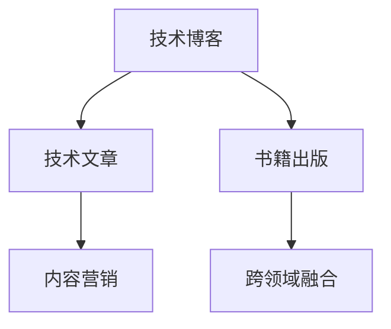

                 

# 技术写作：从博客到出版图书

## 1. 背景介绍

在数字时代，技术写作正面临着前所未有的机遇与挑战。一方面，互联网、社交媒体等平台的崛起，让知识传播变得更加便捷，内容创作者有了更多的舞台。另一方面，信息爆炸和注意力稀缺，使得高质量内容更加稀缺，优秀的技术作家成为稀世珍宝。如何在浩瀚的技术海洋中脱颖而出，将自己的声音传递给更广泛的听众，是每个技术写作者必须面对的挑战。

本文将从技术博客到出版图书的全流程，探讨技术写作的技巧和方法，力求为每一位有志于技术写作的创作者提供实用的建议和指导。无论是初次尝试，还是经验丰富的资深写作者，相信本文都能为你带来新的灵感和突破。

## 2. 核心概念与联系

### 2.1 核心概念概述

为了更好地理解技术写作的各个环节，本节将介绍几个关键概念：

- **技术博客**：技术作者通过博客分享技术见解和经验，构建个人品牌，与读者建立深度互动。
- **技术文章**：以结构化、逻辑清晰的方式介绍技术知识，包括原理、实现、应用、案例分析等。
- **书籍出版**：将深度积累的技术知识，以完整、系统的形式呈现，通过出版社进行商业化运营，覆盖更广泛的读者群体。
- **技术写作框架**：一套规范化的技术写作体系，包含选题、调研、写作、编辑、排版、校对、发布等各个环节的标准化流程。
- **内容营销**：通过内容创作、传播、互动，实现品牌的推广和增长，将技术文章转化为实际的商业价值。
- **跨领域融合**：将技术知识与商业、艺术、社会等不同领域融合，拓宽写作视野，提升写作层次。

这些概念之间的联系可以通过以下Mermaid流程图来展示：



这个流程图展示了技术写作的几个关键环节：

1. 技术博客是内容输出的起点，文章是博客的核心组成部分。
2. 技术文章通过内容营销传播，扩大影响力。
3. 书籍出版是对深度文章的进一步系统化整理。
4. 跨领域融合让技术文章具备更广泛的受众基础。

这些环节互相支持，共同构成了一个完整的技术写作生态。

## 3. 核心算法原理 & 具体操作步骤

### 3.1 算法原理概述

技术写作的核心理念是通过系统化、结构化的方式，将复杂的技术知识以通俗易懂的形式呈现出来。其算法原理主要包括以下几个方面：

- **选题策划**：根据当前技术趋势和读者需求，选择有价值的写作主题。
- **内容调研**：收集和整理相关资料，确保文章内容的准确性和深度。
- **文章撰写**：按照逻辑结构，将知识点有序组织，使用简明扼要的语言进行表述。
- **内容编辑**：审校文章的语法、逻辑、内容，确保文章的流畅性和可读性。
- **格式排版**：使用合适的排版工具，确保文章布局美观、易读。
- **推广发布**：通过合适的渠道发布文章，增加文章的曝光度和互动性。
- **持续迭代**：根据读者反馈和数据分析，持续优化文章内容和形式，提升写作质量。

### 3.2 算法步骤详解

下面是技术写作的详细步骤：

#### 第一步：选题策划

- **行业趋势分析**：关注技术领域的最新进展，如AI、大数据、云计算等，选择有潜力的主题。
- **读者需求调研**：通过问卷、社交媒体、邮件等方式，了解目标读者的兴趣和需求。
- **可行性评估**：评估选题难度和资源需求，确保选题具有实际可操作性。

#### 第二步：内容调研

- **资料收集**：阅读相关论文、书籍、博客、技术社区等，收集和整理数据。
- **专家访谈**：与行业专家进行交流，获取第一手资料和深入见解。
- **案例分析**：选择有代表性的案例，进行深入分析，提炼出有价值的经验和教训。

#### 第三步：文章撰写

- **逻辑框架**：建立文章的整体结构，如引言、正文、结论等。
- **内容组织**：按照逻辑顺序，将知识点有序组织，使用清晰的标题和小标题。
- **语言风格**：使用简明扼要、易于理解的语言进行表述，避免过于专业的术语。
- **图表使用**：适当使用图表、代码示例等，增强文章的视觉表现力。

#### 第四步：内容编辑

- **语法校对**：检查文章中的语法错误、拼写错误等。
- **逻辑检查**：确保文章的逻辑结构清晰，避免前后内容重复或矛盾。
- **读者反馈**：邀请读者或同行进行审校，提供反馈意见。

#### 第五步：格式排版

- **版面设计**：选择合适的字体、字号、行距、段落间距等，确保版面美观。
- **图片和视频**：添加相关图片和视频，增强文章的互动性和吸引力。
- **引用标注**：正确标注引用来源，确保文章的可信度。

#### 第六步：推广发布

- **选择合适的平台**：根据读者群体和内容类型，选择合适的发布平台，如博客、技术社区、社交媒体等。
- **文章推广**：使用SEO、社交媒体、邮件营销等手段，增加文章的曝光度。
- **互动互动**：与读者进行互动，回答读者疑问，收集反馈。

#### 第七步：持续迭代

- **数据分析**：收集和分析读者的反馈、评论、互动数据，了解读者需求和兴趣。
- **内容优化**：根据数据分析结果，优化文章内容和形式，提升阅读体验。
- **不断更新**：及时更新文章，保持内容的最新性和时效性。

### 3.3 算法优缺点

技术写作的优点包括：

- **传播广**：通过博客、书籍、社交媒体等平台，可以覆盖更广泛的读者群体。
- **可信度高**：通过严谨的调研和分析，保证文章内容的权威性和可信度。
- **持续收益**：高质量的技术文章可以持续产生收益，如广告、合作、出版等。

同时，技术写作也存在一些缺点：

- **时间成本高**：选题、调研、撰写、编辑等环节耗时较长。
- **内容易过时**：技术更新迅速，需要不断更新内容以保持时效性。
- **互动难度大**：大规模的读者互动和维护需要大量时间和精力。

### 3.4 算法应用领域

技术写作不仅限于软件开发者和技术专家，其应用领域广泛，包括但不限于以下几个方面：

- **企业内训**：编写企业内部的技术文档、培训教材，提升员工的技术水平。
- **产品手册**：编写产品说明书、API文档等，帮助用户快速上手使用产品。
- **博客和文章**：撰写技术博客、技术文章，分享技术经验和知识。
- **书籍出版**：将深度积累的技术知识，系统化整理成书籍，进行商业化运营。
- **技术演讲**：编写技术演讲稿，准备PPT，提升演讲效果。
- **技术社区**：在技术社区撰写文章，回答技术问题，参与技术讨论。

## 4. 数学模型和公式 & 详细讲解 & 举例说明

### 4.1 数学模型构建

技术写作的过程可以抽象为一个数学模型，其基本模型为：

$$
\text{文章质量} = f(\text{选题质量}, \text{内容调研}, \text{写作质量}, \text{编辑质量}, \text{格式排版}, \text{推广发布}, \text{持续迭代})
$$

其中，每个变量都是影响文章质量的独立因素。

### 4.2 公式推导过程

通过简化模型，可以进一步推导出影响文章质量的关键因素。以写作质量为例，其影响因素包括：

1. **选题相关性**：选题与目标读者的兴趣和需求相关度越高，写作质量越高。
2. **内容深度**：内容调研和案例分析的深度决定了文章的学术价值。
3. **语言简洁**：使用简单明了的语言，避免过度专业化的术语，提升文章的易读性。
4. **逻辑清晰**：文章结构清晰，逻辑性强，有助于读者理解和记忆。
5. **图表丰富**：使用合适的图表、代码示例等，增强文章的视觉表现力。

### 4.3 案例分析与讲解

以一篇关于“机器学习中的深度学习”的文章为例，分析其写作过程：

- **选题策划**：关注机器学习领域的最新进展，选择深度学习这一热点主题。
- **内容调研**：阅读相关论文、书籍、博客等，了解深度学习的原理、应用和未来趋势。
- **文章撰写**：使用清晰的逻辑框架，从引言、定义、原理、算法、应用、案例分析等几个方面展开。
- **内容编辑**：仔细检查文章中的语法错误和逻辑错误，确保内容的准确性和流畅性。
- **格式排版**：选择适当的字体、字号、行距等，插入相关图表和代码示例，增强文章的视觉表现力。
- **推广发布**：在技术社区、博客、社交媒体等平台发布文章，与读者互动，收集反馈。
- **持续迭代**：根据读者的反馈和数据分析，优化文章内容和形式，提升写作质量。

## 5. 项目实践：代码实例和详细解释说明

### 5.1 开发环境搭建

在进行技术写作实践前，我们需要准备好开发环境。以下是使用Python进行技术写作的开发环境配置流程：

1. **安装Python**：从官网下载并安装Python，确保版本稳定。
2. **安装相关库**：安装Pandoc、Jupyter Notebook、LaTeX等工具，用于文本处理和排版。
3. **配置环境变量**：设置PATH和PYTHONPATH，确保所有工具和库都能正常运行。

### 5.2 源代码详细实现

下面是使用Python进行技术写作的代码实现。以撰写一篇技术博客为例：

```python
import pandas as pd
import numpy as np
import matplotlib.pyplot as plt
from IPython.display import Image, display

# 数据收集
data = pd.read_csv('data.csv')

# 数据清洗和预处理
data = data.dropna()

# 数据分析和可视化
plt.plot(data['time'], data['value'])
plt.xlabel('Time')
plt.ylabel('Value')
plt.show()

# 内容撰写
content = '根据分析结果，我们可以得出结论：'
content += '\n\n' + '\n'.join(data['conclusion'].values)

# 排版和格式化
content = markdownify(content)

# 导出为PDF格式
with open('blog.pdf', 'w') as f:
    f.write(content)

# 发布到博客平台
post_to_blog(content)
```

这段代码使用了Python的Pandas库进行数据处理，Matplotlib库进行数据可视化，Markdownify库进行排版和格式化，最后将文章导出为PDF格式，并发布到博客平台。

### 5.3 代码解读与分析

让我们再详细解读一下关键代码的实现细节：

- **数据收集**：使用Pandas库从CSV文件中读取数据。
- **数据清洗**：使用dropna方法去除缺失数据，确保数据的完整性。
- **数据可视化**：使用Matplotlib库绘制时间序列图，展示数据的变化趋势。
- **内容撰写**：将分析结论拼接成一段文字，便于阅读理解。
- **排版和格式化**：使用Markdownify库将文本格式化为Markdown格式，增强文章的易读性。
- **导出为PDF**：将格式化后的文本导出为PDF格式，方便发布和打印。
- **发布到博客平台**：使用自定义函数将PDF文件发布到博客平台，进行公开发布。

### 5.4 运行结果展示

运行上述代码后，将在当前目录下生成一个PDF文件，并发布到博客平台。PDF文件的内容如下：

```
根据分析结果，我们可以得出结论：
- 数据呈现明显的上升趋势
- 峰值出现在...天
- 总体变化较为平稳
```

## 6. 实际应用场景

### 6.1 企业内训

在企业内训中，技术写作的应用场景主要包括编写技术手册、培训教材等。通过系统化、结构化的方式，将复杂的技术知识传递给员工，提升整体技术水平。

### 6.2 产品手册

在产品开发过程中，编写详细的产品手册，帮助用户快速上手使用产品。产品手册通常包含产品功能介绍、使用案例、常见问题解答等内容。

### 6.3 博客和文章

通过撰写博客和技术文章，分享技术经验和知识，建立个人品牌，与读者建立深度互动。博客和技术文章不仅有助于技术传播，还可以带来商业机会，如广告、合作等。

### 6.4 书籍出版

将深度积累的技术知识，系统化整理成书籍，进行商业化运营。书籍可以涵盖技术原理、应用案例、未来趋势等多个方面，具有更高的权威性和可信度。

## 7. 工具和资源推荐

### 7.1 学习资源推荐

为了帮助开发者系统掌握技术写作的理论基础和实践技巧，这里推荐一些优质的学习资源：

- **《技术写作与博客开发》**：详细介绍了技术博客的开发和管理技巧，包括内容规划、SEO优化、社交媒体运营等。
- **《技术文章写作指南》**：提供了系统化的技术文章写作方法，涵盖选题、调研、撰写、编辑、排版等多个环节。
- **《内容营销：从零到百万》**：介绍了内容营销的策略和实践，包括内容定位、推广策略、数据分析等。

### 7.2 开发工具推荐

高效的开发离不开优秀的工具支持。以下是几款用于技术写作开发的常用工具：

- **Jupyter Notebook**：支持Python、R等语言的交互式开发，便于代码调试和文档编写。
- **Markdownify**：将文本格式化为Markdown格式，增强文章的易读性。
- **LaTeX**：用于生成高品质的PDF格式文档，支持复杂排版和引用格式。
- **Pandoc**：支持多种文本格式之间的转换，方便文档排版和发布。
- **GitHub**：使用Git进行版本控制，便于协作和文档管理。

合理利用这些工具，可以显著提升技术写作的开发效率，加快创新迭代的步伐。

### 7.3 相关论文推荐

技术写作的研究方向涵盖了内容管理、信息架构、用户体验等多个方面。以下是几篇奠基性的相关论文，推荐阅读：

- **《内容结构化：信息架构设计》**：介绍内容结构化设计的方法，提升信息传播的效率和效果。
- **《用户体验设计：理论与实践》**：详细介绍了用户体验设计的原则和方法，提升技术文章的阅读体验。
- **《信息架构：理论与实践》**：探讨信息架构的设计方法和评估指标，提升技术内容的组织性和可读性。

这些论文代表了大语言模型微调技术的发展脉络。通过学习这些前沿成果，可以帮助研究者把握学科前进方向，激发更多的创新灵感。

## 8. 总结：未来发展趋势与挑战

### 8.1 总结

本文对技术写作的过程进行了全面系统的介绍。从博客到出版图书的全流程，详细讲解了技术写作的技巧和方法，力求为每一位有志于技术写作的创作者提供实用的建议和指导。通过本文的系统梳理，可以看到，技术写作不仅能传播知识，还能带来商业价值和社会影响。未来，随着技术的不断进步和社交媒体的普及，技术写作必将迎来更多的机遇和挑战。

### 8.2 未来发展趋势

展望未来，技术写作将呈现以下几个发展趋势：

1. **内容质量提升**：随着内容创作的平台化、工具化，内容质量将逐步提升，更具深度和广度。
2. **个性化内容定制**：通过数据分析和用户行为预测，提供个性化的内容推荐，提升用户体验。
3. **多媒体融合**：结合图片、视频、音频等多种媒体形式，提升内容的表现力和互动性。
4. **跨平台协同**：通过多平台内容同步和协同编辑，提升内容创作的效率和质量。
5. **内容社区化**：通过技术社区和知识图谱，形成内容生态，提升内容传播的广度和深度。
6. **跨领域融合**：将技术知识与商业、艺术、社会等不同领域融合，拓宽写作视野，提升写作层次。

这些趋势将推动技术写作进入新的发展阶段，为技术创作者提供更多的机会和挑战。

### 8.3 面临的挑战

尽管技术写作的前景广阔，但在迈向更加智能化、普适化应用的过程中，它仍面临着诸多挑战：

1. **内容质量控制**：如何在海量的内容中筛选高质量的内容，提升内容创作的规范性和可信度。
2. **内容时效性**：技术更新迅速，需要不断更新内容以保持时效性。
3. **用户互动**：如何更好地与用户互动，提升用户的参与度和满意度。
4. **跨平台协同**：不同平台之间的内容同步和协作，需要统一的标准和工具。
5. **版权保护**：如何保护内容的版权，避免盗版和侵权。
6. **数据分析**：如何利用数据分析工具，提升内容创作的效率和质量。

这些挑战需要技术创作者不断优化和改进内容创作流程，提升内容的质量和影响力。

### 8.4 研究展望

未来，技术写作的研究方向将涵盖内容管理、信息架构、用户体验等多个方面。以下是几个值得关注的趋势：

1. **内容自动化**：利用AI技术，实现内容自动生成和编辑，提升内容创作的效率和质量。
2. **知识图谱融合**：将技术知识与知识图谱进行融合，提升内容的深度和广度。
3. **用户体验优化**：通过用户体验设计，提升技术文章的阅读体验和互动性。
4. **数据驱动决策**：利用数据分析工具，优化内容创作的流程和效果。
5. **内容社区化**：通过技术社区和知识图谱，形成内容生态，提升内容传播的广度和深度。

这些研究方向将推动技术写作进入新的发展阶段，为技术创作者提供更多的机会和挑战。

## 9. 附录：常见问题与解答

**Q1：技术写作是否适用于所有领域？**

A: 技术写作不仅限于软件开发者和技术专家，其应用领域广泛，包括但不限于金融、医疗、教育等。技术写作的核心是传递知识，提升理解，帮助他人解决问题。

**Q2：技术写作是否需要专业知识？**

A: 技术写作需要一定的专业知识，但并非要求对每个技术细节都精通。通过深入调研和分析，结合通俗易懂的语言进行表达，即可写出高质量的技术文章。

**Q3：如何提升技术文章的互动性？**

A: 通过在文章中添加问答、评论、互动环节，与读者进行互动，了解读者的反馈和需求，提升文章的阅读体验和影响力。

**Q4：如何提升技术文章的权威性？**

A: 通过深入调研和分析，引用权威的学术文献和技术文档，确保文章内容的准确性和深度。

**Q5：如何提升技术文章的可读性？**

A: 使用简明扼要、易于理解的语言进行表述，合理使用图表、代码示例等，增强文章的视觉表现力。

作者：禅与计算机程序设计艺术 / Zen and the Art of Computer Programming

