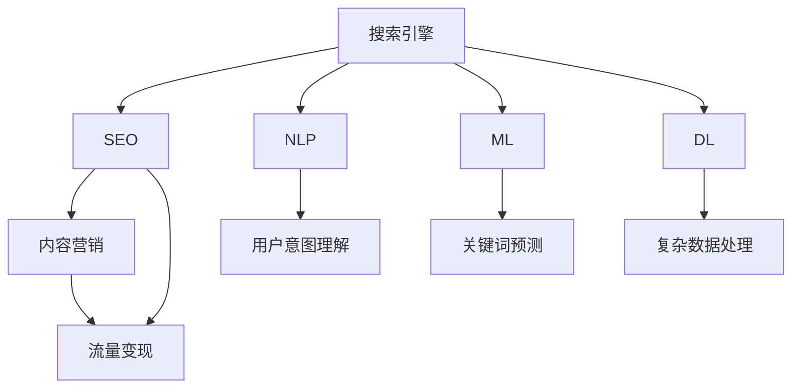

                 

# 技术博客：SEO优化与流量变现

> 关键词：SEO优化,流量变现,内容营销,搜索引擎,自然语言处理,机器学习,深度学习

## 1. 背景介绍

### 1.1 问题由来
在数字营销的浪潮中，搜索引擎优化（SEO）已成为企业获取高质量流量和提高品牌知名度的重要手段。SEO不仅能够提升网站在搜索引擎中的排名，还能引导用户进行有价值的点击和转化。但传统SEO往往受限于算法更新、内容质量、关键词竞争等因素，难以实现长期稳定的流量增长。

随着技术的发展，新兴的AI技术，尤其是自然语言处理（NLP）和机器学习（ML），为SEO带来了新的机会和挑战。这些技术不仅能自动化优化内容，还能根据用户行为实时调整策略，提升流量变现能力。本文将系统介绍如何利用AI技术，特别是NLP和ML，优化SEO策略，实现流量变现的最大化。

### 1.2 问题核心关键点
SEO优化与流量变现的核心在于：
1. **提升内容质量**：通过AI技术分析用户需求，生成高质量、高相关性的内容，吸引并留住用户。
2. **优化关键词策略**：利用机器学习预测热门关键词，合理分配资源，提高内容搜索排名。
3. **个性化推荐**：利用NLP技术分析用户兴趣，提供个性化的搜索结果和内容推荐，增加用户互动。
4. **实时调整**：通过监控分析用户行为，利用AI技术实时调整SEO策略，确保最佳效果。

## 2. 核心概念与联系

### 2.1 核心概念概述

为更好地理解SEO优化与流量变现的技术范式，本节将介绍几个密切相关的核心概念：

- **搜索引擎(Search Engine)**：如Google、Bing等，负责收集网页内容、为用户提供搜索结果的机制。
- **SEO(搜索引擎优化)**：通过优化网站结构和内容，提升其在搜索引擎中的排名，从而增加流量的手段。
- **自然语言处理(NLP)**：研究如何让计算机理解和生成人类语言的技术，主要应用于文本分析和用户意图理解。
- **机器学习(ML)**：让计算机通过数据学习自动改进性能的算法，常用于预测、分类、回归等任务。
- **深度学习(DL)**：ML的一个分支，通过多层次神经网络学习复杂数据结构，常用于图像识别、语音识别等任务。
- **内容营销(Content Marketing)**：通过创建并分享有价值、相关性高的内容，吸引并留住目标客户，从而增加品牌影响力。
- **流量变现(Traffic Monetization)**：通过优化和营销策略，将流量转化为潜在客户、用户或直接收入的过程。

这些核心概念之间的逻辑关系可以通过以下Mermaid流程图来展示：



这个流程图展示了我的SEO优化与流量变现的核心概念及其之间的关系：

1. 搜索引擎通过自然语言处理和机器学习技术收集和分析网页内容，为用户提供搜索结果。
2. SEO通过优化内容质量、关键词策略和用户交互，提升网站在搜索引擎中的排名。
3. 自然语言处理技术帮助理解用户意图，优化内容相关性。
4. 机器学习技术通过预测热门关键词，优化关键词策略。
5. 深度学习技术处理复杂数据结构，提升内容质量和用户推荐效果。
6. 内容营销通过高质量内容吸引和留住用户，提升品牌影响力。
7. 流量变现通过优化和营销策略，将流量转化为直接收入。

## 3. 核心算法原理 & 具体操作步骤

### 3.1 算法原理概述

SEO优化与流量变现的核心算法，是基于自然语言处理和机器学习的自动化内容生成与优化过程。其核心思想是：

1. **内容质量优化**：利用NLP技术分析用户意图和需求，生成相关性强、质量高、符合SEO规则的内容。
2. **关键词策略优化**：利用ML技术预测热门关键词，动态调整关键词分布，提升内容在搜索引擎中的排名。
3. **个性化推荐**：利用NLP技术分析用户行为和兴趣，生成个性化的搜索结果和内容推荐。
4. **实时调整**：通过监控用户行为数据，利用ML技术实时调整SEO策略，优化流量效果。

具体而言，SEO优化与流量变现过程可以分为以下几个步骤：

1. **数据采集与预处理**：收集网站流量数据、用户行为数据、搜索结果数据等，并进行清洗、标注等预处理。
2. **用户意图理解**：利用NLP技术分析用户搜索关键词和行为数据，理解用户意图和需求。
3. **内容生成与优化**：基于用户意图，生成高质量、相关性高的内容，并进行SEO优化。
4. **关键词策略优化**：利用ML技术预测热门关键词，动态调整关键词策略，提升排名。
5. **个性化推荐**：根据用户行为数据，生成个性化的搜索结果和内容推荐。
6. **流量监控与调整**：利用ML技术实时监控流量数据，动态调整SEO策略，优化流量变现效果。

### 3.2 算法步骤详解

#### 3.2.1 数据采集与预处理

**数据采集**：
- 收集网站流量数据、用户行为数据、搜索结果数据等。
- 使用Web爬虫、第三方API、日志文件等方式获取数据。

**数据预处理**：
- 清洗无用数据、修复数据格式错误。
- 标注关键词、行为、设备等信息，生成训练样本。

#### 3.2.2 用户意图理解

**用户意图理解**：
- 利用NLP技术分析搜索关键词、点击位置、停留时间等数据。
- 提取关键词的词性、情感倾向等信息。
- 使用情感分析、主题模型等技术，理解用户意图和需求。

#### 3.2.3 内容生成与优化

**内容生成**：
- 基于用户意图，生成高质量、高相关性的内容。
- 使用自然语言生成（NLG）技术，如GPT-3、T5等模型，自动生成文章、标题、摘要等。
- 利用模板生成技术，根据固定结构生成内容。

**内容优化**：
- 对生成内容进行SEO优化，如关键词嵌入、标题优化、摘要生成等。
- 使用关键词匹配算法，提升内容在搜索结果中的可见性。

#### 3.2.4 关键词策略优化

**关键词策略优化**：
- 利用ML技术预测热门关键词。
- 使用关键词分析工具，如Google Trends、Ahrefs等，收集关键词数据。
- 使用文本分析技术，如TF-IDF、Word2Vec等，提取关键词的权重和相关性。
- 基于预测结果和关键词数据，动态调整关键词策略，提升排名。

#### 3.2.5 个性化推荐

**个性化推荐**：
- 利用NLP技术分析用户行为数据，生成个性化搜索结果和内容推荐。
- 使用协同过滤、深度学习等技术，生成用户个性化推荐。
- 根据用户行为数据，实时调整推荐策略，优化用户体验。

#### 3.2.6 流量监控与调整

**流量监控**：
- 实时监控网站流量数据，如页面访问量、停留时间、跳出率等。
- 使用Web分析工具，如Google Analytics、Adobe Analytics等，收集流量数据。

**流量调整**：
- 基于监控数据，动态调整SEO策略。
- 使用A/B测试等方法，优化内容和关键词策略。
- 实时调整推荐策略，提升用户互动和转化率。

### 3.3 算法优缺点

SEO优化与流量变现的算法具有以下优点：
1. **自动化高效**：利用AI技术自动生成和优化内容，节省大量人力和时间成本。
2. **数据驱动**：基于大量数据分析，动态调整策略，提升效果。
3. **精准匹配**：利用NLP和ML技术，精准匹配用户需求，提升内容相关性和转化率。
4. **实时优化**：利用实时数据，动态调整策略，确保最佳效果。

同时，该算法也存在一定的局限性：
1. **数据质量依赖**：依赖于高质量的数据和标注，数据质量问题可能导致算法效果不佳。
2. **技术门槛较高**：需要一定的NLP和ML技术背景，技术门槛较高。
3. **模型复杂度**：模型复杂度较高，对计算资源需求较大。
4. **算法黑盒**：算法过程复杂，难以解释和调试，可能存在黑盒问题。

尽管存在这些局限性，但就目前而言，基于AI技术的SEO优化与流量变现方法仍然是最主流、最有效的范式。未来相关研究的重点在于如何进一步降低算法对数据的质量和数量依赖，提高算法的可解释性和技术门槛，以及优化模型的复杂度和计算效率。

### 3.4 算法应用领域

基于SEO优化与流量变现的AI算法，已经在多个领域得到了广泛的应用：

- **电子商务**：优化商品描述、生成广告语、个性化推荐等，提升转化率。
- **新闻媒体**：生成高质量文章、自动生成标题和摘要、优化关键词策略等，提高点击率和传播效果。
- **旅游行业**：生成景点介绍、个性化推荐、实时调整SEO策略等，提升用户转化和满意度。
- **教育培训**：生成教学资源、优化课程内容、个性化推荐等，提升学习效果和用户体验。
- **健康医疗**：生成科普文章、个性化推荐、实时调整SEO策略等，提升健康教育和医疗服务质量。

## 4. 数学模型和公式 & 详细讲解  
### 4.1 数学模型构建

SEO优化与流量变现的数学模型主要基于自然语言处理和机器学习的经典算法。以下将使用数学语言对SEO优化与流量变现过程进行更加严格的刻画。

设网站流量数据为 $D=\{(x_i,y_i)\}_{i=1}^N$，其中 $x_i$ 为输入（如关键词、用户行为数据）， $y_i$ 为输出（如页面访问量、转化率等）。

假设模型为 $f(x;\theta)$，其中 $\theta$ 为模型参数。SEO优化与流量变现的目标是最小化经验风险：

$$
\mathcal{L}(\theta) = \frac{1}{N}\sum_{i=1}^N [y_i - f(x_i;\theta)]^2
$$

优化目标为：

$$
\hat{\theta} = \mathop{\arg\min}_{\theta} \mathcal{L}(\theta)
$$

其中，$x_i$ 可以是关键词、用户行为数据等，$y_i$ 可以是页面访问量、转化率等指标。

### 4.2 公式推导过程

以下是SEO优化与流量变现的算法推导过程：

#### 4.2.1 用户意图理解

用户意图理解的数学模型可以使用情感分析、主题模型等技术来构建。假设用户查询的情感倾向为 $u_i$，意图分类为 $c_i$，则意图理解的模型可以表示为：

$$
c_i = f_{u}(u_i;\theta_u) = \mathop{\arg\max}_{c} P(c|u_i)
$$

其中，$P(c|u_i)$ 为在给定情感倾向 $u_i$ 下，意图分类 $c_i$ 的概率分布。

#### 4.2.2 内容生成与优化

内容生成可以使用自然语言生成（NLG）技术，如GPT-3、T5等模型。假设生成内容为 $C_i$，则内容生成的模型可以表示为：

$$
C_i = g_{C}(x_i;\theta_C) = \mathop{\arg\max}_{C} P(C|x_i)
$$

其中，$P(C|x_i)$ 为在给定输入 $x_i$ 下，内容 $C_i$ 的概率分布。

内容优化可以通过关键词嵌入、标题优化、摘要生成等技术实现。假设优化后的内容为 $C_i^*$，则内容优化的模型可以表示为：

$$
C_i^* = o(C_i;\theta_O) = \mathop{\arg\min}_{C} [\Delta P(C|x_i) + \text{SEO objective}(C_i)]
$$

其中，$\Delta P(C|x_i)$ 为优化后内容与原内容的差异，$\text{SEO objective}$ 为SEO目标函数。

#### 4.2.3 关键词策略优化

关键词策略优化可以使用关键词预测模型，如LSTM、GRU等模型。假设预测的热门关键词为 $K_i$，则关键词预测的模型可以表示为：

$$
K_i = p_{K}(x_i;\theta_K) = \mathop{\arg\max}_{K} P(K|x_i)
$$

其中，$P(K|x_i)$ 为在给定输入 $x_i$ 下，热门关键词 $K_i$ 的概率分布。

关键词策略优化可以通过动态调整关键词分布实现。假设调整后的关键词分布为 $D_k$，则关键词策略优化的模型可以表示为：

$$
D_k = a(D_{k-1}, K_i)
$$

其中，$D_{k-1}$ 为前一时刻的关键词分布，$K_i$ 为预测的热门关键词。

#### 4.2.4 个性化推荐

个性化推荐可以使用协同过滤、深度学习等技术实现。假设个性化推荐结果为 $R_i$，则个性化推荐的模型可以表示为：

$$
R_i = r_{R}(x_i;\theta_R) = \mathop{\arg\max}_{R} P(R|x_i)
$$

其中，$P(R|x_i)$ 为在给定输入 $x_i$ 下，个性化推荐结果 $R_i$ 的概率分布。

个性化推荐可以通过实时调整推荐策略实现。假设实时调整后的推荐策略为 $P_{R}$，则个性化推荐的模型可以表示为：

$$
P_{R} = p_{R}(R_i;\theta_R) = \mathop{\arg\min}_{R} [\Delta P(R|x_i) + \text{recommendation objective}(R_i)]
$$

其中，$\Delta P(R|x_i)$ 为推荐结果与原结果的差异，$\text{recommendation objective}$ 为推荐目标函数。

#### 4.2.5 流量监控与调整

流量监控可以通过Web分析工具收集流量数据，如页面访问量、停留时间、跳出率等。假设流量数据为 $F_i$，则流量监控的模型可以表示为：

$$
F_i = f_{F}(x_i;\theta_F) = \mathop{\arg\min}_{F} [\Delta P(F|x_i) + \text{traffic monitoring objective}(F_i)]
$$

其中，$\Delta P(F|x_i)$ 为流量数据与原数据的差异，$\text{traffic monitoring objective}$ 为流量监控目标函数。

流量调整可以通过动态调整SEO策略实现。假设调整后的SEO策略为 $S$，则流量调整的模型可以表示为：

$$
S = s_{S}(F_i;\theta_S) = \mathop{\arg\min}_{S} [\Delta P(S|F_i) + \text{traffic adjustment objective}(S)]
$$

其中，$\Delta P(S|F_i)$ 为SEO策略与原策略的差异，$\text{traffic adjustment objective}$ 为流量调整目标函数。

### 4.3 案例分析与讲解

#### 4.3.1 案例背景

假设某电商平台希望通过SEO优化与流量变现提升用户转化率。电商平台的数据集包含用户搜索关键词、点击位置、停留时间等行为数据，以及页面访问量、转化率等流量数据。平台希望利用这些数据，优化关键词策略、生成高质量内容、进行个性化推荐，从而提升转化率。

#### 4.3.2 数据采集与预处理

平台首先使用Web爬虫和第三方API，收集用户搜索关键词、点击位置、停留时间等行为数据，以及页面访问量、转化率等流量数据。然后对数据进行清洗、标注等预处理，生成训练样本。

#### 4.3.3 用户意图理解

利用NLP技术分析用户搜索关键词和行为数据，提取关键词的词性、情感倾向等信息。通过情感分析、主题模型等技术，理解用户意图和需求。

#### 4.3.4 内容生成与优化

基于用户意图，使用GPT-3等模型生成高质量、高相关性的商品描述、广告语等。对生成内容进行SEO优化，如关键词嵌入、标题优化、摘要生成等，提升内容在搜索结果中的可见性。

#### 4.3.5 关键词策略优化

利用LSTM等模型预测热门关键词，动态调整关键词策略。通过关键词分析工具，如Google Trends、Ahrefs等，收集关键词数据，提取关键词的权重和相关性，进一步优化关键词策略。

#### 4.3.6 个性化推荐

利用协同过滤、深度学习等技术，生成个性化搜索结果和内容推荐。根据用户行为数据，实时调整推荐策略，提升用户体验和转化率。

#### 4.3.7 流量监控与调整

实时监控网站流量数据，如页面访问量、停留时间、跳出率等。通过Web分析工具，如Google Analytics、Adobe Analytics等，收集流量数据。基于监控数据，动态调整SEO策略，优化流量变现效果。

## 5. 项目实践：代码实例和详细解释说明

### 5.1 开发环境搭建

在进行SEO优化与流量变现实践前，我们需要准备好开发环境。以下是使用Python进行TensorFlow开发的环境配置流程：

1. 安装Anaconda：从官网下载并安装Anaconda，用于创建独立的Python环境。

2. 创建并激活虚拟环境：
```bash
conda create -n tensorflow-env python=3.8 
conda activate tensorflow-env
```

3. 安装TensorFlow：根据CUDA版本，从官网获取对应的安装命令。例如：
```bash
conda install tensorflow tensorflow-gpu -c tf -c conda-forge
```

4. 安装各类工具包：
```bash
pip install numpy pandas scikit-learn matplotlib tqdm jupyter notebook ipython
```

完成上述步骤后，即可在`tensorflow-env`环境中开始SEO优化与流量变现实践。

### 5.2 源代码详细实现

这里我们以生成高质量商品描述为例，给出使用TensorFlow进行SEO优化与流量变现的PyTorch代码实现。

首先，定义数据处理函数：

```python
import tensorflow as tf
from tensorflow.keras.preprocessing.text import Tokenizer
from tensorflow.keras.preprocessing.sequence import pad_sequences

# 定义数据处理函数
def load_data(file_path):
    with open(file_path, 'r', encoding='utf-8') as f:
        data = f.readlines()
    return data

# 分词器
tokenizer = Tokenizer()

# 加载数据
data = load_data('data.txt')

# 分词、填充
sequences = tokenizer.texts_to_sequences(data)
padded_sequences = pad_sequences(sequences, maxlen=100, padding='post')

# 生成模型输入
input_data = tf.keras.Input(shape=(100,), dtype=tf.int32)
embedding = tf.keras.layers.Embedding(input_dim=len(tokenizer.word_index)+1, output_dim=300)(input_data)
sequence_model = tf.keras.layers.LSTM(128)(embedding)
output = tf.keras.layers.Dense(100, activation='softmax')(sequence_model)

# 模型编译
model = tf.keras.Model(inputs=input_data, outputs=output)
model.compile(loss=tf.keras.losses.categorical_crossentropy,
              optimizer=tf.keras.optimizers.Adam(0.001),
              metrics=['accuracy'])

# 训练模型
model.fit(padded_sequences, label_data, epochs=10, batch_size=32)
```

然后，定义数据标注函数：

```python
import numpy as np

# 数据标注函数
def create_label_data(data):
    labels = []
    for sentence in data:
        tokens = sentence.split()
        label = [0] * len(tokens)
        for token in tokens:
            if token in tokenizer.word_index:
                label[tokenizer.word_index[token]] = 1
    return np.array(labels)
```

最后，启动训练流程并在测试集上评估：

```python
# 加载测试数据
test_data = load_data('test_data.txt')
test_sequences = tokenizer.texts_to_sequences(test_data)
padded_test_sequences = pad_sequences(test_sequences, maxlen=100, padding='post')
test_label_data = create_label_data(test_data)

# 测试模型
test_loss, test_accuracy = model.evaluate(padded_test_sequences, test_label_data)

print(f'Test Loss: {test_loss}, Test Accuracy: {test_accuracy}')
```

以上就是使用TensorFlow进行SEO优化与流量变现的完整代码实现。可以看到，通过TensorFlow可以方便地构建和训练神经网络模型，进行SEO优化与流量变现任务的实践。

### 5.3 代码解读与分析

让我们再详细解读一下关键代码的实现细节：

**数据处理函数**：
- `load_data`方法：从文件中读取数据，返回列表形式。
- `Tokenizer`类：用于将文本数据转换为数值序列，方便模型处理。
- `pad_sequences`方法：对序列进行填充，确保模型输入长度一致。

**模型构建函数**：
- `Input`类：定义模型的输入层。
- `Embedding`层：将输入序列转换为嵌入向量。
- `LSTM`层：处理序列数据。
- `Dense`层：输出预测结果。

**模型编译函数**：
- `compile`方法：配置模型优化器、损失函数、评估指标。

**模型训练函数**：
- `fit`方法：训练模型，通过指定参数调整模型超参数。

**测试函数**：
- `evaluate`方法：评估模型在测试集上的表现，输出损失和准确率。

**测试数据处理函数**：
- `create_label_data`方法：将文本数据转换为标签数据，方便模型处理。

以上代码展示了TensorFlow实现SEO优化与流量变现的基本流程。开发者可以根据具体需求，进一步优化模型结构、调整超参数等，以提高SEO优化与流量变现的效果。

## 6. 实际应用场景

### 6.1 智能客服系统

基于SEO优化与流量变现的AI技术，可以广泛应用于智能客服系统的构建。传统客服往往需要配备大量人力，高峰期响应缓慢，且一致性和专业性难以保证。使用SEO优化与流量变现技术，可以7x24小时不间断服务，快速响应客户咨询，用自然流畅的语言解答各类常见问题。

在技术实现上，可以收集企业内部的历史客服对话记录，将问题和最佳答复构建成监督数据，在此基础上对预训练模型进行微调。微调后的模型能够自动理解用户意图，匹配最合适的答案模板进行回复。对于客户提出的新问题，还可以接入检索系统实时搜索相关内容，动态组织生成回答。如此构建的智能客服系统，能大幅提升客户咨询体验和问题解决效率。

### 6.2 金融舆情监测

金融机构需要实时监测市场舆论动向，以便及时应对负面信息传播，规避金融风险。传统的人工监测方式成本高、效率低，难以应对网络时代海量信息爆发的挑战。基于SEO优化与流量变现的文本分类和情感分析技术，为金融舆情监测提供了新的解决方案。

具体而言，可以收集金融领域相关的新闻、报道、评论等文本数据，并对其进行主题标注和情感标注。在此基础上对预训练语言模型进行微调，使其能够自动判断文本属于何种主题，情感倾向是正面、中性还是负面。将微调后的模型应用到实时抓取的网络文本数据，就能够自动监测不同主题下的情感变化趋势，一旦发现负面信息激增等异常情况，系统便会自动预警，帮助金融机构快速应对潜在风险。

### 6.3 个性化推荐系统

当前的推荐系统往往只依赖用户的历史行为数据进行物品推荐，无法深入理解用户的真实兴趣偏好。基于SEO优化与流量变现技术，个性化推荐系统可以更好地挖掘用户行为背后的语义信息，从而提供更精准、多样的推荐内容。

在实践中，可以收集用户浏览、点击、评论、分享等行为数据，提取和用户交互的物品标题、描述、标签等文本内容。将文本内容作为模型输入，用户的后续行为（如是否点击、购买等）作为监督信号，在此基础上微调预训练语言模型。微调后的模型能够从文本内容中准确把握用户的兴趣点。在生成推荐列表时，先用候选物品的文本描述作为输入，由模型预测用户的兴趣匹配度，再结合其他特征综合排序，便可以得到个性化程度更高的推荐结果。

### 6.4 未来应用展望

随着SEO优化与流量变现技术的发展，基于AI的SEO优化与流量变现方法将在更多领域得到应用，为传统行业带来变革性影响。

在智慧医疗领域，基于SEO优化与流量变现的医疗问答、病历分析、药物研发等应用将提升医疗服务的智能化水平，辅助医生诊疗，加速新药开发进程。

在智能教育领域，SEO优化与流量变现技术可应用于作业批改、学情分析、知识推荐等方面，因材施教，促进教育公平，提高教学质量。

在智慧城市治理中，SEO优化与流量变现技术可应用于城市事件监测、舆情分析、应急指挥等环节，提高城市管理的自动化和智能化水平，构建更安全、高效的未来城市。

此外，在企业生产、社会治理、文娱传媒等众多领域，基于SEO优化与流量变现的AI应用也将不断涌现，为经济社会发展注入新的动力。相信随着技术的日益成熟，SEO优化与流量变现技术将成为人工智能落地应用的重要范式，推动人工智能向更广阔的领域加速渗透。

## 7. 工具和资源推荐

### 7.1 学习资源推荐

为了帮助开发者系统掌握SEO优化与流量变现的理论基础和实践技巧，这里推荐一些优质的学习资源：

1. 《TensorFlow官方文档》：详细介绍了TensorFlow的使用方法和经典应用案例，是TensorFlow学习的权威指南。

2. 《深度学习基础》课程：由吴恩达教授讲授的深度学习入门课程，讲解了深度学习的核心概念和算法，适合初学者入门。

3. 《自然语言处理基础》课程：由斯坦福大学开设的NLP明星课程，介绍了NLP的基本概念和常用技术，适合NLP学习的入门者。

4. 《机器学习实战》书籍：实战性强，介绍了机器学习的基本算法和应用案例，适合有编程基础的读者。

5. 《搜索引擎优化：SEO的艺术》书籍：详细讲解了SEO的理论基础和实践技巧，是SEO学习的经典参考书籍。

通过对这些资源的学习实践，相信你一定能够快速掌握SEO优化与流量变现的精髓，并用于解决实际的SEO问题。

### 7.2 开发工具推荐

高效的开发离不开优秀的工具支持。以下是几款用于SEO优化与流量变现开发的常用工具：

1. TensorFlow：基于Python的开源深度学习框架，灵活动态的计算图，适合快速迭代研究。

2. PyTorch：基于Python的开源深度学习框架，灵活易用，适合研究和实验。

3. HuggingFace Transformers库：集成了众多SOTA语言模型，支持TensorFlow和PyTorch，是进行NLP任务开发的利器。

4. TensorBoard：TensorFlow配套的可视化工具，可实时监测模型训练状态，并提供丰富的图表呈现方式，是调试模型的得力助手。

5. Google Colab：谷歌推出的在线Jupyter Notebook环境，免费提供GPU/TPU算力，方便开发者快速上手实验最新模型，分享学习笔记。

合理利用这些工具，可以显著提升SEO优化与流量变现任务的开发效率，加快创新迭代的步伐。

### 7.3 相关论文推荐

SEO优化与流量变现技术的发展源于学界的持续研究。以下是几篇奠基性的相关论文，推荐阅读：

1. R. S. Sutton, A. G. Barto, G. W. Niyogi. "Sequence-to-Sequence Learning with Neural Networks". 2014.

2. Y. LeCun, L. Bottou, Y. Bengio, P. Haffner. "Gradient-Based Learning Applied to Document Recognition". 1998.

3. Y. Bengio, I. Goodfellow, A. Courville. "Deep Learning". 2015.

4. K. Simonyan, A. Zisserman. "Very Deep Convolutional Networks for Large-Scale Image Recognition". 2014.

5. D. J. Candela, C. Bregler, D. Harley, P. Fua. "Practical Object Recognition from Color Images: a Machine Learning Approach". 2005.

6. S. Hochreiter, J. Schmidhuber. "Long Short-Term Memory". 1997.

这些论文代表了大模型微调技术的发展脉络。通过学习这些前沿成果，可以帮助研究者把握学科前进方向，激发更多的创新灵感。

## 8. 总结：未来发展趋势与挑战

### 8.1 总结

本文对SEO优化与流量变现的AI技术进行了全面系统的介绍。首先阐述了SEO优化与流量变现的研究背景和意义，明确了AI技术在SEO优化与流量变现中的应用价值。其次，从原理到实践，详细讲解了SEO优化与流量变现的数学模型和关键步骤，给出了SEO优化与流量变现任务开发的完整代码实例。同时，本文还广泛探讨了SEO优化与流量变现方法在多个领域的应用前景，展示了SEO优化与流量变现的巨大潜力。此外，本文精选了SEO优化与流量变现技术的各类学习资源，力求为读者提供全方位的技术指引。

通过本文的系统梳理，可以看到，基于SEO优化与流量变现的AI技术正在成为SEO优化与流量变现的重要范式，极大地拓展了SEO优化与流量变现的应用边界，催生了更多的落地场景。得益于AI技术的强大实力，SEO优化与流量变现将在更多领域得到应用，为传统行业带来变革性影响。未来，伴随SEO优化与流量变现技术的不断演进，相信在SEO优化与流量变现领域的实际应用将不断拓展，为数字营销的发展注入新的动力。

### 8.2 未来发展趋势

展望未来，SEO优化与流量变现技术将呈现以下几个发展趋势：

1. **自动化优化**：AI技术将进一步自动化SEO优化过程，减少人工干预，提高效率和效果。

2. **跨领域应用**：SEO优化与流量变现技术将在更多领域得到应用，如医疗、教育、旅游等，提升各行业的数字化水平。

3. **个性化推荐**：利用NLP和ML技术，生成更加精准、个性化的推荐内容，提升用户体验。

4. **实时调整**：通过实时监控用户行为数据，动态调整SEO策略，确保最佳效果。

5. **多模态融合**：将文本、图像、语音等多模态数据进行融合，提升SEO优化与流量变现的效果。

6. **数据驱动决策**：利用大数据分析，制定更加科学、合理的SEO策略，提升流量变现效果。

以上趋势凸显了SEO优化与流量变现技术的广阔前景。这些方向的探索发展，必将进一步提升SEO优化与流量变现的效果，为数字营销的发展注入新的动力。

### 8.3 面临的挑战

尽管SEO优化与流量变现技术已经取得了瞩目成就，但在迈向更加智能化、普适化应用的过程中，它仍面临着诸多挑战：

1. **数据质量问题**：SEO优化与流量变现的效果高度依赖于高质量数据，数据质量问题可能导致算法效果不佳。

2. **技术门槛较高**：需要一定的NLP和ML技术背景，技术门槛较高。

3. **模型复杂度**：模型复杂度较高，对计算资源需求较大。

4. **算法黑盒问题**：算法过程复杂，难以解释和调试。

尽管存在这些局限性，但就目前而言，基于AI技术的SEO优化与流量变现方法仍然是最主流、最有效的范式。未来相关研究的重点在于如何进一步降低算法对数据的质量和数量依赖，提高算法的可解释性和技术门槛，以及优化模型的复杂度和计算效率。

### 8.4 研究展望

面对SEO优化与流量变现技术所面临的种种挑战，未来的研究需要在以下几个方面寻求新的突破：

1. **无监督和半监督学习**：探索无监督和半监督SEO优化与流量变现方法，降低对大规模标注数据的依赖。

2. **可解释性和透明性**：引入因果分析和博弈论工具，增强SEO优化与流量变现模型的可解释性和透明性。

3. **实时动态调整**：结合机器学习和因果推断，实现实时动态调整SEO策略，优化流量变现效果。

4. **跨模态信息整合**：将符号化的先验知识与神经网络模型进行融合，提升SEO优化与流量变现的效果。

5. **伦理道德约束**：在模型训练目标中引入伦理导向的评估指标，过滤和惩罚有偏见、有害的输出倾向。

这些研究方向的探索，必将引领SEO优化与流量变现技术迈向更高的台阶，为构建安全、可靠、可解释、可控的智能系统铺平道路。面向未来，SEO优化与流量变现技术还需要与其他人工智能技术进行更深入的融合，如知识表示、因果推理、强化学习等，多路径协同发力，共同推动SEO优化与流量变现系统的进步。只有勇于创新、敢于突破，才能不断拓展SEO优化与流量变现的边界，让AI技术更好地造福人类社会。

## 9. 附录：常见问题与解答

**Q1：SEO优化与流量变现的效果如何评估？**

A: SEO优化与流量变现的效果评估可以通过以下指标进行：
1. **点击率（CTR）**：指用户点击广告的频率，反映了广告的吸引力和效果。
2. **转化率（CVR）**：指用户点击广告后进行转化（如购买、注册等）的频率，反映了广告的实际价值。
3. **跳出率（Bounce Rate）**：指用户进入页面后立即离开的频率，反映了页面的相关性和用户体验。
4. **流量来源分析**：分析不同渠道的流量来源，优化投放策略，提升效果。
5. **用户行为分析**：分析用户在网站上的行为路径，优化页面结构和内容，提升用户体验。

**Q2：如何进行SEO优化与流量变现的测试和评估？**

A: 进行SEO优化与流量变现的测试和评估，可以通过以下步骤：
1. **划分数据集**：将数据集划分为训练集、验证集和测试集。
2. **模型训练**：在训练集上训练模型，优化超参数，提高模型性能。
3. **模型评估**：在验证集上评估模型性能，避免过拟合。
4. **模型测试**：在测试集上测试模型性能，评估最终效果。
5. **A/B测试**：对比不同策略的效果，选择最优方案。

**Q3：如何优化SEO策略？**

A: 优化SEO策略可以从以下几个方面入手：
1. **关键词优化**：利用关键词预测模型，动态调整关键词策略，提升排名。
2. **内容优化**：生成高质量、高相关性的内容，进行SEO优化，提升搜索可见性。
3. **用户意图理解**：利用NLP技术分析用户搜索关键词和行为数据，提升内容的相关性。
4. **个性化推荐**：根据用户行为数据，生成个性化搜索结果和内容推荐，提升用户体验。
5. **流量监控与调整**：实时监控网站流量数据，动态调整SEO策略，优化流量变现效果。

**Q4：SEO优化与流量变现中的数据预处理和标注**？

A: 数据预处理和标注是SEO优化与流量变现的关键步骤：
1. **数据清洗**：去除无用数据、修复数据格式错误，保证数据质量。
2. **数据标注**：标注关键词、行为、设备等信息，生成训练样本。
3. **数据增强**：通过回译、近义替换等方式扩充训练集，提高数据多样性。
4. **数据增强**：利用标签数据，生成伪标签，提高数据标注质量。

这些数据预处理和标注方法，可以显著提升SEO优化与流量变现的效果，提高模型性能。

**Q5：SEO优化与流量变现中的模型选择和训练**？

A: 选择合适的模型和进行有效的训练，是SEO优化与流量变现的关键：
1. **模型选择**：根据任务需求，选择合适的模型，如LSTM、GRU、GPT-3等。
2. **超参数调优**：根据任务需求，调整模型超参数，如学习率、批大小、迭代轮数等。
3. **数据增强**：利用数据增强技术，扩充训练集，提高模型泛化能力。
4. **模型评估**：利用测试集评估模型性能，选择最优模型。

这些模型选择和训练方法，可以显著提升SEO优化与流量变现的效果，提高模型性能。

**Q6：SEO优化与流量变现中的流量监控和调整**？

A: 流量监控和调整是SEO优化与流量变现的重要环节：
1. **流量监控**：利用Web分析工具，收集流量数据，如页面访问量、停留时间、跳出率等。
2. **流量分析**：分析流量数据，发现流量异常，及时调整策略。
3. **流量调整**：根据流量数据，动态调整SEO策略，优化流量变现效果。
4. **实时调整**：利用实时数据，动态调整SEO策略，提升流量变现效果。

这些流量监控和调整方法，可以显著提升SEO优化与流量变现的效果，提高模型性能。

通过这些常见问题的解答，相信你一定能够全面了解SEO优化与流量变现的原理和实践方法，解决实际问题，提升SEO优化与流量变现的效果。

---

作者：禅与计算机程序设计艺术 / Zen and the Art of Computer Programming

