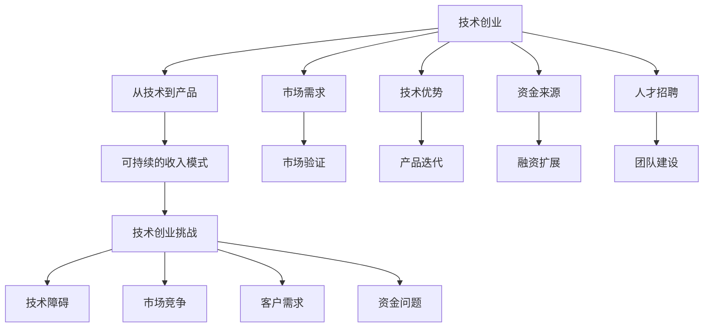

                 

# 技术博客：从爱好到主要收入来源

> 关键词：技术博客, 技术创业, 收入来源, 人工智能, 机器学习, 深度学习, 软件架构, 软件工程

## 1. 背景介绍

### 1.1 问题由来

在科技日益发展的今天，技术已经成为我们生活和工作的重要组成部分。无论是在互联网、人工智能还是金融领域，技术的力量无所不在。然而，许多人将技术视为一种工具，而不是一种事业。事实上，技术不仅仅是用来解决问题的工具，它还可以成为一种能够带来丰厚回报的商业。

### 1.2 问题核心关键点

本文将探讨如何将技术从一种爱好转变为主要收入来源。我们将会详细讲解以下几个核心点：

- 技术创业的路径和策略
- 从技术到产品的转变过程
- 如何构建可持续的收入模式
- 技术创业面临的挑战与对策

## 2. 核心概念与联系

### 2.1 核心概念概述

在深入探讨技术创业之前，我们首先需要了解一些核心概念：

- **技术创业（Tech创业）**：使用技术开发出具有实际应用价值的产品，通过销售、订阅、广告等方式获得收入。
- **从技术到产品（From Tech to Product）**：将技术转化为实际产品，满足用户需求，实现商业化。
- **可持续的收入模式**：通过多样化的收入来源，确保公司能够长期稳定地运营。
- **技术创业挑战**：包括技术、市场、竞争、人才、资金等多个方面的挑战。

这些概念之间存在紧密联系，理解它们有助于我们更全面地了解技术创业的过程。

### 2.2 核心概念原理和架构的 Mermaid 流程图



这个流程图展示了技术创业过程中涉及的各个环节和关键因素。

## 3. 核心算法原理 & 具体操作步骤

### 3.1 算法原理概述

技术创业的核心在于将技术转化为实际产品，满足市场需求，并构建可持续的收入模式。这一过程涉及到多个关键步骤：

1. **市场需求分析**：了解目标市场的需求，确定产品的价值主张。
2. **技术选型与架构设计**：根据产品需求选择合适的技术栈和架构。
3. **原型开发与测试**：快速开发产品原型，并通过用户反馈进行迭代优化。
4. **商业化策略制定**：确定销售、订阅、广告等收入模式。
5. **市场推广与用户获取**：通过有效的市场推广策略吸引用户。
6. **持续优化与迭代**：根据用户反馈和市场变化不断优化产品。

### 3.2 算法步骤详解

#### 3.2.1 市场需求分析

- **用户调研**：通过问卷、访谈等方式了解目标用户的真实需求。
- **竞品分析**：分析竞争对手的产品，找到自己的独特卖点和优势。
- **市场趋势**：关注行业动态和技术发展趋势，确定产品的未来方向。

#### 3.2.2 技术选型与架构设计

- **技术栈选择**：根据产品特性选择合适的技术栈，如前端框架、后端语言、数据库等。
- **架构设计**：设计可扩展、高可用、易于维护的系统架构。

#### 3.2.3 原型开发与测试

- **敏捷开发**：采用敏捷开发方法，快速迭代产品原型。
- **用户测试**：通过用户测试获取反馈，进行产品优化。

#### 3.2.4 商业化策略制定

- **收入模型选择**：根据产品特性和市场环境选择合适的收入模型。
- **定价策略**：确定产品定价，平衡用户价值和收入。

#### 3.2.5 市场推广与用户获取

- **市场定位**：明确产品的市场定位和目标用户群。
- **推广策略**：采用线上线下多种推广方式，吸引目标用户。

#### 3.2.6 持续优化与迭代

- **用户反馈**：收集用户反馈，进行产品优化。
- **市场调整**：根据市场变化调整产品和市场策略。

### 3.3 算法优缺点

**优点**：

- **高效**：快速响应市场需求，缩短开发周期。
- **灵活**：可以根据市场变化快速调整策略。
- **技术创新**：推动技术发展，带来新应用。

**缺点**：

- **风险高**：技术创业存在较高的失败风险。
- **资源需求大**：需要大量技术、资金、人才等资源投入。
- **市场需求不确定**：市场需求变化快速，需要不断调整策略。

### 3.4 算法应用领域

技术创业可以应用于多个领域，包括但不限于：

- **互联网**：开发社交媒体、电商、内容平台等。
- **人工智能**：开发智能助手、推荐系统、自动驾驶等。
- **金融科技**：开发金融分析、投资决策、智能投顾等。
- **医疗健康**：开发医疗影像分析、健康监测、智能诊断等。

## 4. 数学模型和公式 & 详细讲解 & 举例说明

### 4.1 数学模型构建

我们可以使用以下数学模型来表示技术创业的过程：

$$
\text{收入} = f(\text{技术能力}, \text{市场需求}, \text{推广效果}, \text{用户反馈})
$$

其中，技术能力表示公司的技术实力，市场需求表示目标市场的需求，推广效果表示市场推广策略的效果，用户反馈表示用户对产品的反馈。

### 4.2 公式推导过程

根据上述模型，我们可以推导出影响收入的关键因素：

1. **技术能力**：技术能力越强，产品的创新性和竞争力越高，能够带来更高的收入。
2. **市场需求**：市场需求越大，产品的市场份额越高，能够带来更高的收入。
3. **推广效果**：推广效果越好，用户获取率越高，能够带来更高的收入。
4. **用户反馈**：用户反馈越积极，产品的改进越快，能够带来更高的收入。

### 4.3 案例分析与讲解

以**Dropbox**为例，Dropbox的创始人在创立公司之前，就发现了在线文件共享的巨大市场需求。他们利用当时流行的技术栈，快速开发了产品原型，并进行了多次用户测试和优化。在产品发布后，通过有效的市场推广策略，迅速吸引了大量用户。随着用户数量的增加，Dropbox的收入也不断增长，最终成为一家市值数十亿美元的公司。

## 5. 项目实践：代码实例和详细解释说明

### 5.1 开发环境搭建

为了进行技术创业，首先需要搭建一个开发环境。以下是一些常用的开发工具和环境：

- **IDE**：如Visual Studio Code、PyCharm、Eclipse等。
- **版本控制**：如Git、SVN等。
- **数据库**：如MySQL、MongoDB等。
- **服务器**：如AWS、阿里云、腾讯云等。

### 5.2 源代码详细实现

以下是一个简单的Python Flask应用实例：

```python
from flask import Flask, request, jsonify

app = Flask(__name__)

@app.route('/api/hello')
def hello():
    return jsonify({'message': 'Hello, World!'})

if __name__ == '__main__':
    app.run(debug=True)
```

这个应用实现了简单的“Hello World”功能，可以通过访问`/api/hello`来获取响应。

### 5.3 代码解读与分析

- **Flask框架**：Flask是一个轻量级的Python Web框架，非常适合快速开发Web应用。
- **路由**：通过`@app.route`装饰器定义路由，将URL映射到对应的函数。
- **请求与响应**：使用`request`对象获取请求信息，使用`jsonify`函数返回JSON格式的响应。

### 5.4 运行结果展示

运行上述代码，可以在浏览器中访问`http://localhost:5000/api/hello`，获取“Hello, World!”的响应。

## 6. 实际应用场景

### 6.1 互联网

互联网领域的典型应用包括社交网络、电商平台、内容平台等。例如，Facebook利用机器学习技术，通过用户行为数据进行个性化推荐，提升用户黏性；Amazon利用算法优化库存管理，提升销售效率。

### 6.2 人工智能

人工智能领域的典型应用包括智能助手、推荐系统、自动驾驶等。例如，Google的语音助手Google Assistant利用自然语言处理技术，提供语音交互服务；特斯拉的自动驾驶技术，通过深度学习技术实现车道保持、自动泊车等功能。

### 6.3 金融科技

金融科技领域的典型应用包括金融分析、智能投顾、风险管理等。例如，JPMorgan利用AI技术，进行市场预测和风险评估；Robinhood利用机器学习技术，进行股票交易策略优化。

### 6.4 医疗健康

医疗健康领域的典型应用包括医疗影像分析、健康监测、智能诊断等。例如，DeepMind的AlphaGo利用深度学习技术，在围棋比赛中战胜人类顶尖棋手；IBM的Watson Health利用AI技术，进行疾病诊断和医疗影像分析。

## 7. 工具和资源推荐

### 7.1 学习资源推荐

为了快速掌握技术创业的相关知识，以下是一些优质的学习资源：

- **Coursera**：提供多个技术创业相关的课程，包括《创业基础》、《产品管理》等。
- **Udacity**：提供多个技术创业相关的项目，如《人工智能创业》、《机器学习创业》等。
- **书籍**：如《精益创业》、《技术创业》等。

### 7.2 开发工具推荐

为了提高技术创业的效率，以下是一些常用的开发工具：

- **IDE**：如Visual Studio Code、PyCharm、Eclipse等。
- **版本控制**：如Git、SVN等。
- **数据库**：如MySQL、MongoDB等。
- **服务器**：如AWS、阿里云、腾讯云等。

### 7.3 相关论文推荐

为了深入了解技术创业的理论和实践，以下是一些相关的论文：

- **《创业精神、市场导向与创业绩效：一个整合框架》**：提出了创业精神和市场导向对创业绩效的影响。
- **《技术创业：从技术到商业》**：探讨了技术创业的路径和策略。
- **《人工智能在技术创业中的应用》**：介绍了AI技术在技术创业中的具体应用案例。

## 8. 总结：未来发展趋势与挑战

### 8.1 研究成果总结

技术创业已经成为了一种重要的创业模式，推动了技术创新和商业应用的发展。从技术到产品的转变过程需要综合考虑技术能力、市场需求、推广效果和用户反馈等多个因素，构建可持续的收入模式。

### 8.2 未来发展趋势

未来，技术创业将会呈现以下几个发展趋势：

- **人工智能与技术创业的深度融合**：AI技术将更广泛地应用于技术创业的各个环节。
- **区块链与技术创业的结合**：区块链技术将为技术创业提供更加安全、透明的基础设施。
- **可持续性与技术创业的融合**：绿色可持续技术将带来新的商业模式和市场机会。

### 8.3 面临的挑战

技术创业虽然充满机遇，但也面临诸多挑战：

- **技术更新速度快**：技术创业需要不断学习新的技术和方法，保持竞争力。
- **市场变化快速**：市场需求快速变化，需要灵活调整产品和市场策略。
- **资金需求大**：技术创业需要大量资金投入，筹集资金是一个难题。

### 8.4 研究展望

未来的研究需要关注以下几个方面：

- **技术创业的可持续发展**：研究如何构建可持续的收入模式，降低技术创业的失败风险。
- **技术与市场的融合**：研究技术如何更好地服务于市场需求，提升产品价值。
- **技术创业的社会影响**：研究技术创业对社会、经济和环境的影响，推动技术创业的健康发展。

## 9. 附录：常见问题与解答

**Q1：技术创业有哪些步骤？**

A: 技术创业的步骤包括市场需求分析、技术选型与架构设计、原型开发与测试、商业化策略制定、市场推广与用户获取、持续优化与迭代。

**Q2：技术创业需要哪些资源？**

A: 技术创业需要技术、资金、人才、市场、时间等多个资源，需要全面考虑，合理安排。

**Q3：技术创业的风险有哪些？**

A: 技术创业的风险包括技术风险、市场风险、资金风险、人才风险等多个方面，需要提前规划和应对。

**Q4：技术创业如何获得投资？**

A: 技术创业可以通过天使投资、风险投资、众筹等方式获得资金，需要提前准备商业计划书和展示案例。

**Q5：技术创业如何构建用户群体？**

A: 技术创业可以通过社交媒体、广告、SEO等方式吸引用户，同时需要不断优化产品，提升用户体验。

---

作者：禅与计算机程序设计艺术 / Zen and the Art of Computer Programming

