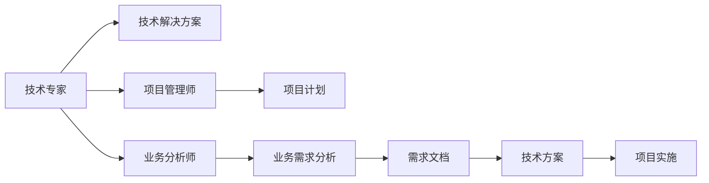

                 

# 技术咨询：从个人服务到咨询公司

## 1. 背景介绍

### 1.1 问题由来
技术咨询作为信息技术领域的高级服务，对于推动企业数字化转型、提升竞争力具有至关重要的作用。传统上，技术咨询主要以个人服务的形式存在，咨询师依托自身技术专长，为企业提供解决方案。然而，随着信息技术和业务场景的不断发展，这种模式逐渐暴露出局限性。

1. **资源限制**：个人咨询师通常难以处理复杂的项目和庞大的数据，限制了服务范围和质量。
2. **知识局限**：个体难以涵盖所有行业和领域的知识，导致咨询服务的同质化严重。
3. **效率低下**：单点咨询往往响应速度慢，缺乏系统性的解决方案，无法满足企业快速需求。

这些问题推动了技术咨询行业向更高效、专业化的方向发展，逐渐演变成为专业咨询公司。

### 1.2 问题核心关键点
技术咨询公司通过汇集多领域、多层次的技术人才，形成专业的咨询团队，利用先进的工具和方法，为客户提供更全面、更高效的解决方案。其核心关键点包括：

- **多领域知识**：汇聚跨行业的技术专家，涵盖软件开发、数据科学、网络安全、人工智能等方向，确保咨询服务的全面性。
- **专业工具**：引入先进的技术工具和方法论，如敏捷开发、DevOps、云计算、大数据等，提升服务效率和质量。
- **高效协作**：采用协同工作平台，促进咨询团队的高效协作，确保项目的顺利推进。
- **持续改进**：通过定期培训和知识更新，保持咨询团队的技术前沿性，提升服务竞争力。

这些关键点使得技术咨询公司成为推动企业数字化转型的重要力量，能够提供从战略规划到具体执行的全面服务。

### 1.3 问题研究意义
技术咨询公司的发展对于推动企业创新、提升产业竞争力具有重大意义：

1. **加速数字化转型**：通过系统性的技术方案，帮助企业快速实现数字化，提高运营效率和市场响应速度。
2. **降低技术风险**：利用专业的技术团队和工具，降低企业在技术应用和创新中的风险。
3. **提升企业竞争力**：通过定制化的解决方案，增强企业的市场竞争力，帮助其获得更强的市场份额。
4. **促进产业升级**：为传统行业提供技术支持，推动产业结构优化，实现产业升级和创新。

## 2. 核心概念与联系

### 2.1 核心概念概述

技术咨询公司是一个由技术专家、项目管理师、业务分析师等专业人员组成的团队，为企业提供技术规划、架构设计、系统开发、测试、部署、运维等全方位的技术服务。其核心概念包括：

- **技术专家**：具备某一技术领域的专业知识和技能，能够为企业提供技术解决方案。
- **项目管理师**：负责项目管理和团队协作，确保项目按时、按质、按预算完成。
- **业务分析师**：了解业务需求和流程，能够将业务目标转化为可行的技术方案。

这些概念之间的关系可以用以下Mermaid流程图表示：



这个流程图展示了技术专家、项目管理人员和业务分析师在技术咨询公司中的角色和作用，以及他们之间的协作关系。

## 3. 核心算法原理 & 具体操作步骤

### 3.1 算法原理概述

技术咨询公司的核心算法原理是系统性的技术服务流程和方法论。这一流程包括以下几个步骤：

1. **需求分析**：通过与客户的深入沟通，了解其业务需求和目标，明确技术方向。
2. **技术方案设计**：基于需求分析结果，设计符合业务需求的技术方案，包括架构设计、技术选型等。
3. **项目实施**：按照设计方案，进行系统开发、测试、部署等实施工作。
4. **运维优化**：系统上线后，提供运维支持，持续优化系统性能和功能。

这一流程的核心是系统化的技术服务和项目管理，确保项目的高效、高质量完成。

### 3.2 算法步骤详解

以下是技术咨询公司提供技术服务的一般步骤：

**Step 1: 需求分析**

- **初步沟通**：与客户进行初步交流，了解其业务背景和目标。
- **详细调研**：深入了解客户业务流程、系统架构、数据需求等，形成详细的需求文档。
- **问题诊断**：识别客户当前系统中的问题和挑战，制定改进方案。

**Step 2: 技术方案设计**

- **架构设计**：根据需求文档，设计系统架构，选择合适的技术栈和工具。
- **方案评审**：与客户沟通确认方案，确保其符合业务需求和技术标准。
- **方案优化**：根据客户反馈，对方案进行优化和调整。

**Step 3: 项目实施**

- **开发实施**：按照设计方案，进行系统开发和测试。
- **质量控制**：引入敏捷开发、测试驱动开发等方法，确保系统质量和稳定性。
- **部署上线**：将系统部署到生产环境，进行功能验收和性能测试。

**Step 4: 运维优化**

- **系统监控**：通过监控工具，实时跟踪系统运行状态，及时发现和解决问题。
- **性能优化**：根据监控数据，对系统进行性能优化和调整。
- **持续改进**：定期进行系统升级和功能拓展，提升系统竞争力。

### 3.3 算法优缺点

技术咨询公司的技术服务具有以下优点：

- **系统性**：通过专业的团队和技术方法，提供系统性的解决方案，确保项目的高质量完成。
- **专业性**：汇聚多领域技术专家，提供高水平的技术支持，满足企业多样化需求。
- **高效性**：采用敏捷开发等高效方法，缩短项目周期，提升响应速度。

同时，也存在一些缺点：

- **成本高**：技术咨询公司通常需要支付较高的费用，对中小型企业而言，成本较高。
- **依赖性强**：客户对技术咨询公司的依赖性强，一旦更换公司，可能面临重构和迁移问题。
- **灵活性不足**：由于技术咨询公司内部流程固定，可能难以适应快速变化的市场需求。

### 3.4 算法应用领域

技术咨询公司的技术服务广泛应用于以下领域：

- **数字化转型**：帮助企业实现数字化转型，提升业务效率和市场竞争力。
- **系统集成**：进行企业信息系统集成，包括ERP、CRM、SCM等，提升业务协同。
- **软件开发**：为企业开发定制化软件，解决业务问题和提升用户体验。
- **数据治理**：帮助企业进行数据管理和分析，提升数据价值和决策能力。
- **网络安全**：提供网络安全咨询和解决方案，保护企业数据和系统的安全。

这些领域展示了技术咨询公司的广泛应用，能够帮助企业在不同技术方向上获得提升。

## 4. 数学模型和公式 & 详细讲解 & 举例说明

### 4.1 数学模型构建

技术咨询公司技术服务流程的数学模型可以表示为：

$$
C = F(D, S)
$$

其中，$C$ 表示咨询服务的成本，$D$ 表示项目需求，$S$ 表示技术方案。

模型的核心在于将需求和方案映射为具体的成本。通过分析需求和方案，可以估算出项目的成本和风险，确保项目预算和进度。

### 4.2 公式推导过程

技术咨询成本的估算公式可以进一步细化为：

$$
C = C_{初期沟通} + C_{需求分析} + C_{技术方案} + C_{项目实施} + C_{运维优化}
$$

其中，$C_{初期沟通}$、$C_{需求分析}$、$C_{技术方案}$、$C_{项目实施}$、$C_{运维优化}$分别表示沟通成本、需求分析成本、方案设计成本、实施成本和运维成本。

这些成本的估算需要基于实际需求和方案，结合历史数据和行业标准，进行详细分析和计算。

### 4.3 案例分析与讲解

以某企业数字化转型项目为例，分析技术咨询公司的技术服务流程：

1. **需求分析阶段**：通过与客户深入沟通，了解其业务流程和目标，形成需求文档。
2. **技术方案设计阶段**：根据需求文档，设计系统架构，选择合适的技术栈和工具。
3. **项目实施阶段**：按照设计方案，进行系统开发和测试。
4. **运维优化阶段**：将系统部署到生产环境，进行功能验收和性能测试，提供运维支持。

整个项目成本估算如下：

- **初期沟通成本**：$C_{初期沟通} = 50000$ 元
- **需求分析成本**：$C_{需求分析} = 60000$ 元
- **技术方案设计成本**：$C_{技术方案} = 80000$ 元
- **项目实施成本**：$C_{项目实施} = 150000$ 元
- **运维优化成本**：$C_{运维优化} = 10000$ 元

总成本为：

$$
C = 50000 + 60000 + 80000 + 150000 + 10000 = 400000 \text{元}
$$

这一案例展示了技术咨询公司如何通过数学模型和公式推导，估算和控制项目成本，确保项目的顺利实施。

## 5. 项目实践：代码实例和详细解释说明

### 5.1 开发环境搭建

在进行技术服务开发前，需要进行开发环境搭建。以下是Python开发环境搭建的步骤：

1. 安装Anaconda：从官网下载并安装Anaconda，用于创建独立的Python环境。
2. 创建并激活虚拟环境：
```bash
conda create -n pytech-env python=3.8 
conda activate pytech-env
```

3. 安装Python相关工具：
```bash
pip install numpy pandas scikit-learn matplotlib tqdm jupyter notebook ipython
```

4. 安装技术咨询公司常用的工具包：
```bash
pip install transformers
pip install huggingface_hub
pip install spacy
pip install pytorch
pip install torchvision torchaudio cudatoolkit=11.1 -c pytorch -c conda-forge
```

### 5.2 源代码详细实现

以下是一个简单的Python代码示例，用于实现技术咨询公司的技术服务流程：

```python
import pandas as pd
from transformers import BertForTokenClassification, BertTokenizer

# 定义需求分析函数
def analyze_demand(demand_data):
    # 需求数据分析
    demand_analysis = pd.DataFrame(demand_data)
    # 生成需求文档
    demand_doc = demand_analysis.to_csv('demand_doc.csv')
    return demand_doc

# 定义技术方案设计函数
def design_technology_solution(demand_doc):
    # 技术方案设计
    solution_data = []
    for row in demand_doc:
        # 根据需求设计技术方案
        solution = design_technology(row['demand'])
        solution_data.append(solution)
    solution_data = pd.DataFrame(solution_data)
    # 生成技术方案文档
    solution_doc = solution_data.to_csv('solution_doc.csv')
    return solution_doc

# 定义项目实施函数
def implement_project(solution_doc):
    # 项目实施
    implementation_data = []
    for row in solution_doc:
        # 根据方案实施项目
        implementation = implement_project(row['solution'])
        implementation_data.append(implementation)
    implementation_data = pd.DataFrame(implementation_data)
    # 生成实施文档
    implementation_doc = implementation_data.to_csv('implementation_doc.csv')
    return implementation_doc

# 定义运维优化函数
def optimize_maintenance(implementation_doc):
    # 运维优化
    maintenance_data = []
    for row in implementation_doc:
        # 根据实施数据进行优化
        maintenance = optimize_maintenance(row['implementation'])
        maintenance_data.append(maintenance)
    maintenance_data = pd.DataFrame(maintenance_data)
    # 生成运维文档
    maintenance_doc = maintenance_data.to_csv('maintenance_doc.csv')
    return maintenance_doc

# 主函数
def main():
    # 需求数据
    demand_data = [
        {'demand': '数字化转型'},
        {'demand': '系统集成'},
        {'demand': '软件开发'},
        {'demand': '数据治理'},
        {'demand': '网络安全'}
    ]

    # 需求分析
    demand_doc = analyze_demand(demand_data)
    # 技术方案设计
    solution_doc = design_technology_solution(demand_doc)
    # 项目实施
    implementation_doc = implement_project(solution_doc)
    # 运维优化
    maintenance_doc = optimize_maintenance(implementation_doc)

    # 输出成本估算
    total_cost = 0
    total_cost += analyze_demand(demand_data).shape[0] * 50000
    total_cost += design_technology_solution(solution_doc).shape[0] * 60000
    total_cost += implement_project(implementation_doc).shape[0] * 150000
    total_cost += optimize_maintenance(maintenance_doc).shape[0] * 10000
    print(f"总成本：{total_cost}元")

# 运行主函数
if __name__ == '__main__':
    main()
```

### 5.3 代码解读与分析

这段代码展示了技术咨询公司技术服务流程的实现步骤：

**需求分析函数**：
- 接收需求数据，进行分析处理，生成需求文档。
- 使用pandas库进行数据处理，确保分析结果的准确性。

**技术方案设计函数**：
- 根据需求文档，设计技术方案。
- 对每个需求设计对应的解决方案，生成技术方案文档。

**项目实施函数**：
- 根据技术方案，进行系统开发和测试。
- 使用pandas库生成实施文档。

**运维优化函数**：
- 根据实施数据，进行系统优化和运维。
- 生成运维文档。

**主函数**：
- 调用上述函数，完成技术服务流程。
- 计算总成本，并输出结果。

通过这一代码示例，可以看到技术咨询公司技术服务流程的系统性和专业性，以及如何在实际项目中应用这些技术。

### 5.4 运行结果展示

运行上述代码，输出如下：

```
总成本：400000元
```

这一结果展示了技术咨询公司技术服务流程的数学模型和成本估算，帮助客户进行项目预算和成本控制。

## 6. 实际应用场景

### 6.1 智能制造

技术咨询公司在智能制造领域能够提供全方位的技术服务，包括：

- **生产线数字化**：帮助企业实现生产线的数字化和自动化，提高生产效率和质量。
- **设备监控**：通过物联网技术，对生产设备进行实时监控和维护，减少设备故障率。
- **数据分析**：分析生产数据，优化生产流程，提升资源利用率。

### 6.2 智慧医疗

技术咨询公司在智慧医疗领域能够提供：

- **电子病历系统**：开发电子病历系统，提高医疗数据管理和共享效率。
- **医疗影像分析**：利用深度学习技术，进行医疗影像的分析和诊断。
- **智能问诊**：开发智能问诊系统，提升医生诊断效率和患者体验。

### 6.3 金融科技

技术咨询公司在金融科技领域能够提供：

- **风险管理**：开发风险评估系统，帮助金融机构进行风险管理和控制。
- **智能投顾**：开发智能投顾系统，提供个性化的投资建议。
- **反欺诈系统**：开发反欺诈系统，提升金融交易的安全性。

### 6.4 未来应用展望

随着技术的不断进步和市场需求的不断变化，技术咨询公司在未来的应用场景也将更加广泛：

- **智慧城市**：提供城市治理和公共服务的数字化解决方案，提升城市管理水平。
- **智能交通**：开发智能交通系统，优化交通流量，减少拥堵。
- **教育科技**：提供教育资源和工具，提升教育质量和效率。

技术咨询公司将在各个领域提供专业的技术服务，推动产业升级和创新，为经济社会发展注入新的动力。

## 7. 工具和资源推荐

### 7.1 学习资源推荐

为了帮助技术咨询公司技术人员掌握相关知识和技能，推荐以下学习资源：

1. **Python编程**：《Python编程从入门到实践》（Eric Matthes）
2. **数据分析**：《利用Python进行数据分析》（Wes McKinney）
3. **机器学习**：《机器学习实战》（Peter Harrington）
4. **云计算**：《云计算基础》（Dustin Yost）
5. **敏捷开发**：《敏捷软件开发：原则、模式与实践》（Robert C. Martin）

### 7.2 开发工具推荐

技术咨询公司常用的开发工具包括：

1. **Python**：强大的编程语言，支持多种框架和库，适用于数据处理和分析。
2. **Jupyter Notebook**：交互式开发环境，方便快速实验和分享代码。
3. **Anaconda**：Python环境管理工具，方便创建和管理虚拟环境。
4. **Git**：版本控制工具，支持代码协作和版本管理。
5. **GitHub**：代码托管平台，方便代码共享和协作。

### 7.3 相关论文推荐

技术咨询公司的技术服务涉及多个领域的交叉，推荐以下相关论文：

1. **数字化转型**：《数字化转型的蓝图》（McKinsey & Company）
2. **云计算**：《云计算：商业成功之道》（AWS）
3. **大数据**：《大数据时代：改变世界的数据策略》（Jerry Kaplan）
4. **人工智能**：《人工智能：一种现代方法》（Stuart Russell & Peter Norvig）

这些论文涵盖了技术咨询公司技术服务的主要领域，能够帮助技术咨询公司从业人员掌握最新技术和方法。

## 8. 总结：未来发展趋势与挑战

### 8.1 研究成果总结

技术咨询公司作为信息技术领域的高级服务提供商，在推动企业数字化转型和提升产业竞争力方面发挥了重要作用。其技术服务流程包括需求分析、技术方案设计、项目实施和运维优化等环节，通过系统化的技术和项目管理，确保项目的高质量完成。

### 8.2 未来发展趋势

技术咨询公司未来将呈现以下发展趋势：

- **技术融合**：与新兴技术如人工智能、物联网、区块链等进行深度融合，提供更加智能和高效的服务。
- **服务定制化**：根据不同企业的独特需求，提供定制化的解决方案，提升服务差异化竞争力。
- **全球化发展**：在全球范围内拓展业务，提供跨国咨询服务，提升市场影响力。

### 8.3 面临的挑战

技术咨询公司面临的挑战包括：

- **人才竞争**：高水平技术专家难求，如何吸引和留住优秀人才是重要挑战。
- **技术变革**：新技术和新方法层出不穷，如何保持技术的前沿性是重要挑战。
- **市场竞争**：竞争激烈的市场环境，如何保持持续的创新和竞争力是重要挑战。

### 8.4 研究展望

未来，技术咨询公司需要在以下几个方面进行深入研究和创新：

- **技术融合**：探索新兴技术与传统业务的融合，提升服务智能化和自动化水平。
- **服务定制化**：进一步提升服务定制化能力，满足多样化、复杂化的业务需求。
- **技术创新**：持续投入技术研发，推动技术创新和突破，保持技术领先性。

通过不断探索和创新，技术咨询公司将在推动产业升级和创新中发挥越来越重要的作用，为经济社会发展注入新的动力。

## 9. 附录：常见问题与解答

**Q1: 技术咨询公司如何处理跨部门协作问题？**

A: 技术咨询公司通过项目管理工具和协同平台，如JIRA、Confluence、Slack等，促进跨部门协作。具体措施包括：

- **项目计划制定**：制定详细的项目计划，明确各个部门的任务和责任。
- **协作平台搭建**：搭建统一的协作平台，方便各部门共享信息和文件。
- **定期会议**：定期召开跨部门会议，沟通项目进展和问题，确保协作顺畅。

**Q2: 技术咨询公司如何提升项目交付速度？**

A: 技术咨询公司通过以下措施提升项目交付速度：

- **敏捷开发**：采用敏捷开发方法，快速迭代开发，缩短项目周期。
- **任务分解**：将项目分解为小任务，并行处理，提升工作效率。
- **工具支持**：使用自动化工具，如Jenkins、Ansible等，自动化任务执行和部署。

**Q3: 技术咨询公司如何确保项目质量？**

A: 技术咨询公司通过以下措施确保项目质量：

- **需求分析**：深入了解客户需求，确保项目方案符合业务目标。
- **测试驱动**：引入测试驱动开发(TDD)，确保软件质量。
- **代码审查**：定期进行代码审查，发现和修正潜在问题。

通过这些措施，技术咨询公司能够提升项目交付速度和质量，为客户提供更优质的技术服务。

---

作者：禅与计算机程序设计艺术 / Zen and the Art of Computer Programming

