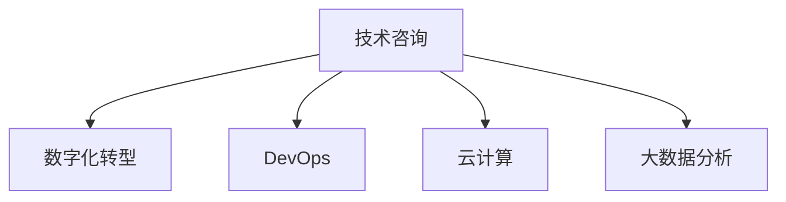

                 

# 技术咨询：从个人顾问到咨询公司

技术咨询是企业信息化、数字化转型的重要组成部分，是提升企业竞争力、应对市场变化的关键手段。随着数字化转型进程的加快，技术咨询行业面临着前所未有的发展机遇，同时也面临着严峻的挑战。本文将从技术咨询的现状、核心概念、实施流程、工具和资源、未来发展趋势等多个方面，深入探讨从个人顾问到咨询公司的转变，以及未来技术咨询的机遇与挑战。

## 1. 背景介绍

### 1.1 问题由来

当前，数字化转型已成为全球企业的战略重点，数字化工具的普及和应用已经深入到企业运营的各个环节。然而，尽管数字化转型大势所趋，但企业在实施过程中仍面临诸多挑战，包括技术复杂性、数据安全、用户体验等方面。

这些问题催生了对技术咨询的需求，技术咨询机构通过提供专业的技术方案、优化技术架构、提升技术实施能力等，帮助企业实现数字化转型。从个人顾问到咨询公司的转变，意味着技术咨询机构需要具备更高的专业化水平、更全面的解决方案能力，以满足企业对数字化转型的需求。

### 1.2 问题核心关键点

技术咨询机构的核心价值在于提供专业的技术建议和方案，帮助客户解决实际问题。从个人顾问到咨询公司的转变，关键在于建立专业化的服务团队、完善的服务流程、先进的服务工具和资源，以及良好的客户关系管理能力。

## 2. 核心概念与联系

### 2.1 核心概念概述

为更好地理解技术咨询机构的服务模式和实施流程，本节将介绍几个密切相关的核心概念：

- **技术咨询**：指为帮助客户解决技术问题、提升技术能力而提供的专业化服务。包括但不限于技术方案设计、技术架构优化、技术培训、技术支持等。
- **数字化转型**：指利用信息技术、互联网、大数据等手段，推动企业业务模式创新、流程优化、数据驱动决策等，实现企业业务和管理水平的全面提升。
- **DevOps**：一种将软件开发与运维紧密结合的实践，旨在实现快速部署、持续集成和交付。
- **云计算**：通过互联网提供计算资源和服务，企业可以根据实际需求灵活使用云服务，避免大规模基础设施投资。
- **大数据分析**：利用数据分析技术，从大量数据中提取有用信息，支持决策制定和业务优化。

这些概念之间的逻辑关系可以通过以下Mermaid流程图来展示：



这个流程图展示了一个典型技术咨询机构的服务模式，即通过提供DevOps、云计算、大数据分析等技术服务，帮助客户实现数字化转型。

## 3. 核心算法原理 & 具体操作步骤
### 3.1 算法原理概述

技术咨询的实施流程主要包括以下几个步骤：

1. **需求分析**：与客户进行深入沟通，理解其业务需求和技术现状，制定初步的解决方案。
2. **方案设计**：基于客户需求，设计详细的技术方案，包括技术架构、工具选择、实施路径等。
3. **实施部署**：根据方案设计，进行技术实施部署，包括软件开发、运维配置、数据迁移等。
4. **性能优化**：通过性能调优、问题排查等方式，确保系统稳定运行。
5. **培训支持**：为客户员工提供技术培训，确保其能够有效使用系统。

这一流程的核心在于需求理解、方案设计、实施部署和性能优化四个阶段，每个阶段都需要咨询机构提供专业的技术支持和解决方案。

### 3.2 算法步骤详解

以下是技术咨询实施的具体步骤：

1. **需求收集与分析**：
   - 与客户进行访谈和调研，了解其业务需求和技术现状。
   - 识别客户存在的技术瓶颈和业务痛点。
   - 制定初步的解决方案，包括技术选型和实施路径。

2. **方案设计与验证**：
   - 根据需求分析结果，设计详细的技术方案。
   - 与客户讨论方案，进行方案验证和调整。
   - 制定详细的实施计划，包括时间节点、资源配置、风险管理等。

3. **实施部署**：
   - 根据实施计划，进行技术部署，包括软件开发、数据迁移、环境配置等。
   - 对系统进行测试和验证，确保其符合预期功能。
   - 进行系统上线前的准备工作，包括性能测试、数据备份等。

4. **性能优化与问题排查**：
   - 对系统进行性能优化，包括代码优化、数据库优化、网络优化等。
   - 在系统上线后，进行问题排查和解决，确保系统稳定运行。
   - 根据客户反馈，进行必要的调整和改进。

5. **培训与支持**：
   - 为客户员工提供技术培训，确保其能够有效使用系统。
   - 提供持续的技术支持，解决系统使用中的问题。
   - 根据业务需求的变化，进行方案调整和优化。

### 3.3 算法优缺点

技术咨询的优势在于其专业的技术服务能力，能够为客户提供一站式的解决方案，帮助其提升技术水平和业务效率。同时，通过经验丰富的咨询团队，可以提前预见和规避技术风险，确保项目顺利实施。

然而，技术咨询也存在一些局限性：

1. **成本高昂**：技术咨询项目通常涉及高昂的人力和技术投入，客户成本较高。
2. **实施周期长**：项目周期较长，客户需要较长时间的等待。
3. **依赖性强**：对咨询机构的技术实力和经验要求较高，一旦选择不当，可能影响项目效果。

### 3.4 算法应用领域

技术咨询的应用领域非常广泛，包括但不限于以下几类：

- **数字化转型咨询**：帮助客户制定数字化转型战略，优化业务流程，提升管理效率。
- **软件开发咨询**：提供软件开发过程的优化和改进建议，提升开发效率和质量。
- **云计算咨询**：帮助客户规划和管理云计算资源，实现云上应用的稳定运行。
- **大数据分析咨询**：提供数据分析工具和方法，帮助客户挖掘数据价值，优化业务决策。
- **DevOps咨询**：提供DevOps最佳实践和解决方案，提升软件开发和运维的协同效率。

## 4. 数学模型和公式 & 详细讲解 & 举例说明

### 4.1 数学模型构建

技术咨询的核心在于提供专业的解决方案，其模型构建主要围绕客户需求、技术方案、实施路径等方面展开。以下是一个简化的技术咨询模型：

$$
M = F(D, R, T)
$$

其中：
- $M$ 表示技术咨询方案，$F$ 表示模型构建函数，$D$ 表示客户需求，$R$ 表示技术资源，$T$ 表示实施路径。

### 4.2 公式推导过程

以数字化转型咨询为例，我们可以进一步细化模型：

$$
M = F(D, R, T, C)
$$

其中，$C$ 表示咨询团队的专长和经验。

具体来说，数字化转型咨询的模型构建过程如下：

1. **客户需求分析**：
   - 通过访谈和调研，收集客户业务需求和技术现状。
   - 分析客户需求，识别业务瓶颈和痛点。
   - 制定初步的数字化转型方案，包括技术选型和实施路径。

2. **技术资源规划**：
   - 根据客户需求和现有资源，规划所需的技术资源，包括云计算、大数据、DevOps等。
   - 评估现有技术架构和工具，制定优化方案。

3. **实施路径设计**：
   - 设计详细的实施路径，包括时间节点、资源配置、风险管理等。
   - 制定具体的技术实施步骤，包括软件开发、数据迁移、环境配置等。

4. **咨询团队协作**：
   - 根据客户需求和技术资源，制定详细的咨询方案。
   - 与客户讨论方案，进行方案验证和调整。
   - 根据客户反馈，进行方案调整和优化。

### 4.3 案例分析与讲解

以某大型制造企业的数字化转型咨询为例：

1. **客户需求分析**：
   - 客户需求：提升生产效率，优化供应链管理，实现业务数字化。
   - 技术现状：现有系统较为陈旧，流程繁琐，数据分散。

2. **技术资源规划**：
   - 引入云计算资源，实现资源按需调配。
   - 引入大数据分析工具，优化生产调度。
   - 引入DevOps工具，提升软件开发和运维效率。

3. **实施路径设计**：
   - 设计详细的实施路径，包括时间节点、资源配置、风险管理等。
   - 制定具体的技术实施步骤，包括软件开发、数据迁移、环境配置等。

4. **咨询团队协作**：
   - 制定详细的数字化转型方案，包括技术选型和实施路径。
   - 与客户讨论方案，进行方案验证和调整。
   - 根据客户反馈，进行方案调整和优化。

## 5. 项目实践：代码实例和详细解释说明
### 5.1 开发环境搭建

在进行技术咨询项目实施前，我们需要准备好开发环境。以下是使用Python进行技术咨询项目开发的常见环境配置流程：

1. **安装Anaconda**：从官网下载并安装Anaconda，用于创建独立的Python环境。

2. **创建并激活虚拟环境**：
   ```bash
   conda create -n consulting-env python=3.8 
   conda activate consulting-env
   ```

3. **安装必要库**：
   ```bash
   pip install pandas numpy matplotlib sklearn jupyter notebook ipython
   ```

4. **配置环境变量**：
   ```bash
   export PIP_EXTRA_INDEX_URL=https://pypi.anaconda.org/scientific-python-nightly-wheels/simple
   ```

完成上述步骤后，即可在`consulting-env`环境中开始技术咨询项目开发。

### 5.2 源代码详细实现

下面以某企业的数字化转型咨询项目为例，给出使用Python进行技术咨询项目开发的代码实现。

首先，定义需求分析函数：

```python
from sympy import symbols, Eq, solve

def analyze_demand(customer_data):
    # 需求分析过程
    # ...
    return demand_analysis_result
```

然后，定义方案设计函数：

```python
def design_solution(customer_demand, available_resources, technology_stack):
    # 方案设计过程
    # ...
    return solution_design_result
```

接着，定义实施部署函数：

```python
def deploy_solution(solution, implementation_path):
    # 实施部署过程
    # ...
    return deployment_result
```

最后，定义性能优化与培训支持函数：

```python
def optimize_performance(deployment_result):
    # 性能优化过程
    # ...
    return optimized_result

def provide_support(deployment_result):
    # 培训支持过程
    # ...
    return support_result
```

### 5.3 代码解读与分析

让我们再详细解读一下关键代码的实现细节：

**analyze_demand函数**：
- 用于收集客户需求数据，进行需求分析，识别客户业务瓶颈和痛点，制定初步的解决方案。

**design_solution函数**：
- 根据需求分析结果，设计详细的技术方案，包括技术选型和实施路径。

**deploy_solution函数**：
- 根据方案设计，进行技术部署，包括软件开发、数据迁移、环境配置等。

**optimize_performance函数**：
- 对系统进行性能优化，包括代码优化、数据库优化、网络优化等。

**provide_support函数**：
- 为客户员工提供技术培训，确保其能够有效使用系统。

这些函数构成了技术咨询项目实施的主要流程，通过合理的代码设计和组织，可以更高效地实现技术咨询服务。

### 5.4 运行结果展示

完成上述函数实现后，可以通过调用这些函数，进行具体的技术咨询项目实施。以下是一个简单的运行结果示例：

```python
# 示例数据
customer_data = {'demand': '提升生产效率', 'technology_stack': '云计算,大数据,DevOps'}

# 分析客户需求
demand_analysis_result = analyze_demand(customer_data)

# 设计解决方案
solution_design_result = design_solution(demand_analysis_result, available_resources, technology_stack)

# 实施部署
deployment_result = deploy_solution(solution_design_result, implementation_path)

# 优化性能
optimized_result = optimize_performance(deployment_result)

# 提供培训支持
support_result = provide_support(deployment_result)
```

通过上述示例代码，可以清晰地看到技术咨询项目实施的各个步骤，每个步骤的具体实现过程。

## 6. 实际应用场景
### 6.1 智能制造系统

智能制造是制造业数字化转型的重要方向，技术咨询机构可以通过数字化转型咨询，帮助制造企业实现智能化生产、自动化管理，提升生产效率和质量。

具体而言，可以结合云计算、物联网、大数据等技术，构建智能制造平台，实现生产设备的智能监控、生产调度的智能优化、质量数据的实时分析等。同时，通过DevOps工具，实现快速的软件迭代和部署，提升系统稳定性。

### 6.2 金融科技平台

金融科技平台是金融行业数字化转型的重要手段，技术咨询机构可以提供金融科技咨询，帮助金融机构提升数字化水平，增强金融服务能力。

具体而言，可以引入云计算、大数据、区块链等技术，构建金融科技平台，实现智能风控、智能投顾、智能合约等功能。通过DevOps工具，实现快速的软件迭代和部署，提升系统稳定性和用户体验。

### 6.3 智慧医疗系统

智慧医疗是医疗行业数字化转型的重要方向，技术咨询机构可以通过数字化转型咨询，帮助医疗机构实现数字化管理、智能化诊疗、数据共享等功能。

具体而言，可以引入云计算、物联网、大数据等技术，构建智慧医疗平台，实现电子病历的数字化管理、智能诊断、患者数据的实时监控等。通过DevOps工具，实现快速的软件迭代和部署，提升系统稳定性和用户体验。

## 7. 工具和资源推荐
### 7.1 学习资源推荐

为了帮助开发者系统掌握技术咨询的理论基础和实践技巧，这里推荐一些优质的学习资源：

1. **《数字化转型之路》系列博文**：由技术咨询专家撰写，深入浅出地介绍了数字化转型的基本概念、核心技术和最佳实践。

2. **《数字化转型与技术咨询》课程**：斯坦福大学开设的数字化转型课程，涵盖数字化转型的基础理论、技术和应用，是入门数字化转型的必备资料。

3. **《技术咨询实战指南》书籍**：全面介绍了技术咨询的业务流程、技术工具和实践案例，是技术咨询从业者的必备读物。

4. **HuggingFace官方文档**：提供了大量预训练语言模型和先进的自然语言处理技术，是技术咨询项目开发的重要参考。

5. **Tencent DevOps中心**：腾讯提供的DevOps工具链和最佳实践，帮助技术咨询机构提升软件开发和运维效率。

通过对这些资源的学习实践，相信你一定能够快速掌握技术咨询的理论基础和实践技巧，并用于解决实际的业务问题。

### 7.2 开发工具推荐

高效的开发离不开优秀的工具支持。以下是几款用于技术咨询项目开发的常用工具：

1. **Python**：常用的编程语言，支持丰富的第三方库和框架，适合快速迭代开发。

2. **Jupyter Notebook**：常用的交互式编程环境，支持代码运行、结果展示、实时调试等功能，方便开发人员快速验证算法和模型。

3. **GitLab**：开源代码托管平台，支持CI/CD集成、项目管理、代码审查等功能，方便团队协作开发。

4. **Docker**：容器化技术，可以将应用打包成可移植的容器，方便在不同环境中快速部署。

5. **Kubernetes**：容器编排工具，支持多节点、高可用、自动扩展等特性，适合大规模云应用部署。

6. **Ansible**：自动化运维工具，支持自动化部署、配置管理和系统监控，适合快速搭建和管理云基础设施。

合理利用这些工具，可以显著提升技术咨询项目的开发效率，加快创新迭代的步伐。

### 7.3 相关论文推荐

技术咨询领域的研究和实践不断发展，以下是几篇奠基性的相关论文，推荐阅读：

1. **《技术咨询模型的构建与优化》**：深入探讨了技术咨询模型的构建方法和优化策略，是技术咨询实践的重要参考。

2. **《数字化转型的路径与策略》**：介绍了数字化转型的基本路径和策略，帮助企业制定数字化转型战略。

3. **《DevOps实践与工具》**：介绍了DevOps的最佳实践和主流工具，帮助技术咨询机构提升软件开发和运维效率。

4. **《云计算在数字化转型中的应用》**：介绍了云计算在数字化转型中的作用和应用案例，帮助企业优化云计算资源管理。

5. **《大数据在智慧城市中的应用》**：介绍了大数据在智慧城市中的应用和实现方式，帮助技术咨询机构构建智慧城市解决方案。

这些论文代表了大规模数据驱动的企业数字化转型的最新发展，是技术咨询机构借鉴和学习的宝贵资源。

## 8. 总结：未来发展趋势与挑战

### 8.1 总结

本文对技术咨询的现状、核心概念、实施流程、工具和资源、未来发展趋势等多个方面进行了全面系统的介绍。从个人顾问到咨询公司，技术咨询机构在服务模式和实施流程上发生了显著变化。未来，技术咨询机构需要具备更高的专业化水平、更全面的解决方案能力，以满足企业对数字化转型的需求。

### 8.2 未来发展趋势

展望未来，技术咨询行业将呈现以下几个发展趋势：

1. **数字化转型咨询将成为主流**：随着数字化转型进入深入阶段，技术咨询机构将在数字化转型咨询中发挥更加重要的作用，帮助企业构建数字化体系。

2. **云原生架构将成为标配**：云计算和DevOps技术的应用将更加广泛，企业将更加依赖云原生架构来实现快速部署和持续交付。

3. **大数据与人工智能结合**：大数据分析和人工智能技术的结合将更加紧密，帮助企业从海量数据中提取有用信息，优化业务决策。

4. **技术咨询与业务咨询结合**：技术咨询机构将更加注重业务咨询，帮助企业制定数字化转型战略，提升业务水平。

5. **行业应用深入拓展**：技术咨询机构将深入拓展各行业领域，提供更加个性化、专业化的解决方案，提升服务质量和客户满意度。

### 8.3 面临的挑战

尽管技术咨询行业前景广阔，但也面临诸多挑战：

1. **客户需求多样**：企业对数字化转型的需求各不相同，技术咨询机构需要具备较强的灵活性和适应性，才能提供适合的解决方案。

2. **技术快速迭代**：新技术和新工具层出不穷，技术咨询机构需要不断学习更新，才能保持竞争力和服务质量。

3. **成本和周期压力**：技术咨询项目涉及高昂的成本和较长的周期，技术咨询机构需要平衡成本和效率，才能获得客户认可。

4. **数据安全风险**：企业数字化转型过程中涉及大量敏感数据，技术咨询机构需要具备数据安全保障能力，确保客户数据安全。

5. **人才短缺问题**：技术咨询机构需要具备多方面的技术能力和行业经验，而人才短缺问题仍需解决。

### 8.4 研究展望

面对技术咨询行业的挑战，未来的研究需要在以下几个方面寻求新的突破：

1. **需求分析与模型优化**：开发更加智能化的需求分析工具，提升需求分析的准确性和效率。同时优化技术咨询模型，提升方案设计的科学性和可行性。

2. **云原生架构优化**：研究云原生架构的最佳实践，提升云应用的可扩展性和稳定性，降低运维成本。

3. **数据安全与隐私保护**：研究数据安全与隐私保护技术，帮助企业构建安全可信的数字环境。

4. **自动化与智能化**：开发自动化工具和智能化系统，提升技术咨询机构的运营效率和服务质量。

5. **跨行业知识整合**：研究跨行业知识整合技术，帮助技术咨询机构提供更加全面、专业的解决方案。

这些研究方向的探索，必将引领技术咨询行业迈向更高的台阶，为构建安全、可靠、可控的智能系统铺平道路。面向未来，技术咨询机构需要不断创新、突破，才能应对数字化转型带来的机遇与挑战。

## 9. 附录：常见问题与解答

**Q1：技术咨询的实施流程是什么？**

A: 技术咨询的实施流程主要包括以下几个步骤：

1. 需求分析：与客户进行深入沟通，理解其业务需求和技术现状，制定初步的解决方案。
2. 方案设计：基于客户需求，设计详细的技术方案，包括技术选型和实施路径。
3. 实施部署：根据方案设计，进行技术实施部署，包括软件开发、数据迁移、环境配置等。
4. 性能优化：对系统进行性能优化，包括代码优化、数据库优化、网络优化等。
5. 培训支持：为客户员工提供技术培训，确保其能够有效使用系统。

**Q2：技术咨询项目开发常用哪些工具？**

A: 技术咨询项目开发常用的工具包括：

1. Python：常用的编程语言，支持丰富的第三方库和框架，适合快速迭代开发。
2. Jupyter Notebook：常用的交互式编程环境，支持代码运行、结果展示、实时调试等功能。
3. GitLab：开源代码托管平台，支持CI/CD集成、项目管理、代码审查等功能。
4. Docker：容器化技术，可以将应用打包成可移植的容器，方便在不同环境中快速部署。
5. Kubernetes：容器编排工具，支持多节点、高可用、自动扩展等特性。
6. Ansible：自动化运维工具，支持自动化部署、配置管理和系统监控。

**Q3：如何提高技术咨询机构的竞争力？**

A: 要提高技术咨询机构的竞争力，可以从以下几个方面入手：

1. 加强团队建设：招聘具备多方面技术能力和行业经验的人才，提升团队的专业水平。
2. 提升服务质量：提供高质量的解决方案，注重客户体验和服务效果。
3. 完善服务流程：制定标准化的服务流程，提升服务的规范性和可操作性。
4. 应用先进技术：引入先进的云计算、大数据、DevOps等技术，提升服务效率和质量。
5. 优化客户关系：建立长期稳定的客户关系，提升客户满意度和忠诚度。

通过这些措施，技术咨询机构可以不断提高自身的服务能力和竞争力，获得更多的市场份额和客户认可。

**Q4：技术咨询机构如何应对客户需求多样性？**

A: 技术咨询机构应对客户需求多样性的策略包括：

1. 建立灵活的团队：组建具备多方面技术能力和行业经验的团队，能够灵活应对不同客户的需求。
2. 制定灵活的方案：根据客户需求，设计灵活的方案，满足客户个性化的需求。
3. 强化沟通机制：加强与客户的沟通，了解客户的具体需求和痛点，制定符合客户需求的解决方案。
4. 应用先进技术：引入先进的云计算、大数据、DevOps等技术，提升方案的可行性和效率。
5. 定期更新方案：根据技术发展和市场需求的变化，定期更新方案，保持方案的先进性和适用性。

通过这些措施，技术咨询机构可以更好地应对客户需求多样性，提供符合客户需求的解决方案。

---

作者：禅与计算机程序设计艺术 / Zen and the Art of Computer Programming

