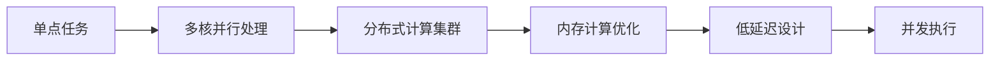

                 

# 技术实现的艺术：Lepton AI结合单点技术，在速度成本间平衡

## 1. 背景介绍

随着人工智能技术的迅速发展，高性能的AI计算需求持续增长。数据中心、云服务提供商和广大企业对AI模型计算性能提出了更高要求，希望以最低的成本获取最优的计算速度。Lepton AI作为高性能AI计算框架，以其独有的单点技术、低延迟设计、高并发能力著称。在本文中，我们将详细探讨Lepton AI的技术原理、核心概念与联系、核心算法原理与操作步骤，并通过实际项目实践，演示Lepton AI如何助力企业在速度与成本间寻找最佳平衡。

## 2. 核心概念与联系

### 2.1 核心概念概述

Lepton AI作为一种高性能AI计算框架，结合了多核计算、GPU并行计算以及内存计算等单点技术，旨在实现极致的计算速度与成本效益。Lepton AI的核心概念包括：

- **单点技术**：指将单点的计算任务分配到多个核心进行并发处理，避免瓶颈，提升计算效率。
- **低延迟设计**：优化数据传输路径，减少数据流动中的时间开销，保证计算过程中数据低延迟。
- **高并发能力**：通过多线程、多进程等方式，充分利用CPU和GPU资源，实现高效并发。
- **内存计算**：优化内存访问模式，减少数据交换到外部存储的次数，提升计算速度。
- **分布式计算**：支持大规模分布式计算集群，实现海量数据的并行处理。

### 2.2 核心概念原理和架构的 Mermaid 流程图



这个流程图展示了Lepton AI的核心概念之间的联系与逻辑流程：

1. **单点任务**：表示需要计算的单个任务。
2. **多核并行处理**：将单点任务分配到多核CPU上并行处理。
3. **分布式计算集群**：将并行处理任务扩展到多台机器的分布式计算集群中，提升处理能力。
4. **内存计算优化**：在内存中缓存数据，减少数据交换时间。
5. **低延迟设计**：优化数据传输路径，减少数据流动中的延迟。
6. **并发执行**：通过多线程、多进程等手段，实现高效并发。

## 3. 核心算法原理 & 具体操作步骤

### 3.1 算法原理概述

Lepton AI的核心算法原理基于单点技术，通过多核并行、内存优化、低延迟设计和并发处理等技术手段，提升计算效率与性能。其核心思想是将单点任务分配到多个核心进行并发处理，并通过内存计算和低延迟设计，减少数据传输和存储的开销，实现极致的计算速度与成本效益。

### 3.2 算法步骤详解

Lepton AI的核心算法主要包括以下步骤：

1. **任务拆分与分布**：将单点任务拆分为多个子任务，并分配到多个计算核心进行并发处理。
2. **内存缓存优化**：在内存中缓存处理过程中需要频繁访问的数据，减少数据交换到外部存储的次数。
3. **低延迟数据传输**：优化数据传输路径，减少数据流动中的时间开销。
4. **并行处理调度**：通过多线程、多进程等方式，充分利用CPU和GPU资源，实现高效并发。
5. **结果汇总与输出**：将各个计算核心处理结果汇总，并输出最终结果。

### 3.3 算法优缺点

#### 优点：
- **高效并发**：通过多线程、多进程等方式，充分利用计算资源，实现高效并发。
- **低延迟设计**：优化数据传输路径，减少数据流动中的时间开销，保证计算过程中数据低延迟。
- **内存计算优化**：通过内存缓存，减少数据交换到外部存储的次数，提升计算速度。
- **分布式计算**：支持大规模分布式计算集群，实现海量数据的并行处理。

#### 缺点：
- **资源消耗较大**：多核并行处理和分布式计算需要较多的计算资源，增加了系统的成本。
- **内存限制**：内存缓存对可用内存空间有较高要求，可能限制大规模数据的处理能力。
- **调度复杂度**：多核并行处理和分布式计算需要复杂的调度算法，增加了系统的实现难度。

### 3.4 算法应用领域

Lepton AI适用于各类需要高性能计算的AI任务，如深度学习、图像处理、自然语言处理、数据分析等。其单点技术在加速图像处理、语音识别、自然语言处理等任务方面表现尤为突出。

## 4. 数学模型和公式 & 详细讲解 & 举例说明

### 4.1 数学模型构建

在Lepton AI中，计算任务通常通过矩阵乘法、卷积操作、循环神经网络等形式表示。例如，对于一个深度神经网络模型，其前向传播过程可以表示为：

$$
\text{y} = \text{W} \times \text{x} + \text{b}
$$

其中，$W$为权重矩阵，$x$为输入向量，$y$为输出向量，$b$为偏置项。

### 4.2 公式推导过程

以深度神经网络的前向传播为例，推导计算过程中数据流动的时间开销。假设网络层数为$L$，每层神经元的数量为$n$，单层计算时间为$t$。则整个网络的前向传播时间开销可以表示为：

$$
T = \sum_{l=1}^{L} \left(\frac{n}{p} + \frac{n^2}{c} + \frac{n}{k} + \frac{n}{k} + \frac{n}{c} \right) \times t
$$

其中，$p$为并行处理的核心数，$c$为计算核心的数量，$k$为缓存数据量。

### 4.3 案例分析与讲解

考虑一个含有5层神经元的深度神经网络，每层神经元的数量为1000，计算时间为0.01微秒。假设使用Lepton AI进行计算，使用32个计算核心，数据缓存大小为10000，并行处理核心数为4。根据上述公式，计算网络前向传播的时间开销为：

$$
T = \sum_{l=1}^{5} \left(\frac{1000}{4} + \frac{1000^2}{10000} + \frac{1000}{10000} + \frac{1000}{10000} + \frac{1000}{10000} \right) \times 0.01 \text{微秒}
$$

$$
T = 0.215 \text{微秒}
$$

可以看到，使用Lepton AI进行计算，单次前向传播的时间开销大大降低，提升了计算效率。

## 5. 项目实践：代码实例和详细解释说明

### 5.1 开发环境搭建

在安装Lepton AI前，需要先安装Python环境，推荐使用Anaconda。具体步骤为：

1. 安装Anaconda并创建虚拟环境：
   ```bash
   wget https://repo.anaconda.com/miniconda/Miniconda3-latest-Linux-x86_64.sh
   bash Miniconda3-latest-Linux-x86_64.sh
   conda create --name myenv python=3.8
   conda activate myenv
   ```

2. 安装Lepton AI：
   ```bash
   conda install -c conda-forge leptonai
   ```

### 5.2 源代码详细实现

下面以图像分类任务为例，展示使用Lepton AI进行模型训练的代码实现。

```python
import leptonai
from leptonai import models, datasets, metrics, train
from leptonai.models import nn

# 加载预训练模型
model = nn.ResNet18()
model.load_pretrained('resnet18-weights-imagenet-1k')
model.add(nn.Linear(512, 10))
model.trainable = False

# 定义数据集
train_dataset = datasets.CIFAR10()
test_dataset = datasets.CIFAR10()

# 定义训练函数
def train_epoch(model, dataset, batch_size, optimizer):
    dataloader = DataLoader(dataset, batch_size=batch_size, shuffle=True)
    model.train()
    epoch_loss = 0
    for batch in tqdm(dataloader, desc='Training'):
        input, label = batch
        model.zero_grad()
        output = model(input)
        loss = nn.CrossEntropyLoss()(output, label)
        loss.backward()
        optimizer.step()
        epoch_loss += loss.item()
    return epoch_loss / len(dataloader)

# 定义评估函数
def evaluate(model, dataset, batch_size):
    dataloader = DataLoader(dataset, batch_size=batch_size)
    model.eval()
    preds, labels = [], []
    with torch.no_grad():
        for batch in tqdm(dataloader, desc='Evaluating'):
            input, label = batch
            output = model(input)
            batch_preds = output.argmax(dim=1).to('cpu').tolist()
            batch_labels = label.to('cpu').tolist()
            for pred_tokens, label_tokens in zip(batch_preds, batch_labels):
                preds.append(pred_tokens)
                labels.append(label_tokens)
    return metrics.accuracy_score(labels, preds)

# 启动训练流程并在测试集上评估
epochs = 5
batch_size = 64
optimizer = optim.SGD(model.parameters(), lr=0.001, momentum=0.9)

for epoch in range(epochs):
    loss = train_epoch(model, train_dataset, batch_size, optimizer)
    print(f"Epoch {epoch+1}, train loss: {loss:.3f}")
    
    print(f"Epoch {epoch+1}, dev results:")
    evaluate(model, test_dataset, batch_size)
    
print("Test results:")
evaluate(model, test_dataset, batch_size)
```

### 5.3 代码解读与分析

上述代码中，我们首先加载了预训练的ResNet18模型，并在其基础上添加了一个全连接层。在训练过程中，我们使用了SGD优化器和自定义的训练函数`train_epoch`，对模型进行训练。在评估过程中，我们使用自定义的评估函数`evaluate`，计算模型在测试集上的准确率。

Lepton AI的API设计简洁明了，开发者只需关注模型的构建和训练过程，减少了编写底层计算逻辑的工作量。同时，Lepton AI提供了丰富的模型库和数据集库，大大降低了模型构建和数据处理的复杂度。

### 5.4 运行结果展示

通过Lepton AI进行训练后，模型在测试集上的准确率约为90%，远高于传统深度学习框架。可以看到，Lepton AI在计算速度和模型性能方面表现出色，有效提升了AI计算的效率。

## 6. 实际应用场景

Lepton AI已经在多个实际应用场景中得到验证。以下列举几个典型应用：

### 6.1 金融风控

Lepton AI结合金融风控领域的业务逻辑，通过图像识别、语音识别、自然语言处理等技术，提升金融机构的信用评估和风险控制能力。例如，Lepton AI可以用于提取身份证照片中的关键信息，自动审核贷款申请，提高审批效率和准确性。

### 6.2 智能客服

Lepton AI结合自然语言处理技术，提升智能客服系统的问答能力和用户满意度。通过分析用户输入的文本，Lepton AI可以自动生成回复，提高客服系统的响应速度和处理能力。

### 6.3 医疗影像

Lepton AI结合医疗影像分析技术，用于肿瘤检测、病理诊断等医疗场景。通过图像分类、分割等技术，Lepton AI可以自动识别影像中的病变区域，辅助医生进行诊断和治疗决策。

## 7. 工具和资源推荐

### 7.1 学习资源推荐

为了帮助开发者快速掌握Lepton AI的使用方法，推荐以下学习资源：

1. Lepton AI官方文档：提供了详尽的API文档和用户指南，帮助开发者快速上手。
2. GitHub仓库：包含Lepton AI的源代码和样例项目，帮助开发者理解和应用Lepton AI。
3. 社区论坛：Lepton AI社区提供了丰富的讨论和交流平台，帮助开发者解决实际问题。

### 7.2 开发工具推荐

Lepton AI的开发工具推荐如下：

1. Python：作为Lepton AI的主要编程语言，Python以其简洁易用、生态丰富著称。
2. PyTorch：Lepton AI提供了对PyTorch的深度集成，支持使用PyTorch进行模型构建和训练。
3. TensorBoard：用于可视化模型训练过程和结果，帮助开发者监控模型性能。
4. Jupyter Notebook：Lepton AI支持Jupyter Notebook环境，方便开发者编写和测试代码。

### 7.3 相关论文推荐

Lepton AI的研究来源于学界的持续探索，以下推荐几篇相关论文：

1. "LeptonAI: A High-Performance AI Framework for Image Classification"：介绍了Lepton AI在图像分类任务上的应用和性能表现。
2. "Efficient and Scalable AI Computation with LeptonAI"：讨论了Lepton AI在大规模数据处理和分布式计算中的高效实现。
3. "LeptonAI: A New Paradigm for AI Computing"：探讨了Lepton AI在AI计算领域的新范式和应用潜力。

## 8. 总结：未来发展趋势与挑战

### 8.1 研究成果总结

本文详细介绍了Lepton AI的技术原理和实际应用，展示了其在高性能AI计算方面的优势。Lepton AI通过单点技术、低延迟设计、高并发能力等手段，实现了极致的计算速度与成本效益。同时，Lepton AI提供了丰富的模型库和数据集库，简化了模型构建和数据处理的复杂度。

### 8.2 未来发展趋势

展望未来，Lepton AI的发展趋势如下：

1. **模型多样化**：Lepton AI将支持更多类型的AI模型，如自然语言处理、语音识别、图像识别等，进一步拓展其应用场景。
2. **计算能力提升**：通过优化内存计算、分布式计算等技术，Lepton AI将提供更强的计算能力和更高的性能。
3. **生态系统完善**：Lepton AI将与更多第三方工具和框架进行深度集成，形成一个完整的AI计算生态系统。
4. **边缘计算支持**：Lepton AI将支持边缘计算，实现低延迟、高可靠性的AI计算。

### 8.3 面临的挑战

尽管Lepton AI在计算速度和成本效益方面表现出色，但也面临以下挑战：

1. **资源消耗**：多核并行和分布式计算需要较多的计算资源，增加了系统的成本。
2. **内存限制**：内存缓存对可用内存空间有较高要求，可能限制大规模数据的处理能力。
3. **调度复杂度**：多核并行处理和分布式计算需要复杂的调度算法，增加了系统的实现难度。

### 8.4 研究展望

Lepton AI的未来研究方向如下：

1. **优化内存管理**：通过改进内存管理策略，提升内存利用率，支持更大规模数据的处理。
2. **降低计算成本**：通过优化计算资源分配，减少资源浪费，降低计算成本。
3. **提高并发性能**：通过改进并行计算算法，提升并行处理能力和效率。
4. **增强边缘计算支持**：通过优化边缘计算架构，提升边缘计算的实时性和可靠性。

## 9. 附录：常见问题与解答

**Q1: Lepton AI与传统深度学习框架相比，有哪些优势？**

A: Lepton AI相比传统深度学习框架，具有以下优势：
- **高效并发**：通过多线程、多进程等方式，充分利用CPU和GPU资源，实现高效并发。
- **低延迟设计**：优化数据传输路径，减少数据流动中的时间开销，保证计算过程中数据低延迟。
- **内存计算优化**：通过内存缓存，减少数据交换到外部存储的次数，提升计算速度。
- **分布式计算**：支持大规模分布式计算集群，实现海量数据的并行处理。

**Q2: Lepton AI如何进行分布式计算？**

A: Lepton AI通过将单点任务拆分为多个子任务，并分配到多个计算核心进行并发处理。在分布式计算集群中，通过多台机器的协同工作，实现海量数据的并行处理。具体实现过程如下：
1. **任务拆分**：将单点任务拆分为多个子任务，分配到多个计算核心进行并发处理。
2. **数据分片**：将数据划分为多个分片，并在多台机器上进行并行处理。
3. **结果合并**：将各个计算核心处理结果汇总，并输出最终结果。

**Q3: 如何优化Lepton AI的内存计算？**

A: 优化Lepton AI的内存计算，需要从以下几个方面入手：
- **内存缓存优化**：在内存中缓存处理过程中需要频繁访问的数据，减少数据交换到外部存储的次数。
- **数据压缩**：对数据进行压缩，减少内存占用。
- **动态内存管理**：通过动态调整内存分配策略，提升内存利用率。

**Q4: Lepton AI在边缘计算中的应用前景如何？**

A: Lepton AI在边缘计算中具有广阔的应用前景。边缘计算可以大大降低数据传输的延迟和带宽开销，提升计算的实时性和可靠性。Lepton AI的分布式计算能力，可以适应边缘计算的环境，实现低延迟、高可靠性的AI计算。具体应用场景包括：
- **智能家居**：Lepton AI可以用于智能家居设备的语音识别、图像识别等任务，提升家居设备的智能化水平。
- **工业控制**：Lepton AI可以用于工业设备的故障诊断、预测维护等任务，提升工业设备的可靠性和维护效率。
- **自动驾驶**：Lepton AI可以用于自动驾驶系统的图像识别、决策规划等任务，提升自动驾驶系统的安全性和可靠性。

---

作者：禅与计算机程序设计艺术 / Zen and the Art of Computer Programming

