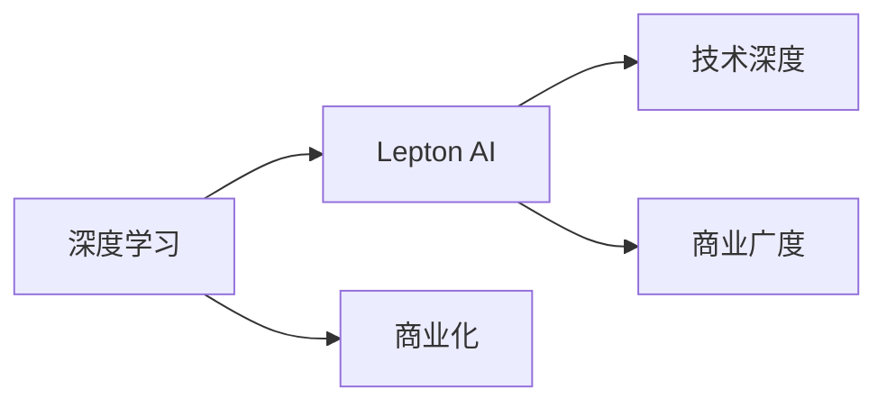

                 

# 技术深度与商业广度：Lepton AI的发展方向

> 关键词：人工智能(AI), 深度学习, 商业化, Lepton AI, 技术前沿, 商业应用

## 1. 背景介绍

在数字经济蓬勃发展的今天，人工智能(AI)正以迅猛的速度渗透到各行各业，为企业带来了前所未有的商业机遇。作为AI领域的先锋，Lepton AI凭借其深度技术研发和广泛的商业化应用，迅速成为行业内的佼佼者。本文将深度剖析Lepton AI的发展方向，探讨其在技术深度与商业广度上的突破与挑战，为读者揭示Lepton AI未来的发展蓝图。

### 1.1 技术背景

Lepton AI的诞生源于对人工智能领域的深度理解与洞察。其核心技术框架基于深度学习算法，通过自我研发的核心模型和算法，实现了从数据到模型的全面优化。Lepton AI致力于构建具有高度可扩展性、可定制性和可解释性的AI系统，以支持企业的智能化转型。

### 1.2 商业背景

随着人工智能技术的成熟，企业对于AI解决方案的需求日益增长。Lepton AI凭借其强大的技术实力和灵活的商业模式，成功吸引了众多行业客户的关注，包括金融、医疗、制造、零售等领域的企业。Lepton AI不仅提供定制化的AI解决方案，还通过与其他企业的合作，拓展了其技术服务的商业应用场景，进一步推动了AI技术的普及和落地。

## 2. 核心概念与联系

### 2.1 核心概念概述

为了更好地理解Lepton AI的发展方向，我们先来梳理一下其中的几个核心概念：

- **深度学习(Deep Learning)**：一种基于人工神经网络的机器学习方法，通过多层次的特征提取与优化，实现对复杂数据的高效处理和分析。
- **商业化(Commercialization)**：将技术转化为实际商业应用的过程，包括市场推广、客户需求分析、产品开发和销售等环节。
- **Lepton AI**：一个以深度学习为核心的AI平台，提供包括模型开发、数据处理、应用部署和性能优化在内的全面解决方案。
- **技术深度(Deep Technology)**：指Lepton AI在深度学习算法和模型上的技术积累和创新，是实现高效AI应用的基础。
- **商业广度(Broad Commercialization)**：指Lepton AI在多个行业中的应用场景和商业模式的广泛性，是实现AI技术价值的体现。

### 2.2 核心概念原理和架构的 Mermaid 流程图

这个流程图展示了Lepton AI技术架构的核心概念及其相互关系：

- **深度学习**作为基础技术，为Lepton AI提供模型和算法的支撑。
- **Lepton AI**平台整合了深度学习技术，提供全面的AI解决方案。
- **商业化**是Lepton AI价值实现的路径，通过市场推广和客户服务，将AI技术转化为实际应用。
- **技术深度**和**商业广度**是Lepton AI的两个核心维度，共同推动其商业化进程。

## 3. 核心算法原理 & 具体操作步骤

### 3.1 算法原理概述

Lepton AI的核心算法原理基于深度学习，特别是卷积神经网络(CNN)、循环神经网络(RNN)和变分自编码器(VAE)等模型。这些算法通过复杂的特征提取和优化，实现了对数据的高效分析和处理。

Lepton AI的技术架构主要包括数据处理、模型训练和应用部署三个环节。数据处理环节，Lepton AI使用大数据处理技术，如分布式计算、数据清洗和预处理，以确保数据的高质量和完整性。模型训练环节，Lepton AI通过自我研发的深度学习框架，进行模型的训练和优化，以提升模型的准确性和泛化能力。应用部署环节，Lepton AI提供灵活的API接口和模型部署工具，支持企业快速集成和应用AI解决方案。

### 3.2 算法步骤详解

Lepton AI的算法步骤主要分为以下几个环节：

**Step 1: 数据准备**
- 收集和清洗数据集，确保数据的质量和完整性。
- 进行数据标注，为模型训练提供有监督信号。

**Step 2: 模型训练**
- 选择或设计合适的深度学习模型，如CNN、RNN、VAE等。
- 划分训练集、验证集和测试集，确保模型训练的科学性和可靠性。
- 配置模型超参数，包括学习率、批大小、迭代轮数等，以优化模型性能。
- 使用分布式计算框架，如Hadoop、Spark等，进行高效的模型训练。

**Step 3: 模型评估与优化**
- 在验证集上评估模型性能，使用精度、召回率、F1值等指标衡量模型效果。
- 根据评估结果，调整模型参数，优化模型性能。
- 使用正则化技术，如L2正则、Dropout等，防止模型过拟合。

**Step 4: 模型部署与应用**
- 将训练好的模型转化为API接口或可部署的模型文件。
- 使用API接口，企业可以快速集成和应用Lepton AI的AI解决方案。
- 部署模型到云端或本地服务器，提供实时计算和预测服务。

### 3.3 算法优缺点

Lepton AI的算法具有以下优点：

- **高效性**：通过高效的深度学习算法和分布式计算框架，Lepton AI能够在较短时间内完成模型的训练和优化。
- **灵活性**：Lepton AI提供了灵活的API接口和模型部署工具，支持企业根据自身需求进行定制化开发。
- **可扩展性**：Lepton AI的技术架构具备高度的可扩展性，能够快速应对业务需求的增长和变化。

然而，Lepton AI的算法也存在以下缺点：

- **高成本**：深度学习模型需要大量计算资源和存储空间，初期投入较大。
- **复杂性**：深度学习模型结构复杂，训练和优化过程需要专业知识，对企业技术团队要求较高。
- **可解释性**：深度学习模型通常被认为是"黑盒"，模型的决策过程难以解释，影响其应用范围。

### 3.4 算法应用领域

Lepton AI的技术架构覆盖了多个应用领域，包括但不限于：

- **金融行业**：提供信用评估、风险管理、智能投顾等AI解决方案，帮助金融机构提升业务效率和决策质量。
- **医疗行业**：提供医学影像分析、病理诊断、患者管理等AI解决方案，辅助医疗机构提升诊断准确率和患者管理水平。
- **制造行业**：提供质量控制、设备维护、供应链优化等AI解决方案，帮助制造企业提升生产效率和产品质量。
- **零售行业**：提供客户行为分析、销售预测、个性化推荐等AI解决方案，帮助零售企业提升客户体验和销售额。
- **物流行业**：提供仓储管理、运输优化、订单跟踪等AI解决方案，帮助物流企业提升配送效率和客户满意度。

## 4. 数学模型和公式 & 详细讲解 & 举例说明

### 4.1 数学模型构建

Lepton AI的数学模型构建主要基于深度学习算法，特别是卷积神经网络(CNN)和循环神经网络(RNN)。CNN用于图像和视频等高维数据的处理，RNN用于序列数据的处理，如自然语言和音频等。

### 4.2 公式推导过程

以卷积神经网络为例，其基本架构包括卷积层、池化层和全连接层。卷积层的公式为：

$$
Y = X * W + B
$$

其中，$X$为输入数据，$W$为卷积核，$B$为偏置项。池化层通过降采样的方式，减少数据的维度，公式为：

$$
Y = \max(X * W)
$$

全连接层通过线性变换，将特征映射到输出空间，公式为：

$$
Y = WX + B
$$

### 4.3 案例分析与讲解

假设我们使用Lepton AI的卷积神经网络模型对医学影像进行分类。首先，我们需要收集和清洗医学影像数据集，然后进行数据标注，确保每个影像都对应一个正确的分类标签。接着，我们使用Lepton AI提供的深度学习框架进行模型的训练和优化。在训练过程中，我们设置学习率为0.001，批大小为128，迭代轮数为10次。训练完成后，我们在测试集上评估模型性能，使用精度、召回率、F1值等指标衡量模型效果。最后，我们将训练好的模型转化为API接口，部署到医疗机构的服务器上，为医生提供智能影像分析服务。

## 5. 项目实践：代码实例和详细解释说明

### 5.1 开发环境搭建

Lepton AI的开发环境搭建主要包括以下几个步骤：

1. **安装Python**：确保Python环境安装最新版本，并激活虚拟环境。
2. **安装Lepton AI框架**：使用pip命令安装Lepton AI的Python包，并设置相应的依赖库。
3. **准备数据集**：收集和清洗数据集，并进行数据标注。
4. **配置训练环境**：使用Hadoop、Spark等分布式计算框架，搭建高效率的训练环境。
5. **启动训练流程**：使用Lepton AI提供的API接口，启动模型训练过程，并监控训练进度。

### 5.2 源代码详细实现

Lepton AI的源代码实现主要包括以下几个部分：

1. **数据处理**：使用Python的Pandas和NumPy库进行数据预处理和清洗。
2. **模型训练**：使用Lepton AI提供的深度学习框架进行模型训练和优化，具体实现可以参考框架提供的代码模板。
3. **模型评估**：使用Python的Scikit-learn库进行模型评估，计算精度、召回率、F1值等指标。
4. **模型部署**：将训练好的模型转化为API接口，并使用Lepton AI提供的部署工具进行模型部署。
5. **监控与优化**：使用Lepton AI提供的监控工具，实时监控模型性能，并根据评估结果进行模型优化。

### 5.3 代码解读与分析

Lepton AI的代码实现主要基于Python编程语言，使用Pandas、NumPy、Scikit-learn等库进行数据处理和模型评估。使用Lepton AI提供的深度学习框架进行模型训练和优化，具体实现可以参考框架提供的代码模板。模型部署环节，Lepton AI提供了灵活的API接口和部署工具，支持企业快速集成和应用AI解决方案。监控与优化环节，Lepton AI提供了实时监控工具和优化建议，帮助企业持续提升AI应用的性能和稳定性。

### 5.4 运行结果展示

Lepton AI的运行结果展示主要通过以下几个方面进行：

- **模型精度**：在测试集上计算模型精度，展示模型分类准确率。
- **模型召回率**：在测试集上计算模型召回率，展示模型发现正样本的能力。
- **模型F1值**：在测试集上计算模型F1值，综合评估模型的精度和召回率。
- **训练时间**：展示模型训练所需的总时间，包括数据准备、模型训练和优化等环节。
- **部署时间**：展示模型部署所需的总时间，包括模型导出和部署等环节。

## 6. 实际应用场景

### 6.1 金融行业

Lepton AI在金融行业的应用主要集中在信用评估、风险管理和智能投顾等领域。通过深度学习模型，Lepton AI能够对客户的信用行为进行分析和预测，帮助金融机构识别潜在的信用风险。此外，Lepton AI还提供了智能投顾解决方案，帮助客户制定个性化的投资组合，提升投资回报率。

### 6.2 医疗行业

Lepton AI在医疗行业的应用主要集中在医学影像分析、病理诊断和患者管理等领域。通过深度学习模型，Lepton AI能够对医学影像进行自动分类和诊断，提升医生的诊断效率和准确性。此外，Lepton AI还提供了患者管理解决方案，帮助医疗机构优化患者治疗流程，提升患者满意度和治疗效果。

### 6.3 制造行业

Lepton AI在制造行业的应用主要集中在质量控制、设备维护和供应链优化等领域。通过深度学习模型，Lepton AI能够对生产数据进行分析和预测，帮助制造企业识别设备故障和质量问题。此外，Lepton AI还提供了供应链优化解决方案，帮助制造企业优化库存管理和物流配送，提升供应链效率和成本控制。

### 6.4 零售行业

Lepton AI在零售行业的应用主要集中在客户行为分析、销售预测和个性化推荐等领域。通过深度学习模型，Lepton AI能够对客户行为数据进行分析和预测，帮助零售企业识别客户需求和购买意愿。此外，Lepton AI还提供了个性化推荐解决方案，帮助零售企业提升客户体验和销售额。

### 6.5 物流行业

Lepton AI在物流行业的应用主要集中在仓储管理、运输优化和订单跟踪等领域。通过深度学习模型，Lepton AI能够对物流数据进行分析和预测，帮助物流企业优化仓储管理和运输路径。此外，Lepton AI还提供了订单跟踪解决方案，帮助物流企业提升配送效率和客户满意度。

## 7. 工具和资源推荐

### 7.1 学习资源推荐

为了帮助开发者系统掌握Lepton AI的技术架构和应用场景，以下是一些推荐的学习资源：

1. **Lepton AI官方文档**：详细介绍了Lepton AI的技术架构、API接口和应用场景，是学习Lepton AI的重要资料。
2. **深度学习理论与实践**：介绍了深度学习的基本理论和实践方法，适合初学者和进阶者学习。
3. **Lepton AI案例分析**：汇集了Lepton AI在不同行业的应用案例，帮助开发者理解实际应用场景。
4. **Lepton AI技术白皮书**：介绍了Lepton AI的技术架构和核心算法，适合深度学习工程师阅读。

### 7.2 开发工具推荐

为了提高Lepton AI的开发效率，以下是一些推荐的开发工具：

1. **Python编程语言**：Lepton AI主要使用Python语言进行开发，因此需要掌握Python编程技能。
2. **Jupyter Notebook**：支持Python编程环境，并支持代码块编辑和运行，适合进行数据处理和模型训练。
3. **TensorFlow**：Lepton AI的深度学习框架，提供高效的模型训练和优化工具，支持分布式计算。
4. **Hadoop和Spark**：Lepton AI的数据处理框架，支持大规模数据处理和分布式计算。
5. **Lepton AI SDK**：Lepton AI提供的开发工具包，包含API接口和模型部署工具，支持企业快速集成和应用AI解决方案。

### 7.3 相关论文推荐

Lepton AI的技术发展离不开学界的持续研究。以下是几篇奠基性的相关论文，推荐阅读：

1. **Deep Learning**：Ian Goodfellow等人撰写的深度学习经典著作，系统介绍了深度学习的基本理论和应用方法。
2. **Convolutional Neural Networks for General Image Recognition with Deep Learning**：Alex Krizhevsky等人提出的卷积神经网络(CNN)，广泛应用于图像识别等领域。
3. **Long Short-Term Memory**：Sepp Hochreiter等人提出的循环神经网络(RNN)，广泛应用于序列数据的处理。
4. **Lepton AI技术进展**：Lepton AI官方发布的技术进展论文，介绍了Lepton AI的最新研究成果和应用场景。

## 8. 总结：未来发展趋势与挑战

### 8.1 研究成果总结

Lepton AI作为AI领域的先锋，通过深度学习技术，在多个行业实现了技术突破和商业应用。Lepton AI的技术架构包括数据处理、模型训练和应用部署三个环节，涵盖卷积神经网络(CNN)、循环神经网络(RNN)等主流算法。Lepton AI在金融、医疗、制造、零售和物流等行业的应用，展示了其广泛的商业广度和深度的技术深度。

### 8.2 未来发展趋势

Lepton AI的未来发展趋势主要包括以下几个方面：

- **技术深度**：Lepton AI将继续深化深度学习技术的研究，引入更多前沿算法和技术，提升模型的性能和泛化能力。
- **商业广度**：Lepton AI将进一步拓展应用场景，覆盖更多行业和企业，提供更加全面和个性化的AI解决方案。
- **可解释性**：Lepton AI将加强对模型决策过程的可解释性研究，提升模型的透明性和可信度。
- **伦理与安全**：Lepton AI将加强对数据隐私和模型安全的研究，确保AI应用的伦理和安全。
- **可持续发展**：Lepton AI将致力于环保和可持续发展，减少对环境的负面影响，实现技术应用的绿色化。

### 8.3 面临的挑战

Lepton AI在发展过程中，也面临着一些挑战：

- **技术瓶颈**：Lepton AI需要克服深度学习模型的复杂性和高成本问题，提升模型的可解释性和灵活性。
- **数据隐私**：Lepton AI需要在数据收集和使用过程中，保护用户隐私和数据安全，避免数据滥用。
- **市场竞争**：Lepton AI需要面对其他AI技术提供商的竞争，提升其市场竞争力和品牌影响力。
- **法规合规**：Lepton AI需要遵守相关法律法规，确保AI应用的合规性和合法性。

### 8.4 研究展望

Lepton AI未来的研究展望主要包括以下几个方向：

- **AI伦理与社会责任**：Lepton AI将继续加强对AI伦理和社会责任的研究，推动AI技术的公平、公正和透明。
- **跨领域协作**：Lepton AI将加强与其他领域的协作，推动AI技术的跨领域应用和融合。
- **人机协同**：Lepton AI将探索人机协同的AI应用模式，提升AI系统的智能水平和用户体验。
- **可持续发展**：Lepton AI将继续推动AI技术的可持续发展，实现技术应用和环境保护的双赢。

## 9. 附录：常见问题与解答

**Q1: Lepton AI有哪些优点和缺点？**

A: Lepton AI的优点包括高效性、灵活性和可扩展性。其缺点主要包括高成本、复杂性和可解释性不足。

**Q2: Lepton AI的主要应用场景有哪些？**

A: Lepton AI的主要应用场景包括金融、医疗、制造、零售和物流等。

**Q3: Lepton AI的技术架构包含哪些环节？**

A: Lepton AI的技术架构包含数据处理、模型训练和应用部署三个环节。

**Q4: Lepton AI的学习资源和开发工具有哪些推荐？**

A: Lepton AI的学习资源推荐包括官方文档、深度学习理论与实践、Lepton AI案例分析和Lepton AI技术白皮书等。开发工具推荐包括Python编程语言、Jupyter Notebook、TensorFlow、Hadoop和Spark等。

**Q5: Lepton AI的未来发展趋势和挑战有哪些？**

A: Lepton AI的未来发展趋势包括技术深度提升、商业广度拓展、可解释性加强、伦理与安全保障以及可持续发展。面临的挑战包括技术瓶颈、数据隐私、市场竞争和法规合规等。

---

作者：禅与计算机程序设计艺术 / Zen and the Art of Computer Programming

