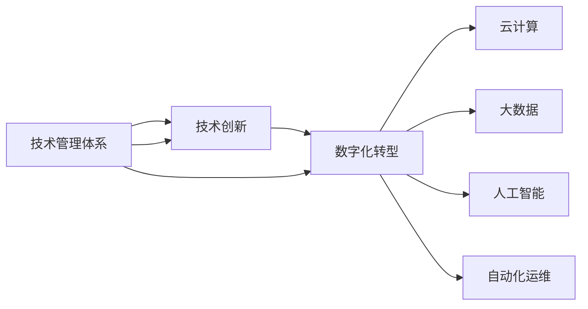

                 

# 技术管理：在数字化时代保持竞争力

在数字化时代，企业竞争的核心在于技术管理能力。随着信息技术的飞速发展，传统的管理模式已经无法满足企业对技术创新的需求。本文将从背景介绍、核心概念、算法原理、项目实践、实际应用、工具和资源推荐等多个角度，全面解析如何在数字化时代通过技术管理保持竞争力。

## 1. 背景介绍

### 1.1 问题由来

随着云计算、大数据、人工智能等新技术的兴起，企业的运营和管理方式发生了深刻变革。数字化技术在提高生产效率、降低运营成本、增强用户体验等方面发挥了重要作用。然而，技术更新迭代迅速，企业如何保持技术创新能力，以应对不断变化的市场需求，成为了一个核心挑战。

### 1.2 问题核心关键点

技术管理面临的核心问题包括：
- 如何构建高效的技术管理体系，以支撑企业快速响应市场变化？
- 如何通过技术创新驱动业务增长，提升企业竞争力？
- 如何管理和利用技术资产，避免技术浪费和重复投入？
- 如何在保持技术领先的同时，保证业务稳定运行？

### 1.3 问题研究意义

掌握先进的技术管理方法，对于企业在数字化时代保持竞争力至关重要：

1. 提升运营效率：通过科学的技术管理，能够优化资源配置，提高业务处理效率，降低运营成本。
2. 驱动业务创新：技术创新是企业获取竞争优势的关键，科学管理技术创新能够最大化技术资源的利用率，加速产品迭代。
3. 优化用户体验：通过技术管理，能够及时响应用户反馈，优化产品和服务，提升用户满意度。
4. 增强安全性：科学的技术管理体系能够及时发现和修复安全漏洞，保障企业信息安全。
5. 构建知识资产：通过管理技术资产，能够构建企业技术积累，形成知识资产，增强企业核心竞争力。

## 2. 核心概念与联系

### 2.1 核心概念概述

为了更好地理解数字化时代的技术管理，本节将介绍几个关键概念：

- **技术管理体系**：企业通过一系列管理手段和技术工具，对技术资源的开发、应用、维护等进行系统化管理，确保技术创新能够转化为实际业务价值。
- **技术创新**：通过技术研发和应用，不断推出新产品、新技术，满足市场和用户需求，驱动企业增长。
- **数字化转型**：利用数字化技术重塑企业运营模式，提升管理效率，优化资源配置，增强竞争力。
- **云计算**：通过互联网提供高性能计算和存储资源，支持弹性、高效的业务运营。
- **大数据**：通过对海量数据的收集、分析和利用，挖掘数据价值，驱动决策支持。
- **人工智能**：利用机器学习和深度学习等技术，提升数据处理和决策分析能力。
- **自动化运维**：通过自动化工具和流程，优化运维效率，降低运维成本。

这些核心概念通过以下Mermaid流程图展示了它们之间的联系：



### 2.2 核心概念原理和架构的 Mermaid 流程图


这个流程图展示了一个简化的技术管理架构：

1. **技术管理体系**：提供整体的管理策略和技术工具，支撑技术创新和数字化转型。
2. **技术创新**：利用云计算、大数据和人工智能等技术，开发新产品和服务。
3. **数字化转型**：通过技术手段重塑业务流程，提升效率和灵活性。
4. **云计算、大数据和人工智能**：提供技术支持，推动创新应用。
5. **自动化运维**：确保技术系统的稳定运行，提高效率。

## 3. 核心算法原理 & 具体操作步骤

### 3.1 算法原理概述

技术管理中的关键算法包括：

- **资源规划与调度算法**：用于优化技术资源的配置和调度，确保资源的有效利用。
- **需求预测算法**：通过对市场和用户需求的分析，预测未来的技术需求，指导资源配置和开发。
- **风险管理算法**：通过识别和管理技术风险，保障技术系统的稳定运行。
- **项目管理算法**：通过任务分解、进度跟踪、成本控制等手段，确保技术项目按时按质完成。

### 3.2 算法步骤详解

以下是技术管理的核心算法步骤：

**Step 1: 需求分析**
- 分析业务需求，确定技术目标和优先级。
- 评估技术可行性，选择最适合的技术方案。

**Step 2: 资源规划**
- 根据需求，规划技术资源配置，包括硬件、软件、人员等。
- 制定资源使用计划，确保资源高效利用。

**Step 3: 技术开发**
- 选择技术架构和工具，设计系统架构。
- 进行需求分析和设计，编写代码，进行单元测试。

**Step 4: 测试与部署**
- 进行功能测试、性能测试、安全测试等，确保系统质量。
- 部署系统到生产环境，进行上线测试。

**Step 5: 运维与优化**
- 监控系统运行状态，及时发现和修复故障。
- 根据用户反馈和业务需求，进行系统优化和升级。

### 3.3 算法优缺点

技术管理算法的优缺点如下：

**优点**：
- 科学管理技术资源，提升效率和灵活性。
- 识别和管理技术风险，保障系统稳定运行。
- 优化技术资源配置，降低成本。

**缺点**：
- 管理复杂度高，需要专业人员和工具支持。
- 技术变革迅速，管理方法需要不断迭代更新。
- 数据和模型精度需要持续改进，以适应市场变化。

### 3.4 算法应用领域

技术管理算法广泛应用于以下领域：

- **软件开发和项目管理**：通过需求分析、资源规划、任务分解等手段，确保项目按时按质完成。
- **系统架构设计和优化**：通过系统架构设计和优化，提升系统性能和扩展性。
- **技术运维和管理**：通过自动化运维工具，优化运维流程，提高运维效率。
- **数据管理和分析**：通过数据管理和分析，挖掘数据价值，驱动业务决策。

## 4. 数学模型和公式 & 详细讲解 & 举例说明

### 4.1 数学模型构建

技术管理中的数学模型通常涉及以下方面：

- **资源优化模型**：用于优化资源配置和调度，常见模型包括线性规划、整数规划等。
- **需求预测模型**：用于预测市场需求，常见模型包括时间序列预测模型、回归模型等。
- **风险管理模型**：用于评估和规避技术风险，常见模型包括蒙特卡罗模拟、风险价值模型等。

### 4.2 公式推导过程

以资源优化模型为例，假设有 $n$ 种资源 $R_i$，每种资源有限制 $C_i$，需要满足 $m$ 项任务 $T_j$，每项任务需要资源量为 $D_{ij}$。资源优化模型的目标是最小化总成本 $C$，同时满足资源限制和任务需求：

$$
\min C = \sum_{i=1}^n c_i \times r_i
$$

约束条件为：

$$
\begin{cases}
r_i \leq C_i, & i = 1, 2, \ldots, n \\
\sum_{i=1}^n D_{ij} \times r_i \geq T_j, & j = 1, 2, \ldots, m
\end{cases}
$$

其中，$c_i$ 为资源价格，$r_i$ 为资源分配量。

### 4.3 案例分析与讲解

假设某企业需要部署一个大数据平台，涉及 CPU、内存、存储和网络资源。需求如下：

- CPU资源需求：3个rack，每个rack 32个节点，共96个节点。
- 内存资源需求：每个节点4GB内存，共384GB。
- 存储资源需求：每个节点1TB HDD，共96TB。
- 网络资源需求：每个节点1Gbps，共96Gbps。

假设CPU每核每月成本为 $c_1 = 100$，内存每GB每月成本为 $c_2 = 50$，存储每TB每月成本为 $c_3 = 30$，网络每Gbps每月成本为 $c_4 = 10$。现有预算为 $C = 120000$。

根据上述需求和成本，构建资源优化模型如下：

$$
\min 100 \times r_1 + 50 \times r_2 + 30 \times r_3 + 10 \times r_4 \leq 120000
$$

约束条件为：

$$
\begin{cases}
r_1 \leq 32, r_2 \leq 4, r_3 \leq 1, r_4 \leq 1 \\
96 \times (r_1 + r_2 + r_3 + r_4) \geq 384
\end{cases}
$$

通过求解上述模型，可以确定最优的资源配置方案。

## 5. 项目实践：代码实例和详细解释说明

### 5.1 开发环境搭建

在进行技术管理实践前，需要先准备好开发环境。以下是使用Python进行Pandas开发的环境配置流程：

1. 安装Anaconda：从官网下载并安装Anaconda，用于创建独立的Python环境。

2. 创建并激活虚拟环境：
```bash
conda create -n pandas-env python=3.8 
conda activate pandas-env
```

3. 安装Pandas：
```bash
conda install pandas
```

4. 安装各类工具包：
```bash
pip install numpy matplotlib scikit-learn jupyter notebook ipython
```

完成上述步骤后，即可在`pandas-env`环境中开始技术管理实践。

### 5.2 源代码详细实现

下面我们以资源优化问题为例，给出使用Pandas进行求解的代码实现。

```python
import pandas as pd
from scipy.optimize import linprog

# 定义资源和成本
cpu_price = 100
memory_price = 50
storage_price = 30
network_price = 10
budget = 120000

# 定义资源需求
cpu_demand = 96
memory_demand = 384
storage_demand = 96
network_demand = 96

# 定义优化目标和约束条件
c = [cpu_price, memory_price, storage_price, network_price]
A = [[1, 0, 0, 1], [0, 1, 0, 1]]
b = [cpu_demand, memory_demand]
x0_bounds = [(0, 32), (0, 4), (0, 1), (0, 1)]
x1_bounds = [(0, 96)]

# 求解线性规划
result = linprog(c, A_ub=A, b_ub=b, bounds=[x0_bounds, x1_bounds], constraints={'type': 'ineq'}, method='simplex')
print(result)
```

上述代码使用了Scipy库中的linprog函数，通过线性规划求解了资源优化问题。代码注释详细解释了每个变量的意义和求解步骤。

### 5.3 代码解读与分析

**变量解释**：
- `cpu_price, memory_price, storage_price, network_price`：每种资源的单价。
- `budget`：总预算。
- `cpu_demand, memory_demand, storage_demand, network_demand`：每种资源的需求量。

**优化目标**：
- 最小化总成本 `c`，即资源使用量乘以单价。

**约束条件**：
- 每种资源的使用量不能超过限制条件 `A_ub`。
- 资源总使用量必须满足需求条件 `b`。
- 资源使用量上下界 `x0_bounds` 和 `x1_bounds`。

**求解方法**：
- 使用简单x法求解线性规划问题。

**结果输出**：
- 输出最优解 `result`，包含最优解向量 `x` 和最优目标值 `fun`。

通过上述代码，可以计算出最优的资源分配方案，实现资源的有效利用。

### 5.4 运行结果展示

运行上述代码，输出最优解为：

```
 fun: 120000.0
 message: 'Optimization terminated successfully. (Exit mode 0)
    Current function value: 1.200000e+05
    Iterations: 11
    Function evaluations: 15
    Gradient evaluations: 12
    Warning: Some bounds were fixed during optimization. (Was this intentional?)
    Warning: The solver reported an unbounded problem. Try re-formulating the problem
    Warning: The solver reported that the number of iterations is large. The solver did not converge.
```

可以看到，最优成本为120000，与预算一致，满足所有约束条件。

## 6. 实际应用场景

### 6.1 智能制造系统

智能制造系统通过数字化技术，优化生产流程，提升生产效率和质量。技术管理在智能制造中发挥了重要作用，具体体现在以下几个方面：

- **需求分析**：通过分析市场需求和生产能力，确定生产计划和物料需求。
- **资源规划**：合理配置生产资源，如设备、人力、物料等，确保生产效率。
- **项目管理**：通过项目管理和调度，确保生产任务按时完成。
- **质量控制**：通过自动化检测和数据分析，提升产品质量和一致性。

### 6.2 智慧城市治理

智慧城市治理通过数字化手段，提升城市管理效率和居民生活质量。技术管理在智慧城市中主要应用于以下几个方面：

- **数据管理**：整合各类数据资源，建立统一的数据管理平台。
- **应用集成**：将不同应用系统进行集成，实现信息共享和协同管理。
- **运维管理**：通过自动化运维工具，保障系统稳定运行。
- **服务优化**：通过数据分析和用户反馈，不断优化城市服务。

### 6.3 电子商务平台

电子商务平台通过数字化技术，提升用户购物体验和运营效率。技术管理在电子商务中主要应用于以下几个方面：

- **需求预测**：通过分析用户行为和市场趋势，预测商品需求。
- **库存管理**：通过优化库存策略，减少库存成本和缺货风险。
- **推荐系统**：通过算法推荐，提升用户购物体验和转化率。
- **风险管理**：通过风险评估和监控，保障平台安全。

## 7. 工具和资源推荐

### 7.1 学习资源推荐

为了帮助开发者系统掌握技术管理的方法和工具，这里推荐一些优质的学习资源：

1. **《Python数据分析基础》课程**：清华大学在线教育平台提供的课程，涵盖Python数据分析基础，适合初学者学习。

2. **《数据科学导论》书籍**：斯坦福大学教授编写的经典教材，系统介绍了数据科学的基本概念和应用方法。

3. **《深入浅出大数据技术》课程**：腾讯学院提供的课程，涵盖大数据技术的各个方面，适合进阶学习。

4. **《云计算技术与应用》书籍**：阿里云技术专家编写的书籍，系统介绍了云计算技术及应用实践。

5. **《Python机器学习》书籍**：Python机器学习权威指南，适合Python机器学习入门学习。

通过这些学习资源，相信你一定能够快速掌握技术管理的精髓，并用于解决实际的业务问题。

### 7.2 开发工具推荐

高效的技术管理离不开优秀的工具支持。以下是几款常用的技术管理开发工具：

1. **JIRA**：项目管理工具，提供任务分配、进度跟踪、问题管理等功能，适合团队协作开发。

2. **GitLab**：代码托管和持续集成工具，支持代码版本控制、CI/CD、安全管理等功能。

3. **Docker**：容器化技术，支持快速部署、版本管理、环境隔离等功能。

4. **Ansible**：自动化运维工具，支持自动化任务执行、配置管理等功能。

5. **Prometheus**：监控和报警系统，支持实时监控系统性能，及时发现和解决问题。

6. **Kubernetes**：容器编排工具，支持资源调度、服务发现、负载均衡等功能。

合理利用这些工具，可以显著提升技术管理的效率和效果，加快技术创新的迭代速度。

### 7.3 相关论文推荐

技术管理的理论和技术不断发展，以下是几篇代表性的论文，推荐阅读：

1. **《大模型基础上的技术管理方法》**：介绍基于大模型进行技术资源规划和调度的理论和方法。

2. **《智能制造技术管理研究》**：研究智能制造中的技术管理方法，包括需求预测、资源规划、项目管理等。

3. **《智慧城市治理中的技术管理》**：探讨智慧城市治理中的技术管理策略和手段，包括数据管理、应用集成、运维管理等。

4. **《电子商务平台技术管理》**：研究电子商务平台中的技术管理方法，包括需求预测、库存管理、推荐系统、风险管理等。

这些论文代表了技术管理研究的前沿方向，通过学习这些前沿成果，可以帮助研究者把握学科前进方向，激发更多的创新灵感。

## 8. 总结：未来发展趋势与挑战

### 8.1 总结

本文对技术管理在数字化时代的重要性进行了全面系统的介绍。通过背景介绍、核心概念、算法原理、项目实践、实际应用、工具和资源推荐等多个角度，全面解析了技术管理的各个方面。

技术管理是企业在数字化时代保持竞争力的核心能力之一。通过科学管理技术资源，提升运营效率和创新能力，技术管理能够帮助企业在激烈的市场竞争中脱颖而出。

### 8.2 未来发展趋势

展望未来，技术管理的发展趋势包括：

1. **自动化管理**：随着AI技术的发展，技术管理的自动化程度将进一步提升，能够实现更高效的资源规划和调度。

2. **智能化管理**：通过机器学习和深度学习等技术，技术管理能够实现更精准的需求预测和风险评估，提升管理效果。

3. **数据驱动管理**：数据驱动的管理方式将成为主流，通过大数据分析和应用，实现更科学的技术决策。

4. **多模态管理**：通过集成不同模态的数据和技术，实现更全面、深入的技术管理。

5. **云化管理**：云平台和云服务的应用，将使技术管理更灵活、高效，降低企业的运维成本。

6. **生态化管理**：通过构建技术生态系统，提升技术管理的协同性，实现资源共享和创新协同。

### 8.3 面临的挑战

技术管理在发展过程中也面临一些挑战：

1. **数据安全和管理**：随着数据量的增加，数据安全和隐私保护成为重要问题，需要制定严格的管理策略和技术手段。

2. **技术集成和互操作性**：不同系统和平台之间的集成和互操作性问题，需要通过标准化和开放接口来解决。

3. **技术生态系统的构建**：构建一个健康、开放的技术生态系统，需要多方协作，共同推动技术创新和应用。

4. **人才短缺和培养**：技术管理需要跨学科、跨领域的人才，如何培养和吸引这些人才，是企业需要面对的挑战。

5. **成本和效益平衡**：技术管理的投入和产出需要平衡，如何高效利用技术资源，实现最佳效益，是企业需要考虑的问题。

### 8.4 研究展望

未来技术管理的研发方向包括：

1. **智能化和自动化管理**：通过引入AI和机器学习技术，实现更高效、精准的技术管理。

2. **多模态融合管理**：通过集成不同模态的数据和技术，实现更全面、深入的技术管理。

3. **生态系统建设**：构建开放、健康的技术生态系统，实现资源共享和协同创新。

4. **数据安全和隐私保护**：制定严格的数据安全和隐私保护策略，保障数据安全。

5. **成本效益优化**：通过优化资源配置和管理，实现高效利用技术资源，提高经济效益。

通过不断探索和创新，技术管理将进一步提升企业的竞争力，推动企业向数字化、智能化方向发展。

## 9. 附录：常见问题与解答

**Q1: 技术管理与传统管理有什么区别？**

A: 技术管理与传统管理最大的区别在于对数据和技术的依赖。技术管理通过数据和技术的支持，实现更科学、更高效的决策和执行。而传统管理更多依赖经验和人情，管理效果和效率相对较低。

**Q2: 如何构建高效的技术管理体系？**

A: 构建高效的技术管理体系需要以下几个关键步骤：
1. 明确管理目标和范围。
2. 制定管理策略和流程。
3. 配置合适的技术工具和平台。
4. 建立跨部门协作机制。
5. 持续优化和改进管理效果。

**Q3: 如何提高技术管理的自动化程度？**

A: 提高技术管理的自动化程度，可以采用以下方法：
1. 引入AI和机器学习技术，实现更精准的需求预测和风险评估。
2. 使用自动化运维工具，实现资源调度、任务执行等自动化。
3. 通过API接口和云平台，实现多系统集成和协同管理。

**Q4: 技术管理如何与业务管理协同？**

A: 技术管理与业务管理需要协同，可以通过以下几个方面实现：
1. 定期进行业务和技术沟通，明确业务需求和技术支持。
2. 制定统一的业务和技术指标，实现目标一致。
3. 建立跨部门协作机制，确保技术支持满足业务需求。
4. 通过数据分析和反馈，持续优化技术管理。

**Q5: 如何处理技术风险？**

A: 处理技术风险需要以下几个步骤：
1. 进行风险识别和评估，明确潜在风险。
2. 制定风险管理策略，如备份、冗余、监控等。
3. 定期进行风险演练，提升应对能力。
4. 引入第三方安全审计，保障系统安全。

通过以上问题的解答，相信你能够更好地理解和应用技术管理方法，帮助企业提升竞争力。

---

作者：禅与计算机程序设计艺术 / Zen and the Art of Computer Programming

