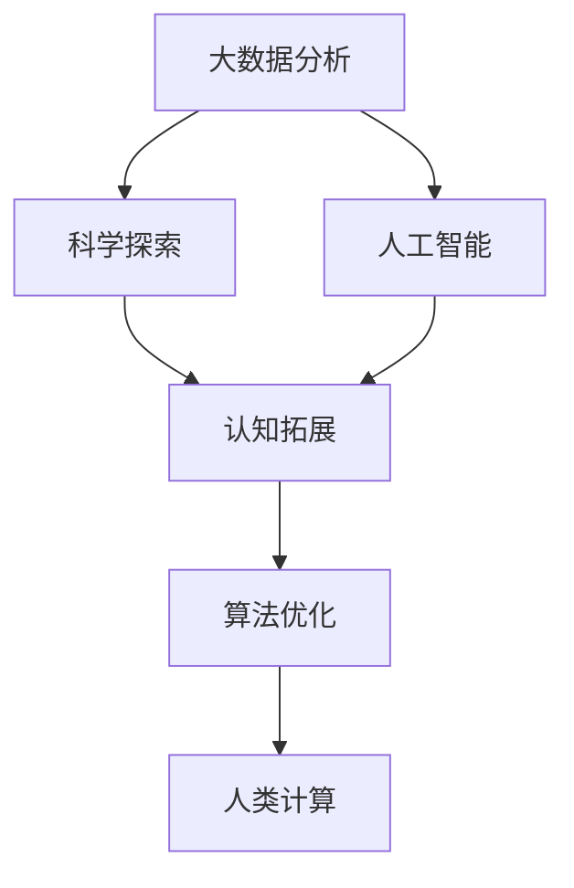

                 

# 拓展认知边界：人类计算的科学探索

> 关键词：人类计算, 认知拓展, 算法优化, 科学探索, 大数据分析, 人工智能

## 1. 背景介绍

### 1.1 问题由来
在信息爆炸的互联网时代，人们获取知识的途径和方式正发生翻天覆地的变化。传统的人类计算方式，如基于逻辑推理、经验总结等，已难以应对庞杂的数据和复杂的问题。因此，构建一种全新的计算模式，利用先进的技术手段拓展人类认知边界，成为了亟待解决的重要问题。

人类计算不仅仅局限于机械的数学运算，更涵盖了广泛的科学研究、自然语言处理、医疗诊断等领域。以往这些领域依赖人工分析，效率低下且容易出错。通过利用机器学习和深度学习算法，可以将复杂的决策过程自动化，提升认知能力与效率。

### 1.2 问题核心关键点
本研究聚焦于如何将人类认知过程和计算能力进行深度融合，利用计算工具拓展人类认知边界。特别是利用数据驱动和算法优化的方式，提升人类在多学科、多领域中的认知能力。具体核心问题包括：

1. 如何高效处理海量数据，发现其背后的规律与趋势？
2. 如何通过算法优化，提升认知能力与决策精度？
3. 如何构建跨学科、跨领域的知识体系，促进知识整合与创新？

## 2. 核心概念与联系

### 2.1 核心概念概述

为更好地理解人类计算的科学探索，本节将介绍几个密切相关的核心概念：

- **人类计算(Human Computation)**：一种以人为计算资源，结合先进算法与技术手段进行大规模数据处理与分析的计算模式。
- **认知拓展(Cognitive Enhancement)**：通过利用计算技术，提升人类在知识获取、问题解决、决策制定等认知活动中表现，实现认知能力的拓展与延伸。
- **算法优化(Algorithm Optimization)**：利用数学模型和算法技术，针对特定问题进行优化与调整，以提高计算效率与精度。
- **科学探索(Scientific Discovery)**：利用数据驱动和算法优化的方法，揭示自然现象与规律，推动科学知识的累积与创新。
- **大数据分析(Big Data Analytics)**：对大规模、多源数据进行收集、处理与分析，以发现其中的潜在价值与模式。
- **人工智能(Artificial Intelligence, AI)**：通过机器学习与深度学习等技术，模拟人类认知与行为，实现智能化的决策与判断。

这些核心概念之间通过计算、认知与知识的方式相互作用，共同构成了人类计算的科学探索框架。通过理解这些核心概念，我们可以更好地把握人类计算的技术原理与应用方向。

### 2.2 核心概念联系

以下用Mermaid流程图展示上述核心概念之间的逻辑关系：



这个流程图展示了大数据、科学探索、人工智能、认知拓展与算法优化之间的联系与相互作用：

1. **大数据分析**：从海量数据中提炼知识与信息。
2. **科学探索**：通过数据与算法揭示自然规律与现象。
3. **人工智能**：利用机器学习与深度学习技术，模拟人类智能。
4. **认知拓展**：通过算法优化与AI技术，提升人类认知能力。
5. **人类计算**：将算法与认知结合，实现大规模数据处理与分析。

这些概念相互支撑，共同构建了人类计算的科学探索体系，为我们提供了一种全新的计算视角和方法论。

## 3. 核心算法原理 & 具体操作步骤

### 3.1 算法原理概述

人类计算的核心在于利用数据与算法，通过大规模的计算处理，拓展人类认知边界。其中，数据驱动与算法优化的结合是实现人类计算的关键。

具体而言，人类计算可以分为以下三个主要步骤：

1. **数据采集与处理**：从各类数据源（如互联网、社交媒体、传感器等）中收集数据，并进行清洗、标注与整合。
2. **算法设计与优化**：通过数学模型和算法技术，对数据进行处理与分析，发现其中的规律与趋势。
3. **认知提升与决策**：结合算法结果与人类经验，提升决策能力和认知水平，实现认知拓展与创新。

### 3.2 算法步骤详解

以下详细介绍人类计算的三个主要步骤：

#### 3.2.1 数据采集与处理

数据采集与处理是进行人类计算的基础。具体步骤如下：

1. **数据收集**：通过爬虫、API接口等手段，从互联网、社交媒体、传感器等数据源中收集数据。
2. **数据清洗**：对收集到的数据进行去重、去噪、填充缺失值等处理，确保数据质量。
3. **数据标注**：对数据进行标注，包括文本分类、实体识别、情感分析等，为后续分析提供标签信息。
4. **数据整合**：将不同来源的数据进行整合，构建统一的数据仓库或数据库，便于后续分析与处理。

#### 3.2.2 算法设计与优化

算法设计与优化是实现人类计算的核心。具体步骤如下：

1. **选择合适的算法**：根据具体问题选择适合的算法模型，如决策树、支持向量机、深度学习等。
2. **算法训练与调参**：利用已标注数据对模型进行训练，调整模型参数以提高性能。
3. **模型评估与优化**：通过交叉验证、A/B测试等方式，评估模型效果并进行优化调整。
4. **算法优化**：通过算法优化技术，如特征选择、模型剪枝、压缩等，提升算法效率与精度。

#### 3.2.3 认知提升与决策

认知提升与决策是将算法结果转化为人类认知的关键。具体步骤如下：

1. **结合算法结果与经验**：将算法的分析结果与人类经验进行结合，进行综合判断与决策。
2. **可视化与解释**：通过可视化技术，将复杂的算法结果进行直观展示，帮助人类理解与分析。
3. **认知拓展**：根据算法结果，拓展人类认知边界，提升在特定领域的表现。
4. **反馈与迭代**：将人类认知反馈到算法中，进行迭代优化，提升认知与决策能力。

### 3.3 算法优缺点

人类计算利用数据与算法，提升人类认知水平与决策能力，具有以下优点：

1. **高效处理数据**：可以高效处理大规模、多源数据，发现其中的潜在规律与趋势。
2. **精确决策支持**：通过算法优化，提升决策精度与可靠性，降低人为错误。
3. **跨学科融合**：促进不同学科、领域的知识整合与创新，推动科学知识的累积。
4. **认知拓展**：利用计算技术，拓展人类认知边界，提升问题解决能力。

但同时也存在一些局限性：

1. **数据质量依赖**：算法结果的可靠性高度依赖于数据质量，数据采集与处理难度大。
2. **算法复杂性**：选择合适的算法模型并进行优化调整，需要深厚的专业知识与经验。
3. **人机交互问题**：算法与人类认知的融合仍存在挑战，需要有效的交互机制。
4. **伦理与隐私**：算法处理与分析可能涉及隐私与伦理问题，需要谨慎处理。

尽管存在这些局限性，但人类计算作为一种新兴的计算模式，仍具有广阔的应用前景，正逐步成为科研与产业界的新范式。

### 3.4 算法应用领域

人类计算的应用领域广泛，包括但不限于以下几个方面：

1. **科学研究**：利用大数据分析与算法优化，发现自然规律与现象，推动科学知识的累积。
2. **医疗诊断**：通过机器学习与深度学习技术，提升疾病诊断与预测能力，促进精准医疗。
3. **金融分析**：利用算法优化，提升投资决策与风险控制能力，促进金融创新与发展。
4. **教育培训**：通过认知拓展与决策支持，提升教育与培训效果，推动教育公平与普及。
5. **智能制造**：结合大数据分析与AI技术，优化生产流程与供应链管理，提升制造业效率与质量。
6. **智能交通**：利用算法优化，提升交通管理与调度效率，改善城市交通问题。

## 4. 数学模型和公式 & 详细讲解 & 举例说明

### 4.1 数学模型构建

本节将利用数学模型来刻画人类计算的核心流程，通过具体的数学模型展示其工作原理。

记数据集为 $D=\{(x_i, y_i)\}_{i=1}^N$，其中 $x_i$ 为输入特征，$y_i$ 为标注结果。

定义算法模型为 $f(x) = w^Tx + b$，其中 $w$ 为模型参数，$b$ 为偏置。

人类计算的目标是构建模型 $f(x)$，使得在给定输入 $x$ 的情况下，能够尽可能准确地预测输出 $y$。

具体步骤如下：

1. **损失函数构建**：选择适合的损失函数 $L(y, \hat{y})$，用于衡量模型预测与真实标签之间的差异。
2. **参数优化**：通过最小化损失函数 $L(y, \hat{y})$，优化模型参数 $w$，使其适应数据分布。
3. **模型评估**：通过验证集或测试集，评估模型效果，确保模型泛化能力。

### 4.2 公式推导过程

以下推导数据驱动与算法优化在人类计算中的数学模型。

#### 4.2.1 线性回归模型

以线性回归为例，展示数据驱动与算法优化的数学模型。

假设数据集 $D=\{(x_i, y_i)\}_{i=1}^N$，其中 $x_i \in \mathbb{R}^n$，$y_i \in \mathbb{R}$。

定义线性回归模型为 $f(x) = wx + b$，其中 $w \in \mathbb{R}^n$，$b \in \mathbb{R}$。

最小二乘法的目标是最小化损失函数：

$$
L(w) = \frac{1}{2N}\sum_{i=1}^N(y_i - wx_i - b)^2
$$

通过求导与求解，得到模型的最优参数：

$$
w = (\frac{1}{N}\sum_{i=1}^N x_ix_i^T)^{-1}\sum_{i=1}^N x_iy_i
$$

$$
b = \bar{y} - w\bar{x}
$$

其中 $\bar{x} = \frac{1}{N}\sum_{i=1}^N x_i$，$\bar{y} = \frac{1}{N}\sum_{i=1}^N y_i$。

通过上述公式，可以构建一个简单的线性回归模型，用于数据驱动与算法优化。

### 4.3 案例分析与讲解

以医疗诊断为例，展示人类计算在实际应用中的具体步骤。

假设医生需要诊断某种疾病，可以通过以下步骤实现：

1. **数据采集**：从医院信息系统、公共卫生数据、患者历史记录等数据源中收集相关数据。
2. **数据清洗**：清洗数据，去除异常值、噪声等，确保数据质量。
3. **数据标注**：将数据标注为健康或患病状态，构建标注数据集。
4. **算法优化**：选择适合的算法模型（如逻辑回归、决策树、支持向量机等），并进行调参与优化。
5. **认知提升**：结合算法结果与医生经验，提升诊断能力与决策精度。
6. **反馈与迭代**：根据诊断结果，调整算法参数与医疗流程，进行迭代优化。

通过以上步骤，医生可以借助算法优化与数据驱动，提升疾病诊断的准确性与可靠性，实现认知拓展与创新。

## 5. 项目实践：代码实例和详细解释说明

### 5.1 开发环境搭建

在进行人类计算的实践前，我们需要准备好开发环境。以下是使用Python进行机器学习开发的常见环境配置流程：

1. 安装Anaconda：从官网下载并安装Anaconda，用于创建独立的Python环境。

2. 创建并激活虚拟环境：
```bash
conda create -n ml-env python=3.8 
conda activate ml-env
```

3. 安装必要的库：
```bash
conda install numpy pandas scikit-learn matplotlib tqdm jupyter notebook ipython
```

完成上述步骤后，即可在`ml-env`环境中开始人类计算的实践。

### 5.2 源代码详细实现

下面我们以线性回归为例，给出使用Scikit-learn进行数据驱动与算法优化的Python代码实现。

首先，导入必要的库：

```python
import numpy as np
from sklearn.linear_model import LinearRegression
from sklearn.metrics import mean_squared_error
from sklearn.model_selection import train_test_split

# 准备数据
X = np.array([[1, 2], [3, 4], [5, 6], [7, 8], [9, 10]])
y = np.array([1, 3, 2, 4, 5])

# 划分训练集与测试集
X_train, X_test, y_train, y_test = train_test_split(X, y, test_size=0.2, random_state=42)

# 构建模型
model = LinearRegression()

# 训练模型
model.fit(X_train, y_train)

# 评估模型
y_pred = model.predict(X_test)
mse = mean_squared_error(y_test, y_pred)

print(f"Mean Squared Error: {mse:.2f}")
```

以上代码展示了如何使用Scikit-learn库进行线性回归模型的训练与评估。

### 5.3 代码解读与分析

让我们再详细解读一下关键代码的实现细节：

**数据准备**：
- 构建一个二维数组 `X` 和 `y`，表示输入特征和标注结果。
- 通过 `train_test_split` 函数将数据集划分为训练集与测试集，确保模型在未见过的数据上也有不错的表现。

**模型构建**：
- 通过 `LinearRegression` 类，构建一个线性回归模型。

**模型训练**：
- 调用 `fit` 方法对训练集进行拟合，得到模型参数。

**模型评估**：
- 使用 `predict` 方法对测试集进行预测。
- 通过 `mean_squared_error` 函数计算预测结果与真实标签之间的均方误差，评估模型效果。

以上代码展示了线性回归模型在数据驱动与算法优化中的基本步骤。开发者可以根据具体问题选择合适的算法模型，进行训练与优化。

## 6. 实际应用场景

### 6.1 科学研究

在科学研究领域，人类计算可以发挥巨大的作用。例如，在天文学领域，通过分析大量天文数据，可以发现新的星系、行星等天体，推动天文学的发展。

在生物学领域，通过分析基因组数据，可以揭示生物体的遗传特征与疾病机理，推动生物医学的研究。

在物理学领域，通过计算大量的物理实验数据，可以发现新的物理规律与现象，推动物理学的进步。

### 6.2 医疗诊断

在医疗诊断领域，人类计算可以大幅提升疾病的诊断与预测能力。例如，通过分析病人的病历数据、基因数据、影像数据等，构建模型进行疾病预测与诊断，显著提高医生的工作效率与诊断准确性。

此外，人类计算还可以用于药物研发、基因编辑等领域，推动医学的创新与发展。

### 6.3 金融分析

在金融分析领域，人类计算可以用于市场预测、风险控制等。例如，通过分析历史交易数据、财务报表等，构建模型预测股市走势，进行投资决策与风险控制。

此外，人类计算还可以用于算法交易、金融欺诈检测等领域，提升金融行业的智能化水平。

### 6.4 未来应用展望

随着技术的不断进步，人类计算的应用领域将不断扩展。未来的应用趋势可能包括：

1. **跨学科融合**：人类计算将促进不同学科、领域的知识整合与创新，推动科学知识的累积。
2. **深度学习与神经网络**：深度学习与神经网络技术将在人类计算中发挥更大的作用，提升数据处理与分析的精度与效率。
3. **人工智能与机器学习**：结合人工智能与机器学习技术，拓展人类计算的能力与范围，实现更加智能化的决策与判断。
4. **区块链与分布式计算**：利用区块链与分布式计算技术，提升数据安全与隐私保护，确保人类计算的可信性与可靠性。

人类计算作为一种新兴的计算模式，正逐步成为科研与产业界的新范式，推动人类认知能力的拓展与提升。

## 7. 工具和资源推荐

### 7.1 学习资源推荐

为了帮助开发者系统掌握人类计算的理论基础与实践技巧，这里推荐一些优质的学习资源：

1. 《Python机器学习基础教程》：适合初学者，涵盖机器学习基础与算法实现，是入门人类计算的必备书籍。
2. 《深度学习》：深度学习领域的经典教材，涵盖深度学习的基本原理与算法实现，是进阶学习的重要参考。
3. 《人类计算导论》：介绍人类计算的基本概念与实现方法，适合科研工作者与工程开发者参考。
4. 《机器学习实战》：通过具体的案例分析，展示机器学习算法在实际问题中的应用，帮助开发者快速上手实践。
5. 《统计学习方法》：介绍统计学习的基本概念与算法实现，适合数学与算法背景的读者参考。

通过对这些资源的学习实践，相信你一定能够快速掌握人类计算的技术原理与应用方法。

### 7.2 开发工具推荐

高效的开发离不开优秀的工具支持。以下是几款用于人类计算开发的常用工具：

1. Python：基于解释型的高级编程语言，语言简洁、功能强大，是数据科学与机器学习开发的常用工具。
2. Scikit-learn：基于Python的机器学习库，提供丰富的算法实现与工具支持，适合数据驱动的算法优化。
3. TensorFlow：由Google主导开发的深度学习框架，生产部署方便，适合大规模工程应用。
4. PyTorch：基于Python的深度学习框架，灵活性高，适合研究与开发。
5. Weights & Biases：模型训练的实验跟踪工具，可以记录和可视化模型训练过程中的各项指标，方便对比和调优。
6. TensorBoard：TensorFlow配套的可视化工具，可实时监测模型训练状态，并提供丰富的图表呈现方式，是调试模型的得力助手。

合理利用这些工具，可以显著提升人类计算的开发效率，加快创新迭代的步伐。

### 7.3 相关论文推荐

人类计算作为一种新兴的计算模式，正在迅速发展。以下是几篇奠基性的相关论文，推荐阅读：

1. 《大规模数据集分析与处理》：介绍大规模数据集的分析与处理方法，是数据科学与机器学习的重要参考。
2. 《人类计算与认知增强》：介绍人类计算的基本原理与实践方法，是研究人类计算的重要文献。
3. 《深度学习与神经网络》：介绍深度学习的基本原理与算法实现，是深度学习领域的经典教材。
4. 《机器学习算法与应用》：介绍机器学习的基本原理与算法实现，涵盖多个实际应用场景。
5. 《认知科学与计算》：介绍认知科学与计算的基本原理，是理解人类计算与认知拓展的重要参考。

这些论文代表了大数据、深度学习与人类计算的发展脉络，通过学习这些前沿成果，可以帮助研究者把握学科前进方向，激发更多的创新灵感。

## 8. 总结：未来发展趋势与挑战

### 8.1 研究成果总结

本研究通过系统介绍人类计算的基本原理与实践方法，展示了人类计算在科学研究、医疗诊断、金融分析等领域的广泛应用。未来，随着技术的不断进步，人类计算将得到更广泛的应用，提升人类认知水平与决策能力。

### 8.2 未来发展趋势

展望未来，人类计算将呈现以下几个发展趋势：

1. **技术进步**：深度学习、神经网络等技术将进一步推动人类计算的发展，提升数据处理与分析的精度与效率。
2. **跨学科融合**：不同学科、领域的知识整合与创新，推动科学知识的累积与创新。
3. **智能决策**：结合人工智能与机器学习技术，拓展人类计算的能力与范围，实现更加智能化的决策与判断。
4. **伦理与安全**：在数据驱动与算法优化的过程中，注重数据安全与隐私保护，确保人类计算的可信性与可靠性。

以上趋势凸显了人类计算的广阔前景，未来的研究将更加深入和广泛，推动人类认知能力的拓展与提升。

### 8.3 面临的挑战

尽管人类计算带来了巨大的变革，但在迈向更加智能化、普适化应用的过程中，仍面临诸多挑战：

1. **数据质量问题**：数据采集与处理过程中，如何保证数据的质量与准确性，避免噪声与偏差。
2. **算法复杂性**：选择合适的算法模型并进行优化调整，需要深厚的专业知识与经验。
3. **人机交互问题**：算法与人类认知的融合仍存在挑战，需要有效的交互机制。
4. **伦理与隐私**：数据处理与分析可能涉及隐私与伦理问题，需要谨慎处理。

尽管存在这些挑战，但人类计算作为一种新兴的计算模式，正逐步成为科研与产业界的新范式，推动人类认知能力的拓展与提升。

### 8.4 研究展望

未来，人类计算的研究将在以下几个方向进行突破：

1. **深度学习与神经网络**：深度学习与神经网络技术将在人类计算中发挥更大的作用，提升数据处理与分析的精度与效率。
2. **跨学科融合**：不同学科、领域的知识整合与创新，推动科学知识的累积与创新。
3. **人工智能与机器学习**：结合人工智能与机器学习技术，拓展人类计算的能力与范围，实现更加智能化的决策与判断。
4. **区块链与分布式计算**：利用区块链与分布式计算技术，提升数据安全与隐私保护，确保人类计算的可信性与可靠性。

通过持续研究与创新，人类计算必将在未来推动科学技术的进步，推动人类认知能力的拓展与提升。

## 9. 附录：常见问题与解答

**Q1：人类计算与传统计算有什么区别？**

A: 人类计算与传统计算最大的区别在于利用了数据驱动与算法优化的思想，通过计算技术拓展人类认知边界，提升问题解决能力。传统计算侧重于机械的数学运算与逻辑推理，难以处理复杂多变的数据问题。

**Q2：如何保证人类计算结果的可靠性？**

A: 人类计算的可靠性高度依赖于数据质量与算法模型的选择。通过多轮数据采集与处理，选择合适的算法模型，并进行调参与优化，可以有效提高计算结果的可靠性。

**Q3：人类计算对技术要求高吗？**

A: 人类计算对技术要求较高，需要深厚的数学与算法知识，以及对数据驱动与算法优化的深刻理解。但随着技术的不断进步，工具与库的不断发展，人类计算的门槛正在逐步降低，逐步成为大众可接受的计算模式。

**Q4：人类计算在实际应用中有哪些挑战？**

A: 人类计算在实际应用中面临数据质量、算法复杂性、人机交互、伦理隐私等多方面的挑战。需要不断进行技术创新与优化，才能真正实现其价值。

**Q5：未来人类计算将面临哪些趋势与挑战？**

A: 未来人类计算将面临技术进步、跨学科融合、智能决策、伦理安全等趋势与挑战。需要不断进行技术创新与优化，才能实现其价值。

---

作者：禅与计算机程序设计艺术 / Zen and the Art of Computer Programming

