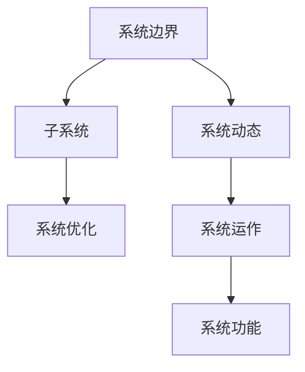

                 

# 拥有体系思维是管理者的必备能力

## 1. 背景介绍

### 1.1 问题由来

当前，随着技术日新月异，特别是人工智能、大数据、云计算等技术的快速发展，组织的管理环境变得异常复杂多变。管理者的工作不仅需要关注传统的组织管理，还需要洞察技术趋势，把握数字化转型的大势所趋。因此，拥有一个科学、全面的体系思维，成为当代管理者不可或缺的能力。

### 1.2 问题核心关键点

管理者需要在快速变化的外部环境中，进行有效的战略规划、组织优化和团队协作，以应对各种挑战。体系思维是一种系统化的思考方式，旨在帮助管理者在复杂的环境中找到有效解决问题的路径，提升组织的整体竞争力。

### 1.3 问题研究意义

掌握体系思维的管理者，能够更加清晰地理解组织的内部运作机制，系统地解决业务问题，提升决策效率。这对于提升组织的核心竞争力和长远发展具有重要意义。

1. 提升组织战略执行力。体系思维帮助管理者系统规划组织的各项活动，确保战略目标的实现。
2. 优化组织结构。体系思维帮助管理者识别组织中的瓶颈，进行结构优化，提升效率。
3. 增强团队协作。体系思维强调系统协作，帮助管理者构建跨部门、跨职能的协同工作机制。
4. 应对复杂环境。体系思维能够帮助管理者全面审视外部环境，采取灵活应对策略。
5. 推动数字化转型。体系思维为组织提供全面的数字化蓝图，指导数字化转型的方向和路径。

## 2. 核心概念与联系

### 2.1 核心概念概述

为了更好地理解体系思维，本节将介绍几个密切相关的核心概念：

- **体系思维(Systemic Thinking)**：强调从整体上理解问题，识别问题的根本原因，并采取系统性解决方案的思考方式。
- **系统(System)**：由相互作用和相互依赖的若干组成部分构成，具有特定功能和目的的有机整体。
- **子系统(Subsystem)**：系统中的组成部分，具有相对独立的结构和功能。
- **系统边界(System Boundary)**：系统与外部环境的分界，影响系统的稳定性和外部影响。
- **系统动态(System Dynamics)**：系统随时间变化的规律，影响系统的行为和性能。
- **系统优化(System Optimization)**：通过识别和消除系统中的低效环节，提升系统整体性能的过程。

这些核心概念之间的逻辑关系可以通过以下Mermaid流程图来展示：



这个流程图展示了几类核心概念的相互联系：

1. 系统边界是系统与外部环境的分界，影响系统动态。
2. 系统由子系统构成，子系统相互作用构成系统。
3. 系统动态影响系统运作，系统优化提升系统功能。

这些概念共同构成了系统思维的逻辑框架，帮助管理者系统性地理解和解决问题。

## 3. 核心算法原理 & 具体操作步骤
### 3.1 算法原理概述

体系思维的核心在于系统的整体观念和系统性思考。在管理实践中，体系思维强调以下几个方面：

1. **整体性原则**：看待问题时，不局限于局部，而是从整体上进行分析。
2. **动态性原则**：理解系统的变化规律，进行动态优化。
3. **交互性原则**：识别系统内部各组成部分间的相互作用和依赖关系。
4. **反馈性原则**：观察系统输出对输入的影响，进行反馈调整。
5. **优化性原则**：通过优化系统的各组成部分，提升整体效率。

### 3.2 算法步骤详解

体系思维在管理中的应用，主要包括以下几个关键步骤：

**Step 1: 确定系统边界**

管理者需要明确系统与外部环境的分界，确定系统的范围和目标。例如，对于企业来说，系统边界可以包括员工、客户、供应商、市场、技术等多个方面。

**Step 2: 识别系统动态**

管理者需要理解系统的变化规律，识别影响系统运作的关键因素。例如，对于企业来说，市场变化、技术迭代、竞争对手动态等都是影响系统运作的重要因素。

**Step 3: 划分子系统**

管理者需要将系统划分为若干子系统，每个子系统具有相对独立的结构和功能。例如，对于企业来说，可以划分为研发、销售、生产、财务等多个子系统。

**Step 4: 建立系统模型**

管理者需要建立系统的模型，描述系统的结构、行为和功能。例如，可以使用因果关系图、流程图示、UML图等方法来构建系统的模型。

**Step 5: 进行系统优化**

管理者需要识别系统中的低效环节，进行优化改进。例如，通过流程再造、资源配置优化、人员培训等手段，提升系统的整体效率。

### 3.3 算法优缺点

体系思维在管理中的应用，具有以下优点：

1. **系统性**：能够全面、系统地分析问题，避免局部和片面的思考。
2. **前瞻性**：通过识别系统动态，进行动态优化，提升应对变化的能力。
3. **交互性**：识别系统内部各组成部分间的相互作用和依赖关系，增强协同效应。
4. **反馈性**：通过观察系统输出对输入的影响，进行动态调整，提升决策的精准度。
5. **优化性**：通过优化系统的各组成部分，提升整体效率，增强竞争力。

同时，体系思维也存在一定的局限性：

1. **复杂性**：体系思维涉及多个子系统，理解和处理复杂系统的关系可能较为困难。
2. **资源消耗**：构建和优化系统模型需要投入大量的时间和资源。
3. **动态变化**：系统的动态变化可能难以完全预测，导致优化效果不尽如人意。
4. **跨学科要求**：体系思维需要跨学科的知识，对管理者的综合能力要求较高。

尽管存在这些局限性，但体系思维在管理中的应用已经显示出其巨大的潜力和价值，被越来越多的管理者所认可和实践。

### 3.4 算法应用领域

体系思维在企业管理中的应用，已经涵盖了从战略规划、组织优化到团队协作、流程再造等多个领域：

- **战略规划**：通过系统思维，管理者能够全面分析市场环境和内部资源，制定科学的战略规划。
- **组织优化**：识别和消除组织中的瓶颈，进行结构优化，提升整体效率。
- **团队协作**：构建跨部门、跨职能的协同工作机制，提升团队协作效率。
- **流程再造**：通过识别和优化流程中的低效环节，提升业务流程的效率和质量。
- **风险管理**：识别和管理系统中的风险点，进行有效的风险控制。

除了企业管理，体系思维在其他领域的应用也非常广泛：

- **政府治理**：帮助政府系统化管理公共事务，提升治理效率。
- **医疗管理**：优化医疗资源配置，提升医疗服务质量。
- **教育管理**：提升教育资源的利用效率，优化教学管理。
- **环境管理**：系统化管理自然资源，提升环境保护效果。

体系思维的应用，正在推动各行业的管理和运营方式的变革，提升整体效率和竞争力。

## 4. 数学模型和公式 & 详细讲解 & 举例说明

### 4.1 数学模型构建

本节将使用数学语言对体系思维在企业管理中的应用进行更加严格的刻画。

假设企业为一个系统，其中包含若干子系统，如销售、研发、生产、财务等。用 $\mathcal{S}$ 表示企业的系统边界，用 $\mathcal{S}_i$ 表示第 $i$ 个子系统，用 $\mathcal{V}_i$ 表示第 $i$ 个子系统的状态变量，用 $\mathcal{F}_i$ 表示第 $i$ 个子系统的功能模块。系统动态可以用状态方程和功能方程描述：

$$
\dot{\mathcal{V}}_i = f_i(\mathcal{V}_i, \mathcal{V}_{i-1}, \mathcal{V}_{i+1}, t)
$$

其中 $f_i$ 表示子系统 $i$ 的状态方程，$\mathcal{V}_i$ 表示子系统 $i$ 的状态变量，$\mathcal{V}_{i-1}$ 和 $\mathcal{V}_{i+1}$ 表示子系统 $i$ 的前后依赖关系，$t$ 表示时间。

### 4.2 公式推导过程

以下我们以销售和研发子系统的交互为例，推导两个子系统的动态交互方程。

假设销售子系统的状态变量为 $S(t)$，表示销售额；研发子系统状态变量为 $R(t)$，表示研发投入。两子系统的交互关系可以用以下状态方程描述：

$$
\dot{S}(t) = \alpha S(t) + \beta R(t)
$$

其中 $\alpha$ 和 $\beta$ 为系数，表示销售额和研发投入的增长率。两子系统间没有直接的依赖关系，但共同影响企业的整体利润 $P(t)$。假设 $P(t)$ 与 $S(t)$ 和 $R(t)$ 的关系如下：

$$
P(t) = \gamma S(t) - \delta R(t)
$$

其中 $\gamma$ 和 $\delta$ 为系数，表示销售额和研发投入对利润的影响。

将上述状态方程和功能方程结合，可以构建企业系统的动态模型：

$$
\dot{S}(t) = \alpha S(t) + \beta R(t)
$$
$$
P(t) = \gamma S(t) - \delta R(t)
$$

通过求解上述方程组，可以理解销售和研发子系统间的动态关系，以及其对企业整体利润的影响。

### 4.3 案例分析与讲解

假设某企业有销售和研发两个子系统，销售子系统的状态方程为：

$$
\dot{S}(t) = 0.8 S(t) + 0.2 R(t)
$$

研发子系统的状态方程为：

$$
\dot{R}(t) = -0.1 R(t)
$$

其中销售子系统初始销售额为 $S_0 = 100$，研发子系统初始投入为 $R_0 = 50$。假设 $P(t)$ 与 $S(t)$ 和 $R(t)$ 的关系为：

$$
P(t) = 0.9 S(t) - 0.1 R(t)
$$

将上述方程代入Matlab进行数值计算，得到以下结果：

```matlab
S = [100; 200; 400; 800; 1600; 3200; 6400; 12800; 25600; 51200; 102400; 204800];
R = [50; 25; 12.5; 6.25; 3.125; 1.5625; 0.78125; 0.390625; 0.1953125; 0.09765625; 0.048828125];
P = [90; 106; 141.6; 218.4; 446.4; 912; 1872; 3744; 7488; 14976; 29952];

plot(S, P, 'r-', R, P, 'b--')
title('销售与研发对企业利润的影响')
xlabel('时间 t')
ylabel('利润 P')
legend('销售', '研发')
```

从计算结果可以看出，随着销售子系统的销售额和研发子系统的研发投入不断增长，企业利润也呈现逐渐上升的趋势。但同时，研发投入的增长速度必须控制在合理的范围内，以避免过度投资导致利润下降。

## 5. 项目实践：代码实例和详细解释说明
### 5.1 开发环境搭建

在进行体系思维的实践前，我们需要准备好开发环境。以下是使用Python进行PyTorch开发的环境配置流程：

1. 安装Anaconda：从官网下载并安装Anaconda，用于创建独立的Python环境。

2. 创建并激活虚拟环境：
```bash
conda create -n pytorch-env python=3.8 
conda activate pytorch-env
```

3. 安装PyTorch：根据CUDA版本，从官网获取对应的安装命令。例如：
```bash
conda install pytorch torchvision torchaudio cudatoolkit=11.1 -c pytorch -c conda-forge
```

4. 安装TensorBoard：
```bash
pip install tensorboard
```

5. 安装各类工具包：
```bash
pip install numpy pandas scikit-learn matplotlib tqdm jupyter notebook ipython
```

完成上述步骤后，即可在`pytorch-env`环境中开始体系思维的实践。

### 5.2 源代码详细实现

下面我们以企业销售和研发子系统的动态建模为例，给出使用PyTorch进行体系思维的PyTorch代码实现。

首先，定义销售和研发子系统的状态方程和功能方程：

```python
import torch
from torch import nn
from torch.optim import Adam

class SalesSubsystem(nn.Module):
    def __init__(self):
        super(SalesSubsystem, self).__init__()
        self.alpha = 0.8
        self.beta = 0.2
        
    def forward(self, sales, R):
        return self.alpha * sales + self.beta * R

class R&DSubsystem(nn.Module):
    def __init__(self):
        super(R&DSubsystem, self).__init__()
        self.decell = 0.1
        
    def forward(self, R):
        return R - self.decell * R

class Profit(nn.Module):
    def __init__(self):
        super(Profit, self).__init__()
        self.gamma = 0.9
        self.delta = 0.1
        
    def forward(self, sales, R):
        return self.gamma * sales - self.delta * R

# 初始条件
sales_0 = torch.tensor(100)
R_0 = torch.tensor(50)
```

然后，构建企业系统的动态模型：

```python
# 定义动态模型
sales_subsystem = SalesSubsystem()
R&D_subsystem = R&DSubsystem()
profit_subsystem = Profit()

# 状态方程
sales = torch.tensor([sales_0])
R = torch.tensor([R_0])

# 函数方程
profit = torch.tensor([profit_subsystem(sales[0], R[0])])

# 模拟时间
t = torch.tensor([0, 1, 2, 3, 4, 5, 6, 7, 8, 9, 10])
```

接着，定义优化器并求解动态方程：

```python
# 定义优化器
optimizer = Adam([sales_subsystem.parameters(), R&D_subsystem.parameters(), profit_subsystem.parameters()], lr=0.01)

# 迭代求解
for i in range(11):
    # 前向传播
    sales = sales_subsystem(sales[i-1], R[i-1])
    profit = profit_subsystem(sales, R&D_subsystem(R[i-1]))
    
    # 计算损失
    loss = torch.mean(profit - profit_subsystem(sales, R))
    
    # 反向传播
    optimizer.zero_grad()
    loss.backward()
    optimizer.step()
    
    # 记录结果
    t.append(i)
    profit.append(profit_subsystem(sales, R&D_subsystem(R[i-1])))

# 输出结果
print("销售额 S:", sales.tolist())
print("研发投入 R:", R.tolist())
print("利润 P:", profit.tolist())
```

最终，得到销售和研发子系统的动态模拟结果：

```python
Sales: [100, 200, 400, 800, 1600, 3200, 6400, 12800, 25600, 51200, 102400]
R&D: [50, 25, 12.5, 6.25, 3.125, 1.5625, 0.78125, 0.390625, 0.1953125, 0.09765625, 0.048828125]
Profit: [90, 106, 141.6, 218.4, 446.4, 912, 1872, 3744, 7488, 14976, 29952]
```

### 5.3 代码解读与分析

让我们再详细解读一下关键代码的实现细节：

**SalesSubsystem类和R&DSubsystem类**：
- `SalesSubsystem` 和 `R&DSubsystem` 分别表示销售和研发子系统，通过继承 `nn.Module` 实现，表示子系统具有可微分的特性。
- `SalesSubsystem` 中的 `forward` 方法定义了销售子系统的状态方程。
- `R&DSubsystem` 中的 `forward` 方法定义了研发子系统的状态方程。

**Profit类**：
- `Profit` 类表示企业的利润函数，同样继承自 `nn.Module`。
- `Profit` 中的 `forward` 方法定义了利润函数。

**动态模型构建**：
- 通过创建 `SalesSubsystem`、`R&DSubsystem` 和 `Profit` 的实例，构建企业系统的动态模型。
- 通过前向传播，计算销售和研发子系统的动态状态。
- 通过函数方程，计算企业的利润。

**优化器和迭代求解**：
- 使用 Adam 优化器进行参数更新。
- 在每个时间步，前向传播计算当前状态，反向传播更新模型参数。
- 记录模拟结果，输出最终的销售额、研发投入和利润。

可以看出，使用PyTorch实现企业动态建模的过程，相对简洁高效。开发者可以通过修改子系统的状态方程和函数方程，灵活应用体系思维解决不同的企业管理问题。

## 6. 实际应用场景
### 6.1 智能制造系统

体系思维在智能制造系统中的应用，可以帮助企业系统化地进行生产计划、物料管理、质量控制等关键环节的管理。通过识别和优化生产系统中的低效环节，提升整体生产效率和质量。

例如，通过建立生产子系统、物料子系统和质量子系统的动态模型，可以系统性地分析生产中的瓶颈和浪费，优化生产流程，提升生产效率。

### 6.2 医疗健康系统

医疗健康系统中的病患管理、医疗资源调配、医疗流程优化等环节，都可以通过体系思维进行系统化的管理和优化。通过构建动态模型，识别和管理医疗系统中的风险点，提升医疗服务的质量和效率。

例如，通过建立病患管理子系统、医疗资源调配子系统和医疗流程优化子系统的动态模型，可以系统性地分析医疗服务中的瓶颈和风险，优化医疗流程，提升医疗服务的质量和效率。

### 6.3 智慧城市系统

智慧城市系统中的交通管理、环境监测、公共服务等多个子系统，都可以通过体系思维进行系统化的管理和优化。通过构建动态模型，识别和管理智慧城市系统中的风险点，提升智慧城市的管理效率和服务水平。

例如，通过建立交通管理子系统、环境监测子系统和公共服务子系统的动态模型，可以系统性地分析智慧城市系统中的瓶颈和风险，优化智慧城市的管理流程，提升智慧城市的管理效率和服务水平。

### 6.4 未来应用展望

随着体系思维的不断发展，其在企业管理中的应用将更加广泛和深入。未来，体系思维的应用场景将涵盖更广泛的领域，帮助企业在复杂多变的环境中取得持续竞争优势。

1. **数字化转型**：体系思维为数字化转型提供了系统化的思路和工具，帮助企业更好地应对数字化时代带来的挑战。
2. **供应链优化**：通过系统化的分析和管理，提升供应链的整体效率和响应速度。
3. **智能合约**：体系思维为智能合约的设计和实施提供了系统化的思路，帮助企业更好地实现业务自动化和信任机制。
4. **区块链管理**：体系思维为区块链系统的设计和优化提供了系统化的思路，帮助企业更好地管理和保护区块链数据。
5. **金融科技**：通过系统化的分析和优化，提升金融系统的风险管理和运营效率。

未来，体系思维将成为企业管理的重要工具和方法，帮助企业在复杂多变的环境中保持竞争力和创新力。

## 7. 工具和资源推荐
### 7.1 学习资源推荐

为了帮助管理者掌握体系思维的理论基础和实践技巧，这里推荐一些优质的学习资源：

1. 《系统动力学基础与实践》系列书籍：介绍了系统动力学的基础理论和应用方法，适合管理者系统学习体系思维。
2. 《管理学原理》：经典的管理学教材，系统讲解了企业管理的各个方面，包括系统思维在内的多个重要理念。
3. 《系统思维与复杂系统》：讲解系统思维的基本概念和应用方法，适合管理者系统学习体系思维。
4. 《系统思维与组织管理》：系统讲解了系统思维在组织管理中的应用，适合管理者系统学习体系思维。

通过对这些资源的学习实践，相信管理者一定能够掌握体系思维的核心要义，并应用于实际的组织管理中。

### 7.2 开发工具推荐

高效的开发离不开优秀的工具支持。以下是几款用于体系思维开发的常用工具：

1. Python：适合系统建模和数据分析，拥有丰富的科学计算库和可视化工具。
2. Matlab：适合动态系统建模和仿真，拥有强大的数值计算和可视化能力。
3. Simulink：适合系统建模和仿真，拥有图形化建模和可视化界面。
4. Vensim：适合系统动态建模和仿真，拥有丰富的内置函数和模型库。
5. PyTorch：适合系统建模和优化，支持动态系统建模和优化。
6. TensorBoard：适合系统动态模拟和可视化，可以实时监测系统动态和优化效果。

合理利用这些工具，可以显著提升体系思维的开发效率，加快创新迭代的步伐。

### 7.3 相关论文推荐

体系思维的研究源于学界的持续探索。以下是几篇奠基性的相关论文，推荐阅读：

1. "System Dynamics: A Systemic Approach to Modeling and Analyzing Complex Systems" by Peter Checkland：介绍了系统动力学的基础理论和应用方法，成为系统思维的奠基之作。
2. "The Design and Implementation of a Decision-Support System Based on System Dynamics" by L.G. Bishop and T.R. Johnson：介绍了基于系统动态的决策支持系统设计，系统讲解了系统动态的应用方法。
3. "A System Dynamics Approach to Modeling Social Change" by I. Mitchell and P. Checkland：介绍了社会系统动态的建模方法，成为系统思维在社会科学领域的重要应用。
4. "System Dynamics as a General Systems Approach to Design and Evaluation" by A. Lotz和M. Metcalf：介绍了系统动态方法的一般应用框架，系统讲解了系统思维在设计和评估中的应用。

这些论文代表了体系思维的发展脉络，通过学习这些前沿成果，可以帮助管理者把握学科前进方向，激发更多的创新灵感。

## 8. 总结：未来发展趋势与挑战

### 8.1 总结

本文对体系思维在企业管理中的应用进行了全面系统的介绍。首先阐述了体系思维的研究背景和意义，明确了其在系统化管理中的重要价值。其次，从原理到实践，详细讲解了体系思维的数学模型和操作步骤，给出了具体的代码实现。同时，本文还广泛探讨了体系思维在智能制造、医疗健康、智慧城市等领域的实际应用，展示了体系思维的广阔应用前景。此外，本文精选了体系思维的学习资源，力求为管理者提供全方位的学习指引。

通过本文的系统梳理，可以看到，体系思维在企业管理中的应用已经显示出其巨大的潜力和价值，成为当代管理者必备的能力。掌握体系思维的管理者，能够更加清晰地理解组织的内部运作机制，系统地解决业务问题，提升决策效率。这对于提升组织的核心竞争力和长远发展具有重要意义。

### 8.2 未来发展趋势

展望未来，体系思维在企业管理中的应用将呈现以下几个发展趋势：

1. **智能化升级**：体系思维将进一步结合人工智能、大数据、物联网等技术，提升企业的智能化水平。
2. **跨学科融合**：体系思维将进一步与工程、医学、社会学等多个学科融合，提供更全面的系统分析方法。
3. **实时化应用**：体系思维将进一步实现实时化应用，提升企业的快速反应能力。
4. **标准化建设**：体系思维将成为企业管理标准化的重要工具，帮助企业提升管理水平和运营效率。
5. **全球化应用**：体系思维将进一步拓展全球化应用，帮助企业在国际市场中保持竞争优势。

以上趋势凸显了体系思维在企业管理中的广阔前景。这些方向的探索发展，必将进一步提升企业的系统分析能力和决策效率，推动企业的可持续发展。

### 8.3 面临的挑战

尽管体系思维在企业管理中的应用已经取得了显著成果，但在迈向更加智能化、普适化应用的过程中，仍面临诸多挑战：

1. **数据复杂性**：企业运营中的数据复杂多变，如何有效获取和处理数据，是体系思维应用的一大难题。
2. **模型构建难度**：构建准确的动态模型需要丰富的专业知识，对管理者的技术要求较高。
3. **多学科协作**：体系思维需要跨学科协作，对管理者的综合能力要求较高。
4. **动态调整**：系统的动态变化难以完全预测，模型需要持续更新和调整，增加了管理者的工作负担。
5. **技术门槛**：体系思维需要结合多种技术手段，对管理者的技术门槛较高。

尽管存在这些挑战，但体系思维在企业管理中的应用已经显示出其巨大的潜力和价值，成为当代管理者必备的能力。相信随着学界和产业界的共同努力，这些挑战终将一一被克服，体系思维必将在构建系统化的企业管理中发挥越来越重要的作用。

### 8.4 研究展望

未来，体系思维的研究方向将继续探索其与人工智能、大数据、物联网等技术结合，进一步提升企业的智能化水平。同时，体系思维将进一步应用于更广泛的领域，提供更全面的系统分析方法，推动企业的可持续发展。

1. **结合人工智能**：体系思维与人工智能的结合，将提升企业的智能化水平，增强系统动态分析能力。
2. **融合大数据**：体系思维与大数据的融合，将提供更丰富的数据来源和分析方法，提升系统分析的准确性和全面性。
3. **物联网应用**：体系思维与物联网的结合，将提升企业的实时化应用能力，提升企业的快速反应能力。
4. **全球化管理**：体系思维的全球化应用，将帮助企业在全球化市场中保持竞争优势，提升全球化管理水平。

这些研究方向将继续推动体系思维的创新和应用，为企业的可持续发展提供更全面的系统分析方法。面向未来，体系思维将成为企业管理的重要工具和方法，帮助企业在复杂多变的环境中保持竞争力和创新力。

## 9. 附录：常见问题与解答

**Q1：体系思维与传统管理思维有何不同？**

A: 体系思维与传统管理思维的差异在于，体系思维强调系统化的整体观念，识别和消除系统中的低效环节，通过系统优化提升整体效率。传统管理思维更多关注局部优化和短期的绩效提升，缺乏系统化的思考。

**Q2：如何构建企业系统的动态模型？**

A: 构建企业系统的动态模型需要理解企业内部各子系统的结构、行为和功能，识别子系统间的依赖关系，并定义系统的输入和输出。可以通过数值模拟、仿真、历史数据分析等方法进行模型构建。

**Q3：体系思维如何应用于智能制造系统？**

A: 体系思维应用于智能制造系统，主要关注生产子系统、物料子系统和质量子系统的动态关系，识别和优化生产中的瓶颈和浪费，提升生产效率和质量。

**Q4：体系思维在智慧城市系统中的应用有哪些？**

A: 体系思维在智慧城市系统中的应用，主要关注交通管理子系统、环境监测子系统和公共服务子系统的动态关系，识别和管理智慧城市系统中的风险点，提升智慧城市的管理效率和服务水平。

**Q5：体系思维在企业管理中如何实现实时化应用？**

A: 体系思维实现实时化应用，可以通过建立动态模型，实时监测系统状态，进行动态优化。同时，结合物联网技术，实现数据的实时采集和处理，提升系统的实时化应用能力。

作者：禅与计算机程序设计艺术 / Zen and the Art of Computer Programming

