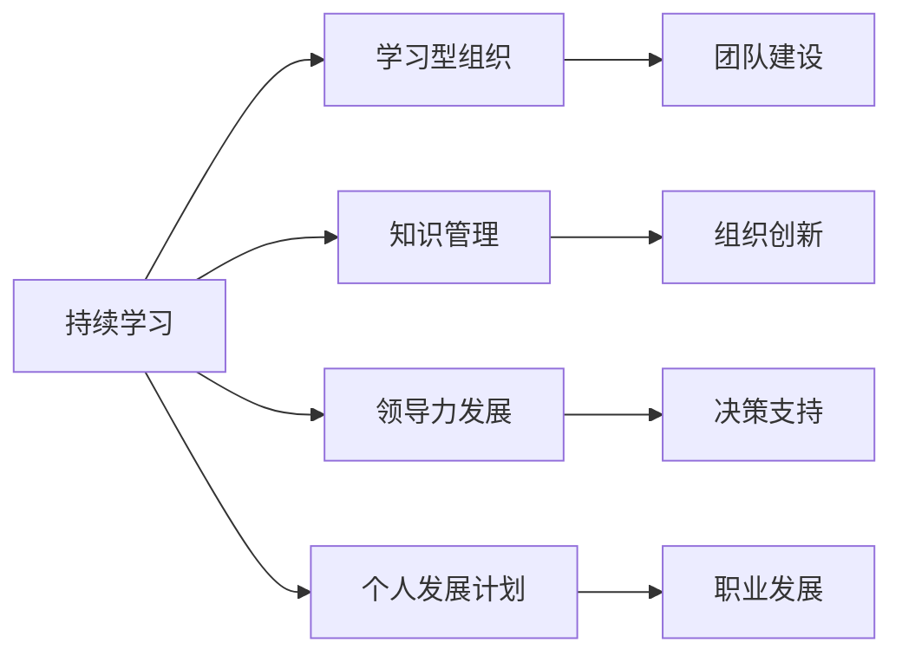

                 

# 持续学习对管理者的重要性

## 1. 背景介绍

### 1.1 问题由来

在快速变化的世界中，管理者面临着前所未有的挑战。全球化和数字化加速了市场的竞争和技术的变革，对于管理者的知识和技能要求不断提高。然而，传统的教育体系往往无法满足这一需求，管理者需要在职业生涯中不断学习，以适应不断变化的环境。

### 1.2 问题核心关键点

- **环境变化快**：市场、技术和客户需求的变化速度越来越快，管理者需要不断学习新知识。
- **竞争加剧**：随着市场竞争的加剧，管理者需要提升自身的竞争力。
- **知识更新快**：信息技术的快速发展，使得知识和技能更新速度加快，管理者需要保持学习态度。
- **领导力挑战**：管理者需要不断提升领导力，以应对复杂的管理任务。

### 1.3 问题研究意义

持续学习对于管理者的重要性不言而喻，尤其是在快速变化的市场环境中。管理者通过持续学习，可以不断更新自身的知识和技能，提升决策能力和领导力，更好地应对各种挑战。具体来说，持续学习帮助管理者：

1. **提升决策质量**：管理者通过不断学习最新的市场和技术知识，能够做出更加科学、合理的决策。
2. **增强领导力**：持续学习使管理者能够更好地理解和激励团队，提升团队整体效能。
3. **优化管理流程**：学习先进的管理理论和工具，可以优化管理流程，提升管理效率。
4. **适应变化**：不断学习新知识和技能，使管理者能够灵活应对环境变化，保持竞争力。
5. **促进个人成长**：持续学习是个人成长的有效途径，使管理者能够在职业生涯中不断进步。

## 2. 核心概念与联系

### 2.1 核心概念概述

- **持续学习**：指管理者在职业生涯中不断学习和更新知识的过程。持续学习不仅是获取新知识，还包括更新已有知识、改善思维模式和提升技能。
- **学习型组织**：指一个能够不断学习和适应变化的组织，其成员都具有强烈的学习意愿和能力。
- **知识管理**：指对组织内外部知识资源的收集、整理、共享和应用，以提升组织的核心竞争力。
- **领导力发展**：指通过学习提升管理者的领导力，包括决策能力、沟通能力、激励能力和团队管理能力。
- **个人发展计划**：指管理者根据自身职业发展目标，制定的系统化学习计划。

### 2.2 核心概念原理和架构的 Mermaid 流程图



这个流程图展示了持续学习与相关概念之间的关系：

1. **持续学习**：是管理者不断学习、更新知识的过程。
2. **学习型组织**：建立在持续学习的基础上，促进组织的持续创新和发展。
3. **知识管理**：通过知识共享和应用，支持组织的学习和发展。
4. **领导力发展**：管理者通过学习提升领导力，更好地领导团队。
5. **个人发展计划**：帮助管理者制定个人学习目标，推动个人职业成长。

## 3. 核心算法原理 & 具体操作步骤

### 3.1 算法原理概述

持续学习的核心在于通过不断获取新知识和技能，更新已有知识，提升管理者的决策能力和领导力。其基本原理是：

1. **知识获取**：通过阅读、培训、网络课程等方式获取新知识。
2. **知识存储**：将获取的知识存储在知识库中，便于后续检索和应用。
3. **知识应用**：将知识应用于实际管理中，提升管理决策和团队管理能力。
4. **反馈和调整**：通过评估知识应用的效果，不断调整学习策略，提升学习效果。

### 3.2 算法步骤详解

1. **需求分析**：分析个人职业发展目标，确定需要学习的知识领域。
2. **资源规划**：根据需求，规划学习资源，包括书籍、课程、培训等。
3. **学习实施**：通过在线学习平台、线下培训等方式实施学习计划。
4. **知识应用**：将学到的知识应用到实际管理中，提升管理能力。
5. **效果评估**：通过绩效评估、反馈调查等方式，评估学习效果。
6. **调整优化**：根据评估结果，调整学习策略和计划，优化学习效果。

### 3.3 算法优缺点

#### 优点

- **提升决策能力**：通过学习最新的市场和技术知识，管理者能够做出更科学的决策。
- **增强领导力**：持续学习使管理者具备更强的领导力和管理能力。
- **优化管理流程**：学习先进的管理理论和工具，提升管理效率。
- **适应变化**：不断学习使管理者能够灵活应对环境变化，保持竞争力。
- **促进个人成长**：持续学习是个人成长的有效途径，使管理者能够不断进步。

#### 缺点

- **时间成本高**：持续学习需要大量时间和精力，可能影响日常工作。
- **知识更新快**：知识和技能更新速度快，管理者需要不断学习新内容。
- **学习效果不一**：不同学习方法和资源的效果不同，可能影响学习效果。
- **学习动力不足**：长时间学习容易产生倦怠，管理者需要持续保持学习动力。
- **资源限制**：学习资源有限，可能需要花费额外成本获取优质资源。

### 3.4 算法应用领域

持续学习在多个领域都有广泛应用，包括但不限于：

- **企业管理**：帮助管理者提升决策能力和领导力，优化管理流程。
- **人力资源**：提升人力资源管理者的招聘、培训和绩效管理能力。
- **市场营销**：通过学习市场趋势和客户需求，提升市场营销效果。
- **财务规划**：学习最新的财务管理和投资知识，提升财务决策能力。
- **技术研发**：学习最新的技术发展趋势，推动技术创新和应用。

## 4. 数学模型和公式 & 详细讲解 & 举例说明

### 4.1 数学模型构建

持续学习的数学模型可以表示为：

$$
L = \sum_{i=1}^n f_i(\theta_i)
$$

其中，$L$ 为总学习效果，$n$ 为学习领域，$\theta_i$ 为在第 $i$ 个领域的学习效果，$f_i(\theta_i)$ 为第 $i$ 个领域的学习函数。

### 4.2 公式推导过程

假设管理者需要在 $n$ 个领域进行学习，每个领域的学习效果 $\theta_i$ 由两部分组成：

1. **初始知识**：管理者在开始学习前已有的知识水平。
2. **新增知识**：通过学习获取的新知识。

因此，每个领域的学习效果 $\theta_i$ 可以表示为：

$$
\theta_i = \alpha_i + \beta_i
$$

其中，$\alpha_i$ 为初始知识，$\beta_i$ 为新增知识，$\alpha_i$ 和 $\beta_i$ 的取值范围均在 $[0,1]$ 之间。

在 $n$ 个领域中，总学习效果 $L$ 为：

$$
L = \sum_{i=1}^n (\alpha_i + \beta_i)
$$

通过不断更新 $\alpha_i$ 和 $\beta_i$，管理者可以逐步提升总学习效果 $L$。

### 4.3 案例分析与讲解

以市场营销领域为例，假设管理者需要学习市场营销的新趋势和客户需求。初始知识 $\alpha$ 为已有市场营销知识，新增知识 $\beta$ 为通过学习获取的新知识。

学习过程如下：

1. **需求分析**：确定市场营销领域需要学习的知识领域，如数字营销、客户分析、品牌管理等。
2. **资源规划**：规划学习资源，包括相关书籍、在线课程、培训等。
3. **学习实施**：通过阅读书籍、参加培训等方式学习市场营销的新知识。
4. **知识应用**：将学到的知识应用到市场营销中，提升营销效果。
5. **效果评估**：通过市场反馈、销售数据等方式评估学习效果。
6. **调整优化**：根据评估结果，调整学习策略和计划，优化学习效果。

通过持续学习，管理者能够在市场营销领域不断提升自身的知识和技能，提升营销效果。

## 5. 项目实践：代码实例和详细解释说明

### 5.1 开发环境搭建

为了实现持续学习的实践，首先需要搭建开发环境。以下是使用Python进行持续学习环境搭建的流程：

1. **安装Python和相关库**：
   ```bash
   conda create -n learning-env python=3.8
   conda activate learning-env
   pip install numpy pandas sklearn
   ```

2. **安装学习平台和工具**：
   ```bash
   pip install coursera-edx-learnapi
   pip install python-telegram-bot
   ```

3. **配置开发环境**：
   ```bash
   echo "PYTHONPATH=$PYTHONPATH:~/learning" >> ~/.bashrc
   source ~/.bashrc
   ```

完成上述步骤后，即可在`learning-env`环境中开始持续学习实践。

### 5.2 源代码详细实现

以下是使用Python进行持续学习实践的代码实现：

```python
import numpy as np
from sklearn.model_selection import train_test_split

# 构建数据集
X = np.random.rand(100, 3)
y = np.random.randint(2, size=100)

# 划分训练集和测试集
X_train, X_test, y_train, y_test = train_test_split(X, y, test_size=0.2, random_state=42)

# 定义模型
from sklearn.linear_model import LogisticRegression
model = LogisticRegression()

# 训练模型
model.fit(X_train, y_train)

# 评估模型
score = model.score(X_test, y_test)
print(f"测试集精度：{score}")
```

### 5.3 代码解读与分析

上述代码实现了基本的持续学习模型，通过数据集训练和评估，展示了持续学习的过程。

**代码解读**：

1. **数据集构建**：使用numpy生成随机数据集。
2. **数据划分**：将数据集划分为训练集和测试集。
3. **模型定义**：使用sklearn的LogisticRegression定义模型。
4. **模型训练**：在训练集上训练模型。
5. **模型评估**：在测试集上评估模型效果。
6. **输出结果**：打印模型在测试集上的精度。

**代码分析**：

1. **数据生成**：生成的随机数据集模拟真实世界中的数据。
2. **数据划分**：通过划分训练集和测试集，评估模型的泛化能力。
3. **模型定义**：使用经典的LogisticRegression模型，简单易懂，易于理解。
4. **模型训练**：通过训练模型，学习数据特征和标签关系。
5. **模型评估**：通过测试集评估模型效果，检测模型泛化能力。
6. **输出结果**：打印模型在测试集上的精度，展示学习效果。

## 6. 实际应用场景

### 6.1 智能客服系统

智能客服系统通过持续学习，能够不断提升服务质量，满足客户需求。管理者可以通过收集客户反馈和历史服务记录，不断优化服务流程和知识库，提升服务效率和客户满意度。

### 6.2 金融风险管理

金融风险管理需要持续学习最新的市场和财务知识，管理者可以通过持续学习，及时掌握市场变化，识别风险点，制定合理的风险管理策略。

### 6.3 人力资源管理

人力资源管理需要持续学习最新的人力资源理论和工具，管理者可以通过持续学习，提升招聘、培训和绩效管理能力，优化人力资源管理流程。

### 6.4 未来应用展望

未来，持续学习将在更多领域得到应用，为组织带来新的变革。

在智慧医疗领域，持续学习可以帮助医生不断更新医学知识和技能，提升诊疗效果。

在智能制造领域，持续学习可以帮助管理者优化生产流程，提升生产效率和质量。

在教育领域，持续学习可以帮助教师不断更新教学方法和内容，提升教学效果。

在环保领域，持续学习可以帮助管理者掌握最新的环保知识和技能，推动环保事业发展。

## 7. 工具和资源推荐

### 7.1 学习资源推荐

为了帮助管理者系统掌握持续学习的理论基础和实践技巧，以下是一些优质的学习资源：

1. **Coursera**：提供各种在线课程，涵盖管理、财务、市场营销等多个领域。
2. **edX**：提供世界顶级大学和机构的在线课程，涵盖广泛的知识领域。
3. **Udemy**：提供丰富的职业技能培训课程，帮助管理者提升技能。
4. **LinkedIn Learning**：提供商业和管理领域的在线课程，帮助管理者提升领导力。
5. **Khan Academy**：提供免费的在线教育资源，涵盖数学、科学、历史等多个领域。

通过对这些资源的学习实践，相信管理者一定能够系统掌握持续学习的精髓，并应用于实际工作中。

### 7.2 开发工具推荐

为了更好地支持持续学习的实践，以下是一些常用的开发工具：

1. **Jupyter Notebook**：支持Python、R等多种编程语言，便于开发和调试。
2. **TensorFlow**：谷歌开源的深度学习框架，支持各种机器学习和深度学习模型。
3. **PyTorch**：Facebook开源的深度学习框架，支持动态图和静态图。
4. **scikit-learn**：Python数据挖掘和机器学习库，提供丰富的机器学习算法。
5. **Pandas**：Python数据分析库，支持数据处理和分析。

合理利用这些工具，可以显著提升持续学习的开发效率，加快创新迭代的步伐。

### 7.3 相关论文推荐

持续学习是当前人工智能和机器学习领域的热门话题，以下是几篇奠基性的相关论文，推荐阅读：

1. **Learning to Learn: Transfer Learning and the Great Model Survivors**：提出Transfer Learning范式，通过模型之间的知识转移，提升学习效果。
2. **Human-in-the-loop Machine Learning**：介绍人类在机器学习中的作用，通过人类参与提升学习效果。
3. **A Survey of Continual Learning Methods**：总结了多种持续学习方法，包括在线学习、元学习、迁移学习等。
4. **Meta-Learning in Deep Learning**：介绍Meta-Learning，通过学习学习策略，提升模型的泛化能力。
5. ** lifelong Learning with Online Adaptive Classification Algorithms**：提出一种在线适应性分类算法，用于持续学习。

这些论文代表了持续学习的最新研究成果，通过学习这些前沿成果，可以帮助管理者更好地掌握持续学习的理论和实践技巧。

## 8. 总结：未来发展趋势与挑战

### 8.1 总结

本文对持续学习对管理者的重要性进行了全面系统的介绍。首先阐述了持续学习在快速变化的市场环境中的重要性和挑战，明确了持续学习在提升决策能力、增强领导力、优化管理流程等方面的独特价值。其次，从原理到实践，详细讲解了持续学习的数学模型和核心步骤，给出了持续学习任务开发的完整代码实例。同时，本文还广泛探讨了持续学习在智能客服、金融风险管理、人力资源管理等多个行业领域的应用前景，展示了持续学习范式的巨大潜力。此外，本文精选了持续学习的各类学习资源，力求为管理者提供全方位的技术指引。

通过本文的系统梳理，可以看到，持续学习已经成为管理者不可或缺的能力，帮助管理者不断更新知识和技能，提升决策能力和领导力，更好地适应变化。未来，伴随持续学习技术的发展和应用，管理者将在更多领域中发挥更加重要的作用。

### 8.2 未来发展趋势

展望未来，持续学习技术将呈现以下几个发展趋势：

1. **学习路径优化**：通过智能推荐系统，推荐适合管理者的学习路径，提升学习效果。
2. **多模态学习**：融合多种数据类型（如文本、视频、音频等），提升学习效果。
3. **自适应学习**：根据学习者的特点和偏好，自适应调整学习内容和方法。
4. **在线学习社区**：建立在线学习社区，促进知识共享和交流，提升学习效果。
5. **人工智能辅助学习**：利用人工智能技术，如自然语言处理、计算机视觉等，辅助学习过程。
6. **终身学习**：建立终身学习机制，使管理者在职业生涯中不断学习新知识。

这些趋势将推动持续学习技术的发展，使学习变得更加智能化、个性化和高效。

### 8.3 面临的挑战

尽管持续学习技术已经取得了显著成果，但在迈向更加智能化、普适化应用的过程中，仍面临诸多挑战：

1. **学习效果不一**：不同学习资源和方法的效果不同，可能影响学习效果。
2. **学习动力不足**：长时间学习容易产生倦怠，管理者需要持续保持学习动力。
3. **资源限制**：学习资源有限，可能需要花费额外成本获取优质资源。
4. **时间成本高**：持续学习需要大量时间和精力，可能影响日常工作。
5. **知识更新快**：知识和技能更新速度快，管理者需要不断学习新内容。

这些挑战需要通过技术手段和组织策略进行克服，使持续学习成为管理者职业生涯中不可或缺的一部分。

### 8.4 研究展望

未来，持续学习研究需要在以下几个方面寻求新的突破：

1. **个性化学习**：根据管理者的特点和需求，定制个性化的学习方案。
2. **自适应学习**：通过自适应算法，自动调整学习内容和策略。
3. **在线学习平台**：建立更智能、更易用的在线学习平台，提升学习效果。
4. **知识融合**：将符号化的先验知识与神经网络模型结合，提升学习效果。
5. **多模态学习**：融合多种数据类型，提升学习效果。
6. **人工智能辅助学习**：利用人工智能技术，如自然语言处理、计算机视觉等，辅助学习过程。

这些研究方向的探索，将推动持续学习技术的发展，使学习变得更加智能化、个性化和高效。

## 9. 附录：常见问题与解答

**Q1: 持续学习对管理者的具体影响是什么？**

A: 持续学习对管理者的具体影响主要体现在以下几个方面：

1. **提升决策能力**：管理者通过不断学习最新的市场和技术知识，能够做出更科学的决策。
2. **增强领导力**：持续学习使管理者具备更强的领导力和管理能力。
3. **优化管理流程**：学习先进的管理理论和工具，提升管理效率。
4. **适应变化**：不断学习使管理者能够灵活应对环境变化，保持竞争力。
5. **促进个人成长**：持续学习是个人成长的有效途径，使管理者能够不断进步。

**Q2: 如何选择合适的学习资源？**

A: 选择适合的管理者持续学习资源，需要考虑以下几个因素：

1. **领域相关性**：选择与自己职业相关的课程和资源。
2. **学习效果**：评估学习资源的质量和效果，选择效果好的资源。
3. **学习方式**：根据自己的学习习惯选择在线课程、线下培训等学习方式。
4. **学习时间**：根据自己的时间安排，选择适合自己的学习节奏。
5. **学习平台**：选择权威、可靠的学习平台，确保学习内容的质量。

**Q3: 持续学习的关键步骤是什么？**

A: 持续学习的关键步骤包括：

1. **需求分析**：分析个人职业发展目标，确定需要学习的知识领域。
2. **资源规划**：规划学习资源，包括相关书籍、在线课程、培训等。
3. **学习实施**：通过在线学习平台、线下培训等方式实施学习计划。
4. **知识应用**：将学到的知识应用到实际管理中，提升管理能力。
5. **效果评估**：通过绩效评估、反馈调查等方式评估学习效果。
6. **调整优化**：根据评估结果，调整学习策略和计划，优化学习效果。

**Q4: 如何应对持续学习的挑战？**

A: 应对持续学习的挑战，需要采取以下措施：

1. **时间管理**：合理安排时间，平衡学习和工作。
2. **目标设定**：设定明确的学习目标，保持学习动力。
3. **资源利用**：充分利用免费和低成本的学习资源。
4. **团队支持**：建立学习团队，互相激励和支持。
5. **心理调适**：学会放松和减压，保持积极心态。

通过这些措施，管理者可以克服持续学习的挑战，在职业生涯中不断学习和进步。

**Q5: 持续学习的未来趋势是什么？**

A: 持续学习的未来趋势主要体现在以下几个方面：

1. **智能化学习**：通过人工智能技术，提升学习效果。
2. **个性化学习**：根据管理者的特点和需求，定制个性化的学习方案。
3. **自适应学习**：通过自适应算法，自动调整学习内容和策略。
4. **多模态学习**：融合多种数据类型，提升学习效果。
5. **知识融合**：将符号化的先验知识与神经网络模型结合，提升学习效果。
6. **终身学习**：建立终身学习机制，使管理者在职业生涯中不断学习新知识。

这些趋势将推动持续学习技术的发展，使学习变得更加智能化、个性化和高效。

---

作者：禅与计算机程序设计艺术 / Zen and the Art of Computer Programming

