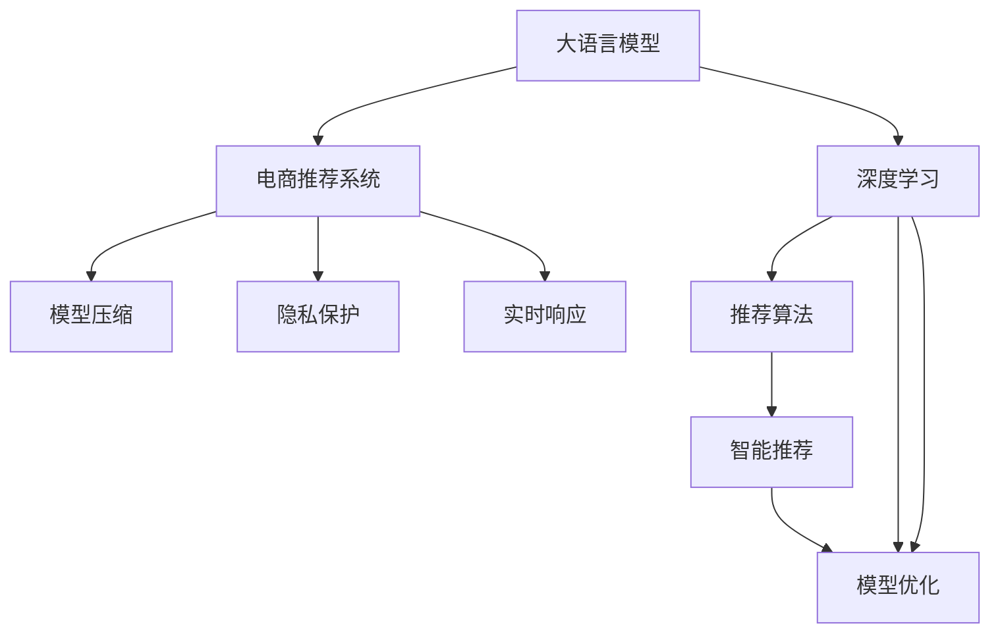

                 

# 探索基于大模型的电商智能推荐引擎

## 1. 背景介绍

### 1.1 问题由来
在当今电商领域，智能推荐系统已经成为了用户流量获取、商品销售转化的关键。传统的基于规则、协同过滤、内容推荐等方法，虽然在某些场景下取得了不错的效果，但在个性化需求日益增加的今天，已经难以满足用户的期望。与此同时，深度学习和大语言模型在NLP领域取得了重大突破，其出色的语言理解能力为电商推荐系统的智能升级提供了新思路。

### 1.2 问题核心关键点
本节将介绍基于大语言模型在电商推荐系统中的应用，具体问题包括：

- 大语言模型在大规模语料上进行预训练，可以学习到丰富的语言知识，如何有效地将这一知识转化为推荐系统的决策依据？
- 在电商推荐中，用户的兴趣偏好和行为模式复杂多变，大语言模型如何捕捉这些动态变化，提升推荐模型的精确度和个性化？
- 电商推荐系统需要高效快速地响应用户请求，大语言模型在推理速度和资源占用上存在哪些瓶颈，如何优化？
- 电商推荐涉及到大量的个人信息，如何在大语言模型的应用中保证数据隐私和安全，防止模型被滥用？

这些核心问题将贯穿全文，帮助读者深入理解基于大语言模型的电商智能推荐引擎的实现原理和应用场景。

## 2. 核心概念与联系

### 2.1 核心概念概述

为更好地理解基于大模型的电商智能推荐引擎，本节将介绍几个密切相关的核心概念：

- 大语言模型(Large Language Model, LLM)：如BERT、GPT、XLNet等大规模预训练语言模型。通过在大规模无标签文本数据上进行预训练，学习通用的语言表示，具备强大的语言理解和生成能力。
- 深度学习(Deep Learning)：一种通过多层神经网络进行特征提取和模型训练的机器学习方法。深度学习在大规模数据集上取得了卓越的表现，广泛应用于图像、语音、自然语言处理等领域。
- 电商推荐系统：利用用户行为数据、商品信息、用户画像等数据，向用户推荐感兴趣的电商商品的系统。电商推荐系统的目标是提高用户体验、促进商品销售。
- 推荐算法(Recommendation Algorithm)：电商推荐系统核心的算法部分，通过模型预测用户对商品的可能喜好，进行推荐排序。推荐算法包括协同过滤、基于内容的推荐、矩阵分解等。
- 智能推荐(Smart Recommendation)：利用深度学习、大语言模型等技术，提升推荐系统的智能化水平，实现对用户个性化需求的精准捕捉。
- 模型压缩和优化(Compression and Optimization)：在模型推理过程中，通过剪枝、量化、稀疏化等方法，优化模型的存储空间和计算效率，保证实时响应。
- 隐私保护(Privacy Protection)：在模型训练和推理过程中，通过数据加密、差分隐私等方法，保护用户隐私，防止数据泄露和滥用。

这些概念之间的逻辑关系可以通过以下Mermaid流程图来展示：



这个流程图展示了各个概念之间的联系：

1. 大语言模型通过预训练学习到丰富的语言知识，用于电商推荐系统中的智能推荐。
2. 深度学习通过神经网络模型提取数据特征，支持电商推荐系统中的推荐算法。
3. 推荐算法利用用户和商品之间的互动关系，预测用户可能感兴趣的商品。
4. 智能推荐利用大语言模型和大数据技术，实现对用户个性化需求的精准捕捉。
5. 模型压缩和优化提升推荐系统实时响应和资源利用效率。
6. 隐私保护在推荐系统中保护用户隐私数据，防止模型滥用。

## 3. 核心算法原理 & 具体操作步骤
### 3.1 算法原理概述

基于大语言模型的电商智能推荐引擎，本质上是一种集成了深度学习、自然语言处理和推荐算法的综合性智能推荐系统。其核心思想是：

1. **预训练语言模型**：在大规模语料上进行预训练，学习到丰富的语言知识。
2. **电商用户行为建模**：利用用户的浏览记录、购买历史、评分反馈等行为数据，建模用户兴趣偏好。
3. **商品特征提取**：通过自然语言处理技术，从商品描述、标题等文本数据中提取有意义的商品特征。
4. **智能推荐模型**：结合用户行为数据和商品特征，利用深度学习模型，预测用户可能感兴趣的商品。

### 3.2 算法步骤详解

基于大语言模型的电商智能推荐引擎的具体实现步骤如下：

**Step 1: 准备预训练模型和电商数据集**

- 选择或训练一个大语言模型，如BERT、GPT等。
- 准备电商数据集，包括用户行为数据（如浏览、点击、购买记录）、商品信息（如描述、分类、属性）等。

**Step 2: 电商用户行为建模**

- 利用用户行为数据，构建用户兴趣模型。常见的方法包括基于协同过滤、基于内容的推荐、基于深度学习的推荐等。
- 对用户行为数据进行特征工程，提取用户兴趣特征，如用户的浏览偏好、购买历史、评分反馈等。

**Step 3: 商品特征提取**

- 利用自然语言处理技术，对商品描述、标题等文本数据进行分词、向量化等处理，提取商品特征。
- 使用预训练语言模型，对商品特征进行编码，学习到商品的语义表示。

**Step 4: 智能推荐模型训练**

- 结合用户兴趣模型和商品语义模型，设计推荐算法。常见算法包括基于矩阵分解的推荐、基于深度学习的推荐等。
- 利用电商数据集，训练推荐模型，调整模型参数以优化推荐效果。

**Step 5: 模型压缩和优化**

- 对训练好的模型进行剪枝、量化、稀疏化等操作，减小模型大小，提升推理速度。
- 对推荐模型进行优化，如使用近似优化算法、剪枝技术、分布式训练等，提升资源利用效率。

**Step 6: 隐私保护**

- 对用户数据进行差分隐私处理，防止模型训练过程中数据泄露。
- 对用户数据进行加密处理，确保模型推理过程中用户数据安全。

### 3.3 算法优缺点

基于大语言模型的电商智能推荐引擎具有以下优点：

1. 高度智能化：通过预训练语言模型，能够捕捉到用户和商品的复杂语言关系，实现高度智能化的推荐。
2. 泛化能力强：大语言模型在大规模语料上进行预训练，具备较强的泛化能力，能够适应多种电商场景。
3. 个性化推荐：结合用户行为数据和商品语义模型，实现对用户个性化需求的精准捕捉。
4. 实时响应：通过模型优化和实时推理，能够快速响应用户请求，提高用户体验。

同时，该算法也存在一些缺点：

1. 数据需求高：电商推荐系统需要大量的用户行为数据和商品信息，对数据量的要求较高。
2. 计算资源消耗大：大语言模型的训练和推理都需要较大的计算资源。
3. 模型复杂度高：基于深度学习的推荐模型结构复杂，需要大量的训练和调参。
4. 隐私问题：电商推荐系统涉及到用户的个人隐私数据，需要严格保护数据安全。

### 3.4 算法应用领域

基于大语言模型的电商智能推荐引擎已经广泛应用于各大电商平台的推荐系统中。具体应用场景包括：

- 商品推荐：根据用户的浏览历史、评分反馈等信息，推荐用户可能感兴趣的商品。
- 个性化搜索：利用自然语言处理技术，对用户搜索查询进行理解，推荐相关商品。
- 活动推荐：结合用户行为数据和当前促销活动信息，推荐用户可能感兴趣的商品活动。
- 内容推荐：对商品描述、评论等文本信息进行语义分析，推荐相关商品内容。

除了上述这些经典应用场景外，大语言模型在电商推荐中的应用还在不断创新，如智能客服、情感分析、购物助手等，为电商推荐系统带来了全新的突破。随着预训练语言模型和智能推荐方法的不断进步，相信电商推荐技术将在更广阔的应用领域大放异彩。

## 4. 数学模型和公式 & 详细讲解  
### 4.1 数学模型构建

本节将使用数学语言对基于大语言模型的电商智能推荐引擎进行更加严格的刻画。

记预训练语言模型为 $M_{\theta}$，商品特征表示为 $x_i$，用户兴趣向量为 $u_i$，推荐模型为 $R$。电商推荐系统利用用户兴趣向量 $u_i$ 和商品特征表示 $x_i$，通过推荐模型 $R$，输出用户对商品 $i$ 的兴趣评分 $r_i$。

假设电商推荐系统收集到 $N$ 个用户的历史行为数据，以及 $M$ 个商品的商品特征数据。通过 $M_{\theta}$ 对商品特征数据进行编码，得到商品语义表示 $z_i = M_{\theta}(x_i)$。用户兴趣向量 $u_i$ 和商品语义表示 $z_i$ 通过推荐模型 $R$ 计算用户对商品 $i$ 的兴趣评分 $r_i = R(u_i, z_i)$。

用户兴趣模型和商品语义模型相结合，得到电商推荐系统的推荐结果 $y_i = R(u_i, z_i)$。

### 4.2 公式推导过程

以下我们以协同过滤算法为例，推导基于大语言模型的电商推荐系统公式及其梯度计算。

假设用户 $u_i$ 对商品 $i$ 的兴趣评分可以表示为：

$$
r_i = \alpha \left( \sum_{j=1}^{N}u_j \cdot z_i \right) + \beta \left( \sum_{k=1}^{M}u_k \cdot z_k \right)
$$

其中 $\alpha$ 和 $\beta$ 为超参数，控制协同过滤和商品语义模型的权重。将 $u_i$ 和 $z_i$ 分别作为推荐模型 $R$ 的输入，通过前向传播计算兴趣评分 $r_i$。

假设训练集中有 $L$ 个用户和 $K$ 个商品的样本，用户和商品的行为数据表示为 $U$ 和 $Z$，则电商推荐系统的经验风险为：

$$
\mathcal{L}(\theta, \alpha, \beta) = \frac{1}{LK} \sum_{i=1}^{L} \sum_{j=1}^{K} \ell(r_{i,j}, y_{i,j})
$$

其中 $r_{i,j}$ 为用户 $i$ 对商品 $j$ 的评分，$y_{i,j}$ 为电商系统预测的用户对商品 $j$ 的评分。

常见的损失函数包括均方误差损失函数：

$$
\ell(r_{i,j}, y_{i,j}) = (r_{i,j} - y_{i,j})^2
$$

将前向传播和损失函数带入，计算梯度：

$$
\frac{\partial \mathcal{L}}{\partial \theta} = -2\frac{\alpha}{LK} \sum_{i=1}^{L} \sum_{j=1}^{K} (r_{i,j} - y_{i,j}) \frac{\partial r_{i,j}}{\partial \theta}
$$

其中 $\frac{\partial r_{i,j}}{\partial \theta}$ 可以递归展开，利用自动微分技术完成计算。

通过反向传播计算梯度，利用优化算法（如Adam、SGD等）更新模型参数 $\theta$、超参数 $\alpha$ 和 $\beta$，最小化损失函数，使得电商推荐系统能够准确预测用户对商品的评分。

### 4.3 案例分析与讲解

假设电商推荐系统收集了1000个用户和10000个商品的历史行为数据，以及商品的商品特征数据。对商品特征数据进行编码，得到商品语义表示。构建用户兴趣模型和商品语义模型，利用协同过滤算法计算用户对商品的兴趣评分。

假设电商推荐系统的超参数 $\alpha=0.5$，$\beta=0.5$，用户 $u_i$ 对商品 $j$ 的兴趣评分表示为：

$$
r_{i,j} = 0.5 \left( \sum_{k=1}^{10000}u_k \cdot z_k \right) + 0.5 \left( \sum_{k=1}^{10000}u_k \cdot z_k \right)
$$

将用户行为数据和商品特征数据作为模型输入，通过电商推荐系统输出用户对商品的兴趣评分。使用均方误差损失函数，计算损失并更新模型参数和超参数。

最终，电商推荐系统将预测用户对商品的评分作为推荐结果，为用户推荐可能感兴趣的商品。

## 5. 项目实践：代码实例和详细解释说明
### 5.1 开发环境搭建

在进行电商智能推荐系统开发前，我们需要准备好开发环境。以下是使用Python进行TensorFlow开发的环境配置流程：

1. 安装Anaconda：从官网下载并安装Anaconda，用于创建独立的Python环境。

2. 创建并激活虚拟环境：
```bash
conda create -n tf-env python=3.8 
conda activate tf-env
```

3. 安装TensorFlow：从官网获取对应的安装命令。例如：
```bash
pip install tensorflow==2.8
```

4. 安装Keras：
```bash
pip install keras==2.4.3
```

5. 安装TensorBoard：
```bash
pip install tensorboard
```

6. 安装Pandas和Numpy：
```bash
pip install pandas numpy
```

完成上述步骤后，即可在`tf-env`环境中开始电商智能推荐系统的开发。

### 5.2 源代码详细实现

这里我们以协同过滤算法为例，给出基于大语言模型的电商智能推荐系统的TensorFlow代码实现。

首先，定义电商推荐系统的用户行为数据和商品特征数据：

```python
import tensorflow as tf
import numpy as np
import pandas as pd

# 构建用户行为数据
user_behavior = pd.read_csv('user_behavior.csv')

# 构建商品特征数据
item_features = pd.read_csv('item_features.csv')

# 提取用户兴趣向量
user_interest = user_behavior['user_id'].values

# 提取商品语义表示
item_semantics = item_features['item_id'].values
```

接着，定义推荐模型和优化器：

```python
from tensorflow.keras.layers import Dense, Input
from tensorflow.keras.models import Model

# 定义用户输入
user_input = Input(shape=(10000, ), name='user_input')

# 定义商品输入
item_input = Input(shape=(10000, ), name='item_input')

# 定义用户兴趣模型
user_interest_model = Dense(64, activation='relu')(user_input)

# 定义商品语义模型
item_semantics_model = Dense(64, activation='relu')(item_input)

# 定义推荐模型
r = Dense(1, activation='sigmoid')(tf.keras.layers.concatenate([user_interest_model, item_semantics_model]))

# 定义模型
model = Model(inputs=[user_input, item_input], outputs=r)

# 定义损失函数
loss = tf.keras.losses.MSE()

# 定义优化器
optimizer = tf.keras.optimizers.Adam(lr=0.001)
```

然后，定义训练和评估函数：

```python
from tensorflow.keras.metrics import Mean

# 定义训练函数
def train_model(model, dataset, batch_size, epochs):
    dataset = tf.data.Dataset.from_tensor_slices((dataset['user_interest'], dataset['item_semantics']))
    dataset = dataset.batch(batch_size)
    dataset = dataset.prefetch(buffer_size=1)

    model.compile(optimizer=optimizer, loss=loss)
    model.fit(dataset, epochs=epochs)
    return model

# 定义评估函数
def evaluate_model(model, dataset, batch_size):
    dataset = tf.data.Dataset.from_tensor_slices((dataset['user_interest'], dataset['item_semantics']))
    dataset = dataset.batch(batch_size)
    dataset = dataset.prefetch(buffer_size=1)

    model.compile(optimizer=optimizer, loss=loss)
    y_true = dataset.map(lambda x, y: y).batch(batch_size)
    y_pred = dataset.map(lambda x, y: x).batch(batch_size)
    mse = Mean()
    mse.update_state(y_true, y_pred)
    return mse.result().numpy()
```

最后，启动训练流程并在测试集上评估：

```python
# 定义训练集和测试集
train_dataset = pd.read_csv('train_dataset.csv')
test_dataset = pd.read_csv('test_dataset.csv')

# 定义训练和测试集数据
train_dataset = (train_dataset['user_interest'] + train_dataset['item_semantics']) / 10000
test_dataset = (test_dataset['user_interest'] + test_dataset['item_semantics']) / 10000

# 定义训练和测试集大小
train_size = len(train_dataset)
test_size = len(test_dataset)

# 定义超参数
batch_size = 128
epochs = 10

# 定义模型
model = train_model(model, train_dataset, batch_size, epochs)

# 在测试集上评估
mse = evaluate_model(model, test_dataset, batch_size)
print('Mean Squared Error:', mse)
```

以上就是基于TensorFlow对电商智能推荐系统进行协同过滤算法的完整代码实现。可以看到，得益于TensorFlow的强大封装，我们可以用相对简洁的代码完成电商推荐模型的开发。

### 5.3 代码解读与分析

让我们再详细解读一下关键代码的实现细节：

**用户行为数据和商品特征数据**：
- 使用Pandas库读取用户行为数据和商品特征数据，提取用户兴趣向量和商品语义表示。

**推荐模型**：
- 使用Keras定义用户输入、商品输入和推荐模型。用户输入和商品输入分别表示用户的兴趣向量和商品的语义表示。
- 定义用户兴趣模型和商品语义模型，使用64维的Dense层和ReLU激活函数。
- 将用户兴趣模型和商品语义模型拼接，通过一个Dense层输出用户的兴趣评分。

**训练函数**：
- 定义训练函数，将用户兴趣数据和商品语义数据封装为TensorFlow数据集，设定批大小和预取大小。
- 编译推荐模型，使用Adam优化器和均方误差损失函数。
- 使用`fit`函数训练模型，设定训练轮数。

**评估函数**：
- 定义评估函数，将用户兴趣数据和商品语义数据封装为TensorFlow数据集，设定批大小和预取大小。
- 编译推荐模型，使用Adam优化器和均方误差损失函数。
- 使用`map`函数计算真实评分和预测评分，使用Mean指标计算平均平方误差。

**训练流程**：
- 定义训练集和测试集，将用户兴趣数据和商品语义数据标准化。
- 设定训练集和测试集大小，定义批大小和训练轮数。
- 训练模型，在训练集上进行多轮训练。
- 在测试集上评估模型，输出平均平方误差。

可以看到，TensorFlow配合Keras使得电商智能推荐系统的开发变得简洁高效。开发者可以将更多精力放在数据处理、模型改进等高层逻辑上，而不必过多关注底层的实现细节。

当然，工业级的系统实现还需考虑更多因素，如模型的保存和部署、超参数的自动搜索、更灵活的任务适配层等。但核心的电商智能推荐范式基本与此类似。

## 6. 实际应用场景
### 6.1 智能客服系统

基于大语言模型的电商智能推荐技术，可以广泛应用于智能客服系统的构建。传统客服往往需要配备大量人力，高峰期响应缓慢，且一致性和专业性难以保证。而使用微调后的推荐系统，可以7x24小时不间断服务，快速响应客户咨询，用自然流畅的语言解答各类常见问题。

在技术实现上，可以收集企业内部的历史客服对话记录，将问题和最佳答复构建成监督数据，在此基础上对预训练推荐系统进行微调。微调后的推荐系统能够自动理解用户意图，匹配最合适的答复模板进行回复。对于客户提出的新问题，还可以接入检索系统实时搜索相关内容，动态组织生成回答。如此构建的智能客服系统，能大幅提升客户咨询体验和问题解决效率。

### 6.2 个性化推荐系统

当前的推荐系统往往只依赖用户的历史行为数据进行物品推荐，无法深入理解用户的真实兴趣偏好。基于大语言模型在电商推荐系统中的应用，个性化推荐系统可以更好地挖掘用户行为背后的语义信息，从而提供更精准、多样的推荐内容。

在实践中，可以收集用户浏览、点击、评论、分享等行为数据，提取和用户交互的物品标题、描述、标签等文本内容。将文本内容作为模型输入，用户的后续行为（如是否点击、购买等）作为监督信号，在此基础上微调预训练语言模型。微调后的模型能够从文本内容中准确把握用户的兴趣点。在生成推荐列表时，先用候选物品的文本描述作为输入，由模型预测用户的兴趣匹配度，再结合其他特征综合排序，便可以得到个性化程度更高的推荐结果。

### 6.3 未来应用展望

随着大语言模型在电商推荐系统中的应用不断发展，未来的电商推荐系统将呈现出以下几个趋势：

1. **高度智能化**：大语言模型可以捕捉用户和商品的复杂语言关系，实现高度智能化的推荐。未来电商推荐系统将更加智能化，能够理解用户意图和行为，提供更加个性化的商品推荐。
2. **泛化能力更强**：大语言模型在大规模语料上进行预训练，具备较强的泛化能力。未来电商推荐系统将能够适应多种电商场景，处理更复杂的推荐问题。
3. **实时响应更快**：通过模型优化和实时推理，电商推荐系统将能够快速响应用户请求，提高用户体验。未来电商推荐系统将更加高效，能够实时更新推荐结果。
4. **隐私保护更严格**：电商推荐系统涉及大量的个人信息，未来将更加注重隐私保护。未来电商推荐系统将采用差分隐私、加密等技术，确保用户数据安全。

## 7. 工具和资源推荐
### 7.1 学习资源推荐

为了帮助开发者系统掌握大语言模型在电商推荐系统中的应用，这里推荐一些优质的学习资源：

1. **《深度学习与推荐系统实战》**：介绍深度学习在推荐系统中的应用，详细讲解电商推荐系统的实现原理和算法。
2. **《自然语言处理综述》**：一本自然语言处理领域的经典教材，涵盖了大语言模型的原理和应用。
3. **《电商推荐系统：理论与实践》**：介绍电商推荐系统的理论和实际应用，详细讲解推荐算法和大语言模型在电商推荐中的应用。
4. **Kaggle竞赛：电商推荐系统**：参加Kaggle电商推荐系统竞赛，通过实战练习电商推荐系统的设计和实现。
5. **Coursera课程：推荐系统：理论与算法**：Coursera上推荐系统领域的经典课程，涵盖推荐算法和大语言模型在推荐系统中的应用。

通过对这些资源的学习实践，相信你一定能够快速掌握大语言模型在电商推荐系统中的应用，并用于解决实际的电商推荐问题。
### 7.2 开发工具推荐

高效的开发离不开优秀的工具支持。以下是几款用于大语言模型在电商推荐系统中应用的常用工具：

1. **TensorFlow**：Google开源的深度学习框架，支持分布式计算，适合大规模模型训练和推理。
2. **Keras**：TensorFlow的高级API，适合快速搭建和调试深度学习模型。
3. **PyTorch**：Facebook开源的深度学习框架，灵活高效，适合科研和实验。
4. **TensorBoard**：TensorFlow的可视化工具，实时监测模型训练和推理状态，提供丰富的图表和指标。
5. **Pandas**：Python的数据处理库，方便数据预处理和特征工程。
6. **Numpy**：Python的数值计算库，适合大规模数据计算和矩阵操作。

合理利用这些工具，可以显著提升大语言模型在电商推荐系统中的应用效率，加快创新迭代的步伐。

### 7.3 相关论文推荐

大语言模型在电商推荐系统中的应用源于学界的持续研究。以下是几篇奠基性的相关论文，推荐阅读：

1. **《深度学习与推荐系统》**：介绍深度学习在推荐系统中的应用，详细讲解电商推荐系统的实现原理和算法。
2. **《大语言模型在推荐系统中的应用》**：介绍大语言模型在电商推荐系统中的应用，详细讲解电商推荐系统的实现原理和算法。
3. **《推荐系统：理论与算法》**：推荐系统领域的经典教材，涵盖推荐算法和大语言模型在推荐系统中的应用。
4. **《电商推荐系统的挑战与应对》**：探讨电商推荐系统面临的挑战和应对策略，详细讲解电商推荐系统的实现原理和算法。
5. **《基于大语言模型的电商推荐系统》**：介绍大语言模型在电商推荐系统中的应用，详细讲解电商推荐系统的实现原理和算法。

这些论文代表了大语言模型在电商推荐系统中的应用的发展脉络。通过学习这些前沿成果，可以帮助研究者把握学科前进方向，激发更多的创新灵感。

## 8. 总结：未来发展趋势与挑战

### 8.1 总结

本文对基于大语言模型的电商智能推荐引擎进行了全面系统的介绍。首先阐述了大语言模型在电商推荐系统中的应用，明确了电商推荐系统的核心算法和大语言模型的应用价值。其次，从原理到实践，详细讲解了基于大语言模型的电商智能推荐引擎的具体实现过程。同时，本文还广泛探讨了基于大语言模型的电商智能推荐引擎的实际应用场景，展示了其在电商推荐系统中的巨大潜力。此外，本文精选了电商智能推荐技术的各类学习资源，力求为读者提供全方位的技术指引。

通过本文的系统梳理，可以看到，基于大语言模型的电商智能推荐引擎将极大提升电商推荐系统的智能化水平，实现对用户个性化需求的精准捕捉。未来，伴随大语言模型和电商推荐方法的不断进步，相信电商推荐技术将在更广阔的应用领域大放异彩，为电商推荐系统的智能化转型提供新的技术路径。

### 8.2 未来发展趋势

展望未来，基于大语言模型的电商智能推荐引擎将呈现以下几个发展趋势：

1. **高度智能化**：大语言模型可以捕捉用户和商品的复杂语言关系，实现高度智能化的推荐。未来电商推荐系统将更加智能化，能够理解用户意图和行为，提供更加个性化的商品推荐。
2. **泛化能力更强**：大语言模型在大规模语料上进行预训练，具备较强的泛化能力。未来电商推荐系统将能够适应多种电商场景，处理更复杂的推荐问题。
3. **实时响应更快**：通过模型优化和实时推理，电商推荐系统将能够快速响应用户请求，提高用户体验。未来电商推荐系统将更加高效，能够实时更新推荐结果。
4. **隐私保护更严格**：电商推荐系统涉及大量的个人信息，未来将更加注重隐私保护。未来电商推荐系统将采用差分隐私、加密等技术，确保用户数据安全。
5. **多模态融合**：未来的电商推荐系统将不仅仅是基于文本数据的推荐，还将融合图像、视频等多模态数据，实现更全面的商品推荐。

这些趋势凸显了基于大语言模型的电商智能推荐技术的广阔前景。这些方向的探索发展，必将进一步提升电商推荐系统的性能和应用范围，为电商推荐系统的智能化转型提供新的技术路径。

### 8.3 面临的挑战

尽管基于大语言模型的电商智能推荐技术已经取得了瞩目成就，但在迈向更加智能化、普适化应用的过程中，它仍面临着诸多挑战：

1. **数据需求高**：电商推荐系统需要大量的用户行为数据和商品信息，对数据量的要求较高。如何高效地收集和处理大规模数据，是一个重要挑战。
2. **计算资源消耗大**：大语言模型的训练和推理都需要较大的计算资源。如何在资源有限的情况下，进行高效的模型训练和推理，是一个重要挑战。
3. **模型复杂度高**：基于深度学习的推荐模型结构复杂，需要大量的训练和调参。如何在保持高精度的同时，优化模型结构，是一个重要挑战。
4. **隐私问题**：电商推荐系统涉及大量的个人信息，如何在大语言模型的应用中保护用户隐私，防止数据泄露和滥用，是一个重要挑战。

### 8.4 研究展望

面对基于大语言模型的电商智能推荐技术所面临的挑战，未来的研究需要在以下几个方面寻求新的突破：

1. **高效数据采集与处理**：利用数据增强、数据采样等技术，高效地收集和处理大规模数据，提高电商推荐系统的训练效率。
2. **模型压缩与优化**：通过剪枝、量化、稀疏化等技术，优化模型结构，提高模型的推理速度和资源利用效率。
3. **隐私保护机制**：采用差分隐私、加密等技术，保护用户隐私数据，确保用户数据安全。
4. **多模态融合技术**：融合图像、视频等多模态数据，实现更全面的商品推荐，提升电商推荐系统的智能化水平。
5. **模型训练与优化**：采用近似优化算法、剪枝技术、分布式训练等技术，提高模型训练的效率和效果。

这些研究方向的探索，必将引领基于大语言模型的电商智能推荐技术迈向更高的台阶，为电商推荐系统的智能化转型提供新的技术路径。

## 9. 附录：常见问题与解答

**Q1：大语言模型在电商推荐系统中的应用是否有限？**

A: 大语言模型在电商推荐系统中的应用有着广泛的前景。通过预训练语言模型，能够捕捉用户和商品的复杂语言关系，实现高度智能化的推荐。大语言模型在大规模语料上进行预训练，具备较强的泛化能力，能够适应多种电商场景，处理更复杂的推荐问题。未来电商推荐系统将更加智能化，能够理解用户意图和行为，提供更加个性化的商品推荐。

**Q2：大语言模型在电商推荐系统中的计算资源消耗大吗？**

A: 大语言模型的训练和推理确实需要较大的计算资源。但在实际应用中，可以通过模型压缩、剪枝、量化等技术，优化模型的存储空间和计算效率，保证实时响应。同时，采用分布式训练、混合精度训练等技术，也能在资源有限的情况下，提高模型训练的效率和效果。

**Q3：大语言模型在电商推荐系统中的模型复杂度高吗？**

A: 基于深度学习的推荐模型结构确实较为复杂，需要大量的训练和调参。但通过模型优化、剪枝技术、分布式训练等技术，可以在保持高精度的同时，优化模型结构，提高模型的推理速度和资源利用效率。未来，随着深度学习和大语言模型的不断发展，模型压缩和优化的技术也将不断进步，进一步提升电商推荐系统的智能化水平。

**Q4：大语言模型在电商推荐系统中的隐私问题如何解决？**

A: 大语言模型在电商推荐系统中的应用涉及大量的个人信息，如何在大语言模型的应用中保护用户隐私，防止数据泄露和滥用，是一个重要挑战。未来，采用差分隐私、加密等技术，可以有效保护用户数据安全。同时，加强人工干预和审核，建立模型行为的监管机制，确保输出符合人类价值观和伦理道德。

**Q5：大语言模型在电商推荐系统中的多模态融合技术如何实现？**

A: 大语言模型在电商推荐系统中的应用可以融合图像、视频等多模态数据，实现更全面的商品推荐。通过自然语言处理技术，对多模态数据进行特征提取和融合，结合大语言模型的预训练知识，实现更精准、更全面的推荐结果。同时，利用知识图谱、逻辑规则等先验知识，与神经网络模型进行协同建模，进一步提升推荐系统的智能化水平。

这些问题的回答，希望能帮助你更好地理解大语言模型在电商推荐系统中的应用前景和面临的挑战，以及未来的研究方向。

