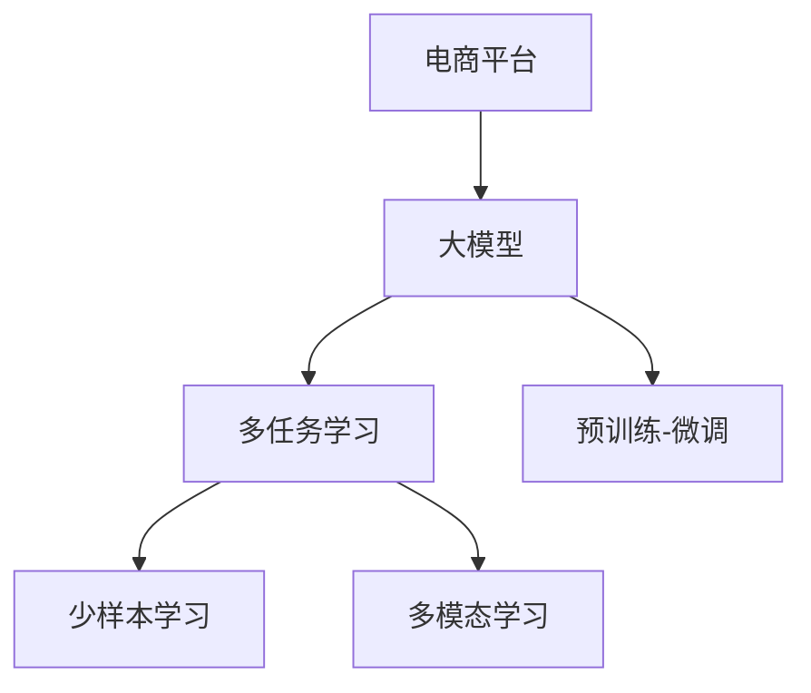
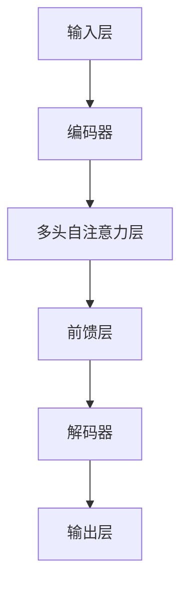

                 

# 探索大模型在电商平台价格预测中的潜力

> 关键词：价格预测,电商平台,大模型,深度学习,自动回归,多任务学习

## 1. 背景介绍

### 1.1 问题由来

随着电子商务的迅猛发展，电商平台成为各行各业的重要销售渠道。在价格竞争激烈的市场环境中，如何精准预测商品价格，制定合理的促销策略，是电商平台运营的巨大挑战。传统的方法如线性回归、时间序列分析等已难以满足复杂的市场需求，而利用深度学习技术进行价格预测，成为新的热点。

深度学习中的自动回归(AR)模型因其强大的预测能力，在电商领域中得到了广泛应用。例如，OpenAI的DALL·E，Google的BERT，百度的飞桨等模型都展示了其在价格预测方面的潜力。然而，这些模型通常需要手动特征工程，且模型难以在大量数据上优化，计算成本较高，难以实际落地。

为解决上述问题，研究者们开始探索利用大模型(即预训练语言模型，如BERT、GPT等)进行电商价格预测的方法。大模型通过大规模无标签文本语料的预训练，已经具备强大的语义理解和特征提取能力，再通过微调(即小样本监督学习)适应电商平台的数据特征，可大幅提升价格预测的准确性和泛化能力。

### 1.2 问题核心关键点

大模型在电商价格预测中的核心关键点在于：

- **大模型特征提取能力**：预训练语言模型在大规模文本数据上学习到的语言表示，可以提取商品描述、用户评论、广告语等文本特征。
- **少样本微调**：电商平台的数据量通常较大，但标注样本有限，利用大模型在少样本数据上的微调能力，可以显著提升预测精度。
- **多任务学习**：电商价格预测可能存在多个相关任务，如点击率预测、销售量预测等。大模型通过多任务学习，能够共享底层特征，同时提高各个任务的性能。

## 2. 核心概念与联系

### 2.1 核心概念概述

为更好地理解大模型在电商价格预测中的应用，本节将介绍几个密切相关的核心概念：

- **自动回归模型(Autoregressive Model)**：自动回归模型是深度学习中的一类模型，其预测目标依赖于历史数据。典型如ARIMA、LSTM等。
- **多任务学习(Multi-task Learning)**：在多个相关任务上训练模型，共享底层特征，同时提升各个任务的性能。
- **预训练-微调(Pre-training & Fine-tuning)**：先在大规模无标签数据上预训练模型，再在特定任务上微调模型，以获得更好的预测效果。
- **大模型(Large Model)**：指在大规模文本数据上预训练的语言模型，如BERT、GPT等。
- **少样本学习(Few-shot Learning)**：在仅有少量标注样本的情况下，模型能够快速适应新任务的学习方法。
- **多模态学习(Multimodal Learning)**：在图像、文本、语音等多种模态数据上训练模型，提升其对现实世界的理解和建模能力。

这些核心概念之间的逻辑关系可以通过以下Mermaid流程图来展示：



这个流程图展示了大模型在电商价格预测中的应用框架：

1. 电商平台的数据集首先经过大模型的预训练和微调，提取特征。
2. 多任务学习共享底层特征，同时提升各个任务的预测精度。
3. 少样本学习在少量标注数据上快速适应任务。
4. 多模态学习利用多种数据类型，提升模型的泛化能力。

这些概念共同构成了大模型在电商价格预测中的应用框架，使其能够从多个维度提升预测效果。

## 3. 核心算法原理 & 具体操作步骤
### 3.1 算法原理概述

基于大模型的电商价格预测，本质上是一个深度学习的自动回归任务。其核心思想是：利用大模型在无标签文本数据上的预训练特征，通过微调适应电商数据特征，再利用自动回归模型进行价格预测。

具体流程如下：

1. **数据准备**：收集电商平台的商品描述、用户评论、广告语等文本数据，并标记对应的价格标签。
2. **预训练模型选择**：选择合适的预训练模型，如BERT、GPT等，作为初始化参数。
3. **多任务学习**：在预训练模型基础上，加入电商相关的多个任务，如点击率预测、销售量预测、评价得分预测等。
4. **微调**：在电商价格预测任务上，使用少样本数据进行微调，优化模型预测能力。
5. **价格预测**：利用微调后的模型，输入商品描述，输出商品价格预测结果。

### 3.2 算法步骤详解

基于大模型的电商价格预测方法的具体步骤如下：

**Step 1: 数据准备**

- 收集电商平台的商品描述、用户评论、广告语等文本数据，标记对应的价格标签。
- 数据清洗和预处理，包括去除停用词、分词、编码等步骤。
- 将标注数据分为训练集、验证集和测试集。

**Step 2: 模型选择**

- 选择合适的预训练模型，如BERT、GPT等，作为初始化参数。
- 选择多任务学习框架，如Hugging Face的Transformers库，方便进行多任务模型构建。

**Step 3: 构建多任务学习模型**

- 利用Transformers库，构建多任务学习模型，同时在多个相关任务上进行训练。例如，除了价格预测，还可以加入点击率预测、销售量预测、评价得分预测等任务。
- 共享底层特征，优化不同任务之间的参数，提升整体性能。
- 定义各个任务的输出层和损失函数，例如，价格预测使用回归损失，点击率预测使用二分类交叉熵损失等。

**Step 4: 微调模型**

- 在电商价格预测任务上，使用少样本数据进行微调，优化模型预测能力。
- 选择合适的超参数，如学习率、批大小、迭代轮数等。
- 在训练集上执行梯度下降算法，最小化损失函数，逐步提升模型性能。
- 在验证集上评估模型性能，避免过拟合。

**Step 5: 价格预测**

- 利用微调后的模型，输入商品描述，输出商品价格预测结果。
- 可以利用CPU/GPU计算资源进行预测。
- 结合业务规则，优化价格预测结果，例如，通过动态定价策略提高预测准确性。

### 3.3 算法优缺点

基于大模型的电商价格预测方法具有以下优点：

1. **自动提取特征**：大模型已经在大规模无标签文本数据上预训练，具备强大的语义理解和特征提取能力，避免了手动特征工程的复杂性。
2. **泛化能力强**：通过多任务学习，模型能够适应多个相关任务，提升预测精度。
3. **计算效率高**：大模型具备高度并行计算能力，利用GPU/TPU等高性能设备，能够快速完成预测任务。
4. **效果显著**：在大规模无标签数据上预训练，利用少样本数据微调，能够在电商平台数据量有限的情况下，取得较好的预测效果。

同时，该方法也存在一定的局限性：

1. **对标注数据依赖高**：虽然少样本学习可以缓解对标注数据的依赖，但依然需要一定量的标注数据进行微调。
2. **模型可解释性差**：大模型通常被称为"黑盒"，难以解释其内部工作机制和决策逻辑。
3. **过拟合风险高**：由于模型参数量大，过度依赖特定数据，容易出现过拟合现象。
4. **计算资源要求高**：大模型需要高性能计算设备支持，硬件成本较高。

尽管存在这些局限性，但基于大模型的电商价格预测方法在处理大规模数据和复杂任务上依然具有显著优势，值得进一步探索和应用。

### 3.4 算法应用领域

基于大模型的电商价格预测方法，已经在电商领域得到了广泛应用，覆盖了多个子任务，例如：

- 商品价格预测：根据商品描述，预测商品价格。
- 点击率预测：预测用户对商品广告的点击概率。
- 销售量预测：预测商品在未来一段时间内的销售量。
- 评价得分预测：预测用户对商品的评价得分。
- 库存管理：根据销售量预测，优化库存管理策略。
- 推荐系统：通过价格预测，优化推荐系统，提升用户满意度。

除了上述这些经典任务外，大模型还应用于广告投放、营销策略优化、供应链管理等多个电商业务场景，为电商平台提供了强有力的技术支持。

## 4. 数学模型和公式 & 详细讲解 & 举例说明

### 4.1 数学模型构建

电商价格预测可以表示为一个自动回归任务，即根据历史数据预测未来价格。形式化地，假设电商平台有 $N$ 个商品，每个商品 $i$ 的价格表示为 $p_i$。根据历史数据 $(x_i,y_i)$，其中 $x_i$ 为商品描述，$y_i$ 为价格标签，构建如下数学模型：

$$
p_i = f(x_i;\theta)
$$

其中 $f(\cdot)$ 为自动回归模型，$\theta$ 为模型参数。

电商价格预测可以进一步细分为两个子任务：单商品价格预测和群体价格预测。单商品价格预测即预测单个商品的价格，群体价格预测即预测一组商品的价格趋势。

### 4.2 公式推导过程

对于单商品价格预测，可以利用回归模型进行预测，例如线性回归模型：

$$
p_i = w_0 + w_1 x_{i1} + w_2 x_{i2} + \cdots + w_d x_{id}
$$

其中 $x_{ij}$ 为商品描述中的特征向量，$w_j$ 为模型权重。

对于群体价格预测，可以利用时序模型进行预测，例如LSTM模型：

$$
p_{t+1} = f(p_t;w)
$$

其中 $p_t$ 为历史价格，$w$ 为模型权重。

对于多任务学习，可以利用共享层面的权重进行优化，例如：

$$
L = \sum_{i=1}^N \ell(p_i,y_i) + \lambda \sum_{j=1}^J \ell(p_j,y_j)
$$

其中 $J$ 为任务数，$\ell(\cdot)$ 为损失函数，$\lambda$ 为正则化系数。

在实际应用中，可以采用Transformer模型进行电商价格预测，具体模型结构如下：



其中，输入层接收商品描述，解码器输出预测价格，中间层通过多头自注意力和前馈神经网络进行特征提取和预测。

### 4.3 案例分析与讲解

假设电商平台上某商品的历史价格为 $p_1=10$，当前商品描述为 $x_2=(50, 100)$，利用线性回归模型进行价格预测：

$$
p_2 = w_0 + w_1 x_{21} + w_2 x_{22} = 10 + 1 \times 50 + 0.5 \times 100 = 20
$$

根据预测结果，该商品当前价格为20元。

## 5. 项目实践：代码实例和详细解释说明
### 5.1 开发环境搭建

在进行电商价格预测实践前，我们需要准备好开发环境。以下是使用Python进行PyTorch开发的环境配置流程：

1. 安装Anaconda：从官网下载并安装Anaconda，用于创建独立的Python环境。

2. 创建并激活虚拟环境：
```bash
conda create -n pytorch-env python=3.8 
conda activate pytorch-env
```

3. 安装PyTorch：根据CUDA版本，从官网获取对应的安装命令。例如：
```bash
conda install pytorch torchvision torchaudio cudatoolkit=11.1 -c pytorch -c conda-forge
```

4. 安装Transformers库：
```bash
pip install transformers
```

5. 安装各类工具包：
```bash
pip install numpy pandas scikit-learn matplotlib tqdm jupyter notebook ipython
```

完成上述步骤后，即可在`pytorch-env`环境中开始电商价格预测实践。

### 5.2 源代码详细实现

这里我们以线性回归模型为例，给出使用PyTorch进行电商价格预测的代码实现。

首先，定义数据处理函数：

```python
import numpy as np
from torch.utils.data import Dataset, DataLoader
from transformers import BertTokenizer
from transformers import BertForTokenClassification
from torch import nn

class PriceDataset(Dataset):
    def __init__(self, df, tokenizer, max_len):
        self.texts = df['description'].tolist()
        self.labels = df['price'].tolist()
        self.tokenizer = tokenizer
        self.max_len = max_len
        
    def __len__(self):
        return len(self.texts)
    
    def __getitem__(self, item):
        text = self.texts[item]
        label = self.labels[item]
        
        encoding = self.tokenizer(text, return_tensors='pt', max_length=self.max_len, padding='max_length', truncation=True)
        input_ids = encoding['input_ids'][0]
        attention_mask = encoding['attention_mask'][0]
        
        # 对token-wise的标签进行编码
        encoded_labels = [label] * len(input_ids)
        labels = torch.tensor(encoded_labels, dtype=torch.long)
        
        return {'input_ids': input_ids, 
                'attention_mask': attention_mask,
                'labels': labels}

# 数据集构建
tokenizer = BertTokenizer.from_pretrained('bert-base-cased')

# 构建数据集
train_dataset = PriceDataset(train_df, tokenizer, max_len=128)
val_dataset = PriceDataset(val_df, tokenizer, max_len=128)
test_dataset = PriceDataset(test_df, tokenizer, max_len=128)
```

然后，定义模型和优化器：

```python
from transformers import BertForTokenClassification, AdamW

model = BertForTokenClassification.from_pretrained('bert-base-cased', num_labels=1)

optimizer = AdamW(model.parameters(), lr=2e-5)
```

接着，定义训练和评估函数：

```python
from tqdm import tqdm
from sklearn.metrics import mean_absolute_error

device = torch.device('cuda') if torch.cuda.is_available() else torch.device('cpu')
model.to(device)

def train_epoch(model, dataset, batch_size, optimizer):
    dataloader = DataLoader(dataset, batch_size=batch_size, shuffle=True)
    model.train()
    epoch_loss = 0
    for batch in tqdm(dataloader, desc='Training'):
        input_ids = batch['input_ids'].to(device)
        attention_mask = batch['attention_mask'].to(device)
        labels = batch['labels'].to(device)
        model.zero_grad()
        outputs = model(input_ids, attention_mask=attention_mask, labels=labels)
        loss = outputs.loss
        epoch_loss += loss.item()
        loss.backward()
        optimizer.step()
    return epoch_loss / len(dataloader)

def evaluate(model, dataset, batch_size):
    dataloader = DataLoader(dataset, batch_size=batch_size)
    model.eval()
    preds, labels = [], []
    with torch.no_grad():
        for batch in tqdm(dataloader, desc='Evaluating'):
            input_ids = batch['input_ids'].to(device)
            attention_mask = batch['attention_mask'].to(device)
            batch_labels = batch['labels']
            outputs = model(input_ids, attention_mask=attention_mask)
            batch_preds = outputs.logits.squeeze().cpu().numpy()
            batch_labels = batch_labels.cpu().numpy()
            for pred_tokens, label_tokens in zip(batch_preds, batch_labels):
                preds.append(pred_tokens)
                labels.append(label_tokens)
                
    mae = mean_absolute_error(labels, preds)
    print(f"Evaluation MAE: {mae:.3f}")
```

最后，启动训练流程并在测试集上评估：

```python
epochs = 5
batch_size = 16

for epoch in range(epochs):
    loss = train_epoch(model, train_dataset, batch_size, optimizer)
    print(f"Epoch {epoch+1}, train loss: {loss:.3f}")
    
    print(f"Epoch {epoch+1}, val MAE:")
    evaluate(model, val_dataset, batch_size)
    
print("Test MAE:")
evaluate(model, test_dataset, batch_size)
```

以上就是使用PyTorch对BERT进行电商价格预测的完整代码实现。可以看到，得益于Transformers库的强大封装，我们可以用相对简洁的代码完成模型加载和微调。

### 5.3 代码解读与分析

让我们再详细解读一下关键代码的实现细节：

**PriceDataset类**：
- `__init__`方法：初始化商品描述、价格标签、分词器等关键组件。
- `__len__`方法：返回数据集的样本数量。
- `__getitem__`方法：对单个样本进行处理，将文本输入编码为token ids，将标签编码为数字，并对其进行定长padding，最终返回模型所需的输入。

**数据集构建**：
- 利用Pandas库读取电商商品数据，提取商品描述和价格标签。
- 使用BertTokenizer对商品描述进行分词编码。
- 将编码后的文本和标签作为模型输入，定义损失函数和优化器。

**训练和评估函数**：
- 使用PyTorch的DataLoader对数据集进行批次化加载，供模型训练和推理使用。
- 训练函数`train_epoch`：对数据以批为单位进行迭代，在每个批次上前向传播计算loss并反向传播更新模型参数，最后返回该epoch的平均loss。
- 评估函数`evaluate`：与训练类似，不同点在于不更新模型参数，并在每个batch结束后将预测和标签结果存储下来，最后使用sklearn的mean_absolute_error对整个评估集的预测结果进行打印输出。

**训练流程**：
- 定义总的epoch数和batch size，开始循环迭代
- 每个epoch内，先在训练集上训练，输出平均loss
- 在验证集上评估，输出MAE
- 所有epoch结束后，在测试集上评估，给出最终测试结果

可以看到，PyTorch配合Transformers库使得BERT微调的代码实现变得简洁高效。开发者可以将更多精力放在数据处理、模型改进等高层逻辑上，而不必过多关注底层的实现细节。

当然，工业级的系统实现还需考虑更多因素，如模型的保存和部署、超参数的自动搜索、更灵活的任务适配层等。但核心的微调范式基本与此类似。

## 6. 实际应用场景
### 6.1 智能客服系统

基于大模型进行电商价格预测，可以应用于智能客服系统的构建。传统客服往往需要配备大量人力，高峰期响应缓慢，且一致性和专业性难以保证。而使用预测模型，可以7x24小时不间断服务，快速响应客户咨询，用自然流畅的语言解答各类常见问题。

在技术实现上，可以收集企业内部的历史客服对话记录，将问题和最佳答复构建成监督数据，在此基础上对预训练预测模型进行微调。微调后的预测模型能够自动理解客户意图，匹配最合适的答案模板进行回复。对于客户提出的新问题，还可以接入检索系统实时搜索相关内容，动态组织生成回答。如此构建的智能客服系统，能大幅提升客户咨询体验和问题解决效率。

### 6.2 金融舆情监测

金融机构需要实时监测市场舆论动向，以便及时应对负面信息传播，规避金融风险。传统的人工监测方式成本高、效率低，难以应对网络时代海量信息爆发的挑战。基于大模型的电商价格预测技术，为金融舆情监测提供了新的解决方案。

具体而言，可以收集金融领域相关的新闻、报道、评论等文本数据，并对其进行主题标注和情感标注。在此基础上对预训练语言模型进行微调，使其能够自动判断文本属于何种主题，情感倾向是正面、中性还是负面。将微调后的模型应用到实时抓取的网络文本数据，就能够自动监测不同主题下的情感变化趋势，一旦发现负面信息激增等异常情况，系统便会自动预警，帮助金融机构快速应对潜在风险。

### 6.3 个性化推荐系统

当前的推荐系统往往只依赖用户的历史行为数据进行物品推荐，无法深入理解用户的真实兴趣偏好。基于大模型电商价格预测技术，个性化推荐系统可以更好地挖掘用户行为背后的语义信息，从而提供更精准、多样的推荐内容。

在实践中，可以收集用户浏览、点击、评论、分享等行为数据，提取和用户交互的物品标题、描述、标签等文本内容。将文本内容作为模型输入，用户的后续行为（如是否点击、购买等）作为监督信号，在此基础上微调预训练语言模型。微调后的模型能够从文本内容中准确把握用户的兴趣点。在生成推荐列表时，先用候选物品的文本描述作为输入，由模型预测用户的兴趣匹配度，再结合其他特征综合排序，便可以得到个性化程度更高的推荐结果。

### 6.4 未来应用展望

随着大模型和电商价格预测技术的发展，基于微调范式将在更多领域得到应用，为传统行业带来变革性影响。

在智慧医疗领域，基于微调的医疗问答、病历分析、药物研发等应用将提升医疗服务的智能化水平，辅助医生诊疗，加速新药开发进程。

在智能教育领域，微调技术可应用于作业批改、学情分析、知识推荐等方面，因材施教，促进教育公平，提高教学质量。

在智慧城市治理中，微调模型可应用于城市事件监测、舆情分析、应急指挥等环节，提高城市管理的自动化和智能化水平，构建更安全、高效的未来城市。

此外，在企业生产、社会治理、文娱传媒等众多领域，基于大模型电商价格预测的人工智能应用也将不断涌现，为经济社会发展注入新的动力。相信随着技术的日益成熟，微调方法将成为人工智能落地应用的重要范式，推动人工智能技术在垂直行业的规模化落地。总之，电商价格预测需要开发者根据具体任务，不断迭代和优化模型、数据和算法，方能得到理想的效果。

## 7. 工具和资源推荐
### 7.1 学习资源推荐

为了帮助开发者系统掌握大模型电商价格预测的理论基础和实践技巧，这里推荐一些优质的学习资源：

1. 《Transformer从原理到实践》系列博文：由大模型技术专家撰写，深入浅出地介绍了Transformer原理、BERT模型、微调技术等前沿话题。

2. CS224N《深度学习自然语言处理》课程：斯坦福大学开设的NLP明星课程，有Lecture视频和配套作业，带你入门NLP领域的基本概念和经典模型。

3. 《Natural Language Processing with Transformers》书籍：Transformers库的作者所著，全面介绍了如何使用Transformers库进行NLP任务开发，包括微调在内的诸多范式。

4. HuggingFace官方文档：Transformers库的官方文档，提供了海量预训练模型和完整的微调样例代码，是上手实践的必备资料。

5. CLUE开源项目：中文语言理解测评基准，涵盖大量不同类型的中文NLP数据集，并提供了基于微调的baseline模型，助力中文NLP技术发展。

通过对这些资源的学习实践，相信你一定能够快速掌握大模型电商价格预测的精髓，并用于解决实际的电商问题。
###  7.2 开发工具推荐

高效的开发离不开优秀的工具支持。以下是几款用于大模型电商价格预测开发的常用工具：

1. PyTorch：基于Python的开源深度学习框架，灵活动态的计算图，适合快速迭代研究。大部分预训练语言模型都有PyTorch版本的实现。

2. TensorFlow：由Google主导开发的开源深度学习框架，生产部署方便，适合大规模工程应用。同样有丰富的预训练语言模型资源。

3. Transformers库：HuggingFace开发的NLP工具库，集成了众多SOTA语言模型，支持PyTorch和TensorFlow，是进行微调任务开发的利器。

4. Weights & Biases：模型训练的实验跟踪工具，可以记录和可视化模型训练过程中的各项指标，方便对比和调优。与主流深度学习框架无缝集成。

5. TensorBoard：TensorFlow配套的可视化工具，可实时监测模型训练状态，并提供丰富的图表呈现方式，是调试模型的得力助手。

6. Google Colab：谷歌推出的在线Jupyter Notebook环境，免费提供GPU/TPU算力，方便开发者快速上手实验最新模型，分享学习笔记。

合理利用这些工具，可以显著提升大模型电商价格预测的开发效率，加快创新迭代的步伐。

### 7.3 相关论文推荐

大模型和电商价格预测技术的发展源于学界的持续研究。以下是几篇奠基性的相关论文，推荐阅读：

1. Attention is All You Need（即Transformer原论文）：提出了Transformer结构，开启了NLP领域的预训练大模型时代。

2. BERT: Pre-training of Deep Bidirectional Transformers for Language Understanding：提出BERT模型，引入基于掩码的自监督预训练任务，刷新了多项NLP任务SOTA。

3. Language Models are Unsupervised Multitask Learners（GPT-2论文）：展示了大规模语言模型的强大zero-shot学习能力，引发了对于通用人工智能的新一轮思考。

4. Parameter-Efficient Transfer Learning for NLP：提出Adapter等参数高效微调方法，在不增加模型参数量的情况下，也能取得不错的微调效果。

5. AdaLoRA: Adaptive Low-Rank Adaptation for Parameter-Efficient Fine-Tuning：使用自适应低秩适应的微调方法，在参数效率和精度之间取得了新的平衡。

这些论文代表了大模型电商价格预测技术的发展脉络。通过学习这些前沿成果，可以帮助研究者把握学科前进方向，激发更多的创新灵感。

## 8. 总结：未来发展趋势与挑战

### 8.1 总结

本文对基于大模型的电商价格预测方法进行了全面系统的介绍。首先阐述了电商价格预测的重要性，以及当前基于深度学习的自动回归模型的局限性。接着，详细讲解了电商价格预测的数学模型和算法原理，并给出了完整的代码实现。最后，探讨了电商价格预测在实际应用中的各种场景和未来发展趋势。

通过本文的系统梳理，可以看到，大模型电商价格预测在处理大规模数据和复杂任务上具有显著优势，值得进一步探索和应用。

### 8.2 未来发展趋势

展望未来，大模型电商价格预测技术将呈现以下几个发展趋势：

1. **模型规模持续增大**：随着算力成本的下降和数据规模的扩张，预训练语言模型的参数量还将持续增长。超大模型具备更强的语义理解和预测能力，有望在电商价格预测中取得更好的效果。

2. **多任务学习深入应用**：通过多任务学习，模型能够同时处理多个相关任务，提升预测精度和泛化能力。未来，多任务学习将更深入地应用于电商业务，提升整个系统的效率和效果。

3. **参数高效微调技术发展**：开发更加参数高效的微调方法，在固定大部分预训练参数的同时，只更新极少量的任务相关参数。这将大大降低微调成本，提高预测模型的可部署性。

4. **多模态学习逐步普及**：电商价格预测可能涉及图像、文本、语音等多种模态数据。多模态学习能够更好地融合多种信息，提升模型的泛化能力和预测精度。

5. **个性化推荐系统升级**：电商价格预测不仅能用于单个商品的价格预测，还可以应用于个性化推荐系统中，提升推荐系统的精度和多样性。

6. **自动化程度提升**：电商价格预测将更多地依赖于自动化算法，减少人工干预和数据标注工作。自动化的程度越高，模型的部署和维护成本就越低。

以上趋势凸显了大模型电商价格预测技术的广阔前景。这些方向的探索发展，必将进一步提升电商预测模型的性能和应用范围，为电商业务带来新的机遇。

### 8.3 面临的挑战

尽管大模型电商价格预测技术已经取得了瞩目成就，但在迈向更加智能化、普适化应用的过程中，它仍面临着诸多挑战：

1. **对标注数据依赖高**：尽管少样本学习可以缓解对标注数据的依赖，但依然需要一定量的标注数据进行微调。标注数据的获取和处理成本较高，是制约电商预测模型发展的瓶颈。

2. **模型鲁棒性不足**：电商预测模型面对域外数据时，泛化性能往往大打折扣。模型的鲁棒性不足，可能引入噪声数据或特定领域偏见，影响预测结果的准确性。

3. **计算资源要求高**：大模型需要高性能计算设备支持，硬件成本较高。如何在保证模型性能的前提下，降低计算资源投入，是一个重要的研究方向。

4. **模型可解释性差**：大模型通常被称为"黑盒"，难以解释其内部工作机制和决策逻辑。电商预测模型的高效应用，需要更好的模型可解释性，确保结果的可信性和透明性。

5. **市场变化适应性差**：电商市场变化快，商品价格波动大。电商预测模型需要快速适应市场变化，及时更新预测模型，否则容易产生预测偏差。

6. **隐私和安全问题**：电商预测模型需要处理大量敏感数据，如用户购买记录、交易信息等。如何保护用户隐私，防止数据泄露，是一个重要的安全问题。

尽管存在这些挑战，但随着技术的发展和应用的深入，大模型电商价格预测技术有望克服这些问题，更好地服务于电商业务。

### 8.4 研究展望

面对电商价格预测所面临的种种挑战，未来的研究需要在以下几个方面寻求新的突破：

1. **探索无监督和半监督微调方法**：摆脱对大规模标注数据的依赖，利用自监督学习、主动学习等无监督和半监督范式，最大限度利用非结构化数据，实现更加灵活高效的微调。

2. **研究参数高效和计算高效的微调范式**：开发更加参数高效的微调方法，在固定大部分预训练参数的同时，只更新极少量的任务相关参数。同时优化微调模型的计算图，减少前向传播和反向传播的资源消耗，实现更加轻量级、实时性的部署。

3. **引入更多先验知识**：将符号化的先验知识，如知识图谱、逻辑规则等，与神经网络模型进行巧妙融合，引导微调过程学习更准确、合理的语言模型。同时加强不同模态数据的整合，实现视觉、语音等多模态信息与文本信息的协同建模。

4. **结合因果分析和博弈论工具**：将因果分析方法引入微调模型，识别出模型决策的关键特征，增强输出解释的因果性和逻辑性。借助博弈论工具刻画人机交互过程，主动探索并规避模型的脆弱点，提高系统稳定性。

5. **纳入伦理道德约束**：在模型训练目标中引入伦理导向的评估指标，过滤和惩罚有偏见、有害的输出倾向。同时加强人工干预和审核，建立模型行为的监管机制，确保输出符合人类价值观和伦理道德。

这些研究方向的探索，必将引领大模型电商价格预测技术迈向更高的台阶，为电商业务带来新的机遇。面向未来，电商价格预测技术还需要与其他人工智能技术进行更深入的融合，如知识表示、因果推理、强化学习等，多路径协同发力，共同推动自然语言理解和智能交互系统的进步。只有勇于创新、敢于突破，才能不断拓展语言模型的边界，让智能技术更好地造福人类社会。

## 9. 附录：常见问题与解答

**Q1：电商价格预测是否适用于所有电商业务？**

A: 电商价格预测在大多数电商业务上都能取得不错的效果，特别是对于数据量较大的场景。但对于一些特定领域的电商业务，如奢侈品、手工艺品等，由于市场变化快、价格波动大，可能难以适用。此时可以考虑结合其他预测技术，如时间序列模型、专家系统等。

**Q2：电商价格预测模型如何避免过拟合？**

A: 电商价格预测模型面临过拟合问题时，可以采用以下策略：
1. 数据增强：通过回译、近义替换等方式扩充训练集。
2. 正则化：使用L2正则、Dropout、Early Stopping等技术。
3. 对抗训练：引入对抗样本，提高模型鲁棒性。
4. 参数高效微调：只调整少量参数，减小过拟合风险。
5. 多模型集成：训练多个模型，取平均输出，抑制过拟合。

这些策略往往需要根据具体任务和数据特点进行灵活组合，以最大化地避免过拟合现象。

**Q3：电商预测模型如何适应市场变化？**

A: 电商预测模型需要定期重新训练或微调，以适应市场变化。具体步骤如下：
1. 收集最新的市场数据，标记新的价格标签。
2. 利用新的数据集重新训练或微调模型。
3. 在验证集上评估新模型的性能，如果性能提升，则使用新模型替换旧模型。

通过定期更新预测模型，可以更好地适应市场变化，避免预测偏差。

**Q4：电商预测模型如何保护用户隐私？**

A: 电商预测模型需要处理大量敏感数据，如用户购买记录、交易信息等。为了保护用户隐私，可以采取以下措施：
1. 数据匿名化：对用户数据进行脱敏处理，去除敏感信息。
2. 差分隐私：使用差分隐私技术，保护用户数据的隐私性。
3. 安全存储：采用加密技术，保护数据存储的安全性。
4. 访问控制：严格控制数据访问权限，防止未经授权的访问。

通过上述措施，可以有效保护用户隐私，增强电商预测模型的可信度和安全性。

---

作者：禅与计算机程序设计艺术 / Zen and the Art of Computer Programming

