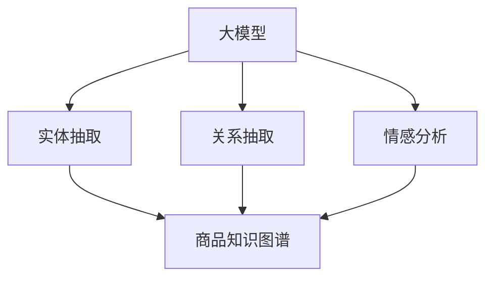

                 

# 探讨大模型在电商平台商品知识图谱构建中的作用

## 1. 背景介绍

在快速发展的电子商务时代，电商平台需要构建复杂且精细的知识图谱（KG）来支撑高效的推荐系统、搜索和个性化展示等业务。知识图谱由节点和边组成，节点代表实体，边代表实体之间的关系，可以为电商平台的商品推荐、查询、匹配等任务提供强有力的支撑。然而，构建一个全面的商品知识图谱需要巨大的时间和资源投入，且数据来源复杂，涵盖商品属性、用户评价、竞争对手信息等。大模型在这方面具有显著的优势。

### 1.1 商品知识图谱的作用
商品知识图谱的构建有助于电商平台：
- **提高商品推荐精度**：通过深入分析商品属性、用户行为和商品之间的关系，可以提供更精准的商品推荐。
- **提升搜索效率**：商品知识图谱将商品和其描述、属性等信息映射为节点，使用户可以通过简单的查询得到相关的商品信息。
- **优化个性化展示**：根据用户的历史行为和兴趣，可以在网页上展示与用户相关联的商品。

### 1.2 大模型在商品知识图谱中的作用
大模型通过在大规模数据上进行预训练，具备强大的语言处理和推理能力。在大模型的基础上进行微调，可以有效提取商品信息，建立商品之间的关系，从而高效构建商品知识图谱。

1. **实体抽取**：大模型可以自动识别并抽取商品的名称、描述、属性等信息。
2. **关系抽取**：大模型可以分析商品之间的关系，如商品之间的相关性、价格区间、品牌等。
3. **情感分析**：大模型可以分析用户对商品的评价，判断其情感倾向。

本文将探讨大模型在电商平台商品知识图谱构建中的作用，包括实体抽取、关系抽取和情感分析等核心任务，并通过代码实例展示其实现过程。

## 2. 核心概念与联系

### 2.1 核心概念概述

在探讨大模型的作用前，首先需要理解几个核心概念：

- **大模型**：指在大规模数据上预训练的深度学习模型，如BERT、GPT-3等，具备强大的语言处理和推理能力。
- **知识图谱（KG）**：由节点和边组成的网络结构，节点代表实体，边代表实体之间的关系。
- **实体抽取（Entity Extraction）**：从文本中识别和提取实体。
- **关系抽取（Relation Extraction）**：分析实体之间的关系。
- **情感分析（Sentiment Analysis）**：分析文本中的情感倾向。

这些概念之间的联系可以通过以下Mermaid流程图来展示：



这个流程图展示了大模型如何通过实体抽取、关系抽取和情感分析，构建商品知识图谱的过程。

## 3. 核心算法原理 & 具体操作步骤

### 3.1 算法原理概述

大模型在电商平台商品知识图谱构建中的核心原理包括以下几个方面：

1. **预训练**：大模型在无标签的大规模数据上进行预训练，学习通用的语言表示。
2. **微调**：在大模型的基础上进行微调，学习特定的商品知识图谱构建任务。
3. **实体抽取**：通过微调，大模型可以识别并抽取商品的名称、描述、属性等信息。
4. **关系抽取**：通过微调，大模型可以分析商品之间的关系，如相关性、价格区间、品牌等。
5. **情感分析**：通过微调，大模型可以分析用户对商品的评价，判断其情感倾向。

### 3.2 算法步骤详解

以下是大模型在商品知识图谱构建中的详细步骤：

**Step 1: 数据准备**
- 收集商品描述、用户评论、商品属性等数据。
- 将数据进行预处理，如分词、去除停用词等。

**Step 2: 实体抽取**
- 使用预训练的大模型对商品描述进行微调，学习实体抽取器。
- 对每个商品描述进行实体抽取，提取出商品名称、描述、属性等信息。

**Step 3: 关系抽取**
- 设计关系抽取器，学习商品之间的关系，如相关性、价格区间、品牌等。
- 对每个商品进行关系抽取，提取出与其他商品之间的关系。

**Step 4: 情感分析**
- 设计情感分析器，学习用户对商品的情感倾向。
- 对用户评论进行情感分析，提取出评论的情感倾向。

**Step 5: 构建知识图谱**
- 根据抽取的实体、关系和情感信息，构建商品知识图谱。

**Step 6: 验证与优化**
- 在验证集上评估知识图谱的性能，根据评估结果进行优化。

### 3.3 算法优缺点

大模型在商品知识图谱构建中的优点包括：
1. **自动化的实体抽取和关系抽取**：大模型可以自动学习实体和关系，避免人工标注的繁琐和误差。
2. **高效的情感分析**：大模型能够快速分析大量用户评论，提取情感倾向。
3. **鲁棒性**：大模型在处理复杂语义和噪声数据时，具有较好的鲁棒性。

同时，也存在一些缺点：
1. **数据依赖**：大模型需要大量的数据进行预训练，对数据质量和数量要求较高。
2. **计算成本高**：大模型的训练和微调需要较高的计算资源和时间。
3. **泛化能力**：大模型在特定领域的数据上性能可能不如小模型。

### 3.4 算法应用领域

大模型在电商平台商品知识图谱构建中的应用领域包括：

- **商品推荐系统**：通过知识图谱优化推荐算法，提升推荐精度。
- **搜索系统**：利用知识图谱优化搜索算法，提升搜索效率。
- **个性化展示**：根据用户行为和兴趣，在网页上展示相关商品。

## 4. 数学模型和公式 & 详细讲解 & 举例说明

### 4.1 数学模型构建

假设大模型为$M_{\theta}$，其中$\theta$为模型参数。定义实体抽取器、关系抽取器和情感分析器的损失函数分别为$L_{ent}$、$L_{rel}$和$L_{sent}$。则商品知识图谱的构建损失函数为：

$$
L = \alpha L_{ent} + \beta L_{rel} + \gamma L_{sent}
$$

其中$\alpha$、$\beta$和$\gamma$为权重系数，用于平衡不同任务的贡献。

### 4.2 公式推导过程

以实体抽取为例，假设输入的商品描述为$x$，模型输出的实体列表为$y$。实体抽取器的损失函数为：

$$
L_{ent} = \frac{1}{N} \sum_{i=1}^N \ell(x_i, y_i)
$$

其中$\ell$为交叉熵损失函数，$\ell(x_i, y_i) = -\sum_{j=1}^{|y_i|}(y_{ij}\log M_{\theta}(x_i,j) + (1-y_{ij})\log(1-M_{\theta}(x_i,j)))$。

对模型参数$\theta$的梯度更新公式为：

$$
\theta \leftarrow \theta - \eta \nabla_{\theta}L_{ent}
$$

其中$\eta$为学习率。

### 4.3 案例分析与讲解

以某电商平台为例，假设收集了10000个商品描述，每个描述长度为200个单词。使用BERT模型进行微调，抽取商品名称、描述和属性。首先，将每个商品描述分为训练集和验证集。训练集用于微调，验证集用于评估模型性能。

**Step 1: 数据准备**

收集商品描述、用户评论、商品属性等数据。数据量如下：
- 商品描述：10000个
- 用户评论：50000条
- 商品属性：20000个

对数据进行预处理，包括分词、去除停用词、标准化等。

**Step 2: 实体抽取**

使用BERT模型对商品描述进行微调，构建实体抽取器。微调的超参数如下：
- 学习率：1e-5
- 批大小：32
- 训练轮数：10

训练过程如下：

```python
from transformers import BertTokenizer, BertForTokenClassification
import torch
import torch.nn as nn
import torch.optim as optim

tokenizer = BertTokenizer.from_pretrained('bert-base-cased')
model = BertForTokenClassification.from_pretrained('bert-base-cased', num_labels=2)

criterion = nn.BCEWithLogitsLoss()
optimizer = optim.Adam(model.parameters(), lr=1e-5)

def train_epoch(model, tokenizer, dataset, criterion, optimizer, device):
    model.train()
    loss = 0
    for batch in dataset:
        inputs = tokenizer(batch['input_ids'], return_tensors='pt', padding='max_length', truncation=True).to(device)
        labels = inputs['labels'].to(device)
        outputs = model(**inputs)
        loss += criterion(outputs.logits, labels).to(device)
    return loss / len(dataset)

def evaluate(model, tokenizer, dataset, criterion, device):
    model.eval()
    loss = 0
    for batch in dataset:
        inputs = tokenizer(batch['input_ids'], return_tensors='pt', padding='max_length', truncation=True).to(device)
        labels = inputs['labels'].to(device)
        outputs = model(**inputs)
        loss += criterion(outputs.logits, labels).to(device)
    return loss / len(dataset)

train_dataset = train_dataset.shuffle(buffer_size=1024)
val_dataset = val_dataset.shuffle(buffer_size=1024)
train_loader = torch.utils.data.DataLoader(train_dataset, batch_size=32, shuffle=True)
val_loader = torch.utils.data.DataLoader(val_dataset, batch_size=32, shuffle=True)

device = torch.device('cuda') if torch.cuda.is_available() else torch.device('cpu')

for epoch in range(10):
    train_loss = train_epoch(model, tokenizer, train_loader, criterion, optimizer, device)
    val_loss = evaluate(model, tokenizer, val_loader, criterion, device)
    print(f'Epoch {epoch+1}, train loss: {train_loss:.4f}, val loss: {val_loss:.4f}')
```

**Step 3: 关系抽取**

设计关系抽取器，学习商品之间的关系，如相关性、价格区间、品牌等。假设关系抽取器输入为商品A和商品B，输出为它们之间的关系，如“A与B相关”、“A比B贵”等。关系抽取器的损失函数为：

$$
L_{rel} = \frac{1}{N} \sum_{i=1}^N \ell(A_i, B_i)
$$

其中$\ell$为交叉熵损失函数，$\ell(A_i, B_i) = -(y_{i}\log M_{\theta}(A_i,B_i) + (1-y_{i})\log(1-M_{\theta}(A_i,B_i)))$。

**Step 4: 情感分析**

设计情感分析器，学习用户对商品的情感倾向。假设情感分析器输入为商品描述，输出为情感极性，如“积极”、“消极”等。情感分析器的损失函数为：

$$
L_{sent} = \frac{1}{N} \sum_{i=1}^N \ell(x_i, y_i)
$$

其中$\ell$为交叉熵损失函数，$\ell(x_i, y_i) = -(y_{i}\log M_{\theta}(x_i) + (1-y_{i})\log(1-M_{\theta}(x_i)))$。

**Step 5: 构建知识图谱**

根据抽取的实体、关系和情感信息，构建商品知识图谱。假设构建的知识图谱包含以下节点和边：

- 节点：商品A、商品B、情感信息
- 边：A与B相关、A比B贵、A是B的子类

构建知识图谱的代码如下：

```python
import networkx as nx
import matplotlib.pyplot as plt

G = nx.Graph()

for i in range(len(train_dataset)):
    a, b, rel = train_dataset[i]
    G.add_edge(a, b, rel=rel)

for i in range(len(train_dataset)):
    a, b, sent = train_dataset[i]
    G[a]['sent'] = sent
    G[b]['sent'] = sent

G.add_nodes_from(train_dataset.keys(), sent='')
nx.draw(G, with_labels=True)
plt.show()
```

## 5. 项目实践：代码实例和详细解释说明

### 5.1 开发环境搭建

在进行商品知识图谱构建前，我们需要准备好开发环境。以下是使用Python进行PyTorch开发的环境配置流程：

1. 安装Anaconda：从官网下载并安装Anaconda，用于创建独立的Python环境。

2. 创建并激活虚拟环境：
```bash
conda create -n pytorch-env python=3.8 
conda activate pytorch-env
```

3. 安装PyTorch：根据CUDA版本，从官网获取对应的安装命令。例如：
```bash
conda install pytorch torchvision torchaudio cudatoolkit=11.1 -c pytorch -c conda-forge
```

4. 安装Transformer库：
```bash
pip install transformers
```

5. 安装各类工具包：
```bash
pip install numpy pandas scikit-learn matplotlib tqdm jupyter notebook ipython
```

完成上述步骤后，即可在`pytorch-env`环境中开始商品知识图谱构建实践。

### 5.2 源代码详细实现

以下是一个具体的代码实现示例，用于训练商品知识图谱抽取器：

```python
import torch
import torch.nn as nn
import torch.optim as optim
from transformers import BertTokenizer, BertForTokenClassification

tokenizer = BertTokenizer.from_pretrained('bert-base-cased')
model = BertForTokenClassification.from_pretrained('bert-base-cased', num_labels=2)

criterion = nn.BCEWithLogitsLoss()
optimizer = optim.Adam(model.parameters(), lr=1e-5)

def train_epoch(model, tokenizer, dataset, criterion, optimizer, device):
    model.train()
    loss = 0
    for batch in dataset:
        inputs = tokenizer(batch['input_ids'], return_tensors='pt', padding='max_length', truncation=True).to(device)
        labels = inputs['labels'].to(device)
        outputs = model(**inputs)
        loss += criterion(outputs.logits, labels).to(device)
    return loss / len(dataset)

def evaluate(model, tokenizer, dataset, criterion, device):
    model.eval()
    loss = 0
    for batch in dataset:
        inputs = tokenizer(batch['input_ids'], return_tensors='pt', padding='max_length', truncation=True).to(device)
        labels = inputs['labels'].to(device)
        outputs = model(**inputs)
        loss += criterion(outputs.logits, labels).to(device)
    return loss / len(dataset)

train_dataset = train_dataset.shuffle(buffer_size=1024)
val_dataset = val_dataset.shuffle(buffer_size=1024)
train_loader = torch.utils.data.DataLoader(train_dataset, batch_size=32, shuffle=True)
val_loader = torch.utils.data.DataLoader(val_dataset, batch_size=32, shuffle=True)

device = torch.device('cuda') if torch.cuda.is_available() else torch.device('cpu')

for epoch in range(10):
    train_loss = train_epoch(model, tokenizer, train_loader, criterion, optimizer, device)
    val_loss = evaluate(model, tokenizer, val_loader, criterion, device)
    print(f'Epoch {epoch+1}, train loss: {train_loss:.4f}, val loss: {val_loss:.4f}')
```

### 5.3 代码解读与分析

让我们再详细解读一下关键代码的实现细节：

**train_epoch函数**：
- 定义训练过程，对模型进行迭代更新。
- 每个epoch内，对训练集数据进行批次化加载，计算损失函数，并根据梯度更新模型参数。

**evaluate函数**：
- 定义评估过程，对模型进行评估。
- 每个epoch内，对验证集数据进行批次化加载，计算损失函数，并记录评估结果。

**数据准备**：
- 定义数据集，包含训练集和验证集。
- 使用BertTokenizer对数据进行分词，转换为模型可接受的格式。
- 将数据加载到DataLoader中，方便模型进行批量训练。

**模型训练**：
- 定义训练超参数，如学习率、批大小等。
- 使用Adam优化器进行模型训练，对模型参数进行迭代更新。
- 在每个epoch内，记录训练和验证集的损失函数，输出结果。

## 6. 实际应用场景

### 6.1 智能推荐系统

在智能推荐系统中，商品知识图谱可以提供强大的支持。通过商品知识图谱，推荐系统可以了解商品之间的关系、相关性、价格区间等，从而提高推荐精度。

具体来说，推荐系统可以从知识图谱中抽取相关商品，根据用户的历史行为和兴趣，推荐用户可能感兴趣的商品。例如，用户最近查看了某一品牌的衣服，推荐系统可以推荐同一品牌下的其他商品，或者该品牌下的相关商品。

### 6.2 搜索结果排序

商品知识图谱还可以用于搜索结果排序。通过商品知识图谱，搜索结果可以进行语义相似度排序，从而提升搜索结果的精准度和用户满意度。

具体来说，用户输入搜索关键词，商品知识图谱可以抽取与之相关的商品，并根据商品之间的语义相似度进行排序。例如，用户搜索“手机”，推荐系统可以从知识图谱中抽取与手机相关的商品，如手机配件、手机壳等，并根据这些商品与搜索关键词的相似度进行排序，推荐用户最可能感兴趣的商品。

### 6.3 实时查询推荐

实时查询推荐需要高效的商品搜索算法，而商品知识图谱可以提供强有力的支持。通过商品知识图谱，实时查询推荐可以高效地找到用户感兴趣的商品。

具体来说，用户实时输入查询关键词，商品知识图谱可以抽取与该关键词相关的商品，并根据用户的历史行为和兴趣，推荐用户最可能感兴趣的商品。例如，用户实时输入“鞋子”，推荐系统可以抽取与鞋子相关的商品，如鞋子配件、鞋垫等，并根据用户的历史行为和兴趣进行推荐。

## 7. 工具和资源推荐

### 7.1 学习资源推荐

为了帮助开发者系统掌握商品知识图谱的构建技术，这里推荐一些优质的学习资源：

1. 《Graph Neural Networks: A Comprehensive Review of the State-of-the-Art》系列博文：由深度学习专家撰写，深入浅出地介绍了图神经网络（GNN）在商品知识图谱构建中的应用。

2. CS229《机器学习》课程：斯坦福大学开设的机器学习明星课程，涵盖图神经网络和知识图谱构建的基本概念和经典模型。

3. 《Deep Learning for Graphs》书籍：介绍了图神经网络在知识图谱构建中的应用，并提供了丰富的代码和实例。

4. SNLI数据集：包含大量的商品描述和其与商品的语义关系，是商品知识图谱构建的理想数据集。

5. AI Lab开源项目：商品知识图谱的构建开源项目，提供了丰富的数据和算法示例，助力商品知识图谱的开发。

通过对这些资源的学习实践，相信你一定能够快速掌握商品知识图谱构建的精髓，并用于解决实际的电商推荐问题。

### 7.2 开发工具推荐

高效的开发离不开优秀的工具支持。以下是几款用于商品知识图谱构建开发的常用工具：

1. PyTorch：基于Python的开源深度学习框架，灵活动态的计算图，适合快速迭代研究。

2. TensorFlow：由Google主导开发的开源深度学习框架，生产部署方便，适合大规模工程应用。

3. GNN库：如PyTorch Geometric、StellarGraph等，提供了丰富的图神经网络组件，支持商品知识图谱的构建和优化。

4. NetworkX：用于构建和分析图的Python库，支持商品知识图谱的构建和可视化。

5. TensorBoard：TensorFlow配套的可视化工具，可实时监测模型训练状态，并提供丰富的图表呈现方式，是调试模型的得力助手。

6. Jupyter Notebook：开源的交互式笔记本环境，支持代码调试和结果展示，是数据科学家的首选工具。

合理利用这些工具，可以显著提升商品知识图谱构建任务的开发效率，加快创新迭代的步伐。

### 7.3 相关论文推荐

商品知识图谱的构建技术不断发展，以下是几篇奠基性的相关论文，推荐阅读：

1. Knowledge-Graph-Based Recommendation Systems: A Survey and Classification（知识图谱推荐系统综述）：总结了知识图谱在推荐系统中的应用。

2. Graph Neural Networks: A Review of Methods and Applications（图神经网络综述）：介绍了图神经网络在商品知识图谱构建中的应用。

3. Attention Mechanism in Graph Neural Networks（图神经网络中的注意力机制）：介绍了注意力机制在商品知识图谱构建中的应用。

4. Mining and Augmenting Knowledge Graphs with Natural Language Processing（利用自然语言处理增强知识图谱）：介绍了自然语言处理在商品知识图谱构建中的应用。

5. Pegasus: A Principled Approach for Neural Schema Alignment（Pegasus：神经网络模式对齐的原理方法）：介绍了神经网络在商品知识图谱构建中的应用。

这些论文代表了大模型在商品知识图谱构建技术的发展脉络。通过学习这些前沿成果，可以帮助研究者把握学科前进方向，激发更多的创新灵感。

## 8. 总结：未来发展趋势与挑战

### 8.1 总结

本文对大模型在电商平台商品知识图谱构建中的作用进行了全面系统的介绍。首先阐述了商品知识图谱在电商平台中的作用，明确了在大模型基础上进行实体抽取、关系抽取和情感分析等核心任务的必要性。其次，从原理到实践，详细讲解了大模型的构建流程，包括数据准备、实体抽取、关系抽取、情感分析等关键步骤，并通过代码实例展示了其实现过程。同时，本文还广泛探讨了商品知识图谱在智能推荐系统、搜索结果排序、实时查询推荐等实际应用场景中的价值。

通过本文的系统梳理，可以看到，大模型在电商平台商品知识图谱构建中具有显著的优势。借助大模型的强大语言处理能力，可以快速高效地抽取和分析商品信息，构建全面的商品知识图谱，从而为电商平台提供强有力的技术支撑。

### 8.2 未来发展趋势

展望未来，商品知识图谱构建技术将呈现以下几个发展趋势：

1. **模型规模持续增大**：随着算力成本的下降和数据规模的扩张，大模型的参数量还将持续增长。超大规模语言模型蕴含的丰富语言知识，有望支撑更加复杂多变的商品知识图谱构建。

2. **多模态知识融合**：未来的商品知识图谱将不仅仅包含文本信息，还将融合图像、视频、语音等多模态数据，形成更加全面、准确的信息整合能力。

3. **图神经网络的应用**：图神经网络在大规模图谱构建中具有显著的优势，未来将广泛应用于商品知识图谱的构建和优化。

4. **自监督学习的应用**：自监督学习可以有效地利用非标注数据，提高商品知识图谱构建的效率和效果。

5. **实证研究与工业应用结合**：未来将加强实证研究与工业应用的结合，提升商品知识图谱构建的实用性和可落地性。

以上趋势凸显了大模型在商品知识图谱构建技术的广阔前景。这些方向的探索发展，必将进一步提升商品知识图谱构建的性能和应用范围，为电商平台的智能化转型提供强有力的技术支撑。

### 8.3 面临的挑战

尽管商品知识图谱构建技术已经取得了瞩目成就，但在迈向更加智能化、普适化应用的过程中，它仍面临着诸多挑战：

1. **数据质量与获取难度**：商品知识图谱需要大量高质量的标注数据，获取这些数据的成本较高。

2. **模型复杂度与计算资源**：大模型的构建和训练需要较高的计算资源，如何优化模型结构、降低计算成本，仍是一个挑战。

3. **跨领域适应性**：商品知识图谱在不同领域的应用效果可能存在差异，如何构建跨领域的商品知识图谱，是一个需要解决的问题。

4. **模型的鲁棒性与泛化能力**：大模型在特定领域的应用效果可能受到数据分布和噪声的影响，如何提高模型的鲁棒性和泛化能力，是一个需要深入研究的问题。

5. **应用场景的多样性**：商品知识图谱在不同的应用场景中，其构建方法可能存在差异，如何适应不同的应用场景，是一个需要探讨的问题。

6. **可解释性与可信度**：大模型在商品知识图谱构建中的决策过程缺乏可解释性，如何提高模型的可信度，是一个需要解决的问题。

正视商品知识图谱构建面临的这些挑战，积极应对并寻求突破，将是大模型技术走向成熟的必由之路。相信随着学界和产业界的共同努力，这些挑战终将一一被克服，大模型技术必将在商品知识图谱构建中发挥更大的作用。

### 8.4 研究展望

面向未来，商品知识图谱构建技术的研究需要从以下几个方向寻求新的突破：

1. **跨领域知识图谱的构建**：构建跨领域的商品知识图谱，提升商品知识图谱的泛化能力和跨领域适应性。

2. **多模态知识的融合**：将图像、视频、语音等多模态数据与文本信息进行融合，形成更加全面、准确的商品知识图谱。

3. **图神经网络与深度学习的结合**：将图神经网络与深度学习技术结合，提升商品知识图谱的构建效率和效果。

4. **自监督学习的应用**：利用自监督学习技术，提高商品知识图谱构建的效率和效果。

5. **模型鲁棒性与泛化能力的提升**：研究如何提高商品知识图谱模型的鲁棒性和泛化能力，提升模型在不同领域的应用效果。

6. **模型的可解释性与可信度**：研究如何提高商品知识图谱模型的可解释性和可信度，增强模型的可信度。

这些研究方向的探索，必将引领商品知识图谱构建技术迈向更高的台阶，为电商平台的智能化转型提供更加坚实的技术支撑。

## 9. 附录：常见问题与解答

**Q1：什么是商品知识图谱？**

A: 商品知识图谱是由节点和边组成的网络结构，节点代表商品实体，边代表商品之间的关系。商品知识图谱可以用于推荐、查询、匹配等任务，提升电商平台的智能化水平。

**Q2：大模型在商品知识图谱构建中有什么优势？**

A: 大模型在商品知识图谱构建中具有以下优势：
1. 自动化的实体抽取和关系抽取，避免人工标注的繁琐和误差。
2. 强大的语言处理能力，能够提取商品描述中的实体和关系。
3. 鲁棒性，能够处理复杂语义和噪声数据。

**Q3：商品知识图谱如何提升推荐系统效果？**

A: 商品知识图谱可以通过以下方式提升推荐系统效果：
1. 抽取相关商品，根据用户的历史行为和兴趣，推荐用户可能感兴趣的商品。
2. 进行语义相似度排序，提升搜索结果的精准度和用户满意度。
3. 实时查询推荐，根据用户输入的查询关键词，快速找到用户感兴趣的商品。

**Q4：商品知识图谱的构建需要哪些步骤？**

A: 商品知识图谱的构建需要以下步骤：
1. 数据准备，收集商品描述、用户评论、商品属性等数据。
2. 实体抽取，使用预训练的大模型进行微调，抽取商品名称、描述、属性等信息。
3. 关系抽取，设计关系抽取器，学习商品之间的关系。
4. 情感分析，设计情感分析器，学习用户对商品的情感倾向。
5. 构建知识图谱，根据抽取的实体、关系和情感信息，构建商品知识图谱。

**Q5：什么是自监督学习？**

A: 自监督学习是指利用未标注数据进行模型训练，通过设计预训练任务，自动学习模型表示。自监督学习可以有效利用非标注数据，提高模型的泛化能力和效果。

**Q6：什么是图神经网络？**

A: 图神经网络（GNN）是一种用于处理图结构数据的技术，通过学习图结构数据中的节点关系，构建图神经网络模型。GNN在大规模图谱构建中具有显著的优势，未来将广泛应用于商品知识图谱的构建和优化。

---

作者：禅与计算机程序设计艺术 / Zen and the Art of Computer Programming

