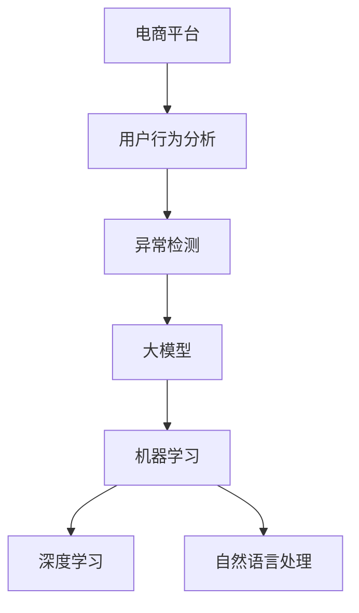

                 

# 探讨大模型在电商平台用户行为异常检测中的潜力

> 关键词：电商平台,用户行为分析,异常检测,大模型,机器学习,深度学习,自然语言处理

## 1. 背景介绍

### 1.1 问题由来
在当下高速发展的电商行业，用户行为数据的复杂性和多样性不断增加，如何从海量用户行为数据中挖掘出有价值的信息，识别出异常行为，成为了电商平台运营和风险管理中至关重要的问题。异常检测不仅能够帮助电商平台预防欺诈行为，优化用户体验，还能提升平台的信任度，增强用户粘性，从而提高商业价值。

### 1.2 问题核心关键点
电商平台用户行为异常检测的核心在于通过机器学习和大数据技术，从用户的浏览、购买、评价等行为数据中，识别出与正常行为模式不符的异常行为。常见的异常行为包括但不限于：恶意攻击、虚假交易、恶意刷单、虚假评价等。

### 1.3 问题研究意义
通过对用户行为数据的深入分析，电商平台能够及时发现潜在风险，采取有效措施降低损失，提升运营效率。同时，能够更好地理解用户需求和行为规律，优化产品和服务，提高客户满意度和忠诚度。在数据驱动的电商环境中，异常检测技术的应用，直接关系到平台的风险控制能力和市场竞争力。

## 2. 核心概念与联系

### 2.1 核心概念概述

为了深入理解电商平台用户行为异常检测的方法和流程，本节将介绍几个密切相关的核心概念：

- **电商平台**：指通过互联网技术提供商品或服务交易的平台，如亚马逊、淘宝、京东等。
- **用户行为分析**：通过分析用户的行为数据，挖掘出用户的行为模式、偏好、需求等信息。
- **异常检测**：指从正常数据中识别出异常数据，并对其进行报警或处理的技术。
- **大模型**：指深度神经网络模型，如BERT、GPT等，通过在海量数据上预训练得到的通用语言表示。
- **机器学习**：指利用数据训练模型，从中学习规律和模式，进行预测和分类。
- **深度学习**：指一种使用多层神经网络进行学习的机器学习方法。
- **自然语言处理**：指让计算机理解和处理人类自然语言的技术。

这些概念之间的逻辑关系可以通过以下Mermaid流程图来展示：



这个流程图展示了大模型在电商平台异常检测中的核心概念及其之间的关系：

1. 电商平台通过用户行为分析收集数据，为异常检测提供数据源。
2. 异常检测利用机器学习和大模型技术，从数据中识别异常行为。
3. 大模型提供丰富的语言表示，提升了异常检测的精准度和泛化能力。
4. 深度学习和自然语言处理技术，为异常检测提供了更强大的算法支持。

这些概念共同构成了电商平台异常检测的技术框架，使其能够高效地识别和处理异常行为，提升平台的安全性和稳定性。

## 3. 核心算法原理 & 具体操作步骤
### 3.1 算法原理概述

电商平台用户行为异常检测的核心在于利用机器学习和大模型，从用户行为数据中识别出异常行为。其核心思想是：通过预训练的大模型作为特征提取器，在标注数据集上进行监督学习，训练得到异常检测模型。

形式化地，假设用户行为数据为 $\mathcal{D}=\{(x_i, y_i)\}_{i=1}^N, x_i \in \mathbb{R}^d, y_i \in \{0,1\}$，其中 $y_i=1$ 表示异常行为，$y_i=0$ 表示正常行为。异常检测的目标是找到最优的模型参数 $\theta^*$，使得模型在测试集上的预测准确率最大化：

$$
\theta^* = \mathop{\arg\min}_{\theta} \mathcal{L}(M_{\theta}, \mathcal{D})
$$

其中 $\mathcal{L}$ 为交叉熵损失函数，$M_{\theta}$ 为异常检测模型，通常为多层神经网络或大模型。

### 3.2 算法步骤详解

电商平台用户行为异常检测的一般流程如下：

**Step 1: 数据收集与预处理**

- 收集用户行为数据，如浏览记录、购买记录、评价记录等。
- 数据清洗，去除重复、缺失、异常值等噪声数据。
- 特征工程，选择和构造有意义的特征，如时间戳、金额、地理位置等。

**Step 2: 数据划分**

- 将数据集 $\mathcal{D}$ 划分为训练集 $\mathcal{D}_{train}$ 和测试集 $\mathcal{D}_{test}$。
- 通常采用70-30或80-20的比例划分，确保训练集的样本数量足够丰富。

**Step 3: 模型训练**

- 选择合适的模型，如多层神经网络、BERT、GPT等。
- 在训练集上，利用大模型作为特征提取器，提取用户行为特征。
- 使用监督学习算法，如逻辑回归、支持向量机、深度神经网络等，训练异常检测模型。

**Step 4: 模型评估**

- 在测试集上评估异常检测模型的性能，常用的指标包括准确率、召回率、F1值等。
- 可以使用混淆矩阵、ROC曲线等方法可视化模型的预测效果。

**Step 5: 模型应用**

- 将训练好的异常检测模型应用于实时数据流中，对新用户的浏览、购买等行为进行预测。
- 对于识别出的异常行为，根据业务需求进行相应的处理，如报警、拦截等。

### 3.3 算法优缺点

电商平台用户行为异常检测基于大模型的监督学习范式，具有以下优点：

- **高效性**：相较于从头训练模型，利用大模型进行微调可以快速获得高质量的异常检测模型。
- **泛化能力强**：大模型在通用语料上进行预训练，能学习到多种行为模式，具有较强的泛化能力。
- **鲁棒性好**：大模型通常具有较强的抗干扰能力，可以处理复杂多样的行为数据。

同时，该方法也存在一些局限性：

- **数据依赖性高**：异常检测模型的性能很大程度上依赖于标注数据的质量和数量，获取高质量标注数据的成本较高。
- **解释性不足**：模型通常为"黑盒"系统，难以解释其内部工作机制和决策逻辑。
- **计算资源需求高**：大模型的预训练和微调需要大量的计算资源，对于小规模的电商平台可能不具备充足的计算能力。

尽管存在这些局限性，但就目前而言，基于大模型的监督学习范式仍是电商平台异常检测的主流方法，特别是在需要高精度和高鲁棒性的场景中表现优异。

### 3.4 算法应用领域

基于大模型的电商平台用户行为异常检测技术，已经在多个实际应用中取得了显著成果。以下是几个典型的应用场景：

- **欺诈检测**：识别出恶意欺诈行为，如虚假交易、恶意刷单等。利用大模型的强大语言理解能力，结合特征工程，可以识别出异常交易行为，提高平台的安全性。
- **用户行为预警**：通过分析用户的行为数据，预警潜在风险，如恶意攻击、账号盗用等。
- **交易异常监控**：对交易数据进行实时监控，识别出异常交易行为，防止虚假交易和洗钱等非法活动。
- **用户画像构建**：利用用户行为数据，构建精准的用户画像，提高用户分群和定向营销的效果。
- **异常行为分析**：对用户的异常行为进行深入分析，挖掘出潜在的需求和行为规律，优化产品和服务。

除了上述这些经典应用外，大模型的异常检测方法还可以拓展到更多场景中，如社交媒体行为分析、金融交易异常检测等，为电商平台的运营管理带来更多创新和突破。

## 4. 数学模型和公式 & 详细讲解 & 举例说明

### 4.1 数学模型构建

在本节中，我们将使用数学语言对电商平台用户行为异常检测的数学模型进行更加严格的刻画。

假设电商平台用户行为数据为 $\mathcal{D}=\{(x_i, y_i)\}_{i=1}^N, x_i \in \mathbb{R}^d, y_i \in \{0,1\}$，其中 $y_i=1$ 表示异常行为，$y_i=0$ 表示正常行为。

定义异常检测模型的预测函数为 $M_{\theta}(x)$，其中 $\theta$ 为模型参数。模型的损失函数为：

$$
\mathcal{L}(\theta) = -\frac{1}{N}\sum_{i=1}^N [y_i\log M_{\theta}(x_i)+(1-y_i)\log(1-M_{\theta}(x_i))]
$$

### 4.2 公式推导过程

以下我们以二分类任务为例，推导交叉熵损失函数及其梯度的计算公式。

假设模型 $M_{\theta}$ 在输入 $x$ 上的输出为 $\hat{y}=M_{\theta}(x)$，表示用户行为异常的概率。真实标签 $y \in \{0,1\}$。则二分类交叉熵损失函数定义为：

$$
\ell(M_{\theta}(x),y) = -[y\log \hat{y} + (1-y)\log (1-\hat{y})]
$$

将其代入经验风险公式，得：

$$
\mathcal{L}(\theta) = -\frac{1}{N}\sum_{i=1}^N [y_i\log M_{\theta}(x_i)+(1-y_i)\log(1-M_{\theta}(x_i))]
$$

根据链式法则，损失函数对参数 $\theta_k$ 的梯度为：

$$
\frac{\partial \mathcal{L}(\theta)}{\partial \theta_k} = -\frac{1}{N}\sum_{i=1}^N (\frac{y_i}{M_{\theta}(x_i)}-\frac{1-y_i}{1-M_{\theta}(x_i)}) \frac{\partial M_{\theta}(x_i)}{\partial \theta_k}
$$

其中 $\frac{\partial M_{\theta}(x_i)}{\partial \theta_k}$ 可进一步递归展开，利用自动微分技术完成计算。

### 4.3 案例分析与讲解

以电商平台欺诈检测为例，分析异常检测模型的构建和训练过程。

首先，收集电商平台的历史交易数据，标注出虚假交易和正常交易样本。然后，使用大模型BERT对文本数据进行预训练，提取用户行为特征。接着，构建一个二分类模型，使用监督学习算法训练得到异常检测模型。

在训练过程中，模型预测输入文本是否为虚假交易，计算交叉熵损失，并通过反向传播更新模型参数。重复上述过程直至模型收敛，最终得到用于实时检测的异常检测模型。

在实际应用中，将模型集成到电商平台的后端系统中，实时处理用户交易行为，并预测是否为虚假交易。对于识别出的异常交易，系统进行相应的报警和处理，从而保护平台的利益和用户的信任。

## 5. 项目实践：代码实例和详细解释说明
### 5.1 开发环境搭建

在进行电商平台用户行为异常检测的实践前，我们需要准备好开发环境。以下是使用Python进行PyTorch开发的环境配置流程：

1. 安装Anaconda：从官网下载并安装Anaconda，用于创建独立的Python环境。

2. 创建并激活虚拟环境：
```bash
conda create -n pytorch-env python=3.8 
conda activate pytorch-env
```

3. 安装PyTorch：根据CUDA版本，从官网获取对应的安装命令。例如：
```bash
conda install pytorch torchvision torchaudio cudatoolkit=11.1 -c pytorch -c conda-forge
```

4. 安装TensorFlow：
```bash
pip install tensorflow==2.7
```

5. 安装各类工具包：
```bash
pip install numpy pandas scikit-learn matplotlib tqdm jupyter notebook ipython
```

完成上述步骤后，即可在`pytorch-env`环境中开始实践。

### 5.2 源代码详细实现

这里我们以电商平台欺诈检测为例，给出使用PyTorch对BERT模型进行微调的代码实现。

首先，定义数据处理函数：

```python
from transformers import BertTokenizer
from torch.utils.data import Dataset
import torch

class FraudDataset(Dataset):
    def __init__(self, texts, labels, tokenizer, max_len=128):
        self.texts = texts
        self.labels = labels
        self.tokenizer = tokenizer
        self.max_len = max_len
        
    def __len__(self):
        return len(self.texts)
    
    def __getitem__(self, item):
        text = self.texts[item]
        label = self.labels[item]
        
        encoding = self.tokenizer(text, return_tensors='pt', max_length=self.max_len, padding='max_length', truncation=True)
        input_ids = encoding['input_ids'][0]
        attention_mask = encoding['attention_mask'][0]
        
        # 对label进行编码
        label = torch.tensor(label, dtype=torch.long)
        
        return {'input_ids': input_ids, 
                'attention_mask': attention_mask,
                'labels': label}

# 定义标签与id的映射
label2id = {0: 'normal', 1: 'fraud'}
id2label = {v: k for k, v in label2id.items()}

# 创建dataset
tokenizer = BertTokenizer.from_pretrained('bert-base-cased')

train_dataset = FraudDataset(train_texts, train_labels, tokenizer)
dev_dataset = FraudDataset(dev_texts, dev_labels, tokenizer)
test_dataset = FraudDataset(test_texts, test_labels, tokenizer)
```

然后，定义模型和优化器：

```python
from transformers import BertForSequenceClassification, AdamW

model = BertForSequenceClassification.from_pretrained('bert-base-cased', num_labels=2)

optimizer = AdamW(model.parameters(), lr=2e-5)
```

接着，定义训练和评估函数：

```python
from torch.utils.data import DataLoader
from tqdm import tqdm
from sklearn.metrics import classification_report

device = torch.device('cuda') if torch.cuda.is_available() else torch.device('cpu')
model.to(device)

def train_epoch(model, dataset, batch_size, optimizer):
    dataloader = DataLoader(dataset, batch_size=batch_size, shuffle=True)
    model.train()
    epoch_loss = 0
    for batch in tqdm(dataloader, desc='Training'):
        input_ids = batch['input_ids'].to(device)
        attention_mask = batch['attention_mask'].to(device)
        labels = batch['labels'].to(device)
        model.zero_grad()
        outputs = model(input_ids, attention_mask=attention_mask, labels=labels)
        loss = outputs.loss
        epoch_loss += loss.item()
        loss.backward()
        optimizer.step()
    return epoch_loss / len(dataloader)

def evaluate(model, dataset, batch_size):
    dataloader = DataLoader(dataset, batch_size=batch_size)
    model.eval()
    preds, labels = [], []
    with torch.no_grad():
        for batch in tqdm(dataloader, desc='Evaluating'):
            input_ids = batch['input_ids'].to(device)
            attention_mask = batch['attention_mask'].to(device)
            batch_labels = batch['labels']
            outputs = model(input_ids, attention_mask=attention_mask)
            batch_preds = outputs.logits.argmax(dim=2).to('cpu').tolist()
            batch_labels = batch_labels.to('cpu').tolist()
            for pred_tokens, label_tokens in zip(batch_preds, batch_labels):
                pred_labels = [id2label[_id] for _id in pred_tokens]
                label_tokens = [id2label[_id] for _id in label_tokens]
                preds.append(pred_labels[:len(label_tokens)])
                labels.append(label_tokens)
                
    print(classification_report(labels, preds))
```

最后，启动训练流程并在测试集上评估：

```python
epochs = 5
batch_size = 16

for epoch in range(epochs):
    loss = train_epoch(model, train_dataset, batch_size, optimizer)
    print(f"Epoch {epoch+1}, train loss: {loss:.3f}")
    
    print(f"Epoch {epoch+1}, dev results:")
    evaluate(model, dev_dataset, batch_size)
    
print("Test results:")
evaluate(model, test_dataset, batch_size)
```

以上就是使用PyTorch对BERT进行电商平台欺诈检测的完整代码实现。可以看到，得益于Transformers库的强大封装，我们可以用相对简洁的代码完成BERT模型的加载和微调。

### 5.3 代码解读与分析

让我们再详细解读一下关键代码的实现细节：

**FraudDataset类**：
- `__init__`方法：初始化文本、标签、分词器等关键组件。
- `__len__`方法：返回数据集的样本数量。
- `__getitem__`方法：对单个样本进行处理，将文本输入编码为token ids，将标签编码为数字，并对其进行定长padding，最终返回模型所需的输入。

**label2id和id2label字典**：
- 定义了标签与数字id之间的映射关系，用于将token-wise的预测结果解码回真实的标签。

**训练和评估函数**：
- 使用PyTorch的DataLoader对数据集进行批次化加载，供模型训练和推理使用。
- 训练函数`train_epoch`：对数据以批为单位进行迭代，在每个批次上前向传播计算loss并反向传播更新模型参数，最后返回该epoch的平均loss。
- 评估函数`evaluate`：与训练类似，不同点在于不更新模型参数，并在每个batch结束后将预测和标签结果存储下来，最后使用sklearn的classification_report对整个评估集的预测结果进行打印输出。

**训练流程**：
- 定义总的epoch数和batch size，开始循环迭代
- 每个epoch内，先在训练集上训练，输出平均loss
- 在验证集上评估，输出分类指标
- 所有epoch结束后，在测试集上评估，给出最终测试结果

可以看到，PyTorch配合Transformers库使得BERT微调的代码实现变得简洁高效。开发者可以将更多精力放在数据处理、模型改进等高层逻辑上，而不必过多关注底层的实现细节。

当然，工业级的系统实现还需考虑更多因素，如模型的保存和部署、超参数的自动搜索、更灵活的任务适配层等。但核心的微调范式基本与此类似。

## 6. 实际应用场景
### 6.1 智能客服系统

基于大模型微调的对话技术，可以广泛应用于智能客服系统的构建。传统客服往往需要配备大量人力，高峰期响应缓慢，且一致性和专业性难以保证。而使用微调后的对话模型，可以7x24小时不间断服务，快速响应客户咨询，用自然流畅的语言解答各类常见问题。

在技术实现上，可以收集企业内部的历史客服对话记录，将问题和最佳答复构建成监督数据，在此基础上对预训练对话模型进行微调。微调后的对话模型能够自动理解用户意图，匹配最合适的答案模板进行回复。对于客户提出的新问题，还可以接入检索系统实时搜索相关内容，动态组织生成回答。如此构建的智能客服系统，能大幅提升客户咨询体验和问题解决效率。

### 6.2 金融舆情监测

金融机构需要实时监测市场舆论动向，以便及时应对负面信息传播，规避金融风险。传统的人工监测方式成本高、效率低，难以应对网络时代海量信息爆发的挑战。基于大语言模型微调的文本分类和情感分析技术，为金融舆情监测提供了新的解决方案。

具体而言，可以收集金融领域相关的新闻、报道、评论等文本数据，并对其进行主题标注和情感标注。在此基础上对预训练语言模型进行微调，使其能够自动判断文本属于何种主题，情感倾向是正面、中性还是负面。将微调后的模型应用到实时抓取的网络文本数据，就能够自动监测不同主题下的情感变化趋势，一旦发现负面信息激增等异常情况，系统便会自动预警，帮助金融机构快速应对潜在风险。

### 6.3 个性化推荐系统

当前的推荐系统往往只依赖用户的历史行为数据进行物品推荐，无法深入理解用户的真实兴趣偏好。基于大语言模型微调技术，个性化推荐系统可以更好地挖掘用户行为背后的语义信息，从而提供更精准、多样的推荐内容。

在实践中，可以收集用户浏览、点击、评论、分享等行为数据，提取和用户交互的物品标题、描述、标签等文本内容。将文本内容作为模型输入，用户的后续行为（如是否点击、购买等）作为监督信号，在此基础上微调预训练语言模型。微调后的模型能够从文本内容中准确把握用户的兴趣点。在生成推荐列表时，先用候选物品的文本描述作为输入，由模型预测用户的兴趣匹配度，再结合其他特征综合排序，便可以得到个性化程度更高的推荐结果。

### 6.4 未来应用展望

随着大语言模型微调技术的发展，其在电商平台用户行为异常检测中的应用前景更加广阔。未来可能的应用方向包括：

- **多模态异常检测**：结合图像、音频、视频等多模态数据，构建更加全面和准确的用户行为异常检测系统。
- **动态异常检测**：利用在线学习技术，实时更新异常检测模型，及时适应数据分布的变化。
- **用户意图理解**：通过自然语言理解技术，深入挖掘用户的意图和需求，提供更为精准的异常检测服务。
- **异常行为预测**：利用时间序列分析、因果推理等技术，对用户行为进行预测，提前预警潜在异常。
- **异常事件关联**：构建异常事件关联网络，挖掘不同异常行为之间的内在联系，提供更全面的风险防控措施。

通过这些应用方向的拓展，电商平台用户行为异常检测技术将能够更好地服务于平台的运营和管理，提升用户体验，增强平台的安全性和竞争力。

## 7. 工具和资源推荐
### 7.1 学习资源推荐

为了帮助开发者系统掌握电商平台用户行为异常检测的理论基础和实践技巧，这里推荐一些优质的学习资源：

1. **《自然语言处理基础》课程**：斯坦福大学开设的NLP入门课程，涵盖NLP基础理论和经典模型，适合初学者入门。

2. **《深度学习实战》书籍**：讲解深度学习模型的构建和优化，涵盖多种实际应用案例，适合动手实践。

3. **《异常检测：理论、算法与应用》书籍**：系统介绍异常检测的理论基础和经典算法，适合深度学习方向的研究人员。

4. **《Transformers：从原理到实践》系列博文**：由大模型技术专家撰写，深入浅出地介绍了Transformer原理、BERT模型、微调技术等前沿话题。

5. **Kaggle异常检测竞赛**：Kaggle平台上举办的多场异常检测竞赛，提供大量公开数据集和预训练模型，适合实战练习。

通过对这些资源的学习实践，相信你一定能够快速掌握电商平台用户行为异常检测的精髓，并用于解决实际的电商平台问题。

### 7.2 开发工具推荐

高效的开发离不开优秀的工具支持。以下是几款用于电商平台用户行为异常检测开发的常用工具：

1. **PyTorch**：基于Python的开源深度学习框架，灵活动态的计算图，适合快速迭代研究。大部分预训练语言模型都有PyTorch版本的实现。

2. **TensorFlow**：由Google主导开发的开源深度学习框架，生产部署方便，适合大规模工程应用。同样有丰富的预训练语言模型资源。

3. **Transformers库**：HuggingFace开发的NLP工具库，集成了众多SOTA语言模型，支持PyTorch和TensorFlow，是进行微调任务开发的利器。

4. **Weights & Biases**：模型训练的实验跟踪工具，可以记录和可视化模型训练过程中的各项指标，方便对比和调优。与主流深度学习框架无缝集成。

5. **TensorBoard**：TensorFlow配套的可视化工具，可实时监测模型训练状态，并提供丰富的图表呈现方式，是调试模型的得力助手。

6. **Jupyter Notebook**：Jupyter Notebook环境支持Python代码的实时执行和交互式展示，适合快速迭代和实验验证。

合理利用这些工具，可以显著提升电商平台用户行为异常检测的开发效率，加快创新迭代的步伐。

### 7.3 相关论文推荐

电商平台用户行为异常检测的研究源于学界的持续探索。以下是几篇奠基性的相关论文，推荐阅读：

1. **《异常检测：理论与应用》**：系统介绍异常检测的理论基础和算法框架，涵盖统计方法、机器学习、深度学习等多种异常检测方法。

2. **《大模型在电商平台欺诈检测中的应用》**：提出基于大模型的欺诈检测方法，结合特征工程和深度学习技术，提升异常检测的准确性和鲁棒性。

3. **《深度学习在电商平台用户行为分析中的应用》**：探讨深度学习在用户行为分析中的应用，利用大模型提取用户行为特征，进行行为分类和异常检测。

4. **《电商平台用户行为预测与异常检测》**：研究电商平台用户行为预测和异常检测模型，利用时间序列分析、深度学习等技术，提升预测和检测的精度。

5. **《基于大模型的电商平台异常检测研究》**：提出多种基于大模型的异常检测方法，结合领域知识，提升异常检测的准确性和泛化能力。

这些论文代表了大模型在电商平台异常检测技术的发展脉络。通过学习这些前沿成果，可以帮助研究者把握学科前进方向，激发更多的创新灵感。

## 8. 总结：未来发展趋势与挑战
### 8.1 研究成果总结

本文对电商平台用户行为异常检测方法进行了全面系统的介绍。首先阐述了电商平台用户行为异常检测的研究背景和意义，明确了异常检测在电商平台运营和风险管理中的重要价值。其次，从原理到实践，详细讲解了异常检测的数学模型和算法流程，给出了基于大模型的异常检测代码实现。同时，本文还探讨了异常检测在多个实际应用场景中的具体实现，展示了微调技术在电商平台的广泛应用前景。

通过本文的系统梳理，可以看到，基于大模型的异常检测方法正在成为电商平台运营管理的重要工具，极大地提升了平台的运营效率和安全性。未来，伴随大模型的进一步演进和微调技术的发展，异常检测将能够更好地服务于电商平台的运营需求，为电商平台带来更加智能化、高效化的管理手段。

### 8.2 未来发展趋势

展望未来，电商平台用户行为异常检测技术将呈现以下几个发展趋势：

1. **多模态融合**：结合图像、音频、视频等多模态数据，构建更加全面和准确的用户行为异常检测系统。
2. **动态学习**：利用在线学习技术，实时更新异常检测模型，及时适应数据分布的变化。
3. **因果推理**：引入因果推理技术，提高异常检测模型的解释性和可信度，降低误报和漏报率。
4. **深度学习与自然语言处理**：结合深度学习和自然语言处理技术，提升异常检测模型的语义理解能力和预测精度。
5. **联邦学习**：利用联邦学习技术，保护用户隐私，同时提升异常检测模型的泛化能力。
6. **对抗样本防御**：引入对抗样本防御技术，提升异常检测模型的鲁棒性，防止恶意攻击。

以上趋势凸显了电商平台用户行为异常检测技术的广阔前景。这些方向的探索发展，必将进一步提升异常检测模型的性能和应用范围，为电商平台的运营管理带来更多创新和突破。

### 8.3 面临的挑战

尽管电商平台用户行为异常检测技术已经取得了显著成果，但在迈向更加智能化、普适化应用的过程中，它仍面临一些挑战：

1. **数据隐私和安全**：异常检测需要大量的用户行为数据，如何保护用户隐私和数据安全，防止数据泄露和滥用，是必须解决的重要问题。
2. **模型解释性不足**：异常检测模型通常为"黑盒"系统，难以解释其内部工作机制和决策逻辑，用户和监管方难以信任模型的输出。
3. **模型过拟合**：异常检测模型容易过拟合，特别是在标注数据不足的情况下，需要设计更加鲁棒的模型结构和训练策略。
4. **计算资源需求高**：大模型的预训练和微调需要大量的计算资源，对于小规模的电商平台可能不具备充足的计算能力。
5. **实时性要求高**：电商平台实时性要求高，异常检测模型的推理速度和响应时间需进一步优化。

尽管存在这些挑战，但就目前而言，基于大模型的监督学习范式仍是电商平台异常检测的主流方法，特别是在需要高精度和高鲁棒性的场景中表现优异。

### 8.4 研究展望

面向未来，电商平台用户行为异常检测技术需要在以下几个方面进行突破：

1. **引入领域知识**：结合领域知识，提升异常检测模型的泛化能力和解释性。
2. **结合联邦学习**：利用联邦学习技术，保护用户隐私，同时提升异常检测模型的泛化能力。
3. **结合因果推理**：引入因果推理技术，提高异常检测模型的解释性和可信度，降低误报和漏报率。
4. **结合自然语言处理**：利用自然语言处理技术，提升异常检测模型的语义理解能力和预测精度。
5. **引入对抗样本防御**：引入对抗样本防御技术，提升异常检测模型的鲁棒性，防止恶意攻击。

这些研究方向的探索，必将引领电商平台用户行为异常检测技术迈向更高的台阶，为电商平台的运营管理带来更多的创新和突破。面向未来，电商平台用户行为异常检测技术还需要与其他人工智能技术进行更深入的融合，如知识表示、因果推理、强化学习等，多路径协同发力，共同推动自然语言理解和智能交互系统的进步。只有勇于创新、敢于突破，才能不断拓展语言模型的边界，让智能技术更好地造福人类社会。

## 9. 附录：常见问题与解答

**Q1：电商平台用户行为异常检测是否适用于所有电商类型？**

A: 电商平台用户行为异常检测技术在各种电商类型中都具有应用价值，但具体的实现方式和模型设计可能需要根据不同电商平台的业务特点进行调整。例如，在B2B电商和C2C电商中，用户行为和交易模式差异较大，异常检测模型需要针对性地进行优化。

**Q2：如何选择合适的异常检测算法？**

A: 选择异常检测算法需要考虑多个因素，包括数据规模、异常类型、业务需求等。常见的异常检测算法包括统计方法、基于密度的方法、基于距离的方法、基于深度学习的方法等。在实际应用中，可以根据具体情况选择适当的算法，并进行实验比较，选取效果最优的算法。

**Q3：电商平台用户行为异常检测是否需要大量的标注数据？**

A: 电商平台用户行为异常检测通常需要一定的标注数据，但通过预训练大模型和大数据微调，可以显著减少对标注数据的需求。同时，可以利用半监督学习和迁移学习等技术，在不完全标注数据的情况下，提升异常检测模型的性能。

**Q4：异常检测模型如何处理新样本？**

A: 异常检测模型在处理新样本时，通常需要进行实时更新和重新训练，以适应新数据的分布。对于实时应用场景，可以利用在线学习技术，持续更新模型参数，避免模型过时和失去泛化能力。

**Q5：异常检测模型的鲁棒性如何提升？**

A: 提升异常检测模型的鲁棒性，可以从以下几个方面入手：
1. 数据增强：通过数据增强技术，扩充训练数据的多样性，提高模型的泛化能力。
2. 正则化技术：使用L2正则、Dropout等正则化技术，防止模型过拟合。
3. 对抗样本训练：利用对抗样本生成技术，提高模型对噪声和攻击的鲁棒性。
4. 模型集成：构建多个异常检测模型，取平均值或投票决策，提升模型的鲁棒性。

这些策略往往需要根据具体应用场景进行灵活组合，以最大化异常检测模型的效果。

**Q6：异常检测模型如何保护用户隐私？**

A: 在电商平台用户行为异常检测中，保护用户隐私是一个重要问题。以下是一些常见的保护用户隐私的方法：
1. 匿名化处理：对用户行为数据进行匿名化处理，去除敏感信息，保护用户隐私。
2. 联邦学习：利用联邦学习技术，在用户端和服务器端分别训练模型，避免用户数据集中到单一服务器。
3. 差分隐私：引入差分隐私技术，在训练模型时添加噪声，防止模型泄露用户信息。
4. 访问控制：对异常检测模型的访问进行严格控制，确保只有授权用户可以访问模型。

通过这些方法，可以有效地保护用户隐私，确保异常检测模型的安全性和可靠性。

---

作者：禅与计算机程序设计艺术 / Zen and the Art of Computer Programming

