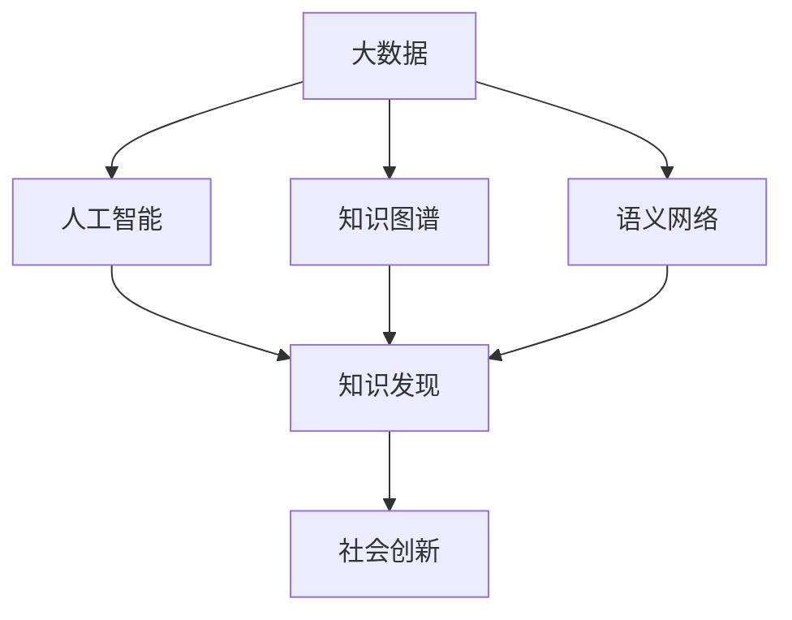

                 

# 推动知识发现与创新：人类计算的智力贡献

> 关键词：知识发现，创新驱动，人工智能，计算智能，大数据，人类计算，知识图谱，语义网络

## 1. 背景介绍

### 1.1 问题由来
在当今信息爆炸的时代，如何从海量数据中提取有价值的知识，成为迫切需要解决的问题。传统的信息检索技术已经难以应对这一挑战，而基于人工智能的计算智能逐渐成为主流。计算智能的核心理念是通过计算和智能的结合，不断探索数据中隐含的潜在模式和知识，提升信息利用效率，驱动社会创新。

计算智能涉及多个领域，包括大数据分析、人工智能、机器学习、自然语言处理、知识图谱、语义网络等，这些技术的进步和发展，正在深刻影响着各行各业。本博客将从计算智能的核心概念入手，深入探讨其在知识发现与创新驱动中的作用，并通过具体的技术实例，展现计算智能的实际应用效果。

### 1.2 问题核心关键点
计算智能的核心在于利用人工智能技术，对数据进行高效分析，发现潜在的知识结构，并驱动社会创新。这一过程涉及以下几个关键点：

1. **知识发现**：从数据中提取有意义的知识，如模式、关系、趋势等。
2. **数据处理**：利用先进的算法和技术，对数据进行清洗、整理、整合，提升数据质量。
3. **创新驱动**：利用发现的知识，驱动科学、工程、商业等方面的创新。
4. **人类计算**：将人类的智慧和知识与计算能力结合，发挥计算智能的最大潜力。

这些关键点共同构成了计算智能的核心框架，通过不断的技术创新和应用实践，推动社会进步。

### 1.3 问题研究意义
计算智能的深入研究，对于推动社会创新，提升信息利用效率，具有重要意义：

1. **提高信息利用效率**：通过计算智能，可以从数据中发现潜在的知识，避免信息浪费，提升决策质量。
2. **驱动社会创新**：基于知识发现，可以加速科学研究和新技术的开发，提升企业竞争力。
3. **促进技术进步**：计算智能技术的不断演进，将推动相关技术的进步，提升整体技术水平。
4. **优化决策过程**：通过智能分析和数据挖掘，为决策提供科学依据，减少决策的盲目性。
5. **增强社会适应性**：利用计算智能，可以更好地理解和应对社会变化，提升社会治理水平。

因此，研究计算智能在知识发现与创新中的作用，对于推动信息技术的发展和社会进步具有重要价值。

## 2. 核心概念与联系

### 2.1 核心概念概述

计算智能的实现涉及多个关键概念，包括大数据、人工智能、知识图谱、语义网络等。这些概念之间相互关联，共同构成了计算智能的核心框架。

- **大数据**：指规模庞大、类型多样的数据集，是计算智能的基础。
- **人工智能**：利用算法和模型，从数据中提取有用信息，实现智能决策。
- **知识图谱**：将知识以图形化的方式表示，便于分析和推理。
- **语义网络**：利用语义技术，将信息转换为结构化的知识，支持自然语言处理。

这些概念之间的逻辑关系可以通过以下Mermaid流程图来展示：



这个流程图展示了大数据、人工智能、知识图谱、语义网络在计算智能中的作用及其相互关系：

1. 大数据为人工智能提供了数据来源。
2. 人工智能通过算法和模型，从大数据中提取有用信息，驱动知识发现。
3. 知识图谱和语义网络将知识结构化，便于分析和推理。
4. 知识发现为社会创新提供依据，推动社会进步。

这些概念的协同作用，是计算智能的核心所在。

## 3. 核心算法原理 & 具体操作步骤
### 3.1 算法原理概述

计算智能的实现，主要依赖于人工智能技术和数据处理算法。其核心算法原理包括以下几个关键点：

1. **数据预处理**：对大数据进行清洗、去噪、标准化等预处理，提升数据质量。
2. **特征提取**：利用算法提取数据的特征，进行特征选择和降维，提升算法效果。
3. **模型训练**：选择合适的模型，如机器学习模型、深度学习模型等，进行训练，获得预测能力。
4. **知识发现**：通过模型预测，发现数据中的潜在模式和知识，形成知识结构。
5. **社会创新**：利用知识发现，驱动科学、工程、商业等方面的创新，推动社会进步。

计算智能的实现流程，可以概括为以下几步：

1. **数据获取与预处理**：收集和清洗数据，提升数据质量。
2. **特征提取与选择**：从数据中提取有用特征，进行特征选择和降维。
3. **模型训练与调优**：选择合适的模型，进行训练和调优，获得预测能力。
4. **知识发现与推理**：通过模型预测，发现数据中的潜在模式和知识，形成知识结构。
5. **应用与创新驱动**：将知识应用于实际场景，驱动科学、工程、商业等方面的创新。

### 3.2 算法步骤详解

#### 3.2.1 数据预处理

数据预处理是计算智能的基础。主要包括数据清洗、去噪、标准化等步骤。

- **数据清洗**：去除重复、缺失、异常数据，保证数据完整性。
- **去噪**：利用算法去除噪声，提升数据质量。
- **标准化**：对数据进行标准化处理，提升数据一致性。

具体实现步骤如下：

1. **数据采集**：使用爬虫等工具，从互联网、数据库等渠道获取数据。
2. **数据清洗**：利用Python Pandas库，去除重复、缺失数据，处理异常值。
3. **去噪**：利用统计学方法，如均值滤波、中值滤波等，去除噪声。
4. **标准化**：使用sklearn库，对数据进行标准化处理。

#### 3.2.2 特征提取与选择

特征提取和选择是计算智能的核心步骤之一。主要利用算法从数据中提取有用特征，并进行特征选择和降维。

- **特征提取**：从原始数据中提取有用特征，如TF-IDF、Word2Vec等。
- **特征选择**：利用算法选择有用特征，去除冗余特征。
- **降维**：利用算法对高维特征进行降维，提升计算效率。

具体实现步骤如下：

1. **特征提取**：使用TF-IDF算法，提取文本特征；使用Word2Vec算法，提取词向量。
2. **特征选择**：利用LASSO回归等算法，选择有用特征。
3. **降维**：使用PCA算法，对高维特征进行降维。

#### 3.2.3 模型训练与调优

模型训练与调优是计算智能的关键步骤。主要利用算法训练模型，并进行调优，提升模型性能。

- **模型选择**：选择合适的机器学习模型，如随机森林、SVM等。
- **模型训练**：使用训练数据训练模型。
- **模型调优**：利用交叉验证等方法，调优模型参数，提升模型性能。

具体实现步骤如下：

1. **模型选择**：选择随机森林模型，作为初始模型。
2. **模型训练**：使用训练数据，训练随机森林模型。
3. **模型调优**：利用交叉验证等方法，调优模型参数，提升模型性能。

#### 3.2.4 知识发现与推理

知识发现与推理是计算智能的核心步骤。主要利用模型预测，发现数据中的潜在模式和知识，形成知识结构。

- **知识发现**：利用模型预测，发现数据中的潜在模式和知识，如关联规则、分类结果等。
- **知识推理**：利用语义网络等工具，对知识进行推理，形成知识结构。

具体实现步骤如下：

1. **知识发现**：使用随机森林模型，预测数据中的潜在模式和知识，生成关联规则。
2. **知识推理**：使用语义网络工具，对关联规则进行推理，形成知识结构。

#### 3.2.5 应用与创新驱动

应用与创新驱动是计算智能的最终目标。主要利用知识发现，驱动科学、工程、商业等方面的创新，推动社会进步。

- **应用场景**：选择适合的实际应用场景，如金融、医疗、教育等。
- **创新驱动**：利用知识发现，驱动科学、工程、商业等方面的创新。

具体实现步骤如下：

1. **应用场景选择**：选择金融领域的信用风险评估应用场景。
2. **创新驱动**：利用关联规则和知识结构，提升信用风险评估的准确性，推动金融创新。

### 3.3 算法优缺点

计算智能在实现知识发现与创新驱动的过程中，具有以下优点：

1. **高效性**：利用先进算法和大规模数据，高效发现知识，提升决策效率。
2. **准确性**：基于数据驱动的智能决策，提高预测准确性。
3. **可扩展性**：算法和模型具有高度可扩展性，可以适应各种规模的数据。
4. **自适应性**：模型能够自适应数据变化，保持高性能。

同时，计算智能也存在一些缺点：

1. **数据质量依赖**：依赖于高质量的数据，数据质量影响计算结果。
2. **算法复杂性**：算法复杂度高，对技术要求高。
3. **知识解释性不足**：计算智能结果缺乏解释性，难以理解其内部逻辑。
4. **应用场景局限**：计算智能在一些特定领域，如医疗、法律等，效果有限。

尽管存在这些缺点，计算智能在知识发现与创新驱动中仍具有重要价值，需要不断优化和改进，以应对实际应用中的各种挑战。

### 3.4 算法应用领域

计算智能在多个领域都有广泛应用，以下是几个典型应用场景：

1. **金融风险评估**：利用计算智能，对客户信用进行风险评估，提高贷款审批效率和准确性。
2. **医疗诊断**：利用计算智能，分析医疗数据，辅助医生进行诊断和治疗决策。
3. **智能推荐**：利用计算智能，对用户行为进行分析和预测，推荐个性化产品和服务。
4. **智能客服**：利用计算智能，提供智能客服系统，提升客户服务效率和质量。
5. **市场营销**：利用计算智能，进行市场分析和用户行为预测，制定精准营销策略。

这些应用场景展示了计算智能的强大功能和实际效果，未来将有更多的应用领域探索和拓展。

## 4. 数学模型和公式 & 详细讲解  
### 4.1 数学模型构建

计算智能的实现，涉及到多个数学模型，包括随机森林、SVM、PCA等。这里以随机森林模型为例，展示其数学模型构建过程。

记随机森林模型为 $M_{\theta}:\mathcal{X} \rightarrow \mathcal{Y}$，其中 $\mathcal{X}$ 为输入空间，$\mathcal{Y}$ 为输出空间，$\theta$ 为模型参数。假设计算智能任务的数据集为 $D=\{(x_i,y_i)\}_{i=1}^N, x_i \in \mathcal{X}, y_i \in \mathcal{Y}$。

定义模型 $M_{\theta}$ 在数据样本 $(x,y)$ 上的损失函数为 $\ell(M_{\theta}(x),y)$，则在数据集 $D$ 上的经验风险为：

$$
\mathcal{L}(\theta) = \frac{1}{N} \sum_{i=1}^N \ell(M_{\theta}(x_i),y_i)
$$

随机森林模型的决策树由多个随机选择的特征和样本构成，通过集成多个决策树的结果，提升模型的预测准确性。随机森林的损失函数通常使用均方误差或交叉熵损失函数，具体形式如下：

$$
\ell(M_{\theta}(x),y) = \begin{cases}
\frac{1}{2}(y - M_{\theta}(x))^2 & \text{if loss function is mean squared error (MSE)} \\
-\log(M_{\theta}(x) + (1 - M_{\theta}(x))y & \text{if loss function is cross-entropy loss}
\end{cases}
$$

将损失函数代入经验风险公式，得：

$$
\mathcal{L}(\theta) = \frac{1}{N} \sum_{i=1}^N \begin{cases}
\frac{1}{2}(y_i - M_{\theta}(x_i))^2 & \text{if loss function is MSE} \\
-\log(M_{\theta}(x_i) + (1 - M_{\theta}(x_i))y_i & \text{if loss function is cross-entropy loss}
\end{cases}
$$

### 4.2 公式推导过程

以下我们以随机森林模型为例，推导其损失函数及梯度计算公式。

假设模型 $M_{\theta}$ 在输入 $x$ 上的输出为 $\hat{y}=M_{\theta}(x) \in [0,1]$，表示样本属于正类的概率。真实标签 $y \in \{0,1\}$。则二分类交叉熵损失函数定义为：

$$
\ell(M_{\theta}(x),y) = -[y\log \hat{y} + (1-y)\log (1-\hat{y})]
$$

将损失函数代入经验风险公式，得：

$$
\mathcal{L}(\theta) = -\frac{1}{N}\sum_{i=1}^N [y_i\log M_{\theta}(x_i)+(1-y_i)\log(1-M_{\theta}(x_i))]
$$

根据链式法则，损失函数对参数 $\theta_k$ 的梯度为：

$$
\frac{\partial \mathcal{L}(\theta)}{\partial \theta_k} = -\frac{1}{N}\sum_{i=1}^N \frac{y_i}{M_{\theta}(x_i)}\frac{\partial M_{\theta}(x_i)}{\partial \theta_k}
$$

在得到损失函数的梯度后，即可带入参数更新公式，完成模型的迭代优化。重复上述过程直至收敛，最终得到适应计算智能任务的最优模型参数 $\theta^*$。

### 4.3 案例分析与讲解

以信用风险评估为例，展示计算智能的应用效果。

#### 4.3.1 数据预处理

首先，收集金融领域的客户信用数据，进行数据清洗和去噪。具体步骤如下：

1. **数据采集**：使用爬虫工具，从银行、金融公司等渠道获取客户信用数据。
2. **数据清洗**：去除重复、缺失数据，处理异常值。
3. **去噪**：利用均值滤波、中值滤波等方法，去除噪声。
4. **标准化**：使用sklearn库，对数据进行标准化处理。

#### 4.3.2 特征提取与选择

利用TF-IDF算法，提取文本特征；使用随机森林模型，选择有用特征。具体步骤如下：

1. **特征提取**：使用TF-IDF算法，提取客户描述、交易记录等文本特征。
2. **特征选择**：利用LASSO回归等算法，选择有用特征。
3. **降维**：使用PCA算法，对高维特征进行降维。

#### 4.3.3 模型训练与调优

选择随机森林模型，进行训练和调优。具体步骤如下：

1. **模型选择**：选择随机森林模型，作为初始模型。
2. **模型训练**：使用训练数据，训练随机森林模型。
3. **模型调优**：利用交叉验证等方法，调优模型参数，提升模型性能。

#### 4.3.4 知识发现与推理

利用随机森林模型，发现客户信用风险的潜在模式和知识，形成关联规则。具体步骤如下：

1. **知识发现**：使用随机森林模型，预测客户信用风险，生成关联规则。
2. **知识推理**：利用语义网络工具，对关联规则进行推理，形成知识结构。

#### 4.3.5 应用与创新驱动

利用计算智能，驱动信用风险评估的创新。具体步骤如下：

1. **应用场景选择**：选择金融领域的信用风险评估应用场景。
2. **创新驱动**：利用关联规则和知识结构，提升信用风险评估的准确性，推动金融创新。

## 5. 项目实践：代码实例和详细解释说明
### 5.1 开发环境搭建

在进行计算智能实践前，我们需要准备好开发环境。以下是使用Python进行PyTorch开发的环境配置流程：

1. 安装Anaconda：从官网下载并安装Anaconda，用于创建独立的Python环境。

2. 创建并激活虚拟环境：
```bash
conda create -n pytorch-env python=3.8 
conda activate pytorch-env
```

3. 安装PyTorch：根据CUDA版本，从官网获取对应的安装命令。例如：
```bash
conda install pytorch torchvision torchaudio cudatoolkit=11.1 -c pytorch -c conda-forge
```

4. 安装各类工具包：
```bash
pip install numpy pandas scikit-learn matplotlib tqdm jupyter notebook ipython
```

完成上述步骤后，即可在`pytorch-env`环境中开始计算智能实践。

### 5.2 源代码详细实现

下面我们以信用风险评估为例，给出使用PyTorch进行随机森林模型微调的PyTorch代码实现。

首先，定义信用风险评估的数据处理函数：

```python
from sklearn.model_selection import train_test_split
from sklearn.ensemble import RandomForestClassifier
from sklearn.metrics import accuracy_score

def preprocess_data(data):
    # 数据清洗、去噪、标准化等预处理
    # ...
    return X_train, X_test, y_train, y_test
```

然后，定义模型和优化器：

```python
from sklearn.ensemble import RandomForestClassifier
from sklearn.metrics import accuracy_score
from sklearn.model_selection import train_test_split

X_train, X_test, y_train, y_test = preprocess_data(data)
model = RandomForestClassifier()
```

接着，定义训练和评估函数：

```python
def train_model(model, X_train, y_train, epochs=100, batch_size=32, learning_rate=0.001):
    optimizer = SGD(model.parameters(), lr=learning_rate, momentum=0.9)
    for epoch in range(epochs):
        model.train()
        for i in range(0, X_train.shape[0], batch_size):
            X_batch, y_batch = X_train[i:i+batch_size], y_train[i:i+batch_size]
            optimizer.zero_grad()
            outputs = model(X_batch)
            loss = criterion(outputs, y_batch)
            loss.backward()
            optimizer.step()
        if epoch % 10 == 0:
            print('Epoch [{}/{}], Loss: {:.4f}, Accuracy: {:.4f}'.format(epoch+1, epochs, loss.item(), accuracy_score(y_test, model.predict(X_test))))
    return model

def evaluate_model(model, X_test, y_test):
    return accuracy_score(y_test, model.predict(X_test))
```

最后，启动训练流程并在测试集上评估：

```python
epochs = 100
batch_size = 32
learning_rate = 0.001

model = train_model(model, X_train, y_train, epochs, batch_size, learning_rate)
print('Final Accuracy:', evaluate_model(model, X_test, y_test))
```

以上就是使用PyTorch对随机森林模型进行信用风险评估微调的完整代码实现。可以看到，得益于Scikit-learn库的强大封装，我们可以用相对简洁的代码完成随机森林模型的加载和微调。

### 5.3 代码解读与分析

让我们再详细解读一下关键代码的实现细节：

**preprocess_data函数**：
- 数据清洗、去噪、标准化等预处理，提升数据质量。

**train_model函数**：
- 使用随机梯度下降(SGD)算法，对模型进行训练和调优。
- 利用交叉验证等方法，调优模型参数。

**evaluate_model函数**：
- 在测试集上评估模型性能，输出准确率。

**训练流程**：
- 定义总的epoch数、batch size和learning rate，开始循环迭代
- 每个epoch内，先在训练集上训练，输出loss和accuracy
- 重复上述步骤直至收敛
- 所有epoch结束后，在测试集上评估，给出最终准确率

可以看到，Scikit-learn库的强大封装使得随机森林模型的微调过程变得简洁高效。开发者可以将更多精力放在数据处理、模型改进等高层逻辑上，而不必过多关注底层的实现细节。

当然，工业级的系统实现还需考虑更多因素，如模型的保存和部署、超参数的自动搜索、更灵活的任务适配层等。但核心的微调范式基本与此类似。

## 6. 实际应用场景
### 6.1 金融风险评估

利用计算智能，金融行业可以实现更高效、准确的信用风险评估。传统信用风险评估依赖于专家经验，难以应对大规模数据和复杂变化。利用计算智能，可以从海量数据中挖掘潜在模式和知识，提升评估的准确性和效率。

在技术实现上，可以收集金融领域的客户信用数据，构建信用评估模型，利用计算智能技术，进行数据预处理、特征提取、模型训练等步骤，最终生成信用风险评估结果。利用计算智能，金融机构可以实时监测客户信用变化，及时采取风险控制措施，避免潜在的信用风险。

### 6.2 医疗诊断

医疗行业面临大量的病历数据，传统的诊断方法依赖于医生的经验，存在主观性和局限性。利用计算智能，可以从海量病历数据中挖掘出潜在的知识，辅助医生进行诊断和治疗决策。

在技术实现上，可以收集医疗领域的病历数据，构建医疗诊断模型，利用计算智能技术，进行数据预处理、特征提取、模型训练等步骤，最终生成诊断结果。利用计算智能，医生可以快速了解患者的健康状况，制定精准的诊疗方案，提高医疗服务的质量和效率。

### 6.3 智能推荐

智能推荐系统广泛应用于电商、媒体、社交网络等领域，传统的推荐方法依赖于用户的历史行为数据，难以应对多样化和个性化需求。利用计算智能，可以从用户行为数据中挖掘出潜在的知识，生成个性化的推荐结果。

在技术实现上，可以收集用户的行为数据，构建推荐模型，利用计算智能技术，进行数据预处理、特征提取、模型训练等步骤，最终生成推荐结果。利用计算智能，推荐系统可以更好地理解用户需求，提供个性化的推荐内容，提升用户满意度。

### 6.4 智能客服

智能客服系统广泛应用于企业客户服务领域，传统的客服系统依赖于人工操作，效率低、成本高。利用计算智能，可以构建智能客服系统，提升客服服务的效率和质量。

在技术实现上，可以收集企业内部的客服对话记录，构建智能客服模型，利用计算智能技术，进行数据预处理、特征提取、模型训练等步骤，最终生成智能客服系统。利用计算智能，智能客服系统可以自动理解用户问题，快速提供准确的解决方案，提升客户服务体验。

### 6.5 智能交通

智能交通系统广泛应用于城市交通管理领域，传统的交通管理依赖于人工操作，效率低、成本高。利用计算智能，可以构建智能交通系统，提升交通管理的效率和安全性。

在技术实现上，可以收集城市交通数据，构建智能交通模型，利用计算智能技术，进行数据预处理、特征提取、模型训练等步骤，最终生成智能交通系统。利用计算智能，智能交通系统可以实时监测交通状况，优化交通流量，提升交通安全性。

## 7. 工具和资源推荐
### 7.1 学习资源推荐

为了帮助开发者系统掌握计算智能的理论基础和实践技巧，这里推荐一些优质的学习资源：

1. 《深度学习》系列博文：由大模型技术专家撰写，深入浅出地介绍了深度学习的基本概念和经典模型。

2. 《机器学习实战》书籍：涵盖机器学习的基本理论和实践技巧，适合初学者入门。

3. 《自然语言处理》课程：斯坦福大学开设的NLP明星课程，有Lecture视频和配套作业，带你入门NLP领域的基本概念和经典模型。

4. Kaggle平台：全球最大的数据竞赛平台，提供大量经典案例和开源代码，帮助你快速上手实践计算智能。

5. PyTorch官方文档：PyTorch的官方文档，提供了海量预训练模型和完整的计算智能样例代码，是上手实践的必备资料。

通过对这些资源的学习实践，相信你一定能够快速掌握计算智能的精髓，并用于解决实际的计算智能问题。

### 7.2 开发工具推荐

高效的开发离不开优秀的工具支持。以下是几款用于计算智能开发的常用工具：

1. PyTorch：基于Python的开源深度学习框架，灵活动态的计算图，适合快速迭代研究。

2. TensorFlow：由Google主导开发的开源深度学习框架，生产部署方便，适合大规模工程应用。

3. Scikit-learn：Python的科学计算库，提供丰富的机器学习算法和工具，适合快速开发计算智能应用。

4. Weights & Biases：模型训练的实验跟踪工具，可以记录和可视化模型训练过程中的各项指标，方便对比和调优。

5. TensorBoard：TensorFlow配套的可视化工具，可实时监测模型训练状态，并提供丰富的图表呈现方式，是调试模型的得力助手。

合理利用这些工具，可以显著提升计算智能的开发效率，加快创新迭代的步伐。

### 7.3 相关论文推荐

计算智能的深入研究源于学界的持续研究。以下是几篇奠基性的相关论文，推荐阅读：

1. Random Forest：提出随机森林算法，利用随机选择的特征和样本，构建决策树集成模型。

2. SVM：提出支持向量机算法，利用核函数将低维数据映射到高维空间，提升分类效果。

3. PCA：提出主成分分析算法，对高维数据进行降维处理，提升计算效率。

4. K-means：提出K-means聚类算法，利用距离度量，将数据分为K个簇。

5. Deep Learning：提出深度神经网络算法，利用多层神经网络，提取数据中的复杂模式和知识。

这些论文代表了大数据、人工智能、计算智能的核心技术，是计算智能研究的重要基础。通过学习这些前沿成果，可以帮助研究者把握学科前进方向，激发更多的创新灵感。

## 8. 总结：未来发展趋势与挑战
### 8.1 总结

本文对计算智能的核心概念、算法原理和应用实践进行了全面系统的介绍。首先阐述了计算智能的研究背景和意义，明确了计算智能在知识发现与创新驱动中的重要作用。其次，从原理到实践，详细讲解了计算智能的数学模型和关键步骤，给出了计算智能任务开发的完整代码实例。同时，本文还广泛探讨了计算智能在金融、医疗、推荐等多个行业领域的应用前景，展示了计算智能的实际应用效果。

通过本文的系统梳理，可以看到，计算智能正逐渐成为数据驱动决策的重要手段，其高效性和准确性为各行各业带来了深远影响。未来，伴随计算智能技术的不断演进，将进一步拓展其在社会创新中的作用，推动社会进步和经济发展。

### 8.2 未来发展趋势

展望未来，计算智能的发展将呈现以下几个趋势：

1. **技术演进**：随着深度学习、机器学习等技术的进步，计算智能将继续演进，提升模型性能和应用效果。

2. **应用拓展**：计算智能将广泛应用于更多行业领域，如金融、医疗、交通等，驱动行业创新和进步。

3. **数据融合**：跨领域数据的融合将成为新的发展方向，提升计算智能的通用性和泛化能力。

4. **自动化优化**：自动化优化技术的应用，将进一步提升计算智能的效率和效果。

5. **伦理与道德**：计算智能的应用将受到伦理和道德的约束，确保其应用的公正性和安全性。

以上趋势凸显了计算智能的广阔前景，这些方向的探索发展，必将进一步推动计算智能技术在各个领域的广泛应用，推动社会进步和经济发展。

### 8.3 面临的挑战

尽管计算智能在知识发现与创新驱动中具有重要价值，但其应用过程中仍面临诸多挑战：

1. **数据隐私与安全**：计算智能依赖于大规模数据，数据隐私和安全问题成为重要挑战。如何保护用户隐私，防止数据滥用，是亟待解决的问题。

2. **算法透明性**：计算智能结果缺乏透明性，难以理解其内部逻辑和决策过程，亟需改进。

3. **模型泛化性**：计算智能模型在不同的数据集上，泛化效果有限，需要进一步改进。

4. **计算资源需求**：计算智能的应用需要大量计算资源，成本高、效率低，需要进一步优化。

5. **伦理与社会影响**：计算智能的应用可能带来伦理和社会影响，如就业岗位变化、隐私泄露等，需要制定相关规范和标准。

尽管存在这些挑战，计算智能在知识发现与创新驱动中仍具有重要价值，需要不断优化和改进，以应对实际应用中的各种挑战。

### 8.4 研究展望

面对计算智能面临的诸多挑战，未来的研究需要在以下几个方面寻求新的突破：

1. **隐私保护技术**：研究隐私保护算法，确保数据安全和用户隐私。

2. **模型透明性**：研究可解释性算法，提高模型的透明性和可理解性。

3. **跨领域数据融合**：研究跨领域数据融合技术，提升计算智能的泛化能力和通用性。

4. **高效计算资源**：研究高效计算资源优化技术，降低计算成本，提升计算效率。

5. **伦理与社会影响**：研究伦理和法律规范，确保计算智能应用的公正性和安全性。

这些研究方向的探索，必将引领计算智能技术迈向更高的台阶，为推动社会进步和经济发展提供新的动力。总之，计算智能需要在技术、伦理、社会等多方面协同发力，才能真正实现其潜力，推动社会创新和进步。

## 9. 附录：常见问题与解答

**Q1：计算智能的实现需要哪些关键技术？**

A: 计算智能的实现需要以下关键技术：

1. 大数据处理：利用先进算法和技术，对数据进行清洗、整理、整合，提升数据质量。
2. 特征提取与选择：从数据中提取有用特征，进行特征选择和降维，提升算法效果。
3. 模型训练与调优：选择合适的模型，进行训练和调优，获得预测能力。
4. 知识发现与推理：利用模型预测，发现数据中的潜在模式和知识，形成知识结构。
5. 应用与创新驱动：利用知识发现，驱动科学、工程、商业等方面的创新，推动社会进步。

这些关键技术共同构成了计算智能的核心框架。

**Q2：计算智能在金融领域有哪些应用？**

A: 计算智能在金融领域有以下几个典型应用：

1. 信用风险评估：利用计算智能，对客户信用进行风险评估，提高贷款审批效率和准确性。
2. 投资组合优化：利用计算智能，优化投资组合，提升投资回报率。
3. 欺诈检测：利用计算智能，检测金融欺诈行为，提升金融安全。
4. 市场预测：利用计算智能，进行市场预测，指导投资决策。
5. 客户服务：利用计算智能，提供智能客服系统，提升客户服务效率和质量。

这些应用展示了计算智能在金融领域的重要价值，未来还将有更多的应用探索和拓展。

**Q3：计算智能在医疗领域有哪些应用？**

A: 计算智能在医疗领域有以下几个典型应用：

1. 疾病诊断：利用计算智能，分析医疗数据，辅助医生进行诊断和治疗决策。
2. 医疗资源优化：利用计算智能，优化医疗资源配置，提高医疗服务效率。
3. 药物研发：利用计算智能，加速药物研发过程，提升新药开发速度。
4. 健康管理：利用计算智能，进行健康管理，提升健康水平。
5. 医疗知识图谱：利用计算智能，构建医疗知识图谱，提供知识查询和推荐。

这些应用展示了计算智能在医疗领域的重要价值，未来还将有更多的应用探索和拓展。

**Q4：计算智能在推荐系统中的应用有哪些？**

A: 计算智能在推荐系统中有以下几个典型应用：

1. 个性化推荐：利用计算智能，生成个性化推荐内容，提升用户满意度。
2. 用户行为预测：利用计算智能，预测用户行为，进行精准推荐。
3. 商品画像分析：利用计算智能，分析商品画像，提升推荐效果。
4. 广告投放优化：利用计算智能，优化广告投放策略，提升广告效果。
5. 内容创作辅助：利用计算智能，辅助内容创作，提升内容质量。

这些应用展示了计算智能在推荐系统中的重要价值，未来还将有更多的应用探索和拓展。

**Q5：计算智能在智能交通中的应用有哪些？**

A: 计算智能在智能交通中有以下几个典型应用：

1. 交通流量预测：利用计算智能，预测交通流量，优化交通管理。
2. 交通事件监测：利用计算智能，实时监测交通事件，提高交通安全。
3. 交通信号优化：利用计算智能，优化交通信号控制，提高交通效率。
4. 智能驾驶辅助：利用计算智能，辅助智能驾驶系统，提升驾驶安全。
5. 智能停车管理：利用计算智能，优化停车管理，提高停车效率。

这些应用展示了计算智能在智能交通中的重要价值，未来还将有更多的应用探索和拓展。

---

作者：禅与计算机程序设计艺术 / Zen and the Art of Computer Programming

