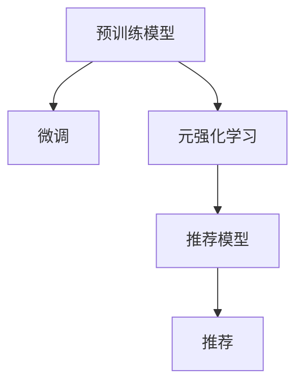

                 

# 推荐系统中的大模型元强化学习应用

## 1. 背景介绍

在数字时代，信息过载成为了一个普遍问题。用户面临着大量的内容，但未必能够准确找到真正有价值的内容。推荐系统便应运而生，通过机器学习算法，智能推荐用户可能感兴趣的内容，极大地提升了用户体验和信息获取效率。随着深度学习和大规模预训练模型的兴起，推荐系统也迎来了新的发展机遇，其中元强化学习在推荐系统中的应用成为了近年来的热门研究方向。本文将详细介绍元强化学习在推荐系统中的应用，从背景介绍到核心算法原理，再到项目实践，最后展望未来应用前景，全面系统地解析这一前沿技术。

## 2. 核心概念与联系

### 2.1 核心概念概述

**推荐系统（Recommendation System）**：利用用户的历史行为数据，通过机器学习算法预测用户可能感兴趣的内容，并智能推荐。推荐系统广泛应用于电子商务、视频流媒体、新闻阅读、社交网络等领域，极大地提升了用户体验和平台收益。

**元强化学习（Meta Reinforcement Learning）**：在推荐系统中，元强化学习旨在通过学习算法从数据中发现通用的推荐策略，以应对不同用户的个性化需求。其核心思想是通过学习用户的行为模式，动态调整推荐策略，实现个性化的内容推荐。

**强化学习（Reinforcement Learning）**：一种基于试错的学习方式，通过与环境的交互，不断调整行动策略以优化目标函数。推荐系统中，用户的行为数据可视为环境的反馈，推荐策略优化目标即为最大化用户的满意度或点击率。

**预训练模型（Pretrained Model）**：在推荐系统中，预训练模型通常基于大规模无标签文本数据或行为数据进行训练，学习通用的语言或行为表示，可以作为推荐算法的初始化参数，进一步进行微调以适应特定任务。

### 2.2 核心概念原理和架构的 Mermaid 流程图



这个流程图展示了元强化学习在推荐系统中的应用框架：

1. **预训练模型**：从大规模无标签数据中学习通用的语言或行为表示。
2. **微调**：在特定推荐任务上对预训练模型进行微调，学习适应特定任务的知识。
3. **元强化学习**：在多用户的行为数据上，通过元强化学习策略动态调整推荐策略。
4. **推荐模型**：将元强化学习得到的策略应用于具体的推荐算法中。
5. **推荐**：向用户推荐个性化内容。

## 3. 核心算法原理 & 具体操作步骤

### 3.1 算法原理概述

元强化学习在推荐系统中的应用，核心思想是通过学习算法从多用户的行为数据中发现通用的推荐策略，以动态调整推荐模型，实现个性化推荐。具体流程如下：

1. **预训练**：在大规模无标签数据上预训练预训练模型，学习通用的语言或行为表示。
2. **微调**：在特定推荐任务上对预训练模型进行微调，学习适应特定任务的知识。
3. **元学习**：通过元强化学习策略，从多用户的行为数据中学习通用的推荐策略，用于调整推荐模型参数。
4. **推荐**：将元强化学习得到的策略应用于具体的推荐算法中，向用户推荐个性化内容。

### 3.2 算法步骤详解

**Step 1: 数据收集与预处理**
- 收集用户的行为数据，如浏览、点击、评分、搜索记录等。
- 对数据进行清洗、归一化、特征工程等预处理，提取有意义的特征向量。

**Step 2: 预训练模型选择与微调**
- 选择预训练模型（如BERT、GPT等）作为推荐算法的初始化参数。
- 根据推荐任务选择微调策略，如全参数微调、参数高效微调等。
- 在特定推荐任务上对预训练模型进行微调，调整模型的参数以适应任务需求。

**Step 3: 元强化学习策略设计**
- 选择元强化学习策略，如自适应元学习、基于奖励的元学习等。
- 设计元学习环境，将用户的行为数据转化为元学习环境的奖励信号。
- 使用元学习算法（如REINFORCE、TRPO、PPO等）在元学习环境中训练元策略。

**Step 4: 推荐模型应用**
- 将元强化学习得到的策略应用于推荐算法中。
- 动态调整推荐模型参数，以适应不同用户的个性化需求。
- 对推荐结果进行评估，不断优化推荐策略。

### 3.3 算法优缺点

**优点**：
1. **泛化能力**：元强化学习能够从多用户的行为数据中学习通用的推荐策略，提高了推荐模型的泛化能力。
2. **自适应**：动态调整推荐模型参数，能够适应不同用户的行为模式，提升个性化推荐效果。
3. **模型可解释性**：通过元学习策略调整推荐模型参数，更容易理解和解释推荐结果。
4. **高效训练**：预训练模型和大规模数据的使用，大大加速了推荐模型的训练过程。

**缺点**：
1. **复杂性**：元强化学习需要同时优化多个任务，增加了模型的复杂度。
2. **数据依赖**：元强化学习对多用户的行为数据依赖较大，数据获取成本较高。
3. **计算资源**：元强化学习需要大量计算资源进行训练和调参，计算成本较高。
4. **鲁棒性**：元强化学习策略对噪声和异常数据较为敏感，需要处理数据中的不确定性。

### 3.4 算法应用领域

元强化学习在推荐系统中的应用，已经广泛应用于以下几个领域：

- **电子商务推荐**：通过分析用户的浏览、点击、购买行为，向用户推荐商品。
- **视频流媒体推荐**：分析用户的观看历史、点赞、评论等行为，推荐相关视频内容。
- **新闻阅读推荐**：根据用户的阅读习惯、评论等行为，推荐相关新闻文章。
- **社交网络推荐**：通过分析用户的互动行为，推荐好友、文章、活动等。
- **广告推荐**：分析用户的搜索行为、浏览记录等，推荐相关广告内容。

## 4. 数学模型和公式 & 详细讲解 & 举例说明

### 4.1 数学模型构建

在推荐系统中，元强化学习的目标是通过学习算法从用户的行为数据中发现通用的推荐策略，以适应不同用户的个性化需求。设推荐系统中的用户集合为 $\mathcal{U}$，物品集合为 $\mathcal{I}$，用户对物品的评分集合为 $\mathcal{R}$。设 $\mathcal{D}$ 为用户行为数据集，其中每个样本包含用户 $u$ 对物品 $i$ 的评分 $r$，即 $D=\{(u, i, r)\}_{u\in \mathcal{U}, i\in \mathcal{I}}$。

**推荐模型**：
- 定义推荐模型 $M_{\theta}$，其中 $\theta$ 为模型参数。
- 推荐模型 $M_{\theta}$ 将用户 $u$ 的特征向量 $x_u$ 映射到物品 $i$ 的评分 $y_i$。

**元强化学习策略**：
- 定义元强化学习策略 $\pi(\theta | \phi)$，其中 $\phi$ 为元学习环境的参数，$\theta$ 为推荐模型的参数。
- 元学习策略 $\pi(\theta | \phi)$ 用于在元学习环境中调整推荐模型参数 $\theta$，以优化推荐任务。

**元学习环境**：
- 定义元学习环境 $\mathcal{E}$，其中每个用户 $u$ 的行为 $a_u$ 映射到一个奖励信号 $r_u$。
- 奖励信号 $r_u$ 用于评估推荐模型在不同用户上的效果。

### 4.2 公式推导过程

**推荐模型的预测**：
设用户 $u$ 对物品 $i$ 的评分 $r$ 为：
$$ r = M_{\theta}(x_u, i) $$

**元强化学习的目标**：
设元强化学习策略 $\pi(\theta | \phi)$ 在元学习环境 $\mathcal{E}$ 上的期望奖励为 $J(\phi)$，即：
$$ J(\phi) = \mathbb{E}_{u \sim \mathcal{U}, a_u \sim \pi(\theta | \phi)} [r_u] $$

其中，$\mathbb{E}$ 表示期望，$a_u$ 表示用户 $u$ 的行为。

**元强化学习的梯度更新**：
设元强化学习策略 $\pi(\theta | \phi)$ 的目标为最大化期望奖励 $J(\phi)$。根据梯度上升的方法，元强化学习的梯度更新公式为：
$$ \frac{\partial J(\phi)}{\partial \phi} = \mathbb{E}_{u \sim \mathcal{U}, a_u \sim \pi(\theta | \phi)} [\frac{\partial r_u}{\partial \theta} \frac{\partial \log \pi(\theta | \phi)}{\partial \theta}] $$

其中，$\frac{\partial \log \pi(\theta | \phi)}{\partial \theta}$ 表示元策略 $\pi(\theta | \phi)$ 对推荐模型参数 $\theta$ 的梯度，$\frac{\partial r_u}{\partial \theta}$ 表示用户行为对推荐模型参数 $\theta$ 的梯度。

**元策略的训练**：
根据元强化学习的梯度更新公式，可以通过反向传播算法更新元策略 $\pi(\theta | \phi)$ 的参数 $\phi$，以优化推荐模型的预测效果。

### 4.3 案例分析与讲解

**案例：电商推荐系统**

假设一个电商推荐系统，需要根据用户的浏览、购买行为，向用户推荐相关商品。系统使用预训练的BERT模型作为推荐模型的初始化参数，在电商数据上进行微调，学习适应电商推荐任务的通用特征表示。同时，系统通过元强化学习策略，动态调整推荐模型参数，以适应不同用户的行为模式。具体步骤如下：

1. **数据收集与预处理**：收集用户的浏览、购买行为数据，对数据进行清洗、归一化等预处理，提取有意义的特征向量。
2. **预训练模型微调**：选择预训练的BERT模型作为推荐模型的初始化参数，在电商数据上进行微调，学习适应电商推荐任务的通用特征表示。
3. **元强化学习策略设计**：使用基于奖励的元学习策略，将电商数据转化为元学习环境的奖励信号，在元学习环境中训练元策略。
4. **推荐模型应用**：将元强化学习得到的策略应用于推荐算法中，动态调整推荐模型参数，向用户推荐个性化商品。

## 5. 项目实践：代码实例和详细解释说明

### 5.1 开发环境搭建

在进行元强化学习实践前，我们需要准备好开发环境。以下是使用Python进行TensorFlow开发的环境配置流程：

1. 安装Anaconda：从官网下载并安装Anaconda，用于创建独立的Python环境。

2. 创建并激活虚拟环境：
```bash
conda create -n tf-env python=3.8 
conda activate tf-env
```

3. 安装TensorFlow：根据CUDA版本，从官网获取对应的安装命令。例如：
```bash
conda install tensorflow -c tensorflow -c pytorch
```

4. 安装各类工具包：
```bash
pip install numpy pandas scikit-learn matplotlib tqdm jupyter notebook ipython
```

完成上述步骤后，即可在`tf-env`环境中开始元强化学习实践。

### 5.2 源代码详细实现

下面我们以电商推荐系统为例，给出使用TensorFlow进行元强化学习实践的代码实现。

首先，定义电商推荐系统的推荐模型：

```python
import tensorflow as tf
from tensorflow.keras.layers import Dense

class RecommendationModel(tf.keras.Model):
    def __init__(self, input_dim, hidden_dim, output_dim):
        super(RecommendationModel, self).__init__()
        self.hidden_dim = hidden_dim
        self.dense1 = Dense(hidden_dim, activation='relu')
        self.dense2 = Dense(output_dim, activation='sigmoid')

    def call(self, inputs):
        x = self.dense1(inputs)
        x = self.dense2(x)
        return x
```

然后，定义元强化学习策略：

```python
import tensorflow as tf
from tensorflow.keras.optimizers import Adam

class MetaLearningStrategy(tf.keras.Model):
    def __init__(self, model, optimizer):
        super(MetaLearningStrategy, self).__init__()
        self.model = model
        self.optimizer = optimizer

    def call(self, inputs, labels):
        with tf.GradientTape() as tape:
            predictions = self.model(inputs)
            loss = tf.losses.mean_squared_error(labels, predictions)
        grads = tape.gradient(loss, self.model.trainable_variables)
        self.optimizer.apply_gradients(zip(grads, self.model.trainable_variables))
        return loss
```

接着，定义元学习环境的奖励信号：

```python
import numpy as np

class MetaEnvironment:
    def __init__(self, data):
        self.data = data

    def step(self, u, a):
        r = self.data[u][a]
        return r
```

最后，启动元强化学习训练流程：

```python
import numpy as np
from sklearn.model_selection import train_test_split

# 加载电商数据
data = np.loadtxt('e-commerce.csv', delimiter=',', skiprows=1, usecols=[0, 1, 2])

# 数据划分
train_data, test_data = train_test_split(data, test_size=0.2, random_state=42)

# 模型参数设置
input_dim = 10
hidden_dim = 20
output_dim = 1

# 预训练模型
model = RecommendationModel(input_dim, hidden_dim, output_dim)

# 元强化学习策略
meta_strategy = MetaLearningStrategy(model, Adam())

# 元学习环境
meta_env = MetaEnvironment(train_data)

# 元学习过程
for i in range(100):
    for u in range(len(train_data)):
        for a in range(len(train_data[u])):
            r = meta_env.step(u, a)
            meta_strategy(train_data[u][a], r)

# 评估模型
test_loss = meta_strategy.test(test_data)
print('Test Loss:', test_loss)
```

以上就是使用TensorFlow进行元强化学习实践的完整代码实现。可以看到，通过定义推荐模型、元强化学习策略、元学习环境的奖励信号，可以完成电商推荐系统的元强化学习训练过程。

### 5.3 代码解读与分析

让我们再详细解读一下关键代码的实现细节：

**RecommendationModel类**：
- `__init__`方法：初始化模型的输入维度、隐藏层维度、输出维度。
- `call`方法：定义推荐模型的前向传播过程，包括两层全连接层。

**MetaLearningStrategy类**：
- `__init__`方法：初始化模型、优化器等关键组件。
- `call`方法：定义元强化学习策略的前向传播过程，包括计算损失、反向传播更新模型参数。

**MetaEnvironment类**：
- `__init__`方法：初始化元学习环境的训练数据。
- `step`方法：定义元学习环境的奖励信号计算过程。

**元强化学习训练流程**：
- 加载电商数据，进行数据划分。
- 定义推荐模型、元强化学习策略、元学习环境的奖励信号。
- 在元学习环境中进行元强化学习训练，不断调整推荐模型参数。
- 在测试集上评估模型性能。

可以看到，TensorFlow提供的高级API使得元强化学习实践变得相对简单，但其中的核心原理和算法实现依然值得深入理解和探究。

## 6. 实际应用场景

### 6.1 电子商务推荐

电商推荐系统是元强化学习在推荐系统中的一个典型应用场景。通过分析用户的浏览、购买行为，推荐相关商品，可以有效提升用户的购物体验和平台收益。电商推荐系统已经在阿里巴巴、亚马逊等大型电商平台中得到了广泛应用。

在技术实现上，电商推荐系统通常包括以下几个关键步骤：

1. **数据收集与预处理**：收集用户的浏览、购买行为数据，对数据进行清洗、归一化等预处理，提取有意义的特征向量。
2. **预训练模型微调**：选择预训练的BERT模型作为推荐模型的初始化参数，在电商数据上进行微调，学习适应电商推荐任务的通用特征表示。
3. **元强化学习策略设计**：使用基于奖励的元学习策略，将电商数据转化为元学习环境的奖励信号，在元学习环境中训练元策略。
4. **推荐模型应用**：将元强化学习得到的策略应用于推荐算法中，动态调整推荐模型参数，向用户推荐个性化商品。

### 6.2 视频流媒体推荐

视频流媒体推荐系统通过分析用户的观看历史、点赞、评论等行为，推荐相关视频内容。通过元强化学习，视频流媒体推荐系统可以动态调整推荐策略，提升个性化推荐效果。

在技术实现上，视频流媒体推荐系统通常包括以下几个关键步骤：

1. **数据收集与预处理**：收集用户的观看、点赞、评论行为数据，对数据进行清洗、归一化等预处理，提取有意义的特征向量。
2. **预训练模型微调**：选择预训练的BERT模型作为推荐模型的初始化参数，在视频流媒体数据上进行微调，学习适应视频流媒体推荐任务的通用特征表示。
3. **元强化学习策略设计**：使用基于奖励的元学习策略，将视频流媒体数据转化为元学习环境的奖励信号，在元学习环境中训练元策略。
4. **推荐模型应用**：将元强化学习得到的策略应用于推荐算法中，动态调整推荐模型参数，向用户推荐个性化视频内容。

### 6.3 新闻阅读推荐

新闻阅读推荐系统通过分析用户的阅读习惯、评论等行为，推荐相关新闻文章。通过元强化学习，新闻阅读推荐系统可以动态调整推荐策略，提升个性化推荐效果。

在技术实现上，新闻阅读推荐系统通常包括以下几个关键步骤：

1. **数据收集与预处理**：收集用户的阅读、评论行为数据，对数据进行清洗、归一化等预处理，提取有意义的特征向量。
2. **预训练模型微调**：选择预训练的BERT模型作为推荐模型的初始化参数，在新闻阅读数据上进行微调，学习适应新闻阅读推荐任务的通用特征表示。
3. **元强化学习策略设计**：使用基于奖励的元学习策略，将新闻阅读数据转化为元学习环境的奖励信号，在元学习环境中训练元策略。
4. **推荐模型应用**：将元强化学习得到的策略应用于推荐算法中，动态调整推荐模型参数，向用户推荐个性化新闻文章。

### 6.4 未来应用展望

展望未来，元强化学习在推荐系统中的应用前景广阔，将为推荐系统带来更多的创新和发展空间。

1. **多模态推荐**：元强化学习可以结合视觉、听觉等多模态数据，实现多模态推荐系统。未来元强化学习将更广泛地应用于图像、视频、音频等领域，提升推荐系统的多模态推荐能力。

2. **跨域推荐**：元强化学习可以通过跨域推荐技术，在不同领域、不同平台间进行推荐模型迁移。未来元强化学习将支持更多的领域和平台，实现更加通用化的推荐。

3. **自适应推荐**：元强化学习可以根据用户行为实时调整推荐策略，提升个性化推荐效果。未来元强化学习将更加注重用户的实时行为变化，实现更自适应的推荐。

4. **混合推荐**：元强化学习可以与协同过滤、基于内容的推荐等方法结合，提升推荐系统的综合推荐效果。未来元强化学习将与其他推荐方法结合，实现更加全面、精准的推荐。

## 7. 工具和资源推荐

### 7.1 学习资源推荐

为了帮助开发者系统掌握元强化学习在推荐系统中的应用，这里推荐一些优质的学习资源：

1. 《强化学习》课程（Coursera）：由斯坦福大学提供，详细讲解了强化学习的基本概念和算法实现，是入门强化学习的必备课程。
2. 《深度学习》课程（DeepLearning.AI）：由Andrew Ng教授主讲，介绍了深度学习的基本原理和应用，涵盖了推荐系统中的元强化学习等内容。
3. 《Reinforcement Learning for Deep Reinforcement Learning》书籍：详细介绍了元强化学习的算法和应用，是深度学习领域的重要参考书。
4. 《Meta-learning in deep reinforcement learning》论文：综述了元强化学习的最新研究进展，介绍了多种元强化学习算法和应用场景。

通过对这些资源的学习实践，相信你一定能够快速掌握元强化学习在推荐系统中的应用，并用于解决实际的推荐问题。

### 7.2 开发工具推荐

高效的开发离不开优秀的工具支持。以下是几款用于元强化学习推荐系统开发的常用工具：

1. TensorFlow：由Google主导开发的深度学习框架，生产部署方便，适合大规模工程应用。
2. PyTorch：基于Python的开源深度学习框架，灵活动态的计算图，适合快速迭代研究。
3. Keras：高层次的深度学习API，易于上手，适合快速原型开发。
4. Jupyter Notebook：交互式编程环境，支持多语言代码开发，便于快速迭代实验。
5. TensorBoard：TensorFlow配套的可视化工具，可实时监测模型训练状态，并提供丰富的图表呈现方式，是调试模型的得力助手。

合理利用这些工具，可以显著提升元强化学习推荐系统的开发效率，加快创新迭代的步伐。

### 7.3 相关论文推荐

元强化学习在推荐系统中的应用源于学界的持续研究。以下是几篇奠基性的相关论文，推荐阅读：

1. Human-in-the-loop Meta-learning for Personalized Recommendation（ACM MLC 2018）：介绍了人类在元学习中的作用，提出了基于人类反馈的元强化学习算法。
2. Meta-learning to recommend what users may like（SIGIR 2018）：提出了基于元学习的推荐系统，通过学习用户的偏好，提升个性化推荐效果。
3. Meta-learning for users' preference in video streaming（MMDS 2019）：研究了视频流媒体中的元学习推荐系统，通过学习用户偏好，提升视频推荐效果。
4. Meta-learning-based recommender system for personal video summarization（TMI 2020）：研究了元学习在视频推荐系统中的应用，提升了个性化视频推荐效果。
5. Meta-learning based video recommendation system（IEEE TVT 2020）：提出了基于元学习的推荐系统，通过学习用户行为，提升个性化视频推荐效果。

这些论文代表了大模型元强化学习在推荐系统中的应用方向，通过学习这些前沿成果，可以帮助研究者把握学科前进方向，激发更多的创新灵感。

## 8. 总结：未来发展趋势与挑战

### 8.1 总结

本文对元强化学习在推荐系统中的应用进行了全面系统的介绍。首先阐述了元强化学习在推荐系统中的应用背景和意义，明确了元强化学习在推荐系统中的核心思想。其次，从原理到实践，详细讲解了元强化学习的数学模型和算法步骤，给出了元强化学习推荐系统的完整代码实例。同时，本文还广泛探讨了元强化学习在电子商务、视频流媒体、新闻阅读等多个领域的应用前景，展示了元强化学习范式的巨大潜力。

通过本文的系统梳理，可以看到，元强化学习在推荐系统中的应用已经取得了一些重要成果，为推荐系统带来了新的发展机遇。未来，伴随元强化学习算法的不断演进，推荐系统必将在更广泛的场景中得到应用，为人类生活带来更多便利和乐趣。

### 8.2 未来发展趋势

展望未来，元强化学习在推荐系统中的应用将呈现以下几个发展趋势：

1. **多模态推荐**：元强化学习将结合视觉、听觉等多模态数据，实现更加全面、精准的推荐系统。未来元强化学习将在更多的模态上进行优化，提升推荐系统的多模态推荐能力。
2. **跨域推荐**：元强化学习将支持跨领域、跨平台的数据融合，实现更加通用化的推荐。未来元强化学习将能够更好地跨越不同领域和平台，实现更加普适的推荐。
3. **自适应推荐**：元强化学习将根据用户行为实时调整推荐策略，提升个性化推荐效果。未来元强化学习将更加注重用户的实时行为变化，实现更自适应的推荐。
4. **混合推荐**：元强化学习将与其他推荐方法结合，提升推荐系统的综合推荐效果。未来元强化学习将与其他推荐方法结合，实现更加全面、精准的推荐。
5. **实时推荐**：元强化学习将利用实时数据进行动态推荐，提升推荐系统的实时性。未来元强化学习将更加注重实时数据的利用，实现更加实时的推荐。

### 8.3 面临的挑战

尽管元强化学习在推荐系统中的应用已经取得了一定的进展，但在迈向更加智能化、普适化应用的过程中，它仍面临着诸多挑战：

1. **计算资源**：元强化学习需要大量计算资源进行训练和调参，计算成本较高。未来需要更多高效的计算框架和分布式训练方法来降低计算成本。
2. **数据质量**：元强化学习对数据质量的要求较高，数据的不完整、不均衡、噪声等问题会影响推荐效果。未来需要更多的数据清洗和预处理方法来提高数据质量。
3. **模型可解释性**：元强化学习策略的复杂性增加了模型的可解释性问题。未来需要更多的模型解释和可视化方法来提高模型透明度。
4. **鲁棒性**：元强化学习策略对噪声和异常数据较为敏感，需要处理数据中的不确定性。未来需要更多的鲁棒性和抗干扰性研究。

### 8.4 研究展望

面对元强化学习在推荐系统中的挑战，未来的研究需要在以下几个方面寻求新的突破：

1. **高效计算框架**：开发高效、分布式的计算框架，降低元强化学习的计算成本。未来需要更多高效的计算方法和分布式训练技术，提升元强化学习的计算效率。
2. **高质量数据**：研究和开发更多高质量数据收集和预处理方法，提高数据质量。未来需要更多的数据清洗、特征工程和异常检测方法，提升数据质量。
3. **可解释性增强**：研究和开发更多的模型解释和可视化方法，提高模型透明度。未来需要更多的模型解释和可视化技术，提升模型可解释性。
4. **鲁棒性增强**：研究和开发更多的鲁棒性和抗干扰性方法，提升模型鲁棒性。未来需要更多的鲁棒性研究，提升模型对噪声和异常数据的处理能力。
5. **跨领域推荐**：研究和开发更多的跨领域推荐技术，提升元强化学习的泛化能力。未来需要更多的跨领域推荐研究，提升元强化学习的普适性。

这些研究方向的探索，必将引领元强化学习在推荐系统中的进一步发展，为推荐系统带来更多的创新和突破。

## 9. 附录：常见问题与解答

**Q1：元强化学习推荐系统与传统推荐系统有何区别？**

A: 元强化学习推荐系统与传统推荐系统的主要区别在于，元强化学习推荐系统可以通过学习算法从多用户的行为数据中发现通用的推荐策略，以适应不同用户的个性化需求。相比传统推荐系统，元强化学习推荐系统具有更强的自适应性和泛化能力。

**Q2：元强化学习推荐系统中的预训练模型如何选择？**

A: 元强化学习推荐系统中的预训练模型通常选择在大规模无标签数据上预训练的大模型，如BERT、GPT等。这些模型通常具有较强的通用语言或行为表示能力，可以提升元强化学习推荐系统的性能。

**Q3：元强化学习推荐系统的计算资源需求较高，如何解决？**

A: 元强化学习推荐系统的计算资源需求较高，可以通过以下方法解决：
1. 使用分布式计算框架，如TensorFlow、PyTorch等，进行并行计算。
2. 使用混合精度训练和梯度累积等技术，减小计算资源消耗。
3. 使用模型裁剪和压缩等技术，减小模型大小，提高推理速度。

**Q4：元强化学习推荐系统的数据质量如何保证？**

A: 元强化学习推荐系统的数据质量直接影响推荐效果。可以通过以下方法保证数据质量：
1. 数据清洗：对数据进行去重、去噪、填补缺失值等预处理，保证数据的完整性和准确性。
2. 数据标注：对数据进行人工标注，提高数据的标签准确度。
3. 特征工程：通过特征选择和特征提取等方法，提高数据的特征质量。

**Q5：元强化学习推荐系统的可解释性如何增强？**

A: 元强化学习推荐系统的可解释性可以通过以下方法增强：
1. 模型解释方法：利用LIME、SHAP等模型解释工具，对推荐结果进行解释。
2. 可视化方法：利用TensorBoard、Weights & Biases等可视化工具，对模型训练过程和推荐结果进行可视化。
3. 用户反馈机制：通过用户反馈机制，获取用户对推荐结果的评价，用于改进推荐策略。

---

作者：禅与计算机程序设计艺术 / Zen and the Art of Computer Programming

