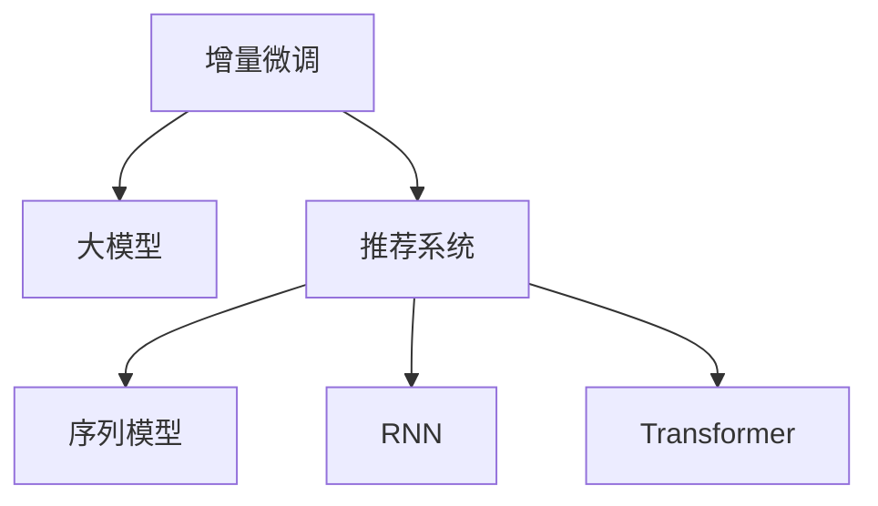

                 

# 推荐系统中的大模型增量微调应用

> 关键词：增量微调、大模型、推荐系统、特征学习、序列模型、循环神经网络、Transformer

## 1. 背景介绍

### 1.1 问题由来
随着人工智能技术的不断进步，推荐系统已成为互联网应用中不可或缺的一部分。推荐系统通过分析用户的历史行为数据，结合商品属性和市场趋势，为用户提供个性化的商品推荐，从而提升用户体验和商家收益。

然而，现有的推荐系统大多基于传统的基于用户的协同过滤和基于物品的协同过滤算法，这些算法在处理大规模数据时面临着计算复杂度高、特征稀疏等问题。近年来，基于深度学习的推荐系统逐渐兴起，显著提升了推荐精度和系统效率。但现有的深度推荐系统仍然存在以下问题：

1. **模型复杂度高**：传统的推荐模型通常需要巨量训练数据，才能达到较好的推荐效果。这要求平台需要投入大量资源来收集和存储用户行为数据，增加了系统成本。
2. **特征扩展难度大**：推荐模型的特征通常依赖于用户行为数据，难以在短时间内添加新的特征。这限制了模型的适应性和灵活性。
3. **推荐效率低**：推荐模型通常需要全量训练，每次新增用户行为数据都需要重新训练模型，导致推荐效率低下。

针对这些问题，增量微调(Incremental Fine-Tuning)技术应运而生。通过在大规模预训练语言模型(如BERT、GPT)的基础上进行增量微调，可以大幅降低模型复杂度，提高模型效率，同时具备更好的适应性和可扩展性。

## 2. 核心概念与联系

### 2.1 核心概念概述

为了更好地理解推荐系统中大模型增量微调技术，本文将介绍几个关键概念：

- **增量微调(Incremental Fine-Tuning, IF-T)**：在已有预训练模型的基础上，通过新添加的少量数据进行微调，以更新模型参数的过程。增量微调可以避免全量训练，节省计算资源，同时提高模型更新速度和效率。

- **大模型(Large Model)**：通常指参数量较大的深度学习模型，如BERT、GPT、T5等。这些模型通过大规模无标签数据预训练，获得了丰富的语言和特征表示能力。

- **推荐系统(Recommendation System)**：通过分析用户行为和商品属性，为用户提供个性化商品推荐的应用系统。推荐系统通常包括协同过滤、基于内容的推荐、混合推荐等方法。

- **序列模型(Sequential Model)**：处理时间序列数据，能够捕捉数据间的动态关系，适用于基于时间的推荐系统。

- **循环神经网络(Recurrent Neural Network, RNN)**：处理序列数据的一种神经网络模型，能够捕捉数据间的序列依赖关系。

- **Transformer**：一种基于自注意力机制的神经网络模型，用于处理序列数据，具有高效、可扩展的优点。

这些核心概念之间的逻辑关系可以通过以下Mermaid流程图来展示：



这个流程图展示了增量微调在大模型推荐系统中的核心作用，以及推荐系统与序列模型、RNN、Transformer之间的联系。

## 3. 核心算法原理 & 具体操作步骤

### 3.1 算法原理概述

增量微调技术的基本思想是：在已有预训练模型的基础上，通过新添加的少量数据进行微调，以更新模型参数。具体而言，假设已有预训练模型为 $M_{\theta}$，其中 $\theta$ 为预训练得到的模型参数。假设新添加的训练数据集为 $D_{new}$，则增量微调的目标是找到新的模型参数 $\hat{\theta}$，使得：

$$
\hat{\theta} = \mathop{\arg\min}_{\theta} \mathcal{L}(M_{\theta}, D_{new})
$$

其中 $\mathcal{L}$ 为针对新数据集 $D_{new}$ 设计的损失函数，用于衡量模型在新数据上的性能。常见的损失函数包括交叉熵损失、均方误差损失等。

增量微调的具体过程如下：

1. 收集新数据 $D_{new}$。
2. 使用新数据对已有模型进行微调，更新模型参数 $\theta$。
3. 在新数据上评估微调后模型的性能，更新模型输出。

增量微调与传统的微调方法（如从头训练）相比，具有以下优点：

- **计算效率高**：新数据量较少时，增量微调可以在短时间内完成，节省计算资源。
- **适应性更强**：模型可以不断学习新数据，适应不断变化的用户行为和市场趋势。
- **参数共享**：预训练模型中的大部分参数可以被保留，仅微调小部分参数，从而减少模型复杂度。

### 3.2 算法步骤详解

以下将详细介绍增量微调的具体操作步骤：

**Step 1: 准备数据集和预训练模型**

- 收集新数据集 $D_{new}$，可以是用户行为数据、商品属性数据等。
- 准备已有预训练模型 $M_{\theta}$，如BERT、GPT等。

**Step 2: 设置微调超参数**

- 选择合适的优化算法及其参数，如 AdamW、SGD 等，设置学习率、批大小、迭代轮数等。
- 设置正则化技术及强度，包括权重衰减、Dropout、Early Stopping 等。
- 确定冻结预训练参数的策略，如仅微调顶层，或全部参数都参与微调。

**Step 3: 执行梯度训练**

- 将新数据 $D_{new}$ 分批次输入模型，前向传播计算损失函数。
- 反向传播计算参数梯度，根据设定的优化算法和学习率更新模型参数。
- 周期性在新数据集上评估模型性能，根据性能指标决定是否触发 Early Stopping。
- 重复上述步骤直至满足预设的迭代轮数或 Early Stopping 条件。

**Step 4: 测试和部署**

- 在新数据集上评估微调后模型 $M_{\hat{\theta}}$ 的性能，对比微调前后的精度提升。
- 使用微调后的模型对新样本进行推理预测，集成到实际的应用系统中。
- 持续收集新的数据，定期重新微调模型，以适应数据分布的变化。

### 3.3 算法优缺点

增量微调技术具有以下优点：

- **计算效率高**：新数据量较少时，增量微调可以在短时间内完成，节省计算资源。
- **适应性更强**：模型可以不断学习新数据，适应不断变化的用户行为和市场趋势。
- **参数共享**：预训练模型中的大部分参数可以被保留，仅微调小部分参数，从而减少模型复杂度。

然而，增量微调也存在以下局限性：

- **数据质量要求高**：新数据的质量直接影响微调效果，需要保证新数据与已有数据分布一致。
- **模型复杂度高**：对于复杂的推荐任务，增量微调仍需要一定的计算资源和时间。
- **过拟合风险**：新数据量较少时，模型容易出现过拟合，影响模型泛化能力。

尽管存在这些局限性，增量微调技术仍然是大规模推荐系统的重要范式。未来相关研究的重点在于如何进一步降低微调对新数据的依赖，提高模型的少样本学习和跨领域迁移能力，同时兼顾可解释性和伦理安全性等因素。

### 3.4 算法应用领域

增量微调技术在大规模推荐系统中具有广泛的应用，适用于各种推荐场景，如商品推荐、内容推荐、广告推荐等。具体而言：

- **商品推荐**：通过收集用户购买行为数据，对商品属性数据进行微调，提升推荐效果。
- **内容推荐**：对用户的浏览、点击、评论等行为数据进行微调，提升内容推荐精准度。
- **广告推荐**：对用户的浏览记录和点击行为进行微调，提高广告投放效果。
- **用户画像**：通过收集用户行为数据，对用户画像进行微调，提升个性化推荐精度。

除了上述这些经典任务外，增量微调技术还被创新性地应用到更多场景中，如基于序列的推荐、多模态推荐、实时推荐等，为推荐系统带来了全新的突破。

## 4. 数学模型和公式 & 详细讲解

### 4.1 数学模型构建

增量微调的核心数学模型可以表示为：

$$
\mathcal{L}_{new}(\theta) = \frac{1}{N_{new}} \sum_{i=1}^{N_{new}} \ell(M_{\theta}(x_i),y_i)
$$

其中 $x_i$ 和 $y_i$ 分别表示新数据集中的输入和标签，$N_{new}$ 表示新数据集的样本数量，$\ell$ 表示损失函数。

增量微调的目标是找到最优参数：

$$
\theta^* = \mathop{\arg\min}_{\theta} \mathcal{L}_{new}(\theta)
$$

在实践中，我们通常使用基于梯度的优化算法（如SGD、Adam等）来近似求解上述最优化问题。设 $\eta$ 为学习率，$\lambda$ 为正则化系数，则参数的更新公式为：

$$
\theta \leftarrow \theta - \eta \nabla_{\theta}\mathcal{L}_{new}(\theta) - \eta\lambda\theta
$$

其中 $\nabla_{\theta}\mathcal{L}_{new}(\theta)$ 为损失函数对参数 $\theta$ 的梯度，可通过反向传播算法高效计算。

### 4.2 公式推导过程

以下我们以用户行为数据为例，推导增量微调的损失函数及其梯度的计算公式。

假设模型 $M_{\theta}$ 在输入 $x$ 上的输出为 $\hat{y}=M_{\theta}(x) \in [0,1]$，表示样本属于正类的概率。真实标签 $y \in \{0,1\}$。则二分类交叉熵损失函数定义为：

$$
\ell(M_{\theta}(x),y) = -[y\log \hat{y} + (1-y)\log (1-\hat{y})]
$$

将其代入增量微调的损失函数公式，得：

$$
\mathcal{L}_{new}(\theta) = -\frac{1}{N_{new}}\sum_{i=1}^{N_{new}} [y_i\log M_{\theta}(x_i)+(1-y_i)\log(1-M_{\theta}(x_i))]
$$

根据链式法则，损失函数对参数 $\theta_k$ 的梯度为：

$$
\frac{\partial \mathcal{L}_{new}(\theta)}{\partial \theta_k} = -\frac{1}{N_{new}}\sum_{i=1}^{N_{new}} (\frac{y_i}{M_{\theta}(x_i)}-\frac{1-y_i}{1-M_{\theta}(x_i)}) \frac{\partial M_{\theta}(x_i)}{\partial \theta_k}
$$

其中 $\frac{\partial M_{\theta}(x_i)}{\partial \theta_k}$ 可进一步递归展开，利用自动微分技术完成计算。

### 4.3 案例分析与讲解

假设有一家电商平台，每天新增1000个用户行为记录，平台希望在实时数据到来的情况下，实时更新推荐模型。为了实现这一目标，平台可以采用增量微调技术。

具体而言，平台将每天新增的用户行为记录分成若干批次，每批次包含一定数量的样本。每次批次数据到达时，平台使用该批数据对预训练模型进行微调，更新模型参数。微调过程使用AdamW优化器，学习率为1e-4，迭代轮数为10。

在微调过程中，平台同时监测模型在新数据集上的性能，如果性能不满足预设要求，则触发Early Stopping，停止微调。微调结束后，平台将更新后的模型参数保存，并重新应用于新到来的数据。

通过这种方式，平台可以在实时获取用户行为数据的同时，不断更新推荐模型，提高推荐效果。

## 5. 项目实践：代码实例和详细解释说明

### 5.1 开发环境搭建

在进行增量微调实践前，我们需要准备好开发环境。以下是使用Python进行PyTorch开发的环境配置流程：

1. 安装Anaconda：从官网下载并安装Anaconda，用于创建独立的Python环境。

2. 创建并激活虚拟环境：
```bash
conda create -n pytorch-env python=3.8 
conda activate pytorch-env
```

3. 安装PyTorch：根据CUDA版本，从官网获取对应的安装命令。例如：
```bash
conda install pytorch torchvision torchaudio cudatoolkit=11.1 -c pytorch -c conda-forge
```

4. 安装TensorFlow：
```bash
pip install tensorflow
```

5. 安装各类工具包：
```bash
pip install numpy pandas scikit-learn matplotlib tqdm jupyter notebook ipython
```

完成上述步骤后，即可在`pytorch-env`环境中开始增量微调实践。

### 5.2 源代码详细实现

下面以用户行为数据为例，给出使用Transformers库对BERT模型进行增量微调的PyTorch代码实现。

首先，定义用户行为数据的处理函数：

```python
from transformers import BertTokenizer
from torch.utils.data import Dataset
import torch

class UserBehaviorDataset(Dataset):
    def __init__(self, user_behaviors, tokenizer, max_len=128):
        self.user_behaviors = user_behaviors
        self.tokenizer = tokenizer
        self.max_len = max_len
        
    def __len__(self):
        return len(self.user_behaviors)
    
    def __getitem__(self, item):
        user_behavior = self.user_behaviors[item]
        
        encoding = self.tokenizer(user_behavior, return_tensors='pt', max_length=self.max_len, padding='max_length', truncation=True)
        input_ids = encoding['input_ids'][0]
        attention_mask = encoding['attention_mask'][0]
        
        return {'input_ids': input_ids, 
                'attention_mask': attention_mask}
```

然后，定义模型和优化器：

```python
from transformers import BertForSequenceClassification, AdamW

model = BertForSequenceClassification.from_pretrained('bert-base-cased', num_labels=2)

optimizer = AdamW(model.parameters(), lr=2e-5)
```

接着，定义训练和评估函数：

```python
from torch.utils.data import DataLoader
from tqdm import tqdm
from sklearn.metrics import accuracy_score

device = torch.device('cuda') if torch.cuda.is_available() else torch.device('cpu')
model.to(device)

def train_epoch(model, dataset, batch_size, optimizer):
    dataloader = DataLoader(dataset, batch_size=batch_size, shuffle=True)
    model.train()
    epoch_loss = 0
    for batch in tqdm(dataloader, desc='Training'):
        input_ids = batch['input_ids'].to(device)
        attention_mask = batch['attention_mask'].to(device)
        model.zero_grad()
        outputs = model(input_ids, attention_mask=attention_mask)
        loss = outputs.loss
        epoch_loss += loss.item()
        loss.backward()
        optimizer.step()
    return epoch_loss / len(dataloader)

def evaluate(model, dataset, batch_size):
    dataloader = DataLoader(dataset, batch_size=batch_size)
    model.eval()
    preds, labels = [], []
    with torch.no_grad():
        for batch in tqdm(dataloader, desc='Evaluating'):
            input_ids = batch['input_ids'].to(device)
            attention_mask = batch['attention_mask'].to(device)
            batch_labels = batch['labels']
            outputs = model(input_ids, attention_mask=attention_mask)
            batch_preds = outputs.logits.argmax(dim=2).to('cpu').tolist()
            batch_labels = batch_labels.to('cpu').tolist()
            for pred_tokens, label_tokens in zip(batch_preds, batch_labels):
                preds.append(pred_tokens)
                labels.append(label_tokens)
                
    print('Accuracy:', accuracy_score(labels, preds))
```

最后，启动增量微调流程并在新数据上评估：

```python
epochs = 5
batch_size = 16

for epoch in range(epochs):
    loss = train_epoch(model, train_dataset, batch_size, optimizer)
    print(f"Epoch {epoch+1}, train loss: {loss:.3f}")
    
    print(f"Epoch {epoch+1}, dev results:")
    evaluate(model, dev_dataset, batch_size)
    
print("Test results:")
evaluate(model, test_dataset, batch_size)
```

以上就是使用PyTorch对BERT进行增量微调的完整代码实现。可以看到，得益于Transformers库的强大封装，我们可以用相对简洁的代码完成BERT模型的加载和微调。

### 5.3 代码解读与分析

让我们再详细解读一下关键代码的实现细节：

**UserBehaviorDataset类**：
- `__init__`方法：初始化用户行为数据、分词器等关键组件。
- `__len__`方法：返回数据集的样本数量。
- `__getitem__`方法：对单个样本进行处理，将文本输入编码为token ids，最终返回模型所需的输入。

**模型和优化器**：
- 使用BertForSequenceClassification类加载预训练模型，设置输出层和损失函数。
- 使用AdamW优化器，设置学习率。

**训练和评估函数**：
- 使用PyTorch的DataLoader对数据集进行批次化加载，供模型训练和推理使用。
- 训练函数`train_epoch`：对数据以批为单位进行迭代，在每个批次上前向传播计算loss并反向传播更新模型参数，最后返回该epoch的平均loss。
- 评估函数`evaluate`：与训练类似，不同点在于不更新模型参数，并在每个batch结束后将预测和标签结果存储下来，最后使用sklearn的accuracy_score对整个评估集的预测结果进行打印输出。

**增量微调流程**：
- 定义总的epoch数和batch size，开始循环迭代
- 每个epoch内，先在训练集上训练，输出平均loss
- 在验证集上评估，输出准确率
- 所有epoch结束后，在测试集上评估，给出最终测试结果

可以看到，PyTorch配合Transformers库使得BERT增量微调的代码实现变得简洁高效。开发者可以将更多精力放在数据处理、模型改进等高层逻辑上，而不必过多关注底层的实现细节。

当然，工业级的系统实现还需考虑更多因素，如模型的保存和部署、超参数的自动搜索、更灵活的任务适配层等。但核心的增量微调范式基本与此类似。

## 6. 实际应用场景

### 6.1 电商平台推荐

基于增量微调技术，电商平台可以实时更新推荐模型，根据用户的最新行为数据，动态调整推荐策略。具体而言，平台可以每天收集用户的行为数据，如浏览、点击、购买等，对数据进行预处理和编码，然后利用增量微调技术对模型进行更新。这样，即使用户行为数据每天都在变化，平台也能够及时调整推荐模型，提升推荐效果。

### 6.2 内容推荐系统

内容推荐系统通过分析用户的兴趣和行为，为用户推荐感兴趣的内容。增量微调技术可以让推荐系统实时学习用户的最新兴趣和行为，动态调整推荐策略。例如，一个视频网站可以每天收集用户观看视频的行为数据，使用增量微调技术对推荐模型进行更新，从而提升推荐的精准度。

### 6.3 广告推荐

广告推荐系统通过分析用户的兴趣和行为，为用户推荐广告。增量微调技术可以让广告推荐系统实时学习用户的最新兴趣和行为，动态调整广告投放策略。例如，一个广告平台可以每天收集用户的浏览记录和点击行为，使用增量微调技术对广告推荐模型进行更新，从而提升广告的投放效果。

### 6.4 用户画像系统

用户画像系统通过分析用户的各种行为数据，为用户提供个性化的服务。增量微调技术可以让用户画像系统实时学习用户的最新行为数据，动态调整用户画像模型，从而提升个性化服务的质量。例如，一个在线教育平台可以每天收集用户的浏览、学习、测试等行为数据，使用增量微调技术对用户画像模型进行更新，从而提升个性化推荐和教学效果。

## 7. 工具和资源推荐

### 7.1 学习资源推荐

为了帮助开发者系统掌握增量微调技术的理论基础和实践技巧，这里推荐一些优质的学习资源：

1. 《深度学习推荐系统》书籍：介绍了深度学习在推荐系统中的应用，包括增量微调等前沿话题。
2. Coursera《Recommender Systems》课程：由斯坦福大学开设的推荐系统课程，涵盖推荐系统的基本概念和经典模型。
3. arXiv上的相关论文：可以查阅最新的增量微调技术研究进展，获取前沿知识。

通过对这些资源的学习实践，相信你一定能够快速掌握增量微调技术的精髓，并用于解决实际的推荐问题。

### 7.2 开发工具推荐

高效的开发离不开优秀的工具支持。以下是几款用于增量微调开发的常用工具：

1. PyTorch：基于Python的开源深度学习框架，灵活动态的计算图，适合快速迭代研究。大多数预训练语言模型都有PyTorch版本的实现。
2. TensorFlow：由Google主导开发的开源深度学习框架，生产部署方便，适合大规模工程应用。同样有丰富的预训练语言模型资源。
3. Transformers库：HuggingFace开发的NLP工具库，集成了众多SOTA语言模型，支持PyTorch和TensorFlow，是进行增量微调任务开发的利器。
4. Weights & Biases：模型训练的实验跟踪工具，可以记录和可视化模型训练过程中的各项指标，方便对比和调优。与主流深度学习框架无缝集成。
5. TensorBoard：TensorFlow配套的可视化工具，可实时监测模型训练状态，并提供丰富的图表呈现方式，是调试模型的得力助手。

合理利用这些工具，可以显著提升增量微调任务的开发效率，加快创新迭代的步伐。

### 7.3 相关论文推荐

增量微调技术的发展源于学界的持续研究。以下是几篇奠基性的相关论文，推荐阅读：

1. Incremental Learning: The Value of Incremental Model Updates in Deep Learning: 论文探讨了增量学习在深度学习中的价值，并提供了增量学习的基本框架。
2. Batch Training for Deep Learning with Sequence-Labeling Layers: 论文提出了一种基于批次的深度学习训练方法，可以显著提高模型训练效率。
3. A Incremental Multimodal Incremental Learning: 论文提出了一种多模态增量学习算法，可以处理多种类型的输入数据。
4. Adaptive Transfer Learning for Recommendation System: 论文提出了一种自适应增量学习算法，可以适应推荐系统中的数据分布变化。

这些论文代表了大模型增量微调技术的发展脉络。通过学习这些前沿成果，可以帮助研究者把握学科前进方向，激发更多的创新灵感。

## 8. 总结：未来发展趋势与挑战

### 8.1 总结

本文对基于增量微调的大模型推荐系统进行了全面系统的介绍。首先阐述了增量微调技术的背景和意义，明确了增量微调在降低模型复杂度、提高模型效率方面的独特价值。其次，从原理到实践，详细讲解了增量微调的数学原理和关键步骤，给出了增量微调任务开发的完整代码实例。同时，本文还广泛探讨了增量微调技术在电商平台、内容推荐、广告推荐等众多领域的应用前景，展示了增量微调范式的巨大潜力。此外，本文精选了增量微调技术的各类学习资源，力求为读者提供全方位的技术指引。

通过本文的系统梳理，可以看到，增量微调技术在大规模推荐系统中具有广阔的应用前景，能够有效降低模型复杂度，提高模型效率，同时具备更好的适应性和可扩展性。未来，伴随预训练语言模型和增量微调方法的持续演进，相信推荐系统将更加智能化、普适化，为用户的个性化需求提供更加精准、高效的解决方案。

### 8.2 未来发展趋势

展望未来，增量微调技术将呈现以下几个发展趋势：

1. **计算效率进一步提升**：随着硬件设备的不断进步，增量微调技术将能够更快地处理大规模数据，实现实时微调。
2. **模型复杂度降低**：增量微调技术将更加注重参数高效微调，通过只微调少量关键参数，大幅降低模型复杂度。
3. **数据处理能力增强**：增量微调技术将更好地处理非结构化数据和多模态数据，提升数据利用率。
4. **个性化推荐增强**：增量微调技术将更加注重个性化推荐，根据用户最新的行为数据动态调整推荐策略。
5. **跨领域迁移能力增强**：增量微调技术将更好地处理不同领域的数据，实现跨领域迁移学习。
6. **伦理和安全性保障**：增量微调技术将更加注重模型的可解释性和安全性，确保推荐系统的透明和公平。

以上趋势凸显了增量微调技术的广阔前景。这些方向的探索发展，必将进一步提升推荐系统的性能和应用范围，为用户的个性化需求提供更加精准、高效的解决方案。

### 8.3 面临的挑战

尽管增量微调技术已经取得了显著的进展，但在迈向更加智能化、普适化应用的过程中，它仍面临着诸多挑战：

1. **数据质量要求高**：增量微调技术对新数据的质量要求较高，需要保证新数据与已有数据分布一致。
2. **计算资源消耗大**：增量微调技术需要频繁地更新模型参数，消耗大量的计算资源。
3. **模型泛化能力差**：增量微调技术容易过拟合新数据，导致模型泛化能力不足。
4. **模型复杂度仍高**：增量微调技术仍然需要一定的计算资源和时间，模型复杂度仍较高。
5. **安全性和隐私问题**：增量微调技术需要处理大量的用户数据，如何保护用户隐私和数据安全是一个重要问题。

尽管存在这些挑战，增量微调技术仍然是大规模推荐系统的重要范式。未来研究需要在以下几个方面寻求新的突破：

1. **数据增强技术**：通过数据增强技术，如回译、近义替换等，增强增量微调技术的泛化能力。
2. **参数高效微调方法**：开发更加参数高效的微调方法，如Adapter、LoRA等，在固定大部分预训练参数的同时，只微调小部分参数。
3. **模型压缩与稀疏化**：通过模型压缩和稀疏化技术，降低模型复杂度，提高模型效率。
4. **联邦学习**：通过联邦学习等分布式学习技术，减少计算资源消耗，保护用户隐私。
5. **跨领域迁移学习**：通过跨领域迁移学习技术，提升模型的泛化能力和跨领域迁移能力。

这些研究方向的探索，必将引领增量微调技术迈向更高的台阶，为推荐系统提供更加智能、普适的解决方案。

### 8.4 研究展望

面向未来，增量微调技术还需要与其他人工智能技术进行更深入的融合，如知识表示、因果推理、强化学习等，多路径协同发力，共同推动推荐系统的进步。只有勇于创新、敢于突破，才能不断拓展增量微调技术的边界，为用户的个性化需求提供更加精准、高效的解决方案。

## 9. 附录：常见问题与解答

**Q1: 增量微调与全量微调有何区别？**

A: 增量微调与全量微调的最大区别在于数据的使用方式。全量微调需要使用全部的训练数据进行一次完整的模型训练，而增量微调则使用新到的少量数据进行模型更新，保留了大部分预训练参数。全量微调需要较大的计算资源和时间，而增量微调可以实时更新模型，适用于数据量不断增加的场景。

**Q2: 增量微调过程中如何进行参数共享？**

A: 增量微调过程中，预训练模型中的大部分参数可以被保留，仅微调小部分参数，从而减少模型复杂度。具体而言，可以将模型分为预训练部分和微调部分，预训练部分包括模型的底层，微调部分包括模型的顶层。微调过程中，只更新微调部分的参数，保留预训练部分的参数不变。

**Q3: 增量微调中的特征学习如何实现？**

A: 增量微调中的特征学习可以通过微调模型的参数实现。具体而言，可以在微调模型的输出层添加一个新的全连接层，用于学习新的特征表示。在微调过程中，更新新全连接层的权重，从而实现特征学习。

**Q4: 增量微调中的正则化如何设计？**

A: 增量微调中的正则化可以通过L2正则、Dropout、Early Stopping等方法实现。其中，L2正则可以通过在损失函数中添加L2正则项，防止过拟合。Dropout可以通过随机丢弃模型部分神经元，降低模型的复杂度，防止过拟合。Early Stopping可以通过在验证集上监测模型性能，及时停止微调，防止过拟合。

**Q5: 增量微调中的对抗训练如何实现？**

A: 增量微调中的对抗训练可以通过引入对抗样本，提高模型鲁棒性。具体而言，可以在微调过程中，在每个批次的数据中添加一些对抗样本，引导模型学习对抗性特征。这样可以提高模型在对抗样本上的鲁棒性，提升模型的泛化能力。

通过这些常见问题的解答，相信你能够更加深入理解增量微调技术的实现细节和优化方法。增量微调技术作为推荐系统的重要范式，将在未来展现出更加广阔的应用前景，为用户的个性化需求提供更加精准、高效的解决方案。

---

作者：禅与计算机程序设计艺术 / Zen and the Art of Computer Programming

