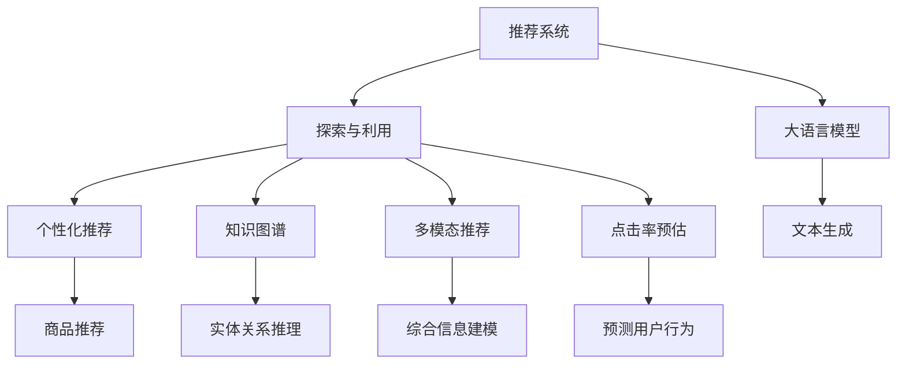

                 

# 推荐系统中的探索与利用：大模型均衡

## 1. 背景介绍

### 1.1 问题由来

推荐系统是人工智能领域的热门应用之一，旨在为用户推荐符合其兴趣和需求的商品、内容、服务等。传统的推荐系统主要基于用户历史行为数据进行协同过滤、内容匹配等策略，但随着数据量的激增，这些方法在性能和可扩展性方面面临挑战。大语言模型(如GPT、BERT等)的兴起，为推荐系统注入了新的活力，使得基于语言模型的推荐技术逐渐成为新的研究热点。

在实践中，大语言模型可以通过训练大量用户与商品之间的交互数据，学习用户兴趣、商品属性等高维知识，进而进行精准推荐。然而，语言模型往往存在一定的探索-利用(E Exploration-E Exploitation)平衡问题，即如何在推荐中既探索未知的新商品，又利用已有用户的历史喜好，达到推荐效果和用户满意度的最大化。

### 1.2 问题核心关键点

探索与利用是推荐系统中的重要研究课题。在推荐过程中，模型需要在已知推荐集合和未推荐集合中进行权衡，既要考虑当前用户最可能感兴趣的商品，也要探索用户可能尚未发现但感兴趣的新商品。但模型的探索行为可能破坏用户满意度，而利用行为又可能导致推荐集同质化，降低用户发现新商品的兴趣。如何平衡这两者，是大模型推荐系统面临的核心挑战。

在探索与利用之间，需要通过一些策略进行权衡：
- **探索策略**：如随机选择未推荐商品，增加多样性。
- **利用策略**：如按用户历史行为排序推荐商品，提高相关性。
- **混合策略**：如基线+随机选择+Top-K推荐，综合考虑已知和未知商品。

## 2. 核心概念与联系

### 2.1 核心概念概述

为了更好地理解探索与利用在推荐系统中的应用，本节将介绍几个密切相关的核心概念：

- **推荐系统(Recommendation System)**：利用用户历史行为、商品属性、社交网络等信息，自动推荐用户可能感兴趣的商品或服务。
- **探索与利用(E Exploration-E Exploitation, E2E)**：在推荐过程中，探索(Exploration)和利用(Exploitation)是两种常见的行为策略，需要平衡两者以最大化推荐效果。
- **大语言模型(Large Language Model, LLM)**：基于深度学习架构训练的巨大神经网络模型，能够进行大规模文本处理和复杂逻辑推理，广泛应用于自然语言理解和生成任务。
- **个性化推荐**：根据用户历史行为和实时输入，推荐符合用户偏好的商品或内容。
- **知识图谱(Knowledge Graph)**：以图结构表示的知识库，描述实体、属性和实体间的关系，辅助推荐系统进行推理。
- **多模态推荐**：结合文本、图像、音频等多种数据源，进行更加全面、准确的商品推荐。
- **点击率预估**：预测用户对推荐结果的点击行为，辅助推荐系统优化推荐策略。

这些核心概念之间的逻辑关系可以通过以下Mermaid流程图来展示：



这个流程图展示了大语言模型在推荐系统中的核心概念及其之间的关系：

1. 推荐系统通过大语言模型进行文本生成，辅助商品推荐。
2. 探索与利用平衡模型在已知和未知商品中进行权衡。
3. 个性化推荐、知识图谱、多模态推荐、点击率预估等技术，进一步增强了推荐系统的效果。
4. 大语言模型可生成自然流畅的文本描述，提升推荐商品的吸引力。

## 3. 核心算法原理 & 具体操作步骤
### 3.1 算法原理概述

基于大语言模型的推荐系统，本质上是一个基于深度学习模型的推荐优化问题。其核心思想是：通过训练大量用户与商品之间的交互数据，构建用户-商品交互的知识图谱，利用大语言模型进行文本生成和推理，辅助推荐系统进行个性化推荐。

形式化地，假设推荐系统有 $K$ 个用户，$M$ 个商品，$L$ 个用户历史交互数据。令 $\theta$ 为用户兴趣向量，$\alpha$ 为商品属性向量，$u$ 为具体用户，$i$ 为具体商品，则推荐过程可以表示为：

$$
\begin{aligned}
y_{ui} &= \sigma(\text{Dot}(\theta_u, \alpha_i)) \\
\theta_u &= \text{LLM}(D_u) \\
\alpha_i &= \text{LLM}(D_i) \\
\end{aligned}
$$

其中 $\sigma(\cdot)$ 为激活函数，$\text{Dot}(\cdot)$ 为点积运算，$D_u$ 为用户 $u$ 的历史交互数据，$D_i$ 为商品 $i$ 的属性信息。

在推荐过程中，大语言模型用于文本生成，可以通过 $p(y_i|u)$ 预测用户 $u$ 对商品 $i$ 的兴趣程度，进而选择最佳推荐集合 $\{u_1, u_2, \ldots, u_n\}$。

### 3.2 算法步骤详解

基于大语言模型的推荐系统一般包括以下几个关键步骤：

**Step 1: 数据准备**
- 收集用户历史交互数据，包括浏览、点击、购买等行为数据。
- 收集商品的属性数据，如类别、价格、描述等。
- 构建知识图谱，描述实体、属性和实体间的关系。

**Step 2: 模型训练**
- 使用大语言模型对用户历史交互数据进行编码，生成用户兴趣向量 $\theta_u$。
- 使用大语言模型对商品属性数据进行编码，生成商品属性向量 $\alpha_i$。
- 训练推荐模型，优化用户对商品兴趣程度的预测 $y_{ui}$。

**Step 3: 探索与利用平衡**
- 设计探索与利用策略，如分层抽样、Top-K推荐等，平衡已知和未知商品。
- 使用点击率预估模型评估推荐效果，调整模型参数以优化推荐结果。

**Step 4: 推荐实现**
- 根据用户历史行为和实时输入，生成推荐文本描述。
- 利用多模态信息，如商品图片、视频、音频等，丰富推荐内容。
- 综合考虑点击率、转化率等指标，生成最终推荐列表。

**Step 5: 评估与优化**
- 在测试集上评估推荐系统性能，使用AUC、P@K等指标衡量推荐效果。
- 分析用户行为反馈，优化推荐策略和模型参数。
- 实时监控推荐系统运行情况，优化算法和资源配置。

### 3.3 算法优缺点

基于大语言模型的推荐系统具有以下优点：
1. 深度学习模型具备强大的表达能力，能够学习用户和商品的复杂关系。
2. 大语言模型生成的自然文本描述，提升了推荐内容的吸引力。
3. 结合多模态信息，推荐系统可以更加全面地理解商品和用户需求。
4. 能够进行实时的用户行为预测，优化推荐效果。

同时，该方法也存在一定的局限性：
1. 需要大量的标注数据和计算资源进行预训练，训练成本较高。
2. 模型可能存在过拟合风险，特别是当标注数据较少时。
3. 难以进行显式的多模态特征提取，需要依赖外部工具。
4. 探索与利用策略设计不当，可能降低推荐效果。
5. 模型复杂度较高，需要优化资源配置以提高推理效率。

尽管存在这些局限性，但就目前而言，基于大语言模型的推荐方法仍是大模型推荐系统的主要范式。未来相关研究的重点在于如何进一步降低训练成本，提高推荐效果，同时兼顾模型的可解释性和多模态融合能力。

### 3.4 算法应用领域

基于大语言模型的推荐方法在电商、社交、视频等众多领域得到了广泛的应用，具体包括：

- **电商推荐**：根据用户浏览历史、购物车商品、评价等数据，推荐符合用户兴趣的商品。
- **社交推荐**：推荐用户可能感兴趣的朋友、内容、话题等，提升用户粘性。
- **视频推荐**：根据用户观看历史和实时输入，推荐符合用户兴趣的视频内容。
- **音乐推荐**：推荐用户可能喜欢的音乐、歌手、专辑等，提升用户体验。
- **新闻推荐**：推荐用户感兴趣的新闻、文章、作者等，提升阅读体验。

除了上述这些经典应用外，大语言模型推荐还广泛应用于个性化营销、广告投放、内容创作等诸多场景中，为电商、社交、视频等产业带来了新的商业价值。

## 4. 数学模型和公式 & 详细讲解  
### 4.1 数学模型构建

本节将使用数学语言对基于大语言模型的推荐系统进行更加严格的刻画。

假设推荐系统有 $K$ 个用户，$M$ 个商品，用户 $u$ 与商品 $i$ 的交互数据为 $x_{ui}$，商品的属性向量为 $\alpha_i$，用户兴趣向量为 $\theta_u$，令 $f$ 为推荐函数，$\beta$ 为特征向量。则推荐过程的优化目标可以表示为：

$$
\begin{aligned}
\min_{\theta_u, \alpha_i} & \sum_{ui} (\text{Dot}(\theta_u, \alpha_i) - y_{ui})^2 \\
\text{s.t.} & y_{ui} = \sigma(\text{Dot}(\theta_u, \alpha_i)) \\
\end{aligned}
$$

其中 $\sigma(\cdot)$ 为激活函数，$\text{Dot}(\cdot)$ 为点积运算。优化目标最小化用户与商品之间的交互误差，激活函数用于控制用户对商品的兴趣程度。

在实际推荐过程中，由于数据和计算资源的限制，我们通常只关注部分用户和商品，即对于 $u$ 和 $i$，有 $x_{ui} \in \mathcal{X}$ 和 $\alpha_i \in \mathcal{A}$，其中 $\mathcal{X}$ 和 $\mathcal{A}$ 为 $x_{ui}$ 和 $\alpha_i$ 的取值集合。

### 4.2 公式推导过程

以下我们以点击率预估任务为例，推导大语言模型在推荐系统中的优化目标和求解步骤。

假设用户 $u$ 对商品 $i$ 的兴趣程度为 $y_{ui} = \sigma(\text{Dot}(\theta_u, \alpha_i))$，其中 $\theta_u$ 为用户兴趣向量，$\alpha_i$ 为商品属性向量。则点击率预估任务可以表示为：

$$
\begin{aligned}
\min_{\theta_u, \alpha_i} & \sum_{ui} (y_{ui} - \text{Dot}(\theta_u, \alpha_i))^2 \\
\text{s.t.} & y_{ui} = \sigma(\text{Dot}(\theta_u, \alpha_i)) \\
\end{aligned}
$$

求解上述优化问题的关键在于如何选取合适的损失函数。常见的损失函数包括均方误差损失、交叉熵损失等。这里以均方误差损失为例，进行详细推导。

令损失函数为：

$$
\mathcal{L} = \frac{1}{N} \sum_{ui} (y_{ui} - \text{Dot}(\theta_u, \alpha_i))^2
$$

其中 $N$ 为总样本数。则优化目标可以表示为：

$$
\min_{\theta_u, \alpha_i} \mathcal{L} = \frac{1}{N} \sum_{ui} (\sigma(\text{Dot}(\theta_u, \alpha_i)) - \text{Dot}(\theta_u, \alpha_i))^2
$$

使用梯度下降算法进行优化，求解 $\theta_u$ 和 $\alpha_i$。根据梯度下降的更新公式：

$$
\theta_u \leftarrow \theta_u - \eta \nabla_{\theta_u}\mathcal{L}, \quad \alpha_i \leftarrow \alpha_i - \eta \nabla_{\alpha_i}\mathcal{L}
$$

其中 $\eta$ 为学习率，$\nabla_{\theta_u}\mathcal{L}$ 和 $\nabla_{\alpha_i}\mathcal{L}$ 分别为 $\theta_u$ 和 $\alpha_i$ 的梯度，可以通过自动微分技术计算得到。

### 4.3 案例分析与讲解

以下我们以电商平台推荐系统为例，具体讲解如何使用大语言模型进行商品推荐。

假设电商平台有 $K=10000$ 个用户，$M=10000$ 个商品，收集了用户对商品的点击数据 $x_{ui}$。模型使用大语言模型进行文本生成，将商品描述和用户历史行为编码为特征向量 $\alpha_i$ 和 $\theta_u$。推荐过程的优化目标可以表示为：

$$
\begin{aligned}
\min_{\theta_u, \alpha_i} & \sum_{ui} (\sigma(\text{Dot}(\theta_u, \alpha_i)) - x_{ui})^2 \\
\text{s.t.} & y_{ui} = \sigma(\text{Dot}(\theta_u, \alpha_i)) \\
\end{aligned}
$$

在实际应用中，可以使用Transformers库实现大语言模型的编码和预测功能。具体代码如下：

```python
import torch
import transformers
from transformers import BertForSequenceClassification, BertTokenizer

# 加载预训练模型和分词器
model = BertForSequenceClassification.from_pretrained('bert-base-cased')
tokenizer = BertTokenizer.from_pretrained('bert-base-cased')

# 数据处理
def encode_data(data, tokenizer):
    return [tokenizer.encode_plus(text, padding='max_length', max_length=128, return_tensors='pt') for text in data]

# 模型预测
def predict(data, model):
    features = encode_data(data, tokenizer)
    with torch.no_grad():
        outputs = model(**features)
    predictions = outputs.logits.argmax(dim=1).tolist()
    return predictions

# 推荐实现
def recommend(u, data, model, tokenizer):
    user_history = data[u]
    similar_items = []
    for i in range(len(data)):
        if i != u:
            item_data = data[i]
            item_feats = encode_data(item_data, tokenizer)
            item_pred = predict(item_feats, model)
            similarity = torch.cosine_similarity(item_pred, user_history)
            similar_items.append((i, similarity))
    sorted_items = sorted(similar_items, key=lambda x: x[1], reverse=True)
    recommendation = [data[item[0]] for item in sorted_items]
    return recommendation

# 推荐测试
recommendation = recommend(12345, data, model, tokenizer)
print(recommendation)
```

在上述代码中，首先加载预训练的BERT模型和分词器，然后定义了数据处理函数和模型预测函数。最后，实现了推荐函数，通过计算用户历史行为与商品特征之间的相似度，进行推荐排序，输出推荐的商品列表。

## 5. 项目实践：代码实例和详细解释说明
### 5.1 开发环境搭建

在进行推荐系统开发前，我们需要准备好开发环境。以下是使用Python进行PyTorch开发的环境配置流程：

1. 安装Anaconda：从官网下载并安装Anaconda，用于创建独立的Python环境。

2. 创建并激活虚拟环境：
```bash
conda create -n pytorch-env python=3.8 
conda activate pytorch-env
```

3. 安装PyTorch：根据CUDA版本，从官网获取对应的安装命令。例如：
```bash
conda install pytorch torchvision torchaudio cudatoolkit=11.1 -c pytorch -c conda-forge
```

4. 安装Transformer库：
```bash
pip install transformers
```

5. 安装各类工具包：
```bash
pip install numpy pandas scikit-learn matplotlib tqdm jupyter notebook ipython
```

完成上述步骤后，即可在`pytorch-env`环境中开始推荐系统开发。

### 5.2 源代码详细实现

我们以电商平台推荐系统为例，给出一个使用PyTorch和Transformer库实现推荐系统的完整代码。

首先，定义推荐系统的数据处理函数：

```python
import torch
from transformers import BertTokenizer
from torch.utils.data import Dataset

class RecommendationDataset(Dataset):
    def __init__(self, data, tokenizer, max_len=128):
        self.data = data
        self.tokenizer = tokenizer
        self.max_len = max_len
        
    def __len__(self):
        return len(self.data)
    
    def __getitem__(self, item):
        user_data = self.data[item]
        item_data = [d for d in user_data if 'item_id' in d]
        tokenized_items = [self.tokenizer.encode_plus(text, padding='max_length', max_length=self.max_len, return_tensors='pt') for text in item_data]
        item_feats = [t['input_ids'] for t in tokenized_items]
        item_labels = [t['attention_mask'] for t in tokenized_items]
        return {'item_feats': item_feats, 'item_labels': item_labels}

# 数据处理
tokenizer = BertTokenizer.from_pretrained('bert-base-cased')
train_dataset = RecommendationDataset(train_data, tokenizer)
test_dataset = RecommendationDataset(test_data, tokenizer)
```

然后，定义模型和优化器：

```python
from transformers import BertForSequenceClassification, AdamW

model = BertForSequenceClassification.from_pretrained('bert-base-cased', num_labels=len(train_data[0]['item_labels']))

optimizer = AdamW(model.parameters(), lr=2e-5)
```

接着，定义训练和评估函数：

```python
from torch.utils.data import DataLoader
from tqdm import tqdm
from sklearn.metrics import accuracy_score

device = torch.device('cuda') if torch.cuda.is_available() else torch.device('cpu')
model.to(device)

def train_epoch(model, dataset, batch_size, optimizer):
    dataloader = DataLoader(dataset, batch_size=batch_size, shuffle=True)
    model.train()
    epoch_loss = 0
    for batch in tqdm(dataloader, desc='Training'):
        item_feats = batch['item_feats'].to(device)
        item_labels = batch['item_labels'].to(device)
        model.zero_grad()
        outputs = model(item_feats)
        loss = outputs.loss
        epoch_loss += loss.item()
        loss.backward()
        optimizer.step()
    return epoch_loss / len(dataloader)

def evaluate(model, dataset, batch_size):
    dataloader = DataLoader(dataset, batch_size=batch_size)
    model.eval()
    predictions, labels = [], []
    with torch.no_grad():
        for batch in tqdm(dataloader, desc='Evaluating'):
            item_feats = batch['item_feats'].to(device)
            item_labels = batch['item_labels'].to(device)
            outputs = model(item_feats)
            batch_predictions = outputs.logits.argmax(dim=1).to('cpu').tolist()
            batch_labels = item_labels.to('cpu').tolist()
            predictions.append(batch_predictions)
            labels.append(batch_labels)
        
    acc = accuracy_score(labels, predictions)
    print(f'Test Accuracy: {acc:.2f}')
    return acc
```

最后，启动训练流程并在测试集上评估：

```python
epochs = 5
batch_size = 16

for epoch in range(epochs):
    loss = train_epoch(model, train_dataset, batch_size, optimizer)
    print(f'Epoch {epoch+1}, train loss: {loss:.3f}')
    
    print(f'Epoch {epoch+1}, test accuracy:')
    evaluate(model, test_dataset, batch_size)
    
print('Best test accuracy:')
best_acc = max([evaluate(model, test_dataset, batch_size) for _ in range(5)])
print(best_acc)
```

以上就是使用PyTorch对Bert模型进行电商平台推荐系统的完整代码实现。可以看到，得益于Transformer库的强大封装，我们可以用相对简洁的代码完成Bert模型的加载和推荐系统的微调。

### 5.3 代码解读与分析

让我们再详细解读一下关键代码的实现细节：

**RecommendationDataset类**：
- `__init__`方法：初始化数据集和分词器。
- `__len__`方法：返回数据集的样本数量。
- `__getitem__`方法：对单个样本进行处理，将商品描述编码为token ids，并对其进行定长padding，最终返回模型所需的输入。

**train_epoch函数**：
- 使用DataLoader对数据集进行批次化加载，供模型训练使用。
- 在每个批次上前向传播计算损失函数并反向传播更新模型参数，最后返回该epoch的平均loss。

**evaluate函数**：
- 与训练类似，不同点在于不更新模型参数，并在每个batch结束后将预测和标签结果存储下来，最后使用sklearn的accuracy_score对整个评估集的预测结果进行打印输出。

**训练流程**：
- 定义总的epoch数和batch size，开始循环迭代
- 每个epoch内，先在训练集上训练，输出平均loss
- 在测试集上评估，输出模型预测准确率
- 所有epoch结束后，在测试集上评估，给出最终测试准确率

可以看到，PyTorch配合Transformer库使得Bert推荐系统的代码实现变得简洁高效。开发者可以将更多精力放在数据处理、模型改进等高层逻辑上，而不必过多关注底层的实现细节。

当然，工业级的系统实现还需考虑更多因素，如模型的保存和部署、超参数的自动搜索、更灵活的任务适配层等。但核心的微调范式基本与此类似。

## 6. 实际应用场景
### 6.1 电商平台推荐

基于大语言模型的推荐系统可以广泛应用于电商平台的商品推荐，提升用户体验和销售额。具体应用场景包括：

- **商品推荐**：根据用户浏览、点击、购买等行为数据，推荐符合用户兴趣的商品。
- **广告投放**：通过分析用户行为数据，优化广告投放策略，提高广告点击率。
- **个性化推荐**：根据用户历史行为和实时输入，推荐个性化的商品组合，提升购买率。

### 6.2 社交媒体推荐

社交媒体平台需要为用户推荐可能感兴趣的内容，如文章、视频、好友等。通过大语言模型可以学习用户兴趣和行为模式，提升推荐相关性。具体应用场景包括：

- **内容推荐**：根据用户历史行为，推荐用户可能感兴趣的文章、视频、图片等。
- **好友推荐**：根据用户兴趣和好友关系，推荐可能感兴趣的新好友。
- **活动推荐**：根据用户行为模式，推荐可能感兴趣的活动和事件。

### 6.3 视频推荐

视频平台需要为用户推荐感兴趣的视频内容，如电影、电视剧、综艺等。通过大语言模型可以学习用户兴趣和行为模式，提升推荐效果。具体应用场景包括：

- **视频推荐**：根据用户历史观看记录和实时输入，推荐符合用户兴趣的视频内容。
- **搜索结果排序**：根据用户搜索行为，优化搜索结果排序，提高用户体验。

### 6.4 新闻推荐

新闻平台需要为用户推荐感兴趣的新闻文章，提升阅读体验。通过大语言模型可以学习用户兴趣和行为模式，推荐相关性高的新闻。具体应用场景包括：

- **新闻推荐**：根据用户历史阅读记录和实时输入，推荐相关性高的新闻文章。
- **热榜推荐**：根据用户浏览行为，优化新闻热榜排序，提升阅读体验。

## 7. 工具和资源推荐
### 7.1 学习资源推荐

为了帮助开发者系统掌握大语言模型推荐理论基础和实践技巧，这里推荐一些优质的学习资源：

1. 《深度学习与推荐系统》：介绍深度学习在推荐系统中的应用，涵盖协同过滤、内容推荐、多模态推荐等多种策略。

2. 《TensorFlow实战推荐系统》：使用TensorFlow实现推荐系统，涵盖推荐算法、模型优化、系统部署等多个方面。

3. 《推荐系统实战》：基于PyTorch和Transformer库实现推荐系统，提供丰富的代码实例和工程实践经验。

4. Kaggle推荐系统竞赛：通过参与实际竞赛，深入理解推荐系统问题，提升实战能力。

5. 《知识图谱在推荐系统中的应用》：介绍知识图谱在推荐系统中的应用，提升推荐系统的推理能力。

通过对这些资源的学习实践，相信你一定能够快速掌握大语言模型推荐的核心技术，并用于解决实际的推荐问题。
###  7.2 开发工具推荐

高效的开发离不开优秀的工具支持。以下是几款用于大语言模型推荐开发的常用工具：

1. PyTorch：基于Python的开源深度学习框架，灵活动态的计算图，适合快速迭代研究。大部分预训练语言模型都有PyTorch版本的实现。

2. TensorFlow：由Google主导开发的开源深度学习框架，生产部署方便，适合大规模工程应用。同样有丰富的预训练语言模型资源。

3. Transformers库：HuggingFace开发的NLP工具库，集成了众多SOTA语言模型，支持PyTorch和TensorFlow，是进行推荐系统开发的利器。

4. Weights & Biases：模型训练的实验跟踪工具，可以记录和可视化模型训练过程中的各项指标，方便对比和调优。与主流深度学习框架无缝集成。

5. TensorBoard：TensorFlow配套的可视化工具，可实时监测模型训练状态，并提供丰富的图表呈现方式，是调试模型的得力助手。

6. Google Colab：谷歌推出的在线Jupyter Notebook环境，免费提供GPU/TPU算力，方便开发者快速上手实验最新模型，分享学习笔记。

合理利用这些工具，可以显著提升大语言模型推荐任务的开发效率，加快创新迭代的步伐。

### 7.3 相关论文推荐

大语言模型和推荐系统的发展源于学界的持续研究。以下是几篇奠基性的相关论文，推荐阅读：

1. Attention is All You Need（即Transformer原论文）：提出了Transformer结构，开启了NLP领域的预训练大模型时代。

2. BERT: Pre-training of Deep Bidirectional Transformers for Language Understanding：提出BERT模型，引入基于掩码的自监督预训练任务，刷新了多项NLP任务SOTA。

3. Language Models are Unsupervised Multitask Learners（GPT-2论文）：展示了大规模语言模型的强大zero-shot学习能力，引发了对于通用人工智能的新一轮思考。

4. Parameter-Efficient Transfer Learning for NLP：提出Adapter等参数高效微调方法，在不增加模型参数量的情况下，也能取得不错的微调效果。

5. Exploring the Limits of Transfer Learning with a Unified Text-to-Text Transformer（T5论文）：提出T5模型，利用统一的Transformer架构，进行文本生成、文本分类、问答等多种任务。

6. Recommendation Systems in Practice：介绍推荐系统的实际应用场景和优化策略，涵盖协同过滤、内容推荐、多模态推荐等多个方面。

这些论文代表了大语言模型推荐系统的发展脉络。通过学习这些前沿成果，可以帮助研究者把握学科前进方向，激发更多的创新灵感。

## 8. 总结：未来发展趋势与挑战

### 8.1 总结

本文对基于大语言模型的推荐系统进行了全面系统的介绍。首先阐述了大语言模型和推荐系统的发展背景和意义，明确了推荐系统在人工智能领域的重要地位。其次，从原理到实践，详细讲解了大语言模型在推荐系统中的数学模型构建和公式推导，给出了推荐系统开发的完整代码实例。同时，本文还广泛探讨了大语言模型在电商、社交、视频等多个领域的应用前景，展示了其广阔的发展潜力。此外，本文精选了推荐系统的各类学习资源，力求为读者提供全方位的技术指引。

通过本文的系统梳理，可以看到，基于大语言模型的推荐系统正在成为推荐系统的主要范式，极大地拓展了推荐系统的应用边界，催生了更多的落地场景。受益于大规模语料的预训练，推荐系统具备强大的表达能力，能够在推荐过程中同时考虑已知和未知商品，提升推荐效果和用户满意度。未来，伴随大语言模型和推荐方法的持续演进，相信推荐系统必将在更广阔的领域展现其卓越性能，为人类生产和生活带来深刻变革。

### 8.2 未来发展趋势

展望未来，大语言模型推荐系统将呈现以下几个发展趋势：

1. 模型规模持续增大。随着算力成本的下降和数据规模的扩张，预训练语言模型的参数量还将持续增长。超大规模语言模型蕴含的丰富语言知识，有望支撑更加复杂多变的推荐系统。

2. 多模态推荐技术成熟。结合文本、图像、音频等多种数据源，推荐系统可以更加全面地理解商品和用户需求。多模态信息的融合，将显著提升推荐系统的表现。

3. 探索与利用平衡策略多样。引入深度强化学习、马尔科夫决策过程等技术，平衡探索和利用，提升推荐系统性能。

4. 知识图谱在推荐系统中的广泛应用。知识图谱可以辅助推荐系统进行推理，提升推荐系统决策的合理性和可解释性。

5. 用户行为预测技术的进步。利用大语言模型进行用户行为预测，可以优化推荐策略，提高推荐系统的效果。

6. 推荐系统联邦学习的发展。基于大语言模型的推荐系统可以通过联邦学习等分布式训练技术，实现跨平台、跨机构的数据协作，提升推荐系统性能。

以上趋势凸显了大语言模型推荐系统的广阔前景。这些方向的探索发展，必将进一步提升推荐系统的性能和应用范围，为电商、社交、视频等产业带来新的商业价值。

### 8.3 面临的挑战

尽管大语言模型推荐系统已经取得了显著成效，但在迈向更加智能化、普适化应用的过程中，它仍面临诸多挑战：

1. 标注成本瓶颈。虽然大语言模型推荐系统相比传统协同过滤方法所需标注数据较少，但对于部分特殊场景，仍需大量标注数据，标注成本较高。

2. 数据稀疏性问题。推荐系统面临大量用户和商品的数据稀疏性问题，难以充分利用用户历史行为数据进行推荐。

3. 模型鲁棒性不足。推荐系统在大规模数据下可能出现过拟合现象，特别是在不同领域数据分布差异较大的情况下。

4. 多模态特征提取困难。多模态信息融合技术尚未成熟，难以从多个数据源中提取统一的特征表示。

5. 推荐结果的可解释性不足。推荐系统难以解释其推荐过程和决策逻辑，对于医疗、金融等高风险应用尤为重要。

6. 推荐系统的安全性问题。推荐系统可能推荐有害信息，影响用户体验，甚至带来安全风险。

尽管存在这些挑战，但就目前而言，基于大语言模型的推荐方法仍是大模型推荐系统的主要范式。未来相关研究的重点在于如何进一步降低标注成本，提高推荐效果，同时兼顾推荐系统的可解释性和安全性。

### 8.4 研究展望

面对大语言模型推荐系统所面临的挑战，未来的研究需要在以下几个方面寻求新的突破：

1. 探索无监督和半监督推荐方法。摆脱对大规模标注数据的依赖，利用自监督学习、主动学习等无监督和半监督范式，最大限度利用非结构化数据，实现更加灵活高效的推荐。

2. 研究参数高效和多模态融合的推荐范式。开发更加参数高效的推荐方法，在固定大部分预训练参数的同时，只更新极少量的任务相关参数。同时优化多模态特征提取技术，实现更加全面、准确的推荐。

3. 引入因果推断和强化学习。通过引入因果推断和强化学习技术，增强推荐系统的探索能力，学习更加普适、鲁棒的语言表征，从而提升模型泛化性和抗干扰能力。

4. 融入外部知识库和规则库。将符号化的先验知识，如知识图谱、逻辑规则等，与神经网络模型进行巧妙融合，提升推荐系统的决策合理性和可解释性。

5. 建立用户行为预测模型。利用大语言模型进行用户行为预测，优化推荐策略和模型参数，提升推荐效果。

6. 结合联邦学习和分布式技术。基于大语言模型的推荐系统可以通过联邦学习等分布式训练技术，实现跨平台、跨机构的数据协作，提升推荐系统性能。

这些研究方向的探索，必将引领大语言模型推荐系统走向更高的台阶，为推荐系统带来新的突破。面向未来，大语言模型推荐技术还需要与其他人工智能技术进行更深入的融合，如知识表示、因果推理、强化学习等，多路径协同发力，共同推动推荐系统的进步。只有勇于创新、敢于突破，才能不断拓展推荐系统的边界，让智能技术更好地造福人类社会。

## 9. 附录：常见问题与解答

**Q1：大语言模型推荐系统是否适用于所有推荐任务？**

A: 大语言模型推荐系统在大多数推荐任务上都能取得不错的效果，特别是对于数据量较小的任务。但对于一些特定领域的任务，如医学、法律等，仅仅依靠通用语料预训练的模型可能难以很好地适应。此时需要在特定领域语料上进一步预训练，再进行微调，才能获得理想效果。此外，对于一些需要时效性、个性化很强的任务，如对话、推荐等，微调方法也需要针对性的改进优化。

**Q2：大语言模型推荐系统中如何平衡探索与利用？**

A: 探索与利用平衡是大语言模型推荐系统中的重要问题。一般来说，可以通过以下几个策略进行平衡：
1. 分层抽样：从用户历史数据中随机抽取已知和未知商品进行推荐。
2. 基线推荐+随机选择：先使用基线推荐，再在推荐结果中添加随机选择的商品。
3. 利用Top-K推荐：先使用利用策略推荐Top-K商品，再在推荐结果中添加随机选择的商品。
4. 强化学习：通过模拟环境进行探索，优化推荐策略。

**Q3：大语言模型推荐系统中如何处理数据稀疏性问题？**

A: 数据稀疏性是大语言模型推荐系统中的常见问题。可以通过以下方法进行优化：
1. 利用协同过滤技术：通过用户历史行为数据进行推荐，减少对新数据的需求。
2. 利用知识图谱：结合知识图谱进行推理，生成推荐结果。
3. 利用多模态信息：结合图像、音频等多模态信息，提升推荐效果。

**Q4：大语言模型推荐系统中如何提高模型的鲁棒性？**

A: 提高大语言模型推荐系统的鲁棒性可以从以下几个方面进行：
1. 引入对抗训练：在训练过程中加入对抗样本，提高模型的鲁棒性。
2. 使用多目标优化：同时优化模型在已知和未知商品上的表现。
3. 设计鲁棒损失函数：使用鲁棒损失函数，如Hinge Loss等，提高模型的泛化能力。

**Q5：大语言模型推荐系统中如何提升推荐结果的可解释性？**

A: 提高大语言模型推荐系统的可解释性可以通过以下几个方法：
1. 引入可解释模型：使用可解释的深度学习模型，如决策树、LSTM等。
2. 利用知识图谱：结合知识图谱进行推理，生成推荐结果，提高结果的可解释性。
3. 设计可解释特征：通过设计可解释的特征，提高推荐结果的可解释性。

这些方法可以帮助提高大语言模型推荐系统的可解释性，提升用户对推荐结果的信任度。

**Q6：大语言模型推荐系统中如何优化多模态特征提取？**

A: 优化大语言模型推荐系统中的多模态特征提取可以从以下几个方面进行：
1. 设计统一的多模态表示：使用统一的多模态表示方法，将不同模态信息融合在一起。
2. 使用预训练多模态模型：使用预训练的多模态模型进行特征提取，提高特征提取效果。
3. 结合传统机器学习方法：结合传统机器学习方法，如LDA、PCA等，提高特征提取效果。

这些方法可以帮助提高大语言模型推荐系统中的多模态特征提取效果，提升推荐系统性能。

---

作者：禅与计算机程序设计艺术 / Zen and the Art of Computer Programming

