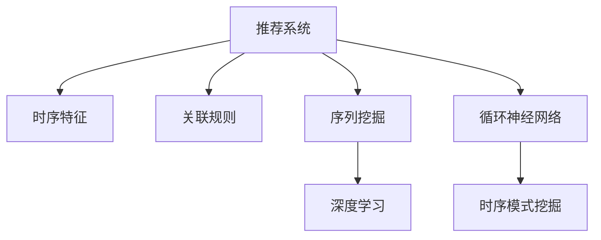

                 

# 推荐系统中的时序模式挖掘技术

> 关键词：推荐系统,时序模式挖掘,关联规则,序列挖掘,深度学习,循环神经网络

## 1. 背景介绍

### 1.1 问题由来

随着电子商务、内容分发平台等互联网业务的迅猛发展，推荐系统已经成为各类互联网应用的核心引擎，对于提升用户体验、增加用户粘性、提高转化率等方面具有重要作用。传统推荐系统主要依赖用户行为历史、商品特征等静态数据进行建模，对于用户的即时行为、上下文因素、动态变化等时序特征重视不足。

近年来，基于深度学习、序列挖掘等技术，时序特征在推荐系统中的应用逐渐受到关注。时序模式挖掘可以帮助系统更好地理解用户行为的时序规律，从而提供更加个性化、精准的推荐服务。本文将系统介绍推荐系统中时序模式挖掘的关键技术，包括关联规则、序列挖掘、深度学习等方法，并通过丰富的案例分析，展示其在推荐系统中的实际应用效果。

## 2. 核心概念与联系

### 2.1 核心概念概述

为更好地理解推荐系统中的时序模式挖掘技术，本节将介绍几个密切相关的核心概念：

- 推荐系统(Recommendation System)：通过分析用户行为和商品特征，预测用户对商品感兴趣的程度，并推荐给用户。推荐系统可以应用在电商、视频、新闻等多个领域。

- 时序特征(Time-Series Feature)：反映用户行为、商品状态、环境因素等随时间变化的情况，如用户的点击序列、商品的销售数据等。

- 关联规则(Association Rule)：描述用户行为序列中不同事件之间关联关系的有序规则，如“先点击商品A，再浏览商品B”。

- 序列挖掘(Sequence Mining)：从时序数据中发现有趣、有用的模式和结构，包括序列聚类、序列分类、序列异常检测等。

- 深度学习(Deep Learning)：一种基于神经网络的机器学习技术，广泛应用于图像识别、自然语言处理等领域，也可以用于时序特征的建模和挖掘。

- 循环神经网络(Recurrent Neural Network, RNN)：一种特殊的神经网络，能够处理序列数据，具有记忆当前输入和前一个输入之间关系的能力。

这些核心概念之间的逻辑关系可以通过以下Mermaid流程图来展示：



这个流程图展示了大语言模型的核心概念及其之间的关系：

1. 推荐系统通过用户行为数据和商品特征建模。
2. 时序特征挖掘是从用户行为序列中发现规律和模式。
3. 关联规则用于分析序列数据中事件之间的关系。
4. 序列挖掘包括序列聚类、分类等技术。
5. 深度学习可以用于序列数据的建模。
6. 循环神经网络是一种特殊的神经网络，可以处理序列数据。
7. 时序模式挖掘是基于上述技术，从序列数据中发现有意义的模式。

这些概念共同构成了推荐系统中时序模式挖掘的基本框架，为其应用提供了技术支撑。

## 3. 核心算法原理 & 具体操作步骤
### 3.1 算法原理概述

推荐系统中的时序模式挖掘技术，通过分析用户行为序列中不同事件之间的关联关系，发现具有时间规律的模式。这些模式可以用于预测用户后续行为，提高推荐效果。

常见的时序模式挖掘方法包括：

- 关联规则方法：从用户行为序列中提取不同事件之间的关联规则。
- 序列挖掘方法：发现用户行为序列中的聚类、分类、异常等结构。
- 深度学习方法：利用神经网络对时序数据进行建模和预测。

以关联规则方法为例，其核心思想是：根据用户行为序列中不同事件之间的时间顺序和统计关联性，生成简洁有序的规则，反映行为序列中的规律。这些规则可以用于用户行为预测、推荐生成等任务。

关联规则的表达形式为：

$$
\forall x_1, x_2, \ldots, x_k \rightarrow y_1, y_2, \ldots, y_m \quad \text{with} \quad C \leq p(x_1, x_2, \ldots, x_k) \leq P
$$

其中 $x_i, y_j$ 表示行为序列中的事件，$p$ 表示事件发生的可能性，$C$ 和 $P$ 分别表示最小支持度和最大置信度。

### 3.2 算法步骤详解

以关联规则方法为例，时序模式挖掘的典型步骤包括：

**Step 1: 数据预处理**
- 对原始用户行为数据进行清洗、去噪，去除异常和重复数据。
- 将时间戳转换为时间窗口，简化数据的处理难度。

**Step 2: 生成候选序列**
- 从预处理后的数据中，生成所有长度为 $k$ 的候选序列。
- 利用频繁项集算法，提取出频繁的项集。

**Step 3: 生成关联规则**
- 利用关联规则算法，从频繁项集中生成有序的关联规则。
- 筛选出置信度大于等于阈值的规则。

**Step 4: 规则验证**
- 对筛选出的关联规则进行验证，去除冗余和不符合真实规律的规则。
- 利用测试集验证规则的有效性。

**Step 5: 规则应用**
- 将验证后的关联规则应用于推荐系统，生成推荐结果。

### 3.3 算法优缺点

时序模式挖掘在推荐系统中的应用具有以下优点：

- 精度高：通过分析用户行为序列中的关联规则，可以更准确地预测用户后续行为。
- 鲁棒性好：关联规则可以自动从大量数据中发现规律，具有很好的泛化能力。
- 实时性好：关联规则的计算复杂度较低，适合实时推荐。

同时，该方法也存在一定的局限性：

- 数据要求高：关联规则依赖高质量、大规模的序列数据，数据质量和数量对规则的准确性有较大影响。
- 维度高：序列数据维度较高，计算复杂度较大，对计算资源有较高要求。
- 规则解释性差：生成的关联规则通常较为复杂，难以直观解释其背后的逻辑。

尽管存在这些局限性，但就目前而言，基于关联规则的方法仍然是最主流的时序模式挖掘手段。未来相关研究的重点在于如何进一步降低数据要求，提高计算效率，增强规则的可解释性。

### 3.4 算法应用领域

时序模式挖掘在推荐系统中主要应用于以下几个领域：

- 商品推荐：根据用户的点击序列，预测用户后续可能购买的商品，提供个性化推荐。
- 内容推荐：根据用户的浏览历史，生成用户对不同内容的需求，提供内容推荐服务。
- 动态推荐：根据用户的即时行为，生成实时的推荐结果，提高用户体验。
- 个性化推荐：根据用户行为序列，发现不同行为之间的关联，进行精准推荐。

此外，时序模式挖掘在电商、社交网络、金融等领域也得到了广泛应用，帮助各类平台优化推荐策略，提升用户满意度。

## 4. 数学模型和公式 & 详细讲解  
### 4.1 数学模型构建

本节将使用数学语言对推荐系统中时序模式挖掘的关联规则方法进行更加严格的刻画。

记用户行为序列为 $D = \{(x_1, x_2, \ldots, x_k)\}$，其中 $x_i$ 表示时间窗口内用户的行为事件。记行为事件的发生次数为 $c_i$，则行为事件的概率 $p(x_i) = \frac{c_i}{|D|}$。

关联规则的形式为：

$$
\forall x_1, x_2, \ldots, x_k \rightarrow y_1, y_2, \ldots, y_m \quad \text{with} \quad C \leq p(x_1, x_2, \ldots, x_k) \leq P
$$

其中 $C$ 为最小支持度，$P$ 为最大置信度，$p(x_1, x_2, \ldots, x_k)$ 为同时发生 $x_1, x_2, \ldots, x_k$ 的概率。

### 4.2 公式推导过程

以下我们以用户购买行为为例，推导关联规则的计算公式。

假设用户购买行为序列为 $D = \{(商品A, 商品B, 商品C, 商品D)\}$，则有：

$$
\begin{aligned}
p(商品A, 商品B, 商品C) &= \frac{c_{商品A} \cdot c_{商品B} \cdot c_{商品C}}{|D|} \\
p(商品A, 商品B, 商品C | 商品D) &= \frac{c_{商品A} \cdot c_{商品B} \cdot c_{商品C}}{c_{商品D}} \\
\end{aligned}
$$

将上述公式代入关联规则的表达式，得到：

$$
商品A, 商品B, 商品C \rightarrow 商品D \quad \text{with} \quad C \leq \frac{c_{商品A} \cdot c_{商品B} \cdot c_{商品C}}{|D|} \leq P
$$

如果 $p(商品A, 商品B, 商品C) \geq C$ 且 $p(商品A, 商品B, 商品C | 商品D) \leq P$，则生成关联规则 $商品A, 商品B, 商品C \rightarrow 商品D$。

### 4.3 案例分析与讲解

假设某电商平台的用户购买行为序列为 $D = \{(商品A, 商品B, 商品C, 商品D)\}$，其中 $商品A$ 为灯泡，$商品B$ 为电风扇，$商品C$ 为电烤箱，$商品D$ 为空调。设 $C=0.5, P=0.8$，则生成以下关联规则：

1. $灯泡 \rightarrow 空调$，置信度为 $p(灯泡) = 0.4$。
2. $电风扇, 电烤箱 \rightarrow 空调$，置信度为 $p(电风扇, 电烤箱) = 0.3$。

根据生成的关联规则，该电商平台可以发现用户更倾向于同时购买灯泡和空调，或者同时购买电风扇和电烤箱再购买空调。系统可以利用这些规律进行推荐，提升用户购买意愿。

## 5. 项目实践：代码实例和详细解释说明
### 5.1 开发环境搭建

在进行时序模式挖掘实践前，我们需要准备好开发环境。以下是使用Python进行Apache Spark开发的环境配置流程：

1. 安装Apache Spark：从官网下载并安装Spark。

2. 配置环境变量：将SPARK_HOME设置为安装路径，设置Hadoop home路径，配置JAVA_HOME等环境变量。

3. 安装PySpark：从官网下载并安装PySpark，将py4j的依赖项也一并安装。

4. 安装Python相关的依赖：
```bash
pip install pandas numpy matplotlib scikit-learn
```

完成上述步骤后，即可在Spark环境下开始时序模式挖掘的实践。

### 5.2 源代码详细实现

下面以Apache Spark的关联规则算法为例，给出时序模式挖掘的代码实现。

首先，定义关联规则算法中的函数：

```python
from pyspark.sql import SparkSession
from pyspark.sql.functions import col, countDistinct, when

def apriori(D, k, C, P):
    # 生成所有长度为k的项集
    frequent_itemsets = []
    for i in range(1, k+1):
        itemsets = D.groupBy(*[col(c) for c in D.columns]).agg(countDistinct(c).alias(c)).filter((col(c) >= C) & (col(c) / len(D) <= P))
        frequent_itemsets.append(itemsets.collect())
    
    # 生成关联规则
    rules = []
    for i in range(len(frequent_itemsets)-1):
        for j in range(i+1, len(frequent_itemsets)):
            itemset_i = frequent_itemsets[i]
            itemset_j = frequent_itemsets[j]
            rules.extend([(itemset_i.collect()[0].asDict(), itemset_j.collect()[0].asDict())])
    
    return rules
```

然后，定义数据集和调用函数：

```python
spark = SparkSession.builder.appName("Apriori").getOrCreate()

# 定义用户行为数据
data = spark.createDataFrame([
    ("灯泡", "电风扇", "电烤箱", "空调"),
    ("灯泡", "电烤箱", "空调"),
    ("电风扇", "电烤箱", "空调"),
    ("灯泡", "空调"),
    ("电风扇", "空调"),
    ("灯泡", "电烤箱"),
    ("电烤箱", "空调"),
    ("电风扇", "电烤箱"),
    ("灯泡", "电烤箱", "空调"),
    ("电风扇", "灯泡", "空调")
], ["商品A", "商品B", "商品C", "商品D"])

# 调用apriori函数，生成关联规则
k = 2
C = 0.5
P = 0.8
rules = apriori(data, k, C, P)

# 输出关联规则
for rule in rules:
    print(rule)
```

以上代码实现了Apache Spark中的Apriori关联规则算法，用于对用户购买行为序列进行时序模式挖掘。可以看到，使用Spark进行大数据处理，可以大大简化数据预处理和规则生成的过程，提高代码的可读性和可维护性。

### 5.3 代码解读与分析

让我们再详细解读一下关键代码的实现细节：

**Apriori函数**：
- `frequent_itemsets`列表：用于存储所有长为 $k$ 的项集。
- `rules`列表：用于存储生成的关联规则。

**数据集定义**：
- 使用`spark.createDataFrame`创建用户行为数据集。
- 用户行为数据是一个列向量，包含四个行为事件，按照时间顺序排列。

**关联规则生成**：
- `apriori`函数：输入原始数据集，生成所有长度为 $k$ 的项集，并进行筛选。
- 使用`groupBy`对用户行为数据进行分组，`agg`函数计算每个事件的发生次数。
- 利用`filter`函数筛选出符合最小支持度和最大置信度的项集。
- 对所有项集进行组合，生成关联规则。
- 使用`collect`函数将项集转化为Python对象，方便后续处理。

**规则输出**：
- 对生成的关联规则进行遍历，输出每个规则。

可以看到，使用Apache Spark进行时序模式挖掘，可以大幅降低数据处理和规则生成的复杂度，同时提高处理效率。Spark的分布式计算特性，使得其在处理大规模数据时具有天然的优势。

## 6. 实际应用场景

### 6.1 智能推荐系统

基于时序模式挖掘的智能推荐系统，可以更全面地理解用户的行为规律，提供更加个性化和精准的推荐服务。推荐系统通过分析用户的浏览、点击、购买等行为序列，挖掘其中的时序模式，生成有意义的关联规则，从而预测用户后续行为，生成个性化推荐。

在电商推荐中，时序模式挖掘可以帮助系统发现用户的购买偏好和行为规律，生成个性化的购物清单。例如，某电商平台发现用户倾向于在购买某类商品后，购买另一类相关商品。系统可以根据这一规律，在用户购买某类商品后，推荐另一类相关商品，提升用户购买意愿。

### 6.2 个性化广告投放

时序模式挖掘还可以应用于个性化广告投放，提高广告的投放效果和用户点击率。广告系统通过分析用户的浏览行为，挖掘其中的时序模式，生成关联规则，从而预测用户对不同广告的兴趣，进行个性化推荐。

例如，某在线广告平台发现用户喜欢浏览科技类新闻，并经常在特定时间段内点击相关广告。系统可以根据这一规律，在用户最可能点击广告的时间段内，推荐科技类广告，提升广告点击率。

### 6.3 实时推荐服务

时序模式挖掘可以实时处理用户行为数据，生成动态推荐结果，提升用户体验。例如，某视频平台发现用户在观看某一视频后，倾向于观看相似主题的视频。系统可以根据这一规律，实时推荐相关主题的视频，提升用户观看时长和满意度。

### 6.4 未来应用展望

随着时序模式挖掘技术的不断发展，其在推荐系统中的应用前景将更加广阔。未来，该技术将与更多前沿技术进行融合，如深度学习、知识图谱、强化学习等，进一步提升推荐系统的性能和效果。具体来说：

- 深度学习将用于时序特征的建模和预测，提高推荐模型的精度和鲁棒性。
- 知识图谱将用于整合更多外部知识，增强推荐系统的多样性和丰富度。
- 强化学习将用于优化推荐策略，提高推荐系统的个性化和智能化水平。

这些技术的结合，将使推荐系统更加智能、高效、个性化，为用户带来更优质的体验。未来，时序模式挖掘将是大数据时代下推荐系统的核心技术之一，有望带来革命性的突破。

## 7. 工具和资源推荐
### 7.1 学习资源推荐

为了帮助开发者系统掌握时序模式挖掘的理论基础和实践技巧，这里推荐一些优质的学习资源：

1. 《数据挖掘导论》书籍：清华大学出版社出版的经典教材，全面介绍了数据挖掘的基本概念和算法。

2. 《机器学习》课程：斯坦福大学开设的机器学习课程，包括关联规则、序列挖掘等概念。

3. 《Apache Spark官方文档》：Spark官方文档提供了详细的API接口和使用示例，方便学习者快速上手。

4. 《Python for Data Science Handbook》书籍：这本书详细介绍了使用Python进行数据分析和处理的方法，包括时序模式挖掘。

5. Kaggle平台：数据科学竞赛平台，提供大量时序模式挖掘的数据集和竞赛项目，可以帮助学习者实践和检验所学知识。

通过对这些资源的学习实践，相信你一定能够快速掌握时序模式挖掘的精髓，并用于解决实际的推荐系统问题。

### 7.2 开发工具推荐

高效的开发离不开优秀的工具支持。以下是几款用于时序模式挖掘开发的常用工具：

1. Apache Spark：由Apache基金会开源的大数据处理框架，支持分布式计算，适合处理大规模数据。

2. PySpark：Spark的Python接口，提供了简单易用的API，方便进行数据处理和机器学习。

3. RapidMiner：一款开源的数据挖掘工具，支持关联规则、序列挖掘等多种算法，并提供了丰富的可视化界面。

4. WEKA：一个强大的机器学习工具，支持多种算法，包括时序模式挖掘算法。

5. Orange：一个可视化数据挖掘工具，支持多种数据处理和挖掘算法，适合初学者使用。

合理利用这些工具，可以显著提升时序模式挖掘的开发效率，加快创新迭代的步伐。

### 7.3 相关论文推荐

时序模式挖掘作为推荐系统的重要技术，已经得到了广泛的研究和应用。以下是几篇奠基性的相关论文，推荐阅读：

1. A priori algorithm for mining association rules：Wu和Fayyad提出的Apriori算法，是关联规则挖掘的经典方法。

2. Efficient estimation of high-dimensional support: ORACLE：Bhattacharya等提出的ORACLE算法，用于高效估计高维数据的支持度。

3. Mining association rules and sequence patterns with negative and redundant correlations：Agarwal等提出的GSP算法，用于挖掘时序数据中的模式和关联。

4. Bidirectional sequence-based collaborative filtering：Hou等提出的双向序列协同过滤方法，用于提高推荐系统的多样性和丰富度。

5. Time series mining for recommendations：Gunawardana等提出的时序挖掘方法，用于提升推荐系统的个性化和时效性。

这些论文代表了大语言模型微调技术的发展脉络。通过学习这些前沿成果，可以帮助研究者把握学科前进方向，激发更多的创新灵感。

## 8. 总结：未来发展趋势与挑战

### 8.1 总结

本文对推荐系统中时序模式挖掘的关键技术进行了全面系统的介绍。首先阐述了时序模式挖掘在推荐系统中的应用背景和重要意义，明确了时序模式挖掘在提高推荐精度、提升用户体验方面的独特价值。其次，从原理到实践，详细讲解了时序模式挖掘的数学模型和关键步骤，给出了时序模式挖掘任务开发的完整代码实例。同时，本文还广泛探讨了时序模式挖掘方法在推荐系统中的实际应用效果，展示了其在智能推荐、广告投放、实时推荐等方面的强大应用潜力。此外，本文精选了时序模式挖掘技术的各类学习资源，力求为读者提供全方位的技术指引。

通过本文的系统梳理，可以看到，时序模式挖掘在推荐系统中具有广阔的应用前景，通过分析用户行为序列中的关联规则，可以更全面地理解用户的行为规律，提供更加个性化和精准的推荐服务。未来，伴随时序模式挖掘技术的不断演进，推荐系统必将变得更加智能、高效、个性化，为用户提供更优质的服务体验。

### 8.2 未来发展趋势

展望未来，时序模式挖掘技术将呈现以下几个发展趋势：

1. 深度学习与序列挖掘的结合。深度学习可以用于时序特征的建模和预测，序列挖掘可以发现时序数据中的有趣结构，两者的结合将进一步提升推荐系统的性能。

2. 时序特征的多模态融合。时序数据不仅包含时间信息，还涉及行为、环境、用户等多个维度。通过融合多模态数据，推荐系统可以更全面地理解用户需求，提供更加精准的推荐。

3. 实时推荐系统的构建。时序模式挖掘可以实时处理用户行为数据，生成动态推荐结果，提升用户体验。未来推荐系统将更加注重实时性，实现全时、全量的推荐。

4. 跨领域推荐系统的发展。推荐系统不仅仅局限于电商、视频、新闻等特定领域，未来将拓展到更多行业，如医疗、教育、金融等，为更多用户提供个性化的推荐服务。

5. 自动化推荐系统的探索。通过自动化的推荐策略优化和用户行为分析，推荐系统可以更加智能化，实现自动化的推荐效果。

这些趋势凸显了时序模式挖掘技术的广阔前景。这些方向的探索发展，必将进一步提升推荐系统的性能和效果，为人类生活带来更多便利和智能。

### 8.3 面临的挑战

尽管时序模式挖掘技术已经取得了一定的成就，但在迈向更加智能化、普适化应用的过程中，仍面临诸多挑战：

1. 数据质量要求高。时序模式挖掘依赖高质量、大规模的序列数据，数据质量和数量对规则的准确性有较大影响。

2. 计算复杂度高。时序数据维度较高，计算复杂度较大，对计算资源有较高要求。

3. 规则解释性差。生成的关联规则通常较为复杂，难以直观解释其背后的逻辑。

4. 推荐系统泛化性不足。时序模式挖掘生成的规则通常基于历史数据，难以适应新数据的泛化。

5. 推荐系统鲁棒性不足。时序模式挖掘生成的规则面对新数据时，泛化性能往往大打折扣，可能导致灾难性遗忘。

6. 推荐系统公平性不足。时序模式挖掘生成的规则可能带有偏见，导致推荐结果不公平。

7. 推荐系统安全性不足。时序模式挖掘生成的规则可能被恶意利用，导致隐私泄露和安全风险。

8. 推荐系统实效性不足。时序模式挖掘生成的规则可能面临计算瓶颈，影响推荐系统的实时性。

这些挑战凸显了时序模式挖掘技术的局限性，需要在数据质量、计算效率、规则解释性等方面进行深入研究，才能实现其大规模应用。

### 8.4 研究展望

面对时序模式挖掘技术所面临的种种挑战，未来的研究需要在以下几个方面寻求新的突破：

1. 探索更高效的序列挖掘算法。改进现有算法的时间复杂度和空间复杂度，提高数据处理效率。

2. 探索更好的特征提取方法。开发更有效的特征提取算法，提高时序模式挖掘的效果。

3. 探索更好的模型融合方法。将时序模式挖掘与深度学习、强化学习等技术进行融合，提升推荐系统的性能。

4. 探索更好的规则解释方法。利用可解释模型或解释工具，增强关联规则的可解释性。

5. 探索更好的推荐策略优化。利用优化算法和自动化技术，提升推荐系统的公平性和安全性。

6. 探索更好的实时推荐策略。利用缓存、流式计算等技术，提高推荐系统的实时性和实效性。

这些研究方向将进一步推动时序模式挖掘技术的发展，使其在推荐系统及其他领域发挥更大作用。总之，未来时序模式挖掘技术的发展前景广阔，需要我们在算法、数据、应用等多个维度进行深入探索和研究。

## 9. 附录：常见问题与解答

**Q1：时序模式挖掘生成的关联规则是否可以解释？**

A: 时序模式挖掘生成的关联规则通常较为复杂，难以直观解释其背后的逻辑。可以通过可视化工具或规则简化方法，帮助理解关联规则的含义。例如，Apriori算法生成的关联规则为频繁项集的组合，可以通过将其可视化，帮助理解规则的意义。

**Q2：时序模式挖掘如何处理缺失数据？**

A: 时序模式挖掘通常使用频繁项集生成关联规则，缺失数据会影响频繁项集的计算。一种常用的方法是使用补全方法，将缺失数据补全为合理的值。另外，可以通过对缺失数据进行特殊处理，如删除含有缺失数据的记录，来减少其对关联规则生成的影响。

**Q3：时序模式挖掘生成的关联规则是否可以用于推荐？**

A: 时序模式挖掘生成的关联规则可以用于推荐系统，通过分析用户行为序列中的关联规则，生成个性化推荐。例如，某电商平台发现用户倾向于同时购买灯泡和空调，系统可以根据这一规律，在用户购买灯泡后，推荐空调，提升用户购买意愿。

**Q4：时序模式挖掘生成的关联规则是否可以用于广告投放？**

A: 时序模式挖掘生成的关联规则可以用于个性化广告投放，通过分析用户的浏览行为，生成关联规则，从而预测用户对不同广告的兴趣，进行个性化推荐。例如，某在线广告平台发现用户喜欢浏览科技类新闻，并经常在特定时间段内点击相关广告，系统可以根据这一规律，在用户最可能点击广告的时间段内，推荐科技类广告，提升广告点击率。

**Q5：时序模式挖掘生成的关联规则是否可以用于实时推荐？**

A: 时序模式挖掘可以实时处理用户行为数据，生成动态推荐结果，提升用户体验。例如，某视频平台发现用户在观看某一视频后，倾向于观看相似主题的视频，系统可以根据这一规律，实时推荐相关主题的视频，提升用户观看时长和满意度。

通过这些常见问题的解答，相信你对于时序模式挖掘技术有了更深入的理解，可以更自信地应用于推荐系统等实际场景中。

