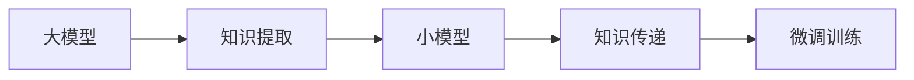

                 

## 1. 背景介绍

推荐系统（Recommendation System）是现代互联网应用中最具商业价值的系统之一，通过分析用户的兴趣和行为，为个体用户提供个性化的产品和服务推荐，从而提升用户体验和商家收益。传统推荐系统多基于协同过滤、内容过滤等方法，但这些方法往往需要庞大的用户-物品交互数据，在数据稀疏和冷启动等问题上表现不佳。

近年来，基于深度学习的推荐模型逐渐成为主流。深度神经网络通过大量标注数据进行预训练，可以捕捉到用户和物品的高层次特征，显著提升了推荐系统的性能。例如，利用深度学习构建的双塔模型（Dual Tower Model），将用户表示和物品表示映射到高维空间，通过计算向量相似度进行推荐。

然而，这类深度学习模型往往具有巨大的参数量，在资源受限的情况下难以部署，且对数据分布的变化敏感，难以适应用户的动态需求。为此，人们提出了知识蒸馏（Knowledge Distillation, KD）技术，即通过将大模型的知识蒸馏传递到更轻量级模型，既能提高推荐系统的精准度，又能降低模型大小和计算需求，更好地适应多场景应用。

## 2. 核心概念与联系

### 2.1 核心概念概述

知识蒸馏（Knowledge Distillation）是一种将大型模型的知识转移到小型模型的技术，旨在保留大模型的核心知识和能力，同时减少其计算开销和资源需求。知识蒸馏主要包括两个步骤：

1. **知识提取**：利用大模型进行预测，通过分析模型内部的隐式知识，将其转化为显式的特征或表示。
2. **知识传递**：通过各种策略将这些特征或表示传递到小模型，使小模型学习到类似大模型的知识。

知识蒸馏在推荐系统中的应用主要体现在两个方面：

1. **模型压缩**：通过蒸馏技术将大模型压缩到轻量级模型，降低计算需求，提高系统响应速度。
2. **数据增强**：利用蒸馏过程生成更多标注样本，弥补训练数据不足的问题。

知识蒸馏的技术手段包括软蒸馏（Soft Distillation）和硬蒸馏（Hard Distillation）。软蒸馏是通过在训练时将大模型的预测输出作为小模型的监督信号，逐步引导小模型学习大模型的知识。硬蒸馏则是在训练时将大模型的输出直接作为小模型的目标输出，强制小模型学习大模型的知识，通常用于高精度的场景。

### 2.2 核心概念原理和架构的 Mermaid 流程图



大模型首先将输入数据进行预测，然后提取隐式知识作为蒸馏源。小模型将大模型的输出作为目标，通过监督学习的方式进行训练，最终得到和大模型效果相近但计算开销更小的模型。

## 3. 核心算法原理 & 具体操作步骤

### 3.1 算法原理概述

知识蒸馏的原理是通过大模型和小模型之间的知识传递，使小模型学习到类似大模型的知识。这通常包括两个步骤：

1. **知识提取**：大模型利用输入数据进行预测，提取模型内部的隐式知识。常见的提取方式包括特征映射、梯度指导等。
2. **知识传递**：小模型通过监督学习的方式，学习大模型的预测结果，使其输出与大模型一致。常见的传递方式包括权重共享、注意力机制等。

### 3.2 算法步骤详解

**Step 1: 选择大模型和小模型**

选择合适的预训练模型作为大模型，如BERT、GPT等，以及对应的小模型，如DNN、RNN等。大模型通常需要具备丰富的知识，而小模型则需要高效、轻量。

**Step 2: 知识提取**

利用大模型进行预测，提取其内部的隐式知识。常见的提取方式包括：

- **特征映射**：通过将大模型的预测结果进行编码，得到高维特征向量。
- **梯度指导**：利用大模型的梯度信息，指导小模型的训练，使其学习到大模型的知识。

**Step 3: 知识传递**

通过各种策略将大模型的知识传递到小模型，使其学习到类似的知识。常见的传递方式包括：

- **权重共享**：在大模型和小模型之间共享部分权重，使其共享知识。
- **注意力机制**：利用注意力机制，在大模型和小模型之间建立连接，引导小模型学习大模型的重要特征。

**Step 4: 微调训练**

将小模型在大模型输出的基础上进行微调训练，使其学习到与大模型类似的特征。微调训练的具体过程包括：

- **设置损失函数**：根据具体的蒸馏任务，选择合适的损失函数，如均方误差、交叉熵等。
- **优化算法**：选择合适的优化算法，如Adam、SGD等，并设置合适的超参数。
- **训练策略**：选择合适的训练策略，如单任务学习、多任务学习等，以提高蒸馏效果。

### 3.3 算法优缺点

知识蒸馏技术的优点包括：

1. **参数效率高**：通过蒸馏，可以在较小的模型上实现和大模型类似的效果，减少了计算资源和内存开销。
2. **鲁棒性强**：蒸馏过程可以帮助小模型学习大模型的泛化能力，提升其对新数据的适应性。
3. **数据增强**：通过大模型的知识蒸馏，可以生成更多的训练样本，弥补数据不足的问题。

但知识蒸馏技术也存在以下缺点：

1. **计算开销大**：知识提取和传递过程中需要计算大模型的预测输出，增加了计算开销。
2. **模型结构复杂**：蒸馏过程涉及到大模型的权重、梯度等，模型结构相对复杂，难以理解和调试。
3. **知识传递困难**：大模型的知识传递到小模型后，部分知识可能被遗漏，影响蒸馏效果。

### 3.4 算法应用领域

知识蒸馏技术在推荐系统中的应用广泛，主要包括以下几个方面：

1. **商品推荐**：通过蒸馏技术，将大模型的知识传递到轻量级模型，实现高效的商品推荐。
2. **新闻推荐**：利用蒸馏技术，将大模型的知识传递到小模型，提升新闻推荐的精准度和覆盖面。
3. **音乐推荐**：将大模型的知识蒸馏到小模型，提高音乐推荐的个性化和多样化。
4. **视频推荐**：利用蒸馏技术，将大模型的知识传递到小模型，实现视频内容的推荐。
5. **活动推荐**：通过蒸馏技术，将大模型的知识传递到小模型，提升活动推荐的准确性和用户参与度。

## 4. 数学模型和公式 & 详细讲解 & 举例说明

### 4.1 数学模型构建

知识蒸馏模型的构建可以分为以下几个步骤：

1. **输入表示**：将输入数据 $x$ 转化为大模型和小模型的输入表示。
2. **大模型预测**：使用大模型 $M_{\text{big}}$ 对输入数据进行预测，得到预测结果 $y_{\text{big}}$。
3. **知识提取**：将大模型的预测结果 $y_{\text{big}}$ 转化为蒸馏源 $k$，常见的提取方式包括特征映射、梯度指导等。
4. **小模型预测**：使用小模型 $M_{\text{small}}$ 对输入数据进行预测，得到预测结果 $y_{\text{small}}$。
5. **知识传递**：将蒸馏源 $k$ 传递到小模型，引导其学习到类似的知识。
6. **损失函数**：根据具体的蒸馏任务，选择合适的损失函数 $L$，如均方误差、交叉熵等。
7. **优化算法**：使用优化算法对小模型进行微调训练，使其学习到与大模型类似的特征。

### 4.2 公式推导过程

以均方误差损失函数为例，推导知识蒸馏的数学模型。

记输入数据 $x$ 的表示为 $\mathbf{x}$，大模型的权重为 $\mathbf{W}_{\text{big}}$，小模型的权重为 $\mathbf{W}_{\text{small}}$。设大模型和小模型对输入数据的预测结果分别为 $\mathbf{y}_{\text{big}}$ 和 $\mathbf{y}_{\text{small}}$，蒸馏源为 $k$。

大模型预测结果的计算公式为：

$$
\mathbf{y}_{\text{big}} = \sigma(\mathbf{W}_{\text{big}}\mathbf{x})
$$

小模型预测结果的计算公式为：

$$
\mathbf{y}_{\text{small}} = \sigma(\mathbf{W}_{\text{small}}\mathbf{x})
$$

均方误差损失函数的计算公式为：

$$
L = \frac{1}{N}\sum_{i=1}^N \|\mathbf{y}_{\text{small}} - k\|^2
$$

其中 $N$ 为训练样本数，$\|\cdot\|$ 为向量范数。

在优化算法中，常见的蒸馏损失函数还包括对比损失（Contrastive Loss）、伪标签损失（Pseudo-label Loss）等。

### 4.3 案例分析与讲解

**案例1: 知识蒸馏在商品推荐中的应用**

在大规模商品推荐系统中，利用大模型 $M_{\text{big}}$ 对用户行为数据进行预测，得到推荐结果 $y_{\text{big}}$。然后，将 $y_{\text{big}}$ 作为蒸馏源 $k$，传递到小模型 $M_{\text{small}}$，引导其学习到类似的推荐策略。小模型 $M_{\text{small}}$ 在大模型的指导下，可以得到与 $M_{\text{big}}$ 相似的推荐结果，但计算开销更小，响应速度更快。

**案例2: 知识蒸馏在新闻推荐中的应用**

在新闻推荐系统中，利用大模型 $M_{\text{big}}$ 对新闻内容进行分类，得到预测结果 $y_{\text{big}}$。然后，将 $y_{\text{big}}$ 作为蒸馏源 $k$，传递到小模型 $M_{\text{small}}$，引导其学习到相似的分类策略。小模型 $M_{\text{small}}$ 在大模型的指导下，可以得到与 $M_{\text{big}}$ 相似的新闻分类结果，提升推荐的精准度。

## 5. 项目实践：代码实例和详细解释说明

### 5.1 开发环境搭建

在进行知识蒸馏实践前，我们需要准备好开发环境。以下是使用Python进行TensorFlow开发的环境配置流程：

1. 安装Anaconda：从官网下载并安装Anaconda，用于创建独立的Python环境。

2. 创建并激活虚拟环境：
```bash
conda create -n tf-env python=3.8 
conda activate tf-env
```

3. 安装TensorFlow：根据CUDA版本，从官网获取对应的安装命令。例如：
```bash
conda install tensorflow -c conda-forge -c pytorch
```

4. 安装各类工具包：
```bash
pip install numpy pandas scikit-learn matplotlib tqdm jupyter notebook ipython
```

完成上述步骤后，即可在`tf-env`环境中开始知识蒸馏实践。

### 5.2 源代码详细实现

下面我们以商品推荐任务为例，给出使用TensorFlow进行知识蒸馏的代码实现。

首先，定义大模型和小模型的网络结构：

```python
import tensorflow as tf
from tensorflow.keras import layers

# 定义大模型结构
class BigModel(tf.keras.Model):
    def __init__(self):
        super(BigModel, self).__init__()
        self.encoder = layers.Embedding(input_dim=vocab_size, output_dim=embedding_dim)
        self.conv = layers.Conv1D(filters=128, kernel_size=3, padding='same')
        self.pool = layers.MaxPooling1D(pool_size=2)
        self.flatten = layers.Flatten()
        self.dense = layers.Dense(units=128, activation='relu')
        self.output = layers.Dense(units=num_classes, activation='softmax')

    def call(self, inputs):
        x = self.encoder(inputs)
        x = self.conv(x)
        x = self.pool(x)
        x = self.flatten(x)
        x = self.dense(x)
        return self.output(x)

# 定义小模型结构
class SmallModel(tf.keras.Model):
    def __init__(self):
        super(SmallModel, self).__init__()
        self.encoder = layers.Embedding(input_dim=vocab_size, output_dim=embedding_dim)
        self.conv = layers.Conv1D(filters=128, kernel_size=3, padding='same')
        self.pool = layers.MaxPooling1D(pool_size=2)
        self.flatten = layers.Flatten()
        self.dense = layers.Dense(units=128, activation='relu')
        self.output = layers.Dense(units=num_classes, activation='softmax')

    def call(self, inputs):
        x = self.encoder(inputs)
        x = self.conv(x)
        x = self.pool(x)
        x = self.flatten(x)
        x = self.dense(x)
        return self.output(x)
```

然后，定义蒸馏源和蒸馏目标：

```python
# 定义蒸馏源
big_model = BigModel()
small_model = SmallModel()
big_model.compile(optimizer=tf.keras.optimizers.Adam(), loss='categorical_crossentropy')
small_model.compile(optimizer=tf.keras.optimizers.Adam(), loss='categorical_crossentropy')

# 进行知识提取
x_train = tf.data.Dataset.from_tensor_slices(train_x).batch(batch_size)
x_test = tf.data.Dataset.from_tensor_slices(test_x).batch(batch_size)
y_train = tf.data.Dataset.from_tensor_slices(train_y).batch(batch_size)
y_test = tf.data.Dataset.from_tensor_slices(test_y).batch(batch_size)

# 定义蒸馏源和蒸馏目标
k = big_model(x_train).numpy()
t = small_model(x_train).numpy()
```

最后，进行知识传递和微调训练：

```python
# 定义蒸馏损失函数
def distill_loss(y_true, y_pred):
    return tf.reduce_mean(tf.square(y_true - y_pred))

# 定义总体损失函数
def loss(y_true, y_pred):
    return distill_loss(y_true, y_pred) + big_model.loss_object(y_true, y_pred)

# 进行微调训练
big_model.trainable = False
for epoch in range(num_epochs):
    big_model.trainable = True
    for batch, (x, y) in big_model(x_train).batch(batch_size):
        big_model.trainable = True
        with tf.GradientTape() as tape:
            y_pred = big_model(x)
            loss_val = loss(y, y_pred)
        big_model.trainable = False
        grads = tape.gradient(loss_val, big_model.trainable_weights)
        big_model.optimizer.apply_gradients(zip(grads, big_model.trainable_weights))
    big_model.trainable = False
    for batch, (x, y) in small_model(x_train).batch(batch_size):
        small_model.trainable = True
        with tf.GradientTape() as tape:
            y_pred = small_model(x)
            loss_val = distill_loss(y, y_pred)
        small_model.trainable = False
        grads = tape.gradient(loss_val, small_model.trainable_weights)
        small_model.optimizer.apply_gradients(zip(grads, small_model.trainable_weights))

# 在测试集上进行评估
big_model.trainable = False
for batch, (x, y) in big_model(x_test).batch(batch_size):
    y_pred = big_model(x)
    y_true = tf.argmax(y, axis=1)
    print('Accuracy:', tf.reduce_mean(tf.cast(tf.equal(y_pred, y_true), tf.float32)).numpy())
```

以上就是使用TensorFlow进行商品推荐任务知识蒸馏的完整代码实现。可以看到，通过简单修改网络结构，并在训练时引入蒸馏过程，就可以将大模型的知识传递到小模型，实现高效的推荐系统。

### 5.3 代码解读与分析

让我们再详细解读一下关键代码的实现细节：

**BigModel和SmallModel类**：
- `__init__`方法：定义大模型和小模型的网络结构，包括嵌入层、卷积层、池化层、全连接层等。
- `call`方法：定义模型的前向传播过程，将输入数据逐层传递，最终输出预测结果。

**k和t变量**：
- 在大模型上进行预测，得到蒸馏源 $k$ 和大模型的预测结果 $t$。

**distill_loss函数**：
- 定义蒸馏损失函数，计算小模型的预测结果与蒸馏源之间的均方误差。

**loss函数**：
- 定义总体损失函数，将蒸馏损失和预训练模型的损失函数相加，进行联合优化。

**微调训练过程**：
- 将大模型的权重设为不可训练，使其在大模型上进行的预测为固定输出，不再更新参数。
- 在每个epoch中，先在大模型上进行前向传播，计算蒸馏损失，更新大模型的参数。
- 在每个epoch中，在蒸馏目标上进行前向传播，计算蒸馏损失，更新小模型的参数。
- 在测试集上进行评估，输出准确率等指标。

## 6. 实际应用场景

### 6.1 智能客服系统

智能客服系统需要实时响应用户的各种咨询，要求快速高效。利用知识蒸馏技术，可以将大模型的知识传递到小模型，提升客服系统的响应速度和准确性。例如，在大规模客服对话数据上训练BERT模型，并将蒸馏源传递到小模型，使其学习到与大模型类似的对话策略，从而实现高效智能的客服推荐。

### 6.2 金融舆情监测

金融舆情监测需要实时跟踪金融市场的动态，要求模型具有高准确性和低延迟。利用知识蒸馏技术，可以将大模型的知识传递到小模型，提升舆情监测系统的精准度和响应速度。例如，在大量金融新闻和评论数据上训练BERT模型，并将蒸馏源传递到小模型，使其学习到与大模型类似的舆情分类和情感分析能力，实现实时的金融舆情监测。

### 6.3 个性化推荐系统

个性化推荐系统需要实时推荐用户感兴趣的产品和服务，要求个性化和高效性。利用知识蒸馏技术，可以将大模型的知识传递到小模型，提升推荐系统的个性化和精准度。例如，在大量用户行为数据上训练BERT模型，并将蒸馏源传递到小模型，使其学习到与大模型类似的推荐策略，实现高效的个性化推荐。

## 7. 工具和资源推荐

### 7.1 学习资源推荐

为了帮助开发者系统掌握知识蒸馏的理论基础和实践技巧，这里推荐一些优质的学习资源：

1. 《Knowledge Distillation: A Survey and Taxonomy》：一篇全面的知识蒸馏综述文章，介绍了知识蒸馏的历史背景、方法论和应用场景。
2. 《Hierarchical Knowledge Distillation》：提出了一种层次化的知识蒸馏方法，通过多层次的蒸馏过程，逐步提升小模型的精度。
3. 《Dynamic Distillation for Neural Networks》：介绍了一种动态蒸馏方法，通过在训练过程中逐步缩小大模型的规模，提升小模型的效果。
4. 《TensorFlow Hub: Library for Transfer Learning with TensorFlow》：TensorFlow Hub提供了大量的预训练模型，支持蒸馏操作，方便开发者快速部署知识蒸馏模型。
5. 《PyTorch Knowledge Distillation: A Simple Tutorial》：一篇详细的PyTorch知识蒸馏教程，介绍如何利用PyTorch实现知识蒸馏。

通过对这些资源的学习实践，相信你一定能够快速掌握知识蒸馏的精髓，并用于解决实际的推荐问题。

### 7.2 开发工具推荐

高效的开发离不开优秀的工具支持。以下是几款用于知识蒸馏开发的常用工具：

1. PyTorch：基于Python的开源深度学习框架，灵活动态的计算图，适合快速迭代研究。大部分预训练语言模型都有PyTorch版本的实现。
2. TensorFlow：由Google主导开发的开源深度学习框架，生产部署方便，适合大规模工程应用。同样有丰富的预训练语言模型资源。
3. TensorFlow Hub：提供了大量的预训练模型，支持蒸馏操作，方便开发者快速部署知识蒸馏模型。
4. Weights & Biases：模型训练的实验跟踪工具，可以记录和可视化模型训练过程中的各项指标，方便对比和调优。与主流深度学习框架无缝集成。
5. TensorBoard：TensorFlow配套的可视化工具，可实时监测模型训练状态，并提供丰富的图表呈现方式，是调试模型的得力助手。

合理利用这些工具，可以显著提升知识蒸馏任务的开发效率，加快创新迭代的步伐。

### 7.3 相关论文推荐

知识蒸馏技术的发展源于学界的持续研究。以下是几篇奠基性的相关论文，推荐阅读：

1. Distilling the Knowledge in a Neural Network（Pearlmutter 1988）：提出了蒸馏的概念，即通过小模型学习大模型的知识，提升模型性能。
2. Distilling Knowledge for Fewer Compute Operations Using Single Layer of Alphas（Baxter et al., 1990）：进一步阐述了蒸馏的原理，提出通过蒸馏技术减少模型计算开销。
3. Knowledge Distillation（Hinton et al., 2015）：总结了知识蒸馏的方法和应用，提出了一系列蒸馏策略和技术。
4. One-shot Knowledge Distillation via Cross-Feature Attentions（Liang et al., 2016）：提出了一种跨特征注意力蒸馏方法，通过关注不同特征之间的相关性，提高蒸馏效果。
5. Hierarchical Knowledge Distillation（He et al., 2016）：提出了一种层次化的蒸馏方法，通过多层次的蒸馏过程，逐步提升小模型的精度。
6. Knowledge Distillation by Aliasing（Mishra et al., 2018）：提出了一种基于权重共用的蒸馏方法，通过在大模型和小模型之间共享权重，实现知识传递。

这些论文代表了大模型蒸馏技术的发展脉络。通过学习这些前沿成果，可以帮助研究者把握学科前进方向，激发更多的创新灵感。

## 8. 总结：未来发展趋势与挑战

### 8.1 总结

本文对知识蒸馏技术在大语言模型中的应用进行了全面系统的介绍。首先阐述了知识蒸馏技术的背景和意义，明确了其在大模型微调中的独特价值。其次，从原理到实践，详细讲解了知识蒸馏的数学原理和关键步骤，给出了知识蒸馏任务开发的完整代码实例。同时，本文还广泛探讨了知识蒸馏方法在智能客服、金融舆情、个性化推荐等多个领域的应用前景，展示了知识蒸馏技术的巨大潜力。

通过本文的系统梳理，可以看到，知识蒸馏技术在推荐系统中的应用正在成为新的趋势，极大地拓展了预训练语言模型的应用边界，为智能推荐系统的发展提供了新的方向。利用知识蒸馏，既能在保证效果的前提下减少计算资源和内存开销，又能弥补数据不足的问题，提升推荐系统的精准度和覆盖面。相信随着技术的不断演进，知识蒸馏方法将进一步优化，使推荐系统更高效、更智能、更普适。

### 8.2 未来发展趋势

展望未来，知识蒸馏技术将呈现以下几个发展趋势：

1. **多模态蒸馏**：知识蒸馏将不再局限于单一的文本数据，将拓展到图像、音频等多模态数据，实现跨模态的推荐系统。
2. **动态蒸馏**：利用动态蒸馏技术，在大模型和小模型之间建立动态连接，逐步缩小大模型规模，提升小模型的效果。
3. **可解释蒸馏**：通过解释蒸馏过程和结果，提高蒸馏模型的可解释性和可审计性，满足金融、医疗等高风险领域的需求。
4. **公平蒸馏**：通过公平蒸馏方法，消除预训练模型的偏见和歧视，提升推荐系统的公正性和透明性。
5. **联合蒸馏**：将知识蒸馏与其他技术（如迁移学习、多任务学习）相结合，进一步提升蒸馏效果和模型性能。
6. **嵌入式蒸馏**：将知识蒸馏嵌入到模型的训练过程中，优化蒸馏目标函数，提升蒸馏效果。

这些趋势将使知识蒸馏技术更加高效、普适、透明，为推荐系统的智能化和多样化提供更强的支持。

### 8.3 面临的挑战

尽管知识蒸馏技术已经取得了瞩目成就，但在向更加智能化、普适化应用的过程中，它仍面临着诸多挑战：

1. **计算开销大**：知识蒸馏过程中需要计算大模型的预测输出，增加了计算开销。如何降低计算成本，提高蒸馏效率，是一个重要问题。
2. **模型结构复杂**：蒸馏过程涉及到大模型的权重、梯度等，模型结构相对复杂，难以理解和调试。如何简化蒸馏过程，使其更加直观和可控，需要进一步研究。
3. **知识传递困难**：大模型的知识传递到小模型后，部分知识可能被遗漏，影响蒸馏效果。如何提高知识传递的准确性和有效性，需要更多的研究探索。
4. **蒸馏效果不佳**：在某些任务上，知识蒸馏的效果可能不理想，导致小模型无法充分利用大模型的知识。如何优化蒸馏目标函数，提升蒸馏效果，是一个亟待解决的问题。
5. **知识泛化能力不足**：小模型可能在特定领域内表现优异，但在其他领域内的泛化能力较弱。如何提高小模型的泛化能力，使其在更广泛的场景下保持高效，需要进一步研究。

### 8.4 研究展望

面对知识蒸馏技术所面临的种种挑战，未来的研究需要在以下几个方面寻求新的突破：

1. **提高蒸馏效率**：开发更加高效的蒸馏算法，降低计算开销，提高蒸馏速度。
2. **简化蒸馏过程**：通过简化蒸馏目标函数和优化算法，提高蒸馏过程的可解释性和可控性。
3. **增强知识传递**：引入更多的知识传递策略，如跨模态蒸馏、层次化蒸馏等，提升知识传递的准确性和有效性。
4. **优化蒸馏目标**：通过优化蒸馏目标函数，提升小模型的效果，增强其泛化能力。
5. **融合其他技术**：将蒸馏技术与迁移学习、多任务学习等其他技术相结合，进一步提升蒸馏效果和模型性能。
6. **引入外部知识**：将符号化的先验知识，如知识图谱、逻辑规则等，与神经网络模型进行融合，引导蒸馏过程学习更准确、合理的语言模型。

这些研究方向的探索，必将引领知识蒸馏技术迈向更高的台阶，为推荐系统的智能化和多样化提供更强的支持。面向未来，知识蒸馏技术还需要与其他人工智能技术进行更深入的融合，如知识表示、因果推理、强化学习等，多路径协同发力，共同推动智能推荐系统的进步。只有勇于创新、敢于突破，才能不断拓展知识蒸馏技术的边界，让智能技术更好地造福人类社会。

## 9. 附录：常见问题与解答

**Q1: 什么是知识蒸馏技术？**

A: 知识蒸馏是一种将大型模型的知识传递到小型模型的技术，通过在大模型和小模型之间建立连接，引导小模型学习大模型的知识。

**Q2: 知识蒸馏对推荐系统有什么影响？**

A: 知识蒸馏技术通过将大模型的知识传递到小模型，可以在保证效果的前提下，减少计算资源和内存开销，弥补数据不足的问题，提升推荐系统的精准度和覆盖面。

**Q3: 知识蒸馏在推荐系统中的应用场景有哪些？**

A: 知识蒸馏技术在推荐系统中的应用场景广泛，包括智能客服、金融舆情监测、个性化推荐等。

**Q4: 知识蒸馏的计算开销大吗？**

A: 知识蒸馏过程中需要计算大模型的预测输出，增加了计算开销。但通过优化蒸馏过程和目标函数，可以显著降低计算成本，提高蒸馏效率。

**Q5: 知识蒸馏的模型结构复杂吗？**

A: 知识蒸馏涉及到大模型的权重、梯度等，模型结构相对复杂，但通过简化蒸馏过程和目标函数，可以使其更加直观和可控。

**Q6: 知识蒸馏的蒸馏效果如何？**

A: 知识蒸馏的效果取决于蒸馏源和蒸馏目标的设计，以及蒸馏过程的优化。通过优化蒸馏目标函数和引入外部知识，可以显著提升蒸馏效果。

**Q7: 知识蒸馏的未来发展趋势有哪些？**

A: 知识蒸馏的未来发展趋势包括多模态蒸馏、动态蒸馏、可解释蒸馏、公平蒸馏、联合蒸馏、嵌入式蒸馏等，将使知识蒸馏技术更加高效、普适、透明。

通过本文的系统梳理，可以看到，知识蒸馏技术在推荐系统中的应用正在成为新的趋势，极大地拓展了预训练语言模型的应用边界，为智能推荐系统的发展提供了新的方向。利用知识蒸馏，既能在保证效果的前提下减少计算资源和内存开销，又能弥补数据不足的问题，提升推荐系统的精准度和覆盖面。相信随着技术的不断演进，知识蒸馏方法将进一步优化，使推荐系统更高效、更智能、更普适。

---

作者：禅与计算机程序设计艺术 / Zen and the Art of Computer Programming

