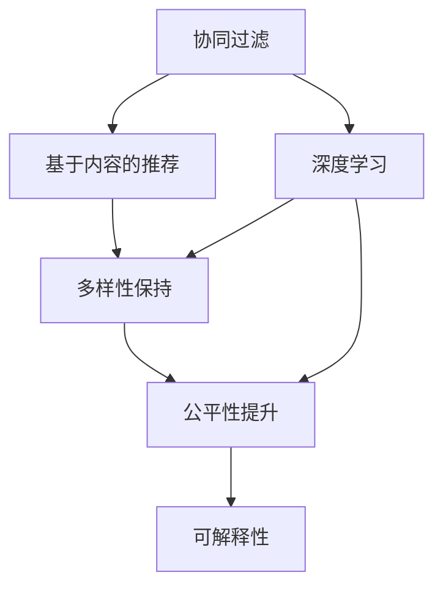
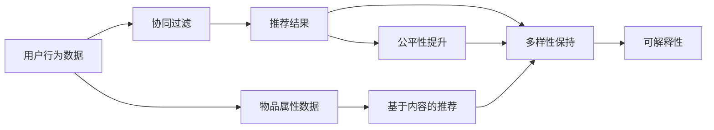

                 

# 推荐系统发展现状:架构、问题与挑战

## 1. 背景介绍

### 1.1 问题由来

推荐系统(Recommender System)是通过对用户的历史行为数据进行分析，为用户推荐其可能感兴趣的商品、服务或内容的技术。随着互联网和数字技术的飞速发展，推荐系统已经成为各行各业数字化转型不可或缺的一部分，应用范围从电商、社交媒体、视频流媒体到新闻聚合等多个领域。

然而，推荐系统的实际应用效果往往与预期存在差距，用户体验和推荐效果仍有大量提升空间。一方面，现有的推荐算法难以满足多样化和个性化需求的提高；另一方面，数据隐私和安全性问题日益凸显，推荐系统的公平性和透明度也需进一步改善。

### 1.2 问题核心关键点

推荐系统的发展，主要围绕着**个性化推荐**、**多样性保持**和**公平性提升**等核心问题。

- **个性化推荐**：传统基于协同过滤、基于内容的推荐算法难以应对多样化的用户需求，越来越多的推荐系统开始采用深度学习等高级算法来提升推荐效果，但模型的复杂度和训练成本也随之大幅增加。
- **多样性保持**：推荐系统往往容易产生"过滤器泡沫"(Filters Bubble)现象，即推荐内容过于集中，导致用户只能接触到同一类信息，从而失去对其它内容的探索性。
- **公平性提升**：随着算法偏见问题的日益凸显，推荐系统如何公平地对待不同背景的用户，成为新的关注点。推荐系统不应基于用户的性别、种族、年龄等敏感属性进行歧视性推荐。

### 1.3 问题研究意义

深入研究和解决推荐系统中的架构、问题与挑战，有助于：

- **提升推荐效果**：通过不断优化算法和架构，能够更精准地预测用户偏好，提升推荐系统的个性化程度。
- **缓解数据和隐私问题**：采用更高效的数据处理方式和隐私保护技术，减轻推荐系统对用户隐私的侵犯风险。
- **增强推荐系统的公平性和透明度**：通过优化推荐算法的可解释性，确保推荐结果的公平和透明。

## 2. 核心概念与联系

### 2.1 核心概念概述

- **协同过滤**：基于用户的历史行为数据和物品的属性信息，通过用户间的相似性或物品间的相似性来进行推荐。
- **基于内容**：利用物品的属性信息，结合用户的偏好，进行推荐。
- **深度学习**：利用深度神经网络模型，通过端到端的训练学习用户偏好和物品特征，实现高质量的推荐。
- **多样性保持**：在推荐结果中引入多样性约束，如多样性损失函数、随机采样等，避免推荐结果的同质化。
- **公平性提升**：采用公平性优化技术，如公平性约束、数据增强等，确保推荐系统对所有用户一视同仁。
- **可解释性**：通过特征重要性解释、局部可解释模型等方法，提升推荐系统的透明性，让用户能够理解推荐结果的原因。

这些概念之间的逻辑关系可以通过以下Mermaid流程图来展示：



### 2.2 核心概念原理和架构的 Mermaid 流程图



## 3. 核心算法原理 & 具体操作步骤

### 3.1 算法原理概述

推荐系统通常分为三个步骤：

1. **特征提取**：从用户行为数据和物品属性数据中提取特征，用于后续的推荐计算。
2. **模型训练**：利用提取的特征，训练推荐模型，预测用户对物品的偏好。
3. **推荐生成**：根据模型预测的结果，为用户生成推荐结果。

其中，推荐模型的训练一般采用监督学习方法，即使用标注数据来训练模型，预测用户对物品的评分或是否感兴趣。深度学习模型由于其强大的表征学习能力，在推荐系统中的使用越来越普遍。

### 3.2 算法步骤详解

#### 3.2.1 特征提取

1. **用户特征**：从用户的历史行为数据中提取，如浏览历史、购买记录、评分记录等。
2. **物品特征**：从物品的属性信息中提取，如物品的描述、标签、类别等。
3. **上下文特征**：从用户行为的环境信息中提取，如访问时间、地理位置、设备类型等。

#### 3.2.2 模型训练

1. **数据预处理**：对原始数据进行清洗、归一化、稀疏化等处理。
2. **模型选择与训练**：选择合适的深度学习模型，如矩阵分解、神经网络、深度神经网络等，利用标注数据进行训练。
3. **损失函数设计**：选择合适的损失函数，如均方误差、交叉熵等，用于衡量模型预测结果与真实标签的差异。

#### 3.2.3 推荐生成

1. **预测用户评分**：对每个物品进行预测，计算用户对物品的评分或概率。
2. **排序推荐**：根据预测结果，对物品进行排序，选择Top-N物品作为推荐结果。
3. **展示推荐**：将推荐结果展示给用户，可能包括物品的标题、图片、评分等。

### 3.3 算法优缺点

推荐系统的优点包括：

- **个性化推荐**：深度学习模型能够高效捕捉用户的复杂偏好，提供高质量的个性化推荐。
- **广泛适用**：推荐系统能够应用于各种场景，如电商推荐、新闻推荐、音乐推荐等。
- **快速迭代**：深度学习模型通常具有较好的可解释性和可调参性，方便模型更新和优化。

缺点包括：

- **高训练成本**：深度学习模型需要大量的标注数据和计算资源进行训练。
- **过拟合风险**：模型在特定数据集上训练得越好，在其它数据集上的泛化性能可能越差。
- **公平性问题**：推荐算法可能会存在偏见，导致对某些用户或物品的推荐不公平。
- **数据隐私**：用户行为数据可能包含敏感信息，需注意隐私保护和合规性问题。

### 3.4 算法应用领域

推荐系统广泛应用于以下领域：

1. **电商推荐**：如淘宝、京东、Amazon等，推荐商品、促销信息等。
2. **新闻推荐**：如今日头条、知乎等，推荐新闻、文章、视频等。
3. **视频推荐**：如YouTube、Netflix等，推荐视频内容、电视剧等。
4. **音乐推荐**：如Spotify、网易云音乐等，推荐歌曲、专辑等。
5. **社交推荐**：如微信、微博等，推荐好友、社群、话题等。
6. **出行推荐**：如滴滴、Uber等，推荐路线、司机、目的地等。

## 4. 数学模型和公式 & 详细讲解 & 举例说明

### 4.1 数学模型构建

推荐系统的核心目标是最大化用户满意度，即最大化用户对推荐结果的评分。假设有$N$个用户$U$，$M$个物品$I$，用户对物品$i$的评分记为$r_{ui}$，用户的评分矩阵记为$R$。推荐系统的目标是通过训练模型$P$，最小化预测评分与实际评分之间的差距，即最小化均方误差损失函数：

$$
\min_{P} \frac{1}{NM} \sum_{u=1}^N \sum_{i=1}^M (r_{ui} - P(u,i))^2
$$

其中，$P(u,i)$表示模型预测用户$u$对物品$i$的评分。

### 4.2 公式推导过程

1. **矩阵分解**：假设$R$可以分解为$U \times V$的形式，即$R = UV^T$。其中$U$和$V$分别为用户和物品的隐向量，$P(u,i) = U_u^T V_i$。

2. **深度学习模型**：假设$P(u,i) = W^T \phi(u) \cdot \phi(i)$，其中$W$为模型权重，$\phi$为非线性映射函数。

3. **损失函数**：常用的损失函数有均方误差损失(MSE)和交叉熵损失(CE)，

$$
\text{MSE} = \frac{1}{NM} \sum_{u=1}^N \sum_{i=1}^M (r_{ui} - P(u,i))^2
$$

$$
\text{CE} = \frac{1}{NM} \sum_{u=1}^N \sum_{i=1}^M (r_{ui} \log P(u,i) + (1 - r_{ui}) \log (1 - P(u,i)))
$$

### 4.3 案例分析与讲解

#### 4.3.1 协同过滤

协同过滤主要包括基于用户的协同过滤和基于物品的协同过滤。

- **基于用户的协同过滤**：根据用户的历史行为数据，计算用户间的相似度，推荐用户$u$可能喜欢的物品$i$。常用的相似度度量方法包括余弦相似度和皮尔逊相关系数。

- **基于物品的协同过滤**：根据物品的历史评分数据，计算物品间的相似度，推荐用户可能喜欢的物品$i$。常用的相似度度量方法包括余弦相似度和杰卡德相似系数。

#### 4.3.2 基于内容的推荐

基于内容的推荐通过物品的描述、标签等信息，结合用户的历史行为数据，预测用户对物品的评分。常用的特征提取方法包括TF-IDF和Word2Vec等。

## 5. 项目实践：代码实例和详细解释说明

### 5.1 开发环境搭建

#### 5.1.1 选择编程语言和框架

- **编程语言**：Python是最常用的推荐系统开发语言，具备丰富的开源库和社区支持。
- **推荐系统框架**：TensorFlow、PyTorch、Keras等深度学习框架，Spark、Hadoop等大数据处理框架，Spacy、NLTK等自然语言处理工具，Flask、Django等Web开发框架。

#### 5.1.2 环境搭建

- **Python环境**：使用Anaconda或Virtualenv创建Python虚拟环境。
- **深度学习框架**：安装TensorFlow或PyTorch。
- **数据处理库**：安装Pandas、Numpy、Scikit-learn等数据处理库。
- **Web框架**：安装Flask或Django。

### 5.2 源代码详细实现

#### 5.2.1 用户行为数据的处理

```python
import pandas as pd
from sklearn.preprocessing import MinMaxScaler

# 读取用户行为数据
data = pd.read_csv('user_behavior.csv')

# 数据预处理
data['item_id'] = data['item_id'].astype(str)
data['user_id'] = data['user_id'].astype(str)

# 用户行为向量化
user_behavior = data.groupby('user_id').agg('count').T

# 数据归一化
scaler = MinMaxScaler()
user_behavior_scaled = scaler.fit_transform(user_behavior)
```

#### 5.2.2 物品特征的提取

```python
from gensim import corpora, models
from gensim.summarize import summarize

# 读取物品属性数据
items = pd.read_csv('items.csv')

# 构建词典
dictionary = corpora.Dictionary(items['item_description'])

# 构建词袋模型
corpus = [dictionary.doc2bow(text.split()) for text in items['item_description']]
tf_idf = models.TfidfModel(corpus)
corpus_tfidf = tf_idf[corpus]

# 提取物品特征
items_tfidf = []
for doc in corpus_tfidf:
    items_tfidf.append([id for (id, value) in doc])
items_tfidf = pd.DataFrame(items_tfidf, columns=dictionary.keys())
```

#### 5.2.3 深度学习模型的训练

```python
from tensorflow.keras.layers import Input, Dense, Embedding, dot, Flatten
from tensorflow.keras.models import Model
from tensorflow.keras.optimizers import Adam

# 定义输入
user_input = Input(shape=(user_behavior_scaled.shape[1],))
item_input = Input(shape=(items_tfidf.shape[1],))

# 用户特征嵌入
user_embedding = Embedding(output_dim=128, input_dim=user_behavior_scaled.shape[1])(user_input)
user_feature = Flatten()(user_embedding)

# 物品特征嵌入
item_embedding = Embedding(output_dim=128, input_dim=items_tfidf.shape[1])(item_input)
item_feature = Flatten()(item_embedding)

# 计算相似度
similarity = dot([user_feature, item_feature], axes=(1, 1))

# 定义输出
output = Dense(1, activation='sigmoid')(similarity)

# 定义模型
model = Model(inputs=[user_input, item_input], outputs=output)

# 编译模型
model.compile(optimizer=Adam(lr=0.001), loss='binary_crossentropy')

# 训练模型
model.fit([user_behavior_scaled, items_tfidf], y_train, epochs=10, batch_size=128)
```

#### 5.2.4 推荐结果的生成

```python
from tensorflow.keras.preprocessing.sequence import pad_sequences

# 用户行为数据的padding
user_behavior_padded = pad_sequences(user_behavior_scaled, padding='post')

# 物品特征数据的padding
items_tfidf_padded = pad_sequences(items_tfidf, padding='post')

# 生成推荐结果
user_id = 'user123'
user_behavior_padded = user_behavior_padded[user_id]
items_tfidf_padded = items_tfidf_padded
predictions = model.predict([user_behavior_padded, items_tfidf_padded])

# 排序推荐
top_items = sorted(zip(items, predictions), key=lambda x: x[1], reverse=True)[:10]
```

### 5.3 代码解读与分析

1. **用户行为数据的处理**：首先，将用户行为数据按用户ID分组，计算每个用户对每个物品的评分次数，并进行归一化。
2. **物品特征的提取**：利用Gensim库进行文本特征提取，构建词袋模型，并将每个物品的特征表示为词袋向量的形式。
3. **深度学习模型的训练**：构建深度学习模型，使用Adam优化器进行训练，最小化均方误差损失。
4. **推荐结果的生成**：对用户行为和物品特征进行padding，使用训练好的模型预测用户对物品的评分，并按评分排序，生成推荐结果。

## 6. 实际应用场景

### 6.1 智能电商推荐

智能电商推荐系统通过分析用户的历史购买记录、浏览行为等数据，为用户推荐感兴趣的商品。如亚马逊(Amazon)、淘宝(Taobao)、京东(JD.com)等电商平台的推荐系统，通过个性化推荐，极大提升了用户满意度和转化率。

### 6.2 新闻推荐

新闻推荐系统通过分析用户的阅读历史、点击行为等数据，为用户推荐感兴趣的新闻文章、视频等。如今日头条(Thought)、腾讯新闻(Tencent News)等平台，通过推荐系统，实现了内容发现和用户留存的双赢效果。

### 6.3 视频推荐

视频推荐系统通过分析用户的观看历史、点赞、评论等数据，为用户推荐感兴趣的视频内容、电视剧等。如YouTube、Netflix等视频平台的推荐系统，通过推荐系统，提高了用户的使用黏性和平台的用户留存率。

### 6.4 未来应用展望

1. **增强用户个性化**：未来推荐系统将更加注重用户画像的构建，通过多维度的用户特征分析，提供更加个性化和精细化的推荐服务。
2. **提高多样性保持**：未来的推荐系统将引入更多多样性保持机制，避免推荐结果的同质化，提升用户对不同内容的探索性。
3. **提升公平性**：未来的推荐系统将更加注重公平性，通过公平性优化技术，确保推荐系统对所有用户一视同仁。
4. **增强可解释性**：未来的推荐系统将更加注重可解释性，通过特征解释、模型解释等方法，提升推荐系统的透明性和可信度。
5. **引入元学习机制**：未来的推荐系统将引入元学习机制，通过在大量任务上预训练推荐模型，提高模型泛化性能和自适应能力。

## 7. 工具和资源推荐

### 7.1 学习资源推荐

- **《推荐系统实战》**：由清华大学出版社出版的推荐系统经典教材，系统介绍了推荐系统的理论和实践。
- **Coursera《Recommender Systems》**：斯坦福大学开设的推荐系统课程，涵盖了推荐系统的基础知识和高级算法。
- **Kaggle推荐系统竞赛**：Kaggle平台上有大量推荐系统竞赛，通过参与竞赛，学习推荐系统的实际应用。

### 7.2 开发工具推荐

- **TensorFlow**：Google开发的深度学习框架，支持构建复杂的推荐系统模型。
- **PyTorch**：Facebook开发的深度学习框架，支持动态图和静态图两种模式，易于调试和优化。
- **Scikit-learn**：Python的机器学习库，支持数据预处理、特征工程等。
- **Flask**：Python的Web框架，支持快速开发推荐系统的API接口。
- **Elasticsearch**：分布式搜索引擎，支持大规模推荐系统数据的存储和查询。

### 7.3 相关论文推荐

- **Crowd-Ranking: The Power of Simple Features in Recommendation Systems**：ICDM'07，展示了基于用户-物品协作的推荐系统如何通过简单的特征提高推荐效果。
- **Neural Collaborative Filtering**：ICDM'08，展示了深度学习在推荐系统中的应用，并提出了一种基于神经网络的协同过滤方法。
- **Deep Neural Networks for News Recommendation**：ACM MM'15，展示了深度学习在新闻推荐中的应用，并提出了基于注意力机制的推荐模型。
- **Learning Context-Aware User-Item Representations for Recommendation Systems**：KDD'16，展示了如何通过上下文信息提升推荐系统的表现。

## 8. 总结：未来发展趋势与挑战

### 8.1 研究成果总结

推荐系统自诞生以来，经历了从基于协同过滤、基于内容的推荐到深度学习的演进。目前，基于深度学习的推荐系统已经在电商、新闻、视频等多个领域取得了广泛应用，提升了用户体验和平台的用户留存率。未来，推荐系统将朝着更加个性化、多样性保持、公平性和可解释性等方向发展，进一步提升推荐效果和用户满意度。

### 8.2 未来发展趋势

1. **个性化推荐**：未来推荐系统将更加注重个性化推荐，通过多维度的用户特征分析和智能化的推荐算法，实现更加精准和精细化的推荐服务。
2. **多样性保持**：未来的推荐系统将引入更多多样性保持机制，通过引入随机采样、多样性损失函数等方法，避免推荐结果的同质化，提升用户对不同内容的探索性。
3. **公平性提升**：未来的推荐系统将更加注重公平性，通过公平性优化技术，确保推荐系统对所有用户一视同仁，避免算法偏见带来的不公。
4. **可解释性增强**：未来的推荐系统将更加注重可解释性，通过特征重要性解释、局部可解释模型等方法，提升推荐系统的透明性和可信度。
5. **多模态融合**：未来的推荐系统将引入更多多模态数据，通过视觉、语音、文本等数据的融合，提升推荐系统的感知能力和表现力。

### 8.3 面临的挑战

推荐系统面临的挑战包括：

1. **高训练成本**：深度学习模型的训练需要大量标注数据和计算资源，导致推荐系统的高成本和高门槛。
2. **数据隐私问题**：用户行为数据可能包含敏感信息，需注意隐私保护和合规性问题。
3. **算法偏见**：推荐系统可能存在算法偏见，导致对某些用户或物品的推荐不公平。
4. **模型复杂度**：深度学习模型复杂度较高，难以进行实时推荐和在线更新。
5. **多目标优化**：推荐系统需要在个性化、多样性、公平性等目标间进行权衡，实现多目标优化。

### 8.4 研究展望

未来推荐系统研究需要进一步突破以下几个方向：

1. **增强多目标优化**：通过多目标优化技术，实现个性化、多样性、公平性等多目标的综合优化。
2. **提升模型效率**：通过模型剪枝、量化加速等技术，提升推荐系统的实时推荐和在线更新能力。
3. **引入元学习机制**：通过元学习机制，提高推荐系统的自适应能力和泛化性能。
4. **增强数据隐私保护**：通过差分隐私、联邦学习等技术，提升推荐系统的数据隐私保护能力。
5. **引入多模态数据**：通过视觉、语音、文本等多模态数据的融合，提升推荐系统的感知能力和表现力。

总之，推荐系统面临诸多挑战，需要通过技术创新和协同发力，才能实现其更高的目标和价值。通过不断探索和突破，推荐系统必将在未来发挥更大的作用，为数字化转型和智能社会的构建贡献更多力量。

## 9. 附录：常见问题与解答

### 9.1 推荐系统是否适用于所有应用场景？

A: 推荐系统适用于大部分应用场景，特别是在用户行为数据和物品属性数据较为丰富的领域，如电商、新闻、视频等。但对于某些特定领域，如医疗、法律等，可能需要结合领域知识进行推荐系统的优化。

### 9.2 推荐系统如何处理冷启动问题？

A: 冷启动问题指的是新用户或新物品在推荐系统中没有足够的历史行为数据。推荐系统通常通过以下方法处理冷启动问题：
1. 利用用户的基本信息（如年龄、性别等）进行推荐。
2. 利用物品的文本描述、标签等信息进行推荐。
3. 引入专家知识，如专家规则、知识图谱等，进行推荐。

### 9.3 推荐系统如何提升推荐效果？

A: 提升推荐效果的关键在于优化算法和模型。可以采取以下方法：
1. 增加数据量，提升模型的训练效果。
2. 引入复杂的多层网络结构，提高模型的表现力。
3. 引入多样性保持机制，避免推荐结果的同质化。
4. 引入公平性优化技术，确保推荐系统的公平性。
5. 引入可解释性增强方法，提升推荐系统的透明性和可信度。

### 9.4 推荐系统在实际应用中需要注意哪些问题？

A: 推荐系统在实际应用中需要注意以下问题：
1. 数据隐私：保护用户行为数据和物品属性数据的隐私，避免泄露敏感信息。
2. 公平性：确保推荐系统的公平性，避免算法偏见带来的不公。
3. 实时性：提高推荐系统的实时推荐能力，满足用户实时获取推荐的需求。
4. 可扩展性：设计可扩展的推荐系统架构，支持大规模数据和高并发请求。

---

作者：禅与计算机程序设计艺术 / Zen and the Art of Computer Programming

