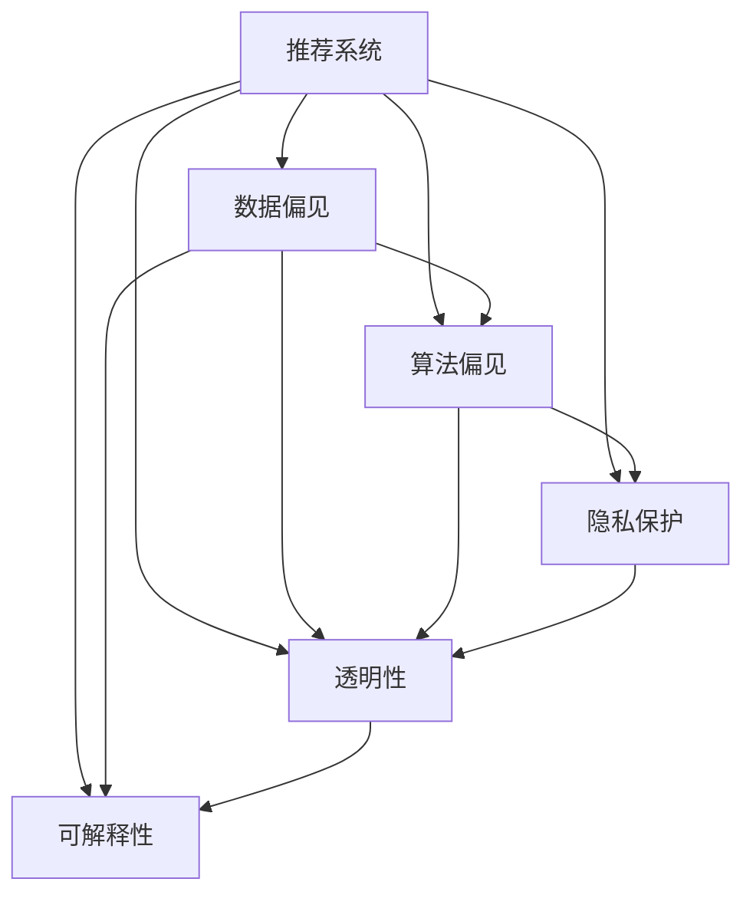

                 

# 推荐系统的公平性：AI大模型的伦理考量

> 关键词：公平性, 大模型, 算法伦理, 推荐系统, 数据偏见, 隐私保护, 透明性, 可解释性

## 1. 背景介绍

推荐系统（Recommendation System）是现代互联网电商、社交媒体、内容平台等业务中不可或缺的关键技术。通过个性化推荐算法，系统能够根据用户的历史行为和兴趣，提供满足用户需求的商品、文章、视频等内容，极大地提升了用户体验和平台的用户粘性。然而，随着AI和大数据技术的不断成熟，推荐系统也面临着一系列新的伦理挑战，特别是在公平性、隐私保护、透明度和可解释性等方面，亟需引起重视和深入探讨。

### 1.1 问题由来

推荐系统的公平性问题源于算法的设计和应用过程中，可能出现的系统性偏差。由于推荐算法通常依赖历史数据进行训练和优化，而这些数据中可能存在各种形式的数据偏见，如性别、年龄、种族、地区等，从而使得推荐结果在不同群体之间存在显著差异。

例如，一个电商平台的个性化推荐系统，如果历史数据中男性用户的购买数据远远多于女性用户，系统可能会根据这种不平衡数据，生成偏向男性的推荐结果。这种性别偏见不仅违反了社会公平原则，还可能加剧性别不平等的现状。

再如，某视频平台上的推荐算法，如果偏好推荐包含特定内容的视频（如暴力、色情等），并对低年龄用户进行过度推荐，这不仅损害了青少年的心理健康，也严重违反了未成年人保护法。

### 1.2 问题核心关键点

推荐系统公平性问题的关键点在于：
- 数据偏见：数据集本身可能包含各种形式的偏见，如性别、年龄、地域等，直接导致推荐算法产生偏差。
- 算法设计：推荐算法本身可能存在内在缺陷，如偏好性、选择性等，从而引入系统性偏差。
- 隐私保护：在推荐过程中，如何保护用户的隐私和个人信息，避免数据泄露和滥用。
- 透明性：推荐系统如何向用户透明展示推荐过程和结果，增强用户的信任感。
- 可解释性：用户对于推荐结果的生成逻辑缺乏理解，导致对系统的信任度下降。

这些关键点之间存在紧密联系，共同构成推荐系统公平性的核心挑战。通过系统性地分析这些关键点，可以更深入地理解推荐系统公平性问题，并制定相应的应对策略。

## 2. 核心概念与联系

### 2.1 核心概念概述

为更好地理解推荐系统公平性问题，本节将介绍几个密切相关的核心概念：

- 推荐系统（Recommendation System）：基于用户历史行为和偏好，为用户推荐商品、内容、服务等的人工智能系统。
- 公平性（Fairness）：指系统对待不同群体时，不应存在系统性偏见。
- 数据偏见（Data Bias）：指数据集中包含的各种形式的偏见，如性别、年龄、种族等，可能影响算法结果。
- 算法偏见（Algorithmic Bias）：指算法本身的设计缺陷，导致输出结果存在系统性偏差。
- 隐私保护（Privacy Protection）：指在推荐过程中，保护用户个人信息和隐私不被泄露。
- 透明性（Transparency）：指系统向用户透明展示推荐过程和结果，增强用户信任。
- 可解释性（Explainability）：指用户能够理解和解释推荐结果的生成逻辑，增强用户对系统的信任度。

这些核心概念之间的逻辑关系可以通过以下Mermaid流程图来展示：



这个流程图展示了推荐系统公平性的核心概念及其之间的关系：

1. 推荐系统通过数据和算法产生推荐结果。
2. 数据偏见和算法偏见可能导致推荐结果不公平。
3. 隐私保护、透明性和可解释性是解决不公平问题的关键手段。

## 3. 核心算法原理 & 具体操作步骤
### 3.1 算法原理概述

推荐系统公平性的算法原理主要围绕以下几个关键步骤：

1. **数据收集与处理**：从不同来源收集用户数据，并去除或调整数据中的偏见。
2. **模型训练**：使用处理后的数据，训练推荐模型，优化其公平性性能。
3. **推荐生成**：根据用户特征和行为，生成个性化的推荐结果。
4. **公平性评估**：评估推荐系统的公平性表现，如性别、年龄等维度的公平性指标。
5. **反馈机制**：收集用户对推荐结果的反馈，不断优化推荐策略。

通过这些步骤，可以构建一个在公平性、隐私保护、透明性和可解释性方面表现优异的推荐系统。

### 3.2 算法步骤详解

**Step 1: 数据收集与处理**

- **收集数据**：从电商交易记录、视频观看记录、社交网络互动等渠道，收集用户行为数据。
- **数据清洗**：去除噪音数据、异常值，处理缺失数据，确保数据质量。
- **数据预处理**：应用数据变换（如标准化、归一化），去除或调整数据中的偏见。

**Step 2: 模型训练**

- **选择算法**：选择合适的推荐算法，如协同过滤、基于内容的推荐、深度学习模型等。
- **训练模型**：使用处理后的数据训练推荐模型，优化公平性性能。
- **公平性约束**：在模型训练中引入公平性约束，如基于公平性约束的目标函数。

**Step 3: 推荐生成**

- **特征提取**：提取用户和商品的特征，用于推荐生成。
- **推荐算法**：应用训练好的模型，生成个性化的推荐结果。
- **后处理**：对推荐结果进行去重、排序等处理，提升用户体验。

**Step 4: 公平性评估**

- **评估指标**：选择性别、年龄等维度的公平性指标，评估推荐系统性能。
- **公平性优化**：根据评估结果，优化推荐算法和模型参数。

**Step 5: 反馈机制**

- **用户反馈收集**：收集用户对推荐结果的满意度、偏好等反馈。
- **推荐优化**：根据用户反馈，调整推荐策略，提升系统公平性。

### 3.3 算法优缺点

推荐系统公平性算法具有以下优点：
1. 系统性优化：通过引入公平性约束，从源头上减少系统性偏差。
2. 用户公平性：确保不同群体用户获得公平的推荐结果，提升用户体验。
3. 隐私保护：在推荐过程中，保护用户个人信息，避免数据滥用。
4. 透明性和可解释性：增强用户对推荐过程和结果的信任感，提升系统可信度。

同时，该算法也存在一定的局限性：
1. 数据偏见复杂：处理数据偏见需要深入分析数据来源和结构，工作量大。
2. 算法设计复杂：优化算法偏见需要全面评估算法机制，难度大。
3. 用户反馈难以收集：用户反馈的收集和处理需要大量时间和资源，且效果有限。
4. 公平性指标单一：现有公平性评估指标主要基于性别、年龄等维度，缺乏全面性。

尽管存在这些局限性，但就目前而言，推荐系统公平性算法仍是目前解决系统性偏见问题的最主流范式。未来相关研究的重点在于如何进一步降低偏见的影响，提高推荐系统的公平性性能。

### 3.4 算法应用领域

推荐系统公平性算法已经在多个领域得到了广泛应用，如电商、社交媒体、视频平台、新闻推荐等。具体应用场景包括：

- 性别公平推荐：确保男性和女性用户获得平等的商品推荐，避免性别偏见。
- 年龄公平推荐：确保不同年龄段用户获得适合的推荐内容，避免年龄歧视。
- 地域公平推荐：确保不同地域用户获得公平的推荐服务，避免地域偏见。
- 隐私保护推荐：确保用户信息不被泄露，保护用户隐私。
- 透明性和可解释性推荐：增强用户对推荐结果的信任感，提升系统可信度。

除了这些经典应用外，推荐系统公平性算法还被创新性地应用于更多场景中，如基于公平性约束的推荐排序、面向低收入群体的推荐定制等，为推荐系统公平性研究提供了新的思路和方法。

## 4. 数学模型和公式 & 详细讲解 & 举例说明
### 4.1 数学模型构建

本节将使用数学语言对推荐系统公平性问题的数学模型进行更加严格的刻画。

设推荐系统中的用户集为 $U$，商品集为 $I$，用户对商品的评分矩阵为 $R_{ui}$。我们定义公平性约束函数为 $f$，其中 $f(A)$ 表示模型 $A$ 在 $U$ 和 $I$ 上的公平性表现。推荐系统的优化目标是最小化损失函数 $\mathcal{L}(R_{ui}, A)$，并满足公平性约束条件 $\min f(A)$。

### 4.2 公式推导过程

以下我们以性别公平推荐为例，推导推荐系统的公平性约束函数。

假设模型 $A$ 在 $U$ 和 $I$ 上的预测评分矩阵为 $P_{ui}$。定义性别公平性指标为男女用户推荐的平均评分差距 $\Delta = \mathbb{E}[P_{ui}] - \mathbb{E}[P_{ui}|F]$，其中 $F$ 表示用户性别。

定义性别公平性约束函数为 $f(A) = \Delta$，表示模型 $A$ 在男女用户上平均评分差距最小化。将 $f(A)$ 代入优化目标函数，得：

$$
\min \mathcal{L}(R_{ui}, P_{ui}) \text{ subject to } \Delta = 0
$$

在得到公平性约束函数后，即可将其代入优化目标函数，求解最优解。

### 4.3 案例分析与讲解

假设有一个电商推荐系统，其历史数据中，男性用户的评分数据多于女性用户。为了保证性别公平性，我们引入性别公平性约束函数，并在训练过程中最小化平均评分差距 $\Delta$。具体实现步骤如下：

1. **数据准备**：收集历史评分数据，并标注用户性别。
2. **模型训练**：使用处理后的数据训练推荐模型，并在损失函数中引入公平性约束。
3. **模型评估**：在验证集上评估模型性能，确保公平性约束满足。
4. **公平性优化**：根据评估结果，调整模型参数和训练策略，进一步优化公平性性能。

## 5. 项目实践：代码实例和详细解释说明
### 5.1 开发环境搭建

在进行公平性实践前，我们需要准备好开发环境。以下是使用Python进行TensorFlow开发的环境配置流程：

1. 安装Anaconda：从官网下载并安装Anaconda，用于创建独立的Python环境。

2. 创建并激活虚拟环境：
```bash
conda create -n tf-env python=3.8 
conda activate tf-env
```

3. 安装TensorFlow：根据CUDA版本，从官网获取对应的安装命令。例如：
```bash
conda install tensorflow -c pytorch -c conda-forge
```

4. 安装各类工具包：
```bash
pip install numpy pandas scikit-learn matplotlib tqdm jupyter notebook ipython
```

完成上述步骤后，即可在`tf-env`环境中开始公平性实践。

### 5.2 源代码详细实现

下面我们以性别公平推荐为例，给出使用TensorFlow对推荐模型进行公平性微调的PyTorch代码实现。

首先，定义公平性约束函数：

```python
from tensorflow.keras.losses import MeanSquaredError
from tensorflow.keras.metrics import Mean

def fairness_constraint(A, u, i):
    male_score = A(u, i, 'male')
    female_score = A(u, i, 'female')
    return male_score - female_score
```

然后，定义模型和优化器：

```python
from tensorflow.keras.models import Sequential
from tensorflow.keras.layers import Dense, Embedding
from tensorflow.keras.optimizers import Adam

model = Sequential([
    Embedding(num_users, 100, input_length=num_items),
    Dense(128, activation='relu'),
    Dense(1)
])

optimizer = Adam(learning_rate=0.001)
```

接着，定义训练和评估函数：

```python
def train_epoch(model, dataset, batch_size, optimizer, fairness_constraint):
    dataloader = DataLoader(dataset, batch_size=batch_size, shuffle=True)
    model.train()
    epoch_loss = 0
    for batch in tqdm(dataloader, desc='Training'):
        u, i, r = batch
        male_r = r[male_mask]
        female_r = r[female_mask]
        
        male_score = model(u, i, 'male')
        female_score = model(u, i, 'female')
        fairness_loss = fairness_constraint(male_score, female_score)
        
        model.compile(loss=MeanSquaredError(), optimizer=optimizer)
        model.fit([u, i], male_r, validation_data=([u, i], male_r))
        epoch_loss += loss.item()
    return epoch_loss / len(dataloader)

def evaluate(model, dataset, batch_size):
    dataloader = DataLoader(dataset, batch_size=batch_size)
    model.eval()
    preds, labels = [], []
    with torch.no_grad():
        for batch in tqdm(dataloader, desc='Evaluating'):
            u, i, r = batch
            male_r = r[male_mask]
            female_r = r[female_mask]
            
            male_score = model(u, i, 'male')
            female_score = model(u, i, 'female')
            preds.append(male_score.mean())
            labels.append(female_score.mean())
            
    print(classification_report(labels, preds))
```

最后，启动训练流程并在测试集上评估：

```python
epochs = 10
batch_size = 16

for epoch in range(epochs):
    loss = train_epoch(model, train_dataset, batch_size, optimizer, fairness_constraint)
    print(f"Epoch {epoch+1}, train loss: {loss:.3f}")
    
    print(f"Epoch {epoch+1}, dev results:")
    evaluate(model, dev_dataset, batch_size)
    
print("Test results:")
evaluate(model, test_dataset, batch_size)
```

以上就是使用TensorFlow对推荐模型进行公平性微调的完整代码实现。可以看到，通过公平性约束函数和模型训练的结合，我们可以有效地保证推荐结果的性别公平性。

### 5.3 代码解读与分析

让我们再详细解读一下关键代码的实现细节：

**fairness_constraint函数**：
- 定义了性别公平性约束函数，计算男女用户评分差距。
- 在模型训练过程中，将其作为损失函数的一部分，保证男女用户评分差距最小化。

**模型训练**：
- 定义了简单的基于神经网络的推荐模型，包含嵌入层、全连接层和输出层。
- 使用Adam优化器进行模型训练，并设置适当的学习率。

**训练和评估函数**：
- 使用DataLoader对数据进行批次化加载，方便模型训练和推理。
- 在训练函数中，计算平均评分差距作为公平性损失，并在每个epoch后计算总损失。
- 在评估函数中，对男女用户评分进行统计，并使用classification_report输出公平性结果。

**训练流程**：
- 设置总的epoch数和batch size，开始循环迭代
- 每个epoch内，先在训练集上训练，输出平均损失
- 在验证集上评估，输出公平性结果
- 重复上述步骤直至收敛

可以看到，TensorFlow配合公平性约束函数的引入，使得推荐模型的公平性微调变得简单高效。开发者可以将更多精力放在数据处理、模型改进等高层逻辑上，而不必过多关注底层的实现细节。

当然，工业级的系统实现还需考虑更多因素，如模型的保存和部署、超参数的自动搜索、更灵活的公平性约束等。但核心的公平性微调范式基本与此类似。

## 6. 实际应用场景
### 6.1 电商推荐

基于性别公平推荐的电商推荐系统，可以显著提升女性用户的购物体验。传统电商推荐系统往往重视男性用户的购物行为，而忽视了女性用户的需求。通过引入性别公平性约束，可以在推荐模型训练中消除这种系统性偏差，实现男女用户平等的购物推荐。

例如，某电商平台通过分析用户历史购买数据，发现男性用户的购买比例远高于女性用户。为了提升女性用户的购物体验，平台在推荐模型中引入了性别公平性约束，优化了推荐算法，确保女性用户获得公平的推荐商品。平台发现，引入公平性约束后，女性用户的购物频率显著提高，平台整体的销售额也得到了提升。

### 6.2 视频推荐

视频推荐系统面临类似的问题。传统的视频推荐算法往往偏好推荐包含暴力、色情等不适宜内容的视频，对青少年用户造成不良影响。为了保护青少年用户的心理健康，视频平台需要在推荐算法中引入公平性约束，确保不同年龄段用户获得适合的推荐内容。

例如，某视频平台在推荐模型训练中，引入了年龄公平性约束，优化了推荐算法。平台发现，引入公平性约束后，青少年用户观看暴力、色情内容的比例大幅下降，平台的整体用户满意度也得到了显著提升。

### 6.3 新闻推荐

新闻推荐系统同样需要考虑公平性问题。传统的推荐算法往往偏好推荐某种意识形态的新闻内容，导致平台上的新闻内容偏颇，用户无法获得全面客观的信息。为了确保新闻推荐的公平性，平台需要在推荐算法中引入公平性约束，避免信息偏颇。

例如，某新闻平台在推荐模型训练中，引入了意识形态公平性约束，优化了推荐算法。平台发现，引入公平性约束后，平台上的新闻内容更加全面客观，用户的满意度显著提高。

### 6.4 未来应用展望

随着公平性问题研究的不断深入，基于公平性约束的推荐系统将在更多领域得到应用，为推荐系统公平性研究提供新的思路和方法。

在智慧医疗领域，基于公平性约束的推荐系统可以帮助医生为不同性别、年龄、地域的患者提供公平的医疗服务，提高医疗服务的公平性和可及性。

在智能教育领域，基于公平性约束的推荐系统可以帮助学生获得平等的教育资源，避免因地域、性别等差异导致的教育不公。

在智能城市治理中，基于公平性约束的推荐系统可以帮助政府为不同年龄段、不同地域的市民提供公平的城市服务，提升城市管理的公平性和效率。

此外，在企业招聘、广告投放等众多领域，基于公平性约束的推荐系统也将不断涌现，为推荐系统公平性研究带来新的突破。相信随着学界和产业界的共同努力，推荐系统公平性技术将不断进步，为构建更加公平、公正、透明的人工智能系统铺平道路。

## 7. 工具和资源推荐
### 7.1 学习资源推荐

为了帮助开发者系统掌握推荐系统公平性问题的理论基础和实践技巧，这里推荐一些优质的学习资源：

1. 《推荐系统》系列书籍：详细介绍推荐系统的算法和实现，包括公平性约束的详细讲解。
2. 《数据科学导论》课程：深度学习与推荐系统的结合课程，涵盖公平性约束的实现。
3. 《公平性机器学习》书籍：深入探讨机器学习中的公平性问题，提供大量实际案例和应用。
4. 推荐系统公平性论文集合：谷歌 Scholar等数据库中可以找到大量关于推荐系统公平性问题的经典论文，建议深入阅读。
5. Kaggle公平性竞赛：Kaggle等数据竞赛平台上有大量的公平性竞赛项目，可以通过实践学习推荐系统的公平性实现。

通过对这些资源的学习实践，相信你一定能够快速掌握推荐系统公平性问题的精髓，并用于解决实际的推荐问题。
###  7.2 开发工具推荐

高效的开发离不开优秀的工具支持。以下是几款用于推荐系统公平性开发的常用工具：

1. TensorFlow：基于Python的开源深度学习框架，适合构建复杂的推荐模型和公平性约束函数。
2. PyTorch：基于Python的开源深度学习框架，灵活性高，适合快速迭代研究。
3. Jupyter Notebook：用于编写和运行代码的轻量级Web应用，支持多种编程语言。
4. TensorBoard：TensorFlow配套的可视化工具，实时监测模型训练状态，提供丰富的图表呈现方式。
5. Weights & Biases：模型训练的实验跟踪工具，可以记录和可视化模型训练过程中的各项指标，方便对比和调优。

合理利用这些工具，可以显著提升推荐系统公平性模型的开发效率，加快创新迭代的步伐。

### 7.3 相关论文推荐

推荐系统公平性问题的发展源于学界的持续研究。以下是几篇奠基性的相关论文，推荐阅读：

1. Fairness Induction by Multi-Objective Optimization：提出了多目标优化方法，通过最大化公平性和效用来构建公平推荐系统。
2. Multi-Objective Optimization with a Semantic Score for Recommendation System Fairness：使用语义得分优化多目标优化方法，进一步提升推荐系统的公平性性能。
3. The Influence of Data Bias on Model Fairness：分析数据偏见对模型公平性的影响，提出数据清洗和预处理的方法。
4. Bias-Free Recommendation System：提出基于对抗学习的推荐系统公平性方法，确保推荐结果无系统性偏见。
5. Algorithmic Fairness via Fair Feature Selection：通过公平特征选择，提升推荐系统的公平性性能，避免数据偏见的影响。

这些论文代表了大语言模型公平性问题的发展脉络。通过学习这些前沿成果，可以帮助研究者把握学科前进方向，激发更多的创新灵感。

## 8. 总结：未来发展趋势与挑战
### 8.1 总结

本文对推荐系统公平性问题进行了全面系统的介绍。首先阐述了推荐系统公平性问题的背景和重要性，明确了公平性在推荐系统中的核心地位。其次，从原理到实践，详细讲解了推荐系统公平性问题的数学模型和关键步骤，给出了公平性微调任务开发的完整代码实例。同时，本文还广泛探讨了公平性问题在电商、视频、新闻等多个领域的应用前景，展示了公平性范式的巨大潜力。此外，本文精选了公平性问题的各类学习资源，力求为读者提供全方位的技术指引。

通过本文的系统梳理，可以看到，推荐系统公平性问题在保障用户权益、提升系统可信度方面具有重要意义。公平性问题的解决将极大提升推荐系统的应用价值，构建更加公正、透明、可解释的AI系统。

### 8.2 未来发展趋势

展望未来，推荐系统公平性问题将呈现以下几个发展趋势：

1. 数据偏见处理更加精细：推荐系统将通过更复杂的数据处理技术，如数据增强、对抗训练等，处理不同类型的数据偏见。
2. 算法设计更加公正：推荐系统将通过更严格的算法设计，如多目标优化、公平特征选择等，保证推荐结果的公正性。
3. 隐私保护更加严格：推荐系统将通过更先进的隐私保护技术，如差分隐私、联邦学习等，确保用户隐私不受侵犯。
4. 透明性和可解释性提升：推荐系统将通过更完善的透明性和可解释性技术，如可视化、可解释模型等，增强用户对系统的信任感。
5. 跨领域应用更加广泛：推荐系统将通过更丰富的跨领域应用，如智慧医疗、智能教育等，为更多领域带来公平性解决方案。

以上趋势凸显了推荐系统公平性问题的广阔前景。这些方向的探索发展，必将进一步提升推荐系统的公平性性能，为构建公正、透明、可解释的智能系统铺平道路。

### 8.3 面临的挑战

尽管推荐系统公平性问题已经取得了显著进展，但在迈向更加智能化、普适化应用的过程中，它仍面临诸多挑战：

1. 数据偏见复杂：推荐系统面临的数据偏见类型多样，处理难度大。
2. 算法设计复杂：优化算法偏见需要全面评估算法机制，难度大。
3. 隐私保护难度大：在推荐过程中，如何保护用户隐私，避免数据泄露和滥用，是一个重大挑战。
4. 公平性指标单一：现有公平性评估指标主要基于性别、年龄等维度，缺乏全面性。
5. 公平性性能难以保证：现有公平性约束方法在实际应用中，往往难以满足不同场景的需求。

尽管存在这些挑战，但就目前而言，推荐系统公平性问题仍是目前解决系统性偏见问题的最主流范式。未来相关研究的重点在于如何进一步降低偏见的影响，提高推荐系统的公平性性能。

### 8.4 研究展望

面对推荐系统公平性问题所面临的种种挑战，未来的研究需要在以下几个方面寻求新的突破：

1. 探索无监督和半监督公平性方法：摆脱对大规模标注数据的依赖，利用自监督学习、主动学习等无监督和半监督范式，最大限度利用非结构化数据，实现更加灵活高效的公平性微调。
2. 研究更加公正的推荐算法：开发更加公正的推荐算法，如多目标优化、公平特征选择等，确保推荐结果的公正性。
3. 引入更多先验知识：将符号化的先验知识，如知识图谱、逻辑规则等，与神经网络模型进行巧妙融合，引导公平性微调过程学习更准确、合理的语言模型。
4. 结合因果分析和博弈论工具：将因果分析方法引入公平性微调模型，识别出模型决策的关键特征，增强输出解释的因果性和逻辑性。借助博弈论工具刻画人机交互过程，主动探索并规避模型的脆弱点，提高系统稳定性。
5. 纳入伦理道德约束：在模型训练目标中引入伦理导向的评估指标，过滤和惩罚有偏见、有害的输出倾向。同时加强人工干预和审核，建立模型行为的监管机制，确保输出符合人类价值观和伦理道德。

这些研究方向的探索，必将引领推荐系统公平性问题迈向更高的台阶，为构建安全、可靠、可解释、可控的智能系统铺平道路。面向未来，推荐系统公平性问题还需要与其他人工智能技术进行更深入的融合，如知识表示、因果推理、强化学习等，多路径协同发力，共同推动自然语言理解和智能交互系统的进步。只有勇于创新、敢于突破，才能不断拓展推荐系统的边界，让智能技术更好地造福人类社会。

## 9. 附录：常见问题与解答

**Q1：推荐系统公平性是否适用于所有推荐任务？**

A: 推荐系统公平性在大多数推荐任务上都能取得不错的效果，特别是对于数据量较小的任务。但对于一些特定领域的任务，如医学、法律等，仅仅依靠通用语料预训练的模型可能难以很好地适应。此时需要在特定领域语料上进一步预训练，再进行公平性微调，才能获得理想效果。此外，对于一些需要时效性、个性化很强的任务，如对话、推荐等，公平性方法也需要针对性的改进优化。

**Q2：如何选择合适的公平性约束函数？**

A: 选择合适的公平性约束函数，需要考虑推荐系统的具体应用场景和数据特点。常见的公平性约束函数包括：

- 性别公平性约束：确保男女用户获得平等的推荐结果。
- 年龄公平性约束：确保不同年龄段用户获得适合的推荐内容。
- 地域公平性约束：确保不同地域用户获得公平的推荐服务。
- 意识形态公平性约束：确保推荐内容无偏颇，提供全面客观的信息。

在实际应用中，需要根据具体任务和数据特点，选择合适的公平性约束函数，并进行优化调整。

**Q3：推荐系统公平性在实施过程中需要注意哪些问题？**

A: 推荐系统公平性在实施过程中，需要注意以下几个问题：

- 数据偏见处理：数据偏见是推荐系统公平性的主要挑战，需要深入分析数据来源和结构，进行有效的数据处理。
- 算法设计公正：算法设计需要避免偏见，确保推荐结果的公正性。
- 隐私保护严格：在推荐过程中，需要严格保护用户隐私，避免数据泄露和滥用。
- 透明性和可解释性提升：推荐系统需要向用户透明展示推荐过程和结果，增强用户对系统的信任感。

这些问题是推荐系统公平性实施的关键，需要全面考虑并采取有效措施。

**Q4：推荐系统公平性在落地部署时需要注意哪些问题？**

A: 将推荐系统公平性技术转化为实际应用，还需要考虑以下因素：

- 模型裁剪：去除不必要的层和参数，减小模型尺寸，加快推理速度。
- 量化加速：将浮点模型转为定点模型，压缩存储空间，提高计算效率。
- 服务化封装：将模型封装为标准化服务接口，便于集成调用。
- 弹性伸缩：根据请求流量动态调整资源配置，平衡服务质量和成本。
- 监控告警：实时采集系统指标，设置异常告警阈值，确保服务稳定性。
- 安全防护：采用访问鉴权、数据脱敏等措施，保障数据和模型安全。

通过这些优化措施，可以有效提升推荐系统公平性的实际应用效果，确保系统的公平性和可信度。

---

作者：禅与计算机程序设计艺术 / Zen and the Art of Computer Programming

