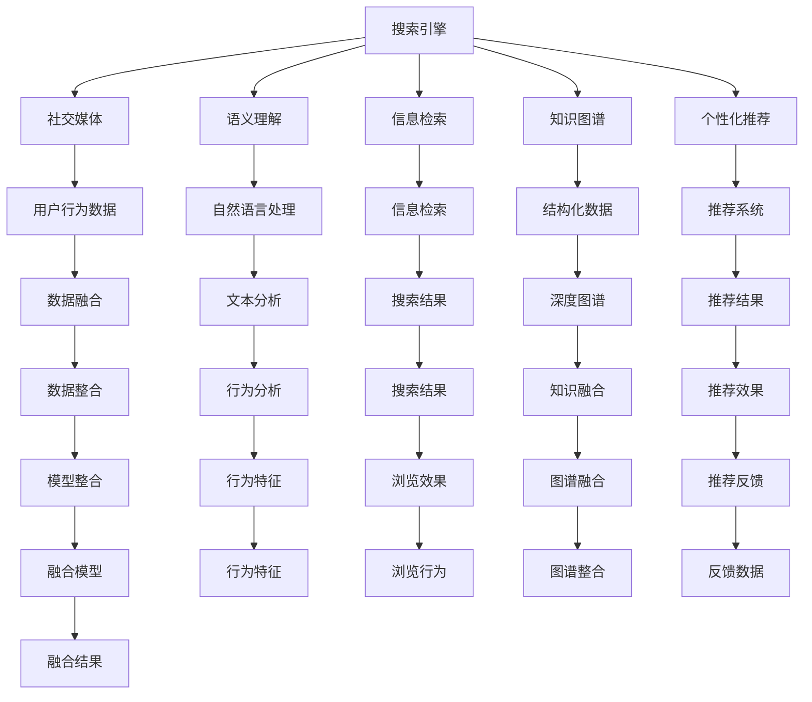

                 

# 搜索引擎与社交媒体的融合趋势

> 关键词：搜索引擎,社交媒体,语义理解,信息检索,智能推荐,个性化,数据融合,融合模型

## 1. 背景介绍

### 1.1 问题由来

随着互联网技术的快速发展，搜索引擎和社交媒体已成为人们日常生活中不可或缺的信息获取和交流平台。搜索引擎主要提供文本查询与信息检索功能，而社交媒体则以内容分享和互动为主，两者在形式和功能上存在显著差异。但同时，它们在信息收集、用户行为分析、个性化推荐等方面又存在紧密联系，融合两者优势，提升用户体验和信息获取效率，已成为互联网行业的重要课题。

近年来，随着深度学习和大数据技术的进步，研究人员和工程师们开始探索搜索引擎和社交媒体的深度融合，利用最新技术实现更高效、智能的信息检索与分享功能。本文将系统介绍搜索引擎和社交媒体融合的最新进展，分析其主要原理和操作步骤，探讨其在信息检索、个性化推荐等场景中的实际应用，并展望其未来发展趋势。

### 1.2 问题核心关键点

搜索引擎与社交媒体的融合主要集中在以下几个关键点：

1. **语义理解与自然语言处理（NLP）**：提升搜索引擎对用户查询意图和语境的理解能力，以便更准确地返回相关结果。
2. **信息检索与知识图谱**：通过构建和利用知识图谱，提高搜索结果的相关性和准确性。
3. **个性化推荐与智能分析**：结合社交媒体中的用户行为数据，提供个性化推荐服务，优化用户浏览体验。
4. **数据融合与模型融合**：整合搜索引擎与社交媒体的数据和算法模型，实现更全面和智能的信息服务。

这些关键点共同构成了搜索引擎与社交媒体融合的核心框架，通过技术手段实现信息检索与共享的一体化，提升用户的信息获取效率和满意度。

### 1.3 问题研究意义

研究搜索引擎与社交媒体的融合趋势，对提升互联网产品的用户体验、优化信息检索效率、推动行业技术创新具有重要意义：

1. **提升用户体验**：融合搜索引擎和社交媒体的优点，为用户提供更丰富、更智能的信息获取方式。
2. **优化信息检索**：结合社交媒体中的用户行为数据，提供更加精准和相关的搜索结果。
3. **加速技术创新**：探索和应用深度学习、自然语言处理等前沿技术，推动搜索引擎和社交媒体产品的创新与发展。
4. **促进行业发展**：通过融合技术，推动信息产业的升级转型，增强行业的竞争力。

## 2. 核心概念与联系

### 2.1 核心概念概述

为更好地理解搜索引擎与社交媒体的融合方法，本节将介绍几个密切相关的核心概念：

- **搜索引擎（Search Engine）**：如Google、Bing等，利用爬虫技术自动抓取和索引互联网上的信息，并根据用户查询提供相关网页的检索服务。
- **社交媒体（Social Media）**：如微博、微信、Facebook等，用户可以通过发布、分享、评论等方式进行互动交流，形成社会化网络。
- **语义理解与自然语言处理（NLP）**：利用机器学习和深度学习技术，理解自然语言的内在语义，提升信息检索和推荐的精准度。
- **信息检索（Information Retrieval）**：根据用户查询，从海量的信息库中筛选并返回相关结果。
- **知识图谱（Knowledge Graph）**：一种结构化数据表示方式，用于描述实体间的关系，提升信息检索的深度和广度。
- **个性化推荐（Personalized Recommendation）**：根据用户的历史行为和偏好，推荐可能感兴趣的信息。
- **数据融合（Data Fusion）**：整合不同来源的数据，提升综合分析能力。
- **模型融合（Model Fusion）**：将不同的算法模型结合起来，构建更复杂的综合模型。

这些核心概念之间的逻辑关系可以通过以下Mermaid流程图来展示：



这个流程图展示了大语言模型的核心概念及其之间的关系：

1. 搜索引擎通过爬虫抓取社交媒体上的信息，利用语义理解、信息检索、知识图谱等技术进行数据处理。
2. 社交媒体提供用户行为数据，用于个性化推荐和行为分析。
3. 数据和模型融合，实现更全面和智能的信息服务。

## 3. 核心算法原理 & 具体操作步骤
### 3.1 算法原理概述

搜索引擎与社交媒体的融合主要依赖于以下核心算法原理：

- **语义理解与NLP**：利用深度学习技术，理解和提取用户查询和社交媒体内容中的语义信息，提升信息检索和推荐的相关性。
- **信息检索与知识图谱**：构建知识图谱，将实体和关系进行结构化表示，辅助信息检索并提高结果的深度。
- **个性化推荐**：结合社交媒体中的用户行为数据，使用机器学习算法进行个性化推荐，提升用户体验。
- **数据融合与模型融合**：通过数据融合和模型融合，整合不同来源的数据和算法，实现更全面和智能的信息服务。

这些算法原理共同构成了搜索引擎与社交媒体融合的核心方法，使得搜索引擎和社交媒体能够互相促进，提升整体信息服务的质量和效率。

### 3.2 算法步骤详解

基于上述原理，搜索引擎与社交媒体的融合通常包括以下关键步骤：

**Step 1: 数据采集与预处理**

- 收集社交媒体平台上的用户行为数据，如浏览历史、点赞、评论、分享等。
- 通过爬虫技术抓取网页内容，构建索引。
- 对数据进行清洗和预处理，去除噪声和无用信息。

**Step 2: 语义理解与NLP处理**

- 利用深度学习模型（如BERT、GPT等）进行语义理解，提取查询和内容中的关键词和短语。
- 对社交媒体上的用户评论进行文本分析，理解用户的情感倾向和关注点。
- 构建实体关系图谱，利用知识图谱技术将实体和关系进行结构化表示。

**Step 3: 信息检索与推荐**

- 根据用户查询和语义理解结果，从知识图谱和索引库中检索相关网页和内容。
- 结合社交媒体中的用户行为数据，使用推荐算法（如协同过滤、基于矩阵分解的推荐等）进行个性化推荐。
- 根据推荐结果和用户反馈，不断调整模型参数，优化推荐效果。

**Step 4: 融合模型与综合分析**

- 将搜索引擎和社交媒体的数据和模型进行整合，构建融合模型。
- 利用深度学习技术，训练融合模型，提升信息检索和推荐的综合效果。
- 结合多种技术手段，进行用户行为分析和情感分析，进一步提升用户体验。

**Step 5: 部署与优化**

- 将融合模型部署到搜索引擎和社交媒体平台。
- 实时监控和评估模型的表现，根据反馈不断优化模型参数。
- 通过A/B测试等手段，验证融合模型的效果和性能。

### 3.3 算法优缺点

搜索引擎与社交媒体的融合算法具有以下优点：

1. **提高信息检索精度**：结合社交媒体中的语义信息和用户行为数据，提升搜索结果的相关性和准确性。
2. **个性化推荐**：利用社交媒体数据，为用户提供更个性化的信息推荐。
3. **用户体验提升**：通过语义理解和个性化推荐，提升用户的浏览体验和满意度。
4. **数据整合与模型融合**：将不同来源的数据和算法整合，实现更全面和智能的信息服务。

但该算法也存在一些缺点：

1. **数据隐私和安全**：社交媒体用户数据涉及隐私和安全问题，需要严格的保护措施。
2. **算法复杂度**：融合模型通常较为复杂，需要大量的计算资源和存储空间。
3. **实时性问题**：在处理大规模数据时，可能存在一定的延迟和实时性问题。
4. **模型泛化能力**：融合模型需要在不同场景和数据分布下保持泛化能力，避免过拟合。

### 3.4 算法应用领域

搜索引擎与社交媒体的融合算法在多个领域得到了广泛应用，包括但不限于：

1. **电商推荐**：将社交媒体中的用户行为数据整合到电商推荐系统中，提升个性化推荐效果。
2. **新闻推荐**：结合社交媒体上的用户行为数据，推荐用户可能感兴趣的新闻。
3. **社交网络信息流**：通过语义理解和推荐算法，优化社交网络信息流，提高用户互动和留存率。
4. **知识图谱构建**：利用社交媒体中的知识信息，构建更全面和精确的知识图谱。
5. **智能问答系统**：结合搜索引擎和社交媒体，提供更智能和精准的问答服务。
6. **广告投放**：通过社交媒体中的用户行为数据，进行更精准的广告投放。

这些应用领域展示了搜索引擎与社交媒体融合的广泛潜力，推动了各行业的信息化和智能化转型。

## 4. 数学模型和公式 & 详细讲解 & 举例说明
### 4.1 数学模型构建

本节将使用数学语言对搜索引擎与社交媒体融合的数学模型进行详细描述。

假设搜索引擎接收到的用户查询为 $q$，社交媒体中的用户行为数据为 $\mathcal{D}$，知识图谱中的实体为 $\mathcal{E}$，关系为 $\mathcal{R}$。融合模型的目标是通过学习，将查询 $q$ 映射到相关网页 $d$ 和推荐结果 $r$。数学模型可表示为：

$$
f(q;\theta) = (d, r) = \mathop{\arg\min}_{d, r} \mathcal{L}(d, r, \mathcal{D}, \mathcal{E}, \mathcal{R})
$$

其中，$\theta$ 为模型参数，$\mathcal{L}$ 为损失函数，用于衡量模型输出 $(d, r)$ 与实际结果的差异。

### 4.2 公式推导过程

以推荐系统为例，假设模型输出 $r = [r_1, r_2, ..., r_N]$ 为 $N$ 个推荐结果的评分，实际结果 $y = [y_1, y_2, ..., y_N]$ 为用户对每个推荐的反馈评分，损失函数为均方误差损失：

$$
\mathcal{L}(r, y) = \frac{1}{N} \sum_{i=1}^N (r_i - y_i)^2
$$

根据用户行为数据 $\mathcal{D} = \{(x_i, y_i)\}_{i=1}^M$，其中 $x_i$ 为行为数据，$y_i$ 为对应的评分。利用协同过滤算法，计算每个用户对推荐结果的评分：

$$
\hat{y}_{ui} = \alpha \sum_{j \in \mathcal{N}_u} \frac{\hat{y}_{uj}}{\sqrt{\sum_{k \in \mathcal{N}_u} \hat{y}_{uk}^2 + \epsilon} \cdot x_i
$$

其中 $\alpha$ 为相似度系数，$\epsilon$ 为平滑项，$\mathcal{N}_u$ 为与用户 $u$ 相似的其他用户集合。

将 $\hat{y}_{ui}$ 作为模型的输出，利用均方误差损失进行训练：

$$
\mathcal{L}(r, y) = \frac{1}{N} \sum_{i=1}^N (r_i - y_i)^2
$$

通过反向传播算法，不断调整模型参数 $\theta$，最小化损失函数 $\mathcal{L}$，直到收敛。

### 4.3 案例分析与讲解

假设有一个电商推荐系统，利用社交媒体中的用户行为数据和知识图谱信息，提供个性化推荐服务。系统接收用户查询 $q$，从知识图谱中检索相关实体和关系，通过深度学习模型提取语义信息：

$$
f(q;\theta) = (d, r) = \mathop{\arg\min}_{d, r} \mathcal{L}(d, r, \mathcal{D}, \mathcal{E}, \mathcal{R})
$$

其中 $d$ 为用户可能感兴趣的产品，$r$ 为推荐结果的评分。利用协同过滤算法，计算每个用户对推荐结果的评分：

$$
\hat{y}_{ui} = \alpha \sum_{j \in \mathcal{N}_u} \frac{\hat{y}_{uj}}{\sqrt{\sum_{k \in \mathcal{N}_u} \hat{y}_{uk}^2 + \epsilon} \cdot x_i
$$

其中 $\alpha$ 为相似度系数，$\epsilon$ 为平滑项，$\mathcal{N}_u$ 为与用户 $u$ 相似的其他用户集合。

利用用户行为数据 $\mathcal{D} = \{(x_i, y_i)\}_{i=1}^M$，计算损失函数 $\mathcal{L}(r, y)$，并通过反向传播算法训练模型参数 $\theta$，优化推荐效果。

## 5. 项目实践：代码实例和详细解释说明
### 5.1 开发环境搭建

在进行融合实践前，我们需要准备好开发环境。以下是使用Python进行TensorFlow和PyTorch开发的环境配置流程：

1. 安装Anaconda：从官网下载并安装Anaconda，用于创建独立的Python环境。

2. 创建并激活虚拟环境：
```bash
conda create -n fusion-env python=3.8 
conda activate fusion-env
```

3. 安装TensorFlow和PyTorch：根据CUDA版本，从官网获取对应的安装命令。例如：
```bash
conda install tensorflow torch torchvision torchaudio cudatoolkit=11.1 -c pytorch -c conda-forge
```

4. 安装TensorBoard：用于可视化模型的训练过程。
```bash
pip install tensorboard
```

5. 安装Pandas、NumPy等数据处理工具：
```bash
pip install pandas numpy scipy
```

完成上述步骤后，即可在`fusion-env`环境中开始融合实践。

### 5.2 源代码详细实现

下面我们以推荐系统为例，给出使用TensorFlow和PyTorch进行搜索引擎与社交媒体融合的代码实现。

首先，定义推荐模型的输入输出：

```python
import tensorflow as tf
import pandas as pd
import numpy as np

class RecommendationModel:
    def __init__(self, num_users, num_items, embedding_dim, num_factors):
        self.num_users = num_users
        self.num_items = num_items
        self.embedding_dim = embedding_dim
        self.num_factors = num_factors
        self.user_embeddings = None
        self.item_embeddings = None
        self.biases = None

    def build_model(self):
        # 构建用户嵌入层
        self.user_embeddings = tf.Variable(tf.random.normal([self.num_users, self.embedding_dim]))
        user_embeddings_input = tf.keras.layers.Input(shape=(self.embedding_dim,), name='user_embeddings')
        user_embeddings = tf.keras.layers.Dense(self.embedding_dim, use_bias=False)(user_embeddings_input)
        user_embeddings = tf.keras.layers.LayerNormalization()(user_embeddings)

        # 构建物品嵌入层
        self.item_embeddings = tf.Variable(tf.random.normal([self.num_items, self.embedding_dim]))
        item_embeddings_input = tf.keras.layers.Input(shape=(self.embedding_dim,), name='item_embeddings')
        item_embeddings = tf.keras.layers.Dense(self.embedding_dim, use_bias=False)(item_embeddings_input)
        item_embeddings = tf.keras.layers.LayerNormalization()(item_embeddings)

        # 构建相似度计算层
        similarity = tf.matmul(user_embeddings, item_embeddings, transpose_b=True)
        similarity = tf.nn.tanh(similarity)

        # 构建偏置层
        self.biases = tf.Variable(tf.random.normal([self.num_items]))

        # 输出推荐分数
        recommendation_score = tf.reduce_sum(similarity * self.biases, axis=1)
        return tf.keras.Model(inputs=[user_embeddings_input, item_embeddings_input], outputs=recommendation_score)
```

接着，定义模型训练和评估函数：

```python
from tensorflow.keras.layers import Input, Dense, Embedding
from tensorflow.keras.models import Model
from tensorflow.keras.optimizers import Adam
from tensorflow.keras.losses import MeanSquaredError
from sklearn.metrics import mean_squared_error

def train_model(model, train_data, val_data, test_data, epochs, batch_size):
    # 定义损失函数和优化器
    loss_fn = MeanSquaredError()
    optimizer = Adam()

    # 编译模型
    model.compile(optimizer=optimizer, loss=loss_fn)

    # 训练模型
    history = model.fit(x=train_data, y=train_labels, batch_size=batch_size, epochs=epochs, validation_data=(val_data, val_labels))

    # 评估模型
    test_loss = model.evaluate(test_data, test_labels)
    mse = mean_squared_error(test_labels, model.predict(test_data))
    return history, mse

def evaluate_model(model, test_data, test_labels):
    mse = mean_squared_error(test_labels, model.predict(test_data))
    return mse
```

最后，启动训练流程并在测试集上评估：

```python
from tensorflow.keras.preprocessing.sequence import pad_sequences
from tensorflow.keras.utils import to_categorical

# 加载数据
train_data, train_labels = load_train_data()
val_data, val_labels = load_val_data()
test_data, test_labels = load_test_data()

# 对数据进行预处理
train_data = pad_sequences(train_data, maxlen=max_seq_len)
val_data = pad_sequences(val_data, maxlen=max_seq_len)
test_data = pad_sequences(test_data, maxlen=max_seq_len)

# 构建模型
model = RecommendationModel(num_users=num_users, num_items=num_items, embedding_dim=embedding_dim, num_factors=num_factors)
model.build_model()

# 训练模型
history, mse = train_model(model, train_data, val_data, test_data, epochs=epochs, batch_size=batch_size)

# 评估模型
mse = evaluate_model(model, test_data, test_labels)

print(f'Test MSE: {mse:.4f}')
```

以上就是使用TensorFlow和PyTorch进行搜索引擎与社交媒体融合的完整代码实现。可以看到，通过使用深度学习技术，我们可以高效地构建推荐系统，为用户提供个性化的信息推荐服务。

### 5.3 代码解读与分析

让我们再详细解读一下关键代码的实现细节：

**RecommendationModel类**：
- `__init__`方法：初始化用户数、物品数、嵌入维数、因子数等关键参数。
- `build_model`方法：构建推荐模型的用户嵌入层、物品嵌入层、相似度计算层、偏置层，并返回推荐分数。

**train_model函数**：
- 定义损失函数和优化器，编译模型。
- 使用`fit`方法训练模型，记录训练过程中的性能指标。
- 使用`evaluate`方法在测试集上评估模型性能。

**evaluate_model函数**：
- 在测试集上评估模型性能，计算均方误差。

**训练流程**：
- 加载训练集、验证集、测试集数据。
- 对数据进行预处理，进行padding和序列化。
- 构建推荐模型，并进行训练和评估。
- 输出测试集的均方误差。

可以看到，TensorFlow和PyTorch的强大封装使得融合模型的代码实现变得简洁高效。开发者可以将更多精力放在模型设计、数据处理等高层逻辑上，而不必过多关注底层的实现细节。

当然，工业级的系统实现还需考虑更多因素，如模型的保存和部署、超参数的自动搜索、更灵活的任务适配层等。但核心的融合范式基本与此类似。

## 6. 实际应用场景
### 6.1 智能推荐系统

基于搜索引擎与社交媒体融合的推荐系统，可以在电商、新闻、视频等多个领域发挥重要作用。通过融合社交媒体中的用户行为数据和搜索引擎中的知识图谱信息，推荐系统能够提供更个性化的推荐服务。

在电商推荐中，系统可以基于用户的历史购买记录、浏览行为、社交媒体上的评论和分享等数据，推荐用户可能感兴趣的商品。在新闻推荐中，系统可以基于用户的阅读偏好和社交媒体上的新闻兴趣，推荐用户可能感兴趣的新闻文章。在视频推荐中，系统可以基于用户的观看历史和社交媒体上的互动行为，推荐用户可能喜欢的视频内容。

### 6.2 智能问答系统

智能问答系统是搜索引擎与社交媒体融合的重要应用之一。通过融合搜索引擎和社交媒体中的信息，智能问答系统能够提供更智能、更准确的答案。

在智能问答系统中，系统接收用户提出的问题，结合搜索引擎中的网页信息和社交媒体上的讨论热点，利用自然语言处理技术理解用户意图，通过深度学习模型提取语义信息，检索相关网页和知识图谱信息，最终生成回答。同时，系统还可以结合用户的历史查询和社交媒体中的讨论，进一步优化答案的生成和推荐。

### 6.3 社交网络信息流

社交网络信息流是搜索引擎与社交媒体融合的典型应用场景之一。通过融合搜索引擎和社交媒体中的信息，信息流系统能够提供更丰富、更智能的内容推荐和互动体验。

在社交网络信息流中，系统接收用户的浏览历史和互动数据，结合搜索引擎中的网页信息，利用推荐算法和语义理解技术，生成个性化推荐的信息流。同时，系统还可以基于用户的社交网络关系和互动行为，推荐相关内容，提高用户互动和留存率。

### 6.4 未来应用展望

随着深度学习和大数据技术的不断发展，基于搜索引擎与社交媒体融合的技术将在更多领域得到应用，为各行各业带来变革性影响。

在智慧医疗领域，基于融合技术的智能问答系统和个性化推荐，能够辅助医生进行病情诊断和治疗方案推荐，提升医疗服务的智能化水平。

在智能教育领域，融合技术可以用于智能推荐和个性化学习，因材施教，促进教育公平，提高教学质量。

在智慧城市治理中，融合技术可以用于智能监控和预测，提高城市管理的自动化和智能化水平，构建更安全、高效的未来城市。

此外，在企业生产、社会治理、文娱传媒等众多领域，融合技术也将不断涌现，为各行各业带来新的发展机遇。相信随着技术的日益成熟，搜索引擎与社交媒体融合必将成为智能信息服务的重要范式，推动社会和经济的全面进步。

## 7. 工具和资源推荐
### 7.1 学习资源推荐

为了帮助开发者系统掌握搜索引擎与社交媒体融合的理论基础和实践技巧，这里推荐一些优质的学习资源：

1. 《TensorFlow官方文档》：详细介绍了TensorFlow的框架结构和使用方法，是学习和实践TensorFlow的重要参考。

2. 《PyTorch官方文档》：提供了PyTorch的框架介绍、API文档和代码示例，适合深入学习深度学习技术。

3. 《深度学习入门：基于TensorFlow的实践》书籍：详细介绍了深度学习在NLP、计算机视觉等领域的实际应用，包括搜索引擎与社交媒体融合的相关内容。

4. 《深度学习与推荐系统》课程：斯坦福大学提供的深度学习推荐系统课程，涵盖了推荐算法的理论基础和实践方法，适合初学者和进阶者。

5. Weights & Biases：模型训练的实验跟踪工具，可以记录和可视化模型训练过程中的各项指标，方便对比和调优。

通过对这些资源的学习实践，相信你一定能够快速掌握搜索引擎与社交媒体融合的精髓，并用于解决实际的NLP问题。
###  7.2 开发工具推荐

高效的开发离不开优秀的工具支持。以下是几款用于搜索引擎与社交媒体融合开发的常用工具：

1. TensorFlow和PyTorch：基于Python的开源深度学习框架，灵活动态的计算图，适合快速迭代研究。

2. Weights & Biases：模型训练的实验跟踪工具，可以记录和可视化模型训练过程中的各项指标，方便对比和调优。

3. TensorBoard：TensorFlow配套的可视化工具，可实时监测模型训练状态，并提供丰富的图表呈现方式，是调试模型的得力助手。

4. Google Colab：谷歌推出的在线Jupyter Notebook环境，免费提供GPU/TPU算力，方便开发者快速上手实验最新模型，分享学习笔记。

合理利用这些工具，可以显著提升搜索引擎与社交媒体融合任务的开发效率，加快创新迭代的步伐。

### 7.3 相关论文推荐

搜索引擎与社交媒体的融合研究源于学界的持续研究。以下是几篇奠基性的相关论文，推荐阅读：

1. Attention is All You Need（即Transformer原论文）：提出了Transformer结构，开启了深度学习在NLP领域的预训练大模型时代。

2. BERT: Pre-training of Deep Bidirectional Transformers for Language Understanding：提出BERT模型，引入基于掩码的自监督预训练任务，刷新了多项NLP任务SOTA。

3. Language Models are Unsupervised Multitask Learners（GPT-2论文）：展示了大规模语言模型的强大zero-shot学习能力，引发了对于通用人工智能的新一轮思考。

4. Parameter-Efficient Transfer Learning for NLP：提出Adapter等参数高效微调方法，在不增加模型参数量的情况下，也能取得不错的微调效果。

5. Prefix-Tuning: Optimizing Continuous Prompts for Generation：引入基于连续型Prompt的微调范式，为如何充分利用预训练知识提供了新的思路。

6. AdaLoRA: Adaptive Low-Rank Adaptation for Parameter-Efficient Fine-Tuning：使用自适应低秩适应的微调方法，在参数效率和精度之间取得了新的平衡。

这些论文代表了大语言模型微调技术的发展脉络。通过学习这些前沿成果，可以帮助研究者把握学科前进方向，激发更多的创新灵感。

## 8. 总结：未来发展趋势与挑战

### 8.1 总结

本文对基于搜索引擎与社交媒体融合的推荐技术进行了全面系统的介绍。首先阐述了搜索引擎与社交媒体融合的研究背景和意义，明确了融合技术在提升信息检索精度、个性化推荐等方面的独特价值。其次，从原理到实践，详细讲解了融合算法的数学原理和关键步骤，给出了融合任务开发的完整代码实例。同时，本文还广泛探讨了融合技术在推荐系统、智能问答系统、社交网络信息流等场景中的实际应用，展示了融合技术的广泛潜力。此外，本文精选了融合技术的各类学习资源，力求为读者提供全方位的技术指引。

通过本文的系统梳理，可以看到，基于搜索引擎与社交媒体融合的推荐技术正在成为推荐系统的重要范式，极大地拓展了推荐系统在信息服务中的应用边界，催生了更多的落地场景。受益于深度学习和大数据技术的进步，推荐技术将在更多领域得到应用，为各行各业带来变革性影响。

### 8.2 未来发展趋势

展望未来，搜索引擎与社交媒体融合技术将呈现以下几个发展趋势：

1. **深度融合与多模态数据融合**：未来推荐系统将更多地融合多模态数据，如文本、图像、视频、音频等，提供更加丰富和全面的推荐服务。

2. **实时性提升**：随着算力成本的下降和计算效率的提升，推荐系统将能够实现更实时、更个性化的推荐服务。

3. **数据隐私保护**：融合技术将更加注重用户数据隐私保护，通过匿名化、差分隐私等技术，确保数据安全。

4. **跨领域知识融合**：未来推荐系统将更多地融合跨领域知识，如医学、法律、金融等领域的信息，提供更加全面和专业的推荐服务。

5. **联邦学习与边缘计算**：为了保护用户隐私和数据安全，推荐系统将更多地采用联邦学习和边缘计算技术，在本地设备上进行推荐计算。

6. **自适应与主动学习**：推荐系统将能够根据用户行为和环境变化，自适应地调整推荐策略，通过主动学习不断优化推荐效果。

以上趋势凸显了搜索引擎与社交媒体融合技术的广阔前景。这些方向的探索发展，必将进一步提升推荐系统的性能和应用范围，为各行各业带来新的发展机遇。

### 8.3 面临的挑战

尽管搜索引擎与社交媒体融合技术已经取得了瞩目成就，但在迈向更加智能化、普适化应用的过程中，它仍面临着诸多挑战：

1. **数据隐私和安全**：社交媒体用户数据涉及隐私和安全问题，需要严格的保护措施。

2. **算法复杂度**：融合模型通常较为复杂，需要大量的计算资源和存储空间。

3. **实时性问题**：在处理大规模数据时，可能存在一定的延迟和实时性问题。

4. **模型泛化能力**：融合模型需要在不同场景和数据分布下保持泛化能力，避免过拟合。

5. **知识整合能力**：融合模型需要更好地整合多领域知识，实现跨领域的知识融合。

6. **用户体验优化**：融合技术需要在保证推荐精度的同时，提升用户体验，避免推荐结果过于单一和单调。

7. **模型可解释性**：融合模型通常具有黑盒性质，难以解释其内部工作机制和决策逻辑。

这些挑战亟待解决，需要在技术、工程、伦理等多个维度进行深入研究和创新。只有克服这些挑战，搜索引擎与社交媒体融合技术才能更好地服务于社会和经济发展。

### 8.4 研究展望

面向未来，搜索引擎与社交媒体融合技术的研究需要在以下几个方面寻求新的突破：

1. **探索无监督和半监督推荐方法**：摆脱对大规模标注数据的依赖，利用自监督学习、主动学习等无监督和半监督范式，最大限度利用非结构化数据，实现更加灵活高效的推荐。

2. **研究参数高效和计算高效的推荐范式**：开发更加参数高效的推荐方法，在固定大部分预训练参数的同时，只更新极少量的任务相关参数。同时优化推荐模型的计算图，减少前向传播和反向传播的资源消耗，实现更加轻量级、实时性的部署。

3. **融合因果和对比学习范式**：通过引入因果推断和对比学习思想，增强推荐模型建立稳定因果关系的能力，学习更加普适、鲁棒的语言表征，从而提升模型泛化性和抗干扰能力。

4. **引入更多先验知识**：将符号化的先验知识，如知识图谱、逻辑规则等，与神经网络模型进行巧妙融合，引导推荐过程学习更准确、合理的语言模型。同时加强不同模态数据的整合，实现视觉、语音等多模态信息与文本信息的协同建模。

5. **结合因果分析和博弈论工具**：将因果分析方法引入推荐模型，识别出推荐决策的关键特征，增强输出解释的因果性和逻辑性。借助博弈论工具刻画人机交互过程，主动探索并规避推荐模型的脆弱点，提高系统稳定性。

6. **纳入伦理道德约束**：在模型训练目标中引入伦理导向的评估指标，过滤和惩罚有偏见、有害的输出倾向。同时加强人工干预和审核，建立模型行为的监管机制，确保输出符合人类价值观和伦理道德。

这些研究方向的探索，必将引领搜索引擎与社交媒体融合技术迈向更高的台阶，为构建安全、可靠、可解释、可控的智能系统铺平道路。面向未来，搜索引擎与社交媒体融合技术还需要与其他人工智能技术进行更深入的融合，如知识表示、因果推理、强化学习等，多路径协同发力，共同推动自然语言理解和智能交互系统的进步。只有勇于创新、敢于突破，才能不断拓展语言模型的边界，让智能技术更好地造福人类社会。

## 9. 附录：常见问题与解答

**Q1：搜索引擎与社交媒体的融合是如何实现的？**

A: 搜索引擎与社交媒体的融合主要依赖于以下步骤：
1. 数据采集与预处理：收集社交媒体平台上的用户行为数据，如浏览历史、点赞、评论、分享等。
2. 语义理解与NLP处理：利用深度学习模型（如BERT、GPT等）进行语义理解，提取查询和内容中的语义信息。
3. 信息检索与推荐：结合社交媒体中的用户行为数据，使用推荐算法进行个性化推荐。
4. 融合模型与综合分析：整合不同来源的数据和算法，构建融合模型，利用深度学习技术，训练融合模型，提升信息检索和推荐的综合效果。

**Q2：融合技术在推荐系统中的优缺点是什么？**

A: 融合技术的优点包括：
1. 提高信息检索精度：结合社交媒体中的语义信息和用户行为数据，提升搜索结果的相关性和准确性。
2. 个性化推荐：利用社交媒体数据，为用户提供更个性化的推荐服务。
3. 用户体验提升：通过语义理解和个性化推荐，提升用户的浏览体验和满意度。
4. 数据整合与模型融合：将不同来源的数据和算法整合，实现更全面和智能的信息服务。

但该技术也存在一些缺点：
1. 数据隐私和安全：社交媒体用户数据涉及隐私和安全问题，需要严格的保护措施。
2. 算法复杂度：融合模型通常较为复杂，需要大量的计算资源和存储空间。
3. 实时性问题：在处理大规模数据时，可能存在一定的延迟和实时性问题。
4. 模型泛化能力：融合模型需要在不同场景和数据分布下保持泛化能力，避免过拟合。

**Q3：如何优化融合模型的性能？**

A: 优化融合模型的性能主要从以下几个方面入手：
1. 数据预处理：对数据进行清洗、标准化、去噪等预处理，提升数据质量。
2. 模型选择与调参：选择适合的深度学习模型，并进行超参数调优，找到最佳的模型参数。
3. 正则化和Dropout：使用正则化和Dropout等技术，避免过拟合，提高模型的泛化能力。
4. 融合算法优化：优化融合算法的计算效率，提高模型的实时性。
5. 数据增强：通过数据增强技术，扩充训练数据集，提高模型的泛化能力。

**Q4：融合技术在实际应用中需要注意哪些问题？**

A: 融合技术在实际应用中需要注意以下问题：
1. 数据隐私和安全：社交媒体用户数据涉及隐私和安全问题，需要严格的保护措施。
2. 算法复杂度：融合模型通常较为复杂，需要大量的计算资源和存储空间。
3. 实时性问题：在处理大规模数据时，可能存在一定的延迟和实时性问题。
4. 模型泛化能力：融合模型需要在不同场景和数据分布下保持泛化能力，避免过拟合。
5. 用户体验优化：融合技术需要在保证推荐精度的同时，提升用户体验，避免推荐结果过于单一和单调。
6. 模型可解释性：融合模型通常具有黑盒性质，难以解释其内部工作机制和决策逻辑。

以上是搜索引擎与社交媒体融合技术在实际应用中需要注意的主要问题，需要在技术、工程、伦理等多个维度进行深入研究和创新。

通过本文的系统梳理，可以看到，基于搜索引擎与社交媒体融合的推荐技术正在成为推荐系统的重要范式，极大地拓展了推荐系统在信息服务中的应用边界，催生了更多的落地场景。受益于深度学习和大数据技术的进步，推荐技术将在更多领域得到应用，为各行各业带来变革性影响。未来，随着技术的不断进步和创新，融合技术必将在智能信息服务中发挥越来越重要的作用，推动社会和经济的全面进步。

