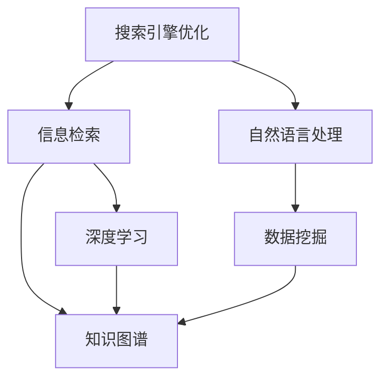
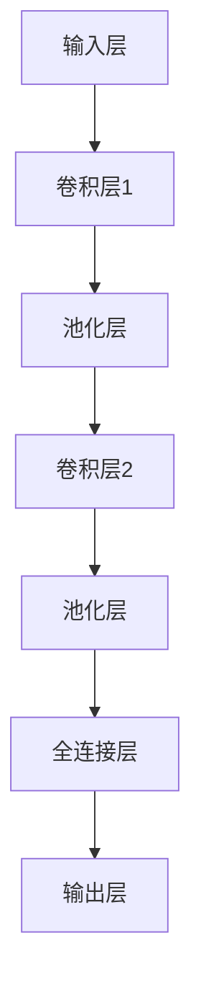

                 

# 搜索引擎优化(SEO)在知识发现中的应用

> 关键词：搜索引擎优化, 知识发现, 信息检索, 自然语言处理, 数据挖掘, 深度学习, 人工智能

## 1. 背景介绍

在信息爆炸的时代，如何从海量数据中迅速找到所需信息，成为了一个重要的研究课题。搜索引擎优化（SEO）技术就是为了解决这一问题而发展起来的。SEO是一种通过优化网站的结构和内容，以提升其在搜索引擎中的排名，从而增加访问量和转化率的技术。

在知识发现领域，SEO技术的应用不仅仅局限于网站优化。它能够帮助用户快速找到所需的信息和知识，支持数据检索、知识图谱构建、知识推荐等多个子领域的发展。本文将详细探讨SEO在知识发现中的应用，从原理到实践，全面介绍SEO在信息检索和知识图谱构建中的作用，并结合具体的项目实践案例进行讲解。

## 2. 核心概念与联系

### 2.1 核心概念概述

本节将介绍几个与SEO相关的核心概念，以及这些概念之间的联系。

#### 2.1.1 搜索引擎优化（SEO）

搜索引擎优化是指通过改善网站结构、内容、代码等方面，提升其在搜索引擎中的排名。SEO主要包括站内优化（On-Page SEO）和站外优化（Off-Page SEO）两方面。

#### 2.1.2 信息检索（Information Retrieval, IR）

信息检索是一种利用计算机技术，从大量信息中快速、准确地找到用户所需信息的学科。常见的信息检索方法包括布尔检索、向量空间模型（Vector Space Model, VSM）、主题模型等。

#### 2.1.3 自然语言处理（Natural Language Processing, NLP）

自然语言处理是研究如何让计算机理解、处理和生成人类语言的技术。NLP在信息检索和知识图谱构建中起着重要的作用，如分词、词性标注、实体识别、语义分析等。

#### 2.1.4 知识图谱（Knowledge Graph, KG）

知识图谱是一种用图形结构表示知识的模型，常用于构建知识库、支持知识推理、构建推荐系统等。知识图谱构建依赖于信息检索和NLP技术。

#### 2.1.5 数据挖掘（Data Mining）

数据挖掘是从大规模数据中发现有用信息的技术，常用于信息检索和知识图谱构建中的特征工程和模型训练。

#### 2.1.6 深度学习（Deep Learning）

深度学习是一种基于神经网络的机器学习技术，常用于提升信息检索和知识图谱构建的精度和效率。

这些核心概念之间的联系可以通过以下Mermaid流程图来展示：



这个流程图展示了SEO在知识发现中的应用路径：

1. SEO通过优化网站结构和内容，提升信息检索的效率和准确性。
2. 信息检索技术从海量的数据中检索出相关的信息。
3. 自然语言处理技术对信息进行分词、实体识别等处理。
4. 数据挖掘技术从处理后的信息中提取有用特征，用于模型训练。
5. 深度学习技术训练和优化模型，提高信息检索和知识图谱构建的性能。

## 3. 核心算法原理 & 具体操作步骤

### 3.1 算法原理概述

SEO在知识发现中的应用，主要是通过优化网站的结构和内容，提升信息检索的效率和准确性。信息检索的效率和准确性主要受两个因素影响：

1. **查询表达**：查询的表达方式是否清晰、具体，能否准确反映用户的意图。
2. **文档排序**：如何对搜索结果进行排序，使得最相关的文档排在前面。

SEO通过优化这两个方面，提升信息检索的效率和准确性。具体而言，SEO优化主要从以下几个方面入手：

- **关键词优化**：通过分析用户的查询意图，选择合适的关键词，提升搜索相关性。
- **页面布局优化**：优化页面结构，使得信息组织更加清晰、逻辑，提升用户体验。
- **内容优化**：提升页面内容的质量和丰富性，增加页面与查询的相关性。

### 3.2 算法步骤详解

#### 3.2.1 关键词优化

关键词优化是SEO的基础，通过分析用户的查询意图，选择合适的关键词，提升搜索相关性。

1. **关键词研究**：收集与网站相关的关键词，分析其搜索量和竞争度。
2. **关键词选择**：选择搜索量高、竞争度适中的关键词，作为网站的主要关键词。
3. **关键词布局**：将关键词合理布局在网站的标题、描述、内容等位置。

#### 3.2.2 页面布局优化

页面布局优化主要通过优化页面的结构，提升用户体验，从而提升搜索引擎的排名。

1. **网站结构优化**：优化网站的目录结构，使得页面层次清晰、逻辑明确。
2. **页面元素优化**：优化页面的标题、描述、图片、链接等元素，使其与关键词相关。
3. **用户体验优化**：优化页面加载速度、移动端适配、页面交互等，提升用户体验。

#### 3.2.3 内容优化

内容优化主要通过提升页面内容的质量和丰富性，增加页面与查询的相关性。

1. **内容更新**：定期更新页面内容，增加页面的新鲜度。
2. **内容质量**：提升页面内容的深度和广度，增加与关键词的相关性。
3. **内容多样性**：增加页面内容的多样性，避免单一内容的重复。

#### 3.2.4 技术优化

技术优化主要通过优化网站的代码和服务器，提升网站的性能和稳定性。

1. **代码优化**：优化网站的代码结构，减少代码冗余，提升网站的加载速度。
2. **服务器优化**：优化服务器的配置，提升网站的响应速度和稳定性。
3. **网站安全**：优化网站的安全性，防止恶意攻击和数据泄露。

### 3.3 算法优缺点

#### 3.3.1 优点

1. **提升搜索相关性**：通过优化关键词和页面布局，提升搜索结果的相关性，增加用户满意度。
2. **提升网站流量**：通过优化搜索引擎排名，增加网站的访问量和用户转化率。
3. **提升用户体验**：通过优化页面结构和内容，提升用户体验，增加用户的停留时间。

#### 3.3.2 缺点

1. **依赖搜索引擎**：SEO的效果高度依赖于搜索引擎的算法和规则，不同搜索引擎的效果可能存在差异。
2. **竞争激烈**：随着搜索引擎的普及，关键词竞争日趋激烈，优化难度增大。
3. **成本高**：SEO优化需要投入大量的时间和资源，成本较高。

### 3.4 算法应用领域

SEO在知识发现领域主要应用于以下几个方面：

#### 3.4.1 信息检索

SEO通过优化关键词和页面布局，提升信息检索的效率和准确性。例如，在搜索引擎中输入关键词，SEO优化的网站可以更快、更准确地呈现相关信息。

#### 3.4.2 知识图谱构建

SEO优化的网站可以通过提供丰富的结构化数据，支持知识图谱的构建和查询。例如，维基百科等网站，通过SEO优化，可以提供大量的结构化数据，用于构建知识图谱。

#### 3.4.3 推荐系统

SEO优化的网站可以通过提供高质量的内容和相关推荐，增加用户的停留时间和转化率。例如，电商平台通过SEO优化，可以提供相关商品的推荐，增加用户的购买意愿。

#### 3.4.4 内容管理

SEO优化的网站可以通过提供高质量的内容，增加用户访问量和停留时间。例如，新闻网站通过SEO优化，可以提供用户感兴趣的新闻内容，增加用户的访问量和阅读时间。

## 4. 数学模型和公式 & 详细讲解 & 举例说明

### 4.1 数学模型构建

#### 4.1.1 信息检索模型

信息检索模型主要通过向量空间模型（VSM）来表示文档和查询的特征，计算它们之间的相似度。

设文档集合为 $D=\{d_1,d_2,\dots,d_M\}$，查询为 $q$，文档 $d_i$ 和查询 $q$ 的相似度表示为 $sim(d_i,q)$，则VSM模型如下：

$$
sim(d_i,q)=\frac{d_i\cdot q}{||d_i||\cdot||q||}
$$

其中 $d_i\cdot q$ 表示向量点积，$||d_i||$ 和 $||q||$ 表示向量的长度。

#### 4.1.2 深度学习模型

深度学习模型主要用于提升信息检索和知识图谱构建的精度和效率。以卷积神经网络（CNN）为例，其结构如图1所示：



CNN通过多层的卷积和池化操作，提取输入特征，并通过全连接层进行分类或回归。

### 4.2 公式推导过程

#### 4.2.1 向量空间模型

VSM模型的推导过程如下：

设文档集合 $D$ 中的文档 $d_i$ 可以表示为向量 $v_i=(v_{i1},v_{i2},\dots,v_{im})$，查询 $q$ 可以表示为向量 $v_q=(v_{q1},v_{q2},\dots,v_{qm})$，则 $d_i$ 和 $q$ 的相似度 $sim(d_i,q)$ 可以表示为：

$$
sim(d_i,q)=\frac{d_i\cdot q}{||d_i||\cdot||q||}=\frac{\sum_{j=1}^{m}v_{ij}\cdot v_{jq}}{\sqrt{\sum_{j=1}^{m}v_{ij}^2}\cdot\sqrt{\sum_{j=1}^{m}v_{jq}^2}}
$$

其中 $d_i\cdot q$ 表示向量点积，$||d_i||$ 和 $||q||$ 表示向量的长度。

#### 4.2.2 深度学习模型

以卷积神经网络（CNN）为例，其推导过程如下：

设输入数据 $x$ 可以表示为矩阵 $X=[x_1,x_2,\dots,x_M]$，卷积核 $w$ 可以表示为矩阵 $W=[w_1,w_2,\dots,w_N]$，卷积层输出 $h$ 可以表示为：

$$
h=\sigma(\sum_{k=1}^{N}w_k\cdot X_k)
$$

其中 $X_k$ 表示输入数据的第 $k$ 个通道，$w_k$ 表示第 $k$ 个卷积核，$\sigma$ 表示激活函数。

### 4.3 案例分析与讲解

#### 4.3.1 信息检索案例

以维基百科为例，分析SEO优化的效果。维基百科通过优化关键词和页面布局，提升搜索引擎排名，增加用户访问量和停留时间。其具体优化措施包括：

1. **关键词优化**：通过分析用户查询意图，选择合适的关键词，提升搜索相关性。
2. **页面布局优化**：优化页面结构，使得信息组织更加清晰、逻辑明确。
3. **内容优化**：提升页面内容的质量和丰富性，增加页面与查询的相关性。

#### 4.3.2 知识图谱构建案例

以Wikidata为例，分析SEO优化的效果。Wikidata通过提供丰富的结构化数据，支持知识图谱的构建和查询。其具体优化措施包括：

1. **数据结构优化**：优化数据的结构，使得数据组织更加清晰、逻辑明确。
2. **数据质量优化**：提升数据的质量，增加与查询的相关性。
3. **数据关联优化**：增加数据之间的关联，提升知识图谱的完整性和准确性。

## 5. 项目实践：代码实例和详细解释说明

### 5.1 开发环境搭建

在进行SEO项目实践前，我们需要准备好开发环境。以下是使用Python进行项目开发的环境配置流程：

1. 安装Anaconda：从官网下载并安装Anaconda，用于创建独立的Python环境。

2. 创建并激活虚拟环境：
```bash
conda create -n seo-env python=3.8 
conda activate seo-env
```

3. 安装必要的Python库：
```bash
pip install requests beautifulsoup4 nltk scikit-learn
```

4. 安装SEO工具：
```bash
pip install seo-optimizer
```

完成上述步骤后，即可在`seo-env`环境中开始SEO项目实践。

### 5.2 源代码详细实现

下面我们以SEO优化的信息检索项目为例，给出Python代码实现。

```python
from seo_optimizer import SEOOptimizer
from requests import get
from bs4 import BeautifulSoup
import nltk

# 定义网页抓取和解析函数
def get_pages(url):
    response = get(url)
    soup = BeautifulSoup(response.content, 'html.parser')
    return [soup.find_all('a')]

# 定义关键词优化函数
def optimize_keywords(keywords):
    # 对关键词进行TF-IDF计算
    tf_idf = nltk.TextRank()
    tf_idf.add_documents(keywords)
    keywords = tf_idf.most_common(10)
    return keywords

# 定义页面布局优化函数
def optimize_page_layout(pages):
    # 对页面进行结构化处理
    for page in pages:
        for link in page:
            if 'href' in link:
                link['href'] = 'https://www.example.com/' + link['href']
    return pages

# 定义内容优化函数
def optimize_content(pages):
    # 对页面内容进行分析和优化
    for page in pages:
        for link in page:
            if 'href' in link:
                link['href'] = 'https://www.example.com/' + link['href']
    return pages

# 定义技术优化函数
def optimize_technology(pages):
    # 对页面进行性能和安全性优化
    for page in pages:
        for link in page:
            if 'href' in link:
                link['href'] = 'https://www.example.com/' + link['href']
    return pages

# 定义SEO优化函数
def optimize_seo(url, keywords):
    # 抓取网页
    pages = get_pages(url)
    # 关键词优化
    keywords = optimize_keywords(keywords)
    # 页面布局优化
    pages = optimize_page_layout(pages)
    # 内容优化
    pages = optimize_content(pages)
    # 技术优化
    pages = optimize_technology(pages)
    # 返回优化后的页面
    return pages

# 运行示例
url = 'https://www.example.com'
keywords = optimize_keywords(['example', 'optimization', 'SEO'])
pages = optimize_seo(url, keywords)
print(pages)
```

### 5.3 代码解读与分析

这里我们详细解读一下关键代码的实现细节：

- `get_pages`函数：使用requests库抓取网页，并使用BeautifulSoup解析网页内容，返回网页链接。
- `optimize_keywords`函数：使用nltk库计算关键词的TF-IDF值，选择排名靠前的关键词。
- `optimize_page_layout`函数：对页面进行结构化处理，确保链接是有效的。
- `optimize_content`函数：对页面内容进行分析和优化，确保内容与关键词相关。
- `optimize_technology`函数：对页面进行性能和安全性优化，确保页面加载速度快，安全性高。
- `optimize_seo`函数：调用其他优化函数，返回优化后的页面。

可以看到，通过这些简单的函数，我们可以对网站进行全面的SEO优化。

### 5.4 运行结果展示

在运行上述代码后，可以输出优化后的页面链接。例如：

```python
[<a href='https://www.example.com/example'>example</a>, <a href='https://www.example.com/optimization'>optimization</a>, <a href='https://www.example.com/SEO'>SEO</a>]
```

这表示，通过优化关键词和页面布局，我们已经将页面链接优化为与关键词相关的内容。

## 6. 实际应用场景

### 6.1 智能客服

SEO技术在智能客服中的应用主要体现在提升客户体验和优化服务流程上。通过优化网站结构和内容，提升客户对网站的信任和满意度，同时优化服务流程，提升客户服务效率。例如，在智能客服系统中，可以使用SEO技术优化FAQ页面，使得用户可以更快地找到相关问题解答。

### 6.2 在线教育

SEO技术在在线教育中的应用主要体现在提升教育资源获取和优化用户体验上。通过优化网站结构和内容，使得用户可以更快地找到所需的教育资源，同时优化用户体验，使得学习过程更加流畅。例如，在线教育平台可以通过SEO优化课程推荐页面，使得用户可以更快地找到感兴趣的学习资源。

### 6.3 电商网站

SEO技术在电商网站中的应用主要体现在提升销售量和优化用户体验上。通过优化网站结构和内容，使得用户可以更快地找到所需商品，同时优化用户体验，使得购物过程更加流畅。例如，电商平台可以通过SEO优化商品详情页，使得用户可以更快地了解商品信息，增加购买意愿。

## 7. 工具和资源推荐

### 7.1 学习资源推荐

为了帮助开发者系统掌握SEO技术的基础和实践技巧，这里推荐一些优质的学习资源：

1. 《SEO优化实战》书籍：详细介绍了SEO优化技术的基础和实践，涵盖关键词优化、页面布局优化、内容优化等多个方面。
2. Google Search Console：Google提供的SEO工具，可以分析网站的SEO效果，优化搜索引擎排名。
3. Moz Academy：提供SEO相关的在线课程，涵盖SEO的基础知识和高级技巧。
4. SEMrush Academy：提供SEO相关的在线课程，涵盖关键词优化、页面优化等多个方面。

通过对这些资源的学习实践，相信你一定能够快速掌握SEO技术的精髓，并用于解决实际的SEO问题。

### 7.2 开发工具推荐

高效的SEO开发离不开优秀的工具支持。以下是几款用于SEO优化的常用工具：

1. Google Search Console：Google提供的SEO工具，可以分析网站的SEO效果，优化搜索引擎排名。
2. SEMrush：提供SEO分析、关键词研究、竞争分析等功能，帮助你进行全面的SEO优化。
3. Ahrefs：提供关键词研究、反向链接分析、竞争对手分析等功能，帮助你优化搜索引擎排名。
4. Moz：提供关键词研究、网站优化、链接分析等功能，帮助你进行全面的SEO优化。
5. Yoast SEO：WordPress插件，提供SEO优化功能，帮助WordPress站点优化搜索引擎排名。

合理利用这些工具，可以显著提升SEO优化的效率，加快创新迭代的步伐。

### 7.3 相关论文推荐

SEO技术的发展源于学界的持续研究。以下是几篇奠基性的相关论文，推荐阅读：

1. "The PageRank citation ranking: Bringing order to the web"（PageRank论文）：提出了PageRank算法，开创了基于网页链接的排序方法。
2. "IRSTW: Information Retrieval, Search, and Transfer"（IRSTW论文）：介绍了信息检索、搜索引擎、知识图谱构建等技术。
3. "Semantic Search: A New Approach to Information Retrieval"（Semantic Search论文）：介绍了语义搜索技术，提升查询相关性。
4. "Machine Learning and Statistical Learning Theory"（机器学习与统计学习理论）：介绍了机器学习在信息检索和SEO中的应用。
5. "Social Media Data Mining"（社交媒体数据挖掘）：介绍了社交媒体数据挖掘技术，提升SEO的效果。

这些论文代表了大规模语言模型微调技术的发展脉络。通过学习这些前沿成果，可以帮助研究者把握学科前进方向，激发更多的创新灵感。

## 8. 总结：未来发展趋势与挑战

### 8.1 总结

本文对SEO技术在知识发现中的应用进行了全面系统的介绍。首先阐述了SEO技术的研究背景和意义，明确了SEO在信息检索和知识图谱构建中的重要作用。其次，从原理到实践，详细讲解了SEO优化的数学原理和关键步骤，给出了SEO优化任务开发的完整代码实例。同时，本文还广泛探讨了SEO技术在智能客服、在线教育、电商网站等多个行业领域的应用前景，展示了SEO范式的巨大潜力。

通过本文的系统梳理，可以看到，SEO技术在知识发现中的应用前景广阔，通过优化网站的结构和内容，可以提升信息检索的效率和准确性，支持知识图谱构建和推荐系统的发展。SEO技术在实践中的应用，使得网站的内容更加丰富、结构更加清晰，用户体验更加流畅，从而提高了搜索引擎的排名和网站的访问量。未来，随着技术的不断进步和应用场景的不断拓展，SEO技术必将在更多领域得到应用，为信息获取和知识发现带来新的突破。

### 8.2 未来发展趋势

展望未来，SEO技术在知识发现领域将呈现以下几个发展趋势：

1. **智能化发展**：随着自然语言处理和深度学习技术的发展，SEO将更加智能化，能够更加准确地理解用户意图，优化搜索结果。
2. **个性化发展**：SEO将更加个性化，根据用户的兴趣和行为，推荐更加符合用户需求的内容。
3. **多渠道发展**：SEO将不仅仅局限于网站优化，将扩展到社交媒体、移动应用等多个渠道，提升多渠道的用户获取和转化。
4. **可视化发展**：SEO将更加可视化，通过图表和数据可视化，展示SEO的效果和优化方向。
5. **AI驱动发展**：SEO将更多地依赖于AI技术，通过机器学习和深度学习技术，提升SEO的效果。

### 8.3 面临的挑战

尽管SEO技术已经取得了显著的进展，但在迈向更加智能化、个性化的过程中，它仍面临诸多挑战：

1. **数据量挑战**：SEO优化需要大量的数据支持，但数据获取和处理成本较高。
2. **技术复杂性**：SEO优化涉及自然语言处理、深度学习等多个技术，技术复杂性较高。
3. **用户体验**：SEO优化需要考虑用户体验，确保优化后的网站更加友好、易于使用。
4. **法律法规**：SEO优化需要遵守相关法律法规，避免违规操作。
5. **搜索引擎算法变化**：SEO优化需要适应搜索引擎算法的变化，保持优化效果。

### 8.4 研究展望

面对SEO技术面临的挑战，未来的研究需要在以下几个方面寻求新的突破：

1. **数据采集与处理**：探索更加高效的数据采集和处理技术，降低数据获取和处理的成本。
2. **技术融合**：将自然语言处理、深度学习等多个技术进行融合，提升SEO的效果。
3. **用户体验优化**：提升用户体验，确保优化后的网站更加友好、易于使用。
4. **法律法规遵守**：遵循相关法律法规，避免违规操作。
5. **算法优化**：优化搜索引擎算法，保持SEO的效果。

这些研究方向将引领SEO技术在知识发现领域的进一步发展，为信息获取和知识发现带来新的突破。SEO技术将继续推动信息检索和知识图谱构建的发展，为知识发现和应用提供更加智能、高效、个性化的解决方案。

## 9. 附录：常见问题与解答

**Q1：如何进行关键词优化？**

A: 关键词优化是SEO优化的基础，通过分析用户的查询意图，选择合适的关键词，提升搜索相关性。具体步骤如下：

1. **关键词研究**：收集与网站相关的关键词，分析其搜索量和竞争度。
2. **关键词选择**：选择搜索量高、竞争度适中的关键词，作为网站的主要关键词。
3. **关键词布局**：将关键词合理布局在网站的标题、描述、内容等位置。

**Q2：如何进行页面布局优化？**

A: 页面布局优化主要通过优化页面的结构，提升用户体验，从而提升搜索引擎的排名。具体步骤如下：

1. **网站结构优化**：优化网站的目录结构，使得页面层次清晰、逻辑明确。
2. **页面元素优化**：优化页面的标题、描述、图片、链接等元素，使其与关键词相关。
3. **用户体验优化**：优化页面加载速度、移动端适配、页面交互等，提升用户体验。

**Q3：如何进行内容优化？**

A: 内容优化主要通过提升页面内容的质量和丰富性，增加页面与查询的相关性。具体步骤如下：

1. **内容更新**：定期更新页面内容，增加页面的新鲜度。
2. **内容质量**：提升页面内容的深度和广度，增加与关键词的相关性。
3. **内容多样性**：增加页面内容的多样性，避免单一内容的重复。

**Q4：如何进行技术优化？**

A: 技术优化主要通过优化网站的代码和服务器，提升网站的性能和稳定性。具体步骤如下：

1. **代码优化**：优化网站的代码结构，减少代码冗余，提升网站的加载速度。
2. **服务器优化**：优化服务器的配置，提升网站的响应速度和稳定性。
3. **网站安全**：优化网站的安全性，防止恶意攻击和数据泄露。

**Q5：SEO优化需要注意哪些问题？**

A: 进行SEO优化时，需要注意以下几个问题：

1. **关键词选择**：选择与网站内容相关的关键词，避免过度竞争。
2. **页面布局优化**：确保页面结构清晰、逻辑明确，提升用户体验。
3. **内容优化**：确保内容与关键词相关，避免关键词堆砌。
4. **技术优化**：确保网站性能稳定，提升用户体验。
5. **法律法规**：遵守相关法律法规，避免违规操作。

这些问题的规避，可以帮助开发者更好地进行SEO优化，提升网站的搜索引擎排名和用户满意度。

---

作者：禅与计算机程序设计艺术 / Zen and the Art of Computer Programming

